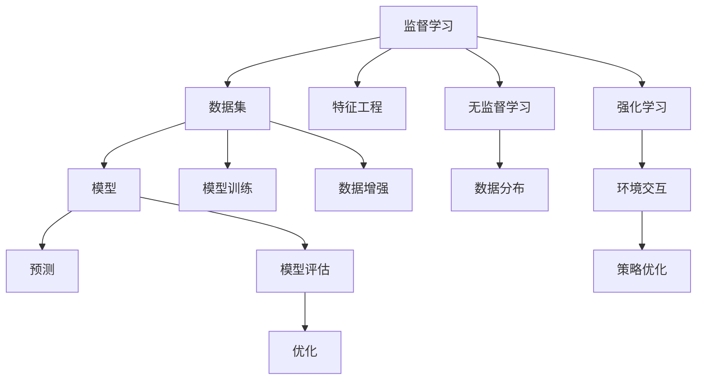

                 

# 机器学习 原理与代码实例讲解

## 1. 背景介绍

### 1.1 问题由来
随着人工智能(AI)技术的发展，机器学习已成为解决各类复杂问题的重要工具。其广泛应用在推荐系统、图像识别、语音识别、自然语言处理等众多领域。然而，机器学习的原理和算法实现仍然具有一定的复杂性，如何深入理解机器学习的基本原理，掌握其实现方法，是每一位数据科学家的必修课。

### 1.2 问题核心关键点
本文将围绕机器学习的基本概念和原理展开，介绍监督学习、无监督学习、强化学习等核心算法，并结合Python代码实例，详细讲解机器学习的各个步骤和技术细节。通过学习本文，读者能够掌握机器学习的核心思想和实现方法，具备自主构建和优化模型的能力。

### 1.3 问题研究意义
理解机器学习的原理和算法，有助于我们深入挖掘数据中的潜在模式，构建高效的数据分析模型。同时，能够帮助读者把握机器学习的最新进展和技术趋势，为未来的技术创新和应用开发打下坚实基础。

## 2. 核心概念与联系

### 2.1 核心概念概述

为更好地理解机器学习算法，本节将介绍几个密切相关的核心概念：

- **监督学习(Supervised Learning)**：给定已标注的训练数据集，模型通过学习输入和输出之间的映射关系，从而能够对新的未标注数据进行预测。
- **无监督学习(Unsupervised Learning)**：给定未标注的数据集，模型通过学习数据的内部结构或分布，挖掘隐藏的知识或结构。
- **强化学习(Reinforcement Learning)**：通过与环境交互，模型在每个步骤中根据动作的奖励或惩罚不断优化策略，最终达到某个目标状态。
- **特征工程(Feature Engineering)**：在数据预处理阶段，通过选取、构造、转换等方式，提高数据的质量和表达能力，从而提升模型的预测性能。
- **模型评估与优化(Model Evaluation and Optimization)**：通过设计合理的评估指标，不断迭代优化模型参数，确保模型的准确性和泛化能力。

这些概念之间的逻辑关系可以通过以下Mermaid流程图来展示：



这个流程图展示了几大机器学习概念及其之间的关系：

1. 监督学习通过已标注的数据集训练模型，进行预测。
2. 无监督学习挖掘数据的内在结构，提高模型的泛化能力。
3. 强化学习通过环境交互，不断优化策略。
4. 特征工程提升数据质量，增强模型性能。
5. 模型评估优化模型，确保预测准确性。

## 3. 核心算法原理 & 具体操作步骤

### 3.1 算法原理概述

机器学习的核心思想是通过数据驱动，构建模型以解决实际问题。其基本流程包括数据准备、模型训练、模型评估和模型优化等步骤。

- **数据准备**：从数据源获取数据，进行清洗、预处理等操作，生成可供模型训练的特征向量。
- **模型训练**：根据训练数据集，通过优化算法调整模型参数，使其最大化训练数据集的预测准确度。
- **模型评估**：使用测试数据集评估模型的性能，通过评估指标如准确率、精确率、召回率等，判断模型效果。
- **模型优化**：通过调整模型参数、优化算法等手段，提高模型性能，避免过拟合，确保模型泛化能力。

### 3.2 算法步骤详解

机器学习算法的一般步骤如下：

1. **数据准备**：
   - 数据收集：获取各类原始数据，如图像、文本、音频等。
   - 数据清洗：去除异常值、重复值等噪声数据，确保数据质量。
   - 特征工程：对原始数据进行特征提取、选择、构造等处理，生成可用于模型训练的特征向量。

2. **模型训练**：
   - 选择合适的算法，如线性回归、决策树、神经网络等。
   - 划分训练集和验证集，用于模型训练和参数调整。
   - 选择优化算法，如梯度下降、Adam、RMSprop等，调整模型参数，使模型最大化训练集上的损失函数。

3. **模型评估**：
   - 使用测试集评估模型性能，计算各类评估指标。
   - 分析模型在测试集上的表现，评估其泛化能力。
   - 根据评估结果，调整模型参数或选择新的模型，进行迭代优化。

4. **模型优化**：
   - 调整模型复杂度，避免过拟合。
   - 引入正则化技术，如L1正则、L2正则等，减少模型复杂度。
   - 进行交叉验证，选择最优的模型参数。
   - 优化算法超参数，如学习率、批量大小等，提高模型训练效率。

### 3.3 算法优缺点

机器学习算法具有以下优点：

- 数据驱动：基于大量数据构建模型，能够发现数据中的潜在规律和模式。
- 通用性强：适用于多种问题，包括分类、回归、聚类等。
- 可解释性强：部分算法如决策树、线性回归等，能够提供清晰的解释和逻辑。
- 不断优化：通过不断迭代，模型性能逐步提高。

同时，机器学习算法也存在一些局限性：

- 数据依赖性强：需要大量高质量的标注数据，数据收集和标注成本较高。
- 模型复杂度高：部分算法需要调参较多，模型复杂度高。
- 泛化能力有限：对于数据分布发生变化的情况，模型可能表现不佳。
- 无法处理噪声数据：对噪声数据的鲁棒性较差，容易受到干扰。

## 4. 数学模型和公式 & 详细讲解 & 举例说明

### 4.1 数学模型构建

机器学习模型通常包括训练集和测试集，训练集用于模型训练，测试集用于模型评估。假设模型为$f(x)$，训练集为$(x_i, y_i)$，测试集为$(x_j, y_j)$。训练模型的目标是最小化损失函数$L(f(x))$。

常见损失函数包括：

- 均方误差损失(MSE)：
$$
L(y, \hat{y}) = \frac{1}{n} \sum_{i=1}^n (y_i - \hat{y}_i)^2
$$

- 交叉熵损失：
$$
L(y, \hat{y}) = -\frac{1}{n} \sum_{i=1}^n y_i \log \hat{y}_i + (1 - y_i) \log (1 - \hat{y}_i)
$$

- 对数损失：
$$
L(y, \hat{y}) = -\frac{1}{n} \sum_{i=1}^n y_i \log \hat{y}_i + (1 - y_i) \log (1 - \hat{y}_i)
$$

### 4.2 公式推导过程

以线性回归为例，介绍模型训练的数学推导过程。

线性回归模型可以表示为：
$$
\hat{y} = \theta_0 + \theta_1 x_1 + \theta_2 x_2 + ... + \theta_n x_n
$$

其中，$\theta_0, \theta_1, ..., \theta_n$为模型参数，$x_1, x_2, ..., x_n$为输入特征，$\hat{y}$为模型预测输出。

通过最小二乘法，求解模型参数$\theta_0, \theta_1, ..., \theta_n$，使得模型在训练集上最小化均方误差损失。具体推导如下：

1. 计算训练集的损失函数$L(\theta)$：
$$
L(\theta) = \frac{1}{2n} \sum_{i=1}^n (y_i - \hat{y}_i)^2
$$

2. 对$\theta$求偏导，并令导数为0：
$$
\frac{\partial L(\theta)}{\partial \theta_k} = \frac{1}{n} \sum_{i=1}^n (x_{ik} - \bar{x}_{ik}) (\hat{y}_i - y_i) = 0
$$

3. 解方程组：
$$
\begin{cases}
\frac{\partial L(\theta)}{\partial \theta_0} = \frac{1}{n} \sum_{i=1}^n (y_i - \hat{y}_i) = 0 \\
\frac{\partial L(\theta)}{\partial \theta_k} = \frac{1}{n} \sum_{i=1}^n (x_{ik} - \bar{x}_{ik}) (\hat{y}_i - y_i) = 0 \quad (k=1,2,...,n)
\end{cases}
$$

4. 得到模型参数估计值：
$$
\hat{\theta} = (X^T X)^{-1} X^T Y
$$

其中$X$为特征矩阵，$Y$为输出向量。

### 4.3 案例分析与讲解

以Iris数据集为例，展示线性回归模型的构建和训练过程。

假设要预测鸢尾花的花萼长度和花瓣宽度，数据集包含150个样本，每个样本有4个特征。

1. 数据准备：
   ```python
   import pandas as pd
   from sklearn.model_selection import train_test_split
   from sklearn.linear_model import LinearRegression

   df = pd.read_csv('iris.csv')
   X = df[['SepalLengthCm', 'PetalWidthCm']]
   y = df['Species']
   X_train, X_test, y_train, y_test = train_test_split(X, y, test_size=0.2, random_state=42)
   ```

2. 模型训练：
   ```python
   model = LinearRegression()
   model.fit(X_train, y_train)
   ```

3. 模型评估：
   ```python
   from sklearn.metrics import mean_squared_error

   y_pred = model.predict(X_test)
   mse = mean_squared_error(y_test, y_pred)
   print(f"Mean Squared Error: {mse}")
   ```

以上代码展示了线性回归模型的构建和评估过程，包括数据准备、模型训练和模型评估等步骤。通过调整模型参数和优化算法，可以进一步提升模型性能。

## 5. 项目实践：代码实例和详细解释说明

### 5.1 开发环境搭建

在进行机器学习项目实践前，需要准备好开发环境。以下是使用Python进行Scikit-learn开发的开发环境配置流程：

1. 安装Anaconda：从官网下载并安装Anaconda，用于创建独立的Python环境。

2. 创建并激活虚拟环境：
```bash
conda create -n ml-env python=3.8 
conda activate ml-env
```

3. 安装Scikit-learn：
```bash
conda install scikit-learn
```

4. 安装其他各类工具包：
```bash
pip install numpy pandas matplotlib seaborn sklearn statsmodels matplotlib
```

完成上述步骤后，即可在`ml-env`环境中开始机器学习项目的开发。

### 5.2 源代码详细实现

下面我们以线性回归和决策树为例，给出使用Scikit-learn进行模型构建和训练的Python代码实现。

#### 线性回归

首先，定义训练集和测试集：

```python
from sklearn.linear_model import LinearRegression
from sklearn.datasets import load_boston

boston = load_boston()
X = boston.data
y = boston.target

# 划分训练集和测试集
X_train, X_test, y_train, y_test = train_test_split(X, y, test_size=0.2, random_state=42)
```

然后，定义模型并训练：

```python
model = LinearRegression()
model.fit(X_train, y_train)
```

最后，在测试集上评估模型：

```python
from sklearn.metrics import mean_squared_error, r2_score

y_pred = model.predict(X_test)
mse = mean_squared_error(y_test, y_pred)
r2 = r2_score(y_test, y_pred)

print(f"Mean Squared Error: {mse}")
print(f"R^2 Score: {r2}")
```

#### 决策树

首先，定义训练集和测试集：

```python
from sklearn.tree import DecisionTreeRegressor
from sklearn.datasets import load_boston

boston = load_boston()
X = boston.data
y = boston.target

# 划分训练集和测试集
X_train, X_test, y_train, y_test = train_test_split(X, y, test_size=0.2, random_state=42)
```

然后，定义模型并训练：

```python
model = DecisionTreeRegressor()
model.fit(X_train, y_train)
```

最后，在测试集上评估模型：

```python
from sklearn.metrics import mean_squared_error, r2_score

y_pred = model.predict(X_test)
mse = mean_squared_error(y_test, y_pred)
r2 = r2_score(y_test, y_pred)

print(f"Mean Squared Error: {mse}")
print(f"R^2 Score: {r2}")
```

以上代码展示了使用Scikit-learn进行线性回归和决策树模型构建和训练的过程。Scikit-learn库封装了常用的机器学习算法，简化了模型构建和训练的代码实现。

### 5.3 代码解读与分析

让我们再详细解读一下关键代码的实现细节：

**数据准备**：
- `train_test_split`：将数据集划分为训练集和测试集，用于模型训练和评估。
- `load_boston`：加载波士顿房价数据集，提供回归问题的示例数据。

**模型训练**：
- `LinearRegression`：线性回归模型，用于处理线性问题。
- `DecisionTreeRegressor`：决策树回归模型，用于处理非线性问题。

**模型评估**：
- `mean_squared_error`：均方误差损失函数，用于评估模型预测的准确性。
- `r2_score`：决定系数，用于评估模型的解释能力。

以上步骤展示了机器学习项目的基本流程，包括数据准备、模型构建、模型训练和模型评估等。通过学习这些代码实现细节，读者可以更好地理解和掌握机器学习的基本算法和技术。

## 6. 实际应用场景

### 6.1 金融风险评估

金融风险评估是机器学习在金融领域的重要应用之一。银行和金融机构需要实时评估客户的信用风险，预测其违约概率。通过机器学习模型，金融机构能够快速准确地进行风险评估，从而降低贷款违约率，控制财务风险。

具体而言，可以收集客户的各类财务数据、行为数据等，构建特征向量，训练机器学习模型。模型可以基于历史数据和特征，预测客户的违约概率，辅助金融机构制定风险控制策略。

### 6.2 推荐系统

推荐系统是机器学习在电商、社交媒体、视频网站等互联网平台的重要应用之一。通过机器学习模型，平台能够根据用户的历史行为和兴趣，推荐符合其需求的商品或内容，提升用户体验和平台收益。

具体而言，可以收集用户的浏览、点击、评分等数据，构建特征向量，训练推荐模型。模型可以根据用户历史行为，预测其对不同商品或内容的兴趣，从而生成个性化的推荐结果。

### 6.3 自然语言处理

自然语言处理(NLP)是机器学习在语言领域的重要应用之一。通过机器学习模型，系统能够进行文本分类、情感分析、命名实体识别、机器翻译等任务，提升语言处理的智能化水平。

具体而言，可以收集大量文本数据，进行预处理和特征提取，训练文本分类、情感分析、命名实体识别等模型。模型可以自动理解和处理自然语言，为NLP应用提供强大的支持。

### 6.4 未来应用展望

随着机器学习技术的不断发展，其在金融、电商、语言处理等领域的应用将更加广泛和深入。未来，机器学习将逐步应用于更多行业，为各行各业带来变革性的影响。

在医疗领域，机器学习可以用于疾病预测、药物研发等，提高医疗服务的智能化水平。在教育领域，机器学习可以用于智能辅导、学习分析等，提升教育质量和公平性。在交通领域，机器学习可以用于智能交通管理、自动驾驶等，提高交通效率和安全性。

## 7. 工具和资源推荐

### 7.1 学习资源推荐

为了帮助开发者系统掌握机器学习的理论基础和实践技巧，这里推荐一些优质的学习资源：

1. 《机器学习实战》：周志华老师的经典著作，介绍了机器学习的基本概念和算法实现，适合初学者入门。
2. 《Python数据科学手册》：Jake VanderPlas老师的著作，介绍了Python在数据科学和机器学习中的应用，适合进阶学习。
3. 《深度学习》（Ian Goodfellow等著）：介绍了深度学习的基本原理和实现方法，适合深入学习。
4. Kaggle竞赛：Kaggle是数据科学和机器学习的平台，提供各类竞赛和数据集，适合实战练习。
5. Coursera机器学习课程：斯坦福大学的Coursera课程，由Andrew Ng主讲，详细讲解了机器学习的基本概念和算法实现。

通过学习这些资源，相信你一定能够快速掌握机器学习的基本思想和实现方法，具备自主构建和优化模型的能力。

### 7.2 开发工具推荐

高效的开发离不开优秀的工具支持。以下是几款用于机器学习开发的常用工具：

1. Scikit-learn：Python的机器学习库，封装了常用的机器学习算法，易于使用。
2. TensorFlow：由Google主导开发的深度学习框架，支持分布式计算和GPU加速。
3. PyTorch：由Facebook开发的深度学习框架，支持动态计算图和GPU加速。
4. Jupyter Notebook：开源的交互式笔记本，支持Python、R等语言，方便开发和分享。
5. Anaconda：Python的集成环境，支持虚拟环境管理，方便开发和部署。

合理利用这些工具，可以显著提升机器学习项目的开发效率，加快创新迭代的步伐。

### 7.3 相关论文推荐

机器学习的发展源于学界的持续研究。以下是几篇奠基性的相关论文，推荐阅读：

1. **《机器学习》（周志华著）**：介绍了机器学习的基本概念和算法实现，适合初学者入门。
2. **《深度学习》（Ian Goodfellow等著）**：介绍了深度学习的基本原理和实现方法，适合深入学习。
3. **《AdaBoost: A New Learning Algorithm》（H. Drucker）**：介绍了AdaBoost算法的基本思想和实现方法，是机器学习领域的经典论文。
4. **《A Tutorial on Support Vector Regression》（Alex J. Smola和Bernhard Schölkopf）**：介绍了支持向量回归算法的基本思想和实现方法，适合深入学习。

这些论文代表了大数据和机器学习的研究进展，通过学习这些前沿成果，可以帮助研究者把握学科前进方向，激发更多的创新灵感。

## 8. 总结：未来发展趋势与挑战

### 8.1 总结

本文对机器学习的基本原理和算法实现进行了全面系统的介绍。首先阐述了机器学习的基本概念和算法，详细讲解了监督学习、无监督学习、强化学习等核心算法，并通过Python代码实例，展示机器学习算法的实现方法。通过学习本文，读者能够掌握机器学习的基本思想和实现方法，具备自主构建和优化模型的能力。

### 8.2 未来发展趋势

展望未来，机器学习技术将呈现以下几个发展趋势：

1. **自动化和智能化**：未来机器学习将更加自动化和智能化，通过自动化特征工程和模型选择，降低人工干预，提高模型性能。
2. **联邦学习**：在数据隐私和安全问题日益严峻的今天，联邦学习将发挥重要作用，通过分布式训练，保护数据隐私。
3. **模型压缩和加速**：机器学习模型参数量不断增加，模型压缩和加速成为重要研究方向，研究如何提高模型推理效率和计算速度。
4. **跨领域和跨模态学习**：机器学习将突破单一模态的限制，跨领域和跨模态学习将带来新的突破。
5. **对抗学习和鲁棒性**：对抗学习技术将进一步发展，机器学习模型将具备更好的鲁棒性和抗干扰能力。

以上趋势凸显了机器学习技术的广阔前景。这些方向的探索发展，必将进一步提升机器学习系统的性能和应用范围，为各行各业带来变革性的影响。

### 8.3 面临的挑战

尽管机器学习技术已经取得了瞩目成就，但在迈向更加智能化、普适化应用的过程中，仍面临诸多挑战：

1. **数据隐私和安全**：机器学习模型需要大量的标注数据，如何保护数据隐私和安全，防止数据泄露，是亟待解决的问题。
2. **模型可解释性**：许多机器学习模型被视为"黑盒"系统，难以解释其内部工作机制和决策逻辑，尤其在医疗、金融等高风险领域，模型的可解释性尤为重要。
3. **模型泛化能力**：部分机器学习模型在特定数据集上表现优异，但在新数据上泛化能力较差，如何提高模型的泛化能力，是研究者面临的重大挑战。
4. **计算资源消耗**：大型机器学习模型需要大量的计算资源，如何降低计算成本，提高模型的训练和推理效率，是工程实践中的重要问题。
5. **算法公平性**：机器学习模型可能会学习到数据中的偏见和歧视，如何设计公平的算法，避免有害的决策输出，是算法设计中的重要课题。

正视机器学习面临的这些挑战，积极应对并寻求突破，将使机器学习技术不断进步，为各行各业带来更加强大的支持和创新。

### 8.4 研究展望

未来机器学习的研究将在以下几个方面寻求新的突破：

1. **模型压缩和加速**：研究如何提高模型推理效率和计算速度，减少计算资源消耗。
2. **自动化和智能化**：通过自动化特征工程和模型选择，降低人工干预，提高模型性能。
3. **联邦学习**：研究如何通过分布式训练，保护数据隐私，提升模型的泛化能力。
4. **跨领域和跨模态学习**：研究如何突破单一模态的限制，实现跨领域和跨模态学习，提升模型的泛化能力。
5. **对抗学习和鲁棒性**：研究如何提高机器学习模型的鲁棒性和抗干扰能力，增强模型的安全性和可靠性。

这些研究方向将引领机器学习技术的发展，为各行各业带来更加强大的支持和创新。相信随着技术的不断进步，机器学习将在更多领域得到应用，为人类社会带来更多的改变和进步。

## 9. 附录：常见问题与解答

**Q1：机器学习算法是否适用于所有数据类型？**

A: 机器学习算法通常适用于结构化数据，如数值型、分类型数据等。对于非结构化数据，如文本、图像等，需要进行预处理和特征工程，才能应用于机器学习模型。

**Q2：如何处理缺失数据？**

A: 处理缺失数据通常有以下几种方法：
- 删除缺失数据：删除包含缺失值的样本，但会导致数据量减少。
- 插值法：通过插值算法填补缺失值，如均值插值、中位数插值等。
- 使用模型预测：使用其他特征预测缺失值，如线性回归、KNN等。

**Q3：如何评估机器学习模型的性能？**

A: 常用的模型评估指标包括：
- 准确率：模型预测结果与真实结果一致的比例。
- 精确率：模型预测为正例中真正为正例的比例。
- 召回率：真实为正例中被模型预测为正例的比例。
- F1分数：精确率和召回率的调和平均值，综合评估模型的性能。
- ROC曲线和AUC值：评估二分类模型性能的有效指标。

**Q4：如何选择适当的机器学习算法？**

A: 选择机器学习算法需要考虑以下几个因素：
- 数据类型：选择合适的数据类型，如回归、分类、聚类等。
- 数据分布：了解数据分布情况，选择合适的算法，如线性回归、决策树等。
- 数据量：数据量较大时，选择深度学习算法，如神经网络、卷积神经网络等。
- 计算资源：计算资源较小时，选择轻量级算法，如逻辑回归、朴素贝叶斯等。

**Q5：机器学习模型的参数调优策略有哪些？**

A: 机器学习模型的参数调优策略包括：
- 网格搜索：遍历指定参数空间，寻找最优参数。
- 随机搜索：随机抽取参数空间内的参数，寻找最优参数。
- 贝叶斯优化：基于贝叶斯理论，动态调整参数搜索范围，提高搜索效率。
- 梯度优化：通过梯度下降等优化算法，不断调整参数，寻找最优参数。

以上这些问题和解答，能够帮助读者更好地理解机器学习的基本概念和实现方法，为后续的机器学习项目开发打下坚实基础。通过不断学习和实践，相信读者将能够在实际项目中灵活运用机器学习算法，实现高效的模型构建和优化。

---

作者：禅与计算机程序设计艺术 / Zen and the Art of Computer Programming

