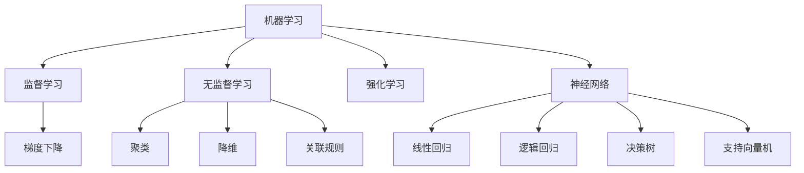

                 

# 机器学习原理与代码实例讲解

> 关键词：机器学习, 深度学习, 监督学习, 无监督学习, 强化学习, 梯度下降, 神经网络, 数据预处理, 模型评估

## 1. 背景介绍

### 1.1 问题由来
在当今数据驱动的时代，机器学习已经成为推动技术进步和商业创新不可或缺的关键手段。无论是数据挖掘、自然语言处理、计算机视觉还是推荐系统，机器学习都发挥着重要的作用。然而，机器学习的核心原理、常用算法及其实际应用，却常常令人望而却步。本博客旨在以通俗易懂的语言，结合实际代码实例，系统讲解机器学习的原理与实践，帮助读者全面掌握这一强大的技术工具。

### 1.2 问题核心关键点
本文将从机器学习的基础原理讲起，逐步深入讲解监督学习、无监督学习和强化学习等关键概念。通过实际的代码实例和案例分析，帮助读者理解算法的本质和实际应用。同时，本文还将介绍机器学习中常用的数据预处理和模型评估方法，以及常见的工具和资源，以便于读者在实践中快速上手。

### 1.3 问题研究意义
机器学习在各个行业中的应用，正在带来前所未有的变革。掌握机器学习的原理和实践，可以帮助开发者更有效地解决实际问题，提升业务效率，发现新的商业机会。机器学习技术的普及，对于推动人工智能技术的发展，实现智能化社会的目标，具有重要意义。

## 2. 核心概念与联系

### 2.1 核心概念概述

为了更好地理解机器学习算法，本节将介绍几个关键概念：

- **机器学习(Machine Learning)**：使用数据训练模型，使其能够自动学习规律，并进行预测或决策的技术。机器学习可以分为监督学习、无监督学习和强化学习等不同类型。
- **监督学习(Supervised Learning)**：利用带有标签的数据集训练模型，使其能够预测新数据的标签。常见的监督学习算法包括线性回归、逻辑回归、决策树、支持向量机等。
- **无监督学习(Unsupervised Learning)**：仅使用未标记的数据训练模型，使其能够发现数据的结构和模式。常见的无监督学习算法包括聚类、降维、关联规则挖掘等。
- **强化学习(Reinforcement Learning)**：通过与环境的交互，学习如何做出最优决策以最大化奖励的策略。强化学习常用于游戏、机器人控制等领域。
- **梯度下降(Gradient Descent)**：一种常用的优化算法，通过不断调整模型参数，最小化损失函数。梯度下降算法分为批量梯度下降、随机梯度下降和小批量梯度下降等不同形式。
- **神经网络(Neural Network)**：由大量人工神经元相互连接组成的计算模型，常用于图像识别、自然语言处理等任务。神经网络通常包含输入层、隐藏层和输出层。

这些核心概念之间的逻辑关系可以通过以下Mermaid流程图来展示：



这个流程图展示出机器学习的核心概念及其相互关系：

1. 机器学习通过数据训练模型，使其能够进行预测或决策。
2. 监督学习、无监督学习和强化学习是机器学习的三大类。
3. 梯度下降是常用的优化算法。
4. 神经网络是机器学习中的一种重要模型，常见的神经网络包括线性回归、逻辑回归、决策树、支持向量机等。

这些概念共同构成了机器学习的学习和应用框架，为模型设计、数据处理和问题解决提供了基础。

## 3. 核心算法原理 & 具体操作步骤
### 3.1 算法原理概述

机器学习的核心算法包括监督学习、无监督学习和强化学习等。以下分别介绍这三类算法的原理。

### 3.2 算法步骤详解

**3.2.1 监督学习**

监督学习的目标是利用带有标签的数据集，训练一个模型，使其能够预测新数据的标签。具体步骤如下：

1. **数据准备**：收集标注数据集，将数据集划分为训练集和测试集。
2. **模型选择**：选择合适的模型架构，如线性回归、逻辑回归、决策树等。
3. **模型训练**：利用训练集数据，通过梯度下降等优化算法，调整模型参数，使其最小化损失函数。
4. **模型评估**：在测试集上评估模型性能，使用指标如准确率、精确率、召回率等。
5. **模型调优**：根据评估结果，调整模型参数或尝试其他模型架构，以提高模型性能。

**3.2.2 无监督学习**

无监督学习的目标是仅利用未标记的数据集，发现数据的结构和模式。具体步骤如下：

1. **数据准备**：收集未标记数据集。
2. **特征提取**：利用降维、聚类等方法，提取数据的特征。
3. **模型训练**：选择合适的无监督学习算法，如K-means聚类、主成分分析等，训练模型。
4. **模型评估**：使用各种指标评估模型效果，如轮廓系数、重构误差等。
5. **模型应用**：将训练好的模型应用于实际问题，发现数据之间的结构和模式。

**3.2.3 强化学习**

强化学习的目标是利用与环境的交互，学习如何做出最优决策以最大化奖励。具体步骤如下：

1. **环境定义**：定义环境的状态、动作和奖励机制。
2. **模型选择**：选择合适的强化学习算法，如Q-learning、SARSA等。
3. **模型训练**：通过与环境的交互，利用梯度下降等优化算法，训练模型。
4. **模型评估**：在测试环境中评估模型性能，使用指标如累积奖励、期望收益等。
5. **模型应用**：将训练好的模型应用于实际问题，进行决策和控制。

### 3.3 算法优缺点

**监督学习**的优点在于数据需要有标签，模型训练过程有指导性，可以提供较好的预测效果。缺点是需要大量标注数据，训练成本较高。

**无监督学习**的优点在于不需要标注数据，适合处理大规模数据集。缺点是无法提供准确的预测结果，效果往往依赖于特征提取的质量。

**强化学习**的优点在于能够自动发现最优策略，适用于复杂环境的决策问题。缺点是训练过程需要大量计算资源和时间，且对环境模型的准确性要求较高。

### 3.4 算法应用领域

监督学习在图像识别、自然语言处理、推荐系统等领域得到了广泛应用。无监督学习在数据挖掘、异常检测、图像降维等领域得到了广泛应用。强化学习在游戏、机器人控制、自动驾驶等领域得到了广泛应用。

## 4. 数学模型和公式 & 详细讲解

### 4.1 数学模型构建

本节将使用数学语言对机器学习的核心算法进行严格的数学刻画。

假设训练集为 $D = \{(x_i, y_i)\}_{i=1}^N$，其中 $x_i$ 表示输入特征， $y_i$ 表示目标标签。

对于监督学习，常见的损失函数为交叉熵损失：

$$
\mathcal{L}(\theta) = -\frac{1}{N} \sum_{i=1}^N y_i \log \hat{y}_i + (1 - y_i) \log (1 - \hat{y}_i)
$$

其中 $\hat{y}_i$ 表示模型预测结果， $\theta$ 表示模型参数。

对于无监督学习，常见的损失函数为重构误差：

$$
\mathcal{L}(\theta) = \frac{1}{N} \sum_{i=1}^N ||x_i - \hat{x}_i||^2
$$

其中 $\hat{x}_i$ 表示模型生成的数据， $x_i$ 表示原始数据。

对于强化学习，常见的损失函数为累积奖励：

$$
\mathcal{L}(\theta) = - \sum_{t=1}^{T} r_t
$$

其中 $r_t$ 表示在第 $t$ 步的奖励， $T$ 表示总步数。

### 4.2 公式推导过程

以下我们以线性回归为例，推导梯度下降算法的数学公式。

假设模型为 $y = \theta^T x + b$，其中 $\theta$ 为模型参数， $x$ 为输入特征， $y$ 为预测结果， $b$ 为偏置项。

模型的损失函数为均方误差损失：

$$
\mathcal{L}(\theta) = \frac{1}{2N} \sum_{i=1}^N (y_i - \hat{y}_i)^2
$$

其中 $\hat{y}_i = \theta^T x_i + b$。

梯度下降算法的更新公式为：

$$
\theta \leftarrow \theta - \eta \nabla_{\theta} \mathcal{L}(\theta)
$$

其中 $\eta$ 为学习率。

对于均方误差损失，梯度为：

$$
\nabla_{\theta} \mathcal{L}(\theta) = \frac{1}{N} \sum_{i=1}^N (y_i - \hat{y}_i)x_i
$$

将梯度代入更新公式，得到：

$$
\theta \leftarrow \theta - \eta \frac{1}{N} \sum_{i=1}^N (y_i - \hat{y}_i)x_i
$$

在实际应用中，为了提高效率，通常采用小批量梯度下降（Mini-batch Gradient Descent），每次迭代使用一批数据更新模型参数。

### 4.3 案例分析与讲解

假设我们有一组训练数据：

| x1 | x2 | y |
| -- | -- | -- |
| 1  | 2  | 1 |
| 2  | 3  | 1 |
| 3  | 2  | 0 |
| 4  | 1  | 1 |

我们需要使用线性回归模型拟合这组数据，并计算梯度下降算法的更新过程。

首先，我们选择线性回归模型 $y = \theta^T x + b$，其中 $\theta = (w_1, w_2, b)$， $x = (x_1, x_2)$， $y = (y_1, y_2, y_3)$。

初始化参数 $\theta = (1, 1, 0)$。

计算均方误差损失：

$$
\mathcal{L}(\theta) = \frac{1}{3} [(1 - 3)^2 + (1 - 5)^2 + (0 - 5)^2] = 7.33
$$

计算梯度：

$$
\nabla_{\theta} \mathcal{L}(\theta) = \frac{1}{3} [(2 - 3, 3 - 5, 0 - 5)] = (-1, -2, -5)
$$

使用梯度下降更新参数：

$$
\theta \leftarrow \theta - \eta \nabla_{\theta} \mathcal{L}(\theta) = (1, 1, 0) - \eta (-1, -2, -5)
$$

例如，当 $\eta = 0.1$ 时，更新后得到：

$$
\theta = (1 + 0.1, 1 - 0.2, 0 + 0.5) = (1.1, 0.8, 0.5)
$$

重复上述过程，直到损失函数收敛。

## 5. 项目实践：代码实例和详细解释说明

### 5.1 开发环境搭建

在进行机器学习实践前，我们需要准备好开发环境。以下是使用Python进行Scikit-learn开发的环境配置流程：

1. 安装Anaconda：从官网下载并安装Anaconda，用于创建独立的Python环境。

2. 创建并激活虚拟环境：
```bash
conda create -n sklearn-env python=3.8 
conda activate sklearn-env
```

3. 安装Scikit-learn：
```bash
conda install scikit-learn
```

4. 安装各类工具包：
```bash
pip install numpy pandas scikit-learn matplotlib tqdm jupyter notebook ipython
```

完成上述步骤后，即可在`sklearn-env`环境中开始机器学习实践。

### 5.2 源代码详细实现

下面我们以线性回归为例，给出使用Scikit-learn进行模型训练的Python代码实现。

首先，定义线性回归模型：

```python
from sklearn.linear_model import LinearRegression
from sklearn.metrics import mean_squared_error

# 加载数据
data = {
    'x1': [1, 2, 3, 4],
    'x2': [2, 3, 2, 1],
    'y': [1, 1, 0, 1]
}

# 创建数据集
X = data['x1'].values.reshape(-1, 1)
y = data['y'].values.reshape(-1, 1)

# 创建模型
model = LinearRegression()

# 训练模型
model.fit(X, y)

# 预测结果
y_pred = model.predict(X)
```

然后，计算模型的均方误差：

```python
mse = mean_squared_error(y, y_pred)
print('Mean Squared Error:', mse)
```

接着，使用梯度下降算法更新模型参数：

```python
eta = 0.1
N = len(X)

for i in range(1000):
    y_pred = model.predict(X)
    gradient = 2 * (y - y_pred) / N
    model.coef_ -= eta * gradient
```

最后，输出更新后的模型参数：

```python
print('Updated coefficients:', model.coef_)
```

以上就是使用Scikit-learn进行线性回归训练的完整代码实现。可以看到，Scikit-learn提供了强大的工具和API，使得机器学习模型开发变得非常便捷。

### 5.3 代码解读与分析

让我们再详细解读一下关键代码的实现细节：

**数据集定义**：
- 首先，我们定义了一个简单的训练数据集，包含了两个特征 $x_1$ 和 $x_2$，以及一个目标标签 $y$。

**模型选择**：
- 接着，我们选择了线性回归模型，并用 `LinearRegression` 类创建了模型实例。

**模型训练**：
- 使用 `fit` 方法对模型进行训练。该方法会自动计算梯度，更新模型参数，以最小化损失函数。

**模型评估**：
- 使用 `mean_squared_error` 函数计算模型的均方误差，以评估模型性能。

**梯度下降算法**：
- 定义了学习率 `eta`，并使用循环迭代进行梯度下降。每次迭代先预测目标标签 `y_pred`，再计算梯度 `gradient`，并更新模型参数。

**模型输出**：
- 最后，输出更新后的模型参数，以验证梯度下降算法的效果。

通过这段代码，我们可以看到Scikit-learn库的使用非常方便，大大简化了模型开发的过程。

当然，工业级的系统实现还需考虑更多因素，如模型的保存和部署、超参数的自动搜索、更多的数据预处理技术等。但核心的算法步骤基本与此类似。

## 6. 实际应用场景

### 6.1 金融信用评估

在金融领域，客户信用评估是一个重要的问题。传统的信用评估依赖于人工审核和复杂的数学模型，效率低且结果不准确。机器学习技术可以自动分析客户的历史行为数据，进行信用评分，从而提高评估效率和准确性。

具体而言，可以收集客户的信用卡使用记录、消费记录、还款记录等数据，通过监督学习模型，学习不同特征对信用评分的影响，从而生成更加精确的信用评估模型。这种基于数据的信用评估方法，有助于金融机构降低风险，优化客户管理。

### 6.2 医疗疾病预测

医疗领域面临大量复杂的疾病预测任务，如癌症诊断、疾病预后等。传统的诊断方法依赖于医生经验，难以应对快速变化的医疗数据。机器学习可以自动分析患者的基因数据、病历记录等，通过监督学习或无监督学习模型，预测患者的疾病风险，帮助医生做出更准确的诊断和治疗决策。

例如，可以使用线性回归模型分析患者的基因表达水平、血液指标等数据，预测其患癌症的风险。这种基于数据的疾病预测方法，有助于提高诊断的准确性和效率，降低医疗成本。

### 6.3 电商平台推荐

电商平台需要实时推荐用户可能感兴趣的商品，提升用户体验和转化率。传统的推荐系统依赖于用户的历史购买记录、浏览记录等，难以捕捉用户的潜在兴趣。机器学习可以自动分析用户的在线行为数据，通过监督学习或无监督学习模型，发现用户的兴趣偏好，生成个性化的推荐列表。

例如，可以使用协同过滤算法分析用户之间的相似性，生成基于用户兴趣的推荐列表。这种基于数据的推荐方法，有助于提升用户的购买率和满意度，增加平台的收入。

### 6.4 未来应用展望

随着机器学习技术的不断进步，其在各个行业的应用将越来越广泛，带来更多的机遇和挑战。

在智慧医疗领域，机器学习可以帮助医生进行疾病预测、诊断和治疗决策，提高医疗服务的智能化水平。

在智能交通领域，机器学习可以优化交通信号控制、自动驾驶等，提升城市交通的效率和安全性。

在智能家居领域，机器学习可以分析用户的日常行为数据，提供个性化的家居服务和建议，提升生活质量。

此外，在农业、制造业、能源等众多领域，机器学习也将在各个环节中发挥重要作用，推动产业升级和创新。

机器学习技术正在深刻改变各行各业的运行方式，未来将有更多机会和挑战等待我们探索。

## 7. 工具和资源推荐

### 7.1 学习资源推荐

为了帮助开发者系统掌握机器学习的理论基础和实践技巧，这里推荐一些优质的学习资源：

1. 《机器学习实战》系列博文：由机器学习专家撰写，深入浅出地介绍了机器学习的基础知识和常用算法。

2. Coursera《机器学习》课程：斯坦福大学开设的机器学习课程，内容覆盖广泛，涵盖从入门到进阶的多个方面。

3. 《Pattern Recognition and Machine Learning》书籍：机器学习领域的经典教材，由Christopher Bishop所著，适合深入学习。

4. Kaggle机器学习竞赛：Kaggle是世界上最大的数据科学竞赛平台，提供了大量的数据集和代码示例，是实践机器学习的绝佳平台。

5. PyTorch官方文档：PyTorch是深度学习领域的重要框架，提供了丰富的API和教程，是机器学习开发的好帮手。

通过对这些资源的学习实践，相信你一定能够快速掌握机器学习的精髓，并用于解决实际的机器学习问题。

### 7.2 开发工具推荐

高效的开发离不开优秀的工具支持。以下是几款用于机器学习开发的常用工具：

1. PyTorch：基于Python的开源深度学习框架，支持动态计算图，适合快速迭代研究。

2. TensorFlow：由Google主导开发的开源深度学习框架，生产部署方便，适合大规模工程应用。

3. Scikit-learn：基于Python的机器学习库，提供了丰富的算法和工具，适合数据处理和模型训练。

4. Jupyter Notebook：一个强大的交互式编程环境，支持代码编写、数据处理和可视化，是机器学习开发的好帮手。

5. Weights & Biases：模型训练的实验跟踪工具，可以记录和可视化模型训练过程中的各项指标，方便对比和调优。

6. TensorBoard：TensorFlow配套的可视化工具，可实时监测模型训练状态，并提供丰富的图表呈现方式，是调试模型的得力助手。

合理利用这些工具，可以显著提升机器学习模型的开发效率，加快创新迭代的步伐。

### 7.3 相关论文推荐

机器学习的发展离不开学界的持续研究。以下是几篇奠基性的相关论文，推荐阅读：

1. Perceptron: A Probabilistic Model for Information Retrieval：提出感知器算法，开启了机器学习的研究历程。

2. Backpropagation: Application to Feedforward Networks and Error-Backpropagation：提出反向传播算法，是神经网络训练的基础。

3. AdaGrad: An Adaptive Learning Rate Method：提出自适应学习率算法，提高了机器学习算法的鲁棒性。

4. Random Projections: A New Tool for High-Dimensional Data Analysis：提出随机投影算法，提高了数据降维的效率。

5. Deep Neural Networks for Language Modeling：提出深度神经网络模型，展示了其在自然语言处理中的潜力。

这些论文代表了大数据时代机器学习的发展脉络。通过学习这些前沿成果，可以帮助研究者把握学科前进方向，激发更多的创新灵感。

## 8. 总结：未来发展趋势与挑战

### 8.1 总结

本文对机器学习的核心算法进行了全面系统的介绍。首先阐述了机器学习的基本原理和常用算法，结合实际代码实例，帮助读者理解算法的本质和实际应用。其次，介绍了机器学习中常用的数据预处理和模型评估方法，以及常见的工具和资源，以便于读者在实践中快速上手。

通过本文的系统梳理，可以看到，机器学习在各个领域中的应用，正在带来前所未有的变革。掌握机器学习的原理和实践，可以帮助开发者更有效地解决实际问题，提升业务效率，发现新的商业机会。机器学习技术的普及，对于推动人工智能技术的发展，实现智能化社会的目标，具有重要意义。

### 8.2 未来发展趋势

展望未来，机器学习的发展将呈现以下几个趋势：

1. 深度学习成为主流。随着深度学习算法的不断完善，其在图像识别、自然语言处理、语音识别等领域的应用将更加广泛。

2. 联邦学习成为重要技术。联邦学习可以在保护用户隐私的前提下，进行分布式模型训练，未来将在医疗、金融等领域得到广泛应用。

3. 强化学习成为重要工具。强化学习在机器人控制、自动驾驶、游戏等领域的应用将越来越普遍，推动智能体与环境交互的智能化水平。

4. 自动化机器学习成为发展方向。自动化机器学习可以自动化模型选择、超参数调优等过程，提升机器学习开发的效率和质量。

5. 模型可解释性成为关键问题。模型可解释性有助于理解模型的决策过程，提高模型的可信度和透明度。

6. 多模态学习成为重要方向。多模态学习可以综合利用文本、图像、语音等多种数据，提升模型的智能水平。

以上趋势凸显了机器学习技术的广阔前景。这些方向的探索发展，必将进一步提升机器学习系统的性能和应用范围，为社会带来更多的机遇和挑战。

### 8.3 面临的挑战

尽管机器学习在各个领域的应用已经取得了显著成果，但在迈向更加智能化、普适化应用的过程中，它仍面临着诸多挑战：

1. 数据质量瓶颈。机器学习依赖于高质量的数据，数据质量不高将影响模型的性能。如何获取高质量的数据，并处理噪声、缺失等问题，是一个重要挑战。

2. 模型鲁棒性不足。机器学习模型面对复杂环境和噪声数据时，容易产生误判。如何提高模型的鲁棒性，避免过拟合，是另一个重要问题。

3. 计算资源需求高。机器学习模型通常需要大量的计算资源，如何降低计算成本，提高模型训练和推理的效率，是一个关键挑战。

4. 模型可解释性不足。许多机器学习模型，特别是深度学习模型，通常被视为“黑盒”，难以解释其内部工作机制和决策逻辑。如何提高模型的可解释性，提高用户对模型的信任度，是一个重要挑战。

5. 数据隐私和安全问题。机器学习模型通常需要大量数据进行训练，如何保护用户隐私，避免数据泄露和滥用，是一个重要挑战。

6. 模型公平性和公正性问题。机器学习模型在训练和应用过程中，可能会产生偏见和歧视。如何确保模型的公平性和公正性，是一个重要挑战。

这些挑战需要机器学习社区的共同努力，通过不断优化算法、改进工具和加强监管，才能解决这些问题，推动机器学习技术的发展。

### 8.4 研究展望

面对机器学习所面临的挑战，未来的研究需要在以下几个方面寻求新的突破：

1. 探索更加高效的数据采集和处理技术。如何高效获取和处理高质量的数据，是一个重要研究方向。

2. 开发更加鲁棒的机器学习算法。如何提高模型的鲁棒性，避免过拟合和误判，是一个重要研究方向。

3. 提高模型的可解释性。如何提高模型的可解释性，提高用户对模型的信任度，是一个重要研究方向。

4. 研究多模态学习和融合。如何综合利用文本、图像、语音等多种数据，提升模型的智能水平，是一个重要研究方向。

5. 探索联邦学习和隐私保护技术。如何在保护用户隐私的前提下，进行分布式模型训练，是一个重要研究方向。

6. 确保模型的公平性和公正性。如何确保机器学习模型的公平性和公正性，避免偏见和歧视，是一个重要研究方向。

这些研究方向的探索，必将引领机器学习技术迈向更高的台阶，为构建安全、可靠、可解释、可控的智能系统铺平道路。面向未来，机器学习需要与其他人工智能技术进行更深入的融合，如知识表示、因果推理、强化学习等，多路径协同发力，共同推动人工智能技术的发展。只有勇于创新、敢于突破，才能不断拓展机器学习的边界，让智能技术更好地造福人类社会。

## 9. 附录：常见问题与解答

**Q1：机器学习与人工智能的关系是什么？**

A: 机器学习是人工智能的一个分支，旨在通过数据训练模型，使机器能够自动学习规律，并进行预测或决策。机器学习是实现人工智能的重要手段，广泛应用于图像识别、自然语言处理、推荐系统等领域。

**Q2：机器学习与深度学习的关系是什么？**

A: 深度学习是机器学习的一种特殊形式，通过多层次的神经网络进行特征提取和模式识别。深度学习在图像识别、自然语言处理等领域取得了显著成果，是当前机器学习的主流方向之一。

**Q3：机器学习与监督学习、无监督学习、强化学习的区别是什么？**

A: 监督学习利用带有标签的数据训练模型，使其能够预测新数据的标签。无监督学习仅利用未标记的数据，发现数据的结构和模式。强化学习通过与环境的交互，学习如何做出最优决策以最大化奖励。

**Q4：机器学习在实际应用中需要注意哪些问题？**

A: 机器学习在实际应用中需要注意以下问题：
1. 数据质量：确保数据高质量、无噪声和缺失。
2. 模型鲁棒性：提高模型对复杂环境和噪声数据的鲁棒性。
3. 计算资源：降低计算成本，提高模型训练和推理的效率。
4. 模型可解释性：提高模型的可解释性，增加用户对模型的信任度。
5. 数据隐私：保护用户隐私，避免数据泄露和滥用。
6. 模型公平性：确保模型的公平性和公正性，避免偏见和歧视。

通过理解这些关键问题，可以更好地应对机器学习在实际应用中可能遇到的挑战，提升系统的性能和可靠性。

---

作者：禅与计算机程序设计艺术 / Zen and the Art of Computer Programming

