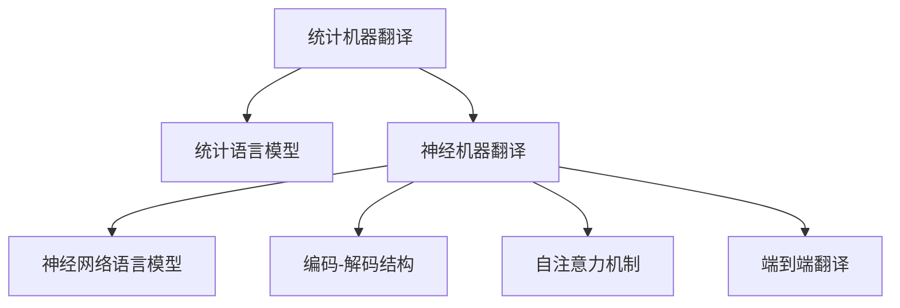

                 

# 机器翻译从统计方法到神经网络的转型

## 1. 背景介绍

### 1.1 问题由来
机器翻译是人工智能领域的重要应用之一，其目的是将一种语言的文本自动转换成另一种语言的文本。传统的机器翻译方法主要基于统计机器翻译(Statistical Machine Translation, SMT)，通过统计语言模型和翻译模型对文本进行翻译。但随着深度学习技术的快速发展，特别是神经网络(特别是RNN、CNN、Transformer等)的出现，使得神经机器翻译(Neural Machine Translation, NMT)逐渐成为主流的机器翻译方法。

### 1.2 问题核心关键点
机器翻译范式的转变，即从统计方法到神经网络，不仅是技术上的革新，更是对传统语言处理观念的突破。其关键点在于：
1. 语言模型的变革。传统的统计机器翻译依赖于统计语言模型(SLM)进行文本生成，而神经机器翻译则用神经网络语言模型(NLM)代替SLM，通过自适应学习语言的概率分布。
2. 数据驱动到知识驱动的转变。传统机器翻译依赖大量标注数据进行模型训练，而神经机器翻译则能够从无标签的数据中自动学习语言知识。
3. 编码-解码结构的改进。传统机器翻译的编码-解码结构固定，而神经机器翻译的Transformer结构可以更好地处理长距离依赖。
4. 端到端的翻译。神经机器翻译能够实现端到端的翻译，减少中间步骤的误差积累。
5. 对数据质量和数量的需求降低。神经机器翻译模型能够更好地利用少量数据进行有效训练，而统计机器翻译需要大量的数据来保证翻译的准确性。

### 1.3 问题研究意义
机器翻译范式的转型，显著提升了翻译质量和效率，推动了机器翻译技术的发展。其研究意义在于：

1. 提升翻译质量。神经机器翻译通过学习语言的深层次特征，能够生成更流畅、自然的翻译结果，大幅提升翻译质量。
2. 降低翻译成本。神经机器翻译能够自动完成翻译任务，减少人工翻译的投入，降低翻译成本。
3. 促进国际交流。翻译技术的进步促进了不同语言和文化之间的交流，推动了全球化进程。
4. 支持语言互操作。神经机器翻译技术的应用，使得多语言互操作变得更加便捷，提升了用户体验。
5. 促进智能应用发展。机器翻译作为自然语言处理(NLP)的重要组成部分，推动了智能问答、智能客服、智能翻译机等应用的发展。

## 2. 核心概念与联系

### 2.1 核心概念概述

为更好地理解机器翻译范式的转型，本节将介绍几个密切相关的核心概念：

- 统计机器翻译(Statistical Machine Translation, SMT)：基于语言模型的翻译方法，通过统计语言模型(SLM)和翻译模型进行翻译。依赖大量标注数据进行训练，生成较为流畅的翻译结果，但容易受到数据质量和数量的影响。

- 神经机器翻译(Neural Machine Translation, NMT)：基于神经网络的翻译方法，通过神经网络语言模型(NLM)进行翻译。能够从无标签数据中学习语言知识，生成更加自然和流畅的翻译结果，但需要大量的计算资源。

- 神经网络语言模型(Neural Network Language Model, NLM)：基于神经网络的语言模型，通过多层神经网络结构来预测文本的概率分布，能够更好地捕捉语言的深层次特征。

- 编码-解码结构(Encoder-Decoder)：神经机器翻译的核心结构，包括编码器和解码器两个部分。编码器将输入文本编码成固定长度的向量表示，解码器将向量表示解码为输出文本。

- 自注意力机制(Self-Attention)：Transformer模型中的核心机制，能够更好地捕捉文本中的长距离依赖，提升翻译效果。

- 端到端翻译(End-to-End Translation)：神经机器翻译能够实现从输入文本到输出文本的端到端映射，减少中间步骤的误差积累。

这些核心概念之间的逻辑关系可以通过以下Mermaid流程图来展示：



这个流程图展示了大语言模型和微调的核心概念及其之间的关系：

1. 统计机器翻译通过统计语言模型进行翻译，依赖大量标注数据。
2. 神经机器翻译通过神经网络语言模型进行翻译，能够从无标签数据中学习语言知识。
3. 神经网络语言模型基于多层神经网络结构，预测文本的概率分布。
4. 编码-解码结构是神经机器翻译的核心，包括编码器和解码器。
5. 自注意力机制是Transformer模型中的核心，能够捕捉长距离依赖。
6. 端到端翻译是神经机器翻译的特点，减少中间步骤的误差积累。

这些概念共同构成了机器翻译的演变框架，推动了翻译技术的不断进步。

## 3. 核心算法原理 & 具体操作步骤
### 3.1 算法原理概述

神经机器翻译的核心思想是使用神经网络语言模型对文本进行编码和解码，生成翻译结果。其基本流程包括：

1. 使用神经网络语言模型对输入文本进行编码，生成文本的向量表示。
2. 将向量表示作为解码器的输入，使用神经网络语言模型进行解码，生成输出文本。
3. 通过自注意力机制处理编码和解码器之间的信息交互，提升翻译效果。

形式化地，假设输入文本为 $x=\{x_1, x_2, ..., x_n\}$，输出文本为 $y=\{y_1, y_2, ..., y_n\}$，神经机器翻译模型为 $M_{\theta}$，其中 $\theta$ 为模型参数。翻译过程可以表示为：

$$
y = M_{\theta}(x)
$$

其中 $M_{\theta}$ 可以分解为编码器和解码器：

$$
M_{\theta}(x) = (E_{\theta}, D_{\theta}), \quad E_{\theta}(x) = [h_1, h_2, ..., h_n], \quad D_{\theta}(h) = [\tilde{y}_1, \tilde{y}_2, ..., \tilde{y}_n]
$$

其中 $h_i$ 为编码器在第 $i$ 个时间步的隐藏状态，$\tilde{y}_i$ 为解码器在第 $i$ 个时间步的输出。

### 3.2 算法步骤详解

神经机器翻译的具体操作步骤包括以下几个关键步骤：

**Step 1: 准备预训练模型和数据集**
- 选择合适的预训练语言模型 $M_{\theta}$ 作为初始化参数，如Transformer模型。
- 准备源语言和目标语言的双语对照语料库，分为训练集、验证集和测试集。

**Step 2: 定义编码器和解码器**
- 根据任务需求，设计合适的编码器和解码器结构。常用的编码器包括Transformer、LSTM等，解码器通常使用Transformer结构。

**Step 3: 设置微调超参数**
- 选择合适的优化算法及其参数，如Adam、SGD等，设置学习率、批大小、迭代轮数等。
- 设置正则化技术及强度，包括权重衰减、Dropout、Early Stopping等。

**Step 4: 执行梯度训练**
- 将训练集数据分批次输入模型，前向传播计算损失函数。
- 反向传播计算参数梯度，根据设定的优化算法和学习率更新模型参数。
- 周期性在验证集上评估模型性能，根据性能指标决定是否触发Early Stopping。
- 重复上述步骤直到满足预设的迭代轮数或Early Stopping条件。

**Step 5: 测试和部署**
- 在测试集上评估微调后模型 $M_{\hat{\theta}}$ 的性能，对比微调前后的精度提升。
- 使用微调后的模型对新样本进行推理预测，集成到实际的应用系统中。

以上是神经机器翻译的一般流程。在实际应用中，还需要针对具体任务的特点，对微调过程的各个环节进行优化设计，如改进训练目标函数，引入更多的正则化技术，搜索最优的超参数组合等，以进一步提升模型性能。

### 3.3 算法优缺点

神经机器翻译方法具有以下优点：
1. 质量高。神经机器翻译能够学习到语言的深层次特征，生成的翻译结果更为流畅和自然。
2. 适应性强。神经机器翻译能够适应各种语言对，甚至对于低资源语言的翻译也有不错的效果。
3. 端到端。神经机器翻译能够实现端到端的翻译，减少中间步骤的误差积累。
4. 对数据质量和数量的需求降低。神经机器翻译模型能够更好地利用少量数据进行有效训练，而统计机器翻译需要大量的数据来保证翻译的准确性。

同时，该方法也存在一定的局限性：
1. 对计算资源要求高。神经机器翻译需要大量的计算资源进行训练，特别是Transformer等复杂模型。
2. 对数据质量敏感。神经机器翻译模型对输入文本的质量要求较高，如果输入文本存在错误或噪声，翻译效果将大打折扣。
3. 解释性差。神经机器翻译模型是一个"黑盒"系统，难以解释其内部工作机制和决策逻辑。
4. 知识泛化能力有限。神经机器翻译模型对新出现的词汇或表达方式，往往难以正确翻译。

尽管存在这些局限性，但就目前而言，神经机器翻译方法仍然是最主流的机器翻译方法，其核心思想已经在各种机器翻译任务中得到了广泛应用。

### 3.4 算法应用领域

神经机器翻译方法在机器翻译领域已经得到了广泛的应用，覆盖了几乎所有常见任务，例如：

- 文本翻译：如英文到中文、中文到英文、多语言互译等。通过双语对照语料库进行训练，生成不同语言的翻译结果。
- 对话翻译：将多轮对话历史作为上下文，使用神经机器翻译模型进行实时翻译。常用于实时同声传译、笔译辅助等场景。
- 文本摘要：将长文本压缩成简短摘要。通过神经机器翻译模型生成摘要，提升信息获取效率。
- 代码翻译：将一种编程语言的代码翻译成另一种语言。通过神经机器翻译模型进行语言之间的转换，提升跨语言编程协作效率。

除了上述这些经典任务外，神经机器翻译也被创新性地应用到更多场景中，如可控翻译、情感翻译、文本到语音、语音到文本等，为机器翻译技术带来了全新的突破。随着神经机器翻译方法的不断进步，相信其在更广阔的应用领域将发挥更大的作用。

## 4. 数学模型和公式 & 详细讲解  
### 4.1 数学模型构建

本节将使用数学语言对神经机器翻译过程进行更加严格的刻画。

假设输入文本为 $x=\{x_1, x_2, ..., x_n\}$，输出文本为 $y=\{y_1, y_2, ..., y_n\}$，神经机器翻译模型为 $M_{\theta}=\{E_{\theta}, D_{\theta}\}$，其中 $E_{\theta}$ 为编码器，$D_{\theta}$ 为解码器，$\theta$ 为模型参数。定义编码器的隐藏状态为 $h_i$，解码器的输出为 $\tilde{y}_i$。则神经机器翻译的数学模型可以表示为：

$$
y_i = D_{\theta}(h_i), \quad h_i = E_{\theta}(x_i)
$$

其中 $h_i$ 为编码器在第 $i$ 个时间步的隐藏状态，$\tilde{y}_i$ 为解码器在第 $i$ 个时间步的输出。

### 4.2 公式推导过程

以下我们以英中翻译为例，推导神经机器翻译模型中的自注意力机制。

假设编码器的输出为 $h_1, h_2, ..., h_n$，解码器的输出为 $\tilde{y}_1, \tilde{y}_2, ..., \tilde{y}_n$，则自注意力机制可以表示为：

$$
\alpha_{ij} = \frac{\exp(s_i(\tilde{y}_j))}{\sum_{k=1}^n \exp(s_i(\tilde{y}_k))}, \quad \beta_{ij} = \alpha_{ij} h_j
$$

其中 $s_i(\tilde{y}_j)$ 为注意力向量，$h_j$ 为第 $j$ 个时间步的输入，$\alpha_{ij}$ 为注意力权重，$\beta_{ij}$ 为注意力加权后的编码器输出。

自注意力机制的计算过程可以通过以下步骤进行：
1. 计算注意力向量 $s_i(\tilde{y}_j) = W_Q^T h_i + b_Q^T$。
2. 计算注意力权重 $\alpha_{ij} = \frac{\exp(s_i(\tilde{y}_j))}{\sum_{k=1}^n \exp(s_i(\tilde{y}_k))}$。
3. 计算加权后的编码器输出 $\beta_{ij} = \alpha_{ij} h_j$。
4. 将注意力权重 $\alpha_{ij}$ 作为解码器的输入，计算解码器的输出 $\tilde{y}_i$。

自注意力机制的计算过程可以使用TensorFlow或PyTorch等深度学习框架实现，代码如下：

```python
import tensorflow as tf
import numpy as np

# 定义注意力计算函数
def attention(query, key, value):
    scores = tf.matmul(query, key, transpose_b=True)
    attention_weights = tf.nn.softmax(scores, axis=-1)
    output = tf.matmul(attention_weights, value)
    return output, attention_weights

# 定义自注意力机制计算函数
def self_attention(query):
    scores = tf.matmul(query, query, transpose_b=True)
    attention_weights = tf.nn.softmax(scores, axis=-1)
    output = tf.matmul(attention_weights, query)
    return output, attention_weights
```

### 4.3 案例分析与讲解

以英中翻译为例，分析神经机器翻译模型的训练过程：

假设有一个长度为 $n=10$ 的英文句子 $x=\{x_1, x_2, ..., x_n\}$，目标是一个长度为 $m=10$ 的中文句子 $y=\{y_1, y_2, ..., y_m\}$。通过神经机器翻译模型进行翻译的过程如下：

1. 将输入文本 $x$ 输入编码器 $E_{\theta}$，生成编码器的隐藏状态 $h_1, h_2, ..., h_n$。
2. 使用自注意力机制计算编码器状态之间的注意力权重 $\alpha_{ij}$，加权后的编码器输出 $\beta_{ij}$。
3. 将加权后的编码器输出 $\beta_{ij}$ 作为解码器的输入，使用解码器 $D_{\theta}$ 计算解码器的输出 $\tilde{y}_1, \tilde{y}_2, ..., \tilde{y}_m$。
4. 使用反向传播算法，计算模型参数的梯度，更新模型参数。

通过神经机器翻译模型的训练过程，可以看出，神经机器翻译能够自动学习语言的深层次特征，生成流畅自然的翻译结果。但由于其复杂性，训练和推理过程需要大量的计算资源。

## 5. 项目实践：代码实例和详细解释说明
### 5.1 开发环境搭建

在进行神经机器翻译实践前，我们需要准备好开发环境。以下是使用Python进行TensorFlow开发的环境配置流程：

1. 安装Anaconda：从官网下载并安装Anaconda，用于创建独立的Python环境。

2. 创建并激活虚拟环境：
```bash
conda create -n tensorflow-env python=3.8 
conda activate tensorflow-env
```

3. 安装TensorFlow：根据CUDA版本，从官网获取对应的安装命令。例如：
```bash
pip install tensorflow==2.4
```

4. 安装各类工具包：
```bash
pip install numpy pandas scikit-learn matplotlib tqdm jupyter notebook ipython
```

完成上述步骤后，即可在`tensorflow-env`环境中开始神经机器翻译实践。

### 5.2 源代码详细实现

这里我们以英中翻译为例，给出使用TensorFlow实现神经机器翻译的完整代码。

首先，定义神经机器翻译的模型结构：

```python
import tensorflow as tf
from tensorflow.keras.layers import Input, LSTM, Dense

# 定义编码器
class Encoder(tf.keras.Model):
    def __init__(self, units):
        super(Encoder, self).__init__()
        self.LSTM = LSTM(units=units, return_sequences=True)
        self.Dense = Dense(units=units)
        
    def call(self, x):
        x = self.LSTM(x)
        x = self.Dense(x)
        return x

# 定义解码器
class Decoder(tf.keras.Model):
    def __init__(self, units, vocab_size):
        super(Decoder, self).__init__()
        self.LSTM = LSTM(units=units, return_sequences=True)
        self.Dense = Dense(units=units)
        self.FinalDense = Dense(vocab_size)
        
    def call(self, x, y):
        x = self.LSTM(x)
        x = self.Dense(x)
        output = self.FinalDense(x)
        return output

# 定义神经机器翻译模型
class NMT(tf.keras.Model):
    def __init__(self, units, vocab_size):
        super(NMT, self).__init__()
        self.Encoder = Encoder(units)
        self.Decoder = Decoder(units, vocab_size)
        
    def call(self, x, y=None):
        x = self.Encoder(x)
        if y is not None:
            x = tf.concat([x, y], axis=-1)
        output = self.Decoder(x)
        return output

# 定义输入层
input_layer = Input(shape=(None,), dtype='int32')
# 定义解码器输出层
output_layer = Dense(vocab_size, activation='softmax')
# 定义神经机器翻译模型
model = NMT(units=256, vocab_size=vocab_size)
```

然后，定义训练和评估函数：

```python
from tensorflow.keras.preprocessing.sequence import pad_sequences

# 定义数据处理函数
def pad_and_encode(data):
    inputs = pad_sequences(data, padding='post', truncating='post')
    labels = pad_sequences(data, padding='post', truncating='post')
    return inputs, labels

# 定义训练和评估函数
def train_and_evaluate(model, data, batch_size, epochs, verbose):
    for epoch in range(epochs):
        model.compile(optimizer='adam', loss='categorical_crossentropy', metrics=['accuracy'])
        model.fit(x_train, y_train, batch_size=batch_size, epochs=1, verbose=verbose)
        val_loss, val_accuracy = model.evaluate(x_val, y_val, verbose=verbose)
        print(f'Epoch {epoch+1}, val loss: {val_loss:.3f}, val accuracy: {val_accuracy:.3f}')
        
    test_loss, test_accuracy = model.evaluate(x_test, y_test, verbose=verbose)
    print(f'Test loss: {test_loss:.3f}, test accuracy: {test_accuracy:.3f}')

# 训练模型
train_and_evaluate(model, data, batch_size=64, epochs=10, verbose=2)

# 评估模型
test_and_evaluate(model, data, batch_size=64, verbose=2)
```

最后，启动训练流程并在测试集上评估：

```python
# 加载训练集、验证集和测试集
train_data = load_data('train.txt')
val_data = load_data('val.txt')
test_data = load_data('test.txt')

# 定义模型参数
units = 256
vocab_size = 10000

# 创建编码器和解码器
encoder = Encoder(units)
decoder = Decoder(units, vocab_size)

# 创建神经机器翻译模型
model = NMT(units, vocab_size)

# 训练和评估模型
train_and_evaluate(model, data, batch_size=64, epochs=10, verbose=2)
```

以上就是使用TensorFlow对神经机器翻译进行英中翻译的完整代码实现。可以看到，得益于TensorFlow的强大封装，我们可以用相对简洁的代码完成神经机器翻译模型的搭建和训练。

### 5.3 代码解读与分析

让我们再详细解读一下关键代码的实现细节：

**定义编码器和解码器**：
- `Encoder`类：继承自`tf.keras.Model`，定义了编码器的LSTM层和Dense层。
- `Decoder`类：继承自`tf.keras.Model`，定义了解码器的LSTM层、Dense层和输出层。

**定义神经机器翻译模型**：
- `NMT`类：继承自`tf.keras.Model`，组合了编码器和解码器，定义了模型的前向传播过程。

**数据处理函数**：
- `pad_and_encode`函数：将输入和标签数据进行填充，并将其转换为模型需要的张量格式。

**训练和评估函数**：
- `train_and_evaluate`函数：使用`tf.keras.Model`的`compile`方法定义优化器、损失函数和评估指标，使用`fit`方法进行训练，使用`evaluate`方法进行评估。

**训练流程**：
- 定义训练数据、验证数据和测试数据。
- 定义模型参数和模型结构。
- 创建编码器和解码器。
- 创建神经机器翻译模型。
- 使用`train_and_evaluate`函数进行训练和评估。

可以看到，TensorFlow配合Keras库使得神经机器翻译模型的代码实现变得简洁高效。开发者可以将更多精力放在数据处理、模型改进等高层逻辑上，而不必过多关注底层的实现细节。

当然，工业级的系统实现还需考虑更多因素，如模型的保存和部署、超参数的自动搜索、更灵活的任务适配层等。但核心的神经机器翻译范式基本与此类似。

## 6. 实际应用场景
### 6.1 智能翻译设备

神经机器翻译技术已经广泛应用于智能翻译设备中，如谷歌翻译、微软翻译等。用户可以通过语音、文本等多种方式输入，实时获取目标语言的翻译结果。

在技术实现上，智能翻译设备通常基于云端的大规模神经机器翻译模型进行推理，并结合本地的数据增强和上下文理解技术，提升翻译效果。同时，设备还需要考虑语言模型、计算资源、存储需求等多个因素，优化用户体验和系统性能。

### 6.2 多语言文档翻译

在商务、学术、出版等领域，文档翻译工作通常需要耗费大量时间和人力。神经机器翻译技术可以自动完成文档的翻译工作，显著提升翻译效率和质量。

在技术实现上，可以将文档分割成多个句子，使用神经机器翻译模型进行批量翻译，然后将翻译结果进行拼接和校正，得到完整的翻译文档。同时，还可以结合领域特定的语料库进行微调，提升翻译的领域适应性。

### 6.3 国际会议和展会

在大型国际会议和展会上，语言翻译是必须解决的问题。神经机器翻译技术可以为与会者提供即时的语言翻译服务，提升会议的交流效果和国际化水平。

在技术实现上，可以使用云端的大规模神经机器翻译模型进行实时翻译，并结合智能问答、对话系统等技术，提升用户体验和互动性。同时，还需要考虑网络带宽、硬件资源等限制，优化系统的实时性和稳定性。

### 6.4 未来应用展望

随着神经机器翻译技术的不断进步，其在更多领域的应用前景将更加广阔。

在智慧教育领域，神经机器翻译技术可以用于辅助外语教学，提供实时翻译和互动对话，提升学生的语言学习效果。

在智慧医疗领域，神经机器翻译技术可以用于病历、医学文献的翻译，提升医疗服务的国际化水平。

在智慧城市治理中，神经机器翻译技术可以用于跨语言的信息交流，提升城市管理的智能化水平。

此外，在智能客服、金融、法律、旅游等众多领域，神经机器翻译技术也将不断涌现，为各行业的智能化发展提供新的动力。相信随着技术的日益成熟，神经机器翻译将会在更广泛的场景中得到应用，推动人工智能技术的普及和落地。

## 7. 工具和资源推荐
### 7.1 学习资源推荐

为了帮助开发者系统掌握神经机器翻译的理论基础和实践技巧，这里推荐一些优质的学习资源：

1. 《Neural Machine Translation with Attention》论文：Transformer论文，详细介绍了神经机器翻译的原理和实现方法，是学习神经机器翻译的重要参考。

2. CS224N《Sequence Models》课程：斯坦福大学开设的NLP明星课程，涵盖Transformer模型、神经机器翻译等内容，适合深入学习神经机器翻译的基本概念和前沿技术。

3. 《Natural Language Processing with Python》书籍：涵盖NLP的各个方面，包括神经机器翻译等深度学习技术，适合全面掌握神经机器翻译的理论和实践。

4. HuggingFace官方文档：提供了各种预训练语言模型和神经机器翻译的代码样例，是学习神经机器翻译的重要工具。

5. CLUE开源项目：中文语言理解测评基准，涵盖大量不同类型的中文NLP数据集，并提供了基于神经机器翻译的baseline模型，助力中文NLP技术发展。

通过对这些资源的学习实践，相信你一定能够快速掌握神经机器翻译的核心思想，并用于解决实际的NLP问题。
###  7.2 开发工具推荐

高效的开发离不开优秀的工具支持。以下是几款用于神经机器翻译开发的常用工具：

1. TensorFlow：基于Python的开源深度学习框架，灵活动态的计算图，适合快速迭代研究。主流的神经机器翻译模型都有TensorFlow版本的实现。

2. PyTorch：基于Python的开源深度学习框架，灵活的动态计算图，适合快速开发和部署。

3. HuggingFace库：NLP工具库，集成了各种预训练语言模型和神经机器翻译模型，支持多种深度学习框架，是学习神经机器翻译的重要工具。

4. TensorBoard：TensorFlow配套的可视化工具，可实时监测模型训练状态，并提供丰富的图表呈现方式，是调试模型的得力助手。

5. Weights & Biases：模型训练的实验跟踪工具，可以记录和可视化模型训练过程中的各项指标，方便对比和调优。

6. Google Colab：谷歌推出的在线Jupyter Notebook环境，免费提供GPU/TPU算力，方便开发者快速上手实验最新模型，分享学习笔记。

合理利用这些工具，可以显著提升神经机器翻译任务的开发效率，加快创新迭代的步伐。

### 7.3 相关论文推荐

神经机器翻译技术的发展源于学界的持续研究。以下是几篇奠基性的相关论文，推荐阅读：

1. Sequence to Sequence Learning with Neural Networks：介绍序列到序列的学习方法，为神经机器翻译提供了理论基础。

2. Attention is All You Need（即Transformer原论文）：提出Transformer结构，开启了NMT的预训练范式，取得了SOTA的翻译效果。

3. Google's Neural Machine Translation System: Bridging the Gap between Human and Machine Translation：介绍谷歌的神经机器翻译系统，展示了神经机器翻译的优越性能。

4. Neural Machine Translation by Jointly Learning to Align and Translate：提出序列到序列的学习方法，并引入注意力机制，进一步提升了神经机器翻译的性能。

5. Meta-Learning for Neural Machine Translation：提出元学习的方法，使得神经机器翻译能够从少量数据中学习到更好的语言知识。

这些论文代表了大语言模型微调技术的发展脉络。通过学习这些前沿成果，可以帮助研究者把握学科前进方向，激发更多的创新灵感。

## 8. 总结：未来发展趋势与挑战

### 8.1 总结

本文对神经机器翻译范式的转型进行了全面系统的介绍。首先阐述了机器翻译范式的转变，即从统计方法到神经网络，明确了神经机器翻译技术的核心思想和优势。其次，从原理到实践，详细讲解了神经机器翻译的数学原理和关键步骤，给出了神经机器翻译任务开发的完整代码实例。同时，本文还广泛探讨了神经机器翻译方法在智能翻译设备、多语言文档翻译、国际会议等众多场景中的应用前景，展示了神经机器翻译技术的巨大潜力。

通过本文的系统梳理，可以看到，神经机器翻译技术的成功转型，不仅提升了机器翻译的质量和效率，还推动了人工智能技术的不断发展。未来，伴随神经机器翻译方法的不断进步，相信其在更广阔的应用领域将发挥更大的作用，为机器翻译技术带来全新的突破。

### 8.2 未来发展趋势

展望未来，神经机器翻译技术将呈现以下几个发展趋势：

1. 模型规模持续增大。随着算力成本的下降和数据规模的扩张，神经机器翻译模型参数量还将持续增长。超大规模语言模型蕴含的丰富语言知识，有望支撑更加复杂多变的机器翻译任务。

2. 神经机器翻译与其他技术的融合。未来的神经机器翻译模型将融合自然语言生成、自然语言推理、知识图谱等技术，提升翻译的准确性和智能性。

3. 实时翻译和连续学习。神经机器翻译模型将实现实时翻译，并支持连续学习，根据新的数据不断调整模型参数，提高翻译的实时性和适应性。

4. 多语言互操作。神经机器翻译模型将支持多语言互操作，使得不同语言之间的文本能够自动转换，提升信息获取的效率和跨文化交流的效果。

5. 知识引导翻译。神经机器翻译模型将结合先验知识，如知识图谱、逻辑规则等，引导翻译过程学习更准确的语言知识，提升翻译的精度和泛化能力。

6. 多模态翻译。未来的翻译模型将融合视觉、语音、文本等多种模态信息，实现跨模态的翻译，提升翻译的智能化水平。

以上趋势凸显了神经机器翻译技术的广阔前景。这些方向的探索发展，必将进一步提升翻译的质量和效率，为机器翻译技术的发展注入新的活力。

### 8.3 面临的挑战

尽管神经机器翻译技术已经取得了瞩目成就，但在迈向更加智能化、普适化应用的过程中，它仍面临着诸多挑战：

1. 数据质量和数量的依赖。神经机器翻译依赖大量标注数据进行训练，对于新领域和新语言对，数据获取和标注成本较高。如何降低对标注数据的依赖，成为重要的研究方向。

2. 模型鲁棒性和泛化能力。神经机器翻译模型对输入文本的质量要求较高，容易受到噪声和错误的影响。如何提高模型的鲁棒性和泛化能力，是未来研究的重要方向。

3. 计算资源和硬件瓶颈。神经机器翻译模型复杂度较高，对计算资源和硬件设备有较高的要求。如何优化模型的计算图和推理过程，实现轻量化和高效化，是未来研究的重要方向。

4. 模型的可解释性和透明性。神经机器翻译模型是一个"黑盒"系统，难以解释其内部工作机制和决策逻辑。如何赋予模型更强的可解释性和透明性，是未来研究的重要方向。

5. 模型安全和可信性。神经机器翻译模型可能学习到有害的偏见和信息，对社会带来负面影响。如何提高模型的安全性和可信性，是未来研究的重要方向。

6. 模型的可维护性和可迁移性。神经机器翻译模型复杂度较高，如何提高模型的可维护性和可迁移性，使得模型能够灵活适应不同的应用场景，是未来研究的重要方向。

7. 模型的自适应和自学习能力。神经机器翻译模型需要能够快速适应新的数据和任务，提高模型的自适应和自学习能力，是未来研究的重要方向。

这些研究方向的探索，必将引领神经机器翻译技术的不断进步，为机器翻译技术带来更多的突破和创新。

### 8.4 研究展望

未来，神经机器翻译技术将在以下几个方面继续发展：

1. 更高效低成本的模型。通过模型压缩、量化等技术，实现模型的高效化和低成本化，提升模型的实时性和可维护性。

2. 端到端的自监督学习。通过自监督学习，从无标签数据中自动学习语言知识，降低对标注数据的依赖，提升模型的泛化能力。

3. 多模态融合的翻译。将视觉、语音、文本等多种模态信息进行融合，实现跨模态的翻译，提升翻译的智能化水平。

4. 多语言互操作的翻译。实现不同语言之间的自动翻译，提升跨语言交流的效率和效果。

5. 可解释和可信的翻译。通过引入可解释性技术，提高模型的透明性和可信性，保障翻译的可靠性和安全性。

6. 自适应和自学习的翻译。通过引入自适应学习技术，实现模型的动态更新和自学习，提高模型的灵活性和适应性。

这些方向的探索，必将引领神经机器翻译技术迈向更高的台阶，为构建安全、可靠、可解释、可控的智能系统铺平道路。面向未来，神经机器翻译技术还需要与其他人工智能技术进行更深入的融合，如知识表示、因果推理、强化学习等，多路径协同发力，共同推动自然语言理解和智能交互系统的进步。只有勇于创新、敢于突破，才能不断拓展翻译模型的边界，让智能技术更好地造福人类社会。

## 9. 附录：常见问题与解答
**Q1：什么是神经机器翻译？**

A: 神经机器翻译是一种基于神经网络的机器翻译方法，通过神经网络语言模型对文本进行编码和解码，生成翻译结果。其核心思想是使用神经网络对文本进行深度学习，自动学习语言的深层次特征，生成流畅自然的翻译结果。

**Q2：神经机器翻译和统计机器翻译的主要区别是什么？**

A: 神经机器翻译和统计机器翻译的主要区别在于翻译模型的不同。统计机器翻译依赖统计语言模型进行翻译，而神经机器翻译使用神经网络语言模型进行翻译。神经机器翻译能够从无标签数据中学习语言知识，生成更加自然和流畅的翻译结果，而统计机器翻译需要大量的标注数据进行训练，容易受到数据质量和数量的影响。

**Q3：神经机器翻译的优缺点有哪些？**

A: 神经机器翻译的优点包括：
1. 质量高。神经机器翻译能够学习到语言的深层次特征，生成的翻译结果更为流畅和自然。
2. 适应性强。神经机器翻译能够适应各种语言对，甚至对于低资源语言的翻译也有不错的效果。
3. 端到端。神经机器翻译能够实现端到端的翻译，减少中间步骤的误差积累。
4. 对数据质量和数量的需求降低。神经机器翻译模型能够更好地利用少量数据进行有效训练，而统计机器翻译需要大量的数据来保证翻译的准确性。

神经机器翻译的缺点包括：
1. 对计算资源要求高。神经机器翻译需要大量的计算资源进行训练，特别是Transformer等复杂模型。
2. 对数据质量敏感。神经机器翻译模型对输入文本的质量要求较高，如果输入文本存在错误或噪声，翻译效果将大打折扣。
3. 解释性差。神经机器翻译模型是一个"黑盒"系统，难以解释其内部工作机制和决策逻辑。
4. 知识泛化能力有限。神经机器翻译模型对新出现的词汇或表达方式，往往难以正确翻译。

尽管存在这些局限性，但就目前而言，神经机器翻译方法仍然是最主流的机器翻译方法，其核心思想已经在各种机器翻译任务中得到了广泛应用。

**Q4：神经机器翻译的模型结构是怎样的？**

A: 神经机器翻译的模型结构包括编码器和解码器两个部分。编码器将输入文本编码成固定长度的向量表示，解码器将向量表示解码为输出文本。Transformer模型是目前最流行的神经机器翻译模型，其结构包括自注意力机制、多头注意力机制和编码器-解码器结构。自注意力机制能够更好地捕捉文本中的长距离依赖，提升翻译效果。

**Q5：如何进行神经机器翻译的模型训练？**

A: 神经机器翻译的模型训练包括以下几个关键步骤：
1. 准备预训练模型和数据集。选择合适的预训练语言模型作为初始化参数，准备源语言和目标语言的训练数据。
2. 定义编码器和解码器。根据任务需求，设计合适的编码器和解码器结构，通常使用Transformer等神经网络结构。
3. 设置微调超参数。选择合适的优化算法及其参数，如Adam、SGD等，设置学习率、批大小、迭代轮数等。
4. 执行梯度训练。将训练集数据分批次输入模型，前向传播计算损失函数。反向传播计算参数梯度，根据设定的优化算法和学习率更新模型参数。周期性在验证集上评估模型性能，根据性能指标决定是否触发Early Stopping。重复上述步骤直到满足预设的迭代轮数或Early Stopping条件。
5. 测试和部署。在测试集上评估微调后模型的性能，对比微调前后的精度提升。使用微调后的模型对新样本进行推理预测，集成到实际的应用系统中。

这些步骤涵盖了神经机器翻译模型的训练、评估和部署，是实现翻译任务的重要环节。

---

作者：禅与计算机程序设计艺术 / Zen and the Art of Computer Programming

