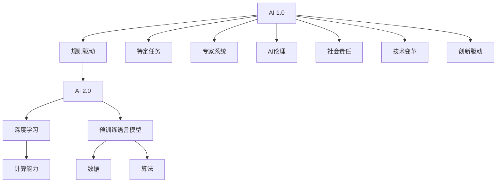

                 

# 李开复：AI 2.0 时代的价值

> 关键词：人工智能(AI), 人工智能2.0, AI2.0, 计算能力, 数据, 人工智能伦理, 技术变革, 社会责任, 创新驱动

## 1. 背景介绍

### 1.1 问题由来

在过去的几十年里，人工智能（AI）已经从一个相对冷门的技术领域，迅速成长为推动社会进步的关键力量。AI的飞速发展，极大地改变了人类的生产生活方式，催生了全新的经济模式和社会结构。但随之而来的，是AI伦理、就业、隐私等问题的日益凸显。

为了深入探讨AI 2.0时代的发展趋势和价值取向，我们有必要首先回顾一下AI 1.0和AI 2.0的演变过程。

**AI 1.0时代**，AI主要应用于特定领域的任务，如机器视觉、语音识别、自然语言处理等。这一时期，AI技术相对孤立，核心算法以规则驱动为主，需要人工进行大量数据标注和特征工程。

**AI 2.0时代**，AI不再局限于特定任务，而是成为一种普遍的技术手段。通过预训练语言模型、自监督学习等技术，AI在通用领域取得了巨大的突破，成为通用智能的代表。

### 1.2 问题核心关键点

AI 2.0时代的核心关键点主要包括：

- **计算能力的提升**：高性能硬件设备的普及，如GPU、TPU等，使得大规模深度学习模型的训练和推理变得高效可行。
- **数据的爆发性增长**：互联网、社交媒体、物联网等产生的巨量数据，为AI模型提供了充足的学习素材。
- **算法的创新突破**：如Transformer、BERT等模型的出现，极大地提升了语言模型的表达能力和泛化能力。
- **技术的广泛应用**：AI技术在医疗、金融、教育、安防等领域得到广泛应用，带来巨大的社会和经济效益。
- **伦理和安全问题**：AI模型的决策过程缺乏透明性，存在算法偏见、隐私泄露等伦理和安全问题。

## 2. 核心概念与联系

### 2.1 核心概念概述

为更好地理解AI 2.0时代的价值，本节将介绍几个关键概念：

- **AI 1.0**：指基于规则驱动、专家系统的AI技术，主要用于特定领域的任务，如机器视觉、语音识别等。

- **AI 2.0**：指通过深度学习、预训练语言模型等技术，构建通用智能的AI范式。AI 2.0的核心在于模型泛化能力的提升，能够处理多样化的任务，实现跨领域迁移。

- **计算能力**：指硬件设备的计算能力和存储能力，如GPU、TPU等，是支持大规模深度学习模型的关键因素。

- **数据**：指用于训练AI模型的数据集，包括结构化数据、非结构化数据等。数据质量直接影响模型的泛化能力。

- **算法**：指构建AI模型的核心方法，如神经网络、自监督学习、转移学习等。算法的创新直接驱动AI技术的进步。

- **AI伦理**：指AI技术应用过程中所涉及的伦理问题，如隐私保护、算法偏见、决策透明度等。AI伦理在AI 2.0时代显得尤为重要。

- **社会责任**：指AI技术的开发和使用过程中，应该承担的社会责任，如促进公平、保护隐私、维护安全等。

- **技术变革**：指AI技术对社会各领域产生的影响和变革，如医疗、教育、金融等。

- **创新驱动**：指AI技术的不断创新和突破，驱动社会进步和发展。

这些概念之间的逻辑关系可以通过以下Mermaid流程图来展示：



这个流程图展示了大语言模型的核心概念及其之间的关系：

1. AI 1.0和AI 2.0分别代表了AI技术的不同发展阶段。
2. AI 2.0通过深度学习和预训练语言模型等技术，提升了模型的泛化能力。
3. 计算能力和数据是大模型训练和推理的基础。
4. 算法创新是大模型效果的决定因素。
5. AI伦理和社会责任是大模型应用中必须考虑的重要问题。
6. 技术变革和创新驱动是大模型发展的驱动力。

## 3. 核心算法原理 & 具体操作步骤
### 3.1 算法原理概述

AI 2.0时代的核心算法原理主要包括深度学习、自监督学习、预训练语言模型等。这些技术共同构成了AI 2.0的算法框架，使其能够处理多样化的任务，实现跨领域迁移。

深度学习通过多层神经网络，学习输入数据的复杂表示，使得模型能够处理非线性、高维的数据。自监督学习利用无标签数据，训练模型学习到数据的潜在结构，提升了模型的泛化能力。预训练语言模型通过大规模无标签文本数据预训练，学习语言的通用表示，为后续微调任务提供基础。

### 3.2 算法步骤详解

AI 2.0的算法实现通常包括以下几个关键步骤：

**Step 1: 数据预处理**  
对数据进行清洗、归一化、分词等预处理操作，以便模型能够高效地学习数据特征。

**Step 2: 构建深度学习模型**  
选择合适的深度学习模型框架，如TensorFlow、PyTorch等，构建预训练语言模型。通常使用Transformer、BERT等结构，进行大规模无标签数据的预训练。

**Step 3: 微调模型**  
在预训练模型的基础上，利用少量有标签数据进行微调，优化模型在不同任务上的性能。一般使用小批量梯度下降等优化算法，调整模型参数。

**Step 4: 评估模型**  
在验证集上评估模型性能，通过交叉验证、留出验证等方法，选择最优的模型参数和超参数。

**Step 5: 部署模型**  
将微调后的模型部署到实际应用系统中，进行大规模推理和预测。

### 3.3 算法优缺点

AI 2.0的算法具有以下优点：

- **泛化能力强**：通过自监督学习和预训练，AI 2.0模型能够处理多样化的数据，实现跨领域迁移。
- **计算效率高**：深度学习算法利用GPU、TPU等高性能硬件，能够快速训练和推理大规模模型。
- **数据需求低**：AI 2.0模型可以通过迁移学习、零样本学习等方式，在不依赖大量标注数据的情况下，仍能取得不错的效果。

同时，AI 2.0算法也存在一定的局限性：

- **模型复杂度高**：深度学习模型参数量巨大，训练和推理过程较为复杂。
- **数据依赖性高**：数据质量和数据量的多少直接影响模型的泛化能力。
- **解释性差**：深度学习模型通常是"黑盒"系统，难以解释其决策过程。
- **伦理问题多**：模型可能存在算法偏见、决策不公等问题，影响社会公平。

### 3.4 算法应用领域

AI 2.0算法在众多领域得到了广泛应用，包括但不限于：

- **自然语言处理**：文本分类、情感分析、机器翻译等。
- **计算机视觉**：图像识别、视频分析、人脸识别等。
- **语音识别**：语音转文本、语音情感分析等。
- **医疗健康**：疾病诊断、药物研发、健康监测等。
- **金融科技**：风险评估、欺诈检测、智能投顾等。
- **自动驾驶**：环境感知、路径规划、决策控制等。
- **智能制造**：质量检测、设备维护、供应链优化等。

## 4. 数学模型和公式 & 详细讲解 & 举例说明

### 4.1 数学模型构建

假设我们有一个预训练语言模型 $M$，其参数为 $\theta$，训练集为 $D$，包含 $n$ 个样本。模型的输出表示为 $y$，真实标签表示为 $y_{\text{true}}$。模型的损失函数为 $\mathcal{L}$，通常使用交叉熵损失：

$$
\mathcal{L} = -\frac{1}{n} \sum_{i=1}^n \log p(y_i | x_i; \theta)
$$

其中，$p(y_i | x_i; \theta)$ 为模型在输入 $x_i$ 上的条件概率，即模型预测的输出。

### 4.2 公式推导过程

深度学习模型的前向传播和反向传播过程如下：

**前向传播**：

$$
z_i = W_1 x_i + b_1
$$

$$
h_i = \sigma(z_i)
$$

$$
y_i = W_2 h_i + b_2
$$

其中，$W_1, W_2$ 为权重矩阵，$b_1, b_2$ 为偏置向量，$\sigma$ 为激活函数。

**反向传播**：

$$
\frac{\partial \mathcal{L}}{\partial \theta} = \frac{\partial \mathcal{L}}{\partial y} \frac{\partial y}{\partial h} \frac{\partial h}{\partial z} \frac{\partial z}{\partial \theta}
$$

通过反向传播算法，计算损失函数对模型参数的梯度，并使用优化算法更新模型参数，最小化损失函数：

$$
\theta \leftarrow \theta - \eta \frac{\partial \mathcal{L}}{\partial \theta}
$$

其中，$\eta$ 为学习率，$\frac{\partial \mathcal{L}}{\partial \theta}$ 为损失函数对模型参数的梯度。

### 4.3 案例分析与讲解

以自然语言处理中的文本分类任务为例，使用BERT模型进行微调：

- **数据准备**：收集标注数据集，进行分词、编码等预处理操作。
- **模型加载**：使用HuggingFace的transformers库加载预训练的BERT模型。
- **模型微调**：在微调数据集上，使用小批量梯度下降等优化算法，调整模型参数。
- **性能评估**：在验证集上评估模型性能，选择合适的超参数。

## 5. 项目实践：代码实例和详细解释说明

### 5.1 开发环境搭建

在进行AI 2.0项目实践前，我们需要准备好开发环境。以下是使用Python进行PyTorch开发的环境配置流程：

1. 安装Anaconda：从官网下载并安装Anaconda，用于创建独立的Python环境。

2. 创建并激活虚拟环境：
```bash
conda create -n pytorch-env python=3.8 
conda activate pytorch-env
```

3. 安装PyTorch：根据CUDA版本，从官网获取对应的安装命令。例如：
```bash
conda install pytorch torchvision torchaudio cudatoolkit=11.1 -c pytorch -c conda-forge
```

4. 安装各类工具包：
```bash
pip install numpy pandas scikit-learn matplotlib tqdm jupyter notebook ipython
```

完成上述步骤后，即可在`pytorch-env`环境中开始AI 2.0微调实践。

### 5.2 源代码详细实现

下面我们以情感分析任务为例，给出使用PyTorch对BERT模型进行情感分析微调的PyTorch代码实现。

首先，定义情感分析任务的数据处理函数：

```python
from transformers import BertTokenizer
from torch.utils.data import Dataset
import torch

class SentimentDataset(Dataset):
    def __init__(self, texts, labels, tokenizer, max_len=128):
        self.texts = texts
        self.labels = labels
        self.tokenizer = tokenizer
        self.max_len = max_len
        
    def __len__(self):
        return len(self.texts)
    
    def __getitem__(self, item):
        text = self.texts[item]
        label = self.labels[item]
        
        encoding = self.tokenizer(text, return_tensors='pt', max_length=self.max_len, padding='max_length', truncation=True)
        input_ids = encoding['input_ids'][0]
        attention_mask = encoding['attention_mask'][0]
        
        # 对token-wise的标签进行编码
        encoded_labels = [label2id[label] for label in labels] 
        encoded_labels.extend([label2id['O']] * (self.max_len - len(encoded_labels)))
        labels = torch.tensor(encoded_labels, dtype=torch.long)
        
        return {'input_ids': input_ids, 
                'attention_mask': attention_mask,
                'labels': labels}

# 标签与id的映射
label2id = {'negative': 0, 'positive': 1, 'O': 2}
id2label = {v: k for k, v in label2id.items()}

# 创建dataset
tokenizer = BertTokenizer.from_pretrained('bert-base-cased')

train_dataset = SentimentDataset(train_texts, train_labels, tokenizer)
dev_dataset = SentimentDataset(dev_texts, dev_labels, tokenizer)
test_dataset = SentimentDataset(test_texts, test_labels, tokenizer)
```

然后，定义模型和优化器：

```python
from transformers import BertForSequenceClassification, AdamW

model = BertForSequenceClassification.from_pretrained('bert-base-cased', num_labels=len(label2id))

optimizer = AdamW(model.parameters(), lr=2e-5)
```

接着，定义训练和评估函数：

```python
from torch.utils.data import DataLoader
from tqdm import tqdm
from sklearn.metrics import accuracy_score, precision_recall_fscore_support

device = torch.device('cuda') if torch.cuda.is_available() else torch.device('cpu')
model.to(device)

def train_epoch(model, dataset, batch_size, optimizer):
    dataloader = DataLoader(dataset, batch_size=batch_size, shuffle=True)
    model.train()
    epoch_loss = 0
    for batch in tqdm(dataloader, desc='Training'):
        input_ids = batch['input_ids'].to(device)
        attention_mask = batch['attention_mask'].to(device)
        labels = batch['labels'].to(device)
        model.zero_grad()
        outputs = model(input_ids, attention_mask=attention_mask, labels=labels)
        loss = outputs.loss
        epoch_loss += loss.item()
        loss.backward()
        optimizer.step()
    return epoch_loss / len(dataloader)

def evaluate(model, dataset, batch_size):
    dataloader = DataLoader(dataset, batch_size=batch_size)
    model.eval()
    preds, labels = [], []
    with torch.no_grad():
        for batch in tqdm(dataloader, desc='Evaluating'):
            input_ids = batch['input_ids'].to(device)
            attention_mask = batch['attention_mask'].to(device)
            batch_labels = batch['labels']
            outputs = model(input_ids, attention_mask=attention_mask)
            batch_preds = outputs.logits.argmax(dim=2).to('cpu').tolist()
            batch_labels = batch_labels.to('cpu').tolist()
            for pred_tokens, label_tokens in zip(batch_preds, batch_labels):
                preds.append(pred_tokens[:len(label_tokens)])
                labels.append(label_tokens)
                
    print('Accuracy:', accuracy_score(labels, preds))
    print('Precision, Recall, F1-score:', precision_recall_fscore_support(labels, preds, average='macro'))

```

最后，启动训练流程并在测试集上评估：

```python
epochs = 5
batch_size = 16

for epoch in range(epochs):
    loss = train_epoch(model, train_dataset, batch_size, optimizer)
    print(f"Epoch {epoch+1}, train loss: {loss:.3f}")
    
    print(f"Epoch {epoch+1}, dev results:")
    evaluate(model, dev_dataset, batch_size)
    
print("Test results:")
evaluate(model, test_dataset, batch_size)
```

以上就是使用PyTorch对BERT进行情感分析任务微调的完整代码实现。可以看到，得益于Transformers库的强大封装，我们可以用相对简洁的代码完成BERT模型的加载和微调。

### 5.3 代码解读与分析

让我们再详细解读一下关键代码的实现细节：

**SentimentDataset类**：
- `__init__`方法：初始化文本、标签、分词器等关键组件。
- `__len__`方法：返回数据集的样本数量。
- `__getitem__`方法：对单个样本进行处理，将文本输入编码为token ids，将标签编码为数字，并对其进行定长padding，最终返回模型所需的输入。

**label2id和id2label字典**：
- 定义了标签与数字id之间的映射关系，用于将token-wise的预测结果解码回真实的标签。

**训练和评估函数**：
- 使用PyTorch的DataLoader对数据集进行批次化加载，供模型训练和推理使用。
- 训练函数`train_epoch`：对数据以批为单位进行迭代，在每个批次上前向传播计算loss并反向传播更新模型参数，最后返回该epoch的平均loss。
- 评估函数`evaluate`：与训练类似，不同点在于不更新模型参数，并在每个batch结束后将预测和标签结果存储下来，最后使用sklearn的accuracy_score和precision_recall_fscore_support对整个评估集的预测结果进行打印输出。

**训练流程**：
- 定义总的epoch数和batch size，开始循环迭代
- 每个epoch内，先在训练集上训练，输出平均loss
- 在验证集上评估，输出准确率和分类指标
- 所有epoch结束后，在测试集上评估，给出最终测试结果

可以看到，PyTorch配合Transformers库使得BERT微调的代码实现变得简洁高效。开发者可以将更多精力放在数据处理、模型改进等高层逻辑上，而不必过多关注底层的实现细节。

当然，工业级的系统实现还需考虑更多因素，如模型的保存和部署、超参数的自动搜索、更灵活的任务适配层等。但核心的微调范式基本与此类似。

## 6. 实际应用场景
### 6.1 智能客服系统

基于AI 2.0的对话技术，可以广泛应用于智能客服系统的构建。传统客服往往需要配备大量人力，高峰期响应缓慢，且一致性和专业性难以保证。而使用AI 2.0对话模型，可以7x24小时不间断服务，快速响应客户咨询，用自然流畅的语言解答各类常见问题。

在技术实现上，可以收集企业内部的历史客服对话记录，将问题和最佳答复构建成监督数据，在此基础上对预训练对话模型进行微调。微调后的对话模型能够自动理解用户意图，匹配最合适的答案模板进行回复。对于客户提出的新问题，还可以接入检索系统实时搜索相关内容，动态组织生成回答。如此构建的智能客服系统，能大幅提升客户咨询体验和问题解决效率。

### 6.2 金融舆情监测

金融机构需要实时监测市场舆论动向，以便及时应对负面信息传播，规避金融风险。传统的人工监测方式成本高、效率低，难以应对网络时代海量信息爆发的挑战。基于AI 2.0的文本分类和情感分析技术，为金融舆情监测提供了新的解决方案。

具体而言，可以收集金融领域相关的新闻、报道、评论等文本数据，并对其进行主题标注和情感标注。在此基础上对预训练语言模型进行微调，使其能够自动判断文本属于何种主题，情感倾向是正面、中性还是负面。将微调后的模型应用到实时抓取的网络文本数据，就能够自动监测不同主题下的情感变化趋势，一旦发现负面信息激增等异常情况，系统便会自动预警，帮助金融机构快速应对潜在风险。

### 6.3 个性化推荐系统

当前的推荐系统往往只依赖用户的历史行为数据进行物品推荐，无法深入理解用户的真实兴趣偏好。基于AI 2.0的个性化推荐系统，可以更好地挖掘用户行为背后的语义信息，从而提供更精准、多样的推荐内容。

在实践中，可以收集用户浏览、点击、评论、分享等行为数据，提取和用户交互的物品标题、描述、标签等文本内容。将文本内容作为模型输入，用户的后续行为（如是否点击、购买等）作为监督信号，在此基础上微调预训练语言模型。微调后的模型能够从文本内容中准确把握用户的兴趣点。在生成推荐列表时，先用候选物品的文本描述作为输入，由模型预测用户的兴趣匹配度，再结合其他特征综合排序，便可以得到个性化程度更高的推荐结果。

### 6.4 未来应用展望

随着AI 2.0技术的发展，基于AI 2.0的应用场景将越来越丰富，为各个行业带来颠覆性的变革。

在智慧医疗领域，基于AI 2.0的医疗问答、病历分析、药物研发等应用将提升医疗服务的智能化水平，辅助医生诊疗，加速新药开发进程。

在智能教育领域，AI 2.0技术可应用于作业批改、学情分析、知识推荐等方面，因材施教，促进教育公平，提高教学质量。

在智慧城市治理中，AI 2.0模型可应用于城市事件监测、舆情分析、应急指挥等环节，提高城市管理的自动化和智能化水平，构建更安全、高效的未来城市。

此外，在企业生产、社会治理、文娱传媒等众多领域，基于AI 2.0的人工智能应用也将不断涌现，为经济社会发展注入新的动力。相信随着技术的日益成熟，AI 2.0必将在更广阔的应用领域大放异彩，深刻影响人类的生产生活方式。

## 7. 工具和资源推荐
### 7.1 学习资源推荐

为了帮助开发者系统掌握AI 2.0的理论基础和实践技巧，这里推荐一些优质的学习资源：

1. 《深度学习》（Ian Goodfellow、Yoshua Bengio和Aaron Courville合著）：深度学习领域的经典教材，涵盖深度学习的基本原理和算法。

2. 《Neural Network and Deep Learning》（Michael Nielsen）：深度学习领域的高质量入门教材，适合初学者阅读。

3. CS231n《Convolutional Neural Networks for Visual Recognition》课程：斯坦福大学开设的视觉识别课程，涵盖卷积神经网络的基本原理和应用。

4. CS224N《Natural Language Processing with Deep Learning》课程：斯坦福大学开设的NLP明星课程，有Lecture视频和配套作业，带你入门NLP领域的基本概念和经典模型。

5. 《自然语言处理综述》（张志华）：系统介绍自然语言处理领域的理论和实践，适合对NLP感兴趣的读者。

通过对这些资源的学习实践，相信你一定能够快速掌握AI 2.0的精髓，并用于解决实际的AI问题。
### 7.2 开发工具推荐

高效的开发离不开优秀的工具支持。以下是几款用于AI 2.0开发常用的工具：

1. PyTorch：基于Python的开源深度学习框架，灵活动态的计算图，适合快速迭代研究。大部分预训练语言模型都有PyTorch版本的实现。

2. TensorFlow：由Google主导开发的开源深度学习框架，生产部署方便，适合大规模工程应用。同样有丰富的预训练语言模型资源。

3. Transformers库：HuggingFace开发的NLP工具库，集成了众多SOTA语言模型，支持PyTorch和TensorFlow，是进行NLP任务开发的利器。

4. Weights & Biases：模型训练的实验跟踪工具，可以记录和可视化模型训练过程中的各项指标，方便对比和调优。与主流深度学习框架无缝集成。

5. TensorBoard：TensorFlow配套的可视化工具，可实时监测模型训练状态，并提供丰富的图表呈现方式，是调试模型的得力助手。

6. Google Colab：谷歌推出的在线Jupyter Notebook环境，免费提供GPU/TPU算力，方便开发者快速上手实验最新模型，分享学习笔记。

合理利用这些工具，可以显著提升AI 2.0模型的开发效率，加快创新迭代的步伐。

### 7.3 相关论文推荐

AI 2.0技术的发展源于学界的持续研究。以下是几篇奠基性的相关论文，推荐阅读：

1. Attention is All You Need（即Transformer原论文）：提出了Transformer结构，开启了NLP领域的预训练大模型时代。

2. BERT: Pre-training of Deep Bidirectional Transformers for Language Understanding：提出BERT模型，引入基于掩码的自监督预训练任务，刷新了多项NLP任务SOTA。

3. Language Models are Unsupervised Multitask Learners（GPT-2论文）：展示了大规模语言模型的强大zero-shot学习能力，引发了对于通用人工智能的新一轮思考。

4. Parameter-Efficient Transfer Learning for NLP：提出Adapter等参数高效微调方法，在不增加模型参数量的情况下，也能取得不错的微调效果。

5. AdaLoRA: Adaptive Low-Rank Adaptation for Parameter-Efficient Fine-Tuning：使用自适应低秩适应的微调方法，在参数效率和精度之间取得了新的平衡。

6. Detecting Misinformation in Multilingual News Headlines：提出基于多语言新闻标题的假新闻检测方法，为AI 2.0应用提供了新思路。

这些论文代表了大语言模型微调技术的发展脉络。通过学习这些前沿成果，可以帮助研究者把握学科前进方向，激发更多的创新灵感。

## 8. 总结：未来发展趋势与挑战

### 8.1 总结

本文对AI 2.0时代的价值进行了全面系统的探讨。首先回顾了AI 1.0和AI 2.0的演变过程，明确了AI 2.0的核心关键点。其次，从原理到实践，详细讲解了AI 2.0的算法框架，给出了情感分析任务的完整代码实例。同时，本文还广泛探讨了AI 2.0在智能客服、金融舆情、个性化推荐等多个领域的应用前景，展示了AI 2.0技术的强大潜力。

通过本文的系统梳理，可以看到，AI 2.0技术在众多领域得到了广泛应用，极大地提升了系统的智能化水平，带来了巨大的社会和经济效益。AI 2.0技术的不断发展，为各行各业带来了颠覆性的变革，推动了社会的进步和创新。

### 8.2 未来发展趋势

展望未来，AI 2.0技术将呈现以下几个发展趋势：

1. **计算能力的进一步提升**：随着算力硬件的不断进步，AI 2.0模型将能够处理更大规模、更复杂的数据，实现更高的计算效率。

2. **数据量的持续增长**：互联网、物联网、社交媒体等产生的巨量数据，将继续为AI 2.0模型提供充足的学习素材。

3. **算法的不断创新**：新的算法模型不断涌现，如自监督学习、对比学习、元学习等，进一步提升AI 2.0模型的泛化能力和表现。

4. **应用的不断拓展**：AI 2.0技术将在更多领域得到应用，如自动驾驶、智能制造、智慧医疗等，带来更多的创新和变革。

5. **伦理和安全问题**：AI 2.0技术的应用将更加广泛，伦理和安全问题将变得愈发重要，需要更多地从数据、算法、模型等各个层面进行探讨和解决。

6. **社会责任的强化**：AI 2.0技术的应用将带来更多社会责任和伦理挑战，需要在开发和应用过程中更加重视公平、透明、可解释等问题。

### 8.3 面临的挑战

尽管AI 2.0技术取得了显著进展，但在其应用过程中仍面临诸多挑战：

1. **计算资源的限制**：大规模AI 2.0模型的训练和推理需要高性能硬件，如GPU、TPU等，硬件资源的匮乏限制了模型的广泛应用。

2. **数据质量和隐私保护**：数据质量和隐私保护问题仍然存在，如何保证数据的高质量和隐私安全，是AI 2.0技术应用的基础。

3. **算法的透明度和可解释性**：AI 2.0模型通常是"黑盒"系统，难以解释其决策过程，如何提升算法的透明度和可解释性，是当前研究的重要方向。

4. **伦理和法律问题**：AI 2.0技术的应用过程中，存在伦理和法律问题，如算法偏见、决策不公等，需要更多的伦理和法律框架来指导和规范。

5. **模型安全和稳定性**：AI 2.0模型可能存在安全漏洞和稳定性问题，如何提高模型的鲁棒性和安全性，是未来研究的重要课题。

6. **模型泛化能力**：AI 2.0模型需要在不同领域、不同数据集上保持高泛化能力，如何提升模型的泛化性能，是当前研究的重要方向。

### 8.4 研究展望

面对AI 2.0技术所面临的诸多挑战，未来的研究需要在以下几个方面寻求新的突破：

1. **高效的模型训练方法**：开发更高效的模型训练方法，如联邦学习、梯度压缩等，提升模型的训练效率。

2. **可解释和透明的模型**：通过可解释的模型结构和特征提取方式，提升AI 2.0模型的透明度和可解释性。

3. **公平和伦理的模型**：在AI 2.0模型的训练和应用过程中，引入公平性、透明性和伦理性的评估指标，提升模型的公平性。

4. **跨领域和跨模态的模型**：开发能够处理跨领域、跨模态数据的AI 2.0模型，提升模型的泛化能力和应用范围。

5. **持续学习和适应性**：开发具有持续学习和自适应能力的AI 2.0模型，能够不断学习和适应用户的需求和数据分布的变化。

6. **多模态和混合智能**：开发多模态融合和混合智能的AI 2.0模型，提升模型的多感官处理能力。

以上研究方向的探索，必将引领AI 2.0技术迈向更高的台阶，为构建更加智能、公平、安全、可持续的AI系统铺平道路。

## 9. 附录：常见问题与解答

**Q1：AI 2.0和AI 1.0的区别是什么？**

A: AI 1.0和AI 2.0的区别在于其技术框架和应用范式。AI 1.0基于规则驱动、专家系统，主要用于特定领域的任务，如机器视觉、语音识别等。而AI 2.0则通过深度学习、预训练语言模型等技术，构建通用智能的AI范式，能够处理多样化的数据，实现跨领域迁移。

**Q2：AI 2.0的应用场景有哪些？**

A: AI 2.0在自然语言处理、计算机视觉、语音识别、医疗健康、金融科技、自动驾驶、智能制造等多个领域得到了广泛应用，提升了各行业的智能化水平，带来了巨大的社会和经济效益。

**Q3：AI 2.0模型存在哪些问题？**

A: AI 2.0模型存在计算资源限制、数据质量和隐私保护、算法透明度和可解释性、伦理和法律问题、模型安全和稳定性、模型泛化能力等问题，需要进一步研究和优化。

**Q4：如何应对AI 2.0面临的挑战？**

A: 应对AI 2.0面临的挑战，需要在高效模型训练、可解释模型、公平伦理模型、跨领域模型、持续学习、多模态混合智能等方向进行研究，提升AI 2.0模型的性能和应用范围。

**Q5：AI 2.0的未来发展方向是什么？**

A: AI 2.0的未来发展方向包括计算能力提升、数据量增长、算法创新、应用拓展、伦理和安全问题、社会责任强化等，需要在多个方面进行持续探索和突破。

---

作者：禅与计算机程序设计艺术 / Zen and the Art of Computer Programming

