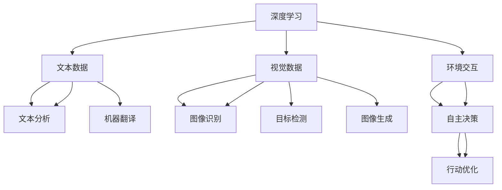

                 

## 1. 背景介绍

### 1.1 问题由来
在过去的几十年中，人工智能（AI）技术的飞速发展已经对全球经济、社会、文化等多个领域产生了深远的影响。AI 2.0时代的到来，更是将AI技术的应用推向了新的高峰。AI 2.0不仅仅是一系列先进算法的组合，更是一个涵盖硬件、软件、应用和服务在内的全方位生态系统。它集成了深度学习、自然语言处理、计算机视觉、机器学习等前沿技术，赋予机器更强大的感知、理解、学习、推理能力，使之能够处理复杂任务，并在诸多领域中发挥关键作用。

### 1.2 问题核心关键点
AI 2.0时代，AI技术的应用场景更加广泛，市场前景更加明朗。AI技术在医疗、教育、金融、智能制造、自动驾驶等众多领域展现出巨大潜力，成为推动全球经济增长的重要引擎。随着AI技术在各行各业中的广泛应用，市场对于AI产品和服务的竞争也愈发激烈。本文将从市场前景、核心概念、算法原理、实际应用等角度深入分析AI 2.0时代的市场态势和未来趋势，探讨AI技术在各行业的落地应用，为读者提供全面的技术视野和市场洞察。

## 2. 核心概念与联系

### 2.1 核心概念概述

在讨论AI 2.0的市场前景前，有必要先梳理一下核心概念。

- **AI 2.0**：指新一代人工智能技术，通过深度学习、强化学习、迁移学习、联邦学习等技术，大幅提升AI系统的性能和应用能力，使之能够解决更加复杂、多样化的问题。
- **深度学习**：一种基于神经网络的机器学习技术，通过多层非线性变换，使机器能够从数据中学习出高级特征表示，实现对复杂模式的识别和预测。
- **自然语言处理（NLP）**：使计算机能够理解和生成人类语言，实现语音识别、文本分析、机器翻译等功能。
- **计算机视觉（CV）**：使计算机能够处理和理解图像、视频等视觉数据，实现图像识别、目标检测、图像生成等任务。
- **强化学习**：通过与环境交互，机器能够在不断的试错中学习最优策略，实现自主决策和行动。

这些概念之间相互联系，共同构成了AI 2.0的技术体系。深度学习提供了数据建模的基础，NLP和CV技术赋予机器感知和理解能力，而强化学习则使机器能够主动学习并优化决策。

### 2.2 核心概念原理和架构的 Mermaid 流程图



这个流程图展示了AI 2.0技术体系中各个核心概念之间的联系和相互作用。深度学习为NLP、CV和强化学习提供了数据建模和特征提取的基础，而NLP、CV和强化学习通过各自技术手段实现机器对不同类型数据的理解和处理，最终共同构成了一个完整的AI生态系统。

## 3. 核心算法原理 & 具体操作步骤

### 3.1 算法原理概述

AI 2.0的核心算法原理涵盖了深度学习、自然语言处理、计算机视觉和强化学习等多个领域。以下将简要介绍这些核心算法的原理。

- **深度学习**：通过多层神经网络结构，逐层学习数据的多级抽象特征表示，使机器能够从数据中自动学习到复杂的非线性模式。
- **自然语言处理**：利用词向量、语言模型等技术，将文本数据转换为机器可理解的向量表示，实现文本分类、情感分析、机器翻译等功能。
- **计算机视觉**：通过卷积神经网络（CNN）等技术，提取图像特征，实现图像识别、目标检测、图像生成等任务。
- **强化学习**：通过奖励函数和状态转移模型，引导机器在环境中不断试错学习，优化策略，实现自主决策和行动。

### 3.2 算法步骤详解

AI 2.0技术在实际应用中，通常需要经过以下几个步骤：

**Step 1: 数据收集与预处理**

- 收集与任务相关的数据集，并对数据进行清洗、标注、归一化等预处理操作，使其适合机器学习模型的训练。

**Step 2: 模型选择与设计**

- 根据具体任务选择合适的深度学习模型或强化学习策略，设计模型结构。对于复杂任务，通常需要结合多种模型和技术手段。

**Step 3: 模型训练与优化**

- 使用收集到的数据集对模型进行训练，通过反向传播算法更新模型参数，优化模型性能。
- 对于深度学习模型，通常需要进行超参数调优，选择合适的学习率、批大小、优化器等参数。
- 对于强化学习模型，则需要设计适当的奖励函数和状态转移模型，实现自主决策。

**Step 4: 模型评估与部署**

- 在测试集上对模型进行评估，使用准确率、召回率、F1分数等指标衡量模型性能。
- 将训练好的模型部署到实际应用中，实现对新数据进行预测或决策。

### 3.3 算法优缺点

AI 2.0技术在实际应用中，具有以下优点：

- **高性能**：AI 2.0技术通过深度学习、自然语言处理、计算机视觉和强化学习等多种手段，具备强大的数据建模和问题解决能力，能够处理复杂任务。
- **泛化能力强**：AI 2.0模型能够在不同数据集和应用场景中表现出较好的泛化性能。
- **应用广泛**：AI 2.0技术已经广泛应用于医疗、教育、金融、智能制造、自动驾驶等多个领域，展示了广阔的市场前景。

同时，AI 2.0技术也存在一些缺点：

- **数据依赖**：AI 2.0模型的性能高度依赖于数据质量，数据获取和标注成本较高。
- **可解释性不足**：AI 2.0模型通常被视为"黑盒"，难以解释其内部工作机制和决策逻辑。
- **计算资源消耗大**：深度学习等技术通常需要大量的计算资源和时间，部署成本较高。
- **伦理问题**：AI 2.0技术可能带来隐私、安全等伦理问题，需要严格监管和控制。

### 3.4 算法应用领域

AI 2.0技术已经在多个领域展现出巨大的应用潜力，具体包括：

- **医疗健康**：AI 2.0技术可以用于疾病诊断、药物研发、健康管理等领域，提升医疗服务的精准度和效率。
- **教育培训**：AI 2.0技术可以用于智能辅导、个性化推荐、学习评估等领域，提升教育质量和学习效果。
- **金融服务**：AI 2.0技术可以用于信用评估、风险控制、欺诈检测等领域，提升金融服务的智能化水平。
- **智能制造**：AI 2.0技术可以用于生产优化、质量控制、设备维护等领域，提升制造业的自动化和智能化水平。
- **自动驾驶**：AI 2.0技术可以用于智能决策、路径规划、避障检测等领域，推动自动驾驶技术的商业化应用。
- **智慧城市**：AI 2.0技术可以用于智能交通、公共安全、环境监测等领域，提升城市管理的智能化水平。

## 4. 数学模型和公式 & 详细讲解 & 举例说明

### 4.1 数学模型构建

在AI 2.0技术中，数学模型构建是核心之一。以下将介绍几个典型的数学模型及其构建方法。

**深度学习模型**：
- **多层感知机（MLP）**：
  $$
  f(x) = \sum_{i=1}^n w_i \cdot x_i + b
  $$
  其中，$x$为输入向量，$w$为权重向量，$b$为偏置项。
- **卷积神经网络（CNN）**：
  $$
  f(x) = \sum_{i=1}^n \sum_{j=1}^n w_{ij} \cdot x_{ij} + b
  $$
  其中，$x_{ij}$为卷积核在$(i,j)$位置上的输入值。

**自然语言处理模型**：
- **词向量模型（Word2Vec）**：
  $$
  \mathbf{v}_w = \mathbf{V} \cdot \mathbf{w}
  $$
  其中，$\mathbf{v}_w$为单词$w$的向量表示，$\mathbf{V}$为权重矩阵，$\mathbf{w}$为单词嵌入向量。
- **语言模型**：
  $$
  p(y|x) = \frac{e^{w_{y|x}}}{\sum_{y'} e^{w_{y'|x}}}
  $$
  其中，$w_{y|x}$为条件概率$y$在$x$上的权重值。

**强化学习模型**：
- **Q-learning**：
  $$
  Q(s,a) = r + \gamma \max_{a'} Q(s',a')
  $$
  其中，$Q(s,a)$为状态-动作对$(s,a)$的价值函数，$r$为即时奖励，$\gamma$为折扣因子。

### 4.2 公式推导过程

以下以Q-learning为例，详细推导强化学习模型的公式。

**Q-learning**公式的推导如下：
设当前状态为$s$，执行动作$a$后进入下一个状态$s'$，并收到奖励$r$。$Q(s,a)$表示状态-动作对$(s,a)$的价值函数，$Q(s',a')$表示下一个状态-动作对$(s',a')$的价值函数。$w$为学习率，$\gamma$为折扣因子。

根据Q-learning的定义，有：
$$
Q(s,a) = (1-w) Q(s,a) + w(r + \gamma \max_{a'} Q(s',a'))
$$

将其化简得：
$$
w Q(s,a) = r + \gamma \max_{a'} Q(s',a') - (1-w) Q(s,a)
$$

进一步整理得：
$$
Q(s,a) = \frac{r + \gamma \max_{a'} Q(s',a')}{1-w}
$$

这便是Q-learning模型的推导公式。

### 4.3 案例分析与讲解

以智能客服系统的构建为例，分析AI 2.0技术的应用场景。

**场景描述**：
智能客服系统通过AI技术，实现自动回答客户咨询，提升服务效率和用户体验。

**技术实现**：
1. 数据收集与预处理：收集历史客服对话记录，进行文本清洗、标注等预处理操作。
2. 模型选择与设计：选择基于深度学习的序列到序列（Seq2Seq）模型，设计对话生成模型。
3. 模型训练与优化：使用标注数据集对模型进行训练，调整超参数。
4. 模型评估与部署：在测试集上评估模型效果，部署到实际应用中。

## 5. 项目实践：代码实例和详细解释说明

### 5.1 开发环境搭建

在AI 2.0项目实践中，开发环境搭建至关重要。以下是使用Python和TensorFlow进行AI 2.0开发的典型环境配置流程：

1. 安装Anaconda：从官网下载并安装Anaconda，用于创建独立的Python环境。
2. 创建并激活虚拟环境：
```bash
conda create -n ai-env python=3.8 
conda activate ai-env
```
3. 安装TensorFlow：根据CUDA版本，从官网获取对应的安装命令。例如：
```bash
conda install tensorflow-gpu==2.6.0 -c conda-forge
```
4. 安装各类工具包：
```bash
pip install numpy pandas scikit-learn matplotlib tqdm jupyter notebook ipython
```

完成上述步骤后，即可在`ai-env`环境中开始AI 2.0开发。

### 5.2 源代码详细实现

下面我们以深度学习模型在图像分类任务中的应用为例，给出TensorFlow代码实现。

```python
import tensorflow as tf
from tensorflow.keras import layers

# 构建卷积神经网络模型
model = tf.keras.Sequential([
    layers.Conv2D(32, (3,3), activation='relu', input_shape=(28,28,1)),
    layers.MaxPooling2D((2,2)),
    layers.Conv2D(64, (3,3), activation='relu'),
    layers.MaxPooling2D((2,2)),
    layers.Conv2D(64, (3,3), activation='relu'),
    layers.Flatten(),
    layers.Dense(64, activation='relu'),
    layers.Dense(10, activation='softmax')
])

# 编译模型
model.compile(optimizer='adam', loss='categorical_crossentropy', metrics=['accuracy'])

# 训练模型
model.fit(train_images, train_labels, epochs=10, validation_data=(val_images, val_labels))

# 评估模型
test_loss, test_acc = model.evaluate(test_images, test_labels)
print('Test accuracy:', test_acc)
```

### 5.3 代码解读与分析

让我们再详细解读一下关键代码的实现细节：

**数据预处理**：
- 使用`tf.keras.preprocessing.image`模块对图像数据进行预处理，包括归一化、缩放等操作。
- 使用`tf.data.Dataset`模块对图像数据进行批处理和分块，使其适合模型训练。

**模型构建**：
- 使用`tf.keras.Sequential`模块构建卷积神经网络模型，包括卷积层、池化层、全连接层等。
- 通过设置不同的参数，如卷积核大小、激活函数、批量大小等，调整模型结构。

**模型训练与优化**：
- 使用`model.fit`方法对模型进行训练，调整超参数，如学习率、批大小、迭代轮数等。
- 在每个epoch结束时，使用`model.evaluate`方法在验证集上评估模型性能。

**模型评估与部署**：
- 使用`model.evaluate`方法在测试集上评估模型效果。
- 保存模型，方便后续部署使用。

## 6. 实际应用场景

### 6.1 医疗健康

在医疗健康领域，AI 2.0技术可以用于疾病诊断、药物研发、健康管理等领域，提升医疗服务的精准度和效率。例如，AI 2.0技术可以用于：

- **疾病诊断**：通过对医学影像进行分析和识别，自动生成诊断报告，辅助医生进行诊断。
- **药物研发**：通过对大量化合物和生物数据的分析，预测药物效果和副作用，加速新药研发过程。
- **健康管理**：通过对用户健康数据的实时监测和分析，提供个性化的健康建议和预警。

### 6.2 教育培训

在教育培训领域，AI 2.0技术可以用于智能辅导、个性化推荐、学习评估等领域，提升教育质量和学习效果。例如，AI 2.0技术可以用于：

- **智能辅导**：通过自然语言处理技术，与学生进行自然对话，回答学生问题，提供个性化辅导。
- **个性化推荐**：通过深度学习模型，分析学生学习行为和偏好，推荐适合的学习资源和课程。
- **学习评估**：通过机器学习技术，对学生作业和考试进行自动评估，提供反馈和建议。

### 6.3 金融服务

在金融服务领域，AI 2.0技术可以用于信用评估、风险控制、欺诈检测等领域，提升金融服务的智能化水平。例如，AI 2.0技术可以用于：

- **信用评估**：通过对用户历史数据和行为进行分析和建模，评估用户信用风险。
- **风险控制**：通过强化学习技术，构建风险预警模型，及时发现和应对风险。
- **欺诈检测**：通过深度学习技术，识别异常交易行为，防止欺诈行为发生。

### 6.4 智能制造

在智能制造领域，AI 2.0技术可以用于生产优化、质量控制、设备维护等领域，提升制造业的自动化和智能化水平。例如，AI 2.0技术可以用于：

- **生产优化**：通过对生产数据的分析，优化生产流程，提高生产效率和质量。
- **质量控制**：通过计算机视觉技术，实时检测产品质量，减少次品率。
- **设备维护**：通过传感器数据和历史故障记录，预测设备故障，提前进行维护。

### 6.5 自动驾驶

在自动驾驶领域，AI 2.0技术可以用于智能决策、路径规划、避障检测等领域，推动自动驾驶技术的商业化应用。例如，AI 2.0技术可以用于：

- **智能决策**：通过强化学习技术，构建智能驾驶决策模型，实现自主驾驶。
- **路径规划**：通过对环境数据进行分析，规划最优行驶路径，避免障碍物。
- **避障检测**：通过计算机视觉技术，检测和识别道路障碍物，确保行车安全。

## 7. 工具和资源推荐

### 7.1 学习资源推荐

为了帮助开发者系统掌握AI 2.0技术，这里推荐一些优质的学习资源：

1. 《深度学习》课程：由斯坦福大学开设，讲解深度学习的基本概念和经典算法。
2. 《自然语言处理》课程：由台湾国立清华大学开设，讲解NLP的基本原理和技术。
3. 《计算机视觉》课程：由约翰霍普金斯大学开设，讲解CV的基本原理和技术。
4. 《强化学习》课程：由卡耐基梅隆大学开设，讲解强化学习的基本概念和算法。
5. 《TensorFlow官方文档》：详细介绍了TensorFlow的基本用法和高级功能，是学习TensorFlow的必备资源。

### 7.2 开发工具推荐

高效的开发离不开优秀的工具支持。以下是几款用于AI 2.0开发的常用工具：

1. TensorFlow：由Google主导开发的开源深度学习框架，生产部署方便，适合大规模工程应用。
2. PyTorch：基于Python的开源深度学习框架，灵活动态的计算图，适合快速迭代研究。
3. Jupyter Notebook：交互式编程环境，方便调试和分享代码。
4. Anaconda：Python环境管理工具，支持创建和管理虚拟环境。
5. Weights & Biases：模型训练的实验跟踪工具，可以记录和可视化模型训练过程中的各项指标。

### 7.3 相关论文推荐

AI 2.0技术的发展离不开学界的持续研究。以下是几篇奠基性的相关论文，推荐阅读：

1. AlphaGo Zero：使用强化学习技术，实现了围棋自动学习并战胜人类顶尖选手的突破。
2. ImageNet Large Scale Visual Recognition Challenge（ILSVRC）：通过大规模数据集和深度学习技术，提升了图像分类任务的性能。
3. GPT-3：展示了超大语言模型在自然语言生成、推理等任务上的强大能力。

这些论文代表了大规模AI技术的发展脉络。通过学习这些前沿成果，可以帮助研究者把握学科前进方向，激发更多的创新灵感。

## 8. 总结：未来发展趋势与挑战

### 8.1 研究成果总结

AI 2.0技术在多个领域展现出巨大的应用潜力，推动了全球经济、社会、文化等多个领域的发展。从医疗健康到教育培训，从金融服务到智能制造，AI 2.0技术的应用范围日益广泛，其市场前景也更加明朗。

### 8.2 未来发展趋势

展望未来，AI 2.0技术的发展将呈现以下几个趋势：

1. **跨领域融合**：AI 2.0技术将与其他前沿技术（如量子计算、生物技术、区块链等）进行深度融合，推动跨学科的发展和创新。
2. **自动化和智能化**：AI 2.0技术将进一步提升生产制造、智能交通、医疗健康等领域的自动化和智能化水平，推动产业升级和变革。
3. **数据驱动**：数据将成为AI 2.0技术的核心驱动力，通过大数据分析和深度学习技术，实现更精准、高效的决策和预测。
4. **人机协同**：AI 2.0技术将与人类协同工作，提升决策效率和创造力，实现更高效、更智能的工作方式。
5. **普适化应用**：AI 2.0技术将更广泛地应用于各个领域，推动全社会的技术普及和应用。

### 8.3 面临的挑战

尽管AI 2.0技术已经取得了显著成就，但在迈向更加智能化、普适化应用的过程中，它仍面临着诸多挑战：

1. **数据隐私和安全**：AI 2.0技术的应用需要大量数据支持，但数据隐私和安全问题也随之而来。如何保障数据安全和隐私，防止数据滥用，是一个重要的挑战。
2. **伦理和法律**：AI 2.0技术可能带来伦理和法律问题，如决策透明性、责任归属等，需要严格监管和控制。
3. **模型解释性**：AI 2.0模型通常被视为"黑盒"，难以解释其内部工作机制和决策逻辑，影响模型的可信度和可接受度。
4. **技术复杂性**：AI 2.0技术涉及多种前沿技术，技术复杂度高，需要跨学科的协作和研究。
5. **计算资源消耗**：深度学习等技术通常需要大量的计算资源和时间，部署成本较高。

### 8.4 研究展望

面向未来，AI 2.0技术的研究需要在以下几个方面寻求新的突破：

1. **数据高效利用**：通过数据增强、迁移学习等技术，最大化利用现有数据，降低数据依赖。
2. **模型解释性**：引入因果分析、博弈论等工具，增强模型的可解释性和可审计性，提升决策透明度。
3. **跨领域协同**：推动跨学科的协作和研究，将AI 2.0技术与其他前沿技术进行深度融合，实现更广泛的应用和创新。
4. **普适化应用**：开发更加普适化的AI 2.0技术和应用，使其能够更广泛地应用于各个领域，推动全社会的技术普及和应用。

总之，AI 2.0技术将引领未来科技的发展和变革，推动人工智能技术的广泛应用。未来，我们期待在技术、应用、伦理等多方面进行深入研究，实现AI 2.0技术的全面发展和应用。

## 9. 附录：常见问题与解答

**Q1：AI 2.0技术在各个领域的应用前景如何？**

A: AI 2.0技术在医疗、教育、金融、智能制造、自动驾驶等多个领域展现出巨大的应用潜力。医疗领域可以用于疾病诊断、药物研发、健康管理等领域；教育领域可以用于智能辅导、个性化推荐、学习评估等领域；金融领域可以用于信用评估、风险控制、欺诈检测等领域；智能制造领域可以用于生产优化、质量控制、设备维护等领域；自动驾驶领域可以用于智能决策、路径规划、避障检测等领域。

**Q2：AI 2.0技术的计算资源消耗是否大？**

A: AI 2.0技术的计算资源消耗通常较大，特别是深度学习等技术。为了降低计算成本，可以采用一些优化技术，如模型压缩、参数剪枝、模型并行等。同时，也可以采用云计算平台，利用GPU/TPU等高性能设备进行计算。

**Q3：AI 2.0技术如何保障数据安全和隐私？**

A: 数据安全和隐私是AI 2.0技术应用的重要保障。可以采用数据脱敏、加密、访问控制等技术，保障数据的安全性。同时，也可以采用联邦学习等技术，在模型训练过程中保护数据隐私。

**Q4：AI 2.0技术的可解释性如何提升？**

A: AI 2.0技术的可解释性是一个重要的问题。可以通过引入因果分析、博弈论等工具，增强模型的可解释性和可审计性，提升决策透明度。同时，也可以采用模型压缩、可视化等技术，帮助用户理解模型的决策过程。

**Q5：AI 2.0技术的未来发展方向是什么？**

A: AI 2.0技术的未来发展方向包括跨领域融合、自动化和智能化、数据驱动、人机协同和普适化应用。跨领域融合将推动跨学科的发展和创新；自动化和智能化将提升各个领域的自动化水平；数据驱动将使AI 2.0技术更加精准和高效；人机协同将提升决策效率和创造力；普适化应用将使AI 2.0技术更广泛地应用于各个领域。

总之，AI 2.0技术将在未来科技的发展和变革中扮演关键角色，推动人工智能技术的广泛应用。未来，我们期待在技术、应用、伦理等多方面进行深入研究，实现AI 2.0技术的全面发展和应用。

---

作者：禅与计算机程序设计艺术 / Zen and the Art of Computer Programming

