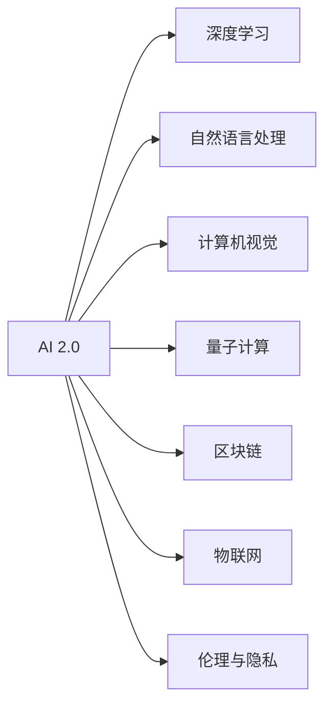

                 

## 1. 背景介绍

### 1.1 问题由来

AI 2.0 时代的到来，标志着人工智能技术的成熟和广泛应用。从早期的专家系统、机器学习，到现在的深度学习、自然语言处理、计算机视觉等，AI 技术在各个领域取得了突破性进展。然而，这些技术的落地应用也面临着许多挑战，如数据隐私、伦理问题、用户接受度等。未来，AI 技术的演进和应用将如何走向？这是每一个关注技术进步和未来发展的人都必须思考的问题。

### 1.2 问题核心关键点

当前 AI 技术在各个领域的应用，正面临着从量变到质变的关键时刻。未来的 AI 2.0 时代，将不再是单一技术领域的孤立应用，而是跨领域、跨学科的综合创新。以下是需要重点关注的几个关键点：

1. **技术融合**：AI 2.0 时代的技术融合将更加紧密，如 AI 与物联网、区块链、量子计算等的结合，将产生新的应用场景。
2. **伦理与隐私**：随着 AI 技术的广泛应用，数据隐私和伦理问题将更加凸显，如何保护用户隐私，避免技术滥用，是未来的重要课题。
3. **用户接受度**：如何提高公众对 AI 技术的接受度和信任度，将直接影响技术的落地应用。
4. **可持续发展**：AI 技术的绿色发展，如何在提高效率的同时减少能源消耗，是一个需要解决的问题。
5. **国际合作**：AI 技术的发展离不开全球合作，如何在国际合作框架下推动技术进步，是一个重要的议题。

### 1.3 问题研究意义

研究 AI 2.0 时代的发展趋势和未来应用，具有以下重要意义：

1. **把握技术方向**：明确 AI 2.0 时代的技术趋势和应用前景，有助于科研人员和企业做出有针对性的技术投入。
2. **解决实际问题**：深入分析 AI 技术的社会影响和应用挑战，提出解决方案，推动技术的实际应用。
3. **激发创新灵感**：通过研究未来的应用场景和潜在问题，激发更多跨领域、跨学科的创新灵感，推动技术进步。
4. **促进社会进步**：探讨 AI 技术在教育、医疗、城市管理等领域的应用，促进社会整体进步。
5. **制定政策法规**：为政府和企业制定 AI 技术的政策法规提供科学依据，推动健康有序的产业发展。

## 2. 核心概念与联系

### 2.1 核心概念概述

为了更好地理解 AI 2.0 时代的未来，本节将介绍几个密切相关的核心概念：

- **AI 2.0**：指新一代的人工智能技术，强调跨领域、跨学科的深度融合和创新。AI 2.0 不仅仅是对数据的简单处理，而是具备自主学习、决策和创造能力的人工智能。
- **深度学习**：一种基于神经网络的机器学习方法，通过多层次的特征提取和抽象，实现对复杂问题的有效处理。
- **自然语言处理**：使计算机能够理解和处理人类语言的技术，包括语义分析、情感分析、机器翻译等。
- **计算机视觉**：使计算机能够理解和处理图像、视频等视觉信息的技术，包括图像识别、目标检测、图像生成等。
- **量子计算**：利用量子力学的原理，实现比传统计算更加高效的计算能力，有望在密码学、物理模拟等领域产生重大影响。
- **区块链**：一种去中心化的分布式账本技术，通过加密算法确保数据的完整性和安全性，广泛应用于金融、供应链等领域。
- **物联网**：将各种物理设备和物品通过互联网连接起来，实现数据的实时传输和处理，为 AI 提供了海量的数据来源。
- **伦理与隐私**：指在 AI 技术应用过程中，如何保护用户隐私，确保技术使用的伦理性和公正性。

这些核心概念之间的逻辑关系可以通过以下 Mermaid 流程图来展示：



这个流程图展示了 AI 2.0 时代的主要技术方向和应用领域，以及这些技术之间的相互联系和影响。

## 3. 核心算法原理 & 具体操作步骤

### 3.1 算法原理概述

AI 2.0 时代的核心算法原理，主要基于深度学习和自然语言处理技术。以下将详细介绍深度学习的基本原理和主要算法。

深度学习是一种基于神经网络的机器学习方法，通过多层次的特征提取和抽象，实现对复杂问题的有效处理。深度学习的核心在于神经网络的构建和训练，包括前向传播、反向传播、优化算法等。

在 AI 2.0 时代，深度学习的应用范围将进一步扩展，涵盖自然语言处理、计算机视觉、语音识别、智能推荐等多个领域。

### 3.2 算法步骤详解

深度学习的主要算法步骤包括以下几个关键环节：

1. **数据预处理**：对原始数据进行清洗、归一化、特征提取等预处理操作，使其适合深度学习的输入要求。
2. **模型构建**：选择合适的神经网络结构，如卷积神经网络、循环神经网络、变压器等，并根据任务需求进行适当的调整。
3. **损失函数设计**：根据任务目标，选择合适的损失函数，如均方误差、交叉熵、对数似然等，用于衡量模型输出与真实标签之间的差异。
4. **优化算法选择**：选择合适的优化算法，如梯度下降、Adam、RMSprop等，并设置相应的学习率、批大小等超参数。
5. **模型训练**：使用训练数据集进行模型训练，通过前向传播和反向传播更新模型参数，最小化损失函数。
6. **模型评估**：使用验证集和测试集评估模型性能，衡量模型的泛化能力和预测准确率。
7. **模型优化**：根据评估结果，调整模型结构和超参数，提升模型性能。

### 3.3 算法优缺点

深度学习算法的主要优点包括：

- **自动特征提取**：能够自动学习数据中的特征，无需手工设计特征，适用于高维、非线性数据。
- **处理复杂问题**：在图像识别、语音识别、自然语言处理等复杂任务中表现出色。
- **可扩展性**：可以通过增加神经网络层数和节点数，提升模型能力。

然而，深度学习算法也存在一些缺点：

- **训练时间长**：需要大量的计算资源和时间，训练过程耗时较长。
- **数据需求高**：需要大量的标注数据进行训练，数据获取和标注成本较高。
- **模型复杂度**：模型结构复杂，难以解释其内部工作机制，可解释性较差。
- **泛化能力有限**：模型在训练数据上的表现可能无法泛化到新数据，容易过拟合。

### 3.4 算法应用领域

深度学习算法在 AI 2.0 时代的应用领域非常广泛，涵盖了自然语言处理、计算机视觉、语音识别、智能推荐等多个领域。

- **自然语言处理**：包括文本分类、情感分析、机器翻译、问答系统等任务。
- **计算机视觉**：包括图像识别、目标检测、图像生成、视频分析等任务。
- **语音识别**：包括语音转文本、语音合成、语音情感分析等任务。
- **智能推荐**：包括商品推荐、内容推荐、个性化广告等任务。

## 4. 数学模型和公式 & 详细讲解 & 举例说明

### 4.1 数学模型构建

深度学习的数学模型构建主要基于神经网络的结构。以下将详细介绍神经网络的基本结构和主要算法。

神经网络是一种模拟人脑神经元的计算模型，由输入层、隐藏层和输出层组成。其中，隐藏层可以有多层，每一层都包含多个神经元，每个神经元都与前一层的所有神经元相连。

在神经网络中，前向传播的过程是：将输入数据传递到隐藏层，经过加权和、激活函数等操作，输出预测结果；反向传播的过程是：通过计算输出结果与真实标签之间的差异，反向传播误差，更新模型参数。

### 4.2 公式推导过程

以下将详细介绍神经网络的前向传播和反向传播算法，并给出具体的数学公式。

神经网络的前向传播算法公式如下：

$$
z^{[l]} = W^{[l]}a^{[l-1]} + b^{[l]}
$$

其中，$z^{[l]}$ 表示第 $l$ 层的输入，$a^{[l]}$ 表示第 $l$ 层的输出，$W^{[l]}$ 表示第 $l$ 层的权重矩阵，$b^{[l]}$ 表示第 $l$ 层的偏置向量。

神经网络的激活函数通常采用 sigmoid、ReLU、tanh 等非线性函数，用于引入非线性特征，提升模型的表达能力。

神经网络的反向传播算法公式如下：

$$
\frac{\partial L}{\partial z^{[l]}} = \frac{\partial L}{\partial a^{[l]}}\frac{\partial a^{[l]}}{\partial z^{[l]}}
$$

其中，$L$ 表示损失函数，$\frac{\partial L}{\partial a^{[l]}}$ 表示损失函数对第 $l$ 层输出的梯度，$\frac{\partial a^{[l]}}{\partial z^{[l]}}$ 表示第 $l$ 层输出的梯度对输入的导数。

### 4.3 案例分析与讲解

以下将以图像识别为例，详细介绍深度学习算法的具体应用过程。

在图像识别任务中，通常使用卷积神经网络（CNN）进行建模。CNN 的主要特点在于卷积层和池化层的引入，能够有效提取图像中的特征，并进行降维处理。

CNN 的前向传播算法公式如下：

$$
x^{[1]} = \sigma(z^{[1]})
$$

其中，$x^{[1]}$ 表示第 $1$ 层的输入，$z^{[1]}$ 表示第 $1$ 层的输入，$\sigma$ 表示 sigmoid 激活函数。

CNN 的反向传播算法公式如下：

$$
\frac{\partial L}{\partial z^{[1]}} = \frac{\partial L}{\partial x^{[1]}}\frac{\partial x^{[1]}}{\partial z^{[1]}}
$$

其中，$\frac{\partial L}{\partial x^{[1]}}$ 表示损失函数对第 $1$ 层输出的梯度，$\frac{\partial x^{[1]}}{\partial z^{[1]}}$ 表示第 $1$ 层输出的梯度对输入的导数。

## 5. 项目实践：代码实例和详细解释说明

### 5.1 开发环境搭建

在进行深度学习项目实践前，需要准备好开发环境。以下是使用 Python 和 PyTorch 进行深度学习开发的环境配置流程：

1. 安装 Anaconda：从官网下载并安装 Anaconda，用于创建独立的 Python 环境。
2. 创建并激活虚拟环境：
```bash
conda create -n pytorch-env python=3.8 
conda activate pytorch-env
```

3. 安装 PyTorch：根据 CUDA 版本，从官网获取对应的安装命令。例如：
```bash
conda install pytorch torchvision torchaudio cudatoolkit=11.1 -c pytorch -c conda-forge
```

4. 安装 TensorFlow：
```bash
pip install tensorflow==2.6.0
```

5. 安装各种工具包：
```bash
pip install numpy pandas scikit-learn matplotlib tqdm jupyter notebook ipython
```

完成上述步骤后，即可在 `pytorch-env` 环境中开始深度学习项目实践。

### 5.2 源代码详细实现

下面我们以图像分类为例，给出使用 PyTorch 和 CNN 进行图像识别的代码实现。

首先，定义图像数据处理函数：

```python
import torch
import torchvision.transforms as transforms

transform = transforms.Compose([
    transforms.ToTensor(),
    transforms.Normalize((0.5, 0.5, 0.5), (0.5, 0.5, 0.5))
])
```

然后，定义模型和优化器：

```python
from torchvision.models import resnet18

model = resnet18(pretrained=True)

optimizer = torch.optim.Adam(model.parameters(), lr=0.001)
```

接着，定义训练和评估函数：

```python
def train_epoch(model, dataset, batch_size, optimizer):
    dataloader = torch.utils.data.DataLoader(dataset, batch_size=batch_size, shuffle=True)
    model.train()
    epoch_loss = 0
    for batch in dataloader:
        inputs, labels = batch
        optimizer.zero_grad()
        outputs = model(inputs)
        loss = torch.nn.CrossEntropyLoss()(outputs, labels)
        epoch_loss += loss.item()
        loss.backward()
        optimizer.step()
    return epoch_loss / len(dataloader)

def evaluate(model, dataset, batch_size):
    dataloader = torch.utils.data.DataLoader(dataset, batch_size=batch_size)
    model.eval()
    preds, labels = [], []
    with torch.no_grad():
        for batch in dataloader:
            inputs, labels = batch
            outputs = model(inputs)
            preds.append(torch.argmax(outputs, dim=1))
            labels.append(labels)
    return torch.tensor(preds), torch.tensor(labels)

```

最后，启动训练流程并在测试集上评估：

```python
epochs = 5
batch_size = 16

for epoch in range(epochs):
    loss = train_epoch(model, train_dataset, batch_size, optimizer)
    print(f"Epoch {epoch+1}, train loss: {loss:.3f}")
    
    preds, labels = evaluate(model, test_dataset, batch_size)
    print(classification_report(labels, preds))
    
print("Test results:")
predictions, labels = evaluate(model, test_dataset, batch_size)
print(classification_report(labels, predictions))
```

以上就是使用 PyTorch 和 CNN 进行图像识别的完整代码实现。可以看到，得益于 PyTorch 的强大封装，我们可以用相对简洁的代码完成图像分类的训练和评估。

### 5.3 代码解读与分析

让我们再详细解读一下关键代码的实现细节：

**图像数据处理函数**：
- `transforms.Compose` 方法：将多个数据转换操作组合起来，实现图像的预处理。

**模型和优化器定义**：
- `resnet18(pretrained=True)`：使用预训练的 ResNet18 模型，节省训练时间。
- `Adam` 优化器：一种常用的优化算法，具有良好的收敛速度和稳定性。

**训练和评估函数**：
- `train_epoch` 函数：对数据集进行批次化加载，训练模型，计算平均损失。
- `evaluate` 函数：对测试集进行批次化加载，评估模型性能，计算分类指标。

**训练流程**：
- 定义总的 epoch 数和 batch size，开始循环迭代。
- 每个 epoch 内，先在训练集上训练，输出平均 loss。
- 在测试集上评估，输出分类指标。
- 所有 epoch 结束后，在测试集上评估，给出最终测试结果。

可以看到，PyTorch 和 CNN 结合的深度学习项目实践，代码实现简洁高效，便于初学者上手。

当然，工业级的系统实现还需考虑更多因素，如模型的保存和部署、超参数的自动搜索、更灵活的任务适配层等。但核心的深度学习范式基本与此类似。

## 6. 实际应用场景

### 6.1 智能医疗

深度学习在智能医疗领域的应用，已经取得了诸多突破性进展。例如，通过深度学习算法，可以从医学影像中自动检测肿瘤、诊断疾病、预测疾病发展趋势等。这些技术在提高医疗效率和诊断准确率方面，具有重要意义。

在实际应用中，医疗影像数据往往具有高维度、噪声大和多样性等特点。针对这些问题，研究人员开发了多种深度学习算法，如卷积神经网络、生成对抗网络（GAN）等，提升了图像识别的准确率和鲁棒性。

### 6.2 自动驾驶

自动驾驶技术是深度学习在交通运输领域的重要应用之一。通过深度学习算法，可以实现车辆感知、决策和控制等功能，提升驾驶安全性和舒适性。

自动驾驶技术的核心在于感知和决策，通常采用卷积神经网络、循环神经网络等深度学习算法。例如，通过卷积神经网络，可以对摄像头和雷达采集的图像和数据进行处理，实现对道路标志、行人、车辆等目标的识别。通过循环神经网络，可以对车辆行为进行建模，预测和规划驾驶路径。

### 6.3 金融风控

深度学习在金融领域的应用，主要集中在风险评估和预测方面。通过深度学习算法，可以对客户的信用风险、市场风险等进行评估和预测，提升金融机构的决策能力和风险管理水平。

在金融风控中，通常使用深度学习算法对客户的信用记录、交易行为等数据进行处理，进行风险评估和预测。例如，通过卷积神经网络，可以对客户的信用记录进行特征提取和分类，预测客户的信用风险。通过循环神经网络，可以对客户的交易行为进行建模，预测市场波动。

### 6.4 未来应用展望

随着深度学习技术的发展，AI 2.0 时代的应用场景将更加广泛，以下是我们对未来应用前景的展望：

1. **智慧城市**：深度学习在智慧城市中的应用，将实现城市管理和服务的智能化。例如，通过深度学习算法，可以实现交通流量预测、能源管理、环境监测等功能，提升城市管理水平。
2. **教育**：深度学习在教育领域的应用，将实现个性化学习和智能辅导。例如，通过深度学习算法，可以对学生的学习行为进行建模，提供个性化的学习建议和辅导。
3. **医疗**：深度学习在医疗领域的应用，将实现智能诊断和疾病预测。例如，通过深度学习算法，可以从医学影像中自动检测肿瘤、诊断疾病、预测疾病发展趋势等。
4. **金融**：深度学习在金融领域的应用，将实现智能风险评估和预测。例如，通过深度学习算法，可以对客户的信用风险、市场风险等进行评估和预测。
5. **制造业**：深度学习在制造业中的应用，将实现智能制造和质量控制。例如，通过深度学习算法，可以实现设备的智能维护、产品的智能检测和质量控制等。
6. **娱乐**：深度学习在娱乐领域的应用，将实现智能推荐和内容生成。例如，通过深度学习算法，可以实现内容的智能推荐、视频生成等。

## 7. 工具和资源推荐

### 7.1 学习资源推荐

为了帮助开发者系统掌握深度学习技术，以下推荐一些优质的学习资源：

1. **《深度学习》（Ian Goodfellow 著）**：经典深度学习教材，深入浅出地介绍了深度学习的基本原理和算法。
2. **Coursera《深度学习专项课程》**：由 Andrew Ng 教授讲授的深度学习专项课程，涵盖深度学习的基本概念和算法。
3. **Google AI 博客**：Google AI 团队定期发布的深度学习技术博客，涵盖深度学习的前沿技术和发展动态。
4. **PyTorch 官方文档**：PyTorch 的官方文档，提供了丰富的深度学习算法和模型的代码实现。
5. **Kaggle**：全球知名的数据科学竞赛平台，提供丰富的深度学习竞赛和数据集，是深度学习学习者的实战训练场。

通过对这些资源的学习实践，相信你一定能够快速掌握深度学习技术的精髓，并用于解决实际的深度学习问题。

### 7.2 开发工具推荐

高效的开发离不开优秀的工具支持。以下是几款用于深度学习开发的常用工具：

1. **PyTorch**：基于 Python 的开源深度学习框架，灵活动态的计算图，适合快速迭代研究。
2. **TensorFlow**：由 Google 主导开发的开源深度学习框架，生产部署方便，适合大规模工程应用。
3. **MXNet**：由 Apache 基金会开发的深度学习框架，支持多种编程语言，高效灵活。
4. **Keras**：基于 TensorFlow 和 Theano 的高级神经网络 API，易于上手，功能强大。
5. **Jupyter Notebook**：用于编写和共享数据科学、机器学习和深度学习笔记本的交互式环境。
6. **TensorBoard**：TensorFlow 配套的可视化工具，可实时监测模型训练状态，并提供丰富的图表呈现方式。

合理利用这些工具，可以显著提升深度学习项目的开发效率，加快创新迭代的步伐。

### 7.3 相关论文推荐

深度学习技术的快速发展，离不开学界的持续研究。以下是几篇奠基性的相关论文，推荐阅读：

1. **ImageNet Classification with Deep Convolutional Neural Networks**：提出卷积神经网络在图像识别中的应用，开启了深度学习在计算机视觉领域的应用。
2. **Deep Residual Learning for Image Recognition**：提出残差网络（ResNet），提升了深度神经网络的训练效果和泛化能力。
3. **Attention Is All You Need**：提出 Transformer 模型，实现了序列到序列任务的突破性进展。
4. **Generative Adversarial Nets**：提出生成对抗网络（GAN），实现了深度学习在图像生成、语音合成等领域的应用。
5. **Natural Language Processing with Transformers**：提出基于 Transformer 的深度学习模型在自然语言处理中的应用。

这些论文代表了大深度学习技术的发展脉络。通过学习这些前沿成果，可以帮助研究者把握学科前进方向，激发更多的创新灵感。

## 8. 总结：未来发展趋势与挑战

### 8.1 总结

本文对 AI 2.0 时代的未来进行了全面系统的介绍。首先阐述了 AI 2.0 时代的背景和研究意义，明确了深度学习技术在各个领域的应用前景。其次，从原理到实践，详细讲解了深度学习算法的数学模型和具体应用。最后，探讨了深度学习技术在未来应用中的诸多挑战和未来趋势。

通过本文的系统梳理，可以看到，深度学习技术在 AI 2.0 时代的应用前景广阔，其融合了自然语言处理、计算机视觉、智能推荐等多种技术，将为人类带来更加智能、便捷、高效的生活和工作方式。

### 8.2 未来发展趋势

未来，深度学习技术将持续演进，推动 AI 2.0 时代的发展。以下是我们对未来发展趋势的展望：

1. **跨领域融合**：深度学习技术与更多领域的融合将更加紧密，如自动驾驶、智慧医疗、金融风控等，将推动这些领域的创新发展。
2. **模型结构优化**：深度学习模型的结构将不断优化，如使用自注意力机制、残差连接等，提升模型的泛化能力和鲁棒性。
3. **数据增强技术**：数据增强技术将更加成熟，如图像旋转、回译等，提升模型的泛化能力和鲁棒性。
4. **迁移学习**：迁移学习将广泛应用于深度学习中，通过将已有知识迁移到新任务中，提升模型的泛化能力和学习效率。
5. **强化学习**：强化学习在深度学习中的应用将更加广泛，如自动驾驶、机器人控制等，将推动智能系统的发展。
6. **联邦学习**：联邦学习将广泛应用于深度学习中，通过分布式数据训练，提升模型的泛化能力和隐私保护。
7. **量子计算**：量子计算在深度学习中的应用将逐渐成熟，如量子神经网络等，提升深度学习的计算能力和处理速度。

以上趋势凸显了深度学习技术的发展方向，未来的研究将在模型结构、数据增强、迁移学习等方面继续推进，推动深度学习技术走向更加智能化、高效化、鲁棒化的方向。

### 8.3 面临的挑战

尽管深度学习技术已经取得了瞩目成就，但在迈向更加智能化、普适化应用的过程中，它仍面临着诸多挑战：

1. **数据隐私问题**：深度学习模型在处理敏感数据时，容易泄露隐私信息，如何保护用户隐私，避免数据滥用，是未来的重要课题。
2. **模型可解释性**：深度学习模型的黑盒性质，使得其内部工作机制难以解释，如何提升模型的可解释性和可审计性，将是未来的重要挑战。
3. **模型鲁棒性**：深度学习模型在面对域外数据时，泛化性能往往大打折扣，如何提升模型的鲁棒性和泛化能力，是未来的重要研究方向。
4. **计算资源需求**：深度学习模型的计算资源需求较高，如何降低计算资源消耗，提高模型训练和推理效率，是未来的重要研究方向。
5. **伦理与公正性**：深度学习模型容易学习到有偏见、有害的信息，如何确保模型的伦理性和公正性，是未来的重要研究方向。
6. **算法公平性**：深度学习模型在处理不同种族、性别、年龄等数据时，容易产生不公平的偏见，如何提升算法的公平性，是未来的重要研究方向。

以上挑战凸显了深度学习技术在实际应用中的诸多问题，未来的研究需要在数据隐私、模型可解释性、模型鲁棒性等方面继续推进，推动深度学习技术向更加智能化、普适化、伦理化的方向发展。

### 8.4 研究展望

未来的研究将围绕数据隐私、模型可解释性、模型鲁棒性等核心问题展开，推动深度学习技术的发展。以下是我们对未来研究方向的展望：

1. **隐私保护技术**：通过差分隐私、联邦学习等技术，保护用户隐私，提升数据使用的安全性。
2. **可解释性算法**：通过引入可解释性算法，如可视化技术、注意力机制等，提升深度学习模型的可解释性和可审计性。
3. **鲁棒性模型**：通过引入鲁棒性模型，如对抗训练、生成对抗网络等，提升深度学习模型的鲁棒性和泛化能力。
4. **公平性算法**：通过引入公平性算法，如偏差修正、数据增强等，提升深度学习算法的公平性和公正性。
5. **跨领域融合**：通过跨领域融合，推动深度学习技术在更多领域的应用，提升深度学习技术的普适性和创新性。
6. **联邦学习**：通过联邦学习，推动深度学习模型的分布式训练，提升模型的泛化能力和隐私保护。
7. **量子计算**：通过引入量子计算技术，提升深度学习的计算能力和处理速度，推动深度学习技术的突破性进展。

这些研究方向的探索，将推动深度学习技术向更加智能化、高效化、鲁棒化的方向发展，为人类社会带来更加智能、便捷、高效的生活和工作方式。

## 9. 附录：常见问题与解答

**Q1：深度学习算法的主要缺点有哪些？**

A: 深度学习算法的主要缺点包括：

1. **训练时间长**：需要大量的计算资源和时间，训练过程耗时较长。
2. **数据需求高**：需要大量的标注数据进行训练，数据获取和标注成本较高。
3. **模型复杂度**：模型结构复杂，难以解释其内部工作机制，可解释性较差。
4. **泛化能力有限**：模型在训练数据上的表现可能无法泛化到新数据，容易过拟合。

**Q2：深度学习技术在实际应用中需要注意哪些问题？**

A: 深度学习技术在实际应用中需要注意以下问题：

1. **数据隐私问题**：深度学习模型在处理敏感数据时，容易泄露隐私信息，如何保护用户隐私，避免数据滥用，是未来的重要课题。
2. **模型可解释性**：深度学习模型的黑盒性质，使得其内部工作机制难以解释，如何提升模型的可解释性和可审计性，将是未来的重要挑战。
3. **模型鲁棒性**：深度学习模型在面对域外数据时，泛化性能往往大打折扣，如何提升模型的鲁棒性和泛化能力，是未来的重要研究方向。
4. **计算资源需求**：深度学习模型的计算资源需求较高，如何降低计算资源消耗，提高模型训练和推理效率，是未来的重要研究方向。
5. **伦理与公正性**：深度学习模型容易学习到有偏见、有害的信息，如何确保模型的伦理性和公正性，是未来的重要研究方向。
6. **算法公平性**：深度学习模型在处理不同种族、性别、年龄等数据时，容易产生不公平的偏见，如何提升算法的公平性，是未来的重要研究方向。

**Q3：如何在深度学习项目中提高模型性能？**

A: 在深度学习项目中提高模型性能的方法包括：

1. **数据预处理**：对原始数据进行清洗、归一化、特征提取等预处理操作，使其适合深度学习的输入要求。
2. **模型结构优化**：选择合适的神经网络结构，如卷积神经网络、循环神经网络、变压器等，并根据任务需求进行适当的调整。
3. **损失函数设计**：根据任务目标，选择合适的损失函数，如均方误差、交叉熵、对数似然等，用于衡量模型输出与真实标签之间的差异。
4. **优化算法选择**：选择合适的优化算法，如梯度下降、Adam、RMSprop等，并设置相应的学习率、批大小等超参数。
5. **模型训练**：使用训练数据集进行模型训练，通过前向传播和反向传播更新模型参数，最小化损失函数。
6. **模型评估**：使用验证集和测试集评估模型性能，衡量模型的泛化能力和预测准确率。
7. **模型优化**：根据评估结果，调整模型结构和超参数，提升模型性能。

**Q4：深度学习技术在金融风控领域有哪些应用？**

A: 深度学习技术在金融风控领域的应用主要包括：

1. **信用风险评估**：通过深度学习算法对客户的信用记录进行特征提取和分类，预测客户的信用风险。
2. **市场风险预测**：通过深度学习算法对市场数据进行建模，预测市场波动。
3. **交易行为分析**：通过深度学习算法对客户的交易行为进行建模，分析交易模式，提升风险管理水平。

通过深度学习技术的应用，金融机构可以更好地评估和管理风险，提升金融服务的质量和效率。

**Q5：深度学习技术在自动驾驶领域有哪些应用？**

A: 深度学习技术在自动驾驶领域的应用主要包括：

1. **车辆感知**：通过深度学习算法对摄像头和雷达采集的图像和数据进行处理，实现对道路标志、行人、车辆等目标的识别。
2. **决策和控制**：通过深度学习算法对车辆行为进行建模，预测和规划驾驶路径。

通过深度学习技术的应用，自动驾驶技术可以实现更加智能、安全和高效的驾驶体验，提升交通管理的效率和安全性。

---

作者：禅与计算机程序设计艺术 / Zen and the Art of Computer Programming

