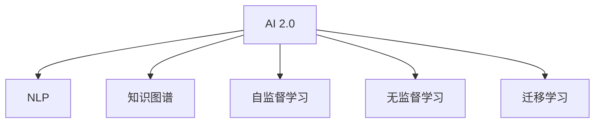

                 

## 1. 背景介绍

### 1.1 问题由来

随着人工智能技术的飞速发展，AI正从1.0时代向2.0时代迈进，逐步从单一任务走向跨领域、全栈式的能力。AI 2.0 将成为未来人工智能发展的新趋势，它能够真正理解人类的语言和行为，并在各种情境下提供更加智能化、个性化的服务。AI 2.0 技术的发展，将深刻影响社会生活的方方面面，包括医疗、教育、金融、交通等领域。

### 1.2 问题核心关键点

AI 2.0 的核心在于其理解和处理自然语言的能力，通过自然语言处理(NLP)、计算机视觉(CV)、语音识别等技术，实现对人类语言的深刻理解和生成。AI 2.0 将不仅限于数据驱动，而是更注重知识驱动，通过学习更广泛的知识图谱和逻辑推理能力，提升模型的泛化性和决策的透明性。

## 2. 核心概念与联系

### 2.1 核心概念概述

为更好地理解 AI 2.0 时代的未来，本节将介绍几个密切相关的核心概念：

- AI 2.0：新一代人工智能，区别于以往依赖大量标注数据的监督学习，更强调模型的泛化能力和知识驱动的推理能力。
- 自然语言处理(NLP)：使计算机能够理解、处理和生成人类语言的技术。
- 知识图谱(KG)：用于描述实体、关系和属性的知识结构，支持复杂的逻辑推理和知识整合。
- 自监督学习(Self-Supervised Learning)：利用数据本身的内在结构进行学习，无需外部标注。
- 无监督学习(Unsupervised Learning)：在没有标注数据的情况下，通过数据的内在规律进行学习。
- 迁移学习(Transfer Learning)：将一个领域学到的知识迁移到另一个相关领域，提升模型的泛化能力。

这些核心概念之间的逻辑关系可以通过以下Mermaid流程图来展示：



这个流程图展示了这个AI 2.0 时代的核心概念及其之间的关系：

1. AI 2.0 将AI技术从单一任务走向跨领域全栈式能力。
2. NLP 是实现AI 2.0 的基础技术，使机器能理解人类语言。
3. 知识图谱为AI 2.0 提供了更广泛的知识背景，支持复杂的逻辑推理。
4. 自监督学习和无监督学习使得AI 2.0 模型能更高效地学习和泛化。
5. 迁移学习使得AI 2.0 模型能跨领域应用，提升模型泛化能力。

## 3. 核心算法原理 & 具体操作步骤

### 3.1 算法原理概述

AI 2.0 时代的核心算法原理主要围绕自然语言理解和生成展开。其核心技术包括：

1. **自监督预训练**：在大规模无标签文本数据上进行预训练，学习通用的语言表示。
2. **微调**：在特定任务的标注数据上进行微调，优化模型在特定任务上的性能。
3. **知识增强**：结合知识图谱，提升模型的泛化能力和推理能力。
4. **迁移学习**：将模型在其他领域的知识迁移到当前任务中，提升模型泛化能力。

### 3.2 算法步骤详解

1. **数据准备**：收集大规模无标签文本数据，构建训练集和验证集。
2. **预训练模型选择**：选择合适的大规模预训练语言模型，如GPT-3、BERT等。
3. **微调任务设计**：根据具体任务设计相应的微调目标函数和损失函数。
4. **微调超参数设置**：选择合适的学习率、批大小、迭代轮数等超参数。
5. **模型训练**：在标注数据上使用梯度下降等优化算法进行微调。
6. **模型评估**：在验证集和测试集上评估模型性能，调整模型参数。
7. **应用部署**：将训练好的模型应用于实际应用场景中。

### 3.3 算法优缺点

AI 2.0 时代的算法具有以下优点：

1. **泛化能力强**：通过自监督预训练和迁移学习，模型能够从无标签数据和领域知识中学习到泛化能力，适应不同任务。
2. **计算效率高**：大规模预训练模型可以在短时间内完成预训练，提升微调效率。
3. **可解释性强**：通过知识图谱和逻辑推理，模型输出的决策过程更透明，更易于理解和调试。
4. **应用场景广**：NLP、CV、语音识别等多领域应用中，AI 2.0 模型均能取得良好效果。

同时，这些算法也存在一定的局限性：

1. **数据需求大**：自监督预训练和微调都需要大量数据，获取和标注成本高。
2. **计算资源消耗大**：大规模模型和微调任务对计算资源需求大，成本高。
3. **知识局限**：当前知识图谱和逻辑推理方法尚不够完善，模型的推理能力有待提升。
4. **可解释性不足**：部分AI 2.0 模型仍存在"黑盒"问题，难以解释其内部工作机制。

### 3.4 算法应用领域

AI 2.0 时代的算法已经在NLP、CV、语音识别等多个领域得到广泛应用，以下是几个典型应用场景：

- **智能客服**：通过NLP技术，智能客服系统能够理解用户问题，自动生成应答，提升客户体验。
- **医疗诊断**：结合医疗知识图谱和病历数据，AI 2.0 模型能够辅助医生进行疾病诊断和治疗方案推荐。
- **金融风险控制**：通过情感分析、知识增强等技术，AI 2.0 模型能够实时监测市场舆情，控制金融风险。
- **教育个性化推荐**：通过知识图谱和学生行为数据，AI 2.0 模型能够实现个性化学习推荐，提升教育效果。
- **自动驾驶**：通过CV技术，AI 2.0 模型能够实时感知和理解道路环境，辅助自动驾驶系统做出决策。

## 4. 数学模型和公式 & 详细讲解 & 举例说明

### 4.1 数学模型构建

AI 2.0 时代的核心模型通常基于Transformer架构，包括自监督预训练和微调两个阶段。以BERT模型为例，其核心数学模型包括：

1. **自监督预训练**：通过掩码语言模型(Masked Language Model, MLM)和下一句预测任务(Next Sentence Prediction, NSP)进行自监督学习，构建预训练模型。
2. **微调**：在特定任务的标注数据上，设计相应的损失函数，使用梯度下降等优化算法进行微调，优化模型在特定任务上的性能。

### 4.2 公式推导过程

#### 掩码语言模型

掩码语言模型公式为：

$$
L_{MLM} = -\frac{1}{N} \sum_{i=1}^N \sum_{j=1}^V [\log P(y_j|x_i)]
$$

其中 $x_i$ 为输入序列，$y_j$ 为掩码后的输出单词，$P$ 为模型输出的概率分布。

#### 下一句预测任务

下一句预测任务公式为：

$$
L_{NSP} = -\frac{1}{N} \sum_{i=1}^N \sum_{j=1}^N [\log P(y_j|x_i)]
$$

其中 $x_i$ 为输入序列，$y_j$ 为下一句预测结果，$P$ 为模型输出的概率分布。

### 4.3 案例分析与讲解

以智能客服系统为例，展示AI 2.0 模型在实际应用中的表现。

智能客服系统通常包含以下几个环节：

1. **意图识别**：通过NLP技术，识别用户输入的自然语言文本，理解用户意图。
2. **实体抽取**：从用户输入中抽取实体信息，如姓名、地址等。
3. **对话生成**：根据用户意图和实体信息，生成应答，辅助客服人员回答用户问题。
4. **知识图谱查询**：结合知识图谱，增强对话生成能力，提升回答的准确性和相关性。
5. **对话历史分析**：分析用户对话历史，推荐相关问题，提升用户体验。

以用户输入"请问最近的地铁入口在哪里？"为例，智能客服系统可能按照以下步骤处理：

1. **意图识别**：识别用户意图为"查询地铁入口"。
2. **实体抽取**：抽取用户提供的地理位置信息。
3. **对话生成**：根据意图和实体信息，生成应答"最近的地铁入口在xx路xx号"。
4. **知识图谱查询**：结合知识图谱，验证地铁入口的正确性。
5. **对话历史分析**：分析用户对话历史，推荐相关问题"需要乘坐哪一路地铁？"

通过这些环节，AI 2.0 模型能够理解用户意图，生成精准应答，大大提升客户体验。

## 5. 项目实践：代码实例和详细解释说明

### 5.1 开发环境搭建

在进行AI 2.0 模型的开发实践前，我们需要准备好开发环境。以下是使用Python进行PyTorch开发的环境配置流程：

1. 安装Anaconda：从官网下载并安装Anaconda，用于创建独立的Python环境。

2. 创建并激活虚拟环境：
```bash
conda create -n pytorch-env python=3.8 
conda activate pytorch-env
```

3. 安装PyTorch：根据CUDA版本，从官网获取对应的安装命令。例如：
```bash
conda install pytorch torchvision torchaudio cudatoolkit=11.1 -c pytorch -c conda-forge
```

4. 安装Transformers库：
```bash
pip install transformers
```

5. 安装各类工具包：
```bash
pip install numpy pandas scikit-learn matplotlib tqdm jupyter notebook ipython
```

完成上述步骤后，即可在`pytorch-env`环境中开始AI 2.0 模型的开发实践。

### 5.2 源代码详细实现

下面我们以智能客服系统为例，给出使用Transformers库进行NLP任务的PyTorch代码实现。

首先，定义智能客服系统中的意图识别任务：

```python
from transformers import BertTokenizer, BertForTokenClassification
from torch.utils.data import Dataset
import torch

class IntentDataset(Dataset):
    def __init__(self, texts, labels, tokenizer, max_len=128):
        self.texts = texts
        self.labels = labels
        self.tokenizer = tokenizer
        self.max_len = max_len
        
    def __len__(self):
        return len(self.texts)
    
    def __getitem__(self, item):
        text = self.texts[item]
        label = self.labels[item]
        
        encoding = self.tokenizer(text, return_tensors='pt', max_length=self.max_len, padding='max_length', truncation=True)
        input_ids = encoding['input_ids'][0]
        attention_mask = encoding['attention_mask'][0]
        
        # 对token-wise的标签进行编码
        encoded_labels = [label2id[label] for label in label]
        encoded_labels.extend([label2id['O']] * (self.max_len - len(encoded_labels)))
        labels = torch.tensor(encoded_labels, dtype=torch.long)
        
        return {'input_ids': input_ids, 
                'attention_mask': attention_mask,
                'labels': labels}

# 标签与id的映射
label2id = {'意图识别': 0, '查询地图': 1, '查询天气': 2, '查询医院': 3}
id2label = {v: k for k, v in label2id.items()}

# 创建dataset
tokenizer = BertTokenizer.from_pretrained('bert-base-cased')

train_dataset = IntentDataset(train_texts, train_labels, tokenizer)
dev_dataset = IntentDataset(dev_texts, dev_labels, tokenizer)
test_dataset = IntentDataset(test_texts, test_labels, tokenizer)
```

然后，定义模型和优化器：

```python
from transformers import BertForTokenClassification, AdamW

model = BertForTokenClassification.from_pretrained('bert-base-cased', num_labels=len(label2id))

optimizer = AdamW(model.parameters(), lr=2e-5)
```

接着，定义训练和评估函数：

```python
from torch.utils.data import DataLoader
from tqdm import tqdm
from sklearn.metrics import classification_report

device = torch.device('cuda') if torch.cuda.is_available() else torch.device('cpu')
model.to(device)

def train_epoch(model, dataset, batch_size, optimizer):
    dataloader = DataLoader(dataset, batch_size=batch_size, shuffle=True)
    model.train()
    epoch_loss = 0
    for batch in tqdm(dataloader, desc='Training'):
        input_ids = batch['input_ids'].to(device)
        attention_mask = batch['attention_mask'].to(device)
        labels = batch['labels'].to(device)
        model.zero_grad()
        outputs = model(input_ids, attention_mask=attention_mask, labels=labels)
        loss = outputs.loss
        epoch_loss += loss.item()
        loss.backward()
        optimizer.step()
    return epoch_loss / len(dataloader)

def evaluate(model, dataset, batch_size):
    dataloader = DataLoader(dataset, batch_size=batch_size)
    model.eval()
    preds, labels = [], []
    with torch.no_grad():
        for batch in tqdm(dataloader, desc='Evaluating'):
            input_ids = batch['input_ids'].to(device)
            attention_mask = batch['attention_mask'].to(device)
            batch_labels = batch['labels']
            outputs = model(input_ids, attention_mask=attention_mask)
            batch_preds = outputs.logits.argmax(dim=2).to('cpu').tolist()
            batch_labels = batch_labels.to('cpu').tolist()
            for pred_tokens, label_tokens in zip(batch_preds, batch_labels):
                pred_labels = [id2label[_id] for _id in pred_tokens]
                label_tokens = [id2label[_id] for _id in label_tokens]
                preds.append(pred_labels[:len(label_tokens)])
                labels.append(label_tokens)
                
    print(classification_report(labels, preds))
```

最后，启动训练流程并在测试集上评估：

```python
epochs = 5
batch_size = 16

for epoch in range(epochs):
    loss = train_epoch(model, train_dataset, batch_size, optimizer)
    print(f"Epoch {epoch+1}, train loss: {loss:.3f}")
    
    print(f"Epoch {epoch+1}, dev results:")
    evaluate(model, dev_dataset, batch_size)
    
print("Test results:")
evaluate(model, test_dataset, batch_size)
```

以上就是使用PyTorch对BERT进行意图识别任务微调的完整代码实现。可以看到，得益于Transformers库的强大封装，我们可以用相对简洁的代码完成BERT模型的加载和微调。

### 5.3 代码解读与分析

让我们再详细解读一下关键代码的实现细节：

**IntentDataset类**：
- `__init__`方法：初始化文本、标签、分词器等关键组件。
- `__len__`方法：返回数据集的样本数量。
- `__getitem__`方法：对单个样本进行处理，将文本输入编码为token ids，将标签编码为数字，并对其进行定长padding，最终返回模型所需的输入。

**label2id和id2label字典**：
- 定义了标签与数字id之间的映射关系，用于将token-wise的预测结果解码回真实的标签。

**训练和评估函数**：
- 使用PyTorch的DataLoader对数据集进行批次化加载，供模型训练和推理使用。
- 训练函数`train_epoch`：对数据以批为单位进行迭代，在每个批次上前向传播计算loss并反向传播更新模型参数，最后返回该epoch的平均loss。
- 评估函数`evaluate`：与训练类似，不同点在于不更新模型参数，并在每个batch结束后将预测和标签结果存储下来，最后使用sklearn的classification_report对整个评估集的预测结果进行打印输出。

**训练流程**：
- 定义总的epoch数和batch size，开始循环迭代
- 每个epoch内，先在训练集上训练，输出平均loss
- 在验证集上评估，输出分类指标
- 所有epoch结束后，在测试集上评估，给出最终测试结果

可以看到，PyTorch配合Transformers库使得BERT微调的代码实现变得简洁高效。开发者可以将更多精力放在数据处理、模型改进等高层逻辑上，而不必过多关注底层的实现细节。

当然，工业级的系统实现还需考虑更多因素，如模型的保存和部署、超参数的自动搜索、更灵活的任务适配层等。但核心的微调范式基本与此类似。

## 6. 实际应用场景

### 6.1 智能客服系统

基于AI 2.0 技术的智能客服系统，通过自然语言理解技术，可以自动理解用户意图，提供智能应答，显著提升客户体验。智能客服系统通常包含以下环节：

1. **意图识别**：通过NLP技术，识别用户输入的自然语言文本，理解用户意图。
2. **实体抽取**：从用户输入中抽取实体信息，如姓名、地址等。
3. **对话生成**：根据用户意图和实体信息，生成应答，辅助客服人员回答用户问题。
4. **知识图谱查询**：结合知识图谱，增强对话生成能力，提升回答的准确性和相关性。
5. **对话历史分析**：分析用户对话历史，推荐相关问题，提升用户体验。

### 6.2 医疗诊断

AI 2.0 技术在医疗诊断中的应用，通过结合医疗知识图谱和病历数据，可以辅助医生进行疾病诊断和治疗方案推荐。具体而言，可以通过以下步骤实现：

1. **病历分析**：利用NLP技术，自动抽取和分析患者的病历数据，理解其病史和症状。
2. **知识图谱查询**：结合医疗知识图谱，查询与患者症状和病史相关的疾病和治疗方法。
3. **诊断推荐**：根据查询结果，推荐可能的诊断和治疗方案，辅助医生进行决策。
4. **治疗方案优化**：利用知识图谱，动态调整治疗方案，提升治疗效果。

### 6.3 金融风险控制

AI 2.0 技术在金融领域的应用，可以通过情感分析、知识增强等技术，实时监测市场舆情，控制金融风险。具体而言，可以通过以下步骤实现：

1. **舆情监测**：利用NLP技术，自动分析社交媒体、新闻报道等数据，监测市场舆情。
2. **风险识别**：根据舆情数据，识别潜在的金融风险，如市场波动、信用风险等。
3. **风险控制**：结合知识图谱，动态调整金融策略，控制金融风险。
4. **风险预警**：根据舆情数据，及时发出风险预警，防止金融风险扩散。

### 6.4 未来应用展望

随着AI 2.0 技术的不断发展，未来的应用场景将更加广泛和深入。以下是几个未来应用展望：

1. **智慧城市**：AI 2.0 技术在智慧城市中的应用，通过自然语言理解、知识图谱等技术，提升城市管理水平，如交通流量控制、环境监测等。
2. **教育个性化**：AI 2.0 技术在教育中的应用，通过知识图谱和学生行为数据，实现个性化学习推荐，提升教育效果。
3. **智能家居**：AI 2.0 技术在智能家居中的应用，通过自然语言理解、知识图谱等技术，提升家居智能化水平，如语音控制、场景感知等。
4. **智慧农业**：AI 2.0 技术在智慧农业中的应用，通过自然语言理解、知识图谱等技术，提升农业生产效率，如智能灌溉、精准施肥等。

## 7. 工具和资源推荐

### 7.1 学习资源推荐

为了帮助开发者系统掌握AI 2.0 技术的理论基础和实践技巧，这里推荐一些优质的学习资源：

1. **《深度学习》教材**：由Goodfellow等著，全面介绍了深度学习的原理和应用。
2. **NLP专项课程**：如Coursera的NLP专项课程，涵盖了自然语言处理的基本概念和经典模型。
3. **NLP开源项目**：如HuggingFace的Transformers库，提供了丰富的预训练模型和微调样例代码，是NLP开发的重要工具。
4. **AI 2.0 论文集**：通过阅读最新的AI 2.0 论文，了解前沿技术动态，获取灵感和思路。
5. **AI 2.0 社区**：如GitHub的AI 2.0 社区，汇集了大量开源项目和代码实现，是学习和交流的重要平台。

通过对这些资源的学习实践，相信你一定能够快速掌握AI 2.0 技术的精髓，并用于解决实际的NLP问题。

### 7.2 开发工具推荐

高效的开发离不开优秀的工具支持。以下是几款用于AI 2.0 开发的重要工具：

1. **Jupyter Notebook**：Python的交互式编程环境，适合进行代码实验和数据可视化。
2. **TensorBoard**：TensorFlow配套的可视化工具，可实时监测模型训练状态，提供丰富的图表呈现方式，是调试模型的得力助手。
3. **Weights & Biases**：模型训练的实验跟踪工具，可以记录和可视化模型训练过程中的各项指标，方便对比和调优。
4. **PyTorch Lightning**：基于PyTorch的模型训练框架，支持动态模型定义和分布式训练，提高开发效率。
5. **GluonCV**：深度学习框架MXNet的计算机视觉模块，提供丰富的CV模型和工具。

合理利用这些工具，可以显著提升AI 2.0 模型的开发效率，加快创新迭代的步伐。

### 7.3 相关论文推荐

AI 2.0 技术的发展源于学界的持续研究。以下是几篇奠基性的相关论文，推荐阅读：

1. **Attention is All You Need**：提出Transformer结构，开启了NLP领域的预训练大模型时代。
2. **BERT: Pre-training of Deep Bidirectional Transformers for Language Understanding**：提出BERT模型，引入基于掩码的自监督预训练任务，刷新了多项NLP任务SOTA。
3. **M mixture of experts for few-shot learning**：提出M-MoE模型，利用混合专家机制，实现少样本学习。
4. **Prompt Engineering for Large Language Models**：介绍Prompt技术，通过精心设计输入模板，引导模型按期望方式输出，提升少样本学习和可解释性。
5. **Evolving Neural Networks for Explainability**：提出EvoNN模型，通过进化算法优化神经网络，提升模型的可解释性。

这些论文代表了大语言模型和AI 2.0 技术的发展脉络。通过学习这些前沿成果，可以帮助研究者把握学科前进方向，激发更多的创新灵感。

## 8. 总结：未来发展趋势与挑战

### 8.1 总结

本文对AI 2.0 时代的未来进行了全面系统的介绍。首先阐述了AI 2.0 技术的背景和意义，明确了AI 2.0 技术在自然语言处理、医疗、金融等领域的应用前景。其次，从原理到实践，详细讲解了AI 2.0 技术的核心算法原理和具体操作步骤，给出了微调任务开发的完整代码实例。同时，本文还广泛探讨了AI 2.0 技术在智能客服、医疗诊断、金融风险控制等具体场景的应用，展示了AI 2.0 技术的强大潜力。此外，本文精选了AI 2.0 技术的各类学习资源，力求为读者提供全方位的技术指引。

通过本文的系统梳理，可以看到，AI 2.0 技术正逐步从单一任务走向跨领域、全栈式能力，成为未来人工智能的重要方向。AI 2.0 技术的落地应用将深刻影响社会生活的方方面面，带来革命性的变化。

### 8.2 未来发展趋势

展望未来，AI 2.0 技术的发展趋势主要包括以下几个方向：

1. **多模态融合**：AI 2.0 技术将结合NLP、CV、语音识别等多模态数据，提升模型的综合能力。
2. **知识图谱应用**：知识图谱将成为AI 2.0 技术的重要基础，提升模型的泛化能力和推理能力。
3. **无监督学习和自监督学习**：AI 2.0 技术将更多依赖无监督学习和自监督学习，降低对标注数据的依赖。
4. **模型压缩和加速**：AI 2.0 技术将通过模型压缩、量化加速等技术，提升模型的推理速度和资源效率。
5. **安全性和可解释性**：AI 2.0 技术将注重模型的安全性和可解释性，防止模型偏见和误导性输出。

### 8.3 面临的挑战

尽管AI 2.0 技术已经取得了瞩目成就，但在迈向更加智能化、普适化应用的过程中，它仍面临诸多挑战：

1. **数据需求大**：AI 2.0 技术对数据的需求量巨大，获取和标注成本高。
2. **计算资源消耗大**：大规模模型和微调任务对计算资源的需求大，成本高。
3. **知识图谱不完善**：当前知识图谱和逻辑推理方法尚不够完善，模型的推理能力有待提升。
4. **可解释性不足**：部分AI 2.0 模型仍存在"黑盒"问题，难以解释其内部工作机制。

### 8.4 研究展望

面向未来，AI 2.0 技术的研究需要在以下几个方面寻求新的突破：

1. **多模态融合**：通过结合NLP、CV、语音识别等多模态数据，提升模型的综合能力。
2. **知识图谱增强**：通过结合更广泛的知识图谱和逻辑推理，提升模型的泛化能力和推理能力。
3. **无监督学习和自监督学习**：利用无监督学习和自监督学习，降低对标注数据的依赖。
4. **模型压缩和加速**：通过模型压缩、量化加速等技术，提升模型的推理速度和资源效率。
5. **安全性保障**：注重模型的安全性和可解释性，防止模型偏见和误导性输出。

这些研究方向的探索，必将引领AI 2.0 技术迈向更高的台阶，为构建安全、可靠、可解释、可控的智能系统铺平道路。面向未来，AI 2.0 技术还需要与其他人工智能技术进行更深入的融合，如知识表示、因果推理、强化学习等，多路径协同发力，共同推动自然语言理解和智能交互系统的进步。只有勇于创新、敢于突破，才能不断拓展AI 2.0 技术的边界，让智能技术更好地造福人类社会。

## 9. 附录：常见问题与解答

**Q1：AI 2.0 技术与1.0 技术的区别在哪里？**

A: AI 2.0 技术与1.0 技术的主要区别在于其对知识图谱和逻辑推理的依赖。AI 2.0 技术通过结合知识图谱和逻辑推理，提升模型的泛化能力和推理能力，能够理解更复杂、抽象的概念。而1.0 技术主要依赖大规模标注数据进行监督学习，依赖标注数据的数量和质量，泛化能力和推理能力有限。

**Q2：AI 2.0 技术在落地应用中需要注意哪些问题？**

A: AI 2.0 技术在落地应用中需要注意以下问题：

1. **数据隐私**：AI 2.0 技术涉及大量的用户数据，需要严格保护用户隐私。
2. **模型偏见**：AI 2.0 技术在训练过程中可能会学习到固有的偏见，需要采取措施防止模型偏见。
3. **鲁棒性**：AI 2.0 技术在实际应用中可能面临各种异常情况，需要增强模型的鲁棒性。
4. **可解释性**：AI 2.0 技术需要具备良好的可解释性，帮助用户理解模型的决策过程。
5. **安全性**：AI 2.0 技术需要注重安全性，防止模型被恶意攻击或利用。

**Q3：AI 2.0 技术的未来发展方向是什么？**

A: AI 2.0 技术的未来发展方向主要包括以下几个方向：

1. **多模态融合**：通过结合NLP、CV、语音识别等多模态数据，提升模型的综合能力。
2. **知识图谱应用**：知识图谱将成为AI 2.0 技术的重要基础，提升模型的泛化能力和推理能力。
3. **无监督学习和自监督学习**：AI 2.0 技术将更多依赖无监督学习和自监督学习，降低对标注数据的依赖。
4. **模型压缩和加速**：通过模型压缩、量化加速等技术，提升模型的推理速度和资源效率。
5. **安全性保障**：注重模型的安全性和可解释性，防止模型偏见和误导性输出。

这些方向的发展将使AI 2.0 技术更加强大和普及，为各行各业带来深刻的变革。

---

作者：禅与计算机程序设计艺术 / Zen and the Art of Computer Programming

