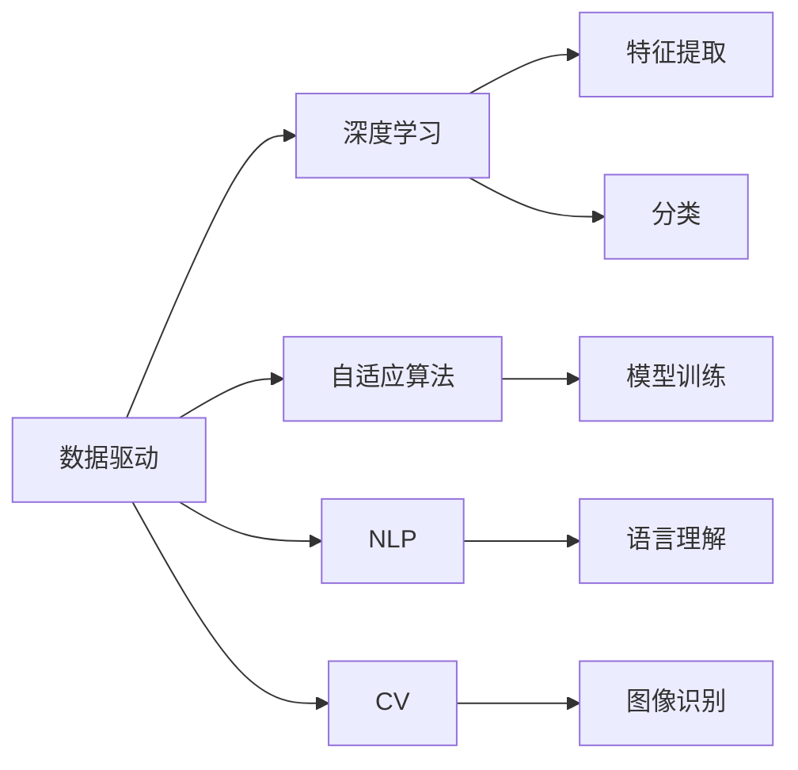

                 

# 李开复：AI 2.0 时代的未来展望

人工智能（AI）正处于一场深刻的变革之中，随着AI技术的不断成熟和应用场景的日益广泛，我们已经进入AI 2.0时代。在这一时代，AI将不再只是实验室里的理论研究，而是成为推动经济、社会、文化全面进步的强大引擎。本文将从AI 2.0时代的定义、核心特征及其对未来社会的影响三个方面，全面探讨AI 2.0时代的未来展望。

## 1. 背景介绍

### 1.1 人工智能的历史回顾

自1956年人工智能（AI）概念的提出以来，经过了60多年的发展，AI技术已经从最初的符号主义、专家系统，发展到如今基于深度学习和大数据的神经网络、深度学习。在AI 1.0时代，主要关注的问题是如何使机器能够模拟人类的思考过程，实现逻辑推理、知识表示等。而随着大数据和计算资源的普及，AI 2.0时代正在悄然到来，其特征是数据驱动、算法自适应，使得AI能够更好地理解现实世界，为人类创造更多价值。

### 1.2 AI 2.0时代的定义

AI 2.0时代是指AI技术在数据驱动和算法自适应的基础上，能够更深入地理解和模拟人类行为和决策，并应用到各个领域，为人类创造更多价值的新时代。这一时代的核心特征包括数据驱动、深度学习、自适应算法、自然语言处理（NLP）、计算机视觉（CV）等。

## 2. 核心概念与联系

### 2.1 核心概念概述

- **数据驱动**：AI 2.0时代，数据成为AI技术的核心资源。通过大数据和机器学习算法，AI能够从数据中学习规律，做出更加精准的预测和决策。

- **深度学习**：深度学习是AI 2.0时代的重要算法之一，通过多层神经网络结构，能够自动提取数据的高级特征，实现高效的数据表示和处理。

- **自适应算法**：AI 2.0时代的算法具有很强的自适应性，能够根据环境和数据的变化，自动调整参数，优化算法，提高模型的泛化能力和鲁棒性。

- **自然语言处理（NLP）**：NLP是AI 2.0时代的重要应用领域，包括语音识别、机器翻译、情感分析、问答系统等，使得机器能够更好地理解人类的语言。

- **计算机视觉（CV）**：CV技术能够使机器看懂图片和视频，实现自动驾驶、智能监控等应用。

### 2.2 核心概念原理和架构的 Mermaid 流程图



这个流程图展示了AI 2.0时代的核心概念及其联系：

- **数据驱动**：AI 2.0时代的AI系统依赖于大量的数据输入。
- **深度学习**：通过多层神经网络结构进行特征提取和分类。
- **自适应算法**：根据数据和环境变化自动调整模型参数。
- **NLP**：使AI能够理解人类语言，包括语言理解和生成。
- **CV**：使AI能够理解和处理视觉信息。

这些核心概念相互联系，共同构建了AI 2.0时代的技术基础。

## 3. 核心算法原理 & 具体操作步骤

### 3.1 算法原理概述

AI 2.0时代的核心算法包括深度学习、自适应算法、NLP和CV等。这里以深度学习为例，介绍其原理和具体操作步骤。

深度学习是一种基于多层神经网络的机器学习算法，能够自动提取数据的高级特征。深度学习算法通常包括以下几个步骤：

1. 数据预处理：对输入数据进行清洗、归一化、标注等预处理。
2. 模型定义：定义神经网络的结构和参数，包括输入层、隐藏层、输出层等。
3. 模型训练：通过反向传播算法，计算损失函数，更新模型参数。
4. 模型评估：在测试集上评估模型性能，调整参数，优化模型。
5. 模型应用：将优化后的模型应用到实际场景中，进行预测、分类等操作。

### 3.2 算法步骤详解

以图像分类为例，深度学习算法的具体操作步骤如下：

1. **数据预处理**：对图像进行归一化、裁剪、旋转等操作，生成训练集和测试集。
2. **模型定义**：定义卷积神经网络（CNN）的结构，包括卷积层、池化层、全连接层等。
3. **模型训练**：使用随机梯度下降（SGD）等优化算法，更新模型参数，最小化损失函数。
4. **模型评估**：在测试集上评估模型准确率、召回率等指标，判断模型性能。
5. **模型应用**：将训练好的模型应用到新的图像上，进行分类预测。

### 3.3 算法优缺点

深度学习算法的优点包括：

- **高效特征提取**：通过多层网络结构，能够自动提取数据的高级特征。
- **高精度**：在图像分类、语音识别等领域，深度学习模型通常能够取得较高的精度。
- **应用广泛**：深度学习算法已经被应用到各个领域，如自然语言处理、计算机视觉、语音识别等。

深度学习算法的缺点包括：

- **数据依赖**：深度学习模型需要大量的标注数据进行训练，数据收集和标注成本较高。
- **模型复杂**：深度学习模型通常包含大量参数，训练和推理计算量较大。
- **泛化能力不足**：在数据分布发生变化时，深度学习模型容易出现过拟合或欠拟合。

### 3.4 算法应用领域

深度学习算法已经在多个领域得到了广泛应用，例如：

- **自然语言处理（NLP）**：包括机器翻译、文本分类、情感分析等。
- **计算机视觉（CV）**：包括图像分类、目标检测、图像生成等。
- **语音识别**：包括语音识别、语音合成、情感识别等。
- **推荐系统**：包括商品推荐、个性化新闻推荐等。

## 4. 数学模型和公式 & 详细讲解 & 举例说明

### 4.1 数学模型构建

在深度学习中，常见的数学模型包括卷积神经网络（CNN）和循环神经网络（RNN）。以下以CNN为例，介绍其数学模型构建过程。

CNN的数学模型包括卷积层、池化层、全连接层等。以图像分类为例，CNN的数学模型构建过程如下：

1. **输入层**：输入图像数据，大小为 $n \times n \times 3$。
2. **卷积层**：使用卷积核对输入数据进行卷积操作，提取特征。
3. **池化层**：对卷积层的输出进行池化操作，减少特征数量。
4. **全连接层**：将池化层的输出连接到全连接层，进行分类。

### 4.2 公式推导过程

以下以CNN为例，推导其训练过程的数学公式。

设输入图像 $x$，输出标签 $y$，卷积核权重 $W$，卷积层输出 $h$，池化层输出 $p$，全连接层输出 $z$，分类器输出 $y^{\hat{}}$。则CNN的训练过程数学公式如下：

$$
h = W \ast x
$$

$$
p = MaxPooling(h)
$$

$$
z = fc(p)
$$

$$
y^{\hat{}} = softmax(z)
$$

其中，$MaxPooling$ 表示最大池化操作，$fc$ 表示全连接层，$softmax$ 表示分类器。

### 4.3 案例分析与讲解

以图像分类为例，CNN的训练过程如下：

1. **前向传播**：输入图像 $x$ 经过卷积层和池化层，生成特征 $h$，再经过全连接层和分类器，生成输出 $y^{\hat{}}$。
2. **损失函数**：使用交叉熵损失函数 $L$ 计算模型输出与真实标签的差异。
3. **反向传播**：通过反向传播算法，计算损失函数对模型参数的梯度，更新模型参数。
4. **模型评估**：在测试集上评估模型准确率、召回率等指标，调整模型参数，优化模型。

## 5. 项目实践：代码实例和详细解释说明

### 5.1 开发环境搭建

在AI 2.0时代，常用的深度学习框架包括TensorFlow、PyTorch等。以下以TensorFlow为例，介绍开发环境的搭建过程。

1. **安装TensorFlow**：

```bash
pip install tensorflow
```

2. **安装相关依赖**：

```bash
pip install numpy scipy matplotlib pandas sklearn tensorflow-addons
```

3. **配置GPU环境**：

```bash
# 设置TensorFlow使用GPU
gpus = tf.config.experimental.list_physical_devices('GPU')
tf.config.experimental.set_memory_growth(gpus[0], True)
```

### 5.2 源代码详细实现

以下是一个简单的CNN图像分类示例代码，使用TensorFlow实现：

```python
import tensorflow as tf
from tensorflow.keras import layers, models

# 定义模型
model = models.Sequential([
    layers.Conv2D(32, (3, 3), activation='relu', input_shape=(28, 28, 1)),
    layers.MaxPooling2D((2, 2)),
    layers.Flatten(),
    layers.Dense(64, activation='relu'),
    layers.Dense(10, activation='softmax')
])

# 编译模型
model.compile(optimizer='adam',
              loss='sparse_categorical_crossentropy',
              metrics=['accuracy'])

# 训练模型
model.fit(train_images, train_labels, epochs=10, validation_data=(test_images, test_labels))
```

### 5.3 代码解读与分析

**代码解读**：

- **定义模型**：使用Sequential模型定义一个CNN，包含卷积层、池化层、全连接层等。
- **编译模型**：使用adam优化器和交叉熵损失函数编译模型。
- **训练模型**：使用fit方法训练模型，在训练集和测试集上分别进行训练和验证。

**代码分析**：

- **卷积层**：通过卷积核对输入图像进行卷积操作，提取特征。
- **池化层**：对卷积层的输出进行最大池化操作，减少特征数量。
- **全连接层**：将池化层的输出连接到全连接层，进行分类。

## 6. 实际应用场景

### 6.1 智能客服系统

AI 2.0时代的智能客服系统，利用深度学习算法和大数据技术，能够自动理解和处理客户咨询，提供快速、准确、个性化的服务。

具体而言，智能客服系统可以通过以下步骤实现：

1. **数据预处理**：收集和清洗客户咨询数据，生成训练集和测试集。
2. **模型训练**：使用深度学习算法训练模型，实现自然语言理解。
3. **模型应用**：将训练好的模型应用到新客户咨询中，自动生成回复。

### 6.2 金融舆情监测

AI 2.0时代的金融舆情监测系统，利用深度学习算法和大数据分析，能够实时监测金融市场的舆论动态，预测市场趋势，提供风险预警。

具体而言，金融舆情监测系统可以通过以下步骤实现：

1. **数据预处理**：收集和清洗金融新闻、评论、社交媒体等数据，生成训练集和测试集。
2. **模型训练**：使用深度学习算法训练模型，实现情感分析和主题分类。
3. **模型应用**：将训练好的模型应用到实时抓取的新闻和评论数据中，进行情感分析和主题分类。

### 6.3 个性化推荐系统

AI 2.0时代的个性化推荐系统，利用深度学习算法和大数据技术，能够根据用户的历史行为和偏好，推荐个性化商品、内容等。

具体而言，个性化推荐系统可以通过以下步骤实现：

1. **数据预处理**：收集和清洗用户历史行为数据，生成训练集和测试集。
2. **模型训练**：使用深度学习算法训练模型，实现用户行为分析和推荐算法。
3. **模型应用**：将训练好的模型应用到新用户请求中，自动生成推荐结果。

### 6.4 未来应用展望

随着AI 2.0时代的到来，AI技术将在更多领域得到应用，为人类创造更多价值。未来，AI 2.0时代的未来展望包括：

1. **医疗健康**：AI 2.0时代的医疗健康领域，将利用深度学习算法和大数据分析，实现疾病预测、个性化治疗等。
2. **教育培训**：AI 2.0时代的教育培训领域，将利用深度学习算法和大数据分析，实现智能教学、个性化评估等。
3. **智能制造**：AI 2.0时代的智能制造领域，将利用深度学习算法和大数据分析，实现智能调度、质量检测等。
4. **自动驾驶**：AI 2.0时代的自动驾驶领域，将利用深度学习算法和大数据分析，实现智能导航、环境感知等。

## 7. 工具和资源推荐

### 7.1 学习资源推荐

1. **《深度学习》书籍**：Ian Goodfellow、Yoshua Bengio、Aaron Courville合著，全面介绍深度学习的基本理论和算法。
2. **《TensorFlow实战Google深度学习框架》书籍**：Vahid Mirjalili、Ahmad Jalali合著，详细介绍TensorFlow的实现和使用。
3. **Coursera《深度学习专项课程》**：由Andrew Ng教授主讲的深度学习课程，涵盖深度学习的基本理论和算法。
4. **Google AI Blog**：谷歌AI博客，提供最新的AI技术进展和应用案例。
5. **arXiv.org**：预印本数据库，提供最新的AI研究论文和成果。

### 7.2 开发工具推荐

1. **TensorFlow**：由谷歌开发的深度学习框架，支持分布式训练和推理。
2. **PyTorch**：由Facebook开发的深度学习框架，支持动态图和静态图。
3. **Keras**：高层次深度学习框架，提供简单易用的API，方便快速搭建模型。
4. **Jupyter Notebook**：交互式编程环境，支持Python、R等多种编程语言。
5. **GitHub**：代码托管平台，方便代码共享和协作。

### 7.3 相关论文推荐

1. **《ImageNet Classification with Deep Convolutional Neural Networks》**：Alex Krizhevsky、Ilya Sutskever、Geoffrey Hinton合著，提出卷积神经网络（CNN）算法，在ImageNet数据集上取得优异表现。
2. **《Attention is All You Need》**：Ashish Vaswani等人合著，提出Transformer模型，在自然语言处理任务上取得优异表现。
3. **《Natural Language Processing in the era of Deep Learning》**：Yoshua Bengio合著，讨论深度学习在自然语言处理中的应用和挑战。
4. **《Deep Reinforcement Learning for Playing Go》**：Volodymyr Mnih等人合著，提出深度强化学习算法，在围棋比赛中取得优异表现。

## 8. 总结：未来发展趋势与挑战

### 8.1 研究成果总结

AI 2.0时代的到来，使得深度学习和大数据技术在各个领域得到广泛应用，推动了科技进步和社会发展。AI 2.0时代的核心算法包括深度学习、自适应算法、NLP和CV等，通过这些算法的应用，实现了自然语言理解、图像识别、语音识别等技术突破。

### 8.2 未来发展趋势

AI 2.0时代的未来发展趋势包括：

1. **多模态融合**：将深度学习算法和大数据分析应用于图像、语音、视频等多个模态数据，实现跨模态信息整合。
2. **自动化机器学习（AutoML）**：利用自动化机器学习技术，优化模型选择、超参数调整等过程，降低AI应用的门槛。
3. **联邦学习**：通过联邦学习技术，实现分布式数据下的模型训练，保护数据隐私和安全。
4. **人机协同**：将深度学习算法和大数据分析应用于人机交互，实现智能客服、虚拟助手等应用。

### 8.3 面临的挑战

AI 2.0时代虽然前景广阔，但也面临着诸多挑战：

1. **数据隐私和安全**：在AI应用过程中，如何保护用户数据隐私和安全，是亟待解决的问题。
2. **伦理和社会责任**：AI技术在应用过程中，如何确保其伦理和社会责任，避免算法偏见和歧视。
3. **技术普及和应用**：如何降低AI技术的门槛，使其更加普及和应用，是当前亟待解决的问题。
4. **计算资源和能耗**：大规模深度学习模型的训练和推理需要大量计算资源和能耗，如何解决这一问题，是当前亟待解决的问题。

### 8.4 研究展望

未来，AI 2.0时代的研究展望包括：

1. **多模态学习**：将深度学习算法和大数据分析应用于图像、语音、视频等多个模态数据，实现跨模态信息整合。
2. **自监督学习**：利用自监督学习技术，实现无监督或半监督学习，降低对标注数据的依赖。
3. **自适应算法**：利用自适应算法，实现模型参数的动态调整，提高模型的泛化能力和鲁棒性。
4. **模型压缩和优化**：利用模型压缩和优化技术，实现高效计算和资源利用。

## 9. 附录：常见问题与解答

**Q1：深度学习算法是否适用于所有数据类型？**

A: 深度学习算法适用于大部分数据类型，但需要注意的是，不同类型的数据可能需要不同的预处理方式。例如，文本数据需要进行分词、向量化等预处理，而图像数据需要进行归一化、裁剪等预处理。

**Q2：深度学习算法是否容易出现过拟合？**

A: 深度学习算法容易出现过拟合现象，尤其是在数据量较少的情况下。为了避免过拟合，可以采用数据增强、正则化、早停等技术。

**Q3：如何降低深度学习算法的计算成本？**

A: 可以通过模型压缩、剪枝、量化等技术，降低深度学习算法的计算成本。同时，可以采用分布式训练和模型并行等技术，加速模型训练和推理过程。

**Q4：如何确保深度学习算法的鲁棒性和泛化能力？**

A: 可以采用数据增强、对抗训练、自适应算法等技术，提高深度学习算法的鲁棒性和泛化能力。同时，可以采用多模型集成、迁移学习等技术，增强模型的稳定性和泛化能力。

**Q5：深度学习算法是否适合实时应用？**

A: 深度学习算法在实时应用中可能会遇到计算资源不足的问题。可以通过模型裁剪、模型并行等技术，优化深度学习算法的实时应用性能。

综上所述，AI 2.0时代的到来，为深度学习和大数据分析技术的应用提供了广阔的舞台。未来的研究需要不断探索和突破，才能实现深度学习算法的更广泛应用，为人类创造更多价值。

---

作者：禅与计算机程序设计艺术 / Zen and the Art of Computer Programming

