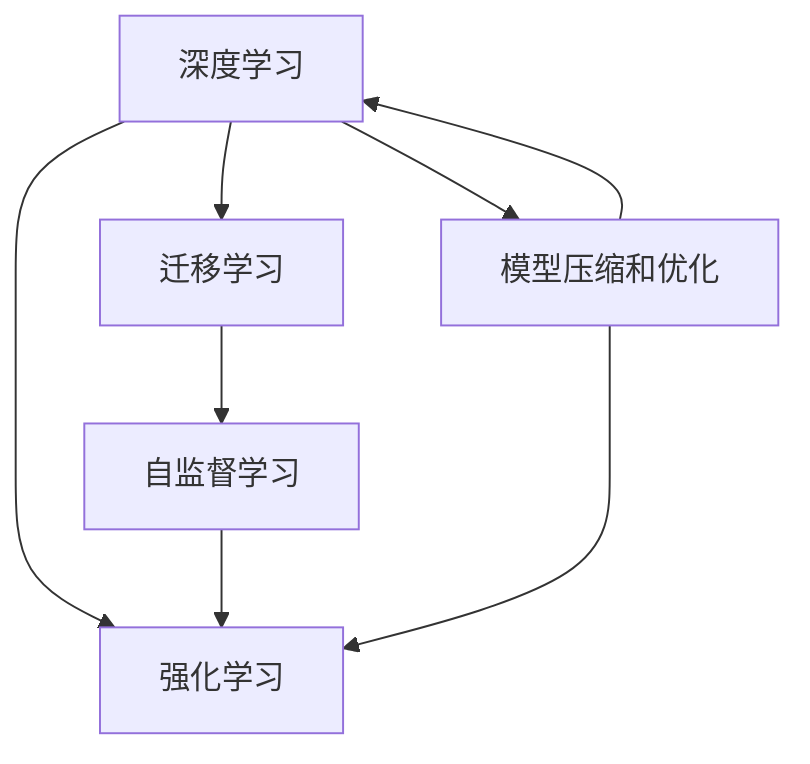
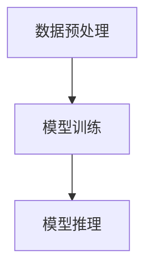

                 

# 李开复：AI 2.0 时代的机遇

> 关键词：人工智能,人工智能2.0,机会与挑战,创新驱动,未来展望,技术演进,产业应用

## 1. 背景介绍

### 1.1 问题由来

人工智能（AI）正处于从1.0到2.0的过渡时期，这一转型带来了前所未有的机遇和挑战。AI 1.0主要依赖规则、专家系统、统计学模型等方法，依赖人类专家的知识和经验，应用领域有限，覆盖率较低。而AI 2.0，即深度学习和神经网络技术的兴起，使得AI可以从大规模数据中学习模式，具有更强的泛化能力，能够处理更多复杂的任务。

AI 2.0技术的突破，主要得益于以下几个关键因素：
- **大数据的积累**：互联网的普及和移动设备的广泛使用，带来了海量数据，这些数据成为AI模型学习的基础。
- **强大的计算能力**：高性能计算设备和云计算技术，使得AI模型能够高效地进行训练和推理。
- **先进的算法和架构**：如卷积神经网络（CNN）、循环神经网络（RNN）、变分自编码器（VAE）、生成对抗网络（GAN）等算法，以及深度学习的层次化结构，为AI模型的发展奠定了基础。
- **数据标注的自动化**：利用数据增强、迁移学习、自监督学习等方法，在一定程度上降低了对标注数据的依赖，降低了成本，提高了效率。

AI 2.0技术的不断成熟和应用，使得AI在多个领域取得了突破性的进展，如自然语言处理、计算机视觉、语音识别、机器人技术等，为各行各业带来了巨大的商业价值和社会影响。

### 1.2 问题核心关键点

AI 2.0技术的快速发展，带来了诸多机遇和挑战，其中几个关键点如下：
- **多领域应用**：AI 2.0技术可以广泛应用于医疗、教育、金融、制造、农业等多个领域，提升了各行业的效率和准确性。
- **创新驱动**：AI 2.0技术的应用，加速了科技创新，推动了产业升级，提升了全球竞争力。
- **人才需求**：AI 2.0技术的普及，需要大量的数据科学家、算法工程师、软件开发者等高技能人才，形成了新的就业市场。
- **伦理和法律**：AI 2.0技术的广泛应用，涉及隐私、安全、公平等伦理和法律问题，需要制定相应的规范和标准。
- **社会变革**：AI 2.0技术的普及，将对人类工作和生活方式产生深远影响，带来新的机遇和挑战。

本文将深入探讨AI 2.0时代的机遇和挑战，通过分析当前AI技术的演进趋势，展望未来AI在各个领域的应用，并提供一些学习资源和开发工具推荐，帮助读者更好地理解和应用AI技术。

## 2. 核心概念与联系

### 2.1 核心概念概述

为了更好地理解AI 2.0技术，需要理解以下几个核心概念：

- **深度学习**：深度学习是AI 2.0技术的核心，通过构建多层神经网络，从数据中学习到复杂的模式和特征，从而实现高效的预测和决策。
- **迁移学习**：迁移学习是指将在一个任务上学习到的知识，应用于另一个相似的任务上，从而减少新任务的学习成本。
- **自监督学习**：自监督学习是指利用数据自身的信息，通过无监督的方式学习到特征，广泛应用于图像、语音等领域。
- **强化学习**：强化学习是指通过与环境的交互，通过奖励和惩罚的方式，学习最优策略，广泛应用于游戏、机器人控制等领域。
- **模型压缩和优化**：模型压缩和优化是指通过剪枝、量化、蒸馏等方法，减小模型大小，提高计算效率和准确性。

这些核心概念之间的关系如图示：



### 2.2 核心概念原理和架构的 Mermaid 流程图

以下是深度学习的基本流程，包含数据预处理、模型训练和推理三个步骤：



其中：
- **数据预处理**：包括数据清洗、标准化、归一化、划分训练集和测试集等步骤。
- **模型训练**：通过反向传播算法，最小化损失函数，更新模型参数，训练出能够泛化到新数据的模型。
- **模型推理**：将新数据输入训练好的模型，输出预测结果。

## 3. 核心算法原理 & 具体操作步骤

### 3.1 算法原理概述

深度学习模型的核心在于其神经网络结构。一个典型的神经网络由输入层、隐藏层和输出层组成。每个神经元接收上一层神经元的输出，通过权重和偏置进行线性变换，再通过激活函数（如ReLU、Sigmoid等）进行非线性映射，最后输出结果。通过多层的非线性变换，深度学习模型能够学习到更复杂、更抽象的特征，从而提高模型的表现力。

在深度学习中，最常用的模型是卷积神经网络（CNN）、循环神经网络（RNN）和变分自编码器（VAE）等。CNN主要用于图像处理和计算机视觉任务，RNN主要用于序列数据处理，如语音识别和自然语言处理，VAE则主要用于生成模型和数据增强。

### 3.2 算法步骤详解

深度学习的训练流程包括以下几个步骤：

1. **数据准备**：收集和预处理数据，包括数据清洗、标准化、归一化等步骤。
2. **模型设计**：选择合适的模型结构和超参数，如网络层数、神经元数量、激活函数等。
3. **模型训练**：通过前向传播和反向传播，最小化损失函数，更新模型参数。
4. **模型评估**：在测试集上评估模型性能，如准确率、召回率、F1值等指标。
5. **模型优化**：根据评估结果，调整模型参数和超参数，进行迭代训练，直到模型收敛。

### 3.3 算法优缺点

深度学习的优点包括：
- **高泛化能力**：能够从数据中学习到复杂的模式和特征，具有较强的泛化能力。
- **自适应能力**：能够自动学习到特征，减少对特征工程的依赖。
- **高效性**：能够并行计算，加速训练和推理过程。

深度学习的缺点包括：
- **数据依赖性**：需要大量的标注数据进行训练，数据获取成本较高。
- **过拟合风险**：模型容易过拟合，尤其是在训练数据不足的情况下。
- **计算资源需求高**：需要高性能的计算设备和算法优化，对硬件资源要求较高。

### 3.4 算法应用领域

深度学习在多个领域得到了广泛应用，包括但不限于：

- **计算机视觉**：图像分类、目标检测、图像分割、人脸识别等。
- **自然语言处理**：机器翻译、情感分析、文本生成、语音识别等。
- **语音处理**：语音识别、语音合成、情感识别等。
- **机器人**：机器人导航、物体抓取、视觉跟踪等。
- **医疗**：医学影像分析、基因组学、药物发现等。

## 4. 数学模型和公式 & 详细讲解 & 举例说明

### 4.1 数学模型构建

深度学习模型的构建包括以下几个关键步骤：
1. **输入层**：接收输入数据，将数据转换为神经网络的输入形式。
2. **隐藏层**：通过多个隐藏层，进行多层次的特征提取和抽象。
3. **输出层**：根据任务需求，输出预测结果。

以一个简单的全连接神经网络为例，其数学模型可以表示为：

$$
y = \mathbf{W} \cdot \mathbf{x} + \mathbf{b}
$$

其中：
- $\mathbf{W}$：权重矩阵。
- $\mathbf{x}$：输入数据。
- $\mathbf{b}$：偏置向量。
- $y$：输出结果。

### 4.2 公式推导过程

以一个简单的二分类问题为例，假设模型输出 $y$ 表示样本属于正类的概率。模型的损失函数可以表示为：

$$
L(y, y^*) = -\log(y) - \log(1 - y) \cdot (1 - y^*)
$$

其中 $y^*$ 表示样本的真实标签。模型的优化目标是最小化损失函数 $L(y, y^*)$，从而使得模型预测结果尽可能接近真实标签。

通过反向传播算法，可以得到模型的梯度：

$$
\frac{\partial L(y, y^*)}{\partial \mathbf{W}} = \begin{bmatrix} 
\frac{\partial L(y, y^*)}{\partial y} \cdot \frac{\partial y}{\partial \mathbf{x}} \cdot \frac{\partial \mathbf{x}}{\partial \mathbf{W}} 
\end{bmatrix}
$$

其中：
- $\frac{\partial L(y, y^*)}{\partial y}$：表示损失函数对模型输出 $y$ 的梯度。
- $\frac{\partial y}{\partial \mathbf{x}}$：表示模型输出 $y$ 对输入数据 $\mathbf{x}$ 的导数。
- $\frac{\partial \mathbf{x}}{\partial \mathbf{W}}$：表示输入数据 $\mathbf{x}$ 对权重矩阵 $\mathbf{W}$ 的导数。

通过上述公式，可以计算出权重矩阵 $\mathbf{W}$ 的梯度，从而进行参数更新。

### 4.3 案例分析与讲解

以一个简单的手写数字识别任务为例，使用MNIST数据集，构建一个三层全连接神经网络，进行深度学习训练。

1. **数据准备**：将MNIST数据集中的手写数字图片，转换为神经网络的输入形式，并进行标准化处理。
2. **模型设计**：设计一个三层全连接神经网络，包含一个输入层、两个隐藏层和一个输出层。
3. **模型训练**：使用反向传播算法，最小化损失函数，更新模型参数。
4. **模型评估**：在测试集上评估模型性能，计算准确率、召回率、F1值等指标。
5. **模型优化**：根据评估结果，调整模型参数和超参数，进行迭代训练，直到模型收敛。

以下是一个简单的Python代码示例：

```python
import torch
import torch.nn as nn
import torch.optim as optim
import torchvision
import torchvision.transforms as transforms

# 数据准备
train_dataset = torchvision.datasets.MNIST(root='./data', train=True, transform=transforms.ToTensor(), download=True)
test_dataset = torchvision.datasets.MNIST(root='./data', train=False, transform=transforms.ToTensor())

# 模型设计
class Net(nn.Module):
    def __init__(self):
        super(Net, self).__init__()
        self.fc1 = nn.Linear(784, 256)
        self.fc2 = nn.Linear(256, 256)
        self.fc3 = nn.Linear(256, 10)

    def forward(self, x):
        x = x.view(-1, 784)
        x = nn.functional.relu(self.fc1(x))
        x = nn.functional.relu(self.fc2(x))
        x = self.fc3(x)
        return x

# 模型训练
model = Net()
criterion = nn.CrossEntropyLoss()
optimizer = optim.Adam(model.parameters(), lr=0.001)

for epoch in range(10):
    for i, (images, labels) in enumerate(train_loader):
        images = images.view(images.size(0), -1)
        optimizer.zero_grad()
        output = model(images)
        loss = criterion(output, labels)
        loss.backward()
        optimizer.step()

# 模型评估
test_loss = 0
correct = 0
total = 0
with torch.no_grad():
    for images, labels in test_loader:
        images = images.view(images.size(0), -1)
        output = model(images)
        test_loss += criterion(output, labels).item()
        _, predicted = torch.max(output.data, 1)
        total += labels.size(0)
        correct += (predicted == labels).sum().item()

print('Test Loss: {:.4f}\nAccuracy: {}/{} ({:.0f}%)\n'.format(
    test_loss / (len(test_loader)),
    correct,
    total,
    100. * correct / total))
```

## 5. 项目实践：代码实例和详细解释说明

### 5.1 开发环境搭建

在进行深度学习开发时，需要安装一些必要的工具和库。以下是使用Python进行TensorFlow开发的环境配置流程：

1. 安装Anaconda：从官网下载并安装Anaconda，用于创建独立的Python环境。
2. 创建并激活虚拟环境：
```bash
conda create -n tf-env python=3.8 
conda activate tf-env
```

3. 安装TensorFlow：根据CUDA版本，从官网获取对应的安装命令。例如：
```bash
conda install tensorflow -c tf -c conda-forge
```

4. 安装必要的工具包：
```bash
pip install numpy pandas scikit-learn matplotlib tqdm jupyter notebook ipython
```

完成上述步骤后，即可在`tf-env`环境中开始深度学习开发。

### 5.2 源代码详细实现

这里我们以手写数字识别任务为例，使用TensorFlow进行深度学习训练。

首先，定义数据处理函数：

```python
import tensorflow as tf
from tensorflow.keras.datasets import mnist
from tensorflow.keras.utils import to_categorical

def load_data():
    (x_train, y_train), (x_test, y_test) = mnist.load_data()
    x_train = x_train.reshape(-1, 28*28).astype('float32') / 255.0
    x_test = x_test.reshape(-1, 28*28).astype('float32') / 255.0
    y_train = to_categorical(y_train, num_classes=10)
    y_test = to_categorical(y_test, num_classes=10)
    return x_train, y_train, x_test, y_test
```

然后，定义模型和优化器：

```python
from tensorflow.keras.models import Sequential
from tensorflow.keras.layers import Dense, Dropout
from tensorflow.keras.optimizers import Adam

model = Sequential([
    Dense(512, activation='relu', input_shape=(28*28,)),
    Dropout(0.5),
    Dense(10, activation='softmax')
])

optimizer = Adam(learning_rate=0.001)
```

接着，定义训练和评估函数：

```python
def train_model(model, x_train, y_train, x_test, y_test):
    batch_size = 64
    epochs = 10
    history = model.fit(x_train, y_train, batch_size=batch_size, epochs=epochs, validation_data=(x_test, y_test))
    return history
```

最后，启动训练流程并在测试集上评估：

```python
x_train, y_train, x_test, y_test = load_data()
history = train_model(model, x_train, y_train, x_test, y_test)
model.evaluate(x_test, y_test)
```

以上就是使用TensorFlow进行手写数字识别任务深度学习训练的完整代码实现。可以看到，TensorFlow的Keras API使得模型的构建和训练过程非常简单，开发者可以专注于模型的设计和优化。

### 5.3 代码解读与分析

让我们再详细解读一下关键代码的实现细节：

**load_data函数**：
- 从MNIST数据集中加载训练集和测试集。
- 将像素值归一化到[0,1]之间，并进行reshape操作，将二维矩阵转换为一维向量。
- 将标签进行one-hot编码，转换为多分类问题的格式。

**model定义**：
- 使用Keras API，定义一个包含两个隐藏层和一个输出层的神经网络模型。
- 使用ReLU作为激活函数，Dropout作为正则化方法，避免过拟合。

**train_model函数**：
- 定义训练参数，如批大小、迭代轮数等。
- 使用Keras的fit方法，对模型进行训练和验证，返回训练历史。

**训练流程**：
- 在训练集上训练模型，使用交叉熵损失函数。
- 在验证集上评估模型性能。
- 在测试集上输出最终评估结果。

## 6. 实际应用场景

### 6.1 智能医疗

深度学习在医疗领域的应用已经取得了显著的成果，如医学影像分析、基因组学、药物发现等。通过深度学习模型，可以从医学影像中自动检测肿瘤、肺结节等病变，提高诊断的准确性和效率。同时，深度学习还可以用于基因组学分析，从大规模基因数据中发现疾病相关的基因变异，指导个性化治疗方案的制定。

以医学影像分析为例，使用卷积神经网络（CNN）模型，可以从X光片、CT、MRI等医学影像中，自动检测病灶位置和大小。模型可以在大规模医学影像数据上进行预训练，然后微调适应具体的任务需求，如肺结节检测、脑肿瘤识别等。

### 6.2 智能交通

深度学习在智能交通领域的应用，主要集中在自动驾驶和智能交通管理两个方面。通过深度学习模型，可以实时分析交通流量、路况等信息，优化交通信号灯的控制，减少交通拥堵和事故发生率。同时，深度学习还可以用于自动驾驶，从摄像头、雷达等传感器获取的数据中，自动识别交通标志、车辆、行人等目标，实现自动驾驶功能。

以智能交通管理为例，使用卷积神经网络（CNN）模型，可以从交通摄像头获取的视频数据中，自动检测车辆、行人和交通信号灯等信息，实现实时交通分析。模型可以在大规模交通数据上进行预训练，然后微调适应具体的交通场景，如交叉口管理、交通流量预测等。

### 6.3 金融风控

深度学习在金融风控领域的应用，主要集中在信用评分、欺诈检测、风险评估等方面。通过深度学习模型，可以从客户的历史交易数据中，自动分析其信用风险和欺诈行为，提高风险控制的准确性和效率。

以信用评分为例，使用卷积神经网络（CNN）模型，可以从客户的历史交易数据中，自动提取其行为特征，如消费金额、交易频率、交易类型等。模型可以在大规模历史交易数据上进行预训练，然后微调适应具体的信用评分任务，如个人信用评分、企业信用评分等。

## 7. 工具和资源推荐

### 7.1 学习资源推荐

为了帮助开发者系统掌握深度学习的理论基础和实践技巧，这里推荐一些优质的学习资源：

1. 《深度学习》（Ian Goodfellow）：全面介绍了深度学习的基本概念、模型构建、训练和优化等核心内容，是深度学习的入门必读。
2. Coursera《深度学习专项课程》（Andrew Ng）：由斯坦福大学Andrew Ng教授主讲，涵盖深度学习的基础和高级内容，适合初学者和进阶者。
3. TensorFlow官方文档：详细介绍了TensorFlow的API、模型构建、训练和优化等，是TensorFlow学习的权威资料。
4. PyTorch官方文档：详细介绍了PyTorch的API、模型构建、训练和优化等，是PyTorch学习的权威资料。
5. Kaggle竞赛：Kaggle是一个数据科学竞赛平台，提供大量公开数据集和竞赛任务，适合实践深度学习技能。

通过对这些资源的学习实践，相信你一定能够快速掌握深度学习的精髓，并用于解决实际的NLP问题。

### 7.2 开发工具推荐

高效的深度学习开发离不开优秀的工具支持。以下是几款用于深度学习开发的常用工具：

1. TensorFlow：由Google主导开发的深度学习框架，适合大规模工程应用。
2. PyTorch：由Facebook开发的深度学习框架，适合快速迭代研究。
3. Keras：高层API封装，使用简洁，适合快速原型开发。
4. Jupyter Notebook：支持交互式编程，方便调试和分享代码。
5. TensorBoard：可视化工具，可实时监测模型训练状态，提供丰富的图表呈现方式。

合理利用这些工具，可以显著提升深度学习模型的开发效率，加快创新迭代的步伐。

### 7.3 相关论文推荐

深度学习技术的发展得益于学界的持续研究。以下是几篇奠基性的相关论文，推荐阅读：

1. AlexNet：ImageNet Large Scale Visual Recognition Challenge，展示了深度卷积神经网络在图像分类任务上的优越性能。
2. GoogleNet：Inception Networks，提出Inception模块，解决深度卷积神经网络中的梯度消失问题。
3. ResNet：Deep Residual Learning for Image Recognition，提出残差连接，使得更深的网络可以训练。
4. RNN：A New Method for Constructing Multilayer Recurrent Networks with Stable Learning，提出长短期记忆网络（LSTM），解决循环神经网络中的梯度消失问题。
5. VAE：Auto-Encoding Variational Bayes，提出变分自编码器，解决深度生成模型中的生成困难问题。

这些论文代表了大规模深度学习模型的发展脉络。通过学习这些前沿成果，可以帮助研究者把握学科前进方向，激发更多的创新灵感。

## 8. 总结：未来发展趋势与挑战

### 8.1 研究成果总结

深度学习技术在各个领域取得了显著的成果，推动了AI 2.0时代的到来。通过深度学习模型，可以从大规模数据中学习到复杂的模式和特征，具有强大的泛化能力和自适应能力。深度学习的应用领域已经涵盖了计算机视觉、自然语言处理、语音识别、机器人技术、智能医疗等多个领域，带来了巨大的商业价值和社会影响。

### 8.2 未来发展趋势

未来深度学习技术将呈现以下几个发展趋势：

1. **模型规模更大**：随着算力成本的下降和数据规模的扩张，深度学习模型的参数量还将持续增长。超大规模模型蕴含的丰富知识，有望支撑更加复杂多变的任务。
2. **训练速度更快**：随着硬件设备的不断进步，深度学习模型的训练速度将不断提升。
3. **模型更小、更高效**：深度学习模型的压缩和优化技术，将使得模型更小、更高效，适合在移动设备等资源受限的环境中使用。
4. **跨领域应用**：深度学习模型将更广泛地应用于不同领域，推动各行业的智能化升级。
5. **实时计算**：深度学习模型将更多地应用于实时计算场景，如自动驾驶、智能交通管理等。
6. **自监督学习**：自监督学习技术将更加成熟，降低深度学习模型对标注数据的依赖，扩大深度学习的应用范围。

### 8.3 面临的挑战

尽管深度学习技术已经取得了显著的成果，但在迈向更加智能化、普适化应用的过程中，仍面临以下挑战：

1. **数据依赖性**：深度学习模型需要大量的标注数据进行训练，数据获取成本较高。
2. **计算资源需求高**：深度学习模型需要高性能的计算设备和算法优化，对硬件资源要求较高。
3. **模型可解释性**：深度学习模型通常被视为"黑盒"系统，难以解释其内部工作机制和决策逻辑。
4. **伦理和法律问题**：深度学习模型的应用涉及隐私、安全、公平等伦理和法律问题，需要制定相应的规范和标准。
5. **模型泛化性**：深度学习模型容易过拟合，泛化能力较弱。

### 8.4 研究展望

面对深度学习技术面临的挑战，未来的研究需要在以下几个方面寻求新的突破：

1. **模型压缩和优化**：开发更加参数高效的深度学习模型，减小模型尺寸，提高计算效率和准确性。
2. **自监督学习**：研究自监督学习技术，降低深度学习模型对标注数据的依赖，扩大深度学习的应用范围。
3. **跨模态学习**：研究跨模态学习技术，将视觉、语音、文本等多种模态数据进行协同建模，提升模型的泛化能力和鲁棒性。
4. **对抗样本防御**：研究对抗样本防御技术，提高深度学习模型的鲁棒性和安全性。
5. **模型可解释性**：研究模型可解释性技术，增强深度学习模型的透明性和可解释性。

## 9. 附录：常见问题与解答

**Q1：深度学习模型的训练时间如何优化？**

A: 深度学习模型的训练时间可以通过以下几个方法进行优化：
1. 使用GPU/TPU等高性能计算设备。
2. 使用小批量训练，减小内存占用。
3. 使用学习率衰减和早停策略，避免过拟合。
4. 使用模型压缩和优化技术，减小模型大小。

**Q2：深度学习模型的泛化能力如何提升？**

A: 深度学习模型的泛化能力可以通过以下几个方法进行提升：
1. 使用更多的数据进行训练，增加数据多样性。
2. 使用正则化技术，如Dropout、L2正则等，避免过拟合。
3. 使用迁移学习技术，利用已有知识进行模型微调。
4. 使用对抗样本训练，提高模型的鲁棒性。
5. 使用自监督学习技术，利用数据自身的信息进行模型训练。

**Q3：深度学习模型在实际应用中需要注意哪些问题？**

A: 深度学习模型在实际应用中需要注意以下问题：
1. 数据隐私和安全问题，保护用户数据隐私。
2. 模型的可解释性问题，增强模型的透明性和可解释性。
3. 模型的公平性和公正性问题，避免模型偏见和歧视。
4. 模型的鲁棒性问题，提高模型对对抗样本的鲁棒性。
5. 模型的可扩展性问题，确保模型能够在大规模数据上高效运行。

---

作者：禅与计算机程序设计艺术 / Zen and the Art of Computer Programming

