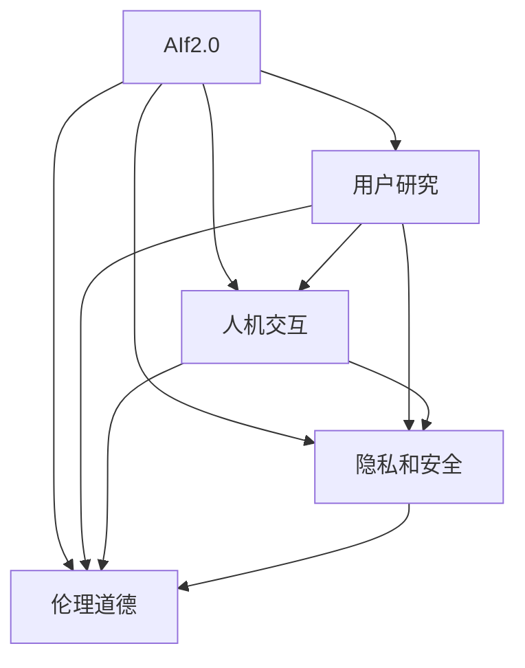

                 

# 李开复：AI 2.0 时代的用户

> 关键词：人工智能,李开复,用户研究,人机交互,人工智能技术

## 1. 背景介绍

### 1.1 问题由来

在过去的几十年里，人工智能(AI)技术经历了迅猛的发展。从最初的专家系统，到深度学习，再到现在的AI 2.0时代，AI技术已经从学术界的研究项目走入了千家万户，成为了改变人类生活和工作方式的重要工具。然而，随着AI技术的不断普及，人们对于AI的理解和使用也面临着诸多挑战。如何更好地理解和利用AI技术，成为了摆在每一个用户面前的重要课题。

### 1.2 问题核心关键点

当前，AI技术在各个领域的应用已经取得了显著的进展。然而，用户在实际使用AI技术的过程中，仍面临着一些关键问题：

1. **技术理解不足**：许多用户对于AI技术的原理和使用方法并不了解，导致无法充分利用AI技术的潜力。
2. **使用体验不佳**：部分AI应用的界面设计不友好，操作流程复杂，影响了用户的体验。
3. **隐私和安全问题**：AI应用在收集和处理用户数据时，如何确保数据隐私和安全，成为了一个重要的议题。
4. **伦理道德挑战**：AI技术在决策过程中可能存在偏见，如何确保AI应用的公平性和透明度，是一个亟待解决的问题。

## 2. 核心概念与联系

### 2.1 核心概念概述

为了更好地理解AI技术及其在用户中的应用，本节将介绍几个核心概念及其相互之间的联系：

- **人工智能(AI)**：通过算法和模型，使计算机具备人类智能的某些方面，如感知、学习、推理等。
- **AI 2.0**：指当前正在迅速发展的AI技术，包括深度学习、自然语言处理、计算机视觉等领域，强调应用和融合。
- **用户研究**：研究用户需求、行为和反馈，以便设计更符合用户期望的AI应用。
- **人机交互(HCI)**：研究如何设计高效、友好的人机交互界面，提升用户的使用体验。
- **隐私和安全**：在AI应用中，保护用户数据隐私和安全，防止数据滥用和泄露。
- **伦理道德**：在使用AI技术时，确保其决策过程公平、透明，避免歧视和偏见。

这些概念之间的逻辑关系可以通过以下Mermaid流程图来展示：



这个流程图展示了几大核心概念及其之间的相互关系：

1. AI 2.0技术是用户研究、人机交互、隐私安全、伦理道德的基础。
2. 用户研究通过了解用户需求和行为，指导人机交互设计和AI应用开发。
3. 人机交互通过提升界面友好性和操作便捷性，增强用户的使用体验。
4. 隐私安全通过保护用户数据，确保AI应用的合法性和可靠性。
5. 伦理道德通过规范AI决策，保障用户权益和社会公平。

这些概念共同构成了AI 2.0时代用户研究的框架，帮助设计出既高效又人性化的AI应用。

## 3. 核心算法原理 & 具体操作步骤

### 3.1 算法原理概述

AI 2.0技术的发展，离不开算法和模型的不断优化。以下将详细介绍几种常用的AI算法及其原理：

- **深度学习**：通过多层神经网络，学习输入数据和输出数据之间的复杂非线性关系。深度学习广泛应用于图像识别、自然语言处理等领域。
- **自然语言处理(NLP)**：研究如何让计算机理解和生成自然语言，包括文本分类、信息抽取、问答系统等任务。
- **计算机视觉(CV)**：研究如何让计算机识别和理解图像和视频内容，包括目标检测、图像分割、视频分析等。
- **强化学习**：通过与环境交互，学习最优策略以最大化累积奖励，广泛应用于游戏、机器人控制等领域。

### 3.2 算法步骤详解

以下以深度学习在图像识别任务中的应用为例，详细介绍深度学习算法的具体操作步骤：

1. **数据准备**：收集并标注大量图像数据，包括训练集、验证集和测试集。
2. **模型选择**：选择合适的深度学习模型，如卷积神经网络(CNN)、残差网络(ResNet)等。
3. **模型训练**：使用训练集对模型进行迭代训练，优化模型参数以最小化损失函数。
4. **模型评估**：在验证集上评估模型性能，调整模型参数以避免过拟合。
5. **模型测试**：在测试集上测试模型性能，得到最终结果。

### 3.3 算法优缺点

深度学习在图像识别任务中表现出优秀的性能，但也存在一些局限性：

- **计算资源需求高**：深度学习模型通常需要大量的计算资源和时间进行训练。
- **数据依赖性强**：模型性能很大程度上依赖于训练数据的质量和数量。
- **黑盒性质**：深度学习模型通常被视为“黑盒”，难以解释其内部工作机制。
- **泛化能力有限**：模型可能出现过拟合，在新数据上性能下降。

### 3.4 算法应用领域

深度学习在多个领域得到了广泛的应用，例如：

- **医疗影像分析**：通过图像识别技术，帮助医生快速诊断疾病，如肺癌、乳腺癌等。
- **自动驾驶**：通过计算机视觉技术，实现自动驾驶汽车对环境的感知和理解。
- **金融风险评估**：通过分析交易数据，预测市场趋势，帮助投资者规避风险。
- **内容推荐**：通过自然语言处理和计算机视觉技术，实现个性化内容推荐，提升用户体验。
- **智能客服**：通过自然语言处理和计算机视觉技术，实现智能客服系统，提升服务效率。

## 4. 数学模型和公式 & 详细讲解 & 举例说明

### 4.1 数学模型构建

深度学习在图像识别任务中的数学模型通常包括以下几个组成部分：

- **输入层**：接收图像数据。
- **卷积层**：提取图像的特征。
- **池化层**：降低特征图的空间大小，减少参数量。
- **全连接层**：将特征图转换为类别概率。
- **输出层**：进行分类预测。

### 4.2 公式推导过程

以下以卷积神经网络(CNN)为例，推导其基本框架的数学模型：

$$
h^{(l)}(x) = f(W^{(l)}h^{(l-1)}(x) + b^{(l)})
$$

其中 $h^{(l)}(x)$ 表示第 $l$ 层的输出，$W^{(l)}$ 和 $b^{(l)}$ 分别表示第 $l$ 层的权重和偏置，$f$ 表示激活函数。

### 4.3 案例分析与讲解

以图像识别为例，CNN 的基本原理如下：

1. **卷积层**：通过卷积操作，提取图像的局部特征，如边缘、纹理等。
2. **池化层**：通过降采样操作，减少特征图的大小，提高计算效率。
3. **全连接层**：将特征图展开成一维向量，通过线性变换和激活函数，转换为类别概率。
4. **输出层**：通过Softmax函数，将类别概率转换为预测概率。

## 5. 项目实践：代码实例和详细解释说明

### 5.1 开发环境搭建

在进行深度学习项目实践前，需要准备好开发环境。以下是使用Python进行TensorFlow开发的环境配置流程：

1. 安装Anaconda：从官网下载并安装Anaconda，用于创建独立的Python环境。

2. 创建并激活虚拟环境：
```bash
conda create -n tf-env python=3.8 
conda activate tf-env
```

3. 安装TensorFlow：根据CUDA版本，从官网获取对应的安装命令。例如：
```bash
conda install tensorflow -c pytorch -c conda-forge
```

4. 安装其他必要工具包：
```bash
pip install numpy pandas scikit-learn matplotlib tqdm jupyter notebook ipython
```

完成上述步骤后，即可在`tf-env`环境中开始深度学习实践。

### 5.2 源代码详细实现

下面以图像识别任务为例，给出使用TensorFlow进行深度学习的PyTorch代码实现。

```python
import tensorflow as tf
from tensorflow.keras import datasets, layers, models

# 加载数据集
(train_images, train_labels), (test_images, test_labels) = datasets.cifar10.load_data()

# 标准化数据
train_images, test_images = train_images / 255.0, test_images / 255.0

# 构建模型
model = models.Sequential([
    layers.Conv2D(32, (3, 3), activation='relu', input_shape=(32, 32, 3)),
    layers.MaxPooling2D((2, 2)),
    layers.Conv2D(64, (3, 3), activation='relu'),
    layers.MaxPooling2D((2, 2)),
    layers.Conv2D(64, (3, 3), activation='relu'),
    layers.Flatten(),
    layers.Dense(64, activation='relu'),
    layers.Dense(10)
])

# 编译模型
model.compile(optimizer='adam',
              loss=tf.keras.losses.SparseCategoricalCrossentropy(from_logits=True),
              metrics=['accuracy'])

# 训练模型
model.fit(train_images, train_labels, epochs=10, 
          validation_data=(test_images, test_labels))

# 评估模型
test_loss, test_acc = model.evaluate(test_images, test_labels, verbose=2)
print('\nTest accuracy:', test_acc)
```

### 5.3 代码解读与分析

让我们再详细解读一下关键代码的实现细节：

**数据加载与标准化**：
- 使用`datasets.cifar10.load_data()`函数加载CIFAR-10数据集，并将其分为训练集和测试集。
- 将图像数据标准化为0到1之间的值。

**模型构建**：
- 使用`Sequential`模型定义深度学习模型结构。
- 添加卷积层和池化层，提取图像特征。
- 添加全连接层，进行特征展开和分类预测。

**模型编译与训练**：
- 使用`model.compile()`方法，定义模型的优化器、损失函数和评价指标。
- 使用`model.fit()`方法，对模型进行训练，调整模型参数以最小化损失函数。

**模型评估**：
- 使用`model.evaluate()`方法，在测试集上评估模型性能。

## 6. 实际应用场景

### 6.1 医疗影像分析

深度学习在医疗影像分析中有着广泛的应用。通过图像识别技术，可以帮助医生快速诊断疾病，提高诊断准确性和效率。

在实际应用中，可以使用深度学习模型对医学影像进行特征提取和分类，如肺癌、乳腺癌、心脏病等。具体流程如下：

1. **数据收集**：收集并标注大量医学影像数据，如CT、MRI、X光片等。
2. **模型训练**：使用训练集对深度学习模型进行迭代训练，优化模型参数。
3. **模型评估**：在验证集上评估模型性能，调整模型参数以避免过拟合。
4. **模型应用**：将模型应用于实际医学影像，进行疾病诊断和分类。

### 6.2 自动驾驶

深度学习在自动驾驶领域也有着重要的应用。通过计算机视觉技术，实现自动驾驶汽车对环境的感知和理解。

在自动驾驶中，深度学习模型可以用于目标检测、图像分割、行为识别等任务。具体流程如下：

1. **数据收集**：收集并标注大量交通场景数据，如道路、车辆、行人等。
2. **模型训练**：使用训练集对深度学习模型进行迭代训练，优化模型参数。
3. **模型评估**：在验证集上评估模型性能，调整模型参数以避免过拟合。
4. **模型应用**：将模型应用于自动驾驶汽车，进行目标检测和行为识别。

### 6.3 内容推荐

深度学习在内容推荐中也得到了广泛应用。通过自然语言处理和计算机视觉技术，实现个性化内容推荐，提升用户体验。

在内容推荐中，深度学习模型可以用于文本分类、图像相似度计算、用户行为分析等任务。具体流程如下：

1. **数据收集**：收集并标注大量用户行为数据，如浏览记录、点击行为、评价等。
2. **模型训练**：使用训练集对深度学习模型进行迭代训练，优化模型参数。
3. **模型评估**：在验证集上评估模型性能，调整模型参数以避免过拟合。
4. **模型应用**：将模型应用于个性化内容推荐系统，提升用户使用体验。

## 7. 工具和资源推荐

### 7.1 学习资源推荐

为了帮助开发者系统掌握深度学习理论基础和实践技巧，这里推荐一些优质的学习资源：

1. 《深度学习》书籍：由Goodfellow、Bengio和Courville合著，深入浅出地介绍了深度学习的基本概念和算法。
2. CS231n《卷积神经网络》课程：斯坦福大学开设的计算机视觉课程，有Lecture视频和配套作业，带你入门深度学习的基础。
3. Coursera《深度学习专项课程》：由深度学习领域专家Andrew Ng主讲，涵盖深度学习的基础知识和应用案例。
4. GitHub开源项目：如TensorFlow、PyTorch等，提供了大量深度学习模型的代码示例，方便开发者快速上手实验。

通过对这些资源的学习实践，相信你一定能够快速掌握深度学习的精髓，并用于解决实际的AI问题。

### 7.2 开发工具推荐

高效的开发离不开优秀的工具支持。以下是几款用于深度学习开发的常用工具：

1. PyTorch：基于Python的开源深度学习框架，灵活动态的计算图，适合快速迭代研究。
2. TensorFlow：由Google主导开发的开源深度学习框架，生产部署方便，适合大规模工程应用。
3. Jupyter Notebook：支持Python编程和数据可视化，方便开发者进行实验和分享学习笔记。
4. Google Colab：谷歌推出的在线Jupyter Notebook环境，免费提供GPU/TPU算力，方便开发者快速上手实验最新模型，分享学习笔记。
5. Keras：一个高级神经网络API，可以运行在TensorFlow、Theano等后端上，方便开发者快速构建深度学习模型。

合理利用这些工具，可以显著提升深度学习任务的开发效率，加快创新迭代的步伐。

### 7.3 相关论文推荐

深度学习技术的发展离不开学界的持续研究。以下是几篇奠基性的相关论文，推荐阅读：

1. AlexNet：2012年ImageNet比赛冠军模型，开创了深度学习在图像识别领域的先河。
2. VGGNet：提出深度卷积神经网络架构，进一步提高了图像识别的准确率。
3. ResNet：提出残差网络结构，解决了深度学习中的梯度消失问题，推动了深度学习的发展。
4. InceptionNet：提出Inception模块，提高了卷积神经网络的计算效率。
5. 论文推荐：如《ImageNet Classification with Deep Convolutional Neural Networks》、《Learning Multiple Layers of Features from Tiny Images》等。

这些论文代表了大规模深度学习模型的发展脉络。通过学习这些前沿成果，可以帮助研究者把握学科前进方向，激发更多的创新灵感。

## 8. 总结：未来发展趋势与挑战

### 8.1 总结

本文对基于深度学习的AI 2.0时代用户研究进行了全面系统的介绍。首先阐述了AI 2.0技术在各领域的应用现状和用户面临的关键问题，明确了用户研究在AI应用开发中的重要地位。其次，从原理到实践，详细讲解了深度学习的数学模型和操作步骤，给出了深度学习任务开发的完整代码实例。同时，本文还探讨了深度学习在医疗影像分析、自动驾驶、内容推荐等领域的实际应用，展示了深度学习的巨大潜力。此外，本文精选了深度学习技术的各类学习资源，力求为读者提供全方位的技术指引。

通过本文的系统梳理，可以看到，深度学习在AI 2.0时代的应用已经全面铺开，为用户带来了前所未有的便利和体验。然而，伴随深度学习技术的不断普及，用户研究也面临着更多的挑战和机遇。唯有不断探索和创新，才能让AI技术更好地服务于人类社会。

### 8.2 未来发展趋势

展望未来，深度学习在AI 2.0时代的发展将呈现以下几个趋势：

1. **多模态深度学习**：将深度学习扩展到多种模态数据，如图像、文本、语音等，实现更全面的信息融合。
2. **自监督学习**：通过无监督学习方法，利用数据的内在关系，提高深度学习的泛化能力。
3. **迁移学习**：利用已有模型的知识，在新任务上进行微调，降低深度学习的成本和复杂度。
4. **可解释性**：增强深度学习模型的可解释性，使其决策过程透明可控，增强用户信任。
5. **伦理道德**：在深度学习应用中，确保模型决策的公平、透明，避免偏见和歧视。

这些趋势凸显了深度学习技术的广阔前景，将进一步推动AI技术在各个领域的应用和发展。

### 8.3 面临的挑战

尽管深度学习在AI 2.0时代已经取得了显著的进展，但在迈向更加智能化、普适化应用的过程中，仍面临诸多挑战：

1. **计算资源瓶颈**：深度学习模型通常需要大量的计算资源和时间进行训练，如何优化计算效率和资源使用，是一个亟待解决的问题。
2. **数据质量问题**：深度学习模型的性能很大程度上依赖于训练数据的质量和数量，如何保证数据的多样性和代表性，是一个重要课题。
3. **模型泛化能力**：深度学习模型在新数据上可能出现过拟合现象，如何提高模型的泛化能力，是一个需要不断探索的方向。
4. **模型可解释性**：深度学习模型通常被视为“黑盒”，难以解释其内部工作机制。如何增强模型的可解释性，是一个重要的研究方向。
5. **伦理道德问题**：深度学习模型在决策过程中可能存在偏见，如何确保模型的公平性和透明度，是一个亟待解决的问题。

这些挑战凸显了深度学习技术在实际应用中的复杂性和不确定性。唯有通过不断的技术创新和优化，才能让深度学习技术在AI 2.0时代真正落地。

### 8.4 研究展望

面对深度学习面临的挑战，未来的研究需要在以下几个方面寻求新的突破：

1. **计算效率优化**：开发更加高效、轻量级的深度学习模型，减少对计算资源的需求。
2. **数据质量提升**：利用数据增强、迁移学习等方法，提高数据的质量和代表性。
3. **模型泛化能力增强**：引入正则化、自适应学习率等方法，提高模型的泛化能力。
4. **模型可解释性增强**：通过可解释性技术，如特征可视化、敏感性分析等，增强模型的可解释性。
5. **伦理道德约束**：在深度学习应用中，引入伦理导向的评估指标，确保模型的公平和透明。

这些研究方向的探索，必将引领深度学习技术迈向更高的台阶，为构建安全、可靠、可解释、可控的AI系统铺平道路。面向未来，深度学习技术还需要与其他AI技术进行更深入的融合，如自然语言处理、计算机视觉等，多路径协同发力，共同推动AI技术的进步。只有勇于创新、敢于突破，才能不断拓展深度学习的边界，让AI技术更好地造福人类社会。

## 9. 附录：常见问题与解答

**Q1：深度学习是否适用于所有AI应用？**

A: 深度学习在图像识别、自然语言处理等领域表现优异，但在某些特定领域，如医疗、金融等，其性能可能不如其他AI技术。需要根据具体应用场景，选择合适的AI技术。

**Q2：深度学习模型的训练和推理效率如何？**

A: 深度学习模型通常需要大量的计算资源和时间进行训练，推理速度也较慢。可以通过优化计算图、剪枝、量化等技术，提高模型的训练和推理效率。

**Q3：深度学习模型的泛化能力如何？**

A: 深度学习模型在新数据上的泛化能力通常较差，需要进一步引入正则化、迁移学习等技术，提高模型的泛化能力。

**Q4：深度学习模型的可解释性如何？**

A: 深度学习模型通常被视为“黑盒”，难以解释其内部工作机制。可以通过可解释性技术，如特征可视化、敏感性分析等，增强模型的可解释性。

**Q5：深度学习模型在实际应用中面临哪些挑战？**

A: 深度学习模型在实际应用中面临计算资源瓶颈、数据质量问题、模型泛化能力、模型可解释性、伦理道德等多方面的挑战。需要不断探索和创新，才能让深度学习技术在AI 2.0时代真正落地。

---

作者：禅与计算机程序设计艺术 / Zen and the Art of Computer Programming

