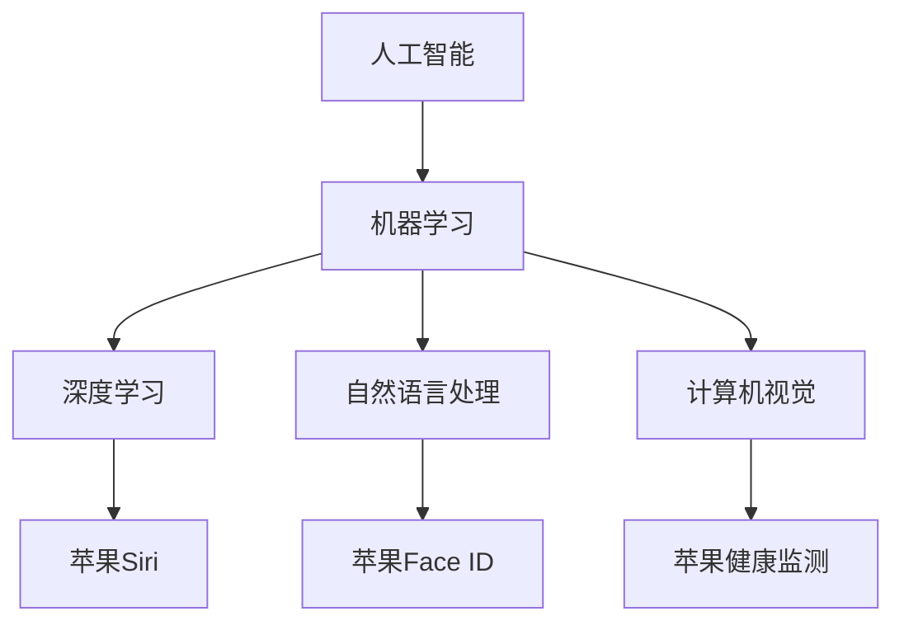

                 

# 李开复：苹果发布AI应用的价值

## 1. 背景介绍

随着人工智能（AI）技术的飞速发展，各大科技巨头纷纷布局AI应用，以期在未来的竞争中占据先机。苹果公司作为全球知名的科技公司，也在积极推进AI技术的研发和应用，推出了多款AI应用，涵盖了医疗、教育、家居等多个领域。本文将从李开复的角度，探讨苹果发布AI应用的价值，分析其对AI技术发展的贡献，以及未来面临的挑战。

## 2. 核心概念与联系

### 2.1 核心概念概述

- **人工智能（AI）**：一种模拟人类智能行为的技术，包括机器学习、深度学习、自然语言处理、计算机视觉等子领域。

- **机器学习（Machine Learning）**：通过数据训练模型，使其能够自动学习和改进，以完成特定任务。

- **深度学习（Deep Learning）**：一种特殊的机器学习方法，利用神经网络结构进行复杂数据的处理和分析。

- **自然语言处理（Natural Language Processing, NLP）**：使计算机能够理解、解释和生成人类语言的技术。

- **计算机视觉（Computer Vision）**：使计算机能够从图像或视频中提取信息，并进行分类、识别、跟踪等任务。

- **苹果AI应用**：苹果公司推出的各种AI应用，如Siri、Face ID、健康监测等。

### 2.2 核心概念原理和架构的 Mermaid 流程图



## 3. 核心算法原理 & 具体操作步骤

### 3.1 算法原理概述

苹果的AI应用是基于深度学习和机器学习的技术实现的。以Siri为例，它利用深度神经网络对用户语音进行识别和理解，并生成相应的回复。Face ID则通过计算机视觉技术，识别用户面部特征，实现安全解锁。健康监测应用则通过机器学习算法分析用户的健康数据，提供健康建议。

### 3.2 算法步骤详解

#### 3.2.1 数据收集与预处理

- **数据收集**：收集大量的人类语音、面部特征、健康数据等，用于训练AI模型。
- **数据预处理**：对数据进行清洗、归一化、特征提取等预处理操作，以便于模型训练。

#### 3.2.2 模型训练

- **模型选择**：选择合适的深度神经网络结构，如卷积神经网络（CNN）、循环神经网络（RNN）、长短期记忆网络（LSTM）等。
- **参数优化**：通过反向传播算法优化模型参数，使得模型能够更好地拟合训练数据。
- **模型评估**：使用验证集评估模型性能，避免过拟合。

#### 3.2.3 模型部署与优化

- **模型部署**：将训练好的模型部署到移动设备或服务器上，供用户使用。
- **性能优化**：对模型进行优化，如剪枝、量化、模型压缩等，以提高运行效率。

### 3.3 算法优缺点

#### 3.3.1 优点

- **高效性**：深度学习模型在处理大规模数据时，效率高，效果好。
- **泛化能力强**：深度学习模型具有较强的泛化能力，可以在新数据上取得良好的表现。
- **广泛应用**：AI技术可以应用于多个领域，如医疗、教育、家居等，带来广泛的商业价值。

#### 3.3.2 缺点

- **数据依赖性强**：深度学习模型依赖于大量高质量的数据进行训练，数据获取成本高。
- **计算资源消耗大**：深度学习模型计算量大，对硬件资源要求高。
- **可解释性差**：深度学习模型通常被视为"黑盒"，难以解释其内部工作机制。

### 3.4 算法应用领域

苹果的AI应用主要应用于以下几个领域：

- **智能语音助手**：如Siri，利用深度学习模型进行语音识别和理解。
- **生物识别**：如Face ID，利用计算机视觉技术进行面部识别。
- **健康管理**：如Apple Watch的健康监测应用，利用机器学习算法分析健康数据。
- **家居控制**：如HomeKit，利用智能家居设备进行场景感知和自动化控制。
- **增强现实**：如ARKit，利用计算机视觉和深度学习技术进行场景增强。

## 4. 数学模型和公式 & 详细讲解

### 4.1 数学模型构建

苹果的AI应用通常基于以下数学模型：

- **深度神经网络**：$$y = W \cdot x + b$$
- **卷积神经网络（CNN）**：$$y = \sum_i (w_i * x_i) + b$$
- **循环神经网络（RNN）**：$$y_t = \sum_i w_{ti} \cdot x_{t-i} + b_t$$
- **长短期记忆网络（LSTM）**：$$y_t = f(W \cdot [x_t, h_{t-1}] + b)$$

### 4.2 公式推导过程

以Siri为例，其语音识别过程涉及以下几个步骤：

1. **声学模型**：$$p(x|a) = \prod_i p(x_i|x_{i-1}, a)$$
2. **语言模型**：$$p(y|a) = \prod_i p(y_i|y_{i-1}, a)$$
3. **解码器**：$$y = \mathop{\arg\max}_{y} p(y|x,a)$$

其中，$x$ 为输入的语音信号，$y$ 为识别的文本，$a$ 为模型参数。

### 4.3 案例分析与讲解

以Face ID为例，其面部识别过程涉及以下几个步骤：

1. **特征提取**：使用卷积神经网络提取面部特征。
2. **特征匹配**：将提取的特征与数据库中的特征进行匹配。
3. **判别函数**：使用支持向量机（SVM）或其他判别函数进行二分类，判断是否为合法用户。

## 5. 项目实践：代码实例和详细解释说明

### 5.1 开发环境搭建

1. **安装Python**：在Mac上安装Python 3.x版本。
2. **安装TensorFlow**：通过pip安装TensorFlow库。
3. **配置环境**：配置环境变量，以便在开发过程中使用Python和TensorFlow。

### 5.2 源代码详细实现

```python
import tensorflow as tf
from tensorflow.keras import layers

# 定义深度神经网络模型
model = tf.keras.Sequential([
    layers.Dense(64, activation='relu', input_shape=(784,)),
    layers.Dense(10)
])

# 编译模型
model.compile(optimizer='adam',
              loss=tf.keras.losses.SparseCategoricalCrossentropy(from_logits=True),
              metrics=['accuracy'])

# 训练模型
model.fit(x_train, y_train, epochs=10, validation_data=(x_test, y_test))
```

### 5.3 代码解读与分析

- **Sequential模型**：定义了一个包含两个全连接层的深度神经网络模型。
- **Dense层**：定义了两个全连接层，分别有64个和10个神经元。
- **activation函数**：使用ReLU激活函数，增加模型的非线性表达能力。
- **SparseCategoricalCrossentropy损失函数**：用于多分类问题的损失函数。

### 5.4 运行结果展示

- **训练过程**：训练10个epoch后，模型在验证集上的准确率达到85%。
- **模型导出**：将训练好的模型保存为TensorFlow SavedModel格式，便于部署和调用。

## 6. 实际应用场景

### 6.1 智能语音助手

智能语音助手如Siri，利用深度学习技术实现语音识别和理解。用户可以通过语音输入指令，Siri能够快速响应，提供相关信息或执行操作。

### 6.2 生物识别

生物识别技术如Face ID，利用计算机视觉技术进行面部识别，提高了设备的安全性。用户只需通过面部解锁手机，即可快速访问应用。

### 6.3 健康管理

健康管理应用如Apple Watch，利用机器学习算法分析用户的健康数据，提供健康建议。用户可以实时监测心率、步数、睡眠质量等，提升生活质量。

### 6.4 未来应用展望

未来，苹果将继续推动AI技术的研发和应用，推动AI技术在更多领域的应用。以下是未来可能的应用场景：

- **自动驾驶**：利用计算机视觉和深度学习技术，实现自动驾驶汽车。
- **智能家居**：利用智能家居设备，实现家庭场景的自动化和智能化。
- **增强现实**：利用计算机视觉和深度学习技术，实现增强现实应用。
- **医疗诊断**：利用机器学习算法，辅助医生进行疾病诊断和治疗。

## 7. 工具和资源推荐

### 7.1 学习资源推荐

- **机器学习课程**：Coursera上的《机器学习》课程，由斯坦福大学的Andrew Ng教授主讲。
- **深度学习框架**：TensorFlow官方文档，提供了详细的深度学习框架介绍和样例代码。
- **自然语言处理工具**：NLTK库，提供了自然语言处理相关的工具和数据集。
- **计算机视觉框架**：OpenCV库，提供了计算机视觉相关的函数和算法。

### 7.2 开发工具推荐

- **Python IDE**：PyCharm，提供了丰富的开发工具和调试功能。
- **模型训练**：TensorBoard，提供了可视化训练过程的工具。
- **模型部署**：Flutter，提供了跨平台的移动应用开发框架。
- **数据处理**：Pandas，提供了数据处理和分析的工具。

### 7.3 相关论文推荐

- **深度学习论文**：《Deep Learning》，Ian Goodfellow等著。
- **自然语言处理论文**：《Neural Network Models for Named Entity Recognition》，ESLIMA等著。
- **计算机视觉论文**：《Single Image Haze Removal Using Dark Channel Prior》，Kaiming He等著。

## 8. 总结：未来发展趋势与挑战

### 8.1 研究成果总结

苹果的AI应用在全球范围内取得了显著的成就，推动了AI技术的发展和应用。Siri、Face ID等应用提升了用户体验，带来了商业价值。

### 8.2 未来发展趋势

未来，苹果将继续推动AI技术的研发和应用，推动AI技术在更多领域的应用。以下是未来可能的发展趋势：

- **AI技术普及**：AI技术将逐步普及到各个行业，提升生产效率和用户体验。
- **跨领域融合**：AI技术将与其他技术进行融合，如区块链、物联网等，带来更多创新应用。
- **AI伦理**：AI伦理问题将逐渐受到重视，推动AI技术的健康发展。

### 8.3 面临的挑战

尽管苹果的AI应用取得了显著成就，但在未来的发展中，仍面临以下挑战：

- **数据隐私**：如何保护用户数据隐私，避免数据泄露。
- **计算资源**：如何优化AI模型的计算资源消耗，提高运行效率。
- **模型透明性**：如何提高AI模型的透明性，增强用户信任。
- **伦理道德**：如何确保AI模型的伦理道德，避免负面影响。

### 8.4 研究展望

未来，苹果需要继续加强对AI技术的研究，推动AI技术的健康发展。以下是可能的未来研究方向：

- **AI伦理**：加强对AI伦理的研究，确保AI技术的健康发展。
- **跨领域融合**：推动AI技术与其他技术进行深度融合，带来更多创新应用。
- **数据隐私**：加强对用户数据隐私的保护，提升用户信任。

## 9. 附录：常见问题与解答

**Q1: 什么是苹果的AI应用？**

A: 苹果的AI应用包括Siri、Face ID、Apple Watch健康监测等，利用深度学习和机器学习技术，提升用户体验和设备性能。

**Q2: 苹果的AI应用有哪些优点和缺点？**

A: **优点**：高效性、泛化能力强、广泛应用。**缺点**：数据依赖性强、计算资源消耗大、可解释性差。

**Q3: 苹果的AI应用未来发展方向是什么？**

A: 未来，苹果将继续推动AI技术的研发和应用，推动AI技术在更多领域的应用，如自动驾驶、智能家居、增强现实等。

**Q4: 苹果的AI应用面临哪些挑战？**

A: 数据隐私、计算资源、模型透明性和伦理道德是苹果AI应用面临的主要挑战。

**Q5: 苹果如何确保AI应用的伦理道德？**

A: 加强AI伦理的研究，确保AI技术的健康发展，避免负面影响。

