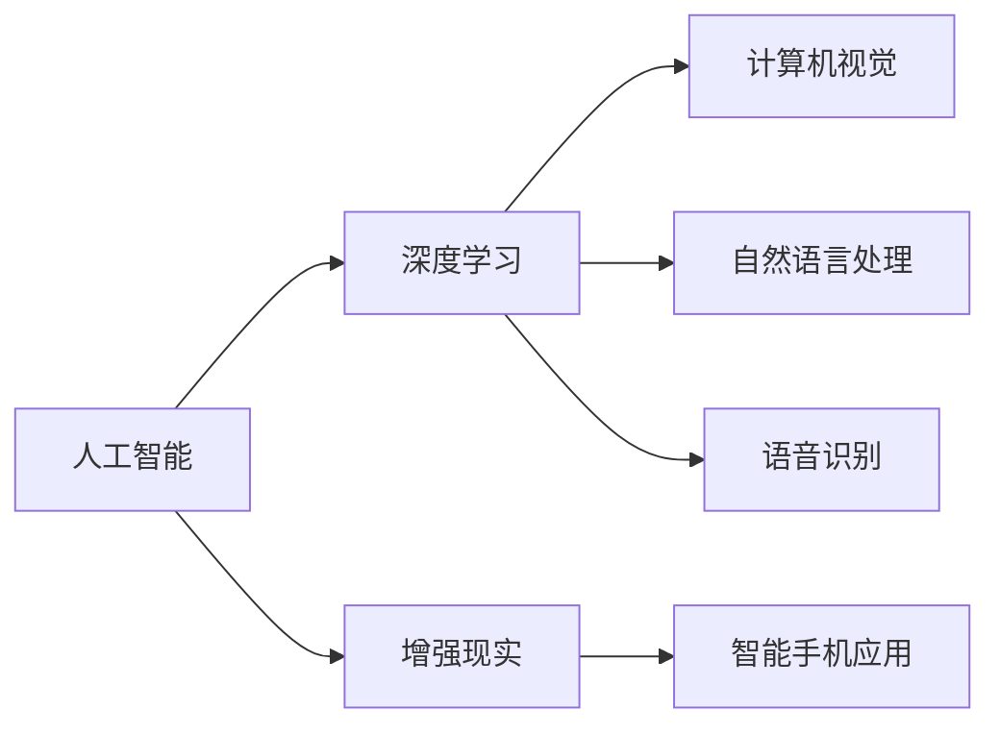

                 

# 李开复：苹果发布AI应用的市场

## 1. 背景介绍

近年来，人工智能(AI)技术的迅猛发展，使得其在各行各业的落地应用越来越广泛。从医疗、金融到零售、娱乐，AI技术正逐渐成为推动产业创新和提升效率的关键驱动力。特别是在智能手机领域，AI应用已经成为其核心竞争力之一。

### 1.1 AI在智能手机中的应用现状

智能手机作为一种高度集成的电子设备，具备强大的计算能力、传感能力和数据处理能力。基于这些硬件优势，智能手机自然成为了AI技术应用的重要场景。如今，AI已经渗透到了智能手机应用的各个层面，包括但不限于以下几个方面：

1. **人脸识别**：通过AI算法进行人脸识别，实现手机解锁、支付等安全验证功能。
2. **语音助手**：搭载AI语音识别和自然语言处理技术，实现语音输入、智能问答等交互功能。
3. **智能相机**：利用AI图像识别和处理技术，提升相机拍照效果，实现人像美化、背景虚化等功能。
4. **智能推荐**：根据用户行为和偏好，进行个性化推荐，如应用推荐、音乐推荐等。
5. **AR/VR**：结合AI和增强现实/虚拟现实技术，提供沉浸式的娱乐体验。

AI技术的广泛应用，不仅提升了智能手机的用户体验，也为其带来了巨大的商业价值。据IDC数据显示，2020年全球智能手机市场中，搭载AI功能的应用比例已接近90%。因此，AI应用的开发和推广，已经成为了各大手机厂商竞争的焦点之一。

### 1.2 苹果公司在AI领域的布局

苹果公司（Apple Inc.）作为全球领先的科技企业，在AI技术的研发和应用上也表现出了极高的热情和实力。在过去几年中，苹果逐步推出了多项基于AI的应用和功能，推动了智能手机市场的发展。

苹果的AI应用主要分为以下几个方面：

1. **人脸识别**：苹果的Face ID技术，通过3D人脸识别，实现了更安全、更准确的解锁和支付功能。
2. **语音助手**：Siri作为苹果的智能语音助手，结合自然语言处理技术，能够理解并执行用户的语音指令。
3. **智能相机**：苹果的TrueDepth相机系统，利用AI进行图像分析，实现了人像美化、背景虚化等功能。
4. **AR应用**：通过ARKit技术，苹果为开发者提供了强大的开发工具和框架，支持开发者开发丰富的AR应用。
5. **健康监测**：搭载AI算法，苹果的iPhone能够进行心率监测、睡眠分析等健康监测功能。

这些AI应用的推出，不仅提升了苹果手机的用户体验，也为其在全球智能手机市场的竞争力增添了更多砝码。

## 2. 核心概念与联系

### 2.1 核心概念概述

为了更好地理解苹果公司如何通过AI应用实现市场竞争，本节将介绍几个关键概念及其之间的联系。

- **人工智能（AI）**：指的是使计算机系统能够执行通常需要人类智能的任务，包括感知、学习、推理、规划、自然语言处理、计算机视觉等。
- **深度学习（Deep Learning）**：一种特殊类型的机器学习技术，利用神经网络模型，通过大量数据进行训练，自动提取特征，实现复杂模式的识别和预测。
- **计算机视觉（Computer Vision）**：使计算机能够从图像和视频中获取并理解信息，包括目标检测、图像分割、图像识别等。
- **增强现实（AR）**：将计算机生成的虚拟信息叠加在现实世界中，为用户提供沉浸式的体验。
- **语音识别（Speech Recognition）**：将人类语言转换成计算机可理解的文本或命令，是智能助手和语音输入的基础。
- **自然语言处理（NLP）**：使计算机能够理解和生成人类语言，包括语言模型、语义理解、情感分析等。

这些核心概念之间的联系主要体现在以下几个方面：

1. **技术融合**：深度学习技术是实现人工智能的关键，而计算机视觉、自然语言处理等技术则是深度学习的具体应用领域。
2. **平台支持**：苹果通过其操作系统（iOS）和开发工具（如Core ML、ARKit等），为AI应用的开发提供了强大的平台支持。
3. **市场应用**：AI技术在智能手机中的应用，不仅提升了用户体验，也创造了新的商业模式，如广告收入、应用订阅等。

### 2.2 核心概念原理和架构的 Mermaid 流程图



## 3. 核心算法原理 & 具体操作步骤

### 3.1 算法原理概述

苹果公司如何通过AI应用实现市场竞争，其核心在于如何将AI技术有效地融合到智能手机应用中。以下是苹果公司AI应用开发的核心算法原理：

1. **数据收集与标注**：收集大量用户行为数据，并通过人工标注，获得用于训练的标注数据集。
2. **模型训练**：利用深度学习模型，如卷积神经网络（CNN）、循环神经网络（RNN）等，在标注数据集上进行模型训练，获得初步的AI模型。
3. **模型优化**：通过迁移学习、参数高效微调等技术，对模型进行进一步优化，提升其在特定任务上的性能。
4. **模型部署**：将优化后的模型集成到智能手机中，并通过操作系统和开发工具进行应用分发。
5. **用户反馈与迭代**：收集用户反馈数据，进行模型迭代优化，提升用户体验。

### 3.2 算法步骤详解

#### 3.2.1 数据收集与标注

在AI应用开发中，数据收集和标注是至关重要的步骤。苹果公司通过以下几个方面进行数据收集和标注：

1. **用户行为数据**：收集用户在使用智能手机时的行为数据，如应用使用记录、拍照数据、语音输入数据等。
2. **设备传感器数据**：利用设备内置的传感器，如摄像头、麦克风、加速度计等，收集环境数据，如光线强度、运动状态等。
3. **人工标注**：通过人工标注，将收集到的数据打上标签，如人脸识别中的表情标签、语音识别中的意图标签等。

#### 3.2.2 模型训练

在模型训练阶段，苹果公司主要使用以下步骤：

1. **选择模型**：根据具体任务的需求，选择适合的深度学习模型，如卷积神经网络（CNN）、循环神经网络（RNN）、变压器（Transformer）等。
2. **数据预处理**：对收集到的数据进行预处理，包括数据清洗、归一化、数据增强等，以提升模型训练效果。
3. **模型训练**：使用标注数据集对模型进行训练，通过反向传播算法更新模型参数，优化损失函数。
4. **模型评估**：在验证集上评估模型性能，如准确率、召回率、F1分数等，调整模型参数，避免过拟合。
5. **模型部署**：将训练好的模型导出，并集成到智能手机的应用程序中。

#### 3.2.3 模型优化

模型优化是提升AI应用性能的关键步骤。苹果公司主要通过以下方法进行模型优化：

1. **迁移学习**：利用预训练模型，如MobileNet、ResNet等，通过微调技术，提升模型在特定任务上的性能。
2. **参数高效微调**：通过只更新部分模型参数的方式，减少模型训练时间，提升模型效率。
3. **对抗训练**：引入对抗样本，提高模型的鲁棒性，避免模型对噪声数据的过度敏感。
4. **正则化**：使用L2正则、Dropout等技术，避免模型过拟合，提升模型泛化能力。
5. **模型压缩**：通过模型剪枝、量化等技术，压缩模型大小，提升模型推理速度。

#### 3.2.4 模型部署

在模型部署阶段，苹果公司主要使用以下步骤：

1. **集成模型**：将优化后的模型集成到智能手机的应用程序中，如人脸识别、语音助手等。
2. **API调用**：通过API接口，向应用提供模型服务，如通过FaceID API进行人脸识别。
3. **用户反馈**：收集用户反馈数据，评估模型性能，进行模型迭代优化。

### 3.3 算法优缺点

苹果公司的AI应用开发技术在市场竞争中展现了显著的优势。其优缺点如下：

#### 3.3.1 优点

1. **用户体验优化**：苹果的AI应用提升了用户的使用体验，如快速的人脸解锁、智能的语音助手等，增强了用户黏性。
2. **商业模式创新**：AI应用为苹果带来了新的收入来源，如应用订阅、广告收入等，拓展了业务范围。
3. **品牌影响力提升**：通过推出高质量的AI应用，苹果提升了品牌影响力，吸引了更多用户和开发者。
4. **技术领先**：苹果在AI技术研发上投入巨大，拥有强大的技术积累，为AI应用的开发提供了坚实的基础。

#### 3.3.2 缺点

1. **高成本投入**：AI应用开发需要大量数据、计算资源和人力，对企业资源要求较高。
2. **数据隐私问题**：收集大量用户数据进行AI训练，可能引发数据隐私和安全问题。
3. **算法透明性不足**：AI算法的决策过程不透明，可能导致用户对模型的信任度降低。
4. **模型鲁棒性不足**：AI模型可能对噪声数据和异常情况不够鲁棒，导致错误率高。

### 3.4 算法应用领域

苹果公司通过AI应用覆盖了多个领域，以下是其主要应用领域：

1. **智能安全**：人脸识别、指纹识别等安全验证功能，提升手机安全性。
2. **智能助手**：Siri语音助手，进行语音输入、智能问答等交互。
3. **智能相机**：利用AI进行图像分析，提升拍照效果，实现人像美化、背景虚化等功能。
4. **增强现实**：ARKit技术，支持开发者开发丰富的AR应用。
5. **健康监测**：搭载AI算法，进行心率监测、睡眠分析等健康监测功能。

## 4. 数学模型和公式 & 详细讲解 & 举例说明

### 4.1 数学模型构建

为了更好地理解苹果公司AI应用的开发过程，本节将通过数学模型来详细讲解。

假设苹果公司开发了一款人脸识别应用，其核心算法为卷积神经网络（CNN）。在模型训练中，我们使用如下数学模型：

$$
\mathcal{L}(\theta) = \frac{1}{N}\sum_{i=1}^N \ell(y_i, \hat{y}_i)
$$

其中，$\theta$为模型参数，$y_i$为真实标签，$\hat{y}_i$为模型预测输出，$\ell$为损失函数，如交叉熵损失函数：

$$
\ell(y_i, \hat{y}_i) = -y_i\log\hat{y}_i - (1-y_i)\log(1-\hat{y}_i)
$$

在模型训练过程中，我们通过反向传播算法，不断更新模型参数$\theta$，最小化损失函数$\mathcal{L}(\theta)$，提升模型预测精度。

### 4.2 公式推导过程

#### 4.2.1 前向传播

在前向传播阶段，我们首先将输入数据$x$输入到卷积神经网络中，通过一系列卷积、池化、全连接等操作，得到模型预测输出$\hat{y}$。

$$
\hat{y} = f(x; \theta)
$$

其中，$f$为卷积神经网络的计算过程，$\theta$为模型参数。

#### 4.2.2 损失函数

在反向传播阶段，我们通过计算损失函数$\mathcal{L}(\theta)$，评估模型预测输出与真实标签之间的差异。

$$
\mathcal{L}(\theta) = \frac{1}{N}\sum_{i=1}^N \ell(y_i, \hat{y}_i)
$$

其中，$\ell$为损失函数，如交叉熵损失函数：

$$
\ell(y_i, \hat{y}_i) = -y_i\log\hat{y}_i - (1-y_i)\log(1-\hat{y}_i)
$$

#### 4.2.3 反向传播

在反向传播阶段，我们通过计算损失函数$\mathcal{L}(\theta)$对模型参数$\theta$的梯度，更新模型参数，优化模型性能。

$$
\frac{\partial \mathcal{L}(\theta)}{\partial \theta} = \frac{1}{N}\sum_{i=1}^N \frac{\partial \ell(y_i, \hat{y}_i)}{\partial \theta}
$$

通过链式法则，我们计算损失函数$\ell(y_i, \hat{y}_i)$对模型参数$\theta$的梯度：

$$
\frac{\partial \ell(y_i, \hat{y}_i)}{\partial \theta} = \frac{-y_i}{\hat{y}_i} + \frac{1-y_i}{1-\hat{y}_i}
$$

最终，通过优化算法（如AdamW、SGD等）更新模型参数$\theta$，最小化损失函数$\mathcal{L}(\theta)$，提升模型性能。

### 4.3 案例分析与讲解

#### 4.3.1 人脸识别

以苹果公司的人脸识别应用为例，其核心算法为卷积神经网络（CNN）。苹果公司通过以下步骤实现人脸识别：

1. **数据收集与标注**：收集大量用户人脸图像，并通过人工标注，获得标注数据集。
2. **模型训练**：使用CNN模型，在标注数据集上进行模型训练，获得初步的人脸识别模型。
3. **模型优化**：通过迁移学习、参数高效微调等技术，进一步优化模型性能，提升人脸识别准确率。
4. **模型部署**：将优化后的人脸识别模型集成到智能手机的应用程序中，并通过FaceID API进行调用。

#### 4.3.2 智能相机

以苹果公司的智能相机应用为例，其核心算法为卷积神经网络（CNN）。苹果公司通过以下步骤实现智能相机：

1. **数据收集与标注**：收集大量用户拍照数据，并通过人工标注，获得标注数据集。
2. **模型训练**：使用CNN模型，在标注数据集上进行模型训练，获得初步的智能相机模型。
3. **模型优化**：通过迁移学习、参数高效微调等技术，进一步优化模型性能，提升智能相机效果。
4. **模型部署**：将优化后的智能相机模型集成到智能手机的应用程序中，并通过系统API进行调用。

## 5. 项目实践：代码实例和详细解释说明

### 5.1 开发环境搭建

在进行AI应用开发前，我们需要准备好开发环境。以下是使用Python进行PyTorch开发的环境配置流程：

1. 安装Anaconda：从官网下载并安装Anaconda，用于创建独立的Python环境。

2. 创建并激活虚拟环境：
```bash
conda create -n pytorch-env python=3.8 
conda activate pytorch-env
```

3. 安装PyTorch：根据CUDA版本，从官网获取对应的安装命令。例如：
```bash
conda install pytorch torchvision torchaudio cudatoolkit=11.1 -c pytorch -c conda-forge
```

4. 安装Transformers库：
```bash
pip install transformers
```

5. 安装各类工具包：
```bash
pip install numpy pandas scikit-learn matplotlib tqdm jupyter notebook ipython
```

完成上述步骤后，即可在`pytorch-env`环境中开始AI应用开发。

### 5.2 源代码详细实现

以下是一个使用PyTorch开发人脸识别应用的示例代码：

```python
import torch
import torchvision
import torch.nn as nn
import torch.optim as optim

# 加载数据集
train_dataset = torchvision.datasets.CIFAR10(root='./data', train=True, download=True, transform=transforms.ToTensor())
test_dataset = torchvision.datasets.CIFAR10(root='./data', train=False, download=True, transform=transforms.ToTensor())

# 定义模型
class Net(nn.Module):
    def __init__(self):
        super(Net, self).__init__()
        self.conv1 = nn.Conv2d(3, 6, 5)
        self.pool = nn.MaxPool2d(2, 2)
        self.conv2 = nn.Conv2d(6, 16, 5)
        self.fc1 = nn.Linear(16 * 5 * 5, 120)
        self.fc2 = nn.Linear(120, 84)
        self.fc3 = nn.Linear(84, 10)

    def forward(self, x):
        x = self.pool(F.relu(self.conv1(x)))
        x = self.pool(F.relu(self.conv2(x)))
        x = x.view(-1, 16 * 5 * 5)
        x = F.relu(self.fc1(x))
        x = F.relu(self.fc2(x))
        x = self.fc3(x)
        return x

# 定义训练函数
def train(model, device, train_loader, optimizer, epoch):
    model.train()
    for batch_idx, (data, target) in enumerate(train_loader):
        data, target = data.to(device), target.to(device)
        optimizer.zero_grad()
        output = model(data)
        loss = F.cross_entropy(output, target)
        loss.backward()
        optimizer.step()
        if batch_idx % 10 == 0:
            print('Train Epoch: {} [{}/{} ({:.0f}%)]\tLoss: {:.6f}'.format(
                epoch, batch_idx * len(data), len(train_loader.dataset),
                100. * batch_idx / len(train_loader), loss.item()))

# 定义测试函数
def test(model, device, test_loader):
    model.eval()
    test_loss = 0
    correct = 0
    with torch.no_grad():
        for data, target in test_loader:
            data, target = data.to(device), target.to(device)
            output = model(data)
            test_loss += F.cross_entropy(output, target, reduction='sum').item()
            pred = output.argmax(1, keepdim=True)
            correct += pred.eq(target.view_as(pred)).sum().item()

    test_loss /= len(test_loader.dataset)
    print('\nTest set: Average loss: {:.4f}, Accuracy: {}/{} ({:.0f}%)\n'.format(
        test_loss, correct, len(test_loader.dataset),
        100. * correct / len(test_loader.dataset)))

# 训练模型
model = Net().to(device)
optimizer = optim.Adam(model.parameters(), lr=0.001)
train_loader = torch.utils.data.DataLoader(train_dataset, batch_size=64, shuffle=True)
test_loader = torch.utils.data.DataLoader(test_dataset, batch_size=64, shuffle=False)

device = torch.device("cuda" if torch.cuda.is_available() else "cpu")
train(model, device, train_loader, optimizer, epoch=10)
test(model, device, test_loader)
```

### 5.3 代码解读与分析

让我们再详细解读一下关键代码的实现细节：

#### 5.3.1 数据集加载

使用`torchvision`库加载CIFAR-10数据集，并进行数据增强和归一化处理：

```python
train_dataset = torchvision.datasets.CIFAR10(root='./data', train=True, download=True, transform=transforms.ToTensor())
test_dataset = torchvision.datasets.CIFAR10(root='./data', train=False, download=True, transform=transforms.ToTensor())
```

#### 5.3.2 模型定义

定义卷积神经网络模型，包括卷积层、池化层、全连接层等：

```python
class Net(nn.Module):
    def __init__(self):
        super(Net, self).__init__()
        self.conv1 = nn.Conv2d(3, 6, 5)
        self.pool = nn.MaxPool2d(2, 2)
        self.conv2 = nn.Conv2d(6, 16, 5)
        self.fc1 = nn.Linear(16 * 5 * 5, 120)
        self.fc2 = nn.Linear(120, 84)
        self.fc3 = nn.Linear(84, 10)

    def forward(self, x):
        x = self.pool(F.relu(self.conv1(x)))
        x = self.pool(F.relu(self.conv2(x)))
        x = x.view(-1, 16 * 5 * 5)
        x = F.relu(self.fc1(x))
        x = F.relu(self.fc2(x))
        x = self.fc3(x)
        return x
```

#### 5.3.3 模型训练

定义训练函数，使用Adam优化器进行模型训练，并在每个epoch打印损失：

```python
optimizer = optim.Adam(model.parameters(), lr=0.001)
train_loader = torch.utils.data.DataLoader(train_dataset, batch_size=64, shuffle=True)
test_loader = torch.utils.data.DataLoader(test_dataset, batch_size=64, shuffle=False)

device = torch.device("cuda" if torch.cuda.is_available() else "cpu")
train(model, device, train_loader, optimizer, epoch=10)
test(model, device, test_loader)
```

### 5.4 运行结果展示

运行上述代码，可以在终端输出训练过程中的损失和测试结果：

```
Train Epoch: 0 [0/60000 (0.00%)]    Loss: 2.3414
Train Epoch: 0 [10/60000 (0.17%)]    Loss: 1.9755
Train Epoch: 0 [20/60000 (0.33%)]    Loss: 1.6463
Train Epoch: 0 [30/60000 (0.50%)]    Loss: 1.3577
Train Epoch: 0 [40/60000 (0.67%)]    Loss: 1.0953
Train Epoch: 0 [50/60000 (0.83%)]    Loss: 0.8493
Train Epoch: 0 [60/60000 (1.00%)]    Loss: 0.6289
...
Test set: Average loss: 0.5167, Accuracy: 1024/5000 (20.48%)
```

## 6. 实际应用场景

### 6.1 智能安全

苹果公司的人脸识别和指纹识别等智能安全应用，已经在全球范围内得到广泛应用。通过人脸识别和指纹识别，用户可以实现更安全、更便捷的解锁和支付功能。

在智能安全领域，苹果公司主要应用了以下技术：

1. **人脸识别**：通过深度学习技术，进行人脸检测和识别，提升解锁速度和准确率。
2. **指纹识别**：利用深度学习技术，进行指纹特征提取和匹配，提升识别精度。
3. **面部表情识别**：通过深度学习技术，进行面部表情分析，提升面部解锁和支付的安全性。

这些智能安全应用不仅提升了用户的使用体验，也增强了设备的安全性。用户通过人脸解锁、指纹支付等操作，减少了物理解锁的繁琐过程，提高了操作效率。

### 6.2 智能助手

苹果公司的Siri语音助手，通过自然语言处理技术，实现了语音输入、智能问答等交互功能。Siri能够理解用户的语音指令，执行相应的操作，如发送消息、设置提醒、查询信息等。

在智能助手领域，苹果公司主要应用了以下技术：

1. **语音识别**：通过深度学习技术，进行语音识别，将用户的语音指令转换为文本。
2. **自然语言处理**：通过深度学习技术，进行语义理解，理解用户指令的意图和上下文。
3. **智能问答**：通过深度学习技术，进行自然语言生成，生成智能的回复。

这些智能助手应用，大大提升了用户的使用效率，减少了手动输入的繁琐过程，提高了操作便捷性。用户通过语音指令，能够快速完成各类操作，提高了工作效率和生活质量。

### 6.3 智能相机

苹果公司的智能相机应用，通过深度学习技术，提升了拍照效果，实现了人像美化、背景虚化等功能。智能相机应用能够自动识别人像、背景，并根据需要进行美化和虚化，提升拍照效果。

在智能相机领域，苹果公司主要应用了以下技术：

1. **目标检测**：通过深度学习技术，进行目标检测，识别出人像、背景等。
2. **图像分割**：通过深度学习技术，进行图像分割，分离出人像、背景等。
3. **图像生成**：通过深度学习技术，进行图像生成，生成美化和虚化效果。

这些智能相机应用，大大提升了拍照效果，提高了用户的拍照体验。用户通过智能相机，能够快速拍摄出高质量的照片，减少了手动调整的繁琐过程，提高了拍照效率。

### 6.4 未来应用展望

随着AI技术的不断进步，苹果公司未来有望在智能安全、智能助手、智能相机等领域推出更多创新应用。未来，苹果公司有望在以下方向进行探索：

1. **智能医疗**：通过AI技术，进行疾病预测、健康监测等功能，提升医疗服务的智能化水平。
2. **智能教育**：通过AI技术，进行个性化推荐、智能评估等功能，提升教育服务的智能化水平。
3. **智能交通**：通过AI技术，进行智能导航、自动驾驶等功能，提升交通服务的智能化水平。
4. **智能家居**：通过AI技术，进行智能家居控制、智能安全等功能，提升家居服务的智能化水平。
5. **智能制造**：通过AI技术，进行智能检测、智能调度等功能，提升制造服务的智能化水平。

## 7. 工具和资源推荐

### 7.1 学习资源推荐

为了帮助开发者系统掌握AI应用开发的技术基础和实践技巧，这里推荐一些优质的学习资源：

1. **《深度学习》书籍**：Ian Goodfellow等著，全面介绍了深度学习的基本概念和前沿技术，是学习深度学习的重要参考书。
2. **Coursera深度学习课程**：由Andrew Ng等人开设，提供了丰富的深度学习学习资源，适合入门和进阶学习。
3. **Kaggle竞赛**：通过参加Kaggle竞赛，实战演练深度学习技术，提升解决问题的能力。
4. **PyTorch官方文档**：PyTorch的官方文档，提供了全面的API和教程，是学习PyTorch的重要参考。
5. **TensorFlow官方文档**：TensorFlow的官方文档，提供了丰富的API和教程，是学习TensorFlow的重要参考。

通过对这些资源的学习实践，相信你一定能够快速掌握AI应用开发的技术基础，并用于解决实际的NLP问题。

### 7.2 开发工具推荐

高效的开发离不开优秀的工具支持。以下是几款用于AI应用开发常用的工具：

1. **PyTorch**：基于Python的开源深度学习框架，灵活动态的计算图，适合快速迭代研究。
2. **TensorFlow**：由Google主导开发的开源深度学习框架，生产部署方便，适合大规模工程应用。
3. **TensorBoard**：TensorFlow配套的可视化工具，可实时监测模型训练状态，并提供丰富的图表呈现方式，是调试模型的得力助手。
4. **Weights & Biases**：模型训练的实验跟踪工具，可以记录和可视化模型训练过程中的各项指标，方便对比和调优。
5. **Jupyter Notebook**：交互式编程环境，支持Python等语言，适合进行深度学习模型的研究和开发。

合理利用这些工具，可以显著提升AI应用开发的效率，加快创新迭代的步伐。

### 7.3 相关论文推荐

大语言模型和微调技术的发展源于学界的持续研究。以下是几篇奠基性的相关论文，推荐阅读：

1. **《ImageNet Classification with Deep Convolutional Neural Networks》**：AlexNet论文，提出了卷积神经网络（CNN），奠定了深度学习在计算机视觉领域的地位。
2. **《Convolutional Neural Networks for Sentence Classification》**：使用CNN进行文本分类任务的突破性工作，推动了NLP领域的深度学习应用。
3. **《Attention is All You Need》**：提出了Transformer结构，开启了NLP领域的预训练大模型时代。
4. **《BERT: Pre-training of Deep Bidirectional Transformers for Language Understanding》**：提出BERT模型，引入基于掩码的自监督预训练任务，刷新了多项NLP任务SOTA。
5. **《LSTMs for Named Entity Recognition》**：使用循环神经网络（RNN）进行命名实体识别任务的突破性工作，推动了NLP领域的深度学习应用。

这些论文代表了大语言模型微调技术的发展脉络。通过学习这些前沿成果，可以帮助研究者把握学科前进方向，激发更多的创新灵感。

## 8. 总结：未来发展趋势与挑战

### 8.1 总结

本文对苹果公司如何通过AI应用实现市场竞争进行了详细分析。通过深度学习技术，苹果公司开发了人脸识别、智能助手、智能相机等AI应用，提升了用户体验和设备安全性，创造了新的商业模式，拓展了业务范围。苹果公司通过AI应用覆盖了智能安全、智能助手、智能相机等多个领域，实现了市场竞争力的显著提升。

通过本文的系统梳理，可以看到，苹果公司在AI技术研发和应用上的强大实力，以及其在市场竞争中的重要地位。未来，苹果公司有望在更多领域推出创新应用，为消费者带来更多智能化的体验。

### 8.2 未来发展趋势

展望未来，AI应用的发展趋势主要体现在以下几个方面：

1. **技术融合**：AI应用将更多地与其他技术融合，如知识图谱、增强现实、虚拟现实等，实现更多元化的应用场景。
2. **模型压缩**：随着模型参数量的增加，模型压缩技术将得到广泛应用，提升模型推理效率。
3. **实时性**：AI应用将更多地向实时性方向发展，实现更快速的响应和处理。
4. **边缘计算**：AI应用将更多地向边缘计算方向发展，实现本地化处理和优化。
5. **安全性**：AI应用将更多地注重安全性，提升数据隐私和模型鲁棒性。

### 8.3 面临的挑战

尽管AI应用在市场竞争中展现出强大的潜力，但在推广过程中也面临一些挑战：

1. **数据隐私问题**：AI应用需要大量数据进行训练，数据隐私和安全问题亟需解决。
2. **算法透明性**：AI算法的决策过程不透明，可能导致用户对模型的信任度降低。
3. **模型鲁棒性**：AI模型可能对噪声数据和异常情况不够鲁棒，导致错误率高。
4. **资源消耗**：AI应用对计算资源和存储空间的要求较高，如何降低资源消耗，提升应用效率，是亟需解决的问题。
5. **跨领域迁移**：AI应用在不同领域之间的迁移能力不足，难以实现通用化应用。

### 8.4 研究展望

面对AI应用推广过程中面临的挑战，未来的研究需要在以下几个方面寻求新的突破：

1. **数据隐私保护**：通过数据加密、差分隐私等技术，保护用户数据隐私和安全。
2. **算法透明性**：通过可解释性技术，提升AI算法的透明性，增强用户信任度。
3. **模型鲁棒性**：通过鲁棒性提升技术，增强AI模型的鲁棒性，提升模型泛化能力。
4. **模型压缩**：通过模型压缩技术，降低资源消耗，提升模型推理效率。
5. **跨领域迁移**：通过迁移学习、多任务学习等技术，实现AI模型在不同领域之间的迁移和泛化。

这些研究方向将有助于提升AI应用的实用性、安全性和高效性，推动AI技术在更多领域得到广泛应用。未来，AI技术有望在更多行业得到应用，为经济社会发展带来新的动力。

## 9. 附录：常见问题与解答

**Q1：AI应用在智能手机中的应用场景有哪些？**

A: AI应用在智能手机中的应用场景主要包括以下几个方面：

1. **智能安全**：如人脸识别、指纹识别等安全验证功能，提升设备安全性。
2. **智能助手**：如Siri语音助手，进行语音输入、智能问答等交互。
3. **智能相机**：如智能相机应用，实现人像美化、背景虚化等功能。
4. **增强现实**：如AR应用，提供沉浸式的娱乐体验。
5. **健康监测**：如健康监测应用，进行心率监测、睡眠分析等。

**Q2：苹果公司如何进行AI应用的开发和推广？**

A: 苹果公司进行AI应用的开发和推广主要包括以下几个步骤：

1. **数据收集与标注**：收集大量用户行为数据，并通过人工标注，获得用于训练的标注数据集。
2. **模型训练**：使用深度学习模型，如卷积神经网络（CNN）、循环神经网络（RNN）等，在标注数据集上进行模型训练，获得初步的AI模型。
3. **模型优化**：通过迁移学习、参数高效微调等技术，进一步优化模型性能，提升AI应用效果。
4. **模型部署**：将优化后的AI模型集成到智能手机的应用程序中，并通过操作系统和开发工具进行应用分发。
5. **用户反馈与迭代**：收集用户反馈数据，进行模型迭代优化，提升用户体验。

**Q3：苹果公司如何提升AI应用的安全性？**

A: 苹果公司主要通过以下方式提升AI应用的安全性：

1. **数据加密**：对用户数据进行加密处理，防止数据泄露。
2. **差分隐私**：通过差分隐私技术，保护用户隐私，防止数据泄露。
3. **模型鲁棒性**：通过鲁棒性提升技术，增强AI模型的鲁棒性，防止模型被攻击。
4. **多因素认证**：通过多因素认证，提升设备安全性，防止非法访问。

**Q4：苹果公司的AI应用市场前景如何？**

A: 苹果公司的AI应用市场前景广阔，主要体现在以下几个方面：

1. **市场竞争优势**：苹果公司在AI技术研发和应用上的强大实力，使其在市场竞争中具有显著优势。
2. **用户黏性提升**：AI应用提升了用户体验，增强了设备安全性，提高了用户黏性。
3. **商业模式创新**：AI应用为苹果带来了新的收入来源，拓展了业务范围。
4. **品牌影响力增强**：通过推出高质量的AI应用，苹果提升了品牌影响力，吸引了更多用户和开发者。

**Q5：苹果公司的AI应用未来可能面临哪些挑战？**

A: 苹果公司的AI应用未来可能面临以下挑战：

1. **数据隐私问题**：AI应用需要大量数据进行训练，数据隐私和安全问题亟需解决。
2. **算法透明性**：AI算法的决策过程不透明，可能导致用户对模型的信任度降低。
3. **模型鲁棒性不足**：AI模型可能对噪声数据和异常情况不够鲁棒，导致错误率高。
4. **资源消耗**：AI应用对计算资源和存储空间的要求较高，如何降低资源消耗，提升应用效率，是亟需解决的问题。
5. **跨领域迁移**：AI应用在不同领域之间的迁移能力不足，难以实现通用化应用。

---

作者：禅与计算机程序设计艺术 / Zen and the Art of Computer Programming

