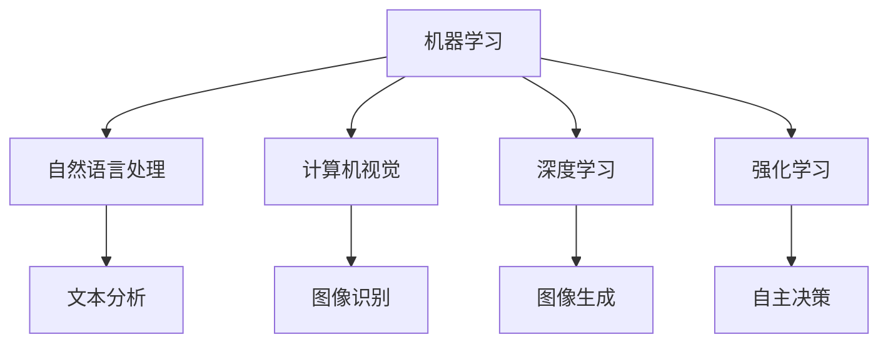

                 

## 1. 背景介绍

人工智能(AI)已经成为推动全球科技创新的重要驱动力之一。从智能音箱到自动驾驶汽车，从机器翻译到金融风控，AI正渗透到各个行业和应用场景，改变着人类的工作和生活方式。根据市场研究机构Gartner的数据，AI市场预计将在2025年达到700亿美元，并且这个数字还将随着技术的不断进步而持续增长。

随着AI技术的不断成熟和普及，越来越多的企业开始将AI应用作为其核心竞争力。其中，苹果公司（Apple Inc.）凭借其强大的软硬件生态系统和研发实力，在AI应用市场上也取得了显著成绩。本文将从市场、技术和应用三个方面，探讨苹果公司在AI应用领域的布局和战略。

## 2. 核心概念与联系

### 2.1 核心概念概述

苹果公司作为全球知名的科技公司，其AI应用涵盖了从机器学习、自然语言处理到计算机视觉等多个领域，广泛应用于iPhone、iPad、Apple Watch等智能设备，以及Apple Music、Apple News等应用中。以下是几个核心的AI概念及其相互关系：

- **机器学习(Machine Learning, ML)**：利用算法让计算机从数据中学习，自动改进和优化其性能，无需显式编程。
- **自然语言处理(Natural Language Processing, NLP)**：使计算机能够理解、解释和生成人类语言。
- **计算机视觉(Computer Vision, CV)**：使计算机能够识别、理解和解释视觉图像和视频。
- **深度学习(Deep Learning, DL)**：一种基于神经网络的机器学习方法，广泛用于图像识别、语音识别等领域。
- **强化学习(Reinforcement Learning, RL)**：通过与环境交互，让机器学习最优策略以实现特定目标。

这些技术通过苹果的生态系统和应用，实现了深度融合，为用户带来了前所未有的体验。

### 2.2 核心概念原理和架构的 Mermaid 流程图



## 3. 核心算法原理 & 具体操作步骤

### 3.1 算法原理概述

苹果公司在AI应用领域采用的核心算法包括但不限于以下几种：

- **卷积神经网络(Convolutional Neural Networks, CNNs)**：广泛用于图像识别、分类和分割任务，例如苹果的Face ID功能就采用了CNNs。
- **循环神经网络(Recurrent Neural Networks, RNNs)**：用于序列数据的处理，如语音识别和自然语言处理中的文本生成。
- **生成对抗网络(Generative Adversarial Networks, GANs)**：用于生成逼真的图像和视频，如Apple Music中的音乐封面和视频。
- **深度信念网络(Deep Belief Networks, DBNs)**：用于特征提取和表示学习，如Apple News中的文本分类和情感分析。
- **强化学习算法(如DQN, A2C)**：用于自动化和优化任务，如自动驾驶和智能家居控制。

苹果的AI算法通常以端到端的方式应用在设备和服务中，从数据采集到模型训练，再到推理部署，均通过统一的框架进行管理。

### 3.2 算法步骤详解

苹果的AI应用开发流程可以分为以下几个步骤：

1. **数据采集和预处理**：收集用户行为数据和环境数据，进行清洗、标注和预处理。
2. **模型训练和验证**：利用收集的数据训练机器学习模型，并通过交叉验证等方法评估模型性能。
3. **模型优化和部署**：根据评估结果对模型进行优化，并将其部署到智能设备和服务中。
4. **实时监测和迭代**：通过监测用户反馈和环境变化，持续迭代模型和算法，提升性能和用户体验。

### 3.3 算法优缺点

苹果公司在AI应用开发中采用了多种算法，以下是其优缺点的分析：

- **优点**：
  - **端到端集成**：能够将多种算法无缝集成，提供跨设备、跨平台的一致体验。
  - **实时优化**：通过实时监测和迭代，不断提升模型性能和用户体验。
  - **隐私保护**：采用差分隐私等技术，保护用户数据隐私。

- **缺点**：
  - **算法复杂度**：多种算法的集成可能带来算法复杂度上升，增加了开发和维护的难度。
  - **资源消耗**：复杂的算法和模型可能导致更高的计算和内存消耗。
  - **隐私风险**：虽然苹果在隐私保护上做了大量工作，但数据收集和使用过程中仍可能存在隐私风险。

### 3.4 算法应用领域

苹果的AI应用主要集中在以下几个领域：

- **智能设备**：如iPhone、iPad、Apple Watch等，通过AI技术提升设备性能和用户体验。
- **应用服务**：如Apple Music、Apple News、Apple Wallet等，提供个性化推荐、智能客服和自动优化功能。
- **自动驾驶**：通过深度学习和强化学习，推进自动驾驶技术的发展。
- **健康医疗**：利用AI技术进行健康数据分析和诊断，如Apple Health。
- **环境监测**：通过计算机视觉技术，监测环境变化和灾害预警。

## 4. 数学模型和公式 & 详细讲解 & 举例说明

### 4.1 数学模型构建

苹果公司在AI应用中采用了多种数学模型，以下是几个常见的模型及其构建方法：

- **卷积神经网络(CNNs)**：
  $$
  f(x) = \sum_{i=1}^n w_i \cdot g(\varphi(x - \mu_i) + b_i)
  $$
  其中 $g$ 为激活函数，$\mu_i$ 为卷积核中心，$b_i$ 为偏置项。

- **循环神经网络(RNNs)**：
  $$
  h_t = f(W \cdot h_{t-1} + U \cdot x_t + b)
  $$
  其中 $h_t$ 为隐藏状态，$x_t$ 为输入，$W$、$U$ 和 $b$ 为模型参数。

- **生成对抗网络(GANs)**：
  $$
  G(z) = \mu(\mathcal{Z})
  $$
  $$
  D(x) = \sigma(W \cdot x + b)
  $$
  其中 $G$ 为生成器，$D$ 为判别器，$\sigma$ 为激活函数，$W$ 和 $b$ 为模型参数。

### 4.2 公式推导过程

以CNN为例，其推导过程如下：

1. **卷积操作**：
  $$
  g(x_i) = \sum_{j=1}^m w_{ij} \cdot x_{ij}
  $$
  其中 $x_{ij}$ 为输入图像的像素值，$w_{ij}$ 为卷积核的权重。

2. **池化操作**：
  $$
  p(x_i) = \max\limits_j(x_{ij})
  $$
  其中 $x_{ij}$ 为池化区域内的像素值。

3. **全连接层**：
  $$
  y = W \cdot g + b
  $$
  其中 $W$ 和 $b$ 为全连接层的权重和偏置项。

### 4.3 案例分析与讲解

苹果的Face ID功能是一个典型的应用案例。Face ID通过CNNs实现人脸识别，其关键步骤如下：

1. **数据采集**：收集用户的高分辨率面部图像。
2. **预处理**：对图像进行归一化、裁剪等预处理，得到标准输入。
3. **卷积操作**：通过多层卷积操作提取面部特征。
4. **全连接层**：将特征映射到人脸识别空间。
5. **softmax分类**：对输出进行softmax分类，得到人脸识别结果。

## 5. 项目实践：代码实例和详细解释说明

### 5.1 开发环境搭建

开发苹果的AI应用通常需要以下环境：

1. **Mac OS X**：苹果公司的大部分开发工具和框架只支持Mac OS X。
2. **Xcode**：苹果的集成开发环境，支持iOS、macOS、watchOS和tvOS开发。
3. **Python**：用于AI算法开发，常用的库包括TensorFlow、PyTorch等。
4. **C++**：用于编写高性能算法和模型。
5. **iOS SDK**：提供iOS设备的开发工具和框架。

### 5.2 源代码详细实现

以下是一个简单的Python代码示例，用于训练一个CNNs模型：

```python
import tensorflow as tf

# 定义模型结构
model = tf.keras.Sequential([
    tf.keras.layers.Conv2D(32, (3, 3), activation='relu', input_shape=(32, 32, 3)),
    tf.keras.layers.MaxPooling2D((2, 2)),
    tf.keras.layers.Conv2D(64, (3, 3), activation='relu'),
    tf.keras.layers.MaxPooling2D((2, 2)),
    tf.keras.layers.Conv2D(64, (3, 3), activation='relu'),
    tf.keras.layers.Flatten(),
    tf.keras.layers.Dense(64, activation='relu'),
    tf.keras.layers.Dense(10, activation='softmax')
])

# 编译模型
model.compile(optimizer='adam',
              loss='categorical_crossentropy',
              metrics=['accuracy'])

# 训练模型
model.fit(train_data, epochs=10, validation_data=val_data)
```

### 5.3 代码解读与分析

这段代码主要实现了CNNs模型的构建、编译和训练。具体来说：

- **模型结构**：包括多层卷积、池化、全连接层和softmax分类层，用于图像分类任务。
- **编译模型**：设置优化器、损失函数和评估指标。
- **训练模型**：通过fit方法进行模型训练，并在验证集上评估模型性能。

## 6. 实际应用场景

### 6.1 智能设备

苹果的智能设备通过AI技术实现了诸多创新功能，如Face ID、Siri语音助手、智能拍照等。Face ID使用CNNs进行人脸识别，Siri使用RNNs进行语音识别和理解，智能拍照使用GANs进行图像生成和优化。

### 6.2 应用服务

苹果的应用服务通过AI技术提供了个性化推荐、智能客服和自动优化等功能。Apple Music通过深度学习模型进行音乐推荐，Apple News通过NLP技术进行内容分类和情感分析。

### 6.3 自动驾驶

苹果正在积极推进自动驾驶技术，利用AI进行环境感知、路径规划和决策优化。苹果的自动驾驶技术采用了多种AI算法，包括深度学习和强化学习。

### 6.4 未来应用展望

未来，苹果有望在更多领域拓展AI应用，如健康医疗、环境监测、智能家居等。例如，苹果可以通过AI技术分析用户健康数据，提供个性化健康建议；利用AI进行环境监测，预警自然灾害；在智能家居中，利用AI技术进行环境感知和自主决策。

## 7. 工具和资源推荐

### 7.1 学习资源推荐

- **机器学习入门**：《机器学习实战》一书，详细介绍了机器学习的基本概念和算法。
- **深度学习基础**：《深度学习》一书，由深度学习领域的权威人士撰写，深入浅出地介绍了深度学习的基础知识和应用。
- **TensorFlow官方文档**：提供详细的TensorFlow教程和API文档，适合初学者和进阶开发者。
- **PyTorch官方文档**：提供PyTorch的API和示例代码，适合研究人员和工程师使用。
- **Udacity AI课程**：Udacity提供的AI课程，涵盖机器学习、深度学习、计算机视觉等多个领域。

### 7.2 开发工具推荐

- **Xcode**：苹果的集成开发环境，支持多种平台和语言的开发。
- **PyCharm**：Python开发工具，提供代码高亮、调试和版本控制功能。
- **Jupyter Notebook**：Python代码编辑器，支持在线编写和运行代码。
- **GitHub**：代码托管平台，方便团队协作和代码版本管理。

### 7.3 相关论文推荐

- **深度学习基础**：《深度学习》一书，由深度学习领域的权威人士撰写，深入浅出地介绍了深度学习的基础知识和应用。
- **计算机视觉**：《计算机视觉：模型、学习与发现》一书，详细介绍了计算机视觉的基本理论和算法。
- **强化学习**：《强化学习：算法、代码与深度思考》一书，提供了强化学习的算法和代码实现。

## 8. 总结：未来发展趋势与挑战

### 8.1 研究成果总结

苹果在AI应用方面取得了显著的成绩，通过端到端的集成、实时优化和隐私保护，为用户提供了高质量的体验。然而，复杂的算法和模型也带来了资源消耗和隐私风险等挑战。

### 8.2 未来发展趋势

未来，苹果有望在更多领域拓展AI应用，如健康医疗、环境监测、智能家居等。同时，苹果也将继续推动AI技术的创新，通过跨平台、跨设备的无缝集成，提供更加丰富和智能的应用体验。

### 8.3 面临的挑战

- **资源消耗**：复杂的算法和模型可能导致更高的计算和内存消耗。
- **隐私风险**：数据收集和使用过程中仍可能存在隐私风险。
- **算法复杂度**：多种算法的集成可能带来算法复杂度上升，增加了开发和维护的难度。

### 8.4 研究展望

- **端到端集成**：进一步优化端到端集成的流程和方法，提升开发效率。
- **实时优化**：通过实时监测和迭代，不断提升模型性能和用户体验。
- **隐私保护**：采用差分隐私等技术，保护用户数据隐私。

## 9. 附录：常见问题与解答

**Q1：苹果在AI应用开发中使用了哪些算法？**

A: 苹果在AI应用开发中使用了多种算法，包括但不限于卷积神经网络(CNNs)、循环神经网络(RNNs)、生成对抗网络(GANs)、深度信念网络(DBNs)和强化学习算法等。

**Q2：苹果的AI应用在哪些设备和服务上得到了应用？**

A: 苹果的AI应用在iPhone、iPad、Apple Watch等智能设备上得到了广泛应用，同时在Apple Music、Apple News、Apple Wallet等应用服务中也得到了应用。

**Q3：苹果的AI应用开发环境有哪些要求？**

A: 苹果的AI应用开发环境主要要求使用Mac OS X、Xcode、Python、C++和iOS SDK等工具。

**Q4：苹果的AI应用开发过程中需要注意哪些问题？**

A: 苹果的AI应用开发过程中需要注意数据采集和预处理、模型训练和验证、模型优化和部署、实时监测和迭代等步骤。

**Q5：苹果的AI应用如何提升用户体验？**

A: 苹果的AI应用通过端到端的集成、实时优化和隐私保护，提升了用户的体验。例如，Face ID和Siri通过AI技术提升了设备的功能和便利性。

