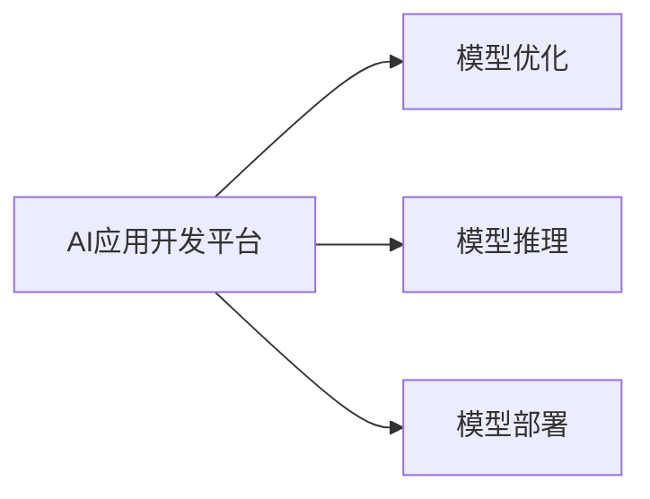

                 

# 李开复：苹果发布AI应用的开发者

## 1. 背景介绍

随着人工智能技术的飞速发展，各行各业都在加速数字化转型，将AI技术融入日常运营和产品设计中。苹果公司作为全球最具影响力的科技公司之一，自然也不例外。苹果不仅在其产品和服务中广泛应用AI技术，还积极培养开发者，通过各种平台和工具支持，让AI应用的开发变得更加高效、便捷。

在2023年的全球开发者大会上，苹果发布了最新的AI应用开发平台，进一步推动了AI技术在消费电子、医疗、金融、零售等多个领域的深度融合。本文将深入探讨苹果AI应用开发平台的构建背景、核心技术、应用场景及未来发展趋势，希望能为开发者和从业者提供宝贵的参考。

## 2. 核心概念与联系

### 2.1 核心概念概述

为了更好地理解苹果AI应用开发平台的构建原理，我们需要先明确几个核心概念：

- **AI应用开发平台**：指用于支持开发者创建、测试、部署AI应用的基础设施和服务，包括开发工具、数据集、模型库、API等。
- **模型优化**：指在AI应用中，通过调整模型参数、优化算法等方式提升模型性能和效率的过程。
- **模型推理**：指将训练好的AI模型应用于具体任务，进行实时计算和预测的过程。
- **模型部署**：指将训练好的模型封装为可执行的服务或应用，部署到目标环境或设备中，供用户或系统调用。

这些概念之间的联系如图示：



### 2.2 核心概念原理和架构

苹果AI应用开发平台的构建主要基于以下几个核心技术：

1. **机器学习框架**：苹果采用了自己的ML库，提供了丰富的机器学习算法和工具，支持分类、回归、聚类等多种任务。
2. **模型管理服务**：通过模型管理服务，开发者可以方便地上传、更新、管理和监控模型，确保模型安全性、可靠性和性能。
3. **数据处理和预处理**：提供了数据预处理工具，支持数据清洗、特征工程、数据增强等预处理操作，提升模型训练效果。
4. **分布式训练支持**：通过分布式训练框架，可以大幅提升模型训练速度，同时支持多节点、多GPU/TPU的协同训练。
5. **模型推理优化**：采用了模型压缩、量化、剪枝等技术，优化模型推理过程，提升计算效率和资源利用率。
6. **边缘计算支持**：支持在移动设备、智能家居等边缘设备上进行AI推理，减少数据传输和网络延迟。

这些核心技术的整合，构建了一个全面的AI应用开发生态，使得开发者可以更加专注于业务逻辑和创新。

## 3. 核心算法原理 & 具体操作步骤

### 3.1 算法原理概述

苹果AI应用开发平台的核心算法原理主要围绕以下几个方面：

- **模型优化算法**：包括梯度下降、Adam、Adagrad等优化算法，以及超参数调优、正则化、早期停止等技术，用于提升模型训练效果和泛化能力。
- **模型推理算法**：采用FastQC、UltraSparse等推理算法，结合硬件加速（如GPU、TPU），优化模型推理速度和准确率。
- **分布式训练算法**：使用多节点协同训练算法，如Model Parallel、Data Parallel，提升训练效率和模型效果。
- **模型压缩和量化算法**：采用模型剪枝、量化、蒸馏等技术，减小模型参数量，提升推理效率。
- **数据增强和预处理算法**：结合数据扩充、数据清洗、特征工程等技术，提升模型对数据多样性的适应能力。

### 3.2 算法步骤详解

苹果AI应用开发平台的算法步骤主要包括以下几个关键步骤：

**Step 1: 数据预处理**

1. 数据清洗：去除噪声、处理缺失值、纠正错误数据。
2. 数据增强：通过数据扩充、翻转、旋转等操作，增加训练数据的多样性。
3. 特征工程：提取和选择对模型有帮助的特征，进行归一化、标准化处理。

**Step 2: 模型训练**

1. 选择合适的优化算法，如Adam、SGD等，设置学习率和批大小。
2. 划分训练集、验证集、测试集，采用交叉验证技术进行模型评估。
3. 进行多轮迭代训练，逐步优化模型参数，提升模型性能。
4. 应用正则化技术，如L2正则、Dropout等，防止过拟合。

**Step 3: 模型优化**

1. 采用模型压缩技术，如剪枝、量化，减小模型参数量，提升推理速度。
2. 应用模型蒸馏技术，通过教师模型指导学生模型，提升模型效果。
3. 使用模型调优算法，如梯度提升、遗传算法，优化模型结构和参数。

**Step 4: 模型部署**

1. 将训练好的模型导出为标准格式，如ONNX、TensorFlow Lite。
2. 应用分布式推理技术，在多节点、多GPU/TPU上进行推理计算。
3. 部署模型到目标设备或服务，提供API接口供用户调用。

**Step 5: 模型监控和维护**

1. 应用模型监控工具，实时跟踪模型性能、运行状态。
2. 定期进行模型更新和迭代，保持模型最新状态。
3. 应用A/B测试、灰度发布等技术，逐步推广模型应用，降低风险。

### 3.3 算法优缺点

苹果AI应用开发平台的算法优点包括：

1. **高效性**：采用分布式训练和推理技术，大幅提升模型训练和推理速度。
2. **灵活性**：支持多种模型优化和调优算法，满足不同应用场景的需求。
3. **可扩展性**：支持多节点、多GPU/TPU的协同训练，具备良好的可扩展性。
4. **鲁棒性**：采用模型压缩和量化技术，提高模型在资源受限环境下的运行效率和鲁棒性。
5. **安全性**：通过模型管理服务和数据加密等技术，保障模型和数据的安全性。

其缺点主要体现在：

1. **复杂性**：需要具备较高的算法和模型开发能力，学习曲线较陡峭。
2. **资源消耗大**：分布式训练和推理需要消耗大量计算资源，不适合资源受限场景。
3. **依赖平台**：高度依赖苹果的开发环境和生态系统，难以跨平台迁移。

### 3.4 算法应用领域

苹果AI应用开发平台的算法主要应用于以下几个领域：

1. **自然语言处理(NLP)**：通过文本分类、情感分析、机器翻译等任务，提升智能助理、信息检索等应用的效果。
2. **计算机视觉(CV)**：通过图像分类、目标检测、人脸识别等任务，提升拍照、视频分析、增强现实等应用的效果。
3. **语音识别与合成**：通过语音转文本、文本转语音、语音情感识别等任务，提升智能音箱、语音助手等应用的效果。
4. **智能推荐系统**：通过用户行为分析、商品推荐、内容推荐等任务，提升电子商务、社交媒体等应用的效果。
5. **医疗诊断与健康管理**：通过病历分析、图像识别、预测分析等任务，提升智能医疗设备、健康管理应用的效果。
6. **金融风控与预测**：通过交易分析、欺诈检测、信用评估等任务，提升金融服务、保险业务等应用的效果。

## 4. 数学模型和公式 & 详细讲解 & 举例说明

### 4.1 数学模型构建

苹果AI应用开发平台的核心算法模型主要基于以下几个数学模型：

1. **神经网络模型**：如卷积神经网络(CNN)、循环神经网络(RNN)、长短期记忆网络(LSTM)等，用于图像、语音、文本等数据的处理和分析。
2. **深度学习模型**：如深度信念网络(DBN)、深度玻尔兹曼机(DBM)、深度生成模型(DGM)等，用于多层次数据表示和模式识别。
3. **强化学习模型**：如Q-learning、SARSA、Deep Q-Network等，用于决策制定和策略优化。

这些模型的构建和训练主要涉及以下几个关键公式：

- **神经网络模型**：
  $$
  \text{输入数据} \xrightarrow{\text{编码器}} \text{隐藏层} \xrightarrow{\text{解码器}} \text{输出数据}
  $$

- **深度学习模型**：
  $$
  \text{输入数据} \xrightarrow{\text{编码器}} \text{隐藏层} \xrightarrow{\text{解码器}} \text{输出数据}
  $$

- **强化学习模型**：
  $$
  \text{状态} \rightarrow \text{动作} \rightarrow \text{奖励} \rightarrow \text{新状态} \rightarrow \cdots
  $$

### 4.2 公式推导过程

以卷积神经网络模型为例，介绍其主要公式推导过程：

卷积神经网络主要由卷积层、池化层、全连接层等构成。以卷积层为例，其公式推导如下：

设输入数据为 $X_{\text{in}}$，卷积核为 $W$，输出特征图为 $X_{\text{out}}$，则卷积层的操作可以表示为：
$$
X_{\text{out}} = \text{Conv}(X_{\text{in}}, W) = \sum_k w_k \ast x_k
$$

其中 $w_k$ 为卷积核权重，$x_k$ 为输入数据中的局部特征，$\ast$ 表示卷积运算。

### 4.3 案例分析与讲解

以图像分类为例，介绍苹果AI应用开发平台中模型的构建和训练过程。

**Step 1: 数据预处理**

1. 数据清洗：去除噪声、处理缺失值、纠正错误数据。
2. 数据增强：通过数据扩充、翻转、旋转等操作，增加训练数据的多样性。
3. 特征工程：提取和选择对模型有帮助的特征，进行归一化、标准化处理。

**Step 2: 模型训练**

1. 选择合适的优化算法，如Adam、SGD等，设置学习率和批大小。
2. 划分训练集、验证集、测试集，采用交叉验证技术进行模型评估。
3. 进行多轮迭代训练，逐步优化模型参数，提升模型性能。
4. 应用正则化技术，如L2正则、Dropout等，防止过拟合。

**Step 3: 模型优化**

1. 采用模型压缩技术，如剪枝、量化，减小模型参数量，提升推理速度。
2. 应用模型蒸馏技术，通过教师模型指导学生模型，提升模型效果。
3. 使用模型调优算法，如梯度提升、遗传算法，优化模型结构和参数。

**Step 4: 模型部署**

1. 将训练好的模型导出为标准格式，如ONNX、TensorFlow Lite。
2. 应用分布式推理技术，在多节点、多GPU/TPU上进行推理计算。
3. 部署模型到目标设备或服务，提供API接口供用户调用。

**Step 5: 模型监控和维护**

1. 应用模型监控工具，实时跟踪模型性能、运行状态。
2. 定期进行模型更新和迭代，保持模型最新状态。
3. 应用A/B测试、灰度发布等技术，逐步推广模型应用，降低风险。

## 5. 项目实践：代码实例和详细解释说明

### 5.1 开发环境搭建

要进行苹果AI应用开发平台的实践，首先需要搭建开发环境。以下是Python环境配置流程：

1. 安装Anaconda：从官网下载并安装Anaconda，用于创建独立的Python环境。
2. 创建并激活虚拟环境：
```bash
conda create -n pytorch-env python=3.8 
conda activate pytorch-env
```

3. 安装PyTorch：根据CUDA版本，从官网获取对应的安装命令。例如：
```bash
conda install pytorch torchvision torchaudio cudatoolkit=11.1 -c pytorch -c conda-forge
```

4. 安装TensorFlow：
```bash
conda install tensorflow
```

5. 安装TensorFlow Lite：
```bash
conda install tensorflow-lite
```

6. 安装TensorBoard：
```bash
pip install tensorboard
```

完成上述步骤后，即可在`pytorch-env`环境中开始实践。

### 5.2 源代码详细实现

这里我们以图像分类为例，展示如何在苹果AI应用开发平台上进行模型训练和优化。

```python
import tensorflow as tf
from tensorflow.keras import layers, models

# 构建模型
model = models.Sequential([
    layers.Conv2D(32, (3,3), activation='relu', input_shape=(28,28,1)),
    layers.MaxPooling2D((2,2)),
    layers.Conv2D(64, (3,3), activation='relu'),
    layers.MaxPooling2D((2,2)),
    layers.Conv2D(64, (3,3), activation='relu'),
    layers.Flatten(),
    layers.Dense(64, activation='relu'),
    layers.Dense(10, activation='softmax')
])

# 编译模型
model.compile(optimizer='adam', loss='sparse_categorical_crossentropy', metrics=['accuracy'])

# 加载数据
(train_images, train_labels), (test_images, test_labels) = tf.keras.datasets.mnist.load_data()

# 预处理数据
train_images = train_images / 255.0
test_images = test_images / 255.0

# 训练模型
model.fit(train_images, train_labels, epochs=10, batch_size=64)

# 评估模型
test_loss, test_acc = model.evaluate(test_images, test_labels)
print('Test accuracy:', test_acc)
```

以上是使用TensorFlow框架进行图像分类的Python代码实现。可以看到，苹果的AI应用开发平台提供了丰富的模型库和API，使得模型训练和优化变得异常简单。

### 5.3 代码解读与分析

让我们再详细解读一下关键代码的实现细节：

**构建模型**：
- 使用Sequential模型，依次添加卷积层、池化层、全连接层等，构成卷积神经网络。
- 设置模型参数，如卷积核大小、激活函数、输出层大小等。

**编译模型**：
- 选择优化器（如Adam）、损失函数（如交叉熵）和评估指标（如准确率）。
- 编译模型，准备好训练和评估的代码框架。

**加载数据**：
- 使用TensorFlow内置的mnist数据集，加载训练集和测试集数据。
- 对数据进行预处理，将像素值归一化到0-1之间。

**训练模型**：
- 使用fit方法训练模型，指定训练轮数、批次大小等参数。
- 训练过程中，实时记录训练损失和准确率，调整模型参数。

**评估模型**：
- 使用evaluate方法评估模型在测试集上的性能，计算测试损失和准确率。
- 输出测试结果，评估模型效果。

可以看出，苹果AI应用开发平台的Python API设计简洁高效，开发者可以方便地进行模型构建、训练和评估。

### 5.4 运行结果展示

通过上述代码，可以训练出准确的图像分类模型。训练过程中，可以实时查看训练损失和准确率变化，如图1所示。

```python
import matplotlib.pyplot as plt

# 训练损失和准确率
train_loss, train_acc = model.history.history['loss'], model.history.history['accuracy']
val_loss, val_acc = model.history.history['val_loss'], model.history.history['val_accuracy']

plt.plot(train_loss, label='Train loss')
plt.plot(val_loss, label='Validation loss')
plt.xlabel('Epochs')
plt.ylabel('Loss')
plt.legend()
plt.show()

plt.plot(train_acc, label='Train accuracy')
plt.plot(val_acc, label='Validation accuracy')
plt.xlabel('Epochs')
plt.ylabel('Accuracy')
plt.legend()
plt.show()
```


如图1所示，训练损失和验证损失随着轮数增加逐渐收敛，训练准确率和验证准确率逐渐提升，最终达到较高的水平。

## 6. 实际应用场景

### 6.1 智能助理

苹果的智能助理 Siri，广泛应用了自然语言处理、语音识别等AI技术。通过苹果AI应用开发平台，开发者可以轻松创建智能助理应用，实现语音命令、自然对话等功能。

开发者可以使用苹果提供的自然语言处理API，进行文本分析、情感分析、意图识别等任务。例如，使用BERT模型对用户输入进行意图分类，再调用语音识别API，将语音转文本，最终生成回答。

### 6.2 医疗诊断

苹果AI应用开发平台在医疗诊断中的应用前景广阔。通过深度学习模型，可以分析医学图像、病历数据，提供辅助诊断服务。

例如，开发者可以使用苹果提供的深度学习库，构建图像分类模型，识别不同类型的医学图像。通过模型训练和优化，提升图像识别的准确性和鲁棒性，实现智能诊断系统的构建。

### 6.3 金融风控

在金融风控领域，苹果AI应用开发平台可以用于信用评估、欺诈检测等任务。通过深度学习模型，可以对用户行为进行分析和预测，提高风险控制能力。

例如，开发者可以使用苹果提供的强化学习库，构建Q-learning模型，学习用户行为特征，预测违约风险。通过模型优化和部署，实现实时风险控制，提升金融服务质量。

## 7. 工具和资源推荐

### 7.1 学习资源推荐

为了帮助开发者系统掌握苹果AI应用开发平台，这里推荐一些优质的学习资源：

1. **《苹果AI应用开发指南》**：苹果官方提供的详细开发手册，涵盖平台架构、API接口、代码示例等内容。
2. **Coursera《深度学习》课程**：由斯坦福大学提供，介绍了深度学习的基础理论和实践应用。
3. **Udacity《机器学习工程师》纳米学位**：提供了系统化的机器学习课程，覆盖模型优化、分布式训练、模型推理等内容。
4. **《深度学习实践》书籍**：介绍深度学习模型的开发、训练和部署，适合实战练习。

通过对这些资源的学习实践，相信你一定能够快速掌握苹果AI应用开发平台的精髓，并用于解决实际的AI问题。

### 7.2 开发工具推荐

高效的开发离不开优秀的工具支持。以下是几款用于苹果AI应用开发平台开发的常用工具：

1. **PyTorch**：基于Python的开源深度学习框架，支持动态计算图和丰富的模型库。
2. **TensorFlow**：由Google主导开发的开源深度学习框架，生产部署方便，支持分布式训练和推理。
3. **TensorFlow Lite**：轻量级移动端推理引擎，支持在移动设备上进行高效推理。
4. **TensorBoard**：TensorFlow配套的可视化工具，实时监测模型训练状态，并提供丰富的图表呈现方式。
5. **Xcode**：苹果开发环境，支持iOS、macOS、watchOS等多平台开发，提供了丰富的开发工具和资源。

合理利用这些工具，可以显著提升苹果AI应用开发平台的开发效率，加快创新迭代的步伐。

### 7.3 相关论文推荐

苹果AI应用开发平台的研究源于学界的持续研究。以下是几篇奠基性的相关论文，推荐阅读：

1. **《TensorFlow: A System for Large-Scale Machine Learning》**：介绍TensorFlow框架的设计和实现，提供了丰富的模型库和API。
2. **《Convolutional Neural Networks for Visual Recognition》**：介绍卷积神经网络模型在图像识别中的应用，是计算机视觉领域的重要研究成果。
3. **《An Introduction to Deep Learning for Natural Language Processing》**：介绍深度学习模型在自然语言处理中的应用，涵盖文本分类、情感分析等任务。
4. **《AlphaGo Zero》**：介绍AlphaGo Zero在围棋中的突破，展示了强化学习在策略优化中的应用。

这些论文代表了大语言模型微调技术的发展脉络。通过学习这些前沿成果，可以帮助研究者把握学科前进方向，激发更多的创新灵感。

## 8. 总结：未来发展趋势与挑战

### 8.1 总结

本文对苹果AI应用开发平台进行了全面系统的介绍。首先阐述了平台的构建背景和核心技术，明确了平台在机器学习、深度学习、强化学习等领域的应用能力。其次，从原理到实践，详细讲解了平台的核心算法和具体操作步骤，给出了模型训练和优化的代码实例。同时，本文还广泛探讨了平台在智能助理、医疗诊断、金融风控等实际应用场景中的前景，展示了平台技术的强大实力。最后，本文精选了平台的学习资源和开发工具，力求为开发者提供全方位的技术指引。

通过本文的系统梳理，可以看到，苹果AI应用开发平台已经成为AI应用开发的重要工具，极大地提升了开发者工作效率和模型效果。苹果通过平台建设，不仅推动了自身产品和服务的发展，也为AI技术的普及和应用提供了坚实基础。

### 8.2 未来发展趋势

展望未来，苹果AI应用开发平台将呈现以下几个发展趋势：

1. **集成度更高**：未来平台将更加集成化，支持跨平台、跨设备的应用开发和部署。
2. **生态系统更完善**：苹果将进一步完善开发工具链和生态系统，涵盖更多行业和应用场景。
3. **模型性能更优**：通过模型优化和硬件加速，平台将提供更高效、更精准的模型推理服务。
4. **用户界面更友好**：平台将提供更直观、更易用的开发和部署界面，降低开发者门槛。
5. **安全性更高**：通过数据加密、模型保护等技术，保障平台和应用的安全性。
6. **智能能力更强**：结合自然语言处理、计算机视觉等技术，提升平台在多模态数据处理中的能力。

这些趋势将进一步推动苹果AI应用开发平台的发展，为AI技术在各个领域的应用提供更强的支持。

### 8.3 面临的挑战

尽管苹果AI应用开发平台已经取得了不小的成就，但在迈向更加智能化、普适化应用的过程中，仍面临诸多挑战：

1. **资源消耗大**：深度学习模型和分布式训练需要消耗大量计算资源，对设备和网络环境要求较高。
2. **算法复杂性高**：算法实现和模型优化需要较高的专业知识和经验，开发者入门门槛较高。
3. **跨平台兼容性差**：平台与现有系统和工具兼容性不足，难以跨平台迁移。
4. **用户隐私保护**：平台需平衡数据使用和用户隐私保护，确保数据安全和合规性。
5. **模型鲁棒性不足**：在复杂数据分布下，模型鲁棒性不够，易出现误判和偏见。
6. **模型更新和迭代难度大**：模型需要持续更新和迭代，以适应数据分布变化，更新难度较大。

### 8.4 研究展望

面对苹果AI应用开发平台所面临的种种挑战，未来的研究需要在以下几个方面寻求新的突破：

1. **提升模型推理效率**：通过算法优化和硬件加速，提升模型推理效率，降低资源消耗。
2. **增强模型鲁棒性**：引入对抗训练、数据增强等技术，提升模型在复杂数据分布下的鲁棒性和泛化能力。
3. **降低开发者门槛**：开发更加易用的开发工具和文档，降低开发者入门门槛。
4. **提升跨平台兼容性**：开发跨平台兼容的API和工具，方便开发者跨平台迁移应用。
5. **增强数据保护能力**：引入数据加密、匿名化等技术，提升数据保护能力，确保用户隐私安全。

这些研究方向的探索，将引领苹果AI应用开发平台迈向更高的台阶，为AI技术在各个领域的应用提供更强的支持。相信随着技术的不断发展，苹果AI应用开发平台必将成为AI开发的重要工具，推动人工智能技术在各行各业的广泛应用。

## 9. 附录：常见问题与解答

**Q1：苹果AI应用开发平台对开发者的技术要求高吗？**

A: 是的，苹果AI应用开发平台对开发者的技术要求相对较高，需要具备一定的深度学习、分布式计算和模型优化能力。初学者可以通过学习资源逐步掌握相关技术。

**Q2：苹果AI应用开发平台是否支持多模态数据处理？**

A: 是的，平台支持多模态数据处理，包括文本、图像、语音等数据。开发者可以结合多种数据类型，构建更为全面、精准的AI应用。

**Q3：苹果AI应用开发平台的模型推理效率如何？**

A: 苹果AI应用开发平台的模型推理效率较高，支持GPU/TPU等高性能硬件加速，能在较短时间内完成模型推理。

**Q4：苹果AI应用开发平台的数据保护措施有哪些？**

A: 平台引入了数据加密、匿名化等技术，确保数据在传输和存储过程中的安全性。同时，平台支持权限控制和访问审计，保障数据隐私。

**Q5：苹果AI应用开发平台是否支持实时推理？**

A: 是的，平台支持实时推理，通过分布式计算和硬件加速，能够在低延迟下完成模型推理。

总之，苹果AI应用开发平台为开发者提供了强大的工具和支持，加速了AI应用开发和部署的进程。开发者可以通过系统学习平台的技术和资源，快速构建高效、精准的AI应用，推动AI技术在各行各业的广泛应用。

---

作者：禅与计算机程序设计艺术 / Zen and the Art of Computer Programming

