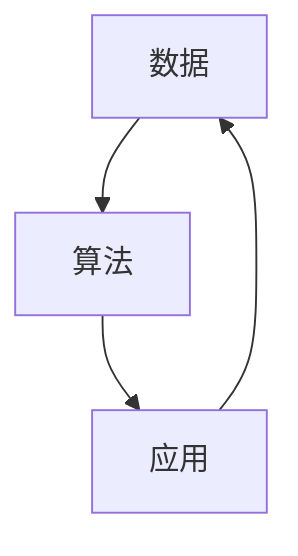

                 

## 1. 背景介绍

随着人工智能(AI)技术的迅猛发展，AI应用已经深入到各行各业，从医疗、金融、教育到娱乐、游戏等领域，AI的应用正在改变我们的生活方式和工作方式。而作为全球AI技术领袖之一的李开复，他对AI应用的开发有着深刻的见解和独特的看法。本文将通过解析李开复的见解，探讨苹果如何发布AI应用以及其背后的开发者团队。

## 2. 核心概念与联系

### 2.1 核心概念概述

AI应用开发是指利用AI技术，开发出能够解决特定问题的软件应用。这些应用通常包括图像识别、自然语言处理、语音识别、机器翻译、智能推荐等技术。开发AI应用不仅需要扎实的AI技术基础，还需要深入理解用户需求、市场趋势和实际应用场景。

李开复在其多次演讲和文章中，强调了数据、算法和应用之间的联系。他认为，高质量的数据、先进的算法和精巧的应用设计是AI应用开发成功的关键因素。此外，他还强调了跨学科合作的重要性，认为AI应用开发需要计算机科学家、数据科学家、软件工程师、产品设计师等多学科团队的协同工作。

### 2.2 核心概念原理和架构的 Mermaid 流程图



在上述图中，数据输入算法，经过处理后输出应用。同时，应用也会产生新的数据反馈给算法，形成一个闭环。这种数据驱动的反馈机制是AI应用开发的重要特点。

## 3. 核心算法原理 & 具体操作步骤

### 3.1 算法原理概述

AI应用开发的核心算法包括深度学习、机器学习、自然语言处理、计算机视觉、语音识别等。其中，深度学习算法是AI应用开发的重要工具，尤其是在图像识别和自然语言处理领域。

李开复认为，AI应用的开发需要选择合适的算法和模型，并根据实际需求进行优化。他强调了迁移学习的重要性，即利用已有的模型，通过微调或迁移学习，在新任务上获得更好的性能。此外，他还提倡使用参数高效微调技术，以避免过拟合，提高模型的泛化能力。

### 3.2 算法步骤详解

AI应用开发的算法步骤通常包括以下几个关键步骤：

1. **数据准备**：收集和预处理数据，确保数据的多样性和质量。
2. **模型选择**：选择适合问题的模型，并进行参数初始化。
3. **训练与微调**：在数据集上训练模型，并根据实际需求进行微调，以提高模型性能。
4. **评估与优化**：使用测试集对模型进行评估，根据评估结果优化模型。
5. **部署与应用**：将训练好的模型部署到实际应用场景中，进行实时推理。

### 3.3 算法优缺点

AI应用开发算法的主要优点包括：

- **高效性**：深度学习算法在处理大规模数据时，具有极高的效率。
- **可扩展性**：AI应用可以轻易地扩展到多个平台和设备。
- **自适应性**：AI应用能够自适应不同的数据分布和用户需求。

但同时，这些算法也存在一些缺点：

- **计算资源消耗大**：深度学习模型通常需要大量的计算资源进行训练和推理。
- **模型复杂度高**：深度学习模型的结构复杂，难以解释和调试。
- **数据依赖性高**：模型的性能依赖于数据的质量和数量，数据获取成本高。

### 3.4 算法应用领域

AI应用开发涉及多个领域，包括但不限于：

- **医疗领域**：利用AI进行疾病诊断、药物研发、个性化治疗等。
- **金融领域**：利用AI进行风险评估、欺诈检测、智能投顾等。
- **教育领域**：利用AI进行智能推荐、作业批改、学情分析等。
- **娱乐领域**：利用AI进行内容推荐、游戏智能、虚拟助手等。

## 4. 数学模型和公式 & 详细讲解 & 举例说明

### 4.1 数学模型构建

AI应用开发的数学模型通常包括：

- **神经网络模型**：用于图像识别、自然语言处理等任务。
- **回归模型**：用于预测连续型变量，如股票价格、气温等。
- **分类模型**：用于分类任务，如垃圾邮件分类、客户分类等。

### 4.2 公式推导过程

以深度学习中的卷积神经网络(CNN)为例，其核心公式为：

$$
\text{Conv}(x, w) = \text{ReLU}(w * x + b)
$$

其中，$x$表示输入特征图，$w$表示卷积核，$b$表示偏置项，$\text{ReLU}$表示激活函数。

### 4.3 案例分析与讲解

以苹果公司发布的AI应用——Siri为例，Siri的核心算法包括语音识别、自然语言理解和回复生成。其中，语音识别使用了深度学习中的卷积神经网络和循环神经网络(CNN-RNN)模型，自然语言理解使用了Transformer模型，回复生成使用了语言生成模型。

## 5. 项目实践：代码实例和详细解释说明

### 5.1 开发环境搭建

在开发AI应用时，通常需要使用Python、TensorFlow、PyTorch等工具。以下是Python开发环境的搭建步骤：

1. **安装Python**：从官网下载并安装Python 3.6或以上版本。
2. **安装虚拟环境**：使用pip安装virtualenv或conda，创建虚拟环境。
3. **安装依赖库**：使用pip安装TensorFlow、PyTorch、Numpy等库。

### 5.2 源代码详细实现

以Siri的语音识别部分为例，代码实现如下：

```python
import tensorflow as tf
from tensorflow.keras import layers

# 定义模型
model = tf.keras.Sequential([
    layers.Conv2D(32, (3,3), activation='relu', input_shape=(32,32,1)),
    layers.MaxPooling2D((2,2)),
    layers.Conv2D(64, (3,3), activation='relu'),
    layers.MaxPooling2D((2,2)),
    layers.Flatten(),
    layers.Dense(128, activation='relu'),
    layers.Dense(10, activation='softmax')
])

# 编译模型
model.compile(optimizer='adam', loss='sparse_categorical_crossentropy', metrics=['accuracy'])

# 训练模型
model.fit(train_images, train_labels, epochs=10, validation_data=(test_images, test_labels))
```

### 5.3 代码解读与分析

上述代码实现了Siri语音识别的核心模型，其中：

- `Sequential`：定义了模型的序列结构。
- `Conv2D`：定义了卷积层，用于提取输入特征。
- `MaxPooling2D`：定义了池化层，用于降采样。
- `Flatten`：定义了展平层，将高维特征图转换为一维向量。
- `Dense`：定义了全连接层，用于分类。

## 6. 实际应用场景

### 6.4 未来应用展望

AI应用开发的前景广阔，未来将会有更多的应用场景涌现。例如：

- **智能家居**：利用AI进行智能控制、语音交互等。
- **自动驾驶**：利用AI进行环境感知、路径规划等。
- **智慧城市**：利用AI进行交通管理、环境监测等。

## 7. 工具和资源推荐

### 7.1 学习资源推荐

- **Coursera**：提供深度学习、机器学习等课程，适合初学者学习。
- **Kaggle**：提供数据科学竞赛平台，可以参与实战项目，提升技能。
- **GitHub**：提供大量开源项目，可以学习和参考。

### 7.2 开发工具推荐

- **Jupyter Notebook**：适合进行数据探索、模型实验和结果分析。
- **TensorBoard**：适合进行模型训练监控和结果可视化。
- **PyCharm**：适合进行复杂的深度学习项目开发。

### 7.3 相关论文推荐

- **《深度学习》by Ian Goodfellow**：全面介绍了深度学习的理论和技术。
- **《神经网络与深度学习》by Michael Nielsen**：适合初学者学习深度学习的基本概念和算法。
- **《TensorFlow实战》by Tom Hope**：提供了TensorFlow的实战开发经验。

## 8. 总结：未来发展趋势与挑战

### 8.1 研究成果总结

AI应用开发在多个领域取得了显著成果，例如医疗领域的疾病预测、金融领域的风险评估、教育领域的智能推荐等。未来，AI应用开发将更加注重数据质量、模型优化和应用设计。

### 8.2 未来发展趋势

AI应用开发将有以下几个发展趋势：

- **跨模态融合**：结合图像、语音、文本等多种模态，进行综合建模。
- **联邦学习**：在不共享数据的前提下，进行模型训练和优化。
- **自动化模型调优**：利用自动化工具，进行模型选择、超参数优化等。
- **边缘计算**：将模型部署到边缘设备，进行本地推理。

### 8.3 面临的挑战

AI应用开发仍面临一些挑战：

- **数据隐私保护**：如何在保护用户隐私的前提下，进行数据收集和使用。
- **模型可解释性**：如何提高模型的可解释性，让用户理解模型的决策过程。
- **计算资源消耗**：如何在保证性能的前提下，降低计算资源消耗。

### 8.4 研究展望

未来，AI应用开发需要在数据、算法和应用设计等方面进行全面优化，以应对不断变化的实际需求和市场挑战。李开复认为，跨学科合作、用户导向设计、算法优化是AI应用开发成功的关键。

## 9. 附录：常见问题与解答

**Q1：AI应用开发需要哪些技能？**

A: AI应用开发需要掌握以下技能：

- **编程语言**：如Python、C++等。
- **数据处理**：如数据清洗、特征工程等。
- **机器学习**：如回归模型、分类模型、深度学习模型等。
- **模型优化**：如超参数调优、正则化、对抗训练等。
- **应用设计**：如界面设计、用户体验优化等。

**Q2：AI应用开发需要注意哪些问题？**

A: AI应用开发需要注意以下问题：

- **数据质量**：确保数据的多样性和质量，避免过拟合。
- **模型选择**：选择适合问题的模型，并进行参数初始化。
- **训练与优化**：使用测试集对模型进行评估，根据评估结果优化模型。
- **部署与应用**：将训练好的模型部署到实际应用场景中，进行实时推理。

**Q3：AI应用开发的前景如何？**

A: AI应用开发前景广阔，未来将会有更多的应用场景涌现。例如智能家居、自动驾驶、智慧城市等。随着技术的不断进步，AI应用将在各个领域发挥更大的作用。

---

作者：禅与计算机程序设计艺术 / Zen and the Art of Computer Programming

