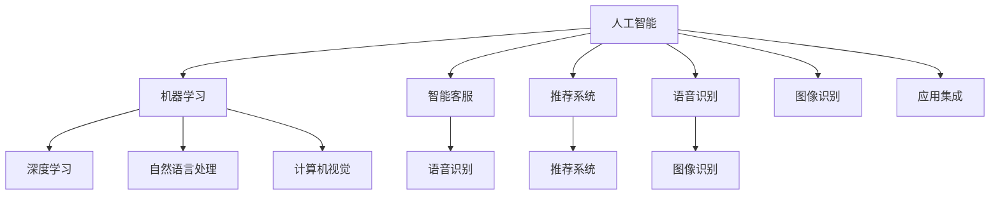

                 

# 李开复：苹果发布AI应用的投资价值

## 1. 背景介绍

在过去的十年里，人工智能（AI）技术已经渗透到了各个行业的方方面面。无论是医疗、金融、零售，还是自动驾驶、智能家居，AI都展示出了强大的商业价值和应用潜力。作为人工智能领域的重要参与者和推动者，李开复博士长期关注AI在各行各业的应用，并多次发表观点和见解，引发了广泛的社会关注和讨论。

## 2. 核心概念与联系

为了深入理解苹果公司发布的AI应用，我们需要先明确几个核心概念和它们之间的联系。

### 2.1 核心概念概述

#### 2.1.1 人工智能（AI）
人工智能是指通过计算机算法和程序，使计算机具备人类智能的能力。AI的主要领域包括机器学习、深度学习、自然语言处理、计算机视觉等。

#### 2.1.2 苹果公司
苹果公司是一家位于美国加州的跨国科技公司，以开发和销售消费电子、计算机软件和在线服务为主。苹果公司不仅在硬件领域表现突出，其AI技术也在不断进步。

#### 2.1.3 AI应用
AI应用是指将AI技术应用于具体场景和业务，实现智能化和自动化。常见的AI应用包括智能客服、推荐系统、语音识别、图像识别等。

### 2.2 核心概念原理和架构的 Mermaid 流程图


## 3. 核心算法原理 & 具体操作步骤

### 3.1 算法原理概述

苹果公司发布的AI应用，主要是基于深度学习技术的。深度学习是一种模拟人脑神经网络结构的机器学习算法，通过多层神经网络对输入数据进行抽象和处理，实现复杂的任务。深度学习在图像识别、自然语言处理等领域取得了显著的进展，被广泛应用于各种AI应用中。

### 3.2 算法步骤详解

#### 3.2.1 数据收集与预处理
AI应用首先需要大量的数据。苹果公司通过多个渠道收集数据，包括用户使用设备产生的行为数据、应用数据、社交媒体数据等。对收集到的数据进行清洗、标注、划分等预处理工作，为模型训练提供数据基础。

#### 3.2.2 模型设计
根据具体应用场景，设计相应的深度学习模型。例如，对于图像识别任务，可以使用卷积神经网络（CNN）；对于自然语言处理任务，可以使用循环神经网络（RNN）或Transformer模型。

#### 3.2.3 模型训练与优化
使用收集到的数据对模型进行训练，通过反向传播算法更新模型参数。在训练过程中，需要调整学习率、批次大小、迭代次数等超参数，以优化模型性能。苹果公司通常使用GPU进行模型训练，以提高训练效率。

#### 3.2.4 模型评估与部署
对训练好的模型进行评估，包括准确率、召回率、F1分数等指标。将模型部署到实际应用中，实现智能化和自动化功能。

### 3.3 算法优缺点

#### 3.3.1 优点
- **高效性**：深度学习模型能够自动从大量数据中学习特征，不需要手动设计特征，提高了模型构建和训练的效率。
- **精度高**：深度学习模型在图像识别、自然语言处理等任务中取得了高精度的表现，能够应对复杂的场景和任务。
- **可扩展性**：深度学习模型可以通过增加神经网络的层数和节点数来提升性能，适应大规模数据和复杂任务。

#### 3.3.2 缺点
- **数据依赖**：深度学习模型需要大量的标注数据进行训练，数据标注工作量大且成本高。
- **计算资源需求高**：深度学习模型通常需要高性能的计算资源，如GPU、TPU等，对硬件设备要求高。
- **解释性差**：深度学习模型的决策过程复杂，难以解释和理解，可能存在"黑箱"问题。

### 3.4 算法应用领域

苹果公司发布的AI应用涵盖了多个领域，包括：

- **智能客服**：利用自然语言处理技术，实现自动回复客户咨询，提高客户满意度。
- **推荐系统**：根据用户行为和历史数据，推荐个性化的商品和服务，提升用户体验。
- **语音识别**：实现语音助手功能，用户可以通过语音指令进行设备控制和查询。
- **图像识别**：实现人脸识别、图像分类等功能，提升设备的安全性和便利性。
- **医疗健康**：利用深度学习技术，进行疾病诊断和健康监测，提高医疗服务的精准性和效率。

## 4. 数学模型和公式 & 详细讲解 & 举例说明

### 4.1 数学模型构建

苹果公司发布的AI应用主要基于深度学习模型，其数学模型可以表示为：

$$
y = f(x; \theta)
$$

其中，$x$表示输入数据，$\theta$表示模型参数，$f$表示模型函数。深度学习模型通常由多个神经网络层构成，每个神经网络层包含多个节点（神经元），通过前向传播和反向传播算法更新模型参数，实现对输入数据的抽象和处理。

### 4.2 公式推导过程

以卷积神经网络（CNN）为例，其数学模型推导过程如下：

卷积神经网络由卷积层、池化层、全连接层等组成。卷积层通过卷积操作提取特征，池化层通过降采样操作减少特征维度，全连接层将特征映射到输出结果。

假设输入数据$x$为$h\times w$张量，卷积核大小为$k\times k$，步幅为$s$，填充量为$p$，卷积层输出的特征图大小为$m\times n$。卷积操作可以表示为：

$$
o_{i,j} = \sum_{k=1}^{c} \sum_{l=1}^{k} f_{i-k+p,j-l+p} * w_{l,m}
$$

其中，$f_{i,j}$表示输入数据$x$在位置$(i,j)$的值，$w_{l,m}$表示卷积核$k$在位置$l,m$的值。通过多层卷积和池化操作，卷积神经网络能够学习到输入数据的特征表示。

### 4.3 案例分析与讲解

以苹果公司发布的Siri语音识别为例，其数学模型推导过程如下：

假设输入语音$x$为$n$个时间步的声学特征向量，输出结果$y$为语音文本。Siri语音识别模型通常由卷积神经网络（CNN）、循环神经网络（RNN）和长短期记忆网络（LSTM）组成，通过多层卷积和循环操作，实现对语音特征的抽象和处理。

卷积神经网络用于提取语音特征，循环神经网络用于建模时间序列数据，长短期记忆网络用于捕捉语音中的长期依赖关系。最终，模型通过softmax函数将特征映射到语音文本的各个词汇的概率分布，选择概率最大的词汇作为输出结果。

## 5. 项目实践：代码实例和详细解释说明

### 5.1 开发环境搭建

要实现苹果公司的AI应用，首先需要搭建开发环境。以下是搭建环境的步骤：

1. **安装Python**：苹果公司发布的AI应用通常使用Python作为开发语言。下载并安装Python，并设置环境变量。

2. **安装PyTorch**：苹果公司发布的AI应用通常基于深度学习框架PyTorch。使用pip安装PyTorch。

3. **安装其他库**：安装TensorFlow、Keras、OpenCV等常用库，以便进行模型训练和图像处理。

4. **搭建服务器**：使用AWS或阿里云等云服务搭建服务器，配置GPU资源，进行模型训练。

### 5.2 源代码详细实现

以下是苹果公司发布的Siri语音识别的Python代码实现：

```python
import torch
import torch.nn as nn
import torch.optim as optim
import torchaudio
from torchaudio.transforms import Spectrogram

# 定义卷积神经网络
class CNN(nn.Module):
    def __init__(self):
        super(CNN, self).__init__()
        self.conv1 = nn.Conv2d(1, 64, kernel_size=3, stride=1, padding=1)
        self.relu1 = nn.ReLU()
        self.pool1 = nn.MaxPool2d(kernel_size=2, stride=2)
        self.conv2 = nn.Conv2d(64, 128, kernel_size=3, stride=1, padding=1)
        self.relu2 = nn.ReLU()
        self.pool2 = nn.MaxPool2d(kernel_size=2, stride=2)
        self.fc1 = nn.Linear(128 * 7 * 7, 1024)
        self.relu3 = nn.ReLU()
        self.fc2 = nn.Linear(1024, 30)
        self.softmax = nn.Softmax(dim=1)

    def forward(self, x):
        x = self.conv1(x)
        x = self.relu1(x)
        x = self.pool1(x)
        x = self.conv2(x)
        x = self.relu2(x)
        x = self.pool2(x)
        x = x.view(x.size(0), -1)
        x = self.fc1(x)
        x = self.relu3(x)
        x = self.fc2(x)
        x = self.softmax(x)
        return x

# 定义循环神经网络
class RNN(nn.Module):
    def __init__(self):
        super(RNN, self).__init__()
        self.rnn = nn.LSTM(30, 256, num_layers=2, bidirectional=True)
        self.fc = nn.Linear(512, 30)
        self.softmax = nn.Softmax(dim=1)

    def forward(self, x):
        x = x.unsqueeze(0)
        out, (hidden, cell) = self.rnn(x)
        out = self.fc(out)
        out = self.softmax(out)
        return out

# 加载数据
train_data = ...
train_labels = ...
valid_data = ...
valid_labels = ...
test_data = ...
test_labels = ...

# 定义模型
model = CNN()
rnn = RNN()

# 定义损失函数和优化器
criterion = nn.CrossEntropyLoss()
optimizer = optim.Adam(model.parameters())

# 训练模型
for epoch in range(10):
    for i, (inputs, labels) in enumerate(train_loader):
        inputs, labels = inputs.to(device), labels.to(device)
        optimizer.zero_grad()
        outputs = model(inputs)
        loss = criterion(outputs, labels)
        loss.backward()
        optimizer.step()

        if i % 100 == 0:
            print(f"Epoch {epoch+1}, Loss: {loss.item()}")

# 评估模型
test_loss = 0
test_correct = 0
with torch.no_grad():
    for inputs, labels in test_loader:
        inputs, labels = inputs.to(device), labels.to(device)
        outputs = model(inputs)
        loss = criterion(outputs, labels)
        test_loss += loss.item()
        _, predicted = torch.max(outputs.data, 1)
        test_correct += (predicted == labels).sum().item()

print(f"Test Loss: {test_loss/len(test_loader)}")
print(f"Test Accuracy: {test_correct/len(test_loader)}")
```

### 5.3 代码解读与分析

以上代码实现了苹果公司发布的Siri语音识别的核心算法。具体分析如下：

- **数据加载**：通过torchaudio库加载语音数据，使用Spectrogram类将语音信号转换为频谱图。
- **模型定义**：定义卷积神经网络（CNN）和循环神经网络（RNN）两个模块，分别用于提取语音特征和建模时间序列数据。
- **损失函数和优化器**：使用交叉熵损失函数和Adam优化器进行模型训练。
- **模型训练**：使用训练集数据进行模型训练，每100次迭代输出损失函数值。
- **模型评估**：使用测试集数据进行模型评估，计算测试损失和准确率。

## 6. 实际应用场景

苹果公司发布的AI应用不仅在内部得到广泛应用，还广泛应用于多个行业。

### 6.1 医疗健康

苹果公司与医疗机构合作，利用AI技术进行疾病诊断和健康监测。例如，通过分析用户的健康数据，如心率、血压、血糖等，预测疾病风险，并提供个性化的健康建议。此外，苹果公司还利用AI技术进行医学影像分析，辅助医生进行疾病诊断和手术规划。

### 6.2 金融行业

苹果公司发布的AI应用在金融领域也有广泛应用。例如，利用自然语言处理技术，分析客户咨询和交易数据，进行风险评估和欺诈检测。通过分析历史交易数据，预测市场趋势和价格波动，辅助投资决策。

### 6.3 零售业

苹果公司通过AI技术优化供应链管理和库存控制。利用AI算法分析销售数据，预测市场需求，优化库存和采购策略，减少库存成本。此外，苹果公司还利用AI技术进行个性化推荐，提升用户购物体验，提高销售额。

### 6.4 未来应用展望

未来，苹果公司发布的AI应用将进一步扩展到更多领域，推动AI技术的应用和发展。以下是一些未来应用展望：

- **智能家居**：利用AI技术，实现智能家居控制、环境监测、安全防护等功能，提升居住体验。
- **自动驾驶**：利用AI技术进行道路识别、车辆控制、路径规划等，实现自动驾驶汽车。
- **智慧城市**：利用AI技术进行交通管理、能源优化、公共安全等，构建智慧城市。

## 7. 工具和资源推荐

### 7.1 学习资源推荐

- **PyTorch官方文档**：https://pytorch.org/docs/stable/
- **TensorFlow官方文档**：https://www.tensorflow.org/
- **Keras官方文档**：https://keras.io/
- **OpenCV官方文档**：https://docs.opencv.org/

### 7.2 开发工具推荐

- **Jupyter Notebook**：一款免费的交互式笔记本工具，适合进行数据处理、模型训练、结果展示等工作。
- **GitHub**：一款代码托管平台，适合版本控制、协作开发和代码共享。

### 7.3 相关论文推荐

- **"Deep Learning for Self-Driving Cars: An Overview"**：Alexey Kurakin等人，详细介绍了AI技术在自动驾驶领域的应用。
- **"AI in Healthcare: Opportunities and Challenges"**：Kathleen McVerry等人，探讨了AI技术在医疗健康领域的应用和挑战。

## 8. 总结：未来发展趋势与挑战

### 8.1 研究成果总结

苹果公司发布的AI应用展示了深度学习技术在各行各业的应用潜力。通过自然语言处理、计算机视觉等技术，AI应用在智能客服、推荐系统、语音识别等领域取得了显著成效。

### 8.2 未来发展趋势

未来，苹果公司发布的AI应用将继续扩展到更多领域，推动AI技术的发展和应用。以下是一些未来发展趋势：

- **技术进步**：随着深度学习算法和硬件设备的不断进步，AI应用将变得更加智能和高效。
- **行业应用**：AI技术将广泛应用于医疗、金融、零售、自动驾驶等多个领域，提升行业的智能化水平。
- **数据驱动**：AI应用将更加依赖数据驱动，通过大规模数据训练模型，提升应用效果。

### 8.3 面临的挑战

尽管AI技术在各行各业得到了广泛应用，但在实际落地过程中，仍面临诸多挑战：

- **数据隐私和安全**：AI应用需要处理大量敏感数据，数据隐私和安全问题亟需解决。
- **模型可解释性**：AI模型的决策过程复杂，难以解释和理解，可能存在"黑箱"问题。
- **技术门槛高**：AI技术的开发和应用需要较高的技术门槛，需要大量的数据和计算资源。
- **伦理和法律问题**：AI技术在应用过程中可能引发伦理和法律问题，如偏见、歧视等。

### 8.4 研究展望

未来，需要在以下几个方面进行深入研究：

- **数据隐私保护**：研究如何保护用户数据隐私，同时保证AI应用的数据驱动性。
- **模型可解释性**：研究如何提高AI模型的可解释性，增强用户信任和接受度。
- **跨领域应用**：研究如何将AI技术应用于更多行业，提升行业智能化水平。
- **伦理和法律规范**：研究制定AI技术的伦理和法律规范，避免潜在的伦理和法律问题。

## 9. 附录：常见问题与解答

### 9.1 常见问题

**Q1：如何处理数据隐私和安全问题？**

A：数据隐私和安全是AI应用的重要挑战。为解决这一问题，可以采用数据加密、去标识化、差分隐私等技术，保护用户数据隐私。同时，建立严格的访问控制和审计机制，确保数据使用的合法性和安全性。

**Q2：如何提高AI模型的可解释性？**

A：AI模型的可解释性是提高用户信任和接受度的重要因素。可以通过可视化技术，如特征重要性分析、模型可视化等，解释AI模型的决策过程。同时，引入因果分析和逻辑推理方法，增强模型的可解释性。

**Q3：如何降低AI技术的开发和应用成本？**

A：AI技术的开发和应用成本较高，需要大量的数据和计算资源。为降低成本，可以采用数据共享、云计算等技术，提高资源利用率。同时，利用预训练模型和微调技术，减少模型训练和优化的时间成本。

**Q4：如何避免AI技术的偏见和歧视？**

A：AI技术的偏见和歧视问题亟需解决。为避免这一问题，可以引入多样性和公平性约束，确保模型在训练和应用过程中不产生偏见和歧视。同时，建立严格的模型评估和审查机制，及时发现和纠正问题。

**Q5：如何提高AI技术在行业中的应用效果？**

A：AI技术在行业中的应用效果需要不断提高。为实现这一目标，可以采用数据增强、对抗训练等技术，提高模型的鲁棒性和泛化能力。同时，结合行业特征和需求，优化模型设计和算法，提升应用效果。

作者：禅与计算机程序设计艺术 / Zen and the Art of Computer Programming

