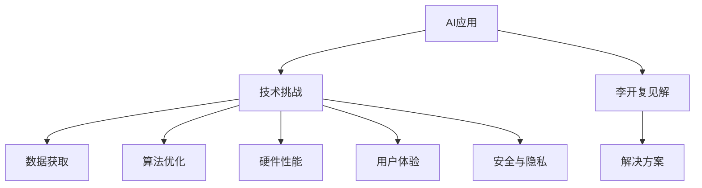

                 

# 李开复：苹果发布AI应用的挑战

> 关键词：AI应用,技术挑战,李开复,苹果公司,人工智能,自动驾驶,语音识别,图像处理

## 1. 背景介绍

苹果公司一直以来在人工智能领域保持低调，但近来却频频在AI应用发布上发力，如Siri语音识别、Face ID图像处理、自动驾驶等。然而，这些AI应用的发展并非一帆风顺，面临诸多技术和业务挑战。李开复，作为计算机科学领域的知名专家，曾长期担任谷歌和微软的AI实验室主任，对AI技术的应用和挑战有着深入的洞察。本文将从李开复的角度，探讨苹果发布AI应用所面临的技术挑战，分析其背后的原因和解决方案。

## 2. 核心概念与联系

### 2.1 核心概念概述

在探讨苹果发布AI应用的挑战前，首先需要理解以下核心概念：

- AI应用：利用人工智能技术实现特定业务功能的系统，如语音识别、图像处理、自动驾驶等。
- 技术挑战：指实现这些AI应用时所遇到的难题，如数据获取、算法优化、硬件性能等。
- 李开复：著名的计算机科学家和企业家，曾担任谷歌和微软的AI实验室主任，对AI领域有着深远影响。
- 苹果公司：全球知名的科技公司，在消费电子、软件服务、硬件制造等领域均有布局。
- 人工智能：一种旨在模拟人类智能的技术，涵盖了机器学习、深度学习、自然语言处理等多个领域。

这些概念构成了苹果发布AI应用的背景和核心，彼此之间紧密联系，共同构成了分析的框架。

### 2.2 核心概念原理和架构的 Mermaid 流程图(Mermaid 流程节点中不要有括号、逗号等特殊字符)



这个流程图展示了AI应用与技术挑战之间的逻辑关系，并标注了李开复见解和解决方案的重要节点。通过这个图，我们可以更好地理解文章接下来的内容。

## 3. 核心算法原理 & 具体操作步骤

### 3.1 算法原理概述

AI应用的核心在于利用人工智能技术解决特定问题。然而，不同AI应用的技术原理和挑战各不相同。以下是一些常见AI应用及其技术原理的概述：

- **语音识别**：利用深度学习模型处理语音信号，提取特征并进行分类，实现文字识别。
- **图像处理**：通过卷积神经网络(CNN)等模型，分析图像像素，提取特征并进行分类、检测、分割等任务。
- **自动驾驶**：结合计算机视觉、传感器数据和深度学习技术，实现对环境的感知和决策。

这些技术的共同点在于都需要大量的数据、高效的算法和强大的硬件支持。然而，这些技术的难点和挑战也各不相同。

### 3.2 算法步骤详解

以语音识别为例，其基本算法步骤包括：

1. **数据收集与预处理**：收集大量语音数据，进行降噪、分段、提取MFCC特征等预处理工作。
2. **模型训练**：使用深度学习模型（如RNN、CNN、Transformer等）对数据进行训练，调整模型参数。
3. **模型评估与优化**：通过验证集对模型进行评估，调整超参数和模型结构，提高准确率和鲁棒性。
4. **部署与优化**：将训练好的模型部署到实际设备上，进行性能调优和实时性优化。

这些步骤涵盖了从数据处理到模型部署的完整流程，是实现AI应用的关键环节。

### 3.3 算法优缺点

AI应用的优势在于其高效、准确、可扩展性强。然而，也存在以下缺点：

- **数据需求高**：大部分AI应用需要大量高质量的数据进行训练，数据获取和标注成本高。
- **算法复杂**：深度学习模型训练复杂，需要大量计算资源和时间。
- **硬件依赖**：AI应用对计算硬件的要求高，如GPU、TPU等。
- **实时性要求**：实时性要求高的应用（如自动驾驶）对模型的性能和硬件性能有严格要求。
- **隐私和安全**：AI应用涉及大量用户数据，数据隐私和安全问题不容忽视。

### 3.4 算法应用领域

AI技术在众多领域都有广泛应用，如医疗、金融、零售、制造等。以下列举几个典型应用领域：

- **医疗**：AI辅助诊断、病历分析、药物研发等。
- **金融**：信用评估、风险管理、智能投顾等。
- **零售**：推荐系统、客户分析、库存管理等。
- **制造**：智能制造、质量控制、预测性维护等。

这些应用领域展示了AI技术的广泛性和实用性，但也面临着各自的挑战。

## 4. 数学模型和公式 & 详细讲解 & 举例说明

### 4.1 数学模型构建

以语音识别为例，常见的模型包括：

- **隐马尔可夫模型(HMM)**：基于概率模型的语音识别方法，用于建模声学特征与文字之间的映射关系。
- **深度神经网络(DNN)**：通过多层神经网络进行特征提取和分类。
- **卷积神经网络(CNN)**：用于图像处理，提取局部特征。
- **长短时记忆网络(LSTM)**：用于序列数据处理，如语音时间序列。
- **Transformer**：用于自然语言处理，处理长文本序列。

这些模型的数学基础包括概率论、线性代数、微积分等。其中，深度学习模型的核心是神经网络的前向传播和反向传播算法，以及优化算法如梯度下降。

### 4.2 公式推导过程

以深度神经网络为例，其前向传播和反向传播的公式如下：

- **前向传播**：

$$
y = \sigma(Wx + b)
$$

其中，$x$ 为输入向量，$W$ 为权重矩阵，$b$ 为偏置向量，$\sigma$ 为激活函数。

- **反向传播**：

$$
\frac{\partial L}{\partial W} = \frac{\partial L}{\partial y} \frac{\partial y}{\partial W}
$$

其中，$L$ 为损失函数，$\frac{\partial L}{\partial y}$ 为损失函数对输出层的梯度，$\frac{\partial y}{\partial W}$ 为输出层对权重矩阵的梯度。

### 4.3 案例分析与讲解

以图像处理为例，CNN模型的典型结构包括卷积层、池化层、全连接层等。以下是一个简单的CNN模型结构：

```
[输入图像]
|
V
[卷积层]
|
V
[激活函数]
|
V
[池化层]
|
V
[全连接层]
|
V
[输出层]
```

其中，卷积层和池化层用于提取图像特征，全连接层和输出层用于分类。CNN模型通过堆叠多层卷积和池化层，提取局部特征，并通过全连接层进行分类。

## 5. 项目实践：代码实例和详细解释说明

### 5.1 开发环境搭建

在搭建AI应用的开发环境时，需要考虑以下几个方面：

- **操作系统**：常用的操作系统包括Linux、macOS、Windows等。
- **编程语言**：常用的编程语言包括Python、C++、Java等。
- **框架和库**：常用的深度学习框架包括TensorFlow、PyTorch、Keras等，常用的数据处理库包括NumPy、Pandas等。
- **硬件设备**：常用的硬件设备包括GPU、TPU、FPGA等，需要使用相应的驱动程序。

### 5.2 源代码详细实现

以下是一个简单的TensorFlow语音识别模型实现：

```python
import tensorflow as tf
from tensorflow.keras import layers, models

# 定义模型
model = models.Sequential()
model.add(layers.Conv2D(32, (3, 3), activation='relu', input_shape=(64, 64, 3)))
model.add(layers.MaxPooling2D((2, 2)))
model.add(layers.Flatten())
model.add(layers.Dense(128, activation='relu'))
model.add(layers.Dense(10, activation='softmax'))

# 编译模型
model.compile(optimizer='adam', loss='categorical_crossentropy', metrics=['accuracy'])

# 训练模型
model.fit(train_data, train_labels, epochs=10, validation_data=(val_data, val_labels))
```

### 5.3 代码解读与分析

- **模型定义**：使用Sequential模型定义多层网络结构，包括卷积层、池化层、全连接层等。
- **编译模型**：使用Adam优化器进行模型优化，损失函数为交叉熵，评估指标为准确率。
- **训练模型**：使用fit方法对模型进行训练，定义训练数据、验证数据和超参数。

## 6. 实际应用场景

### 6.1 语音识别

语音识别是AI应用中最具代表性的技术之一，广泛应用于智能手机、智能音箱、智能家居等领域。苹果的Siri语音识别技术基于深度学习模型，通过大量语音数据进行训练，能够准确识别用户的语音指令。

### 6.2 图像处理

苹果的Face ID技术利用深度学习模型进行人脸识别，通过分析面部特征，识别用户的身份。Face ID技术的应用场景包括手机解锁、支付认证、设备解锁等。

### 6.3 自动驾驶

自动驾驶是AI应用中最具挑战性的技术之一，涉及到计算机视觉、传感器数据、决策优化等多个领域的知识。苹果的自动驾驶技术正在逐步成熟，预计将在未来的汽车市场中占据重要地位。

### 6.4 未来应用展望

未来，随着AI技术的发展，AI应用将更加广泛和深入。以下是对未来AI应用的展望：

- **医疗**：AI辅助诊断、病历分析、药物研发等将进一步发展，提升医疗服务质量。
- **金融**：智能投顾、信用评估、风险管理等将广泛应用，推动金融业智能化转型。
- **零售**：推荐系统、客户分析、库存管理等将更加精准，提升零售业效率和客户体验。
- **制造**：智能制造、质量控制、预测性维护等将更加普及，提升制造业竞争力。

## 7. 工具和资源推荐

### 7.1 学习资源推荐

为了深入理解AI应用的原理和实践，以下是一些优质的学习资源：

- **《深度学习》课程**：斯坦福大学开设的深度学习课程，系统讲解深度学习的基本概念和算法。
- **《Python深度学习》书籍**：通过Python语言实现深度学习算法，适合初学者入门。
- **《TensorFlow官方文档》**：TensorFlow的官方文档，提供了完整的API和教程，适合进行项目实践。
- **Kaggle竞赛**：通过参加Kaggle竞赛，积累实战经验，提升AI应用开发能力。
- **GitHub开源项目**：通过参与开源项目，学习前沿技术，提升代码能力和项目经验。

### 7.2 开发工具推荐

以下是一些常用的AI应用开发工具：

- **TensorFlow**：由Google开发的深度学习框架，支持多种编程语言和平台。
- **PyTorch**：由Facebook开发的深度学习框架，支持动态计算图和易用性。
- **Jupyter Notebook**：用于数据处理、模型训练和代码调试，支持多种编程语言。
- **GitHub**：用于代码版本控制和协作开发，支持项目管理和版本回溯。

### 7.3 相关论文推荐

以下是一些经典和前沿的AI应用论文，值得深入阅读：

- **《深度学习》书籍**：Ian Goodfellow等人著，系统讲解深度学习的基本概念和算法。
- **《计算机视觉：模型、学习与推理》书籍**：Richard Szeliski著，全面介绍计算机视觉的原理和技术。
- **《自然语言处理综论》书籍**：Daniel Jurafsky和James H. Martin著，系统讲解自然语言处理的基本概念和算法。
- **《AI Superpowers: China, Silicon Valley, and the New World Order》书籍**：李开复著，探讨AI技术的发展和应用，对苹果公司等科技巨头进行分析。
- **《人工智能：一种现代方法》书籍**：Stuart Russell和Peter Norvig著，全面介绍AI的基本概念和算法。

## 8. 总结：未来发展趋势与挑战

### 8.1 研究成果总结

通过上述分析，我们总结了AI应用在发布过程中所面临的挑战和解决方案，主要包括以下几个方面：

- **数据需求**：需要大量高质量的数据进行训练。
- **算法优化**：需要高效的算法和模型结构。
- **硬件性能**：需要高性能的计算硬件支持。
- **用户体验**：需要流畅、稳定的用户体验。
- **安全与隐私**：需要保障用户数据的安全和隐私。

### 8.2 未来发展趋势

未来，AI技术将更加普及和深入，以下是对未来发展趋势的展望：

- **自动化和智能化**：AI技术将更加自动化，提升效率和用户体验。
- **多模态融合**：结合语音、图像、文本等多种模态，提升AI应用的智能性和实用性。
- **边缘计算**：将AI模型部署到边缘设备上，提升实时性和响应速度。
- **AI伦理和规范**：制定AI伦理规范，确保AI技术的安全和可控性。
- **人机协同**：推动人机协同工作，提升AI技术的社会价值。

### 8.3 面临的挑战

尽管AI技术发展迅速，但仍面临一些挑战：

- **数据隐私和安全**：数据隐私和安全问题不容忽视。
- **算法透明和可解释性**：AI模型的透明性和可解释性不足，需要进一步提升。
- **模型偏见和公平性**：AI模型可能存在偏见，需要解决模型公平性问题。
- **伦理和社会影响**：AI技术可能对社会产生影响，需要制定伦理规范。
- **计算资源和成本**：AI应用的计算资源和成本较高，需要进一步优化。

### 8.4 研究展望

面对上述挑战，未来的研究需要在以下几个方面寻求新的突破：

- **数据隐私保护**：开发数据隐私保护技术，确保用户数据的安全和隐私。
- **模型透明性和可解释性**：开发可解释性强的AI模型，提升模型的透明性和可解释性。
- **模型公平性**：开发公平性优化的AI模型，解决模型偏见问题。
- **伦理和社会影响**：制定AI伦理规范，确保AI技术的社会价值和可控性。
- **计算资源优化**：开发高效计算资源优化技术，降低AI应用的计算资源和成本。

## 9. 附录：常见问题与解答

**Q1：AI应用的数据需求高，如何解决数据获取问题？**

A: 数据获取可以通过以下方式解决：
- **公开数据集**：使用公开数据集，如ImageNet、COCO、Speech Commands等。
- **众包数据标注**：使用众包平台，如Amazon Mechanical Turk，进行数据标注。
- **数据生成**：使用数据生成技术，如GAN、自监督学习等，生成高质量的合成数据。

**Q2：AI应用的算法优化有哪些方法？**

A: AI应用的算法优化可以通过以下方法实现：
- **模型结构优化**：优化网络结构，减少参数量，提高模型效率。
- **超参数优化**：使用超参数优化算法，如网格搜索、随机搜索等，寻找最优参数组合。
- **正则化技术**：使用正则化技术，如L2正则、Dropout等，防止过拟合。
- **迁移学习**：使用迁移学习，利用预训练模型，提升模型泛化能力。

**Q3：AI应用对计算硬件的要求高，如何优化硬件性能？**

A: 优化AI应用的硬件性能可以通过以下方法实现：
- **GPU加速**：使用GPU进行计算加速，提高模型训练和推理速度。
- **模型并行**：使用模型并行技术，将模型分布在多个GPU上进行并行计算。
- **模型压缩**：使用模型压缩技术，减少模型参数量，提高计算效率。
- **混合精度计算**：使用混合精度计算技术，减少内存占用，提高计算效率。

**Q4：AI应用的实时性要求高，如何提升实时性？**

A: 提升AI应用的实时性可以通过以下方法实现：
- **模型裁剪**：去除不必要的层和参数，减小模型尺寸，加快推理速度。
- **量化加速**：将浮点模型转为定点模型，压缩存储空间，提高计算效率。
- **硬件优化**：使用高效的硬件设备，如TPU、FPGA等，提高计算效率。
- **数据预处理**：对输入数据进行预处理，减少计算量，提高实时性。

**Q5：AI应用的隐私和安全问题如何保障？**

A: 保障AI应用的隐私和安全问题可以通过以下方法实现：
- **数据脱敏**：对敏感数据进行脱敏处理，确保数据隐私。
- **访问控制**：使用访问控制技术，确保数据访问安全。
- **加密技术**：使用加密技术，确保数据传输安全。
- **安全审计**：进行安全审计，发现和修复安全漏洞。

---

作者：禅与计算机程序设计艺术 / Zen and the Art of Computer Programming

