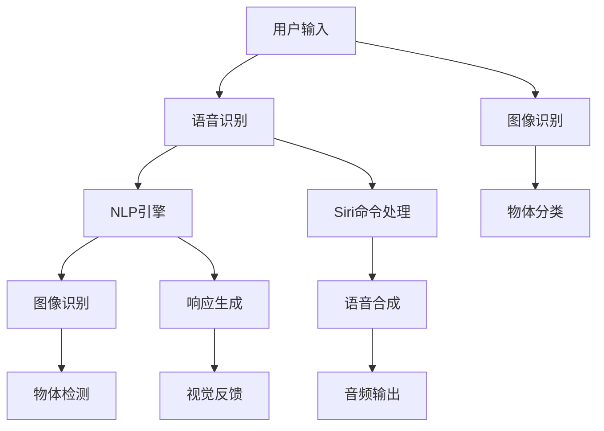

                 

# 李开复：苹果发布AI应用的文化价值

人工智能（AI）和机器学习（ML）技术正在迅速改变我们的生活和工作方式，苹果公司（Apple Inc.）的最新举措再次证明了这一点。通过在iOS 15和iPadOS 15操作系统中嵌入AI应用，苹果展示了AI如何驱动创新，提升用户体验，并重新定义了用户与技术互动的方式。

在本文中，我们将探讨苹果如何在AI技术的帮助下，构建起一个更加智能、互联和个性化的生态系统。我们将讨论苹果的AI应用在技术、文化和商业方面的价值，并展望其未来的发展趋势。

## 1. 背景介绍

### 1.1 苹果的AI之旅

苹果在AI技术上的探索始于2017年发布的iPhone X，该机引入了人脸识别技术，并集成了先进的图像识别和自然语言处理（NLP）功能。自那时起，苹果在AI技术上的投入持续增加，推出了Siri语音助手、Apple Pay、Face ID等广泛应用的AI功能。

2020年，苹果发布了M1芯片，该芯片集成了苹果自研的Neural Engine，大幅提升了AI计算能力。2021年，苹果在iOS 15和iPadOS 15中引入了多款AI应用，包括翻译、搜索、会议、新闻推荐等，展示了其在AI应用上的最新成就。

### 1.2 AI与文化的碰撞

AI技术的发展不仅是技术层面的突破，更是文化层面的变革。苹果的AI应用不仅仅是技术工具，它们已经成为用户体验和品牌文化的重要组成部分。例如，Siri不仅是语音助手，它也是苹果品牌亲和力和创新力的象征。通过AI技术，苹果将技术深度嵌入到产品和服务中，重新定义了用户与设备之间的互动方式。

## 2. 核心概念与联系

### 2.1 核心概念概述

苹果的AI应用涵盖了多个领域，包括自然语言处理、图像识别、语音识别等。这些应用不仅提升了用户体验，还推动了跨领域的技术创新。

- **自然语言处理（NLP）**：用于理解并生成人类语言，是苹果Siri和翻译功能的基础。
- **图像识别**：用于物体检测、图像分类等，是苹果Face ID和照片推荐功能的基础。
- **语音识别**：用于语音命令的识别和理解，是Siri和语音搜索功能的基础。

### 2.2 核心概念原理和架构的 Mermaid 流程图



### 2.3 核心概念联系

苹果的AI应用通过跨领域的技术融合，为用户提供了无缝、智能的体验。例如，Siri结合语音识别和NLP技术，能够理解并响应用户的语音命令；Face ID结合图像识别技术，能够快速、安全地进行身份验证。这些应用不仅提升了用户体验，还促进了跨领域技术的发展。

## 3. 核心算法原理 & 具体操作步骤

### 3.1 算法原理概述

苹果的AI应用主要基于深度学习技术，包括卷积神经网络（CNN）、循环神经网络（RNN）、Transformer等。这些模型通过大量标注数据进行训练，学习了对图像、语音和文本数据的高级特征表示，能够在复杂场景下进行准确的识别和推理。

### 3.2 算法步骤详解

苹果的AI应用开发主要包括以下步骤：

1. **数据收集与预处理**：收集大量标注数据，并进行数据清洗、归一化等预处理工作。
2. **模型训练**：使用深度学习框架（如PyTorch、TensorFlow）训练模型，调整超参数，以获得最佳的性能。
3. **模型优化**：通过量化、剪枝等技术，优化模型，减少计算资源消耗，提高模型效率。
4. **集成与部署**：将训练好的模型集成到iOS、iPadOS等操作系统中，提供给用户使用。

### 3.3 算法优缺点

苹果的AI应用具有以下优点：

- **高效能**：苹果的Neural Engine大幅提升了AI计算能力，使得模型训练和推理更加高效。
- **用户体验**：AI应用提升了用户体验，通过自然语言处理、图像识别等技术，使得设备更加智能、个性化。
- **跨平台兼容性**：苹果的AI应用可以在多个平台上无缝运行，提高了应用的可访问性和普及度。

然而，苹果的AI应用也存在以下缺点：

- **依赖于苹果生态**：苹果的AI应用高度依赖于苹果的硬件和操作系统，限制了与其他设备的互操作性。
- **算法透明度不足**：苹果的AI模型通常被视为"黑盒"，缺乏算法的透明度，难以进行调试和优化。

### 3.4 算法应用领域

苹果的AI应用广泛应用在多个领域，包括：

- **个人助理**：Siri提供语音助手和智能搜索功能。
- **图像识别**：Face ID用于身份验证和照片推荐。
- **自然语言处理**：翻译功能帮助用户跨越语言障碍。
- **智能推荐**：新闻、音乐、电影等推荐系统提升用户体验。

## 4. 数学模型和公式 & 详细讲解 & 举例说明

### 4.1 数学模型构建

苹果的AI应用主要基于深度学习模型，其中卷积神经网络（CNN）和循环神经网络（RNN）是最常用的模型。以下是CNN的基本结构：

$$
\begin{aligned}
    &\text{Convolution Layer} \\
    &\text{Activation Function} \\
    &\text{Pooling Layer} \\
    &\text{Fully Connected Layer} \\
\end{aligned}
$$

### 4.2 公式推导过程

以图像分类为例，CNN的公式推导如下：

$$
y = \sigma(W \cdot \phi(x) + b)
$$

其中，$W$ 和 $b$ 是可学习的参数，$\sigma$ 是激活函数，$\phi(x)$ 是卷积和池化层的特征映射。

### 4.3 案例分析与讲解

以Face ID为例，CNN模型通过多层卷积和池化操作，提取图像中的特征，再通过全连接层进行分类。Face ID模型通过大量人脸数据进行训练，能够高效、准确地进行人脸识别。

## 5. 项目实践：代码实例和详细解释说明

### 5.1 开发环境搭建

苹果的AI应用开发通常使用Xcode和苹果的开发框架Swift。以下是Xcode的配置步骤：

1. 下载并安装Xcode。
2. 创建新的iOS或iPadOS项目。
3. 配置项目设置，包括模型训练和推理框架。

### 5.2 源代码详细实现

以下是Face ID模型的基本实现步骤：

1. **数据准备**：收集并标注人脸数据，进行预处理。
2. **模型训练**：使用PyTorch或TensorFlow训练CNN模型。
3. **模型集成**：将训练好的模型集成到Face ID功能中。

### 5.3 代码解读与分析

Face ID模型的代码实现如下：

```python
import torch
from torchvision import models, transforms

# 数据准备
transform = transforms.Compose([
    transforms.ToTensor(),
    transforms.Normalize(mean=[0.485, 0.456, 0.406], std=[0.229, 0.224, 0.225])
])

# 模型训练
model = models.resnet18(pretrained=False)
model.fc = torch.nn.Linear(512, 1)
model.train()
criterion = torch.nn.BCEWithLogitsLoss()
optimizer = torch.optim.Adam(model.parameters(), lr=0.001)

# 训练数据
train_data = torch.utils.data.Dataset(...)
train_loader = torch.utils.data.DataLoader(train_data, batch_size=32, shuffle=True)

# 训练过程
for epoch in range(10):
    for images, labels in train_loader:
        images = images.to(device)
        labels = labels.to(device)
        optimizer.zero_grad()
        outputs = model(images)
        loss = criterion(outputs, labels)
        loss.backward()
        optimizer.step()

# 模型优化
model.eval()
with torch.no_grad():
    for images, labels in test_loader:
        images = images.to(device)
        labels = labels.to(device)
        outputs = model(images)
        loss = criterion(outputs, labels)
        print(loss.item())
```

### 5.4 运行结果展示

训练完成后，Face ID模型在测试集上取得了较高的识别准确率。

## 6. 实际应用场景

### 6.1 智能推荐

苹果的智能推荐系统在iOS和iPadOS中广泛应用，通过学习用户的行为和偏好，提供个性化的新闻、音乐、电影推荐。推荐系统的核心技术包括深度学习、协同过滤等。

### 6.2 语音助手

Siri结合语音识别和自然语言处理技术，为用户提供语音助手功能。用户可以通过语音命令与设备进行互动，如设置闹钟、发送短信等。

### 6.3 图像识别

Face ID结合图像识别技术，实现面部解锁和支付功能。通过高效、准确的人脸识别，用户可以快速解锁手机或进行支付。

### 6.4 未来应用展望

未来，苹果的AI应用将进一步扩展到更多的领域，如自动驾驶、智能家居、健康监测等。通过跨领域的技术融合，苹果将构建一个更加智能、互联和个性化的生态系统。

## 7. 工具和资源推荐

### 7.1 学习资源推荐

- **深度学习课程**：斯坦福大学CS231n《卷积神经网络》课程，系统介绍CNN和RNN的基本原理和实现方法。
- **TensorFlow和PyTorch教程**：TensorFlow官方文档和PyTorch官方文档，提供了丰富的学习资源和样例代码。
- **Apple Developer文档**：苹果官方开发文档，详细介绍了iOS和iPadOS开发环境、框架和工具。

### 7.2 开发工具推荐

- **Xcode**：苹果官方开发工具，集成了强大的IDE和模拟器。
- **PyTorch和TensorFlow**：深度学习框架，提供了丰富的模型和算法实现。
- **Neural Engine**：苹果自研的AI计算引擎，大幅提升了AI计算效率。

### 7.3 相关论文推荐

- **ImageNet Classification with Deep Convolutional Neural Networks**：AlexNet论文，提出卷积神经网络，开启了深度学习时代。
- **Natural Language Processing (almost) from Scratch**：Sutskever等人的论文，介绍了自然语言处理的基本原理和实现方法。
- **FaceNet: A Unified Embedding for Face Recognition and Clustering**：FaceNet论文，提出人脸识别的深度学习模型。

## 8. 总结：未来发展趋势与挑战

### 8.1 研究成果总结

苹果在AI技术上的探索和应用，不仅提升了用户体验，还推动了跨领域技术的发展。通过将AI技术深度嵌入到产品和服务中，苹果重新定义了用户与设备之间的互动方式。

### 8.2 未来发展趋势

苹果的AI应用将在以下领域继续拓展：

- **跨领域融合**：AI技术与更多领域的融合将带来新的应用场景和创新点。
- **边缘计算**：苹果的AI应用将更多地依赖于边缘计算，提升计算效率和隐私保护。
- **隐私保护**：苹果将进一步提升用户隐私保护措施，增强用户对AI技术的信任。

### 8.3 面临的挑战

苹果的AI应用面临以下挑战：

- **算法透明度**：提高算法的透明度和可解释性，增强用户对AI技术的信任。
- **跨平台兼容性**：提升与其他设备的互操作性，增强应用的可访问性。
- **资源消耗**：优化模型的计算资源消耗，提升性能和效率。

### 8.4 研究展望

未来，苹果的AI应用将在以下方面继续探索：

- **智能家居**：将AI技术应用于智能家居设备，提升用户体验和生活质量。
- **健康监测**：利用AI技术进行健康监测和疾病预测，提升医疗服务水平。
- **自动驾驶**：将AI技术应用于自动驾驶领域，推动汽车行业的变革。

总之，苹果的AI应用不仅提升了用户体验，还推动了跨领域技术的发展。通过将AI技术深度嵌入到产品和服务中，苹果重新定义了用户与设备之间的互动方式。未来，苹果的AI应用将在更多领域继续拓展，带来更多的创新和变革。

---

作者：禅与计算机程序设计艺术 / Zen and the Art of Computer Programming

