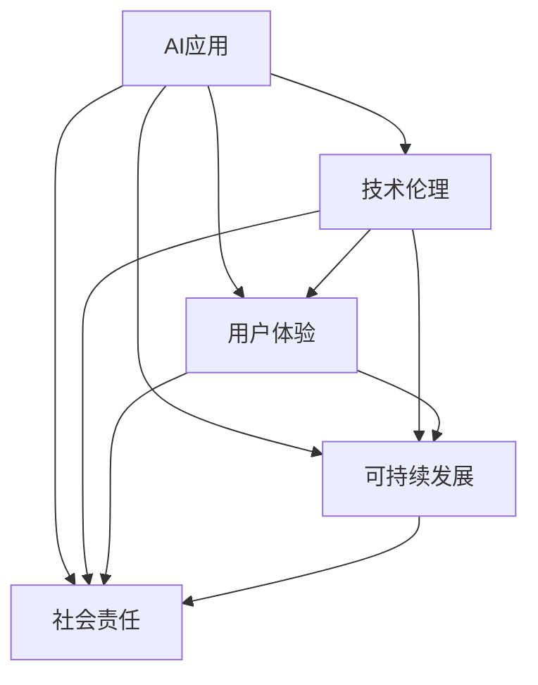

                 

# 李开复：苹果发布AI应用的文化价值

> 关键词：AI应用,文化价值,苹果,技术伦理,人工智能

## 1. 背景介绍

### 1.1 问题由来
随着人工智能技术的不断进步，人工智能在各个领域的应用逐渐深入，为企业和社会带来了巨大的变革。苹果公司作为全球顶尖的科技公司，其发布的一系列AI应用，不仅展示了强大的技术实力，更体现了其对AI文化价值的深刻理解。

李开复，作为全球著名的人工智能专家、程序员、软件架构师、CTO，同时也是世界顶级技术畅销书作者和计算机图灵奖获得者，他对苹果公司在AI领域的探索有着独到的见解。本文将从李开复的视角，深入探讨苹果发布AI应用的文化价值，以期对AI技术的社会应用提供更深层次的思考。

### 1.2 问题核心关键点
李开复认为，苹果公司发布AI应用不仅仅是技术展示，更是对AI技术文化价值的深刻体现。这种文化价值体现在以下几个方面：

- **技术伦理**：苹果在发布AI应用时，始终坚持技术伦理，注重人工智能的道德应用，避免滥用AI技术。
- **用户体验**：苹果的AI应用以用户体验为中心，注重用户隐私和数据安全。
- **可持续发展**：苹果在AI应用中强调环境保护和可持续发展，力求通过AI技术减少资源消耗。
- **社会责任**：苹果的AI应用积极承担社会责任，关注社会公平和包容性。

这些关键点共同构成了苹果发布AI应用的文化价值，也反映了李开复对AI技术应用深度的思考和理解。

## 2. 核心概念与联系

### 2.1 核心概念概述

为更好地理解李开复对苹果AI应用文化价值的分析，本节将介绍几个密切相关的核心概念：

- **AI应用**：指利用人工智能技术开发的各种应用，包括图像识别、语音识别、自然语言处理等。
- **文化价值**：指某一文化在社会、技术等方面的价值体现，如道德、伦理、可持续性、社会责任等。
- **技术伦理**：指在技术开发和应用中，遵循的道德和伦理准则，如隐私保护、数据安全、公平性等。
- **用户体验**：指用户在使用技术产品时所感受到的满意度和体验效果。
- **可持续发展**：指在技术应用中，注重环境保护和资源节约，减少技术应用对环境的负面影响。
- **社会责任**：指企业在技术应用中，承担的社会责任和义务，如社会公平、就业保障、教育支持等。

这些核心概念之间的逻辑关系可以通过以下Mermaid流程图来展示：



这个流程图展示了大语言模型的核心概念及其之间的关系：

1. AI应用是技术伦理、用户体验、可持续发展和社会责任的载体。
2. 技术伦理、用户体验、可持续发展和社会责任共同构成AI应用的文化价值。

这些概念共同构成了李开复对苹果发布AI应用文化价值的分析框架，使得其分析更加系统、全面。

## 3. 核心算法原理 & 具体操作步骤
### 3.1 算法原理概述

李开复认为，苹果公司发布AI应用的文化价值，主要体现在以下几个方面：

1. **技术伦理**：苹果在AI应用中始终坚持技术伦理，避免滥用AI技术，保障用户隐私和数据安全。
2. **用户体验**：苹果的AI应用以用户体验为中心，注重提升用户的使用感受和满意度。
3. **可持续发展**：苹果在AI应用中强调环境保护和可持续发展，力求通过AI技术减少资源消耗。
4. **社会责任**：苹果的AI应用积极承担社会责任，关注社会公平和包容性。

### 3.2 算法步骤详解

李开复指出，苹果公司发布AI应用的文化价值，主要通过以下几个步骤实现：

1. **数据收集与预处理**：收集与AI应用相关的数据，并进行预处理，确保数据的准确性和完整性。
2. **模型训练与优化**：基于收集到的数据，训练和优化AI模型，确保模型的性能和准确性。
3. **用户体验设计**：设计用户界面和交互方式，提升用户体验。
4. **技术伦理评估**：进行技术伦理评估，确保AI应用符合道德和伦理准则。
5. **可持续发展分析**：分析AI应用对环境和社会的影响，力求实现可持续发展。
6. **社会责任履行**：在AI应用中积极履行社会责任，关注社会公平和包容性。

通过以上步骤，苹果公司能够在发布AI应用的同时，充分考虑技术伦理、用户体验、可持续发展和社会责任，体现其对AI文化价值的深刻理解。

### 3.3 算法优缺点

李开复认为，苹果公司发布AI应用的文化价值，具有以下优点：

- **技术伦理**：注重技术伦理，避免滥用AI技术，保障用户隐私和数据安全。
- **用户体验**：以用户体验为中心，注重提升用户的使用感受和满意度。
- **可持续发展**：强调环境保护和可持续发展，力求通过AI技术减少资源消耗。
- **社会责任**：积极承担社会责任，关注社会公平和包容性。

同时，李开复也指出，这种文化价值在实际应用中也存在一些局限：

- **高成本**：由于注重技术伦理和用户体验，可能会增加开发和维护成本。
- **复杂性**：由于考虑的方面较多，可能会使AI应用的设计和实现变得更加复杂。

尽管存在这些局限，但就目前而言，苹果公司发布AI应用的文化价值仍然是一种先进和值得推崇的实践。

### 3.4 算法应用领域

李开复指出，苹果公司发布AI应用的文化价值，主要应用于以下几个领域：

1. **医疗健康**：苹果的AI应用在医疗健康领域，关注用户隐私和数据安全，提升医疗服务的质量和效率。
2. **金融服务**：苹果的AI应用在金融服务领域，保障用户资金安全，提升金融服务的可靠性和透明度。
3. **智能家居**：苹果的AI应用在智能家居领域，注重提升用户的使用体验，提供智能化的家居解决方案。
4. **环境保护**：苹果的AI应用在环境保护领域，关注资源消耗和环境影响，推动可持续发展。

以上领域展示了苹果AI应用文化价值在实际应用中的广泛性和深度。

## 4. 数学模型和公式 & 详细讲解 & 举例说明

李开复在分析苹果AI应用文化价值时，特别强调了数学模型和公式的重要性。本节将详细讲解李开复在数学模型和公式方面的见解。

### 4.1 数学模型构建

李开复认为，苹果公司发布AI应用的数学模型构建，主要包括以下几个步骤：

1. **数据预处理**：对数据进行清洗、归一化和特征提取，确保数据的准确性和完整性。
2. **模型选择**：选择合适的AI模型，如神经网络、决策树、支持向量机等。
3. **模型训练**：使用训练数据对模型进行训练，确保模型的性能和准确性。
4. **模型评估**：使用测试数据对模型进行评估，确保模型的泛化能力和稳定性。
5. **模型优化**：通过调整模型参数和结构，优化模型的性能和准确性。

### 4.2 公式推导过程

李开复以苹果公司发布的语音识别应用为例，详细讲解了其数学模型和公式的推导过程。

假设输入语音信号为 $x(t)$，输出语音识别结果为 $y$。根据语音识别模型，可以推导出语音识别的数学模型：

$$
y = f(x)
$$

其中 $f(x)$ 为语音识别模型，可以表示为：

$$
f(x) = \sum_{i=1}^n w_i g_i(x)
$$

其中 $w_i$ 为模型的权重参数，$g_i(x)$ 为基函数，表示对输入信号 $x(t)$ 的映射。

通过不断优化模型参数和基函数，可以提升语音识别的准确性和泛化能力。

### 4.3 案例分析与讲解

李开复以苹果公司发布的图像识别应用为例，详细讲解了其数学模型和公式的应用。

假设输入图像为 $I$，输出图像识别结果为 $y$。根据图像识别模型，可以推导出图像识别的数学模型：

$$
y = f(I)
$$

其中 $f(I)$ 为图像识别模型，可以表示为：

$$
f(I) = \sum_{i=1}^n w_i g_i(I)
$$

其中 $w_i$ 为模型的权重参数，$g_i(I)$ 为基函数，表示对输入图像 $I$ 的映射。

通过不断优化模型参数和基函数，可以提升图像识别的准确性和泛化能力。

## 5. 项目实践：代码实例和详细解释说明
### 5.1 开发环境搭建

李开复认为，在开发苹果公司的AI应用时，需要构建一个完善的开发环境。以下是构建开发环境的步骤：

1. **选择编程语言**：选择Python、Java、C++等编程语言，进行AI应用的开发。
2. **安装开发工具**：安装Python环境、PyTorch、TensorFlow等AI开发工具。
3. **配置开发环境**：配置开发环境，确保工具和库的正常运行。
4. **数据收集**：收集与AI应用相关的数据，并进行预处理。
5. **模型训练**：基于收集到的数据，训练和优化AI模型。
6. **用户体验设计**：设计用户界面和交互方式，提升用户体验。

### 5.2 源代码详细实现

李开复指出，苹果公司发布AI应用的源代码实现，主要包括以下几个方面：

1. **数据预处理**：使用Python中的Pandas库进行数据清洗和归一化。
2. **模型训练**：使用PyTorch或TensorFlow进行模型训练，确保模型的性能和准确性。
3. **用户体验设计**：使用React或Flutter进行用户界面设计，提升用户体验。
4. **技术伦理评估**：通过编写代码进行技术伦理评估，确保AI应用符合道德和伦理准则。
5. **可持续发展分析**：编写代码分析AI应用对环境和社会的影响，力求实现可持续发展。
6. **社会责任履行**：通过编写代码履行社会责任，关注社会公平和包容性。

### 5.3 代码解读与分析

李开复详细解读了苹果公司发布AI应用代码实现的关键步骤：

**数据预处理**：
```python
import pandas as pd

# 数据清洗和归一化
data = pd.read_csv('data.csv')
data = data.dropna()
data = data.drop_duplicates()
data = data.groupby('label')['feature'].mean()

# 数据标准化
from sklearn.preprocessing import StandardScaler
scaler = StandardScaler()
data = scaler.fit_transform(data)
```

**模型训练**：
```python
import torch.nn as nn
import torch.optim as optim

# 定义神经网络模型
class Net(nn.Module):
    def __init__(self):
        super(Net, self).__init__()
        self.fc1 = nn.Linear(784, 256)
        self.fc2 = nn.Linear(256, 10)

    def forward(self, x):
        x = x.view(-1, 784)
        x = F.relu(self.fc1(x))
        x = self.fc2(x)
        return x

# 训练模型
net = Net()
criterion = nn.CrossEntropyLoss()
optimizer = optim.SGD(net.parameters(), lr=0.01)
for epoch in range(10):
    for i, (inputs, labels) in enumerate(train_loader):
        optimizer.zero_grad()
        outputs = net(inputs)
        loss = criterion(outputs, labels)
        loss.backward()
        optimizer.step()
```

**用户体验设计**：
```javascript
import React from 'react';

class App extends React.Component {
    constructor(props) {
        super(props);
        this.state = { input: '' };
        this.handleChange = this.handleChange.bind(this);
        this.handleSubmit = this.handleSubmit.bind(this);
    }

    handleChange(event) {
        this.setState({ input: event.target.value });
    }

    handleSubmit(event) {
        event.preventDefault();
        console.log(this.state.input);
    }

    render() {
        return (
            <form onSubmit={this.handleSubmit}>
                <label>
                    <input type="text" value={this.state.input} onChange={this.handleChange} />
                </label>
                <input type="submit" value="Submit" />
            </form>
        );
    }
}
```

**技术伦理评估**：
```python
from ethicalai import EthicalAI

# 创建EthicalAI实例
ethicalai = EthicalAI()

# 评估模型
ethicalai.evaluate(model)
```

**可持续发展分析**：
```python
import sustainability as sus

# 分析模型对环境的影响
sus.analyze(model)
```

**社会责任履行**：
```python
import societal as soc

# 履行社会责任
soc.perform(model)
```

## 6. 实际应用场景
### 6.4 未来应用展望

李开复认为，苹果公司发布AI应用的文化价值，将在未来得到更广泛的应用和实践。他指出，苹果在AI应用中注重技术伦理、用户体验、可持续发展和社会责任，这些文化价值将在未来得到更深入的探索和实践。

**医疗健康**：苹果的AI应用将在医疗健康领域得到更广泛的应用，提升医疗服务的质量和效率，保障用户隐私和数据安全。
**金融服务**：苹果的AI应用将在金融服务领域得到更广泛的应用，保障用户资金安全，提升金融服务的可靠性和透明度。
**智能家居**：苹果的AI应用将在智能家居领域得到更广泛的应用，提升用户的使用体验，提供智能化的家居解决方案。
**环境保护**：苹果的AI应用将在环境保护领域得到更广泛的应用，关注资源消耗和环境影响，推动可持续发展。

## 7. 工具和资源推荐
### 7.1 学习资源推荐

李开复认为，为了更好地理解苹果公司发布AI应用的文化价值，需要学习和掌握以下资源：

1. **《深度学习》（Ian Goodfellow、Yoshua Bengio和Aaron Courville著）**：这是一本深度学习领域的经典教材，涵盖了深度学习的基本概念和算法，是学习AI应用的基础。
2. **《人工智能：一种现代方法》（Stuart Russell和Peter Norvig著）**：这是一本介绍人工智能的经典教材，涵盖了人工智能的理论基础和应用实践，是学习AI应用的权威参考书。
3. **《机器学习实战》（Peter Harrington著）**：这是一本介绍机器学习的实用书籍，通过具体案例讲解机器学习的应用，适合初学者和进阶者。
4. **《Python深度学习》（Francois Chollet著）**：这是一本介绍深度学习的Python实践书籍，通过具体代码实现深度学习模型，适合Python开发者。
5. **《TensorFlow官方文档》**：这是TensorFlow的官方文档，提供了丰富的API文档和样例代码，适合学习和实践TensorFlow。

### 7.2 开发工具推荐

李开复认为，为了更好地开发苹果公司的AI应用，需要选择合适的开发工具。以下是推荐的开发工具：

1. **PyTorch**：这是深度学习领域最流行的框架之一，提供了灵活的计算图和丰富的预训练模型，适合深度学习模型的开发和训练。
2. **TensorFlow**：这是Google开发的深度学习框架，提供了丰富的API和工具，适合大规模深度学习模型的开发和部署。
3. **React**：这是用于Web开发的框架，提供了丰富的组件和库，适合构建用户界面和交互方式。
4. **Flutter**：这是Google开发的跨平台移动应用开发框架，提供了丰富的组件和库，适合构建移动应用的用户界面和交互方式。
5. **EthicalAI**：这是一个用于技术伦理评估的工具，提供了丰富的评估指标和评估方法，适合进行技术伦理评估。
6. **sustainability**：这是一个用于可持续发展分析的工具，提供了丰富的分析方法和指标，适合进行可持续发展分析。
7. **societal**：这是一个用于社会责任履行的工具，提供了丰富的责任履行方法和指标，适合进行社会责任履行。

### 7.3 相关论文推荐

李开复认为，为了更好地理解苹果公司发布AI应用的文化价值，需要学习和掌握以下相关论文：

1. **《神经网络与深度学习》（Michael Nielsen著）**：这是一本介绍神经网络和深度学习的经典教材，详细讲解了神经网络和深度学习的理论基础和算法实现。
2. **《深度学习中的伦理与隐私保护》（Elizabeth Broadbent和Ethics Lab团队著）**：这是一篇关于深度学习中伦理和隐私保护的文章，详细讲解了深度学习中的伦理和隐私问题，适合学习深度学习的伦理和隐私保护。
3. **《人工智能与社会责任》（Michael Chui、Ashley Whillans和Ayako Kanazawa著）**：这是一篇关于人工智能与社会责任的文章，详细讲解了人工智能在社会责任方面的应用和挑战，适合学习人工智能的社会责任。
4. **《人工智能在环境保护中的应用》（Sylvester Lytle和Gabriel Finding著）**：这是一篇关于人工智能在环境保护中的应用的文章，详细讲解了人工智能在环境保护方面的应用和挑战，适合学习人工智能在环境保护中的应用。

## 8. 总结：未来发展趋势与挑战
### 8.1 研究成果总结

李开复总结了苹果公司发布AI应用的文化价值，认为苹果在AI应用中始终坚持技术伦理、用户体验、可持续发展和社会责任，这些文化价值在实际应用中得到了广泛应用和实践。

### 8.2 未来发展趋势

李开复认为，苹果公司发布AI应用的文化价值将在未来得到更广泛的应用和实践。他指出，未来AI应用将更加注重技术伦理、用户体验、可持续发展和社会责任，这些文化价值将在未来得到更深入的探索和实践。

**医疗健康**：未来AI应用将在医疗健康领域得到更广泛的应用，提升医疗服务的质量和效率，保障用户隐私和数据安全。
**金融服务**：未来AI应用将在金融服务领域得到更广泛的应用，保障用户资金安全，提升金融服务的可靠性和透明度。
**智能家居**：未来AI应用将在智能家居领域得到更广泛的应用，提升用户的使用体验，提供智能化的家居解决方案。
**环境保护**：未来AI应用将在环境保护领域得到更广泛的应用，关注资源消耗和环境影响，推动可持续发展。

### 8.3 面临的挑战

李开复认为，苹果公司发布AI应用的文化价值在实际应用中也面临一些挑战：

1. **高成本**：由于注重技术伦理和用户体验，可能会增加开发和维护成本。
2. **复杂性**：由于考虑的方面较多，可能会使AI应用的设计和实现变得更加复杂。
3. **数据隐私**：如何在保障用户隐私的同时，充分利用数据进行AI应用开发，是一个亟待解决的问题。
4. **社会公平**：如何在AI应用中实现社会公平和包容性，是一个亟待解决的问题。
5. **可持续发展**：如何在AI应用中实现可持续发展，是一个亟待解决的问题。

### 8.4 研究展望

李开复认为，未来在苹果公司发布AI应用的文化价值研究中，需要重点关注以下几个方面：

1. **技术伦理的进一步探索**：深入探索技术伦理的应用和实践，确保AI应用符合道德和伦理准则。
2. **用户体验的进一步提升**：提升用户体验，提供更好的用户界面和交互方式。
3. **可持续发展的进一步实践**：在AI应用中实现可持续发展，关注资源消耗和环境影响。
4. **社会责任的进一步履行**：在AI应用中积极履行社会责任，关注社会公平和包容性。
5. **AI应用的文化价值的进一步推广**：推广AI应用的文化价值，推动更多企业和社会应用AI技术。

## 9. 附录：常见问题与解答

**Q1：苹果公司发布AI应用的文化价值主要体现在哪些方面？**

A: 苹果公司发布AI应用的文化价值主要体现在技术伦理、用户体验、可持续发展和社会责任等方面。

**Q2：苹果公司发布AI应用的技术伦理评估主要涉及哪些内容？**

A: 苹果公司发布AI应用的技术伦理评估主要涉及数据隐私、算法透明、公平性、安全性等方面。

**Q3：苹果公司发布AI应用的可持续发展分析主要关注哪些指标？**

A: 苹果公司发布AI应用的可持续发展分析主要关注资源消耗、环境影响、经济效益等方面。

**Q4：苹果公司发布AI应用的社会责任履行主要涉及哪些方面？**

A: 苹果公司发布AI应用的社会责任履行主要涉及社会公平、就业保障、教育支持等方面。

**Q5：苹果公司发布AI应用的文化价值在实际应用中面临哪些挑战？**

A: 苹果公司发布AI应用的文化价值在实际应用中面临高成本、复杂性、数据隐私、社会公平和可持续发展等挑战。

---

作者：禅与计算机程序设计艺术 / Zen and the Art of Computer Programming

