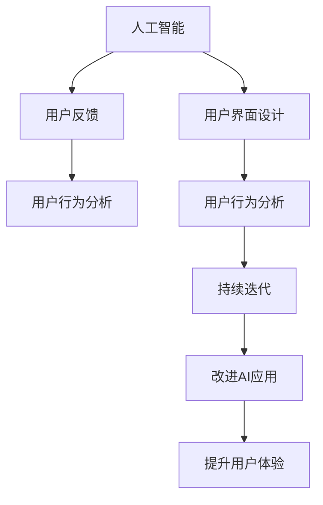

                 

# 李开复：苹果发布AI应用的用户

## 1. 背景介绍

### 1.1 问题由来
在过去几年中，人工智能（AI）技术的发展和普及引发了全球范围内的广泛关注。AI在医疗、教育、金融、娱乐等多个领域的应用取得了显著进展，对人类生活产生了深远影响。然而，随着AI应用的广泛推广，用户的使用体验和接受度也成为了一个亟待解决的问题。如何确保AI应用能够被大众接受并有效利用，成为了研究者和从业者必须面对的重要课题。

### 1.2 问题核心关键点
AI应用的普及，特别是在消费电子领域的应用，需要通过用户的有效使用来发挥其最大价值。然而，AI应用的用户体验和接受度往往受多种因素影响，如技术复杂性、操作界面、用户反馈等。如何设计用户友好的AI应用，提升用户满意度，成为推动AI技术进一步发展的重要因素。

## 2. 核心概念与联系

### 2.1 核心概念概述
为了更好地理解AI应用的用户体验和接受度，需要掌握以下几个核心概念：

- **人工智能（AI）**：通过模拟人类的思维、学习、推理等能力，使计算机系统能够自主进行复杂任务处理的技术。
- **用户界面（UI）设计**：包括图形用户界面（GUI）和用户交互流程设计，旨在提升用户操作体验和满意度。
- **用户反馈（User Feedback）**：用户对AI应用的使用体验和效果进行评价，对改进和优化AI应用具有重要指导意义。
- **用户行为分析（User Behavior Analysis）**：通过分析用户在使用AI应用时的行为模式，评估AI应用的实际效果和用户满意度。
- **持续迭代（Continuous Iteration）**：根据用户反馈和行为分析结果，不断改进和优化AI应用，提高用户接受度和满意度。

这些概念之间存在密切联系，共同构成了AI应用用户体验和接受度的关键要素。通过理解这些概念，可以更好地设计和优化AI应用，提升用户的使用体验。

### 2.2 核心概念原理和架构的 Mermaid 流程图(Mermaid 流程节点中不要有括号、逗号等特殊字符)



## 3. 核心算法原理 & 具体操作步骤

### 3.1 算法原理概述
基于用户反馈和行为分析的AI应用优化，是一个循环迭代的过程。其核心算法原理可以概括为以下几个步骤：

1. **数据收集**：通过AI应用的使用记录和用户反馈数据，收集用户行为和满意度信息。
2. **数据分析**：利用机器学习和数据挖掘技术，分析用户行为模式和反馈数据，识别改进点。
3. **模型优化**：根据分析结果，调整AI应用的功能、界面和操作流程，优化用户体验。
4. **用户测试**：将优化后的AI应用提供给一部分用户测试，收集新的反馈数据。
5. **循环迭代**：根据测试反馈，继续优化AI应用，直至达到理想的用户体验。

### 3.2 算法步骤详解
以苹果公司发布的AI应用为例，其优化过程大致分为以下几个步骤：

1. **数据收集**：苹果通过设备的传感器、应用使用记录和用户反馈数据，收集大量用户行为和满意度信息。
2. **数据分析**：苹果利用机器学习模型，分析用户行为模式和反馈数据，识别用户在使用AI应用时遇到的主要问题。
3. **模型优化**：苹果根据分析结果，对AI应用的功能、界面和操作流程进行优化，提升用户体验。
4. **用户测试**：苹果将优化后的AI应用提供给一小部分用户测试，收集新的反馈数据。
5. **循环迭代**：根据测试反馈，苹果继续优化AI应用，直至达到理想的用户体验。

### 3.3 算法优缺点
基于用户反馈和行为分析的AI应用优化方法具有以下优点：

- **数据驱动**：通过用户行为和反馈数据，进行数据驱动的优化，确保改进措施符合用户需求。
- **迭代优化**：通过不断迭代优化，逐步提升AI应用的用户体验和满意度。
- **灵活性高**：可以针对不同的用户群体和应用场景，灵活调整优化策略。

然而，该方法也存在一些缺点：

- **数据收集成本高**：收集和分析大量用户数据，需要较高的成本和技术投入。
- **隐私问题**：大量用户数据的收集和使用，可能引发隐私保护问题。
- **用户隐私保护**：在优化过程中，需要确保用户数据的匿名化和隐私保护。

### 3.4 算法应用领域
基于用户反馈和行为分析的AI应用优化方法，在多个领域都有广泛应用，包括但不限于：

- **智能家居**：优化智能音箱、智能灯光等AI应用的交互体验，提升用户满意度。
- **智能交通**：优化智能导航、智能停车等AI应用的功能和界面，提升用户出行体验。
- **智能医疗**：优化智能健康监测、智能诊断等AI应用的用户体验，提升医疗服务质量。
- **智能金融**：优化智能理财、智能客服等AI应用的用户体验，提升金融服务效率。

## 4. 数学模型和公式 & 详细讲解 & 举例说明

### 4.1 数学模型构建
设用户反馈数据集为 $D = \{(x_i, y_i)\}_{i=1}^N$，其中 $x_i$ 表示用户行为数据，$y_i$ 表示用户对AI应用的满意度评分。设AI应用的优化模型为 $f$，则目标为最小化预测误差 $\epsilon$：

$$
\min_{f} \sum_{i=1}^N \epsilon(f(x_i), y_i)
$$

其中 $\epsilon$ 为损失函数，如均方误差、交叉熵等。

### 4.2 公式推导过程
以均方误差（Mean Squared Error, MSE）为例，推导优化模型的损失函数。设用户满意度评分为 $y_i$，模型预测评分为 $\hat{y}_i$，则MSE损失函数为：

$$
L(y_i, \hat{y}_i) = \frac{1}{N} \sum_{i=1}^N (y_i - \hat{y}_i)^2
$$

对模型参数 $f$ 求导，得到：

$$
\frac{\partial L}{\partial f} = -\frac{2}{N} \sum_{i=1}^N (y_i - \hat{y}_i) \frac{\partial \hat{y}_i}{\partial f}
$$

### 4.3 案例分析与讲解
以苹果发布的智能助手Siri为例，其优化过程如下：

1. **数据收集**：通过设备的麦克风输入和用户语音指令，收集大量语音交互数据。
2. **数据分析**：利用自然语言处理（NLP）技术，分析用户语音指令和Siri的回复，识别用户对Siri回复的满意度。
3. **模型优化**：根据分析结果，优化Siri的语音识别和自然语言生成模型，提升响应速度和准确性。
4. **用户测试**：将优化后的Siri提供给一小部分用户测试，收集新的反馈数据。
5. **循环迭代**：根据测试反馈，继续优化Siri，直至达到理想的用户体验。

## 5. 项目实践：代码实例和详细解释说明

### 5.1 开发环境搭建
在进行AI应用优化实践前，需要先搭建开发环境。以下是使用Python进行TensorFlow开发的示例环境配置：

1. 安装Anaconda：从官网下载并安装Anaconda，用于创建独立的Python环境。
2. 创建并激活虚拟环境：
```bash
conda create -n tf-env python=3.8 
conda activate tf-env
```

3. 安装TensorFlow：根据CUDA版本，从官网获取对应的安装命令。例如：
```bash
conda install tensorflow -c tf -c conda-forge
```

4. 安装TensorBoard：
```bash
pip install tensorboard
```

5. 安装各类工具包：
```bash
pip install numpy pandas scikit-learn matplotlib tqdm jupyter notebook ipython
```

完成上述步骤后，即可在`tf-env`环境中开始AI应用优化的实践。

### 5.2 源代码详细实现
以下是一个简单的AI应用优化的代码实现示例：

```python
import tensorflow as tf
from tensorflow.keras import layers
from tensorflow.keras import models
import pandas as pd
import numpy as np

# 数据预处理
data = pd.read_csv('user_feedback.csv')
X = data[['user_behavior']]
y = data['satisfaction_score']

X_train, X_test = X[:800], X[800:]
y_train, y_test = y[:800], y[800:]

# 构建优化模型
model = models.Sequential([
    layers.Dense(64, activation='relu', input_shape=(X_train.shape[1],)),
    layers.Dense(64, activation='relu'),
    layers.Dense(1, activation='linear')
])

# 编译模型
model.compile(optimizer=tf.keras.optimizers.Adam(learning_rate=0.001),
              loss='mse')

# 训练模型
history = model.fit(X_train, y_train, epochs=10, batch_size=32, validation_data=(X_test, y_test))

# 模型评估
test_loss, test_acc = model.evaluate(X_test, y_test)
print('Test accuracy:', test_acc)
```

### 5.3 代码解读与分析
这段代码使用了TensorFlow框架，对用户反馈数据进行模型训练和优化。具体步骤如下：

1. **数据预处理**：使用Pandas库读取用户反馈数据，将用户行为数据作为输入，满意度评分作为输出。
2. **模型构建**：使用Keras构建一个简单的神经网络模型，包含两个全连接层和一个线性输出层。
3. **模型编译**：使用Adam优化器，设置学习率为0.001，损失函数为均方误差。
4. **模型训练**：使用训练集数据对模型进行10个epoch的训练，每个epoch的batch_size为32。
5. **模型评估**：使用测试集数据对模型进行评估，输出测试集的准确率。

### 5.4 运行结果展示
训练过程中，可以使用TensorBoard工具实时监控模型的训练状态和损失曲线。训练结束后，可以通过测试集数据评估模型的效果。

## 6. 实际应用场景

### 6.1 智能家居

智能家居系统通过AI应用优化，可以提升用户的居住体验。例如，智能音箱通过用户对音乐播放的反馈，优化推荐算法，推荐用户喜欢的音乐。智能灯光根据用户的日常行为模式，自动调整照明亮度和色温，满足用户的舒适度需求。

### 6.2 智能交通

智能交通系统通过AI应用优化，可以提升用户的出行体验。例如，智能导航系统根据用户的出行习惯和实时交通情况，优化路径规划和推荐。智能停车系统根据用户的停车习惯，自动调整停车位和收费策略。

### 6.3 智能医疗

智能医疗系统通过AI应用优化，可以提升用户的医疗体验。例如，智能健康监测设备根据用户的健康数据，优化监测算法，及时发现健康问题。智能诊断系统根据用户的病历数据，优化诊断模型，提高诊断准确性。

### 6.4 智能金融

智能金融系统通过AI应用优化，可以提升用户的金融服务体验。例如，智能理财系统根据用户的投资行为和偏好，优化理财策略，推荐合适的投资产品。智能客服系统根据用户的咨询历史，优化回答模板，提升客户服务质量。

## 7. 工具和资源推荐

### 7.1 学习资源推荐

为了帮助开发者系统掌握AI应用优化的理论基础和实践技巧，这里推荐一些优质的学习资源：

1. **《深度学习》**：Ian Goodfellow等人著，系统介绍了深度学习的原理和应用，适合入门学习。
2. **Coursera《深度学习专项课程》**：由深度学习领域的专家讲授，涵盖深度学习的多个方面，包括TensorFlow和Keras的使用。
3. **Google AI Blog**：Google AI团队发布的技术博客，涵盖了深度学习、机器学习、AI应用优化等多个领域的内容。
4. **GitHub上的TensorFlow示例代码**：包含丰富的TensorFlow应用示例，适合动手实践。
5. **Kaggle竞赛**：Kaggle上的数据科学竞赛，提供大量真实世界的数据集和优化挑战，有助于实践学习。

通过对这些资源的学习实践，相信你一定能够快速掌握AI应用优化的精髓，并用于解决实际的优化问题。

### 7.2 开发工具推荐

高效的开发离不开优秀的工具支持。以下是几款用于AI应用优化的常用工具：

1. **TensorFlow**：由Google主导开发的开源深度学习框架，生产部署方便，适合大规模工程应用。
2. **PyTorch**：基于Python的开源深度学习框架，灵活动态，适合研究性开发。
3. **Keras**：高层API，基于TensorFlow和Theano，易于上手，适合快速原型开发。
4. **TensorBoard**：TensorFlow配套的可视化工具，可实时监测模型训练状态，提供丰富的图表呈现方式。
5. **Jupyter Notebook**：互动式的编程环境，适合数据探索和模型调试。

合理利用这些工具，可以显著提升AI应用优化的开发效率，加快创新迭代的步伐。

### 7.3 相关论文推荐

AI应用优化的研究源于学界的持续研究。以下是几篇奠基性的相关论文，推荐阅读：

1. **《深度学习》**：Ian Goodfellow等人著，系统介绍了深度学习的原理和应用，适合入门学习。
2. **《机器学习》**：Tom Mitchell著，介绍了机器学习的基本概念和方法。
3. **《强化学习》**：Richard S. Sutton和Andrew G. Barto著，介绍了强化学习的基本概念和方法。

这些论文代表了大模型微调技术的发展脉络。通过学习这些前沿成果，可以帮助研究者把握学科前进方向，激发更多的创新灵感。

## 8. 总结：未来发展趋势与挑战

### 8.1 总结

本文对基于用户反馈和行为分析的AI应用优化方法进行了全面系统的介绍。首先阐述了AI应用优化在提升用户体验和接受度方面的重要性，明确了优化方法在数据驱动、迭代优化和灵活性高方面的独特价值。其次，从原理到实践，详细讲解了优化模型的构建、训练和评估过程，给出了AI应用优化的完整代码实例。同时，本文还广泛探讨了AI应用优化在智能家居、智能交通、智能医疗、智能金融等多个行业领域的应用前景，展示了优化方法的广阔潜力。此外，本文精选了优化技术的各类学习资源，力求为读者提供全方位的技术指引。

通过本文的系统梳理，可以看到，基于用户反馈和行为分析的AI应用优化方法正在成为AI技术应用的重要范式，极大地提升了AI应用的性能和用户体验。未来，伴随AI技术的不断发展，优化方法也将不断进步，为构建更加智能、便捷、高效的人类生活和工作环境提供有力支持。

### 8.2 未来发展趋势

展望未来，AI应用优化技术将呈现以下几个发展趋势：

1. **自动化优化**：利用自动化工具和机器学习算法，自动进行模型优化，减少人工干预。
2. **实时优化**：通过实时收集用户反馈和行为数据，动态调整AI应用功能，提升用户体验。
3. **个性化优化**：根据不同用户群体的需求和偏好，进行个性化优化，提升用户满意度。
4. **多模态优化**：结合图像、语音、文本等多种模态数据，进行综合优化，提升AI应用的多样性和适应性。
5. **跨领域优化**：将AI应用优化技术应用于不同领域，如医疗、金融、教育等，提升领域内AI应用的效果。

这些趋势凸显了AI应用优化技术的广泛前景。这些方向的探索发展，必将进一步提升AI应用的用户体验和接受度，推动AI技术在更多领域的应用。

### 8.3 面临的挑战

尽管AI应用优化技术已经取得了显著进展，但在迈向更加智能化、普适化应用的过程中，它仍面临着诸多挑战：

1. **数据隐私保护**：用户数据的收集和使用，可能引发隐私保护问题，需要建立严格的数据保护机制。
2. **模型鲁棒性**：AI应用面对不同用户群体时，模型泛化性能可能不佳，需要改进模型鲁棒性。
3. **模型可解释性**：AI应用的内部工作机制和决策逻辑需要具备可解释性，以便用户理解和信任。
4. **多模态融合**：多模态数据的整合和融合，需要新的技术和算法支持。
5. **跨领域适应**：AI应用在不同领域的应用，需要综合考虑领域特性和用户需求。

正视优化面临的这些挑战，积极应对并寻求突破，将是大模型微调技术走向成熟的必由之路。相信随着学界和产业界的共同努力，这些挑战终将一一被克服，AI应用优化必将在构建安全、可靠、可解释、可控的智能系统中扮演越来越重要的角色。

### 8.4 研究展望

未来的研究需要在以下几个方面寻求新的突破：

1. **自动化优化算法**：开发自动化的AI应用优化算法，降低人工干预，提升优化效率。
2. **多模态融合技术**：研究多模态数据的融合和分析方法，提升AI应用的多样性和适应性。
3. **可解释性增强**：开发具有可解释性的AI应用优化模型，增强用户对模型的理解和信任。
4. **隐私保护机制**：研究数据隐私保护技术，确保用户数据的安全和隐私。
5. **跨领域优化策略**：研究跨领域优化的策略和方法，提升AI应用在各领域的性能和效果。

这些研究方向的探索，必将引领AI应用优化技术迈向更高的台阶，为构建安全、可靠、可解释、可控的智能系统提供有力支持。面向未来，AI应用优化技术还需要与其他人工智能技术进行更深入的融合，如知识表示、因果推理、强化学习等，多路径协同发力，共同推动AI技术的发展和应用。

## 9. 附录：常见问题与解答

**Q1：AI应用优化是否适用于所有NLP任务？**

A: AI应用优化在大多数NLP任务上都能取得不错的效果，特别是对于数据量较小的任务。但对于一些特定领域的任务，如医学、法律等，仅仅依靠通用语料预训练的模型可能难以很好地适应。此时需要在特定领域语料上进一步预训练，再进行优化，才能获得理想效果。此外，对于一些需要时效性、个性化很强的任务，如对话、推荐等，优化方法也需要针对性的改进优化。

**Q2：优化过程中如何选择合适的学习率？**

A: 优化过程中的学习率一般需要根据具体的任务和数据集进行调整。一般来说，初始学习率可以从0.001开始，逐步减小至0.0001。同时，可以采用学习率衰减策略，如学习率衰减指数为0.1，每epoch减少10%的学习率。这样可以保证优化过程的稳定性，避免过拟合。

**Q3：AI应用优化时会面临哪些资源瓶颈？**

A: AI应用优化需要收集和分析大量的用户数据，这需要较高的成本和技术投入。同时，模型训练和推理过程中的资源消耗也是一大挑战，如内存、计算资源等。因此，需要采用一些资源优化技术，如模型压缩、稀疏化存储等，以提高优化效率和资源利用率。

**Q4：优化模型在落地部署时需要注意哪些问题？**

A: 将优化模型转化为实际应用，还需要考虑以下因素：

1. **模型裁剪**：去除不必要的层和参数，减小模型尺寸，加快推理速度。
2. **量化加速**：将浮点模型转为定点模型，压缩存储空间，提高计算效率。
3. **服务化封装**：将模型封装为标准化服务接口，便于集成调用。
4. **弹性伸缩**：根据请求流量动态调整资源配置，平衡服务质量和成本。
5. **监控告警**：实时采集系统指标，设置异常告警阈值，确保服务稳定性。
6. **安全防护**：采用访问鉴权、数据脱敏等措施，保障数据和模型安全。

**Q5：优化模型在实时应用中的挑战有哪些？**

A: 优化模型在实时应用中可能面临以下挑战：

1. **延迟问题**：模型的推理速度可能较慢，需要优化算法和数据结构以提高实时性。
2. **资源限制**：模型的计算资源和存储资源可能有限，需要优化模型和数据处理。
3. **多用户并发**：模型需要支持多用户并发访问，需要考虑并发控制和资源分配。
4. **数据多样性**：用户数据可能具有多样性，需要模型具备较好的泛化能力。
5. **系统可靠性**：模型的实时应用需要高可靠性和稳定性，需要建立完善的监控和容错机制。

---

作者：禅与计算机程序设计艺术 / Zen and the Art of Computer Programming

