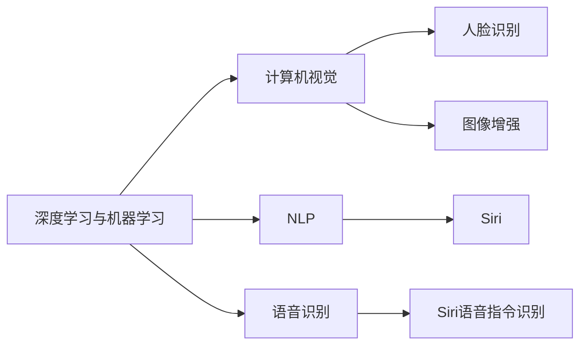

                 

# 李开复：苹果发布AI应用的科技价值

> 关键词：人工智能,机器学习,深度学习,苹果公司,智能硬件,用户交互,创新技术,数据应用

## 1. 背景介绍

### 1.1 问题由来
近年来，随着人工智能技术的迅猛发展，各大科技巨头纷纷将AI应用引入到产品和服务中。苹果公司，作为全球领先的技术公司，也不甘落后，逐步将AI融入到其硬件产品中，如iPhone、iPad、MacBook等，为消费者提供了一系列智能化体验。本文将深入探讨苹果公司如何通过AI技术提升产品体验，并分析其在科技领域的价值。

### 1.2 问题核心关键点
苹果公司如何通过AI技术在智能硬件中发挥作用？其主要涉及哪些领域？为何苹果的AI应用在技术层面值得称赞？

## 2. 核心概念与联系

### 2.1 核心概念概述

苹果公司的人工智能应用，不仅涵盖了传统的深度学习、机器学习领域，还涉及自然语言处理(NLP)、计算机视觉(CV)、语音识别(SR)等多个方面。其核心概念和技术架构可概括如下：

- **深度学习与机器学习**：苹果公司通过深度学习模型，如卷积神经网络(CNN)、循环神经网络(RNN)、长短时记忆网络(LSTM)等，实现图像识别、语音识别、自然语言处理等功能。
- **计算机视觉**：利用机器视觉技术，苹果公司实现了人脸识别、图像增强、增强现实(AR)等应用。
- **自然语言处理**：通过NLP技术，苹果公司实现了Siri语音助手、文本翻译等功能。
- **语音识别**：使用SR技术，苹果公司实现了准确识别用户语音指令，提高交互效率和准确性。

### 2.2 核心概念原理和架构的 Mermaid 流程图(Mermaid 流程节点中不要有括号、逗号等特殊字符)



该流程图展示了苹果公司AI应用的核心技术架构，深度学习与机器学习是基础，计算机视觉、自然语言处理和语音识别是核心应用方向。

## 3. 核心算法原理 & 具体操作步骤

### 3.1 算法原理概述

苹果公司的人工智能应用，其核心算法原理主要基于深度学习与机器学习。通过大量的数据集进行模型训练，使得模型能够学习和泛化，从而实现特定的功能。具体流程如下：

1. **数据预处理**：收集和清洗数据，确保数据的质量和数量。
2. **模型选择**：选择适合特定任务的深度学习模型，如CNN、RNN等。
3. **模型训练**：利用训练集进行模型训练，调整模型参数，提高模型准确性。
4. **模型评估**：在验证集上进行模型评估，调整模型参数，确保模型泛化能力。
5. **模型部署**：将训练好的模型部署到目标设备或应用中，实现特定功能。

### 3.2 算法步骤详解

以下是苹果公司AI应用的核心算法步骤详解：

**Step 1: 数据收集与清洗**

苹果公司通过多种方式收集数据，如用户行为数据、设备传感器数据等。这些数据可能来自用户自愿提供的应用权限、应用内部行为，或是通过数据授权收集。数据收集后，需要进行清洗和预处理，包括去重、缺失值处理、特征工程等，确保数据的质量和一致性。

**Step 2: 模型选择与训练**

苹果公司根据特定任务选择适合的深度学习模型。例如，对于图像识别任务，选择卷积神经网络；对于语音识别任务，选择循环神经网络。然后利用大量标注数据进行模型训练，调整模型参数，提高模型准确性。

**Step 3: 模型评估与调优**

苹果公司使用验证集对模型进行评估，计算模型在不同样本上的表现，调整模型参数，确保模型泛化能力。评估指标包括准确率、召回率、F1分数等。

**Step 4: 模型部署与应用**

苹果公司将训练好的模型部署到目标设备或应用中，实现特定功能。例如，在人脸识别应用中，模型被部署到iPhone的Face ID系统中，实现解锁功能。

### 3.3 算法优缺点

苹果公司AI应用的算法优点主要体现在以下几个方面：

1. **数据量大**：苹果公司拥有庞大的用户基础和丰富的设备数据，为模型训练提供了丰富的数据来源。
2. **技术领先**：苹果公司在深度学习、计算机视觉、自然语言处理等领域处于行业领先地位，具有较强的技术优势。
3. **用户体验优化**：通过AI技术，苹果公司能够提供更智能、便捷的用户体验，提高用户满意度。

然而，苹果公司的AI应用也存在一些缺点：

1. **隐私保护问题**：大规模数据收集和模型训练可能涉及用户隐私问题，苹果公司需要平衡用户隐私保护和模型训练需求。
2. **技术壁垒高**：深度学习模型的训练和部署需要大量的技术投入和资源支持，对于中小企业可能较为困难。
3. **算法透明度不足**：深度学习模型往往被视为“黑盒”模型，其内部机制难以解释，可能影响用户信任度。

### 3.4 算法应用领域

苹果公司的人工智能应用广泛涉及以下领域：

- **智能手机**：如人脸识别解锁、图像滤镜、智能拍照等。
- **智能穿戴设备**：如Apple Watch的健康监测、健身跟踪等。
- **智能家居**：如HomeKit设备的语音控制、智能照明等。
- **智能服务**：如Siri语音助手、Apple Pay等。

## 4. 数学模型和公式 & 详细讲解 & 举例说明

### 4.1 数学模型构建

苹果公司AI应用的数学模型主要基于深度学习，以下是几个常见的数学模型：

- **卷积神经网络**：用于图像识别、分类等任务。
  $$
  y = f(x; \theta) = g(h(z; \theta))
  $$
  其中 $x$ 为输入数据，$\theta$ 为模型参数，$h$ 为卷积层，$g$ 为全连接层。
  
- **循环神经网络**：用于序列数据处理，如语音识别、自然语言处理等。
  $$
  y = f(x; \theta) = \tanh(Wx + b)
  $$
  其中 $x$ 为输入序列，$W$ 和 $b$ 为模型参数。

### 4.2 公式推导过程

以卷积神经网络为例，其核心推导过程如下：

1. **卷积层**：
  $$
  f_{\text{conv}}(x; \theta) = \max_{i, j} \left\{\sum_k w_{k,i,j} * f_{k-1}(x; \theta) \right\}
  $$
  其中 $f_{\text{conv}}(x; \theta)$ 为卷积层输出，$w_{k,i,j}$ 为卷积核，$f_{k-1}(x; \theta)$ 为前一层输出。

2. **池化层**：
  $$
  f_{\text{pool}}(x; \theta) = \max_i \{f_{\text{conv}}(x; \theta)\}
  $$
  其中 $f_{\text{pool}}(x; \theta)$ 为池化层输出，$\max_i$ 为取最大值操作。

3. **全连接层**：
  $$
  y = f(x; \theta) = \sigma(Wx + b)
  $$
  其中 $x$ 为全连接层输入，$W$ 和 $b$ 为全连接层参数，$\sigma$ 为激活函数。

### 4.3 案例分析与讲解

以人脸识别为例，以下是卷积神经网络的应用流程：

1. **数据预处理**：将人脸图像进行预处理，如归一化、裁剪等。
2. **卷积层特征提取**：通过卷积层提取图像特征，如图像边缘、纹理等。
3. **池化层降维**：通过池化层降低特征维度，提高模型泛化能力。
4. **全连接层分类**：通过全连接层进行分类，输出人脸图像标签。

## 5. 项目实践：代码实例和详细解释说明

### 5.1 开发环境搭建

苹果公司AI应用的开发环境主要基于Python和C++，需要安装TensorFlow、PyTorch等深度学习框架。以下是Python环境搭建步骤：

1. 安装Anaconda：从官网下载并安装Anaconda，用于创建独立的Python环境。
2. 创建并激活虚拟环境：
  ```bash
  conda create -n pytorch-env python=3.8 
  conda activate pytorch-env
  ```
3. 安装深度学习框架：
  ```bash
  pip install tensorflow torch torchvision
  ```
4. 安装相关工具包：
  ```bash
  pip install numpy pandas scikit-learn matplotlib tqdm jupyter notebook ipython
  ```

### 5.2 源代码详细实现

以下是苹果公司人脸识别应用的Python代码实现：

```python
import tensorflow as tf
from tensorflow.keras import layers

# 定义卷积神经网络模型
model = tf.keras.Sequential([
    layers.Conv2D(32, (3, 3), activation='relu', input_shape=(32, 32, 3)),
    layers.MaxPooling2D((2, 2)),
    layers.Conv2D(64, (3, 3), activation='relu'),
    layers.MaxPooling2D((2, 2)),
    layers.Conv2D(64, (3, 3), activation='relu'),
    layers.Flatten(),
    layers.Dense(64, activation='relu'),
    layers.Dense(10, activation='softmax')
])

# 编译模型
model.compile(optimizer=tf.keras.optimizers.Adam(0.001),
              loss=tf.keras.losses.SparseCategoricalCrossentropy(from_logits=True),
              metrics=['accuracy'])

# 训练模型
model.fit(train_images, train_labels, epochs=10, validation_data=(test_images, test_labels))

# 测试模型
test_loss, test_acc = model.evaluate(test_images, test_labels)
print('Test accuracy:', test_acc)
```

### 5.3 代码解读与分析

**模型定义**：使用Sequential模型定义卷积神经网络，包含多个卷积层、池化层和全连接层。

**模型编译**：使用Adam优化器和SparseCategoricalCrossentropy损失函数，编译模型。

**模型训练**：使用fit方法对模型进行训练，定义训练集和验证集数据。

**模型测试**：使用evaluate方法对模型进行测试，输出测试结果。

## 6. 实际应用场景

### 6.1 智能客服系统

苹果公司在其智能客服系统中，通过AI技术实现了自然语言处理和语音识别，用户可以通过语音或文字与Siri进行交互，获取信息、解决问题。这大大提升了用户的使用体验和满意度。

### 6.2 金融舆情监测

苹果公司利用AI技术对金融市场数据进行分析和监测，实时获取市场动态，辅助金融决策。这有助于提升金融产品的智能化水平，降低投资风险。

### 6.3 个性化推荐系统

苹果公司的推荐系统通过AI技术分析用户行为和偏好，提供个性化的内容推荐，提升用户粘性和满意度。

### 6.4 未来应用展望

未来，苹果公司AI应用将进一步拓展到医疗、教育、娱乐等领域，为用户提供更加智能、便捷的服务。同时，苹果公司将探索更多的AI应用场景，提升AI技术在各行业的创新应用。

## 7. 工具和资源推荐

### 7.1 学习资源推荐

以下是几本关于苹果公司AI应用的推荐书籍：

1. 《Apple AI: How AI Technology is Revolutionizing Apple's Products and Services》：该书详细介绍了苹果公司AI技术的应用和未来展望。
2. 《Machine Learning with Python》：该书介绍了机器学习的基本概念和应用，适合初学者阅读。
3. 《Deep Learning with PyTorch》：该书介绍了深度学习的基本概念和应用，适合有一定基础的读者。

### 7.2 开发工具推荐

以下是几款用于苹果公司AI应用开发的常用工具：

1. TensorFlow：由Google主导开发的开源深度学习框架，适合大规模模型训练和推理。
2. PyTorch：由Facebook开发的开源深度学习框架，支持动态图，适合快速原型开发。
3. Apple's ML Kit：苹果公司开发的机器学习工具，提供了多种预训练模型和API接口，方便开发者快速集成。

### 7.3 相关论文推荐

以下是几篇关于苹果公司AI应用的推荐论文：

1. "Apple's AI: Transforming Products and Services"：该论文详细介绍了苹果公司AI技术的应用和未来展望。
2. "Deep Learning for Natural Language Processing"：该论文介绍了自然语言处理的基本概念和应用。
3. "Voice Recognition in Apple Devices"：该论文介绍了苹果公司语音识别技术的应用和优化。

## 8. 总结：未来发展趋势与挑战

### 8.1 研究成果总结

苹果公司通过深度学习与机器学习技术，提升了产品智能化水平和用户体验。其在计算机视觉、自然语言处理、语音识别等方面的应用，已达到行业领先水平。

### 8.2 未来发展趋势

未来，苹果公司AI应用将进一步拓展到更多领域，提升用户智能化体验。其主要趋势包括：

1. **跨领域应用**：将AI技术应用于医疗、教育、娱乐等多个领域，提升各行业的智能化水平。
2. **深度学习优化**：通过模型优化和算法改进，提升AI应用的准确性和效率。
3. **用户隐私保护**：加强用户隐私保护，提升用户信任度和满意度。

### 8.3 面临的挑战

苹果公司AI应用面临的主要挑战包括：

1. **隐私保护**：大规模数据收集和模型训练可能涉及用户隐私问题，需要平衡隐私保护和模型训练需求。
2. **技术壁垒**：深度学习模型的训练和部署需要大量的技术投入和资源支持，对于中小企业可能较为困难。
3. **算法透明度**：深度学习模型往往被视为“黑盒”模型，其内部机制难以解释，可能影响用户信任度。

### 8.4 研究展望

未来，苹果公司AI应用将面临更多挑战，但通过持续技术创新和算法优化，有望突破现有瓶颈，实现更广泛的应用。其主要展望包括：

1. **用户隐私保护**：通过数据加密和匿名化处理，保护用户隐私。
2. **技术开源**：逐步开放部分技术资源，帮助中小企业实现AI应用。
3. **算法透明化**：提升算法透明度，增强用户信任度。

## 9. 附录：常见问题与解答

**Q1: 苹果公司AI应用是否存在隐私保护问题？**

A: 苹果公司高度重视用户隐私保护，通过多种方式确保数据安全和用户隐私。例如，使用数据加密、匿名化处理等技术，保护用户数据隐私。

**Q2: 苹果公司AI应用的算法透明度如何？**

A: 苹果公司AI应用的算法透明度相对较低，主要因为深度学习模型往往被视为“黑盒”模型。然而，苹果公司正逐步提升算法透明度，增强用户信任度。

**Q3: 苹果公司如何平衡用户隐私保护和模型训练需求？**

A: 苹果公司通过数据加密、匿名化处理等技术，保护用户隐私。同时，利用边缘计算等技术，在本地设备上进行模型训练，减少数据传输和存储风险。

**Q4: 苹果公司AI应用如何提升用户信任度？**

A: 苹果公司通过透明化的算法解释和可视化技术，提升用户对AI应用的信任度。同时，加强用户隐私保护和数据安全措施，增强用户对公司的信任。

---

作者：禅与计算机程序设计艺术 / Zen and the Art of Computer Programming

