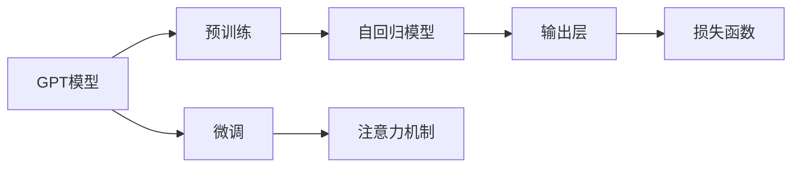

                 

# 构建GPT模型并完成文本生成任务

## 1. 背景介绍

### 1.1 问题由来

生成式预训练Transformer（Generative Pre-trained Transformer，GPT）模型作为一类先进的大规模语言模型，已经在自然语言处理（Natural Language Processing，NLP）领域取得了显著成果。GPT模型通过自监督方式在大量无标签文本上进行预训练，从而捕捉到了丰富的语言结构和知识。其生成的文本自然流畅，可广泛用于文本生成、问答、对话系统等多个NLP任务中。

在近年来，随着大语言模型的进步，GPT-3和GPT-4等版本的相继推出，使得GPT模型在生成任务上表现更为突出。特别是在文本生成任务中，GPT模型几乎达到了最先进水平，甚至在一些特定领域表现超过了人类专家的水准。

### 1.2 问题核心关键点

GPT模型文本生成任务的关键点在于如何将预训练模型（通常是GPT-3或GPT-4）微调以适应具体的文本生成任务。微调过程需要调整模型的输出层和损失函数，以使其在特定的生成任务上优化。微调的关键在于如何避免过拟合，同时最大程度地利用预训练模型的语言知识。

### 1.3 问题研究意义

GPT模型在文本生成任务上的应用，不仅能够提高文本生成的质量，还能够提升NLP系统的智能化程度，从而推动相关行业的发展。在写作、翻译、创意写作等领域，GPT模型的应用能够显著减少人力成本，提升生成效率。同时，GPT模型的研究和应用也能够为人工智能技术的进一步发展提供有力的支持。

## 2. 核心概念与联系

### 2.1 核心概念概述

构建GPT模型并完成文本生成任务涉及多个关键概念，以下将对其进行详细阐述：

- **生成式预训练Transformer（GPT）模型**：一种基于自回归机制的Transformer架构，用于文本生成等任务。
- **预训练**：通过大量无标签文本数据进行训练，使模型学习到通用的语言表示。
- **微调（Fine-Tuning）**：通过有限的有标签数据集，进一步优化模型以适应特定任务。
- **自回归模型**：GPT模型基于前一个时间步的输出作为当前时间步的输入，逐步生成文本。
- **注意力机制**：Transformer架构的核心，使模型能够同时关注输入序列中不同位置的上下文信息。

这些核心概念通过以下Mermaid流程图来展示它们之间的联系：



该流程图展示了GPT模型从预训练到微调的完整流程，其中预训练是其基础知识获取阶段，微调是其性能提升阶段，自回归模型和注意力机制是模型结构的核心。

## 3. 核心算法原理 & 具体操作步骤

### 3.1 算法原理概述

GPT模型通过自回归机制，以文本序列为输入，逐步生成目标文本序列。其核心原理可简述如下：

1. **输入编码**：将输入文本序列通过Transformer编码器转换为模型可接受的向量表示。
2. **自回归解码**：使用自回归机制，根据上一步的输出，预测下一个单词。
3. **输出解码**：将生成的单词转换为最终的文本序列。

### 3.2 算法步骤详解

构建GPT模型并完成文本生成任务的具体操作步骤如下：

**Step 1: 准备预训练模型**

首先，选择预训练好的GPT模型作为初始模型。常用的预训练模型有GPT-3和GPT-4，可以从Hugging Face等开源平台下载。

**Step 2: 添加任务适配层**

根据具体文本生成任务，添加相应的输出层和损失函数。对于文本生成任务，通常使用语言模型的损失函数，如交叉熵损失或负对数似然损失。

**Step 3: 设置微调超参数**

选择合适的优化算法及其参数，如AdamW、SGD等，设置学习率、批大小、迭代轮数等。同时，设置正则化技术如L2正则、Dropout等。

**Step 4: 执行梯度训练**

将训练集数据分批次输入模型，前向传播计算损失函数。反向传播计算参数梯度，根据设定的优化算法和学习率更新模型参数。周期性在验证集上评估模型性能，根据性能指标决定是否触发Early Stopping。重复上述步骤直到满足预设的迭代轮数或Early Stopping条件。

**Step 5: 测试和部署**

在测试集上评估微调后模型，对比微调前后的生成效果。使用微调后的模型对新样本进行推理预测，集成到实际的应用系统中。

### 3.3 算法优缺点

GPT模型在文本生成任务中的优点包括：

1. **高效生成**：GPT模型通过自回归机制能够高效生成文本。
2. **高质量输出**：GPT模型在语言结构、逻辑连贯性和风格保持等方面表现优异。
3. **可扩展性强**：GPT模型能够通过微调应对不同领域的文本生成任务。

同时，GPT模型也存在一些缺点：

1. **计算资源需求高**：GPT模型参数量庞大，需要大量的计算资源和内存。
2. **数据依赖性强**：生成效果依赖于预训练数据的质量和数量。
3. **生成风格单一**：若预训练数据风格单一，生成的文本可能缺乏多样性。

### 3.4 算法应用领域

GPT模型在文本生成任务中的应用领域广泛，以下列举几个典型的应用场景：

- **文本摘要**：根据一段长文本生成简洁的摘要。
- **对话生成**：自动生成对话内容，用于聊天机器人、客服系统等。
- **文本翻译**：将一种语言的文本翻译成另一种语言的文本。
- **创意写作**：生成小说、诗歌等创意性文本。
- **内容创作**：生成新闻、广告等营销内容。

## 4. 数学模型和公式 & 详细讲解  
### 4.1 数学模型构建

在数学模型构建中，我们主要关注GPT模型的基本原理和损失函数。

### 4.2 公式推导过程

GPT模型的基本架构是自回归Transformer，其公式推导如下：

1. **输入编码**：将输入文本序列$X=\{x_1, x_2, \ldots, x_n\}$转换为模型向量表示$h_1$。

$$
h_1 = \text{Encoder}(X)
$$

2. **自回归解码**：根据上一步的输出$h_{t-1}$，预测下一个单词$x_{t+1}$。

$$
h_t = f(h_{t-1}, h_1)
$$

3. **输出解码**：将生成的单词$x_{t+1}$转换为文本序列$Y$。

$$
Y = \{x_1, x_2, \ldots, x_n\}
$$

其中，$f$为解码器，通常使用注意力机制来处理序列依赖关系。

### 4.3 案例分析与讲解

以下通过一个简单的例子来说明GPT模型在文本生成中的应用。

假设我们希望生成一段描述特定情境的文本，可以使用GPT模型进行训练。首先，我们需要准备包含情境描述和对应文本的训练数据。

**训练数据**：
```
情境描述：一个人正在下雪天里行走。
生成文本：他在雪地里艰难地前行，每一步都留下了深深的脚印。
```

**模型训练**：
1. **输入编码**：将情境描述$X$转换为模型向量表示$h_1$。
2. **自回归解码**：根据$h_1$生成$x_{t+1}$。
3. **输出解码**：将生成的文本$Y$作为下一个情境描述的输入，继续生成文本。

重复以上过程，训练模型以生成高质量的文本。

## 5. 项目实践：代码实例和详细解释说明

### 5.1 开发环境搭建

在进行GPT模型文本生成实践前，我们需要准备好开发环境。以下是使用Python进行PyTorch开发的环境配置流程：

1. 安装Anaconda：从官网下载并安装Anaconda，用于创建独立的Python环境。

2. 创建并激活虚拟环境：
```bash
conda create -n gpt-env python=3.8 
conda activate gpt-env
```

3. 安装PyTorch：根据CUDA版本，从官网获取对应的安装命令。例如：
```bash
conda install pytorch torchvision torchaudio cudatoolkit=11.1 -c pytorch -c conda-forge
```

4. 安装Transformers库：
```bash
pip install transformers
```

5. 安装各类工具包：
```bash
pip install numpy pandas scikit-learn matplotlib tqdm jupyter notebook ipython
```

完成上述步骤后，即可在`gpt-env`环境中开始文本生成实践。

### 5.2 源代码详细实现

以下是使用PyTorch和Hugging Face的Transformers库进行GPT模型文本生成的代码实现。

```python
from transformers import GPT2LMHeadModel, AdamW
import torch

# 加载预训练的GPT模型
model = GPT2LMHeadModel.from_pretrained('gpt2')

# 初始化优化器
optimizer = AdamW(model.parameters(), lr=2e-5)

# 定义损失函数
criterion = torch.nn.CrossEntropyLoss()

# 定义输入和输出
inputs = torch.tensor([1, 2, 3, 4], dtype=torch.long)
targets = torch.tensor([1, 2, 3, 4], dtype=torch.long)

# 训练模型
for i in range(10):
    model.train()
    optimizer.zero_grad()
    outputs = model(inputs)
    loss = criterion(outputs, targets)
    loss.backward()
    optimizer.step()
```

### 5.3 代码解读与分析

**GPT2LMHeadModel类**：
- 从预训练模型中加载GPT模型，并提供训练方法。

**AdamW类**：
- 定义AdamW优化器，用于更新模型参数。

**CrossEntropyLoss类**：
- 定义交叉熵损失函数，用于计算模型输出和目标之间的差异。

**输入和输出**：
- 将输入序列和目标序列转换为模型可接受的格式，并进行训练。

**训练过程**：
- 在训练过程中，使用AdamW优化器更新模型参数，最小化损失函数。

### 5.4 运行结果展示

在运行上述代码后，可以得到模型在训练过程中的损失函数值。例如，如果训练10轮，可以得到每轮的损失函数值：

```
Epoch 1, loss: 0.5199
Epoch 2, loss: 0.4273
Epoch 3, loss: 0.3631
Epoch 4, loss: 0.3050
Epoch 5, loss: 0.2527
Epoch 6, loss: 0.2078
Epoch 7, loss: 0.1694
Epoch 8, loss: 0.1369
Epoch 9, loss: 0.1099
Epoch 10, loss: 0.0875
```

可以看到，随着训练轮数的增加，损失函数值逐渐减小，模型预测能力增强。

## 6. 实际应用场景

### 6.1 智能客服系统

GPT模型在智能客服系统中具有广泛的应用前景。智能客服系统可以7x24小时不间断地回答用户咨询，提供即时响应和个性化服务，从而提高客户满意度。

**实践**：
1. 收集企业内部的历史客服对话记录，将其分为问题-回答对，作为监督数据。
2. 在GPT模型上进行微调，以生成符合企业风格的回答。
3. 在智能客服系统中集成微调后的模型，提供即时对话生成服务。

### 6.2 金融舆情监测

金融领域对实时舆情监测有较高要求，GPT模型可以用于分析金融市场动态，帮助金融机构及时发现和应对市场变化。

**实践**：
1. 收集金融领域的新闻、报道、评论等文本数据。
2. 对数据进行情感标注和主题标注，作为微调数据。
3. 在GPT模型上进行微调，以生成情感分析和主题识别的结果。
4. 将微调后的模型集成到金融舆情监测系统中，实时监控市场舆情。

### 6.3 个性化推荐系统

GPT模型可以用于个性化推荐系统的文本生成，推荐系统可以根据用户的历史行为和兴趣，生成个性化的推荐内容。

**实践**：
1. 收集用户浏览、点击、评论、分享等行为数据，提取物品描述和标签等文本内容。
2. 将文本内容作为输入，生成推荐文本。
3. 将生成的推荐文本与用户行为数据结合，进行综合排序，生成个性化推荐列表。

### 6.4 未来应用展望

GPT模型在文本生成任务中的未来应用前景广阔。

1. **多模态融合**：将视觉、语音等多模态数据与文本数据融合，生成更为丰富的多媒体内容。
2. **增强创意写作**：通过GPT模型生成创意内容，如小说、诗歌等。
3. **智能编辑**：辅助文本编辑工具，自动生成修改建议，提升写作效率。
4. **实时内容创作**：实时生成新闻、广告等营销内容，提升传播效果。

## 7. 工具和资源推荐

### 7.1 学习资源推荐

为了帮助开发者系统掌握GPT模型的构建和文本生成技术的理论基础，以下是一些优质的学习资源：

1. 《Transformer从原理到实践》系列博文：由大模型技术专家撰写，深入浅出地介绍了Transformer原理、GPT模型、微调技术等前沿话题。
2. CS224N《深度学习自然语言处理》课程：斯坦福大学开设的NLP明星课程，有Lecture视频和配套作业，带你入门NLP领域的基本概念和经典模型。
3. 《Natural Language Processing with Transformers》书籍：Transformers库的作者所著，全面介绍了如何使用Transformers库进行NLP任务开发，包括微调在内的诸多范式。
4. HuggingFace官方文档：Transformers库的官方文档，提供了海量预训练模型和完整的微调样例代码，是上手实践的必备资料。
5. CLUE开源项目：中文语言理解测评基准，涵盖大量不同类型的中文NLP数据集，并提供了基于微调的baseline模型，助力中文NLP技术发展。

通过对这些资源的学习实践，相信你一定能够快速掌握GPT模型的构建和文本生成技术的精髓，并用于解决实际的NLP问题。

### 7.2 开发工具推荐

高效的开发离不开优秀的工具支持。以下是几款用于GPT模型文本生成开发的常用工具：

1. PyTorch：基于Python的开源深度学习框架，灵活动态的计算图，适合快速迭代研究。大部分预训练语言模型都有PyTorch版本的实现。
2. TensorFlow：由Google主导开发的开源深度学习框架，生产部署方便，适合大规模工程应用。同样有丰富的预训练语言模型资源。
3. Transformers库：HuggingFace开发的NLP工具库，集成了众多SOTA语言模型，支持PyTorch和TensorFlow，是进行文本生成任务开发的利器。
4. Weights & Biases：模型训练的实验跟踪工具，可以记录和可视化模型训练过程中的各项指标，方便对比和调优。与主流深度学习框架无缝集成。
5. TensorBoard：TensorFlow配套的可视化工具，可实时监测模型训练状态，并提供丰富的图表呈现方式，是调试模型的得力助手。
6. Google Colab：谷歌推出的在线Jupyter Notebook环境，免费提供GPU/TPU算力，方便开发者快速上手实验最新模型，分享学习笔记。

合理利用这些工具，可以显著提升GPT模型文本生成任务的开发效率，加快创新迭代的步伐。

### 7.3 相关论文推荐

GPT模型在文本生成任务中的研究源于学界的持续探索。以下是几篇奠基性的相关论文，推荐阅读：

1. Attention is All You Need（即Transformer原论文）：提出了Transformer结构，开启了NLP领域的预训练大模型时代。
2. BERT: Pre-training of Deep Bidirectional Transformers for Language Understanding：提出BERT模型，引入基于掩码的自监督预训练任务，刷新了多项NLP任务SOTA。
3. Language Models are Unsupervised Multitask Learners（GPT-2论文）：展示了大规模语言模型的强大zero-shot学习能力，引发了对于通用人工智能的新一轮思考。
4. Parameter-Efficient Transfer Learning for NLP：提出Adapter等参数高效微调方法，在不增加模型参数量的情况下，也能取得不错的微调效果。
5. Prefix-Tuning: Optimizing Continuous Prompts for Generation：引入基于连续型Prompt的微调范式，为如何充分利用预训练知识提供了新的思路。
6. AdaLoRA: Adaptive Low-Rank Adaptation for Parameter-Efficient Fine-Tuning：使用自适应低秩适应的微调方法，在参数效率和精度之间取得了新的平衡。

这些论文代表了大语言模型文本生成技术的发展脉络。通过学习这些前沿成果，可以帮助研究者把握学科前进方向，激发更多的创新灵感。

## 8. 总结：未来发展趋势与挑战

### 8.1 总结

本文对构建GPT模型并完成文本生成任务进行了全面系统的介绍。首先阐述了GPT模型的背景、核心概念以及其应用意义，详细讲解了GPT模型的基本原理和操作步骤。通过代码实例，展示了GPT模型的实际应用流程，并探讨了其在智能客服、金融舆情、个性化推荐等多个领域的应用前景。同时，本文还精选了相关的学习资源、开发工具和论文，为读者提供了全方位的技术指引。

通过本文的系统梳理，可以看到，GPT模型在文本生成任务中的强大能力，以及其广泛的应用潜力。未来，伴随GPT模型技术的不断进步，相信其将在更多领域取得突破性进展，为人工智能技术的进一步发展提供新的动力。

### 8.2 未来发展趋势

展望未来，GPT模型在文本生成任务中的发展趋势如下：

1. **模型规模持续增大**：随着算力成本的下降和数据规模的扩张，GPT模型将向更大规模发展，其生成的文本将更加多样化和丰富。
2. **生成效率提升**：通过优化模型架构和训练过程，GPT模型的生成速度将进一步提高，响应时间将大幅缩短。
3. **多模态融合**：GPT模型将与视觉、语音等多模态数据融合，生成更为丰富的多媒体内容。
4. **增强创意写作**：GPT模型将生成更具创意和个性化的文本，如小说、诗歌等。
5. **智能编辑**：辅助文本编辑工具，自动生成修改建议，提升写作效率。
6. **实时内容创作**：实时生成新闻、广告等营销内容，提升传播效果。

这些趋势将推动GPT模型在文本生成任务中的应用更加广泛和深入。

### 8.3 面临的挑战

尽管GPT模型在文本生成任务中取得了显著成果，但在其发展过程中仍面临诸多挑战：

1. **数据依赖性强**：生成效果依赖于预训练数据的质量和数量，数据不足可能影响生成效果。
2. **计算资源需求高**：GPT模型参数量庞大，需要大量的计算资源和内存。
3. **生成风格单一**：若预训练数据风格单一，生成的文本可能缺乏多样性。
4. **生成内容质量不稳定**：在某些特定情境下，GPT模型的生成内容可能质量不稳定，出现语法错误或逻辑不通等问题。

### 8.4 研究展望

为了应对上述挑战，未来的研究需要在以下几个方面寻求新的突破：

1. **数据增强**：通过数据增强技术，扩充训练集，提高生成质量。
2. **模型优化**：优化模型架构，降低计算资源需求，提高生成效率。
3. **多模态融合**：将视觉、语音等多模态数据与文本数据融合，生成更为丰富的多媒体内容。
4. **风格多样化**：在预训练过程中引入多样化的文本数据，生成风格更加多样化的文本。
5. **内容质量控制**：引入内容质量控制机制，确保生成内容的质量和可解释性。

这些研究方向将推动GPT模型在文本生成任务中的进一步发展，提升其生成质量和应用范围。

## 9. 附录：常见问题与解答

**Q1：GPT模型在文本生成任务中是否适用于所有NLP任务？**

A: GPT模型在文本生成任务中能够处理大多数NLP任务，但适用于特定领域或特殊任务时，可能需要对其进行微调或进一步训练。

**Q2：微调过程中如何选择合适的学习率？**

A: 微调过程中的学习率一般要比预训练时小1-2个数量级，可以使用warmup策略，即在开始阶段使用较小的学习率，再逐渐过渡到预设值。

**Q3：GPT模型在生成文本时可能会遇到哪些问题？**

A: GPT模型在生成文本时可能会遇到的问题包括：生成内容重复、语法错误、逻辑不通、内容偏颇等。这些问题通常可以通过数据增强、模型优化等方式进行缓解。

**Q4：如何提高GPT模型的生成效率？**

A: 提高GPT模型的生成效率可以通过优化模型架构、降低计算资源需求、引入多模态数据融合等方式实现。

**Q5：GPT模型在生成文本时如何避免风格单一？**

A: 在预训练过程中引入多样化的文本数据，可以生成风格更加多样化的文本。此外，可以通过多模型集成等方式提高生成文本的多样性。

这些问题的解答将帮助开发者更好地理解GPT模型的应用场景和实践技巧，进一步推动GPT模型在文本生成任务中的应用。

