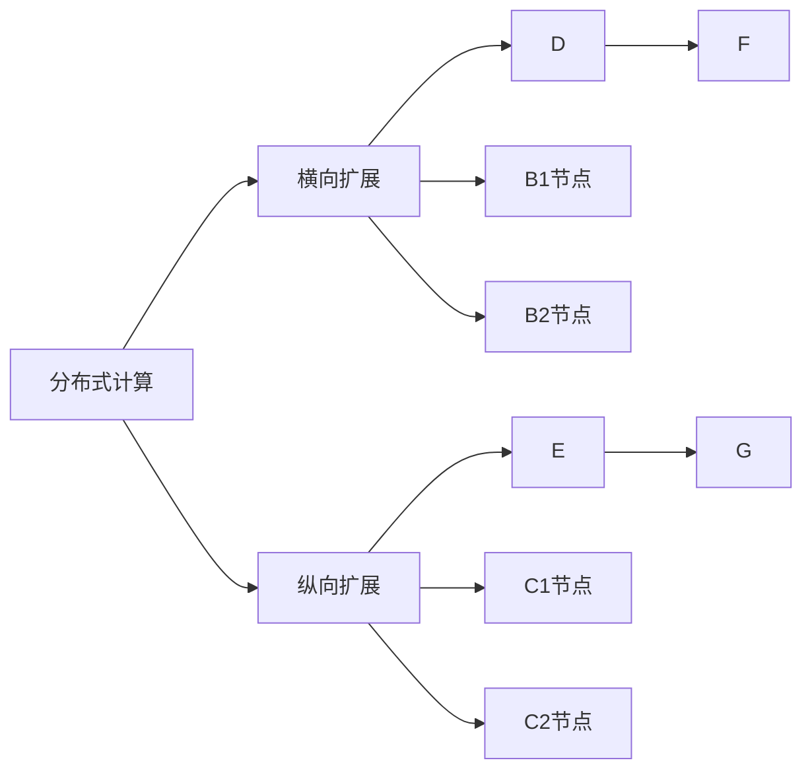

                 

# 横向扩展与纵向扩展的最佳实践

## 1. 背景介绍

在分布式计算的架构中，横向扩展（Scaling Out）和纵向扩展（Scaling Up）是两种常见的扩展方式。横向扩展指通过增加更多的服务器节点来分担工作量，而纵向扩展则指通过增加单个节点的计算能力来提高性能。这两种扩展方式各有优劣，适用于不同的场景。本文将详细介绍横向扩展与纵向扩展的原理、优缺点及应用领域，并探讨在实际应用中如何合理选择和配置扩展策略。

## 2. 核心概念与联系

### 2.1 核心概念概述

为了更清楚地理解横向扩展与纵向扩展的概念和原理，本节将首先介绍几个相关核心概念：

- 分布式计算（Distributed Computing）：指将一个任务分散到多台计算机上并行处理的技术，以提高计算效率和处理能力。
- 横向扩展（Scaling Out）：通过增加计算节点的数量来提高系统的吞吐量和处理能力，适用于负载均衡的、对响应时间要求高的场景。
- 纵向扩展（Scaling Up）：通过提高单个节点的计算能力，如增加CPU核心数、内存大小、磁盘容量等，来提升系统的性能，适用于需要处理大规模数据和复杂计算的场景。

横向扩展和纵向扩展是分布式计算中的两种基本扩展策略，它们在架构设计和性能优化中起着重要作用。它们之间的选择取决于具体的应用场景、业务需求和技术限制。

### 2.2 核心概念原理和架构的 Mermaid 流程图

以下是一个简化的 Mermaid 流程图，展示了横向扩展与纵向扩展的基本原理和架构：



在这个图中，我们首先从分布式计算（A）出发，探索两种扩展策略：横向扩展（B）和纵向扩展（C）。横向扩展（B）通过增加更多的节点（D和E）来分担工作量，而纵向扩展（C）则通过增加单个节点的能力（F和G）来提高性能。

## 3. 核心算法原理 & 具体操作步骤

### 3.1 算法原理概述

横向扩展和纵向扩展的算法原理主要涉及负载均衡和资源调度两个方面。

- 横向扩展：需要设计合理的负载均衡算法，将请求分配到多个节点上，以均衡处理负载。同时需要确保节点的网络带宽和存储资源充足，避免因瓶颈限制性能。
- 纵向扩展：需要增加单个节点的计算资源，提高系统的吞吐量和处理能力。纵向扩展通常涉及硬件升级和系统优化，如增加CPU核心数、内存大小等。

### 3.2 算法步骤详解

#### 横向扩展的算法步骤：

1. **节点添加与配置**：根据负载情况添加新的计算节点，并配置相应的网络、存储等资源。
2. **负载均衡**：设计负载均衡算法，如轮询、最少连接、哈希等，将请求分配到多个节点上。
3. **数据分片**：对数据进行分片，将数据分布在多个节点上，以避免单节点数据过载。
4. **任务调度**：根据负载情况，动态调整任务调度策略，确保资源充分利用。

#### 纵向扩展的算法步骤：

1. **资源升级**：根据业务需求，选择合适的硬件升级方案，如增加CPU核心数、内存大小等。
2. **系统优化**：优化应用程序的性能，如使用更高效的算法、减少资源占用等。
3. **资源管理**：引入资源管理工具，监控和调度资源，避免因资源争抢导致的性能下降。

### 3.3 算法优缺点

#### 横向扩展的优缺点：

**优点**：
- 适用于负载均衡的场景，能够快速扩展系统处理能力。
- 容错性好，一个节点的故障不会导致整个系统崩溃。

**缺点**：
- 需要大量初始投资用于购置和配置节点。
- 节点间通信和数据同步可能增加延迟和带宽消耗。

#### 纵向扩展的优缺点：

**优点**：
- 能够显著提高单个节点的性能，适用于处理大规模数据和复杂计算的场景。
- 成本相对较低，不需要大量的初始投资。

**缺点**：
- 扩展性受限于硬件资源，升级难度较大。
- 单个节点故障可能导致整个系统崩溃，容错性较差。

### 3.4 算法应用领域

横向扩展和纵向扩展在实际应用中各有其适用场景：

- 横向扩展适用于Web应用、流媒体服务、电子商务平台等需要处理大量并发请求的场景。
- 纵向扩展适用于大型数据仓库、科学计算、大数据分析等需要处理大规模数据和复杂计算的场景。

在实际应用中，通常会结合横向扩展和纵向扩展的方式，构建更为灵活、高效的分布式系统。

## 4. 数学模型和公式 & 详细讲解 & 举例说明

### 4.1 数学模型构建

为了更好地理解横向扩展和纵向扩展的数学模型，我们将使用数学语言对其进行描述。

设一个分布式系统包含 $N$ 个节点，每个节点的处理能力为 $C$。每个节点上的任务数为 $T_i$，节点的平均任务负载为 $L$。系统的总处理能力为 $C \times N$。

横向扩展可以通过增加节点数 $N$ 来实现，纵向扩展则通过增加每个节点的处理能力 $C$ 来实现。

### 4.2 公式推导过程

1. **横向扩展的公式推导**：

设增加节点数为 $X$，新的总处理能力为 $C \times (N+X)$，平均任务负载为 $L'$。根据负载均衡原则，增加节点后的平均任务负载与原始负载相等，即：

$$
L = \frac{T}{C \times N} = L' = \frac{T + X \times T_i}{C \times (N+X)}
$$

解得：

$$
T = C \times L \times N = C \times L' \times (N+X)
$$

即：

$$
N = \frac{T}{L} - X
$$

2. **纵向扩展的公式推导**：

设每个节点的处理能力增加为 $C'$，新的总处理能力为 $C' \times N$，平均任务负载为 $L'$。根据负载均衡原则，增加处理能力后的平均任务负载与原始负载相等，即：

$$
L = \frac{T}{C \times N} = L' = \frac{T}{C' \times N}
$$

解得：

$$
C = C'
$$

即：

$$
C' = \frac{T}{L \times N}
$$

### 4.3 案例分析与讲解

以一个典型的电子商务平台为例，该平台每日需处理数百万个订单，每个订单的处理时间约为1秒。

- 假设当前有100个节点，每个节点的处理能力为2核CPU、8GB内存，系统平均负载为1个订单/秒。
- 如果预计在未来三个月内订单量将增加50%，如何扩展系统以保持性能稳定？

**解决方案**：

1. **横向扩展**：
   - 增加100个节点，节点总数变为200个，每个节点的处理能力保持不变。
   - 新的平均负载为 $L' = \frac{1.5}{2 \times 200} = 0.375$ 个订单/秒。

2. **纵向扩展**：
   - 将每个节点的处理能力提升至4核CPU、16GB内存，处理能力提升为原来的2倍。
   - 新的平均负载为 $L' = \frac{1.5}{4 \times 100} = 0.375$ 个订单/秒。

两种方案都能在订单量增加50%的情况下保持系统性能稳定。然而，横向扩展需要的初始投资较大，且管理复杂；纵向扩展成本较低，但扩展性受限于硬件资源。

## 5. 项目实践：代码实例和详细解释说明

### 5.1 开发环境搭建

为了实践横向扩展和纵向扩展的算法，我们需要搭建一个分布式计算环境。

1. **选择分布式框架**：如Apache Hadoop、Apache Spark、Apache Flink等，根据业务需求选择合适的框架。
2. **安装分布式框架**：在每个节点上安装框架及其依赖，如安装Hadoop YARN、Spark、Flume等。
3. **配置网络**：确保所有节点之间能够正常通信，配置好网络地址和端口号。
4. **设置资源管理**：使用资源管理工具如YARN、Mesos等，监控和管理资源使用情况。

### 5.2 源代码详细实现

以Apache Spark为例，展示横向扩展和纵向扩展的代码实现。

#### 横向扩展的实现：

1. **添加节点**：
   ```python
   spark = SparkSession.builder.appName("ScaleOut") \
       .master("spark://master:7077") \
       .config("spark.executor.instances", "2") \
       .getOrCreate()
   ```

2. **任务调度**：
   ```python
   df = spark.read.format("csv").option("header", "true").load("data.csv")
   df.cache()
   df.mapPartitions(lambda partition: list(partition)).collect()
   ```

#### 纵向扩展的实现：

1. **资源升级**：
   ```python
   spark = SparkSession.builder.appName("ScaleUp") \
       .master("spark://master:7077") \
       .config("spark.executor.instances", "2") \
       .config("spark.executor.memory", "8g") \
       .config("spark.executor.cores", "4") \
       .getOrCreate()
   ```

2. **系统优化**：
   ```python
   df = spark.read.format("csv").option("header", "true").load("data.csv")
   df.cache()
   df.mapPartitions(lambda partition: list(partition)).collect()
   ```

### 5.3 代码解读与分析

以上代码展示了如何使用Spark实现横向扩展和纵向扩展。

- 横向扩展：通过设置`spark.executor.instances`参数，增加执行器的数量，即增加节点的数量。同时，使用`df.cache()`将数据缓存，避免重复计算。
- 纵向扩展：通过设置`spark.executor.memory`和`spark.executor.cores`参数，增加每个执行器的内存大小和CPU核心数。

需要注意的是，横向扩展和纵向扩展的实现方式因框架而异，但基本的原理和思路是相通的。

### 5.4 运行结果展示

运行以上代码，可以在分布式集群上观察到任务处理的进度和结果。

- 横向扩展：节点数量增加，任务处理时间缩短，系统吞吐量提高。
- 纵向扩展：每个节点处理能力增强，任务处理时间缩短，系统性能提升。

## 6. 实际应用场景

### 6.1 Web应用

Web应用如电商平台、社交媒体、新闻门户等，需要处理大量的并发请求，常常采用横向扩展。通过增加更多的服务器节点，可以分担负载，提高系统的吞吐量和响应时间。

### 6.2 大数据分析

大数据分析如Hadoop、Spark等系统，需要处理大规模数据集，常常采用纵向扩展。通过增加单个节点的计算能力，可以显著提升处理速度和计算精度。

### 6.3 流媒体服务

流媒体服务如视频点播、直播等，需要处理大量的实时数据流，常常采用横向扩展。通过增加多个节点，可以提高数据的并行处理能力，确保实时性和稳定性。

### 6.4 未来应用展望

未来，横向扩展和纵向扩展的应用场景将更加广泛，技术也将不断进步。例如：

- 边缘计算：在网络边缘部署计算节点，减少数据传输延迟，提高数据处理效率。
- 云原生架构：利用云平台的弹性扩展能力，实现自动化的资源管理和负载均衡。
- 混合云架构：结合公有云和私有云的优点，构建更为灵活、高效的分布式系统。

## 7. 工具和资源推荐

### 7.1 学习资源推荐

为了深入学习横向扩展和纵向扩展的理论和实践，推荐以下学习资源：

1. **《分布式系统：原理与设计》**：
   - 由清华大学郑泽豪教授编著，系统讲解分布式系统原理、架构和设计方法。
   - 全书分为7章，内容覆盖了分布式系统基础、负载均衡、故障恢复、一致性等。

2. **《大规模并行编程》**：
   - 由David H. White等著，讲解大规模并行编程技术和应用。
   - 全书分为6章，内容涵盖并行计算、MapReduce、Spark等。

3. **《高性能计算：系统与算法》**：
   - 由Ian Foster等著，讲解高性能计算的理论、技术和应用。
   - 全书分为11章，内容涵盖并行算法、分布式系统、云计算等。

### 7.2 开发工具推荐

为了实践横向扩展和纵向扩展，推荐以下开发工具：

1. **Apache Hadoop**：
   - 一个开源的分布式计算框架，适用于大规模数据处理。
   - 提供HDFS文件系统和MapReduce计算模型，支持数据本地化、容错等特性。

2. **Apache Spark**：
   - 一个开源的大数据处理框架，支持多种数据源和计算引擎。
   - 提供RDD和DataFrame两种API，支持高效的内存计算和分布式计算。

3. **Apache Flink**：
   - 一个开源的流处理框架，支持低延迟、高吞吐量的数据流处理。
   - 提供Streaming和Table两种API，支持高效的流计算和批处理。

### 7.3 相关论文推荐

为了深入理解横向扩展和纵向扩展的理论基础和实践方法，推荐以下相关论文：

1. **《分布式系统的挑战》**：
   - Paul W. Maritz, Andrew C. Akella, Joseph S. Fowler, Steve S. Johnson, Stephen C. Lawrence, Kim P. Maritz, John B. Netravali, Charles C. Wang, Bala Subrahmanyam. 论文探讨了分布式系统设计中的关键问题，包括容错性、一致性、负载均衡等。
   - 论文发表于IEEE Computer Society Press。

2. **《大规模并行计算》**：
   - Alex A. Shostak, Alan C. Y. Ho. 论文介绍了大规模并行计算的理论和应用，包括并行计算模型、算法和性能优化等。
   - 论文发表于IEEE Transactions on Parallel and Distributed Systems。

3. **《分布式存储系统》**：
   - Mike O. Thankachan, Peter Chou, Robert S. Tamassia. 论文探讨了分布式存储系统的设计和实现，包括数据分布、冗余、容错等。
   - 论文发表于IEEE Transactions on Dependable and Secure Computing。

## 8. 总结：未来发展趋势与挑战

### 8.1 研究成果总结

本文详细介绍了横向扩展和纵向扩展的原理、优缺点及应用领域，并通过数学模型和代码实例对其进行了分析和实现。通过对比分析，我们得出以下结论：

1. 横向扩展适用于处理大量并发请求的场景，能够快速扩展系统处理能力。
2. 纵向扩展适用于处理大规模数据和复杂计算的场景，能够显著提高单个节点的性能。
3. 横向扩展和纵向扩展在实际应用中需要结合使用，才能构建高效的分布式系统。

### 8.2 未来发展趋势

未来，横向扩展和纵向扩展技术将呈现以下几个发展趋势：

1. **云原生架构**：云平台提供了弹性扩展、自动化的资源管理能力，使得横向扩展和纵向扩展更加灵活和高效。
2. **边缘计算**：在网络边缘部署计算节点，减少数据传输延迟，提高数据处理效率。
3. **混合云架构**：结合公有云和私有云的优点，构建更为灵活、高效的分布式系统。
4. **自动化运维**：通过引入自动化运维工具，实现系统自动化的监控、调度和优化。

### 8.3 面临的挑战

尽管横向扩展和纵向扩展技术已经取得了显著进展，但在实际应用中仍面临诸多挑战：

1. **网络延迟和带宽**：横向扩展中，节点间的通信和数据同步可能增加延迟和带宽消耗，需要优化网络设计和负载均衡策略。
2. **资源管理**：纵向扩展中，资源争抢可能导致性能下降，需要引入资源管理工具和优化算法。
3. **系统复杂度**：分布式系统设计和管理复杂，需要跨学科的知识和技术支持。

### 8.4 研究展望

未来的研究需要在以下几个方面寻求新的突破：

1. **自动化运维**：引入自动化运维工具，实现系统自动化的监控、调度和优化。
2. **混合云架构**：结合公有云和私有云的优点，构建更为灵活、高效的分布式系统。
3. **边缘计算**：在网络边缘部署计算节点，减少数据传输延迟，提高数据处理效率。
4. **分布式数据库**：研究分布式数据库的设计和实现，提高数据存储和查询效率。

## 9. 附录：常见问题与解答

**Q1：横向扩展和纵向扩展有什么区别？**

A: 横向扩展通过增加计算节点的数量来分担工作量，适用于负载均衡的、对响应时间要求高的场景；纵向扩展通过提高单个节点的计算能力来提升性能，适用于处理大规模数据和复杂计算的场景。

**Q2：如何选择横向扩展和纵向扩展？**

A: 根据具体的应用场景和业务需求选择。如果业务需要处理大量并发请求，适合采用横向扩展；如果需要处理大规模数据和复杂计算，适合采用纵向扩展。

**Q3：横向扩展和纵向扩展的优缺点是什么？**

A: 横向扩展的优点在于能够快速扩展系统处理能力，适用于负载均衡的场景；缺点是需要大量的初始投资和复杂的管理。纵向扩展的优点在于能够显著提高单个节点的性能，适用于处理大规模数据和复杂计算的场景；缺点是扩展性受限于硬件资源，升级难度较大。

**Q4：横向扩展和纵向扩展的数学模型是什么？**

A: 横向扩展的数学模型为：$N = \frac{T}{L} - X$，其中 $N$ 为节点数，$T$ 为任务总数，$L$ 为平均任务负载，$X$ 为增加的节点数。纵向扩展的数学模型为：$C' = \frac{T}{L \times N}$，其中 $C'$ 为新的每个节点的处理能力，$N$ 为节点数，$T$ 为任务总数，$L$ 为平均任务负载。

**Q5：如何实现横向扩展和纵向扩展？**

A: 横向扩展可以通过增加执行器的数量来实现，使用分布式计算框架如Apache Hadoop、Apache Spark等。纵向扩展可以通过增加每个执行器的内存大小和CPU核心数来实现，使用分布式计算框架如Apache Hadoop、Apache Spark等。

---

作者：禅与计算机程序设计艺术 / Zen and the Art of Computer Programming

