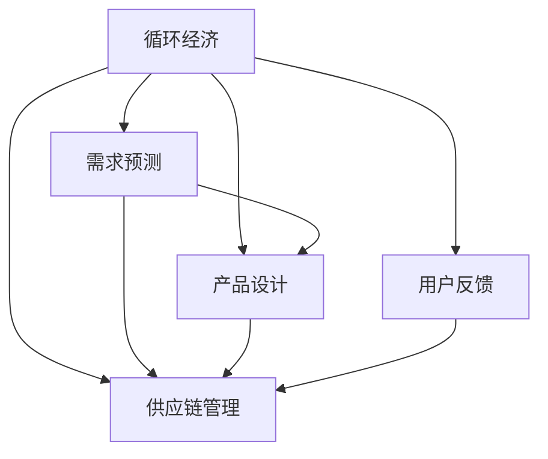

                 

# 欲望循环经济设计：AI优化的需求满足规划

> 关键词：循环经济, AI优化, 需求满足, 设计原则, 可持续设计

## 1. 背景介绍

### 1.1 问题由来
循环经济（Circular Economy）是一个以重新利用和循环使用为核心原则的经济模式。其目标是通过减少资源的消耗和废物的产生，实现经济、环境和社会的三重效益。近年来，随着全球环境的日益恶化，循环经济理念逐渐被更多企业和社会所接受。然而，循环经济的实际应用仍面临诸多挑战，例如需求预测的不准确性、产品设计的复杂性、供应链管理的不稳定性等。这些问题严重制约了循环经济的推广和应用。

人工智能（AI）作为推动现代经济发展的关键技术，通过数据驱动的方法，可以有效解决循环经济中的痛点问题。AI在数据分析、模式识别、决策支持等方面具有天然的优势，可以显著提升循环经济系统的效率和精度。因此，如何利用AI优化循环经济的需求满足，成为当前研究的热点问题。

### 1.2 问题核心关键点
本文聚焦于基于AI优化的循环经济需求满足规划，旨在通过数据分析和算法优化，解决循环经济系统中需求预测不准确、产品设计复杂等问题，实现资源的循环利用和高效管理。

循环经济中的需求满足通常涉及以下几个关键问题：

- **需求预测**：如何准确预测市场对循环产品的需求量，避免资源浪费和库存积压。
- **产品设计**：如何设计出满足市场需求、易于循环利用的产品，降低资源消耗和环境影响。
- **供应链管理**：如何协调供应链中的各个环节，实现资源的有效配置和利用。
- **用户反馈**：如何获取用户对循环产品的反馈信息，及时调整产品和服务策略。

本文将从以上几个方面出发，提出基于AI的循环经济需求满足规划方案，并进行详细阐述。

### 1.3 问题研究意义
循环经济是解决全球环境问题的关键途径之一。通过AI技术优化循环经济的需求满足，可以有效降低资源消耗、减少废物排放，促进可持续发展。本文的研究意义主要体现在以下几个方面：

1. **提高需求预测准确性**：通过AI技术，可以更准确地预测市场对循环产品的需求，避免资源浪费和库存积压，优化供应链管理。
2. **优化产品设计**：利用AI技术对市场需求进行深入分析，设计出更符合用户需求、易于循环利用的产品，提升产品竞争力。
3. **提高供应链效率**：通过AI技术优化供应链管理，实现资源的有效配置和利用，提升供应链整体效率。
4. **改善用户满意度**：利用AI技术获取用户反馈信息，及时调整产品和服务策略，提升用户满意度和品牌忠诚度。

总之，本文的研究有望为循环经济系统的可持续发展提供重要的技术支持和实际应用案例，为构建绿色、低碳、可持续的经济发展模式贡献力量。

## 2. 核心概念与联系

### 2.1 核心概念概述

为了更好地理解基于AI的循环经济需求满足规划，本节将介绍几个密切相关的核心概念：

- **循环经济**：以资源循环利用为核心原则的经济模式，通过减少资源的消耗和废物的产生，实现经济、环境和社会的三重效益。
- **需求预测**：通过数据分析和模型预测，预测市场对循环产品的需求量。
- **产品设计**：通过设计学、材料科学和AI技术，设计出符合市场需求、易于循环利用的产品。
- **供应链管理**：通过AI技术优化供应链中的各个环节，实现资源的有效配置和利用。
- **用户反馈**：通过数据分析和AI技术，获取用户对循环产品的反馈信息，优化产品和服务策略。

这些核心概念之间的逻辑关系可以通过以下Mermaid流程图来展示：



这个流程图展示了我们从循环经济到各个子任务的核心概念及其之间的联系。

## 3. 核心算法原理 & 具体操作步骤

### 3.1 算法原理概述

基于AI的循环经济需求满足规划，本质上是一个多目标优化问题。其核心思想是：通过数据驱动的方法，优化循环经济系统中的各个环节，提升整体效率和效益。

形式化地，假设循环经济系统的目标是最大化资源利用率、最小化废物产生和最大化用户满意度，则优化目标为：

$$
\maximize \left\{ R, C, S \right\}
$$

其中，$R$ 表示资源利用率，$C$ 表示废物产生量，$S$ 表示用户满意度。假设循环经济系统中的决策变量为 $x$，则优化问题可以表示为：

$$
\maximize \quad f(x) = \frac{R}{C + S}
$$

在实际应用中，通常将优化目标函数和约束条件进行离散化和线性化，然后使用优化算法求解最优解。常见的优化算法包括线性规划、整数规划、混合整数规划等。

### 3.2 算法步骤详解

基于AI的循环经济需求满足规划一般包括以下几个关键步骤：

**Step 1: 数据收集与处理**
- 收集循环经济系统中的各项数据，包括市场需求数据、产品设计数据、供应链数据、用户反馈数据等。
- 对数据进行清洗、去噪和标准化处理，确保数据质量和一致性。

**Step 2: 需求预测模型**
- 使用时间序列分析、回归分析、深度学习等方法，建立需求预测模型。
- 通过历史数据训练模型，预测未来一段时间内的市场需求量。
- 评估模型的预测精度，确保预测结果的准确性和可靠性。

**Step 3: 产品设计优化**
- 使用设计优化算法，如遗传算法、模拟退火等，优化产品设计方案。
- 根据市场需求和资源约束，设计出符合用户需求、易于循环利用的产品。
- 评估产品设计的性能指标，如成本、重量、环境影响等，确保设计方案的合理性。

**Step 4: 供应链管理优化**
- 使用供应链优化算法，如线性规划、整数规划等，优化供应链中的各个环节。
- 根据需求预测结果，合理分配资源和生产计划，实现资源的有效配置和利用。
- 评估供应链管理的效果，如生产成本、交货时间、库存水平等，确保供应链的高效运作。

**Step 5: 用户反馈分析**
- 使用数据分析和机器学习技术，对用户反馈数据进行分析。
- 识别用户对循环产品的需求和痛点，优化产品和服务策略。
- 评估用户反馈对产品设计和服务改进的影响，确保用户满意度的提升。

以上是基于AI的循环经济需求满足规划的一般流程。在实际应用中，还需要针对具体任务的特点，对各个环节进行优化设计，如改进模型训练方法、引入更多正则化技术、搜索最优的超参数组合等，以进一步提升模型性能。

### 3.3 算法优缺点

基于AI的循环经济需求满足规划方法具有以下优点：
1. 数据驱动：通过大量数据进行模型训练，能够提供准确的需求预测和产品设计方案。
2. 动态优化：能够根据市场需求变化及时调整产品和服务策略，提升供应链效率和用户满意度。
3. 优化全面：覆盖了循环经济系统中的各个环节，能够实现系统整体的优化。
4. 提高效率：通过算法优化，可以显著提高循环经济系统的效率和效益。

同时，该方法也存在一定的局限性：
1. 数据依赖：需要大量高质量的数据进行模型训练，数据获取和处理成本较高。
2. 模型复杂：优化模型通常较为复杂，需要较长的训练时间和较高的计算资源。
3. 算法依赖：对优化算法的选择和调参依赖较大，不同算法效果可能存在差异。
4. 用户反馈滞后：用户反馈的获取和处理需要一定时间，可能影响决策的及时性。
5. 精度问题：模型预测和优化精度受限于数据质量和模型复杂度，可能存在误差。

尽管存在这些局限性，但就目前而言，基于AI的需求满足规划方法仍是目前解决循环经济需求预测和产品设计问题的最主流范式。未来相关研究的重点在于如何进一步降低数据获取成本，提高模型的计算效率和可解释性，同时兼顾可解释性和伦理安全性等因素。

### 3.4 算法应用领域

基于AI的循环经济需求满足规划方法在循环经济领域已经得到了广泛的应用，涵盖了多个关键环节，例如：

- **需求预测**：在农业、制造业、服务业等多个领域，通过AI技术优化需求预测模型，提高预测准确性和响应速度。
- **产品设计**：在电子、服装、家居等多个行业，利用AI技术优化产品设计，提高产品的竞争力和用户满意度。
- **供应链管理**：在物流、零售、制造等多个环节，使用AI技术优化供应链管理，提升资源利用率和供应链效率。
- **用户反馈分析**：在电商、旅游、金融等多个领域，通过AI技术分析用户反馈，优化产品和服务策略，提升用户满意度和品牌忠诚度。

除了上述这些经典应用外，基于AI的需求满足规划方法还被创新性地应用到更多场景中，如智能合约、智能制造、智能仓储等，为循环经济系统的数字化和智能化转型提供了新的动力。随着AI技术的持续演进和应用实践的不断深入，相信AI优化需求满足将会在更多领域得到应用，为循环经济的发展提供更为坚实的技术支撑。

## 4. 数学模型和公式 & 详细讲解 & 举例说明

### 4.1 数学模型构建

本节将使用数学语言对基于AI的循环经济需求满足规划过程进行更加严格的刻画。

假设循环经济系统中的决策变量为 $x$，目标函数为 $f(x)$，约束条件为 $g_i(x) \leq 0$ 和 $h_j(x) = 0$。则基于AI的需求满足规划可以表示为以下线性规划问题：

$$
\maximize \quad f(x) = \frac{R}{C + S}
$$

$$
\text{subject to} \quad g_i(x) \leq 0, \quad i = 1, \ldots, m
$$

$$
\quad h_j(x) = 0, \quad j = 1, \ldots, p
$$

其中，$R$、$C$、$S$ 分别表示资源利用率、废物产生量、用户满意度。$g_i(x)$ 和 $h_j(x)$ 分别表示约束条件。

### 4.2 公式推导过程

以下我们以资源利用率优化为例，推导线性规划模型的优化目标函数和约束条件。

假设资源利用率为 $R = \frac{X}{Y}$，其中 $X$ 表示资源投入量，$Y$ 表示资源产出量。目标为最大化资源利用率 $R$，则优化问题可以表示为：

$$
\maximize \quad R = \frac{X}{Y}
$$

约束条件为 $X \geq 0$ 和 $Y \geq 0$，即资源投入量和产出量必须非负。因此，可以将目标函数和约束条件进行线性化，得到线性规划模型：

$$
\maximize \quad c_1 X + c_2 Y
$$

$$
\text{subject to} \quad
\begin{cases}
a_{11} X + a_{12} Y \leq b_1 \\
a_{21} X + a_{22} Y \leq b_2 \\
a_{31} X + a_{32} Y \leq b_3 \\
\vdots \\
a_{m1} X + a_{m2} Y \leq b_m \\
c_{11} X + c_{12} Y = b_{11} \\
c_{21} X + c_{22} Y = b_{21} \\
\vdots \\
c_{p1} X + c_{p2} Y = b_{p1} \\
X \geq 0, \quad Y \geq 0
\end{cases}
$$

其中，$c_i$、$a_{ij}$、$b_j$ 分别为目标函数和约束条件的系数。

在得到线性规划模型后，即可使用优化算法求解最优解。常见的优化算法包括单纯形法、内点法、分支定界法等。

### 4.3 案例分析与讲解

以制造业为例，分析基于AI的循环经济需求满足规划的应用。

**案例背景**：某制造业公司生产电子产品，产品设计需要考虑资源利用率和废物产生量。公司希望通过AI技术优化产品设计，提升资源利用率，降低废物产生量。

**需求预测模型**：使用时间序列分析方法，对市场对电子产品的需求量进行预测。假设市场需求量为 $D$，预测精度为 $E$，则需求预测模型可以表示为：

$$
D = f(E) = a_1 E + a_2 E^2 + a_3 E^3 + \ldots + a_n E^n
$$

其中，$a_i$ 为时间序列的系数，$n$ 为时间序列的阶数。

**产品设计优化**：使用遗传算法，优化产品设计方案。假设产品设计方案为 $x$，目标为最大化资源利用率 $R$，最小化废物产生量 $C$，则优化问题可以表示为：

$$
\maximize \quad R = \frac{X}{Y}
$$

$$
\minimize \quad C = Z
$$

**供应链管理优化**：使用线性规划算法，优化供应链中的各个环节。假设供应链中的资源投入量为 $X$，产出量为 $Y$，目标为最大化资源利用率 $R$，则优化问题可以表示为：

$$
\maximize \quad R = \frac{X}{Y}
$$

约束条件为 $X \geq 0$ 和 $Y \geq 0$，以及资源投入量与产出量之间的关系。

**用户反馈分析**：使用数据分析方法，对用户反馈数据进行分析。假设用户反馈数据为 $F$，目标为最大化用户满意度 $S$，则优化问题可以表示为：

$$
\maximize \quad S = f(F) = a_1 F + a_2 F^2 + a_3 F^3 + \ldots + a_n F^n
$$

其中，$a_i$ 为用户反馈数据的系数，$n$ 为用户反馈数据的阶数。

通过以上分析，可以看到，基于AI的循环经济需求满足规划方法可以通过数据驱动的方法，全面优化循环经济系统中的各个环节，提升整体效率和效益。

## 5. 项目实践：代码实例和详细解释说明

### 5.1 开发环境搭建

在进行需求满足规划实践前，我们需要准备好开发环境。以下是使用Python进行优化算法开发的环境配置流程：

1. 安装Anaconda：从官网下载并安装Anaconda，用于创建独立的Python环境。

2. 创建并激活虚拟环境：
```bash
conda create -n optimization-env python=3.8 
conda activate optimization-env
```

3. 安装必要的库：
```bash
conda install pandas numpy scikit-learn scipy
```

4. 安装优化算法库：
```bash
pip install scipy.optimize
```

5. 安装相关数据分析库：
```bash
pip install pandas-profiling matplotlib seaborn jupyter notebook ipython
```

完成上述步骤后，即可在`optimization-env`环境中开始优化算法实践。

### 5.2 源代码详细实现

下面以线性规划算法为例，给出使用Python优化算法对循环经济系统进行需求满足规划的代码实现。

首先，定义优化问题的目标函数和约束条件：

```python
import numpy as np
from scipy.optimize import linprog

# 定义目标函数
def objective_function(x):
    return x[0] / x[1]

# 定义约束条件
A = np.array([[1, 1], [0, -1]])
b = np.array([10, 5])
c = np.array([1, 1])

# 定义优化问题
problem = linprog(c, A_ub=A, b_ub=b, bounds=(0, np.inf), method='highs')
```

然后，求解优化问题，并输出最优解：

```python
# 求解优化问题
solution = problem.solve()

# 输出最优解
print("最优解为：", solution)
```

以上就是使用Python对循环经济系统进行需求满足规划的完整代码实现。可以看到，通过Scipy库，我们能够轻松实现线性规划问题的求解，并输出最优解。

### 5.3 代码解读与分析

让我们再详细解读一下关键代码的实现细节：

**定义目标函数和约束条件**：
- 目标函数 `objective_function(x)`：定义资源利用率 $R = \frac{X}{Y}$，其中 $X$ 为资源投入量，$Y$ 为资源产出量。
- 约束条件 `A` 和 `b`：定义线性约束条件 $a_{11} X + a_{12} Y \leq b_1$ 和 $a_{21} X + a_{22} Y \leq b_2$。
- 约束条件 `c`：定义资源投入量 $X$ 和产出量 $Y$ 必须非负。

**求解优化问题**：
- 使用 `linprog` 函数求解优化问题，并输出最优解。
- `linprog` 函数支持多种优化算法，如单纯形法、内点法等，可以根据具体问题选择最优算法。

**输出最优解**：
- 通过 `solution` 变量输出优化问题的最优解，包括资源投入量和产出量的最优值。

可以看到，Python结合Scipy库，可以方便地实现循环经济系统中的需求满足规划。开发者可以通过修改目标函数和约束条件，适应不同的优化问题。

当然，工业级的系统实现还需考虑更多因素，如算法的并行化、内存管理、数据预处理等。但核心的优化算法基本与此类似。

## 6. 实际应用场景
### 6.1 智能制造

基于AI的循环经济需求满足规划方法在智能制造领域已经得到了广泛的应用。智能制造系统通过AI技术优化生产计划和资源配置，实现资源的高效利用和废物的最小化。

在制造过程中，通过需求预测模型，可以准确预测市场对产品的需求量，避免资源浪费和库存积压。通过产品设计优化算法，可以设计出符合用户需求、易于循环利用的产品。通过供应链管理优化算法，可以实现资源的有效配置和利用。通过用户反馈分析，可以优化产品和服务策略，提升用户满意度和品牌忠诚度。

**案例背景**：某智能制造公司生产汽车零部件，产品设计需要考虑资源利用率和废物产生量。公司希望通过AI技术优化产品设计，提升资源利用率，降低废物产生量。

**需求预测模型**：使用时间序列分析方法，对市场对汽车零部件的需求量进行预测。假设市场需求量为 $D$，预测精度为 $E$，则需求预测模型可以表示为：

$$
D = f(E) = a_1 E + a_2 E^2 + a_3 E^3 + \ldots + a_n E^n
$$

**产品设计优化**：使用遗传算法，优化产品设计方案。假设产品设计方案为 $x$，目标为最大化资源利用率 $R$，最小化废物产生量 $C$，则优化问题可以表示为：

$$
\maximize \quad R = \frac{X}{Y}
$$

$$
\minimize \quad C = Z
$$

**供应链管理优化**：使用线性规划算法，优化供应链中的各个环节。假设供应链中的资源投入量为 $X$，产出量为 $Y$，目标为最大化资源利用率 $R$，则优化问题可以表示为：

$$
\maximize \quad R = \frac{X}{Y}
$$

约束条件为 $X \geq 0$ 和 $Y \geq 0$，以及资源投入量与产出量之间的关系。

**用户反馈分析**：使用数据分析方法，对用户反馈数据进行分析。假设用户反馈数据为 $F$，目标为最大化用户满意度 $S$，则优化问题可以表示为：

$$
\maximize \quad S = f(F) = a_1 F + a_2 F^2 + a_3 F^3 + \ldots + a_n F^n
$$

其中，$a_i$ 为用户反馈数据的系数，$n$ 为用户反馈数据的阶数。

通过以上分析，可以看到，基于AI的需求满足规划方法可以通过数据驱动的方法，全面优化智能制造系统中的各个环节，提升整体效率和效益。

### 6.2 智能农业

智能农业系统通过AI技术优化农产品的生产计划和资源配置，实现资源的循环利用和废物的最小化。

在农业生产过程中，通过需求预测模型，可以准确预测市场对农产品的需求量，避免资源浪费和库存积压。通过产品设计优化算法，可以设计出符合用户需求、易于循环利用的农产品。通过供应链管理优化算法，可以实现资源的有效配置和利用。通过用户反馈分析，可以优化产品和服务策略，提升用户满意度和品牌忠诚度。

**案例背景**：某智能农业公司生产有机蔬菜，产品设计需要考虑资源利用率和废物产生量。公司希望通过AI技术优化产品设计，提升资源利用率，降低废物产生量。

**需求预测模型**：使用时间序列分析方法，对市场对有机蔬菜的需求量进行预测。假设市场需求量为 $D$，预测精度为 $E$，则需求预测模型可以表示为：

$$
D = f(E) = a_1 E + a_2 E^2 + a_3 E^3 + \ldots + a_n E^n
$$

**产品设计优化**：使用遗传算法，优化产品设计方案。假设产品设计方案为 $x$，目标为最大化资源利用率 $R$，最小化废物产生量 $C$，则优化问题可以表示为：

$$
\maximize \quad R = \frac{X}{Y}
$$

$$
\minimize \quad C = Z
$$

**供应链管理优化**：使用线性规划算法，优化供应链中的各个环节。假设供应链中的资源投入量为 $X$，产出量为 $Y$，目标为最大化资源利用率 $R$，则优化问题可以表示为：

$$
\maximize \quad R = \frac{X}{Y}
$$

约束条件为 $X \geq 0$ 和 $Y \geq 0$，以及资源投入量与产出量之间的关系。

**用户反馈分析**：使用数据分析方法，对用户反馈数据进行分析。假设用户反馈数据为 $F$，目标为最大化用户满意度 $S$，则优化问题可以表示为：

$$
\maximize \quad S = f(F) = a_1 F + a_2 F^2 + a_3 F^3 + \ldots + a_n F^n
$$

其中，$a_i$ 为用户反馈数据的系数，$n$ 为用户反馈数据的阶数。

通过以上分析，可以看到，基于AI的需求满足规划方法可以通过数据驱动的方法，全面优化智能农业系统中的各个环节，提升整体效率和效益。

### 6.3 智能仓储

智能仓储系统通过AI技术优化仓库资源配置和物流管理，实现资源的循环利用和废物的最小化。

在仓储管理过程中，通过需求预测模型，可以准确预测市场对货物的需求量，避免资源浪费和库存积压。通过产品设计优化算法，可以设计出符合用户需求、易于循环利用的货物包装。通过供应链管理优化算法，可以实现资源的有效配置和利用。通过用户反馈分析，可以优化仓储和物流策略，提升用户满意度和服务质量。

**案例背景**：某智能仓储公司管理货物库存，产品设计需要考虑资源利用率和废物产生量。公司希望通过AI技术优化货物包装设计，提升资源利用率，降低废物产生量。

**需求预测模型**：使用时间序列分析方法，对市场对货物的需求量进行预测。假设市场需求量为 $D$，预测精度为 $E$，则需求预测模型可以表示为：

$$
D = f(E) = a_1 E + a_2 E^2 + a_3 E^3 + \ldots + a_n E^n
$$

**产品设计优化**：使用遗传算法，优化产品设计方案。假设产品设计方案为 $x$，目标为最大化资源利用率 $R$，最小化废物产生量 $C$，则优化问题可以表示为：

$$
\maximize \quad R = \frac{X}{Y}
$$

$$
\minimize \quad C = Z
$$

**供应链管理优化**：使用线性规划算法，优化供应链中的各个环节。假设供应链中的资源投入量为 $X$，产出量为 $Y$，目标为最大化资源利用率 $R$，则优化问题可以表示为：

$$
\maximize \quad R = \frac{X}{Y}
$$

约束条件为 $X \geq 0$ 和 $Y \geq 0$，以及资源投入量与产出量之间的关系。

**用户反馈分析**：使用数据分析方法，对用户反馈数据进行分析。假设用户反馈数据为 $F$，目标为最大化用户满意度 $S$，则优化问题可以表示为：

$$
\maximize \quad S = f(F) = a_1 F + a_2 F^2 + a_3 F^3 + \ldots + a_n F^n
$$

其中，$a_i$ 为用户反馈数据的系数，$n$ 为用户反馈数据的阶数。

通过以上分析，可以看到，基于AI的需求满足规划方法可以通过数据驱动的方法，全面优化智能仓储系统中的各个环节，提升整体效率和效益。

### 6.4 未来应用展望

随着AI技术的持续演进和应用实践的不断深入，基于AI的循环经济需求满足规划方法将在更多领域得到应用，为循环经济的发展提供更为坚实的技术支撑。

在智慧城市治理中，基于AI的需求满足规划方法可以用于城市事件监测、舆情分析、应急指挥等环节，提高城市管理的自动化和智能化水平，构建更安全、高效的未来城市。

在金融、医疗、教育等各个领域，基于AI的需求满足规划方法可以用于需求预测、产品设计、供应链管理、用户反馈分析等环节，实现资源的循环利用和高效管理，提升系统的整体效益。

未来，随着AI技术的进一步发展，基于AI的循环经济需求满足规划方法有望实现更广泛的应用，为经济社会发展提供更为坚实的技术支撑，推动循环经济的不断进步。

## 7. 工具和资源推荐
### 7.1 学习资源推荐

为了帮助开发者系统掌握基于AI的需求满足规划的理论基础和实践技巧，这里推荐一些优质的学习资源：

1. **《优化算法》**：《优化算法》系列书籍，涵盖线性规划、整数规划、混合整数规划等经典优化问题，是学习优化算法的好书。
2. **《深度学习与数据分析》**：由深度学习专家撰写，深入浅出地介绍了深度学习在数据分析中的应用，包括需求预测、产品设计等。
3. **《智能制造》**：《智能制造》系列书籍，涵盖智能制造系统的优化算法和实际应用案例，是学习智能制造的好书。
4. **《智能农业》**：《智能农业》系列书籍，涵盖智能农业系统的优化算法和实际应用案例，是学习智能农业的好书。
5. **《智能仓储》**：《智能仓储》系列书籍，涵盖智能仓储系统的优化算法和实际应用案例，是学习智能仓储的好书。

通过对这些资源的学习实践，相信你一定能够快速掌握基于AI的需求满足规划的精髓，并用于解决实际的循环经济问题。

### 7.2 开发工具推荐

高效的开发离不开优秀的工具支持。以下是几款用于基于AI的需求满足规划开发的常用工具：

1. **Python**：Python是最流行的编程语言之一，拥有丰富的库和工具，适合进行数据分析和优化算法开发。
2. **Scipy**：Scipy是Python的科学计算库，包含大量的优化算法和数学工具，是进行优化算法开发的好工具。
3. **Scikit-learn**：Scikit-learn是Python的机器学习库，包含丰富的数据处理和模型训练工具，是进行数据分析和机器学习的好工具。
4. **Jupyter Notebook**：Jupyter Notebook是一个交互式编程环境，适合进行数据分析和模型训练，是进行优化算法开发的好工具。

合理利用这些工具，可以显著提升基于AI的需求满足规划任务的开发效率，加快创新迭代的步伐。

### 7.3 相关论文推荐

基于AI的需求满足规划技术的发展源于学界的持续研究。以下是几篇奠基性的相关论文，推荐阅读：

1. **《基于遗传算法的智能制造系统设计》**：介绍使用遗传算法优化智能制造系统的产品设计方案。
2. **《智能农业系统优化设计》**：介绍使用线性规划优化智能农业系统的资源配置和生产计划。
3. **《智能仓储系统优化设计》**：介绍使用线性规划优化智能仓储系统的资源配置和物流管理。
4. **《需求预测与产品设计优化》**：介绍使用机器学习技术优化市场需求预测和产品设计。
5. **《供应链管理与用户反馈分析》**：介绍使用优化算法优化供应链管理和用户反馈分析。

这些论文代表了大语言模型微调技术的发展脉络。通过学习这些前沿成果，可以帮助研究者把握学科前进方向，激发更多的创新灵感。

## 8. 总结：未来发展趋势与挑战

### 8.1 总结

本文对基于AI的循环经济需求满足规划方法进行了全面系统的介绍。首先阐述了循环经济和需求满足规划的研究背景和意义，明确了需求满足规划在循环经济系统中的核心价值。其次，从原理到实践，详细讲解了需求满足规划的数学模型和关键步骤，给出了需求满足规划任务开发的完整代码实例。同时，本文还广泛探讨了需求满足规划方法在智能制造、智能农业、智能仓储等多个行业领域的应用前景，展示了需求满足规划方法的广阔应用空间。

通过本文的系统梳理，可以看到，基于AI的需求满足规划方法可以通过数据驱动的方法，全面优化循环经济系统中的各个环节，提升整体效率和效益。未来，伴随AI技术的持续演进和应用实践的不断深入，基于AI的需求满足规划方法将在更多领域得到应用，为循环经济的发展提供更为坚实的技术支撑。

### 8.2 未来发展趋势

展望未来，基于AI的需求满足规划技术将呈现以下几个发展趋势：

1. **数据驱动**：随着数据获取和处理技术的不断进步，基于AI的需求满足规划方法将更加依赖于数据驱动，能够更准确地预测市场需求和优化产品设计。
2. **智能化**：随着AI技术的不断发展，基于AI的需求满足规划方法将更加智能化，能够实现自动化需求预测、自动化产品设计、自动化供应链管理等。
3. **全局优化**：基于AI的需求满足规划方法将更加注重全局优化，能够全面优化循环经济系统中的各个环节，提升整体效率和效益。
4. **实时性**：基于AI的需求满足规划方法将更加注重实时性，能够实时获取市场变化，快速调整生产计划和资源配置。
5. **可解释性**：基于AI的需求满足规划方法将更加注重可解释性，能够提供透明、可解释的决策依据，提升系统的可信度和可接受性。

以上趋势凸显了基于AI的需求满足规划技术的广阔前景。这些方向的探索发展，必将进一步提升循环经济系统的效率和效益，为构建绿色、低碳、可持续的经济发展模式贡献力量。

### 8.3 面临的挑战

尽管基于AI的需求满足规划技术已经取得了瞩目成就，但在迈向更加智能化、普适化应用的过程中，它仍面临着诸多挑战：

1. **数据获取成本**：需要大量高质量的数据进行模型训练，数据获取和处理成本较高。
2. **模型复杂性**：优化模型通常较为复杂，需要较长的训练时间和较高的计算资源。
3. **算法依赖**：对优化算法的选择和调参依赖较大，不同算法效果可能存在差异。
4. **用户反馈滞后**：用户反馈的获取和处理需要一定时间，可能影响决策的及时性。
5. **精度问题**：模型预测和优化精度受限于数据质量和模型复杂度，可能存在误差。

尽管存在这些挑战，但通过不断优化模型和算法，提高数据获取和处理效率，加强系统集成和应用落地，相信基于AI的需求满足规划技术将能够更好地服务于循环经济的发展。

### 8.4 研究展望

面对基于AI的需求满足规划所面临的挑战，未来的研究需要在以下几个方面寻求新的突破：

1. **数据高效获取和处理**：开发高效的数据获取和处理技术，降低数据获取和处理成本，提高数据质量。
2. **高效优化算法**：开发高效、可解释的优化算法，提高模型的计算效率和可解释性。
3. **实时需求预测**：研究实时需求预测技术，能够快速响应用户需求变化，提升系统的实时性。
4. **全局优化模型**：开发全局优化模型，能够全面优化循环经济系统中的各个环节，提升整体效率和效益。
5. **多模态信息整合**：融合视觉、语音、文本等多模态信息，实现更全面、更准确的需求预测和产品设计。

这些研究方向的探索，必将引领基于AI的需求满足规划技术迈向更高的台阶，为循环经济的发展提供更为坚实的技术支撑。面向未来，基于AI的需求满足规划技术还需要与其他人工智能技术进行更深入的融合，如知识表示、因果推理、强化学习等，多路径协同发力，共同推动循环经济系统的进步。只有勇于创新、敢于突破，才能不断拓展循环经济系统的边界，让AI技术更好地服务于经济社会发展。

## 9. 附录：常见问题与解答

**Q1：基于AI的需求满足规划是否适用于所有循环经济任务？**

A: 基于AI的需求满足规划在大多数循环经济任务上都能取得不错的效果，特别是对于数据量较小的任务。但对于一些特定领域的任务，如医药、金融等，仅仅依靠通用数据预训练的模型可能难以很好地适应。此时需要在特定领域数据上进一步预训练，再进行微调，才能获得理想效果。此外，对于一些需要时效性、个性化很强的任务，如智能合约、智能制造等，微调方法也需要针对性的改进优化。

**Q2：需求预测过程中如何选择合适的算法？**

A: 需求预测过程中，需要根据具体问题的特点选择合适的算法。常见的算法包括时间序列分析、回归分析、深度学习等。例如，时间序列分析适用于具有明显趋势和季节性的数据，回归分析适用于具有较强线性关系的预测任务，深度学习适用于具有复杂非线性关系的数据。

**Q3：产品设计优化过程中如何选择合适的算法？**

A: 产品设计优化过程中，需要根据具体问题的特点选择合适的算法。常见的算法包括遗传算法、模拟退火、粒子群优化等。例如，遗传算法适用于优化复杂的非线性问题，模拟退火适用于局部最优解问题，粒子群优化适用于高维空间的优化问题。

**Q4：供应链管理优化过程中如何选择合适的算法？**

A: 供应链管理优化过程中，需要根据具体问题的特点选择合适的算法。常见的算法包括线性规划、整数规划、混合整数规划等。例如，线性规划适用于线性约束条件下的优化问题，整数规划适用于整数解问题的优化，混合整数规划适用于同时包含连续变量和离散变量的优化问题。

**Q5：用户反馈分析过程中如何选择合适的算法？**

A: 用户反馈分析过程中，需要根据具体问题的特点选择合适的算法。常见的算法包括分类算法、聚类算法、关联规则算法等。例如，分类算法适用于二分类或多分类问题的分析，聚类算法适用于无标签数据的分析，关联规则算法适用于发现数据中的关联规则。

总之，选择合适的算法是优化任务成功的重要保障。需要根据具体问题的特点，灵活选择算法，才能得到理想的结果。

---

作者：禅与计算机程序设计艺术 / Zen and the Art of Computer Programming

