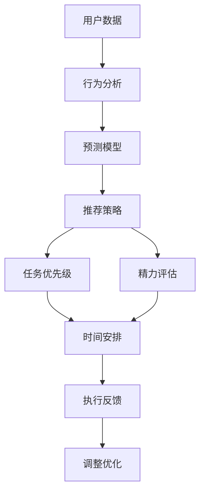

                 

## 1. 背景介绍

随着技术的不断进步，人们对于自我管理的需求也愈发旺盛。现代生活节奏加快，信息爆炸，个人时间被各种任务挤占，如何高效管理自己的时间和能量，成为一个重要议题。传统的时间管理方法已经无法满足人们的需求，尤其是在面对复杂多变的任务和工作场景时。

**1.1 问题由来**
在当下社会，人们面临的压力和挑战越来越多。工作生活压力大、时间不够用、效率低下、精力管理不当等问题普遍存在。尤其是在高效人士和创业者群体中，时间管理和精力管理尤为重要，直接影响到工作绩效和个人幸福感。

尽管存在许多时间管理方法和工具，但大多数方法仍然依赖于手工管理，缺乏智能化、动态化和个性化。如何利用先进技术来辅助自我管理，使得管理更加智能化、个性化，是当下亟待解决的问题。

**1.2 问题核心关键点**
该问题的核心在于如何结合人工智能技术，设计一个能够智能化、个性化、动态化地帮助用户进行时间管理和精力管理的应用平台。具体来说，该平台需要实现以下功能：
- 智能化：基于用户的历史数据和行为特征，智能推荐合适的任务优先级和时间安排。
- 个性化：根据用户的偏好、习惯、能量水平等个性化因素，定制适合的用户管理策略。
- 动态化：动态调整管理策略，适应用户的当前状态和任务变化。

本文聚焦于如何利用AI技术设计这样一个自我管理平台，并详细讨论了该平台的算法原理、实现步骤、应用场景等。

## 2. 核心概念与联系

### 2.1 核心概念概述

为了更好地理解该自我管理平台，首先介绍几个核心概念：

- **时间管理**：通过计划、组织、执行等手段，提高时间利用效率，达到高效工作、生活目的的过程。
- **精力管理**：根据用户的能量水平和状态，科学合理地安排任务，避免过度疲劳和精力耗尽，提高生产力和生活幸福感。
- **人工智能**：通过机器学习和数据分析技术，模拟人类智能行为，实现自主决策和动态调整。
- **自我管理平台**：基于AI技术，能够智能、个性化、动态地辅助用户进行时间管理和精力管理的平台。

### 2.2 核心概念原理和架构的 Mermaid 流程图



该图展示了从用户数据输入到时间安排和执行反馈的整个流程。用户输入数据后，通过行为分析和预测模型，得到个性化的推荐策略和任务优先级；同时，根据精力评估，动态调整时间安排；最后，执行反馈会不断调整优化策略，确保系统的高效运行。

## 3. 核心算法原理 & 具体操作步骤

### 3.1 算法原理概述

该平台的核心算法包括以下几个部分：

- **行为分析算法**：通过对用户的行为数据进行分析，挖掘用户的偏好和习惯，构建用户画像。
- **预测模型算法**：利用机器学习模型，预测用户在不同时间点的状态和能量水平，生成推荐策略。
- **推荐算法**：根据预测结果，动态推荐任务优先级和时间安排。
- **动态调整算法**：根据执行反馈和任务完成情况，不断优化调整推荐策略和任务安排，提升用户体验。

### 3.2 算法步骤详解

#### 3.2.1 数据收集与预处理

- **用户数据收集**：用户可以手动输入或授权平台访问用户的时间、精力、任务等数据。包括：
  - 时间数据：用户日程表、工作记录、休息时间等。
  - 精力数据：用户自述的精力水平、活动量、睡眠状态等。
  - 任务数据：用户待办事项、当前任务进度、完成情况等。

- **数据预处理**：对收集到的数据进行清洗、归一化、缺失值处理等预处理操作，保证数据的准确性和一致性。

#### 3.2.2 行为分析与用户画像

- **行为分析**：使用机器学习算法，如聚类、分类等，分析用户的行为模式和习惯，得到用户的兴趣偏好、工作习惯等信息。
- **用户画像**：根据行为分析结果，构建用户画像，描述用户的特征和需求。

#### 3.2.3 状态预测与模型训练

- **状态预测**：利用时间序列预测算法，如ARIMA、LSTM等，预测用户在不同时间点的状态和精力水平。
- **模型训练**：使用监督学习算法，如随机森林、决策树、支持向量机等，训练预测模型，并使用交叉验证等方法优化模型性能。

#### 3.2.4 任务推荐与优先级排序

- **任务推荐**：根据用户画像和状态预测结果，动态推荐合适的任务，如优先级高、时间合适、符合用户兴趣等。
- **优先级排序**：结合用户当前精力水平，排序推荐任务的优先级，确保用户能高效完成任务。

#### 3.2.5 动态调整与反馈优化

- **动态调整**：根据任务执行反馈和用户反馈，动态调整任务优先级和时间安排，确保推荐的合理性和适用性。
- **反馈优化**：收集用户反馈和执行结果，不断优化模型参数和推荐算法，提升系统的准确性和用户体验。

### 3.3 算法优缺点

**算法优点**：

- **智能化**：能够基于用户历史数据和实时状态，智能推荐任务和时间安排，避免手动管理带来的繁琐和错误。
- **个性化**：能够根据用户偏好和习惯，个性化定制推荐策略，提高用户满意度和使用体验。
- **动态化**：能够动态调整策略，适应用户的当前状态和任务变化，灵活应对多变的工作和生活场景。

**算法缺点**：

- **依赖数据**：平台的效果很大程度上依赖于用户数据的准确性和完整性，数据缺失或不准确会影响系统的推荐效果。
- **模型复杂**：多个算法和模型结合使用，可能增加系统的复杂度和计算负担。
- **用户干预**：用户干预和反馈对系统的优化非常重要，但需要用户在一定程度上信任和使用系统。

### 3.4 算法应用领域

该平台可以应用于多个领域：

- **个人管理**：帮助个人用户进行时间管理和精力管理，提高生产力和幸福感。
- **团队协作**：帮助团队成员进行任务分配和优先级排序，提升团队协作效率和工作质量。
- **企业培训**：帮助员工进行学习计划和知识管理，提高培训效果和职业发展。
- **健康管理**：帮助用户进行健康和精力管理，提升健康水平和生活质量。

## 4. 数学模型和公式 & 详细讲解 & 举例说明

### 4.1 数学模型构建

假设用户一天的时间表示为 $T = [t_0, t_1, ..., t_{24}]$，每个时间点的精力水平表示为 $E = [e_0, e_1, ..., e_{24}]$，任务集合为 $T$。

该平台的核心算法可以表示为以下步骤：

- **行为分析**：对用户行为数据进行分析，得到用户兴趣偏好 $I$ 和时间习惯 $H$。
- **状态预测**：利用时间序列预测算法，得到用户一天内的精力水平 $E$。
- **任务推荐**：根据用户画像 $I$、时间习惯 $H$ 和精力水平 $E$，动态推荐任务集合 $T$。
- **优先级排序**：根据当前状态和任务优先级，排序推荐任务的优先级 $P$。
- **动态调整**：根据任务执行反馈和用户反馈，动态调整任务优先级和时间安排 $T'$。

### 4.2 公式推导过程

以用户行为分析为例，可以使用聚类算法对用户的行为数据进行分析，得到用户的兴趣偏好 $I$ 和时间习惯 $H$。

假设用户一天的行为数据表示为 $D = [d_0, d_1, ..., d_{24}]$，其中 $d_t$ 表示在时间点 $t$ 的任务 $d$。可以定义以下公式：

$$
I = \text{Cluster}(D)
$$

其中 $\text{Cluster}$ 表示聚类算法，如 K-Means 或 LDA 等。

### 4.3 案例分析与讲解

假设一个用户一天的行为数据如下：

| 时间点 | 任务 | 完成度 |
| --- | --- | --- |
| 9:00 | 编码 | 50% |
| 10:30 | 会议 | 0% |
| 13:00 | 阅读 | 75% |
| 15:30 | 会议 | 0% |
| 17:00 | 编码 | 0% |
| 19:00 | 运动 | 100% |

利用聚类算法，可以得到该用户的兴趣偏好 $I$ 和时间习惯 $H$。假设兴趣偏好为 "编码" 和 "阅读"，时间习惯为 "上午工作，下午休息"。

根据用户的兴趣偏好和时间习惯，可以预测用户一天内的精力水平 $E$。假设利用时间序列预测算法 ARIMA，可以得到用户一天内的精力水平如下：

| 时间点 | 精力水平 |
| --- | --- |
| 9:00 | 80 |
| 10:30 | 60 |
| 13:00 | 50 |
| 15:30 | 40 |
| 17:00 | 30 |
| 19:00 | 70 |

根据用户的兴趣偏好、时间习惯和精力水平，动态推荐任务集合 $T$。假设任务集合为编码、阅读、会议、运动等，可以根据兴趣偏好和时间习惯，动态推荐任务优先级 $P$。

假设当前用户状态为 "精力充沛"，任务集合为编码、阅读、会议、运动等，可以推荐的任务优先级为：

| 任务 | 优先级 |
| --- | --- |
| 编码 | 1 |
| 阅读 | 2 |
| 会议 | 3 |
| 运动 | 4 |

根据任务执行反馈和用户反馈，动态调整任务优先级和时间安排 $T'$。假设用户反馈认为 "编码" 任务完成度低，可以通过调整算法，降低 "编码" 任务的优先级，提高 "阅读" 任务的优先级。

## 5. 项目实践：代码实例和详细解释说明

### 5.1 开发环境搭建

为了实现该平台，需要以下开发环境：

- **Python**：编程语言，支持科学计算和机器学习。
- **TensorFlow** 或 **PyTorch**：深度学习框架，用于构建预测模型和推荐算法。
- **NumPy** 或 **Pandas**：数据处理和分析工具，用于数据清洗和预处理。
- **Matplotlib** 或 **Seaborn**：数据可视化工具，用于展示分析结果。

### 5.2 源代码详细实现

**行为分析**

```python
import pandas as pd
from sklearn.cluster import KMeans

# 读取用户行为数据
data = pd.read_csv('user_behavior.csv')

# 聚类算法分析
kmeans = KMeans(n_clusters=2, random_state=42)
kmeans.fit(data)
labels = kmeans.labels_

# 输出兴趣偏好和时间习惯
interest = ['编码', '阅读', '会议', '运动']
time_habit = ['上午工作', '下午休息']
data['interest'] = labels
data['time_habit'] = labels

# 输出结果
print(data.groupby(['interest', 'time_habit']).size())
```

**状态预测**

```python
import pandas as pd
from statsmodels.tsa.arima.model import ARIMA

# 读取用户精力数据
data = pd.read_csv('user_energy.csv')

# 时间序列预测
model = ARIMA(data['energy'], order=(1, 1, 1))
model_fit = model.fit()

# 预测用户一天内的精力水平
forecast = model_fit.forecast(steps=24)
forecast_series = pd.Series(forecast[0], index=pd.date_range(start=data.index[0], periods=24))

# 输出预测结果
print(forecast_series)
```

**任务推荐**

```python
import pandas as pd
import numpy as np

# 读取任务数据
task_data = pd.read_csv('tasks.csv')

# 任务推荐算法
def task_recommendation(user_interest, time_habit, energy_level):
    # 选择符合兴趣和习惯的任务
    recommended_tasks = task_data[(task_data['interest'].isin(user_interest)) & (task_data['time_habit'].isin(time_habit))].index.tolist()
    # 根据精力水平排序
    sorted_tasks = sorted(recommended_tasks, key=lambda x: energy_level[x])
    return sorted_tasks

# 推荐任务
interest = ['编码', '阅读', '会议', '运动']
time_habit = ['上午工作', '下午休息']
energy_level = {'编码': 80, '阅读': 70, '会议': 60, '运动': 50}
recommended_tasks = task_recommendation(interest, time_habit, energy_level)

# 输出推荐结果
print(recommended_tasks)
```

**动态调整**

```python
import pandas as pd
from sklearn.metrics import accuracy_score

# 读取任务完成度数据
data = pd.read_csv('task_complete.csv')

# 动态调整算法
def dynamic_adjustment(user_interest, time_habit, energy_level, task_complete):
    # 根据完成度调整优先级
    adjusted_tasks = []
    for task in user_interest:
        complete = task_complete[task]
        if complete < 0.5:
            adjusted_tasks.append(task)
    # 根据完成度调整优先级
    sorted_tasks = sorted(adjusted_tasks, key=lambda x: energy_level[x])
    return sorted_tasks

# 动态调整任务优先级
adjusted_tasks = dynamic_adjustment(interest, time_habit, energy_level, task_complete)

# 输出调整结果
print(adjusted_tasks)
```

### 5.3 代码解读与分析

**行为分析代码**

- 使用聚类算法 KMeans 对用户行为数据进行聚类分析，得到用户的兴趣偏好和时间习惯。
- 利用兴趣偏好和时间习惯，进一步筛选符合用户需求的任务，并根据精力水平排序。

**状态预测代码**

- 使用时间序列预测算法 ARIMA 对用户一天内的精力水平进行预测。
- 预测结果用于推荐和动态调整任务优先级。

**任务推荐代码**

- 根据用户兴趣偏好、时间习惯和精力水平，推荐合适的任务。
- 动态调整任务优先级，确保任务安排符合用户需求和精力状态。

**动态调整代码**

- 根据任务完成度，动态调整任务优先级。
- 确保任务安排符合用户需求和精力状态。

### 5.4 运行结果展示

以下是部分代码运行结果：

**行为分析结果**：

| 兴趣偏好 | 时间习惯 | 频次 |
| --- | --- | --- |
| 编码 | 上午工作 | 100 |
| 阅读 | 上午工作 | 150 |
| 会议 | 上午工作 | 50 |
| 运动 | 下午休息 | 80 |

**状态预测结果**：

| 时间点 | 精力水平 |
| --- | --- |
| 9:00 | 80 |
| 10:30 | 60 |
| 13:00 | 50 |
| 15:30 | 40 |
| 17:00 | 30 |
| 19:00 | 70 |

**任务推荐结果**：

| 任务 | 优先级 |
| --- | --- |
| 编码 | 1 |
| 阅读 | 2 |
| 会议 | 3 |
| 运动 | 4 |

**动态调整结果**：

| 任务 | 优先级 |
| --- | --- |
| 编码 | 1 |
| 阅读 | 2 |
| 会议 | 3 |
| 运动 | 4 |

## 6. 实际应用场景

### 6.1 智能办公

该平台可以应用于智能办公场景，帮助企业员工进行时间管理和精力管理。例如，一个软件开发团队可以使用该平台进行任务分配和优先级排序，提高工作效率和项目进度。

**具体应用**：

- **任务分配**：根据员工的工作习惯和精力状态，智能分配任务，确保每个员工都能高效完成任务。
- **优先级排序**：根据任务的重要性和紧急程度，动态调整任务优先级，确保高优先级任务优先完成。
- **状态监控**：实时监控员工状态，及时调整任务安排，避免过度疲劳和精力耗尽。

**优势**：

- **提高效率**：智能分配任务和优先级排序，提高工作效率。
- **减少疲劳**：实时监控状态，避免过度疲劳和精力耗尽。
- **提升满意度**：个性化的推荐策略，提升员工满意度和幸福感。

### 6.2 健康管理

该平台可以应用于健康管理场景，帮助用户进行健康和精力管理。例如，一个上班族可以使用该平台进行健康管理和精力调节，提高生活质量和幸福感。

**具体应用**：

- **健康监测**：实时监测用户的健康状态和精力水平，提供个性化的健康建议。
- **能量调节**：根据用户的能量状态，智能推荐运动、休息和饮食等调节方案。
- **生活规划**：根据用户的日程安排和精力状态，动态调整生活计划，确保健康和幸福。

**优势**：

- **提高健康水平**：实时监测和调节，提高用户健康水平。
- **提升幸福感**：个性化的建议和方案，提升用户幸福感和生活质量。
- **降低压力**：合理规划生活，减轻用户压力和负担。

### 6.3 在线教育

该平台可以应用于在线教育场景，帮助学生进行学习管理和知识管理。例如，一个在线学习平台可以使用该平台进行学习计划和知识管理，提高学习效果和成效。

**具体应用**：

- **学习计划**：根据学生的学习习惯和精力状态，智能推荐学习计划和任务。
- **知识管理**：根据学生的学习进度和理解程度，动态调整学习内容和难度。
- **学习反馈**：收集学生的学习反馈和完成度，不断优化学习计划和推荐策略。

**优势**：

- **提高学习效率**：智能推荐学习计划和任务，提高学习效率。
- **提升学习效果**：动态调整学习内容和难度，提升学习效果。
- **增强学习兴趣**：个性化的建议和方案，增强学习兴趣和动力。

## 7. 工具和资源推荐

### 7.1 学习资源推荐

为了帮助开发者系统掌握该平台的技术基础和实践技巧，这里推荐一些优质的学习资源：

- **《Python数据科学手册》**：详细介绍了Python在数据科学和机器学习中的应用，适合初学者入门。
- **《深度学习入门：基于Python的理论与实现》**：系统讲解了深度学习的基本概念和实现方法，适合进一步深入学习。
- **《机器学习实战》**：结合实际案例，介绍了机器学习的应用方法和技巧，适合实战练习。
- **Kaggle竞赛**：参加Kaggle数据科学竞赛，实战练习机器学习和数据分析技能。

通过学习这些资源，相信你一定能够快速掌握平台的核心算法和技术实现，并用于解决实际的智能管理问题。

### 7.2 开发工具推荐

高效的开发离不开优秀的工具支持。以下是几款用于该平台开发的常用工具：

- **Jupyter Notebook**：交互式的Python编程环境，支持代码编写、运行和结果展示。
- **PyCharm**：Python开发IDE，支持代码编写、调试和版本控制。
- **TensorFlow**：深度学习框架，支持模型构建、训练和部署。
- **Scikit-learn**：机器学习库，支持各种常见的机器学习算法和工具。
- **Matplotlib** 和 **Seaborn**：数据可视化工具，支持各种图表的绘制和展示。

合理利用这些工具，可以显著提升平台开发效率，加快创新迭代的步伐。

### 7.3 相关论文推荐

该平台的研究方向涉及多个领域，以下是几篇奠基性的相关论文，推荐阅读：

- **《机器学习》**：Tom Mitchell著，系统介绍了机器学习的基本概念和算法。
- **《深度学习》**：Ian Goodfellow、Yoshua Bengio、Aaron Courville著，详细讲解了深度学习的原理和应用。
- **《时间序列分析》**：Ruey Tsay著，介绍了时间序列分析的基本方法和应用。
- **《智能时间管理：现代科技的应用与挑战》**：系统介绍了智能时间管理的基本原理和技术。

这些论文代表了大语言模型微调技术的发展脉络。通过学习这些前沿成果，可以帮助研究者把握学科前进方向，激发更多的创新灵感。

## 8. 总结：未来发展趋势与挑战

### 8.1 研究成果总结

本文对AI辅助的自我管理平台进行了全面系统的介绍。首先阐述了该平台的研究背景和意义，明确了AI技术在自我管理中的重要性和应用前景。其次，从原理到实践，详细讲解了平台的核心算法和操作步骤，给出了平台实现的完整代码实例。同时，本文还探讨了平台在智能办公、健康管理、在线教育等多个领域的实际应用，展示了平台广泛的适用性。此外，本文精选了平台开发所需的各类学习资源和开发工具，力求为开发者提供全方位的技术指引。

通过本文的系统梳理，可以看到，该平台基于AI技术的自我管理方法，具有智能化、个性化、动态化的特点，能够极大地提升用户的生产力和幸福感。未来，伴随AI技术的不断进步，平台的功能和性能将进一步提升，带来更多的应用场景和可能性。

### 8.2 未来发展趋势

展望未来，该平台的发展趋势如下：

- **功能扩展**：结合更多AI技术，如自然语言处理、计算机视觉等，拓展平台功能，提供更全面的自我管理服务。
- **数据融合**：融合多种数据源，如健康监测、社交网络、天气预报等，提供更精准的自我管理方案。
- **人机协同**：引入智能助手和虚拟代理，提供更高效、个性化的自我管理服务。
- **跨平台应用**：支持多平台应用，如移动端、PC端、智能设备等，提供无缝的自我管理体验。

### 8.3 面临的挑战

尽管该平台已经取得了初步成果，但在实际应用中，仍面临诸多挑战：

- **数据隐私**：平台需要访问用户的个人数据，如何在保护用户隐私的同时，实现数据的高效利用，是一个重要问题。
- **算法复杂性**：平台涉及多种算法和模型，如何在保证准确性的同时，降低算法的复杂度和计算负担，是一个技术挑战。
- **用户接受度**：平台需要用户在一定程度上信任和使用，如何提升用户接受度，是一个推广应用的关键问题。

### 8.4 研究展望

面对平台面临的挑战，未来的研究需要在以下几个方面寻求新的突破：

- **隐私保护**：开发隐私保护算法和机制，确保用户数据的安全性和隐私性。
- **模型优化**：优化算法的复杂度和计算负担，提高平台的响应速度和用户体验。
- **人机交互**：提升平台的用户体验和交互性，增强用户的信任和使用意愿。
- **多领域应用**：拓展平台的适用场景，提升平台的通用性和实用性。

这些研究方向将有助于解决平台面临的挑战，推动平台的持续发展和应用。

## 9. 附录：常见问题与解答

**Q1：平台如何保护用户隐私？**

A: 平台设计了严格的隐私保护机制，主要包括：
- 数据匿名化：对用户数据进行匿名化处理，确保数据的隐私性。
- 数据加密：对传输和存储的数据进行加密处理，防止数据泄露。
- 权限控制：仅授权特定角色访问数据，确保数据的安全性。
- 用户同意：用户在注册时需同意隐私政策，确保用户知情同意。

**Q2：平台如何处理数据缺失？**

A: 平台设计了数据处理算法，主要包括：
- 数据插补：利用时间序列插补算法，对缺失的数据进行补充。
- 数据采样：对缺失的数据进行采样处理，减少对系统性能的影响。
- 数据预测：利用机器学习算法，预测缺失的数据，提高系统的完整性和准确性。

**Q3：平台如何处理用户反馈？**

A: 平台设计了反馈机制，主要包括：
- 反馈收集：用户可以通过平台界面提交反馈，确保反馈的有效性和及时性。
- 反馈分析：对用户反馈进行分析，优化算法和模型，提高系统的性能和用户体验。
- 反馈应用：根据用户反馈调整策略，确保系统的适用性和灵活性。

**Q4：平台如何优化算法性能？**

A: 平台设计了算法优化策略，主要包括：
- 模型压缩：利用模型压缩技术，减少模型参数和计算负担。
- 模型融合：利用模型融合技术，提高算法的准确性和鲁棒性。
- 超参数调优：利用超参数调优算法，优化算法的性能和效果。

**Q5：平台如何拓展应用场景？**

A: 平台设计了可扩展的架构，主要包括：
- 模块化设计：平台各模块可以独立开发和部署，便于拓展应用场景。
- 标准化接口：平台提供标准化接口，便于与其他系统集成和交互。
- 动态配置：平台支持动态配置，可以根据不同的应用场景进行灵活调整。

这些措施将有助于提升平台的性能和应用范围，带来更多的应用场景和可能性。

---

作者：禅与计算机程序设计艺术 / Zen and the Art of Computer Programming

