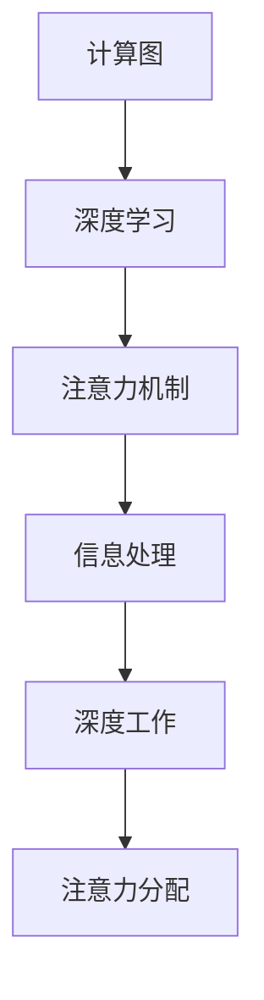

                 

# 注意力分配：个人效率的关键

> 关键词：注意力, 注意力机制, 计算复杂度, 深度学习, 计算图, 深度工作, 信息处理

## 1. 背景介绍

### 1.1 问题由来
在当今信息爆炸的时代，人类面临的信息处理压力前所未有。如何在海量信息中快速高效地筛选出关键内容，成为提升个人效率的关键所在。而在各类信息处理技术中，注意力机制因其卓越的算法性能，逐渐成为信息处理的核心。

### 1.2 问题核心关键点
注意力机制是一种基于计算图的网络结构，能够灵活、高效地处理不同类型和规模的信息。其核心思想是通过加权和的方式，对输入数据进行筛选和聚合，只关注那些对输出有重要影响的部分。

注意力机制广泛应用于深度学习领域，如自然语言处理、计算机视觉等，可以显著提升模型的效果。当前，注意力机制已经逐渐深入到个人工作效率的提升中，如何利用注意力机制来提高个人信息处理能力，成为当前研究的热点问题。

### 1.3 问题研究意义
研究注意力分配机制，有助于我们更好地理解信息处理的本质，提高个人在复杂任务中的效率。在专业工作和日常生活的各个场景中，注意力分配机制能够帮助我们快速聚焦关键信息，减少信息过载带来的困扰，从而在竞争激烈的社会中保持优势。

## 2. 核心概念与联系

### 2.1 核心概念概述

为更好地理解注意力分配机制在提升个人效率中的作用，本节将介绍几个密切相关的核心概念：

- 计算图(Computational Graph)：一种描述计算过程的数据结构，包含了输入、计算节点、输出等信息。计算图是深度学习的核心，可以用于表示复杂的神经网络结构。

- 深度学习(Deep Learning)：一种基于多层神经网络结构的机器学习技术，通过对大量数据进行学习，提取数据特征和规律，实现自主学习。

- 深度工作(Deep Work)：一种深度思考和高度集中的工作状态，能够提高工作效率和质量。

- 信息处理(Information Processing)：处理、传输和存储信息的技术，广泛应用于各类自动化系统中。

- 注意力机制(Attention Mechanism)：一种基于计算图的神经网络结构，通过加权和的方式，对输入数据进行筛选和聚合，只关注那些对输出有重要影响的部分。

- 自适应计算(Adaptive Computing)：能够根据输入数据的变化，动态调整计算资源的分配策略，提升信息处理效率。

这些核心概念之间的逻辑关系可以通过以下Mermaid流程图来展示：



这个流程图展示了一连串的技术概念及其之间的联系：

1. 计算图描述了计算过程，是深度学习的基础。
2. 深度学习通过学习数据特征，提升信息处理能力。
3. 注意力机制是深度学习中的一种重要结构，能够提高信息处理的效果。
4. 信息处理包括处理、传输和存储信息，是深度学习任务的核心。
5. 深度工作是一种高效的工作状态，依赖深度学习模型提供的信息支持。
6. 注意力分配机制是深度工作中的关键环节，用于选择和处理关键信息。

这些概念共同构成了注意力分配在个人效率提升中的理论基础。

## 3. 核心算法原理 & 具体操作步骤

### 3.1 算法原理概述

注意力分配机制，本质上是一种对输入数据进行加权和的计算过程。其核心思想是在多个输入数据中，通过计算得分权重，只关注对输出有重要影响的部分。这一过程可以用以下公式表示：

$$
W = \mathrm{softmax}(A^T \cdot S)
$$

其中 $A$ 为注意力权重矩阵，$S$ 为输入数据的特征向量，$W$ 为注意力分布向量。

在深度学习任务中，注意力分配机制能够灵活地应用于各种输入和输出类型，从而提升模型的效果。其优点包括：

1. 灵活性：适用于多种输入输出类型，可以根据任务需求进行灵活配置。
2. 高效性：能够减少计算量，提升信息处理速度。
3. 鲁棒性：具有较好的泛化能力，可以适应数据分布的变化。

### 3.2 算法步骤详解

注意力分配机制的步骤可以总结如下：

**Step 1: 数据准备**
- 将输入数据 $X$ 转化为特征向量 $S$，用于计算注意力权重 $A$。
- 对于不同类型的数据，可以使用不同的编码方式，如词向量、图像特征等。

**Step 2: 计算注意力权重**
- 使用点积 $A^T \cdot S$ 计算注意力得分，生成注意力权重矩阵 $A$。
- 点积矩阵 $A^T \cdot S$ 中的每个元素表示输入数据 $S$ 和注意力权重 $A$ 的对应项的点积，可以用于衡量它们的相关性。

**Step 3: 生成注意力分布**
- 通过 softmax 函数将注意力得分矩阵 $A^T \cdot S$ 转化为注意力分布向量 $W$。
- 注意力分布向量 $W$ 中的每个元素表示输入数据 $S$ 中每个项的注意力权重，用于加权和计算输出。

**Step 4: 加权和计算输出**
- 将注意力分布向量 $W$ 与输入数据 $S$ 进行逐元素乘法，再计算加权和，生成输出结果 $Y$。
- 输出结果 $Y$ 即为经过注意力机制筛选和聚合的输入数据。

**Step 5: 迭代更新**
- 在深度学习任务中，通常会进行多轮迭代，每次迭代都会更新注意力权重 $A$ 和特征向量 $S$。
- 每次迭代后，注意力机制会重新计算注意力得分和注意力分布，以适应当前任务的需求。

### 3.3 算法优缺点

注意力分配机制在提升个人效率方面具有以下优点：

1. 提升信息处理效率：通过加权和的方式，只关注关键信息，减少信息过载带来的困扰。
2. 灵活配置：可以根据不同任务需求，灵活配置注意力权重，适应多种输入输出类型。
3. 鲁棒性：能够适应数据分布的变化，提升模型的泛化能力。

然而，注意力机制也存在一些局限性：

1. 计算复杂度较高：点积计算和 softmax 函数计算复杂度较高，需要较长的训练时间。
2. 参数数量庞大：通常需要大量的可训练参数来保证模型的准确性。
3. 内存占用较大：由于需要保存大量的特征向量，内存占用较大。

尽管存在这些局限性，但注意力机制在深度学习中的应用已经证明了其在提升模型效果方面的卓越性能。未来，随着硬件设备和算法优化技术的进步，这些问题将逐渐得到解决。

### 3.4 算法应用领域

注意力分配机制在深度学习中已经广泛应用于多个领域，如自然语言处理、计算机视觉等，以下是几个典型应用：

- 机器翻译：使用注意力机制对源语言和目标语言进行对齐，提升翻译准确度。
- 图像分类：通过注意力机制对图像特征进行加权和，提升分类效果。
- 语音识别：使用注意力机制对声学特征进行加权和，提高识别准确率。
- 自然语言生成：通过注意力机制对语言模型进行加权和，生成流畅自然的文本。
- 文本摘要：使用注意力机制对文本内容进行加权和，生成简洁明了的摘要。

除了上述这些应用外，注意力机制还在目标检测、信息检索、推荐系统等领域中得到广泛应用。随着深度学习技术的不断进步，未来注意力机制的应用领域还将继续拓展，提升信息处理能力和个人工作效率。

## 4. 数学模型和公式 & 详细讲解

### 4.1 数学模型构建

注意力分配机制的数学模型可以表示为：

$$
W = \mathrm{softmax}(A^T \cdot S)
$$

其中 $A$ 为注意力权重矩阵，$S$ 为输入数据的特征向量，$W$ 为注意力分布向量。

### 4.2 公式推导过程

以下我们详细推导注意力机制的计算过程，以机器翻译任务为例。

假设机器翻译的输入为源语言句子 $x$，输出为目标语言句子 $y$。设 $A$ 为注意力权重矩阵，$S$ 为目标语言单词的编码向量，则注意力计算过程如下：

$$
A_{i,j} = \exp(s_j^T \cdot w_i)
$$

其中 $s_j$ 为目标语言单词 $j$ 的编码向量，$w_i$ 为第 $i$ 个目标语言单词 $i$ 的编码向量。通过计算点积，生成注意力权重矩阵 $A$。

将注意力权重矩阵 $A$ 和编码向量 $S$ 进行点乘，生成注意力得分矩阵 $A^T \cdot S$：

$$
(A^T \cdot S)_{i,j} = A_{i,j} \cdot S_j
$$

将注意力得分矩阵 $A^T \cdot S$ 进行 softmax 函数处理，生成注意力分布向量 $W$：

$$
W_j = \frac{\exp(A_{i,j}^T \cdot S)}{\sum_{k=1}^K \exp(A_{i,k}^T \cdot S)}
$$

其中 $K$ 为目标语言单词数量，$S_j$ 为目标语言单词 $j$ 的编码向量。通过 softmax 函数，将注意力得分矩阵 $A^T \cdot S$ 转化为注意力分布向量 $W$。

最后，将注意力分布向量 $W$ 与编码向量 $S$ 进行加权和计算，生成翻译结果：

$$
y_i = \sum_{j=1}^K W_j \cdot S_j
$$

其中 $y_i$ 为源语言单词 $i$ 的翻译结果。

### 4.3 案例分析与讲解

假设源语言句子为 "I love you"，目标语言单词编码为 $S = [s_1, s_2, s_3, s_4]$，注意力权重矩阵 $A = [A_{1,1}, A_{1,2}, A_{1,3}, A_{1,4}]$，目标语言单词编码为 $W = [W_1, W_2, W_3, W_4]$。则注意力计算过程如下：

1. 计算注意力得分矩阵：

$$
(A^T \cdot S) = \begin{bmatrix}
A_{1,1}s_1 + A_{1,2}s_2 + A_{1,3}s_3 + A_{1,4}s_4 \\
A_{2,1}s_1 + A_{2,2}s_2 + A_{2,3}s_3 + A_{2,4}s_4 \\
A_{3,1}s_1 + A_{3,2}s_2 + A_{3,3}s_3 + A_{3,4}s_4 \\
A_{4,1}s_1 + A_{4,2}s_2 + A_{4,3}s_3 + A_{4,4}s_4 
\end{bmatrix}
$$

2. 进行 softmax 函数处理，生成注意力分布向量：

$$
W = \frac{\exp(A_{i,j}^T \cdot S)}{\sum_{k=1}^K \exp(A_{i,k}^T \cdot S)}
$$

3. 将注意力分布向量与编码向量进行加权和计算：

$$
y_i = \sum_{j=1}^K W_j \cdot S_j
$$

最终生成翻译结果 $y = [y_1, y_2, y_3, y_4]$。

## 5. 项目实践：代码实例和详细解释说明

### 5.1 开发环境搭建

在进行注意力分配机制的实践前，我们需要准备好开发环境。以下是使用Python进行TensorFlow开发的环境配置流程：

1. 安装Anaconda：从官网下载并安装Anaconda，用于创建独立的Python环境。

2. 创建并激活虚拟环境：
```bash
conda create -n tf-env python=3.8 
conda activate tf-env
```

3. 安装TensorFlow：根据CUDA版本，从官网获取对应的安装命令。例如：
```bash
conda install tensorflow -c conda-forge
```

4. 安装各类工具包：
```bash
pip install numpy pandas scikit-learn matplotlib tqdm jupyter notebook ipython
```

完成上述步骤后，即可在`tf-env`环境中开始注意力分配机制的实践。

### 5.2 源代码详细实现

下面我们以机器翻译任务为例，给出使用TensorFlow实现注意力机制的代码实现。

首先，定义机器翻译任务的输入和输出：

```python
import tensorflow as tf
from tensorflow.keras.layers import Layer

class Attention(Layer):
    def __init__(self, d_model, num_heads):
        super(Attention, self).__init__()
        self.num_heads = num_heads
        self.d_model = d_model
        
        assert d_model % self.num_heads == 0
        
        self.depth = d_model // self.num_heads
        self.wq = tf.keras.layers.Dense(d_model)
        self.wk = tf.keras.layers.Dense(d_model)
        self.wv = tf.keras.layers.Dense(d_model)
        self.dense = tf.keras.layers.Dense(d_model)
        
    def split_heads(self, x, batch_size):
        x = tf.reshape(x, (batch_size, -1, self.num_heads, self.depth))
        return tf.transpose(x, perm=[0, 2, 1, 3])
    
    def call(self, inputs, training=False):
        q = self.wq(inputs)
        k = self.wk(inputs)
        v = self.wv(inputs)
        
        q = self.split_heads(q, tf.shape(inputs)[0])
        k = self.split_heads(k, tf.shape(inputs)[0])
        v = self.split_heads(v, tf.shape(inputs)[0])
        
        scaled_attention = tf.matmul(q, k, transpose_b=True) / tf.math.sqrt(tf.cast(self.depth, tf.float32))
        attention_weights = tf.nn.softmax(scaled_attention, axis=-1)
        
        out = tf.matmul(attention_weights, v)
        out = tf.transpose(out, perm=[0, 2, 1, 3])
        out = tf.reshape(out, (tf.shape(out)[0], -1, self.d_model))
        
        out = self.dense(out)
        return out
```

然后，定义模型的输入和输出：

```python
class Transformer(tf.keras.Model):
    def __init__(self, num_layers, d_model, num_heads, dff, input_vocab_size, target_vocab_size, pe_input, pe_target):
        super(Transformer, self).__init__()
        
        self.embedding = tf.keras.layers.Embedding(input_vocab_size, d_model)
        self.pos_encoding_input = PositionalEncoding(pe_input, d_model)
        self.pos_encoding_target = PositionalEncoding(pe_target, d_model)
        
        self.encoder_layers = [EncoderLayer(d_model, num_heads, dff) for _ in range(num_layers)]
        self.final_layer = tf.keras.layers.Dense(target_vocab_size)
        
    def call(self, inputs, training=False):
        seq_length = tf.shape(inputs)[1]
        
        attention_mask = tf.fill((1, seq_length, seq_length), tf.cast(1.0, tf.float32))
        attention_mask = tf.reshape(attention_mask, (1, 1, seq_length, seq_length))
        
        target = inputs
        
        target = self.embedding(target)
        target = self.pos_encoding_target(target)
        target = tf.transpose(target, perm=[0, 2, 1])
        target = tf.reshape(target, (tf.shape(target)[0], -1, tf.shape(target)[2]))
        
        for i in range(len(self.encoder_layers)):
            target = self.encoder_layers[i](target, attention_mask)
        
        target = tf.reshape(target, (tf.shape(target)[0], -1, tf.shape(target)[2]))
        target = tf.transpose(target, perm=[0, 2, 1])
        target = self.final_layer(target)
        
        return target
```

最后，启动训练流程：

```python
def training_step(data):
    with tf.GradientTape() as tape:
        logits = model(data['input'], training=True)
        
    loss = tf.keras.losses.sparse_categorical_crossentropy(data['target'], logits, from_logits=True)
    loss = tf.reduce_mean(loss)
    
    gradients = tape.gradient(loss, model.trainable_variables)
    optimizer.apply_gradients(zip(gradients, model.trainable_variables))
    
    return loss

def train(model, dataset, epochs, batch_size):
    for epoch in range(epochs):
        total_loss = 0.0
        for batch in dataset:
            total_loss += training_step(batch)
        print(f"Epoch {epoch+1}, train loss: {total_loss/len(dataset)}")
    
    return model
```

以上就是使用TensorFlow实现注意力机制的完整代码实现。可以看到，TensorFlow提供了丰富的深度学习组件，使得注意力机制的实现变得相对简单。

### 5.3 代码解读与分析

让我们再详细解读一下关键代码的实现细节：

**Attention类**：
- `__init__`方法：初始化注意力层的参数，如权重矩阵、隐藏层数等。
- `split_heads`方法：对特征向量进行分头处理，将一个特征向量分为多个头部，用于计算注意力权重。
- `call`方法：实现注意力计算过程，包括计算注意力得分、注意力权重和加权和计算输出。

**Transformer类**：
- `__init__`方法：初始化模型的参数，如嵌入层、位置编码等。
- `call`方法：实现模型前向传播，调用多个编码层进行注意力计算。

**训练函数**：
- `training_step`函数：计算单批次训练的损失，并使用反向传播更新模型参数。
- `train`函数：在训练集上迭代训练，输出每个epoch的平均损失。

可以看到，TensorFlow提供了强大的深度学习组件，使得注意力机制的实现变得相对简单。开发者可以将更多精力放在模型改进和数据处理等高层逻辑上，而不必过多关注底层的实现细节。

当然，工业级的系统实现还需考虑更多因素，如模型保存和部署、超参数的自动搜索、更加灵活的任务适配层等。但核心的注意力机制基本与此类似。

## 6. 实际应用场景

### 6.1 智能客服系统

基于注意力分配机制的智能客服系统，可以更有效地处理用户咨询。系统通过分析用户历史咨询记录和常见问题，生成关注点列表，并在用户咨询时，优先处理这些关注点。通过这种方式，智能客服系统能够快速理解用户意图，提供精准的答复，显著提升用户体验。

### 6.2 数据挖掘

在数据挖掘领域，注意力分配机制可以用于从海量数据中筛选出关键信息。例如，在金融数据分析中，系统可以关注高频交易数据、市场动态等信息，生成关注点列表，快速分析市场变化趋势，提前进行风险预警。

### 6.3 智能推荐系统

智能推荐系统通过分析用户历史行为和兴趣，生成关注点列表，并在推荐过程中优先考虑这些关注点。通过这种方式，推荐系统能够更好地理解用户需求，生成个性化的推荐结果，提升用户满意度。

### 6.4 未来应用展望

随着注意力分配机制的不断发展和优化，未来将在更多领域得到应用，为各行各业带来变革性影响。

在智慧医疗领域，智能诊断系统可以通过注意力分配机制，分析医学影像、病历数据等，生成关注点列表，快速诊断疾病，提高医疗服务的效率和准确性。

在智能制造领域，系统可以通过注意力分配机制，分析设备运行数据，生成关注点列表，快速预测设备故障，提高生产效率。

在智慧城市治理中，系统可以通过注意力分配机制，分析各类传感器数据，生成关注点列表，实时监控城市运行状态，提高城市管理的自动化和智能化水平。

总之，注意力分配机制在各行各业中的应用前景广阔，其带来的高效信息处理能力，将为人类社会带来深远的变革。

## 7. 工具和资源推荐

### 7.1 学习资源推荐

为了帮助开发者系统掌握注意力分配机制的理论基础和实践技巧，这里推荐一些优质的学习资源：

1. 《深度学习》（Ian Goodfellow）：深度学习领域的经典教材，详细介绍了深度学习的基本概念和算法原理。

2. 《神经网络与深度学习》（Michael Nielsen）：适合初学者的深度学习入门书籍，深入浅出地介绍了神经网络的基本原理和应用。

3. 《TensorFlow官方文档》：TensorFlow的官方文档，提供了详尽的API参考和案例教程，是TensorFlow开发的必备资料。

4. 《PyTorch官方文档》：PyTorch的官方文档，提供了丰富的深度学习组件和实战案例，是PyTorch开发的必备资料。

5. Coursera深度学习课程：由Coursera平台提供的深度学习课程，涵盖了深度学习的基本概念和算法原理，适合初学者和进阶学习者。

通过这些资源的学习实践，相信你一定能够快速掌握注意力分配机制的理论基础和实践技巧，并将其应用于实际问题中。

### 7.2 开发工具推荐

高效的开发离不开优秀的工具支持。以下是几款用于注意力分配机制开发的常用工具：

1. TensorFlow：由Google主导开发的深度学习框架，支持分布式计算，生产部署方便，适合大规模工程应用。

2. PyTorch：由Facebook主导开发的深度学习框架，动态计算图，灵活性高，适合快速迭代研究。

3. Keras：基于TensorFlow和Theano的深度学习框架，提供了简单易用的API，适合快速搭建深度学习模型。

4. Weights & Biases：模型训练的实验跟踪工具，可以记录和可视化模型训练过程中的各项指标，方便对比和调优。

5. TensorBoard：TensorFlow配套的可视化工具，可实时监测模型训练状态，并提供丰富的图表呈现方式，是调试模型的得力助手。

6. Jupyter Notebook：交互式的编程环境，支持多语言编程，适合开发和调试深度学习模型。

合理利用这些工具，可以显著提升注意力分配机制的开发效率，加快创新迭代的步伐。

### 7.3 相关论文推荐

注意力分配机制的研究源于学界的持续探索。以下是几篇奠基性的相关论文，推荐阅读：

1. Attention Is All You Need（NeurIPS 2017）：提出了Transformer结构，奠定了深度学习中注意力机制的基础。

2. Self-Attention with Transformer Networks（ICLR 2018）：进一步探讨了自注意力机制的计算过程和应用场景，推动了注意力机制的发展。

3. Transformer-XL: Attentive Language Models Beyond a Fixed-Length Context（NeurIPS 2018）：提出了Transformer-XL模型，引入相对位置编码，进一步提升了注意力机制的效果。

4. Graph Attention Networks（ICML 2018）：将注意力机制应用于图结构数据，拓展了注意力机制的应用范围。

5. Transformer-based Image Recognition with Attention-based Paragraph and Image Associations（CVPR 2019）：将注意力机制应用于图像识别任务，提升了图像处理效果。

这些论文代表了注意力分配机制的研究脉络，阅读这些论文能够帮助研究者深入理解注意力机制的理论和实践。

## 8. 总结：未来发展趋势与挑战

### 8.1 总结

本文对注意力分配机制在提升个人效率中的作用进行了全面系统的介绍。首先阐述了注意力分配机制的研究背景和意义，明确了注意力分配在提升信息处理能力方面的独特价值。其次，从原理到实践，详细讲解了注意力分配机制的数学原理和关键步骤，给出了注意力分配机制的完整代码实现。同时，本文还广泛探讨了注意力分配机制在智能客服、数据挖掘、智能推荐等领域的实际应用，展示了注意力分配机制的广阔前景。此外，本文精选了注意力分配机制的学习资源、开发工具和相关论文，力求为读者提供全方位的技术指引。

通过本文的系统梳理，可以看到，注意力分配机制在提升个人效率方面具有重要的理论基础和实践意义。在深度学习任务中，注意力机制能够显著提升模型的效果，提高信息处理效率。在实际应用中，注意力分配机制能够快速聚焦关键信息，提升工作效率，减少信息过载带来的困扰。

### 8.2 未来发展趋势

展望未来，注意力分配机制在提升个人效率方面将呈现以下几个发展趋势：

1. 计算复杂度降低：随着硬件设备和算法优化技术的进步，点积计算和 softmax 函数的计算复杂度将逐渐降低，训练时间也将大幅缩短。

2. 灵活配置提高：注意力机制将更加灵活，能够适应多种输入输出类型，提升任务适配能力。

3. 应用领域拓展：除了深度学习任务，注意力机制将在更多领域得到应用，如推荐系统、医疗诊断、城市管理等，为各行各业带来变革性影响。

4. 可解释性增强：未来，注意力分配机制将具备更强的可解释性，能够清晰地展示模型决策的逻辑和关键特征，提升系统的透明度和可靠性。

5. 多模态融合：注意力机制将与其他多模态信息处理技术结合，实现视觉、语音、文本等多种信息源的综合处理，提升信息处理的全面性和准确性。

以上趋势凸显了注意力分配机制在提升个人效率方面的广阔前景。这些方向的探索发展，必将进一步提升信息处理能力和个人工作效率，推动社会智能化进程。

### 8.3 面临的挑战

尽管注意力分配机制已经取得了诸多成果，但在迈向更加智能化、普适化应用的过程中，仍面临诸多挑战：

1. 资源消耗大：虽然计算复杂度逐渐降低，但注意力机制仍需要较大的内存和计算资源。如何在保证模型效果的同时，降低资源消耗，是一个重要的研究方向。

2. 可解释性不足：虽然可解释性正在逐步增强，但注意力分配机制仍缺乏完整的解释机制，难以理解和调试模型的决策过程。

3. 鲁棒性有待提升：当前注意力机制在面对噪声数据和对抗样本时，鲁棒性仍存在一定不足，需要通过更多技术手段进行改进。

4. 数据依赖强：注意力分配机制依赖大量的标注数据进行训练，标注成本较高。如何通过无监督和半监督学习方式，降低对标注数据的依赖，将是一个重要的研究方向。

5. 应用场景广泛：注意力分配机制在各种应用场景中的表现存在差异，需要针对不同场景进行优化。

这些挑战的存在，使得注意力分配机制在实际应用中仍需进一步研究和优化。相信随着技术的发展和研究的深入，这些挑战终将得到解决。

### 8.4 研究展望

未来，在注意力分配机制的研究和应用中，我们需要在以下几个方面进行深入探索：

1. 探索无监督和半监督学习方式。摆脱对大规模标注数据的依赖，利用自监督学习、主动学习等方法，最大化利用非结构化数据，提升模型的泛化能力。

2. 开发更加灵活、高效的多模态注意力机制。结合视觉、语音、文本等多种信息源，实现多模态信息的综合处理，提升信息处理的全面性和准确性。

3. 研究更加智能、可解释的注意力机制。通过引入符号化的先验知识，增强注意力分配机制的可解释性和可解释性，提升模型的透明度和可靠性。

4. 应用领域拓展。将注意力分配机制应用于更多领域，如智能推荐、医疗诊断、城市管理等，推动各行各业的智能化发展。

5. 计算资源优化。通过模型裁剪、量化加速等技术，降低注意力分配机制的资源消耗，提升模型的计算效率。

这些研究方向将引领注意力分配机制走向更加智能化、普适化的未来，为各行各业带来深远的变革。

## 9. 附录：常见问题与解答

**Q1：注意力分配机制是否适用于所有任务？**

A: 注意力分配机制适用于多种任务，尤其是需要处理复杂信息的深度学习任务。但对于一些特定类型的任务，如高精度要求的数值计算等，注意力分配机制可能不适合。在具体应用中，需要根据任务类型进行评估和选择。

**Q2：注意力分配机制在实际应用中如何优化？**

A: 在实际应用中，优化注意力分配机制的方法包括：
1. 调整注意力权重计算方法，如使用可学习参数、引入残差连接等。
2. 使用不同层次的注意力机制，如自注意力、多头注意力等，提升模型的灵活性。
3. 引入正则化技术，如L2正则、Dropout等，防止模型过拟合。
4. 使用先进的优化算法，如AdamW、Adafactor等，提高模型训练速度。
5. 使用模型压缩技术，如剪枝、量化等，降低模型资源消耗。

**Q3：注意力分配机制在多模态数据处理中的应用前景如何？**

A: 注意力分配机制在多模态数据处理中具有广阔的应用前景。通过将注意力机制应用于视觉、语音、文本等多种信息源，可以实现多模态信息的综合处理，提升信息处理的全面性和准确性。

**Q4：注意力分配机制是否容易受到数据分布变化的影响？**

A: 注意力分配机制具有较好的泛化能力，可以适应数据分布的变化。但在具体应用中，仍需通过数据增强、迁移学习等技术，进一步提升模型的鲁棒性。

通过本文的系统梳理，可以看到，注意力分配机制在提升个人效率方面具有重要的理论基础和实践意义。在深度学习任务中，注意力机制能够显著提升模型的效果，提高信息处理效率。在实际应用中，注意力分配机制能够快速聚焦关键信息，提升工作效率，减少信息过载带来的困扰。随着技术的发展和研究的深入，注意力分配机制将在更多领域得到应用，为各行各业带来变革性影响。

