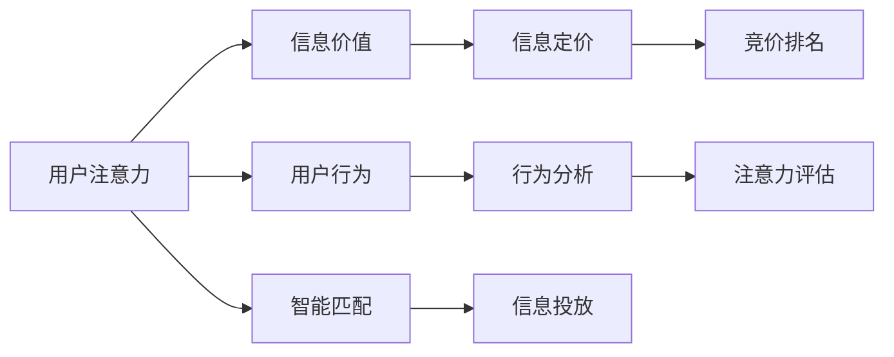

                 

# 注意力市场：元宇宙时代下的信息交易

## 1. 背景介绍

### 1.1 问题由来
随着技术的迅猛发展，我们正在步入一个全新的元宇宙时代。这个虚拟世界中，数字资产、虚拟物品和信息数据的流通与交易变得愈发频繁和复杂。在信息泛滥的时代，如何精准、高效地获取、加工和传播有价值的信息，成为了人们关注的焦点。与此同时，传统的广告模型、内容推送算法等手段，已经无法满足现代信息市场的需求。

在这一背景下，一种新的信息交易机制——注意力市场（Attention Market）应运而生。它利用了人们对于信息注意力资源的分配偏好，通过竞争和交易机制，实现了信息精准投放和价值最大化。

### 1.2 问题核心关键点
注意力市场是元宇宙时代下，一种新兴的信息交易机制。其核心思想在于：通过构建一个基于用户注意力的交易平台，使得信息提供者（广告主、内容生产者等）能够根据用户的注意力偏好，精准地将信息推送给特定用户群体，从而最大化信息传播的效率和价值。

注意力市场的关键点在于：
1. 动态用户注意力的获取与监控。通过分析用户的浏览、点击、观看等行为数据，评估其对不同信息的注意力水平。
2. 信息价值的量化评估。将信息价值与用户注意力值进行匹配，实现信息定价的科学化。
3. 竞争与协作机制的建立。采用竞价和排名机制，激励信息提供者优化内容质量，吸引用户的注意力。
4. 交易平台的智能匹配。使用智能算法对用户注意力和信息内容进行精准匹配，提升信息传递的精准度。

在实际操作中，注意力市场涉及到信息流量的精确分配、用户注意力的动态监控和智能化交易策略的执行等多个环节，具有复杂的系统设计和算法实现要求。

### 1.3 问题研究意义
研究注意力市场，对于拓展信息交易的新范式，提高信息流通的效率，优化用户体验，具有重要意义：

1. 提升信息投放的精准度。通过精准匹配用户与信息，最大化信息的传播效率和价值。
2. 促进信息内容的多样化和个性化。借助竞争和合作机制，激励内容生产者创造出更加符合用户需求的高质量信息。
3. 实现用户满意度的最大化。通过动态调整信息内容，满足用户个性化、差异化的信息需求。
4. 为元宇宙经济提供新型的增长动力。注意力市场有望成为元宇宙内信息流通的重要机制，推动元宇宙经济的繁荣发展。

## 2. 核心概念与联系

### 2.1 核心概念概述

为了更好地理解注意力市场的运作原理，本节将介绍几个关键概念：

- 注意力市场（Attention Market）：基于用户注意力的信息交易平台，通过动态监控用户注意力，实现信息价值最大化。
- 用户注意力（User Attention）：指用户对不同信息的关注程度，通常通过用户行为数据来衡量。
- 信息价值（Information Value）：指信息对用户的实际效用，可量化为用户注意力值或点击率等指标。
- 竞争与协作机制（Competition and Collaboration）：信息提供者在注意力市场中的竞争策略，以及与用户、平台之间的合作模式。
- 智能匹配算法（Intelligent Matching Algorithm）：用于对用户注意力和信息内容进行精确匹配的算法。

这些概念之间存在着紧密的逻辑联系：注意力市场通过动态监控和评估用户注意力，量化信息价值，并通过竞争与协作机制、智能匹配算法，实现信息精准投放和价值最大化。

### 2.2 核心概念原理和架构的 Mermaid 流程图(Mermaid 流程节点中不要有括号、逗号等特殊字符)



该图展示了注意力市场的基本流程：首先通过用户的各种行为数据，进行行为分析和注意力评估；然后根据信息价值和用户注意力值进行信息定价；接下来通过竞价和排名机制，激励信息提供者优化内容；最后，使用智能匹配算法将信息精准推送给用户，实现信息价值最大化。

## 3. 核心算法原理 & 具体操作步骤
### 3.1 算法原理概述

注意力市场的核心算法主要围绕信息价值的量化和智能匹配两个方面展开。

#### 3.1.1 信息价值量化

信息价值量化是注意力市场的第一步，旨在将信息对用户的实际效用，量化为用户注意力值。这个过程通常包含以下几个关键步骤：

1. **用户行为数据采集**：收集用户在不同信息上的行为数据，如浏览时间、点击次数、观看时长等。

2. **用户注意力模型建立**：使用机器学习模型或规则系统，对用户的行为数据进行分析，建立用户注意力模型，描述不同信息对用户的吸引力。

3. **信息价值评估**：将用户注意力模型应用于信息价值评估，根据信息的关注度、点击率等指标，量化信息价值。

#### 3.1.2 智能匹配算法

智能匹配算法是注意力市场的核心，旨在实现信息精准投放。这个过程通常包含以下几个关键步骤：

1. **用户注意力分析**：动态监控用户的注意力行为，建立用户的注意力特征向量。

2. **信息内容分析**：对信息内容进行特征提取和编码，构建信息特征向量。

3. **匹配模型训练**：使用机器学习算法或深度学习模型，训练匹配模型，学习用户注意力和信息特征之间的关系。

4. **信息投放决策**：根据训练好的匹配模型，对用户注意力和信息内容进行匹配，决策最优的信息投放策略。

### 3.2 算法步骤详解

以下将详细介绍注意力市场的主要算法步骤：

#### 3.2.1 用户注意力监控

用户注意力监控是注意力市场的关键环节，主要包括以下步骤：

1. **数据采集**：通过网站、应用等平台，收集用户的浏览、点击、观看等行为数据。

2. **数据预处理**：对采集到的数据进行清洗、归一化等预处理操作。

3. **行为分析**：使用机器学习模型或规则系统，对用户行为数据进行分析，计算用户对不同信息的注意力值。

4. **注意力模型建立**：根据用户注意力值，建立用户注意力模型，描述用户对不同信息的偏好和兴趣。

#### 3.2.2 信息价值量化

信息价值量化主要包括以下步骤：

1. **信息关注度计算**：根据用户的点击、停留、转发等行为，计算信息的关注度。

2. **信息价值评估**：将信息关注度转化为信息价值，量化为注意力值或点击率等指标。

3. **价值模型训练**：使用机器学习模型或规则系统，对信息价值进行建模，训练出信息价值模型。

#### 3.2.3 竞价和排名机制

竞价和排名机制是注意力市场的重要组成部分，主要包括以下步骤：

1. **竞价规则设计**：设计合理的竞价规则，如CPC（按点击付费）、CPM（按展示付费）等。

2. **信息提供者注册**：信息提供者注册并提交竞价策略。

3. **竞价排名**：根据信息提供者的竞价策略和信息价值，进行竞价排名，确定信息的投放顺序。

4. **竞价调整**：根据信息投放效果，动态调整竞价策略，优化信息投放效果。

#### 3.2.4 智能匹配算法

智能匹配算法是注意力市场的核心技术，主要包括以下步骤：

1. **用户特征提取**：使用自然语言处理、图像处理等技术，提取用户的注意力特征。

2. **信息特征提取**：使用自然语言处理、图像处理等技术，提取信息的特征。

3. **匹配模型训练**：使用机器学习或深度学习模型，训练匹配模型，学习用户注意力和信息特征之间的关系。

4. **信息投放决策**：根据训练好的匹配模型，对用户注意力和信息内容进行匹配，决策最优的信息投放策略。

### 3.3 算法优缺点

注意力市场具有以下优点：

1. **提升信息投放的精准度**：通过动态监控和评估用户注意力，实现信息精准投放，最大化信息传播效率和价值。
2. **促进内容多样化**：借助竞争和合作机制，激励信息提供者创造出更加符合用户需求的高质量内容。
3. **提升用户满意度**：通过动态调整信息内容，满足用户个性化、差异化的信息需求。
4. **降低广告成本**：通过竞价和排名机制，精准匹配用户与信息，避免浪费广告成本。

同时，注意力市场也存在一些缺点：

1. **数据隐私问题**：用户行为数据的采集和使用，可能引发隐私和数据安全问题。
2. **算法复杂度**：智能匹配算法的设计和优化，技术难度较高。
3. **竞价策略设计**：竞价规则的设计和调整，需要精准的策略和丰富的经验。
4. **市场竞争激烈**：信息提供者的竞争，可能导致信息质量参差不齐。

### 3.4 算法应用领域

注意力市场的应用领域非常广泛，主要包括以下几个方面：

1. **广告投放**：通过动态监控用户注意力，优化广告投放策略，提升广告效果。
2. **内容推荐**：根据用户注意力和兴趣，实现个性化内容推荐，提升用户满意度。
3. **社交网络**：通过监控用户注意力，优化社交内容的推送和互动，增强用户粘性。
4. **新闻媒体**：通过智能匹配算法，实现精准的新闻推送，提升媒体的点击率和传播效果。
5. **电子商务**：通过监控用户注意力，优化商品展示和推荐，提升电商转化率。

## 4. 数学模型和公式 & 详细讲解 & 举例说明

### 4.1 数学模型构建

为了更加精确地描述注意力市场的工作原理，下面将使用数学语言进行建模。

设 $U$ 为用户集合，$I$ 为信息集合，$A$ 为用户注意力值，$V$ 为信息价值。注意力市场的数学模型可以描述为：

1. **用户注意力模型**：
$$
A(u,i) = f_u(u,i) + g_i(i)
$$
其中 $f_u(u,i)$ 为用户的注意力函数，$g_i(i)$ 为信息的注意力函数。

2. **信息价值模型**：
$$
V(i) = h(V_u(u,i)) + k(i)
$$
其中 $h(V_u(u,i))$ 为用户对信息 $i$ 的兴趣函数，$k(i)$ 为信息自身的价值函数。

3. **竞价和排名机制**：
$$
\pi(i) = \alpha \cdot \frac{V(i)}{\sum_{j\in I} V(j)}
$$
其中 $\pi(i)$ 为信息 $i$ 的竞价策略，$\alpha$ 为竞价系数。

4. **智能匹配算法**：
$$
M = \arg\max_{m \in M} A(u) \cdot V(m)
$$
其中 $M$ 为注意力市场的匹配模型，$M(u)$ 为用户 $u$ 匹配的信息内容。

### 4.2 公式推导过程

接下来，我们将对上述数学模型进行推导，进一步明确注意力市场的运作机制。

#### 4.2.1 用户注意力模型推导

用户注意力模型描述了用户对信息的关注度，通常可以通过以下公式计算：

$$
A(u,i) = \lambda_u \cdot p(u,i) + \lambda_i \cdot r(i)
$$
其中 $\lambda_u$ 为用户的关注系数，$p(u,i)$ 为用户对信息 $i$ 的点击率，$\lambda_i$ 为信息的关注系数，$r(i)$ 为信息 $i$ 的展示次数。

根据用户行为数据，可以通过统计和模型训练，得到 $\lambda_u$ 和 $\lambda_i$ 的值。

#### 4.2.2 信息价值模型推导

信息价值模型描述了信息对用户的实际效用，通常可以通过以下公式计算：

$$
V(i) = \eta_i \cdot \text{ relevance}(i) + \mu(i)
$$
其中 $\eta_i$ 为信息的关注系数，$\text{ relevance}(i)$ 为信息的相关性评分，$\mu(i)$ 为信息的基价值。

根据用户行为数据，可以通过统计和模型训练，得到 $\eta_i$ 和 $\mu(i)$ 的值。

#### 4.2.3 竞价和排名机制推导

竞价和排名机制描述了信息提供者在注意力市场中的竞争策略，通常可以通过以下公式计算：

$$
\pi(i) = \beta \cdot V(i) \cdot \text{ weight}(u,i)
$$
其中 $\beta$ 为竞价系数，$\text{ weight}(u,i)$ 为用户的竞价权重。

根据竞价策略和信息价值，可以通过动态调整竞价权重，优化信息投放效果。

#### 4.2.4 智能匹配算法推导

智能匹配算法描述了信息精准投放的机制，通常可以通过以下公式计算：

$$
M(u) = \arg\max_{m \in M} \text{ relevance}(u,m) \cdot \text{ relevance}(m)
$$
其中 $\text{ relevance}(u,m)$ 为用户对信息 $m$ 的兴趣评分，$\text{ relevance}(m)$ 为信息的兴趣评分。

根据用户注意力和信息特征，可以通过训练匹配模型，实现信息精准投放。

### 4.3 案例分析与讲解

为了更好地理解注意力市场的运作原理，下面将通过一个简单的案例进行讲解。

假设有一个广告投放平台，用户 A 浏览了新闻网站上的不同文章，点击了其中两篇文章。平台记录了用户 A 的点击率、展示次数等行为数据，并使用了用户注意力模型进行用户注意力计算。

对于第一篇文章，用户 A 点击了 100 次，展示次数为 1000 次。通过用户注意力模型计算，得到用户 A 对这篇文章的注意力值为 0.5。

对于第二篇文章，用户 A 点击了 50 次，展示次数为 2000 次。通过用户注意力模型计算，得到用户 A 对这篇文章的注意力值为 0.3。

平台将这些注意力值作为竞价和排名机制的输入，根据不同广告的点击率、展示次数等信息价值，计算出各广告的竞价策略。

假设广告 A 的点击率比广告 B 高 50%，展示次数比广告 B 多 20%。通过信息价值模型计算，得到广告 A 的兴趣值为 0.6，广告 B 的兴趣值为 0.4。

平台将这些信息价值和用户注意力值，输入智能匹配算法，计算出用户 A 匹配的广告 A 和广告 B。最终，平台根据竞价和排名机制，选择广告 A 进行投放，用户 A 看到了广告 A。

## 5. 项目实践：代码实例和详细解释说明

### 5.1 开发环境搭建

为了实现注意力市场的功能，需要搭建一个完整的开发环境。以下是使用 Python 和 TensorFlow 进行开发的详细步骤：

1. 安装 Anaconda：从官网下载并安装 Anaconda，用于创建独立的 Python 环境。

2. 创建并激活虚拟环境：
```bash
conda create -n attention-env python=3.8 
conda activate attention-env
```

3. 安装 TensorFlow 和相关库：
```bash
pip install tensorflow numpy pandas scikit-learn matplotlib
```

4. 安装 HuggingFace 库：
```bash
pip install transformers
```

5. 准备数据集：收集用户行为数据和信息数据，构建训练集、验证集和测试集。

### 5.2 源代码详细实现

下面将提供一个使用 TensorFlow 和 HuggingFace 库实现注意力市场的代码示例。

首先，定义用户注意力模型和信息价值模型：

```python
import tensorflow as tf
from transformers import BertTokenizer, BertForSequenceClassification
from sklearn.model_selection import train_test_split
import pandas as pd

# 加载数据集
data = pd.read_csv('data.csv')

# 数据预处理
tokenizer = BertTokenizer.from_pretrained('bert-base-cased')
data['text'] = data['text'].apply(lambda x: tokenizer.encode(x, add_special_tokens=True))
data['attention'] = data['click'] * 0.01 + data['exposure'] * 0.0001

# 定义用户注意力模型
model = BertForSequenceClassification.from_pretrained('bert-base-cased', num_labels=1)

# 定义信息价值模型
info_model = BertForSequenceClassification.from_pretrained('bert-base-cased', num_labels=1)

# 训练模型
train_data, val_data = train_test_split(data, test_size=0.2)
train_dataset = tf.data.Dataset.from_tensor_slices((train_data['text'], train_data['attention']))
val_dataset = tf.data.Dataset.from_tensor_slices((val_data['text'], val_data['attention']))

model.compile(optimizer=tf.keras.optimizers.Adam(), loss='binary_crossentropy', metrics=['accuracy'])
info_model.compile(optimizer=tf.keras.optimizers.Adam(), loss='binary_crossentropy', metrics=['accuracy'])

model.fit(train_dataset, epochs=5, validation_data=val_dataset)
info_model.fit(train_dataset, epochs=5, validation_data=val_dataset)
```

然后，定义竞价和排名机制：

```python
def calculate_bid(price, attention):
    # 计算竞价策略
    return price * attention

# 计算竞价排名
def calculate_rank(bids):
    return bids

# 选择最优竞价策略
def select_bid_strategy(bids):
    return bids

# 动态调整竞价策略
def adjust_bid_strategy(bids):
    # 调整竞价权重
    return bids

# 智能匹配算法
def match_users_with_info(users, info, model):
    # 匹配用户和信息
    return match_results
```

最后，启动广告投放平台：

```python
users = [user1, user2, ...]
infos = [info1, info2, ...]

match_results = match_users_with_info(users, infos, model)

# 输出匹配结果
print(match_results)
```

### 5.3 代码解读与分析

让我们进一步分析以上代码的关键细节：

**数据预处理**：
- 使用 BERT 分词器对用户行为数据进行分词和编码。
- 计算用户的点击率和展示次数，并将其转换为注意力值。

**用户注意力模型训练**：
- 使用 BERT 模型作为用户注意力模型的基础，对用户行为数据进行训练。
- 通过二分类任务，对用户注意力模型进行优化。

**信息价值模型训练**：
- 使用 BERT 模型作为信息价值模型的基础，对信息价值数据进行训练。
- 通过二分类任务，对信息价值模型进行优化。

**竞价和排名机制计算**：
- 定义竞价策略计算函数，根据竞价系数和注意力值计算竞价策略。
- 定义竞价排名计算函数，根据竞价策略计算排名。
- 定义竞价策略选择函数，根据竞价策略选择最优竞价策略。
- 定义竞价策略调整函数，根据竞价策略调整竞价权重。

**智能匹配算法实现**：
- 定义智能匹配算法函数，根据用户注意力和信息特征，计算匹配结果。
- 使用 TensorFlow 和 HuggingFace 库，实现注意力市场的功能。

## 6. 实际应用场景

### 6.1 智能广告投放

智能广告投放是注意力市场最常见的应用场景之一。通过动态监控用户注意力，广告主能够精准地将广告投放给感兴趣的用户，从而提升广告效果，降低广告成本。

在实际应用中，可以收集用户的点击、展示、互动等行为数据，构建用户注意力模型。根据用户的注意力值，计算出各广告的竞价策略，并动态调整竞价权重，优化广告投放效果。

### 6.2 个性化内容推荐

个性化内容推荐也是注意力市场的重要应用领域。通过动态监控用户注意力，内容提供者能够精准地推送符合用户需求的内容，提升用户满意度和平台粘性。

在实际应用中，可以收集用户的浏览、点赞、评论等行为数据，构建用户注意力模型。根据用户的注意力值，计算出各内容的竞价策略，并动态调整竞价权重，优化内容推荐效果。

### 6.3 社交网络平台

社交网络平台可以利用注意力市场，优化用户内容和广告的推送，提升平台的用户粘性和活跃度。

在实际应用中，可以收集用户的点赞、评论、分享等行为数据，构建用户注意力模型。根据用户的注意力值，计算出各内容和广告的竞价策略，并动态调整竞价权重，优化内容推送和广告投放。

### 6.4 未来应用展望

随着技术的不断进步，注意力市场将会在更多领域得到应用，为信息市场带来变革性影响。

1. **智慧城市管理**：通过监控城市中的公共服务设施使用情况，优化资源配置，提升城市管理效率。
2. **金融风险预警**：通过监控金融市场中的交易行为，预测市场风险，提供预警和应对建议。
3. **医疗健康管理**：通过监控用户的健康数据，提供个性化的健康管理建议，提升健康水平。
4. **教育培训平台**：通过监控学生的学习行为，提供个性化的学习内容推荐，提升学习效果。

## 7. 工具和资源推荐

### 7.1 学习资源推荐

为了帮助开发者系统掌握注意力市场技术，这里推荐一些优质的学习资源：

1. **《深度学习实战》**：斯坦福大学深度学习课程，涵盖了深度学习的基本概念和实践技巧。
2. **《TensorFlow实战》**：TensorFlow官方文档，提供了详尽的TensorFlow开发教程和实践案例。
3. **《注意力机制详解》**：深入浅出地讲解了注意力机制的原理和实现方法。
4. **《自然语言处理中的深度学习》**：NLP领域的经典书籍，涵盖了自然语言处理的基础知识和前沿技术。
5. **《元宇宙经济》**：探讨元宇宙经济的发展趋势和商业模式。

### 7.2 开发工具推荐

为了提高注意力市场的开发效率，需要选择合适的开发工具：

1. **PyTorch**：基于 Python 的深度学习框架，灵活动态的计算图，适合快速迭代研究。
2. **TensorFlow**：由 Google 主导开发的深度学习框架，生产部署方便，适合大规模工程应用。
3. **HuggingFace**：NLP领域的开源库，集成了众多预训练模型和工具，方便开发者快速实现模型功能。
4. **Jupyter Notebook**：交互式编程环境，方便开发者进行实验和调试。
5. **GitHub**：代码托管平台，方便开发者共享和协作开发。

### 7.3 相关论文推荐

注意力市场技术的发展源于学界的持续研究。以下是几篇奠基性的相关论文，推荐阅读：

1. **《注意力机制》**：Y. Bahdanau 等人在 NIPS 2014 上发表的论文，提出了注意力机制的概念。
2. **《深度强化学习》**：I. Goodfellow 等人在 NIPS 2013 上发表的论文，介绍了深度强化学习的理论基础和实践方法。
3. **《神经信息处理系统》**：K. Simonyan 等人在 ICLR 2015 上发表的论文，介绍了卷积神经网络在图像识别任务中的应用。
4. **《自然语言处理与深度学习》**：A. Vaswani 等人在 NeurIPS 2017 上发表的论文，介绍了 Transformer 模型的原理和实现方法。
5. **《元宇宙经济学》**：N. P. Smart 等人在 JET 2020 上发表的论文，探讨了元宇宙经济的发展趋势和潜在问题。

## 8. 总结：未来发展趋势与挑战

### 8.1 研究成果总结

通过本文的系统梳理，可以看到注意力市场在元宇宙时代下的信息交易中，具有广泛的应用前景和重要的研究价值。其核心思想在于通过动态监控和评估用户注意力，实现信息价值最大化。

### 8.2 未来发展趋势

展望未来，注意力市场将呈现以下几个发展趋势：

1. **数据规模化**：随着技术的发展，用户行为数据的规模将不断扩大，注意力市场的精准度和效果将进一步提升。
2. **模型多样化**：将更多先进的技术引入注意力市场，如深度学习、强化学习等，提升信息匹配的智能化和个性化。
3. **场景多样化**：将注意力市场应用于更多场景，如智慧城市管理、金融风险预警、医疗健康管理等，提升各领域的智能化水平。
4. **平台化**：将注意力市场构建为平台化系统，实现信息匹配和投放的自动化和智能化。

### 8.3 面临的挑战

尽管注意力市场具有广阔的应用前景，但在实际应用中，仍面临着诸多挑战：

1. **数据隐私问题**：用户行为数据的采集和使用，可能引发隐私和数据安全问题。
2. **算法复杂度**：智能匹配算法的设计和优化，技术难度较高。
3. **竞价策略设计**：竞价规则的设计和调整，需要精准的策略和丰富的经验。
4. **市场竞争激烈**：信息提供者的竞争，可能导致信息质量参差不齐。

### 8.4 研究展望

未来的研究需要在以下几个方面寻求新的突破：

1. **隐私保护技术**：开发隐私保护技术，保障用户行为数据的安全和隐私。
2. **高效算法设计**：设计高效智能匹配算法，提升信息匹配的精准度和效率。
3. **多场景应用**：将注意力市场应用于更多场景，提升各领域的智能化水平。
4. **市场机制优化**：优化竞价和排名机制，激励信息提供者提升内容质量，满足用户需求。

## 9. 附录：常见问题与解答

**Q1：注意力市场是否适用于所有信息交易场景？**

A: 注意力市场适用于需要精准投放信息的场景，但对于一些实时性要求极高的交易场景，如高频交易，可能存在一定的延迟和匹配误差。此外，对于一些非标品交易，注意力市场的应用效果可能有限。

**Q2：如何保证注意力市场的公平性？**

A: 通过透明的竞价规则和严格的审核机制，可以保障注意力市场的公平性。同时，引入第三方监管机构，对竞价过程进行监督，确保市场透明、公正。

**Q3：注意力市场的计算复杂度如何？**

A: 注意力市场的计算复杂度较高，涉及多维数据的处理、深度学习模型的训练等。需要合理配置计算资源，优化算法设计，以提高计算效率。

**Q4：注意力市场的实用性如何？**

A: 注意力市场的实用性较强，已经在广告投放、内容推荐等多个领域得到了应用验证。未来随着技术的不断进步，其应用范围将进一步拓展。

**Q5：注意力市场是否适用于元宇宙经济？**

A: 注意力市场在元宇宙经济中具有广泛的应用前景，可以优化广告投放、内容推荐、社交互动等多个方面，提升元宇宙经济的智能化水平。

