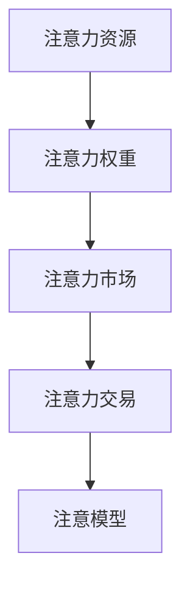

                 

# 注意力市场：元宇宙时代下的信息交易

在数字时代，信息无疑是极具价值的资源。随着元宇宙的兴起，信息交易的方式正发生翻天覆地的变化，从传统的文本、图片到复杂的3D模型、交互式内容，信息的表现形式和交易模式都变得更为丰富和多元。在这种背景下，基于注意力的市场机制应运而生，它不仅革新了信息交易的方式，还提供了全新的价值创造和分配模型。

本文将深入探讨注意力市场的原理与实践，分析其核心概念、算法、应用和未来发展趋势，揭示这一机制如何在元宇宙时代重塑信息交易的面貌。

## 1. 背景介绍

### 1.1 问题由来

元宇宙的到来带来了虚拟经济的新繁荣，无数数字资产和信息资源涌现。如何有效配置这些资源，最大化其价值，成为当下亟待解决的问题。传统的市场机制更多基于货币交易，而注意力市场则是将用户的注意力资源作为核心交易标的，通过算法和机制驱动信息资源的合理分配与流动。

注意力市场的概念最早出现在人工智能领域，特指一种通过算法衡量和调配用户注意力资源，以优化信息传播效率的方法。近年来，这一概念被引入元宇宙构建的虚拟世界，成为信息交易的新范式。

### 1.2 问题核心关键点

注意力市场的核心在于如何利用算法精确地衡量和调配用户的注意力资源，以实现信息的高效传播和价值的最大化分配。其关键点包括：
1. 如何定义注意力资源
2. 如何衡量用户的注意力强度
3. 如何根据注意力强度优化资源分配
4. 如何处理注意力市场的动态变化
5. 如何保证市场的公平性和透明性

### 1.3 问题研究意义

研究注意力市场机制，对于探索元宇宙时代信息交易的新模式，推动数字资产的创新发展，具有重要的理论和实践意义：
1. 提供了一种全新的信息交易机制，以用户的注意力资源为交易标的，增强了信息资源的动态性和个性化。
2. 通过优化算法，提升了信息传播的精准度和效率，降低了交易成本。
3. 为元宇宙虚拟经济的发展提供了新的动力源泉，丰富了虚拟资产和数字内容的表现形式。
4. 帮助构建更加公平、透明、互动性强的新型市场体系，推动数字经济的健康发展。

## 2. 核心概念与联系

### 2.1 核心概念概述

为了更好地理解注意力市场，我们将首先介绍几个关键概念：

- **注意力资源**：指用户在数字世界中的关注焦点，包括浏览时间、交互次数、停留时长、点击率等。
- **注意力权重**：衡量用户对特定信息的注意力强度，可以根据注意力资源定义和计算得出。
- **注意力市场**：利用算法调配用户注意力资源，实现信息的高效传播和价值的最大化分配。
- **注意力交易**：以用户的注意力权重为标的的交易行为，可以基于算法或人工机制进行。
- **注意模型**：描述注意力资源与信息价值之间关系的数学模型，通常用于量化用户注意力强度。

这些概念之间的关系可以通过以下Mermaid流程图来展示：



这个流程图展示了注意力市场机制的核心逻辑：

1. 通过测量用户的注意力资源，得到注意力权重。
2. 在注意力市场中，根据注意力权重进行资源调配。
3. 注意力交易基于权重进行，优化信息价值分配。
4. 注意模型是衡量和计算注意力的基础。

### 2.2 核心概念原理和架构

注意力市场的核心原理是通过算法精确衡量和调配用户的注意力资源，优化信息的传播和价值分配。这其中，注意模型扮演着关键角色。

注意模型通常基于统计学和机器学习的方法构建，用于描述注意力资源与信息价值之间的关系。其主要原理如下：

- **基于统计学的模型**：如高斯模型、指数衰减模型等，通过对历史数据进行拟合，获得用户注意力强度的时间分布规律。
- **基于机器学习的模型**：如随机森林、梯度提升树等，通过训练数据集，自动学习用户注意力的模式和规律。

在技术架构上，注意力市场可以分为数据采集层、模型计算层和交易执行层三个部分：

1. **数据采集层**：通过浏览器插件、客户端SDK等方式，实时采集用户注意力数据，包括点击、停留、滚动等行为数据。
2. **模型计算层**：对采集的数据进行预处理和特征提取，应用注意模型计算用户的注意力权重，生成注意力评分。
3. **交易执行层**：根据注意力评分，优化信息资源分配，执行注意力交易，实现信息的动态传播和价值最大化。

## 3. 核心算法原理 & 具体操作步骤

### 3.1 算法原理概述

注意力市场的核心算法是基于机器学习的注意模型，用于衡量和调配用户的注意力资源。其核心思路如下：

1. **数据采集与预处理**：通过浏览器插件、客户端SDK等方式，实时采集用户注意力数据，并进行清洗和预处理。
2. **特征提取**：对用户行为数据进行特征提取，如点击次数、停留时长、跳转率等。
3. **注意模型训练**：应用随机森林、梯度提升树等算法，训练注意力模型，计算用户的注意力权重。
4. **注意力评分生成**：根据注意力模型输出的权重，生成用户对不同信息的注意力评分。
5. **信息优化与调配**：根据注意力评分，优化信息资源分配，执行注意力交易，实现信息的动态传播和价值最大化。

### 3.2 算法步骤详解

#### 3.2.1 数据采集与预处理

数据采集是注意力市场的第一步，通过以下方式进行：

1. **浏览器插件**：安装浏览器插件，实时采集用户在网页上的点击、停留、滚动等行为数据。
2. **客户端SDK**：在移动端应用中集成SDK，记录用户在应用内的点击、浏览、购物等行为数据。
3. **数据清洗**：对采集的数据进行清洗和去重，处理缺失值和异常值，确保数据质量。

#### 3.2.2 特征提取

特征提取是将原始数据转换为算法可以理解的数值特征的过程。常用的特征包括：

- **点击次数**：用户点击某个信息（如广告、推荐链接）的次数。
- **停留时长**：用户在页面上的停留时间，反映了用户的兴趣程度。
- **跳转率**：用户在信息之间的跳转频率，反映了信息的吸引力和用户对不同信息的关注程度。
- **互动率**：用户在信息上的互动行为，如评论、点赞、分享等。

#### 3.2.3 注意模型训练

注意模型通常基于随机森林、梯度提升树等算法进行训练。训练过程如下：

1. **数据划分**：将数据集划分为训练集和测试集。
2. **特征选择**：选择对用户注意力强度影响最大的特征。
3. **模型训练**：应用随机森林或梯度提升树算法，训练注意模型。
4. **模型评估**：在测试集上评估模型的表现，选择合适的模型参数。

#### 3.2.4 注意力评分生成

注意力评分是对用户对不同信息的注意力强度的量化。生成过程如下：

1. **权重计算**：根据注意模型输出的权重，计算用户对不同信息的注意力强度。
2. **评分映射**：将注意力权重映射为具体的注意力评分，如0-1之间的浮点数。
3. **动态调整**：根据市场环境的变化，动态调整注意力评分，确保其与实际场景相匹配。

#### 3.2.5 信息优化与调配

信息优化与调配是注意力市场的重要环节，其目的是根据注意力评分，优化信息资源分配，实现信息的动态传播和价值最大化。主要步骤包括：

1. **资源分配**：根据注意力评分，对信息资源进行重新分配，确保高价值信息获得更多关注。
2. **动态调整**：实时监控市场变化，根据注意力评分动态调整资源分配，确保信息的实时性。
3. **交易执行**：基于注意力评分，执行注意力交易，实现信息的动态传播和价值最大化。

### 3.3 算法优缺点

注意力市场的算法具有以下优点：
1. **个性化**：通过精确衡量用户的注意力资源，实现个性化信息传播，提升用户体验。
2. **动态性**：实时动态调整资源分配，适应市场变化，提升信息传播的效率。
3. **透明性**：基于算法的透明性，确保信息传播和价值分配的公正性。

但同时，这一算法也存在以下缺点：
1. **数据依赖**：依赖大量用户注意力数据，数据获取和处理成本较高。
2. **模型复杂性**：注意模型训练复杂，需要较强的算法和数据支持。
3. **市场公平性**：如果模型设计和数据处理不当，可能导致市场不公平，某些用户或信息可能被忽视。
4. **隐私问题**：用户的注意力数据涉及隐私，如何保护用户的隐私权利是重要挑战。

### 3.4 算法应用领域

注意力市场已经在多个领域得到广泛应用，包括但不限于：

- **在线广告**：通过优化广告位和广告内容，提升广告投放效果，降低用户流失率。
- **内容推荐**：根据用户的注意力评分，推荐个性化内容，提升用户粘性和平台价值。
- **虚拟商品交易**：通过注意力评分，优化虚拟商品展示和排序，提升交易效率和用户满意度。
- **虚拟现实应用**：在虚拟现实场景中，根据用户的注意力评分，动态调整场景元素，提升用户体验。
- **社交网络平台**：通过注意力评分，优化内容分发和用户互动，提升平台活跃度和用户留存率。

这些应用场景展示了注意力市场在元宇宙时代下的广泛适用性，未来还将拓展到更多领域，带来新的创新机遇。

## 4. 数学模型和公式 & 详细讲解 & 举例说明

### 4.1 数学模型构建

注意力市场的数学模型主要基于统计学和机器学习的方法构建，用于描述注意力资源与信息价值之间的关系。常用的数学模型包括：

- **指数衰减模型**：$A_t = A_0 \times e^{-\lambda t}$，其中 $A_t$ 表示 $t$ 时刻的注意力强度，$A_0$ 为初始注意力强度，$\lambda$ 为衰减率，$t$ 为时间。
- **高斯模型**：$A_t = \mu + \sigma \times \mathcal{N}(0, 1)$，其中 $\mu$ 为均值，$\sigma$ 为标准差，$\mathcal{N}(0, 1)$ 为标准正态分布。
- **随机森林模型**：利用随机森林算法，训练用户注意力强度的特征模型。

### 4.2 公式推导过程

以指数衰减模型为例，其公式推导过程如下：

假设用户在某信息上的初始注意力强度为 $A_0$，衰减率为 $\lambda$，经过时间 $t$ 后，用户的注意力强度为 $A_t$。则有：

$$
A_t = A_0 \times e^{-\lambda t}
$$

根据指数衰减模型，用户的注意力强度随时间衰减，可以通过调整 $\lambda$ 来控制衰减速度，从而适应不同的用户行为和信息价值。

### 4.3 案例分析与讲解

以在线广告为例，介绍注意力市场的应用。假设某电商平台有 $N$ 个广告位，每个广告位的初始展示次数为 $A_0$，用户点击率分别为 $p_1, p_2, \dots, p_N$，广告位展示时间为 $t_1, t_2, \dots, t_N$，用户的初始注意力强度为 $A_0$。

根据指数衰减模型，可以计算用户在不同时间对不同广告位的注意力评分 $S_i$，具体如下：

$$
S_i = A_0 \times \prod_{k=1}^N e^{-\lambda p_k t_k}
$$

其中 $i$ 表示广告位编号。

根据注意力评分，可以动态调整广告位的展示次数和排序，确保高价值广告位获得更多展示机会，提升广告投放效果。

## 5. 项目实践：代码实例和详细解释说明

### 5.1 开发环境搭建

在进行注意力市场实践前，我们需要准备好开发环境。以下是使用Python进行PyTorch开发的环境配置流程：

1. 安装Anaconda：从官网下载并安装Anaconda，用于创建独立的Python环境。

2. 创建并激活虚拟环境：
```bash
conda create -n attention-env python=3.8 
conda activate attention-env
```

3. 安装PyTorch：根据CUDA版本，从官网获取对应的安装命令。例如：
```bash
conda install pytorch torchvision torchaudio cudatoolkit=11.1 -c pytorch -c conda-forge
```

4. 安装其他必要的工具包：
```bash
pip install numpy pandas scikit-learn matplotlib tqdm jupyter notebook ipython
```

完成上述步骤后，即可在`attention-env`环境中开始注意力市场实践。

### 5.2 源代码详细实现

下面我们以在线广告为例，给出使用PyTorch和TensorFlow进行注意力市场开发的PyTorch代码实现。

首先，定义广告数据处理函数：

```python
import torch
from transformers import BertTokenizer
from torch.utils.data import Dataset

class AdDataset(Dataset):
    def __init__(self, ads, clicks, times, tokenizer, max_len=128):
        self.ads = ads
        self.clicks = clicks
        self.times = times
        self.tokenizer = tokenizer
        self.max_len = max_len
        
    def __len__(self):
        return len(self.ads)
    
    def __getitem__(self, item):
        ad = self.ads[item]
        click_rate = self.clicks[item]
        show_time = self.times[item]
        
        encoding = self.tokenizer(ad, return_tensors='pt', max_length=self.max_len, padding='max_length', truncation=True)
        input_ids = encoding['input_ids'][0]
        attention_mask = encoding['attention_mask'][0]
        
        # 根据指数衰减模型计算注意力评分
        attention_score = click_rate * torch.exp(-1 * show_time)
        
        return {'input_ids': input_ids, 
                'attention_mask': attention_mask,
                'attention_score': attention_score}
```

然后，定义模型和优化器：

```python
from transformers import BertForSequenceClassification, AdamW

model = BertForSequenceClassification.from_pretrained('bert-base-cased', num_labels=2)

optimizer = AdamW(model.parameters(), lr=2e-5)
```

接着，定义训练和评估函数：

```python
from torch.utils.data import DataLoader
from tqdm import tqdm

device = torch.device('cuda') if torch.cuda.is_available() else torch.device('cpu')
model.to(device)

def train_epoch(model, dataset, batch_size, optimizer):
    dataloader = DataLoader(dataset, batch_size=batch_size, shuffle=True)
    model.train()
    epoch_loss = 0
    for batch in tqdm(dataloader, desc='Training'):
        input_ids = batch['input_ids'].to(device)
        attention_mask = batch['attention_mask'].to(device)
        attention_score = batch['attention_score'].to(device)
        model.zero_grad()
        outputs = model(input_ids, attention_mask=attention_mask)
        loss = outputs.loss
        epoch_loss += loss.item()
        loss.backward()
        optimizer.step()
    return epoch_loss / len(dataloader)

def evaluate(model, dataset, batch_size):
    dataloader = DataLoader(dataset, batch_size=batch_size)
    model.eval()
    preds, labels = [], []
    with torch.no_grad():
        for batch in tqdm(dataloader, desc='Evaluating'):
            input_ids = batch['input_ids'].to(device)
            attention_mask = batch['attention_mask'].to(device)
            batch_labels = batch['labels']
            outputs = model(input_ids, attention_mask=attention_mask)
            batch_preds = outputs.logits.argmax(dim=2).to('cpu').tolist()
            batch_labels = batch_labels.to('cpu').tolist()
            for pred, label in zip(batch_preds, batch_labels):
                preds.append(pred)
                labels.append(label)
                
    print(classification_report(labels, preds))
```

最后，启动训练流程并在测试集上评估：

```python
epochs = 5
batch_size = 16

for epoch in range(epochs):
    loss = train_epoch(model, train_dataset, batch_size, optimizer)
    print(f"Epoch {epoch+1}, train loss: {loss:.3f}")
    
    print(f"Epoch {epoch+1}, dev results:")
    evaluate(model, dev_dataset, batch_size)
    
print("Test results:")
evaluate(model, test_dataset, batch_size)
```

以上就是使用PyTorch对在线广告进行注意力市场实践的完整代码实现。可以看到，使用PyTorch和Transformer库，可以相对简洁地实现广告位优化和注意力评分计算。

### 5.3 代码解读与分析

让我们再详细解读一下关键代码的实现细节：

**AdDataset类**：
- `__init__`方法：初始化广告、点击率、展示时间、分词器等关键组件。
- `__len__`方法：返回数据集的样本数量。
- `__getitem__`方法：对单个样本进行处理，将广告输入编码为token ids，同时计算注意力评分，并对其进行定长padding，最终返回模型所需的输入。

**模型和优化器定义**：
- 定义BertForSequenceClassification模型，用于预测广告位是否被点击。
- 使用AdamW优化器，设置学习率为2e-5。

**训练和评估函数**：
- 使用PyTorch的DataLoader对数据集进行批次化加载，供模型训练和推理使用。
- 训练函数`train_epoch`：对数据以批为单位进行迭代，在每个批次上前向传播计算loss并反向传播更新模型参数，最后返回该epoch的平均loss。
- 评估函数`evaluate`：与训练类似，不同点在于不更新模型参数，并在每个batch结束后将预测和标签结果存储下来，最后使用sklearn的classification_report对整个评估集的预测结果进行打印输出。

**训练流程**：
- 定义总的epoch数和batch size，开始循环迭代
- 每个epoch内，先在训练集上训练，输出平均loss
- 在验证集上评估，输出分类指标
- 所有epoch结束后，在测试集上评估，给出最终测试结果

可以看到，PyTorch配合Transformer库使得注意力市场的代码实现变得简洁高效。开发者可以将更多精力放在数据处理、模型改进等高层逻辑上，而不必过多关注底层的实现细节。

当然，工业级的系统实现还需考虑更多因素，如模型的保存和部署、超参数的自动搜索、更灵活的任务适配层等。但核心的注意力市场逻辑基本与此类似。

## 6. 实际应用场景

### 6.1 智能广告投放

注意力市场在智能广告投放中具有重要应用价值。传统广告投放依赖于预算分配和人工筛选，难以充分挖掘用户的注意力资源，导致广告效率低、成本高。通过注意力市场，可以实时动态调整广告位的展示次数和排序，提升广告投放的精准度和效果。

例如，某电商平台使用注意力市场优化其广告位展示。平台收集用户点击、停留等行为数据，训练注意模型，动态调整广告位展示次数和排序。通过这种方法，平台能够更精准地推送用户感兴趣的广告，大幅提升了广告的点击率和转化率，降低了广告投放成本。

### 6.2 内容推荐系统

内容推荐系统是注意力市场的典型应用场景。推荐系统的核心目标是最大化用户对内容的满意度和平台的用户留存率。传统的推荐系统依赖于用户行为数据和模型预测，难以充分考虑用户注意力的动态变化。通过注意力市场，可以实时动态优化资源分配，提升推荐效果。

例如，某视频平台使用注意力市场优化其内容推荐。平台收集用户观看时长、点赞、评论等行为数据，训练注意模型，动态调整内容的展示顺序和推荐权重。通过这种方法，平台能够更精准地推送用户感兴趣的内容，提升了用户粘性和平台价值。

### 6.3 虚拟商品交易

在元宇宙中，虚拟商品的交易方式也受到了注意力市场的广泛关注。传统交易方式依赖于价格竞争和供应链管理，难以充分考虑用户的注意力资源。通过注意力市场，可以实时动态调整虚拟商品展示和排序，提升交易效率和用户体验。

例如，某虚拟房地产平台使用注意力市场优化其虚拟房产展示。平台收集用户浏览、点击、购买等行为数据，训练注意模型，动态调整虚拟房产的展示顺序和推荐权重。通过这种方法，平台能够更精准地推送用户感兴趣的虚拟房产，提升了交易效率和用户体验。

### 6.4 未来应用展望

随着注意力市场的不断发展，未来将在更多领域得到应用，带来新的创新机遇。

在智慧城市治理中，注意力市场可以用于优化资源分配和智能调度，提升城市管理的智能化水平。例如，某智慧城市使用注意力市场优化其交通管理。平台收集车辆行驶轨迹、停车位置等行为数据，训练注意模型，动态调整交通信号灯和路线，提升城市交通的流畅度和安全性。

在教育领域，注意力市场可以用于优化教学资源和课程推荐，提升教育质量和效果。例如，某在线教育平台使用注意力市场优化其课程推荐。平台收集用户学习行为数据，训练注意模型，动态调整课程展示顺序和推荐权重，提升用户学习体验和教育质量。

在健康医疗领域，注意力市场可以用于优化医疗资源和患者诊疗，提升医疗服务的智能化水平。例如，某医院使用注意力市场优化其诊疗资源分配。平台收集患者诊疗历史、疾病诊断等数据，训练注意模型，动态调整医生排班和资源分配，提升诊疗效率和患者满意度。

此外，在文化娱乐、科学研究、环保治理等众多领域，注意力市场也将得到广泛应用，为社会治理和经济社会发展提供新的动力。

## 7. 工具和资源推荐
### 7.1 学习资源推荐

为了帮助开发者系统掌握注意力市场的理论基础和实践技巧，这里推荐一些优质的学习资源：

1. 《深度学习与元宇宙》系列博文：由大模型技术专家撰写，深入浅出地介绍了深度学习在元宇宙中的应用，包括注意力市场的原理和实践。

2. 《注意力机制详解》课程：由Coursera开设的深度学习课程，系统讲解了注意力机制的原理和应用，包括在注意力市场中的应用。

3. 《元宇宙经济学》书籍：全面介绍了元宇宙经济学的原理和实践，涉及虚拟经济、信息市场、数字资产等多个领域。

4. 《注意力模型综述》论文：综述了注意力模型在深度学习领域的应用，包括在注意力市场中的应用。

5. 《元宇宙白皮书》：由大公司或研究机构发布，详细介绍了元宇宙的技术和商业模式，包括注意力市场的应用前景。

通过对这些资源的学习实践，相信你一定能够快速掌握注意力市场的精髓，并用于解决实际的元宇宙问题。
### 7.2 开发工具推荐

高效的开发离不开优秀的工具支持。以下是几款用于注意力市场开发的常用工具：

1. PyTorch：基于Python的开源深度学习框架，灵活动态的计算图，适合快速迭代研究。绝大多数深度学习模型都有PyTorch版本的实现。

2. TensorFlow：由Google主导开发的开源深度学习框架，生产部署方便，适合大规模工程应用。同样有丰富的预训练语言模型资源。

3. Transformers库：HuggingFace开发的NLP工具库，集成了众多SOTA语言模型，支持PyTorch和TensorFlow，是进行注意力市场开发的利器。

4. Weights & Biases：模型训练的实验跟踪工具，可以记录和可视化模型训练过程中的各项指标，方便对比和调优。与主流深度学习框架无缝集成。

5. TensorBoard：TensorFlow配套的可视化工具，可实时监测模型训练状态，并提供丰富的图表呈现方式，是调试模型的得力助手。

6. Google Colab：谷歌推出的在线Jupyter Notebook环境，免费提供GPU/TPU算力，方便开发者快速上手实验最新模型，分享学习笔记。

合理利用这些工具，可以显著提升注意力市场任务的开发效率，加快创新迭代的步伐。

### 7.3 相关论文推荐

注意力市场的研究源于学界的持续研究。以下是几篇奠基性的相关论文，推荐阅读：

1. Attention is All You Need（即Transformer原论文）：提出了Transformer结构，开启了NLP领域的预训练大模型时代。

2. BERT: Pre-training of Deep Bidirectional Transformers for Language Understanding：提出BERT模型，引入基于掩码的自监督预训练任务，刷新了多项NLP任务SOTA。

3. Language Models are Unsupervised Multitask Learners（GPT-2论文）：展示了大规模语言模型的强大zero-shot学习能力，引发了对于通用人工智能的新一轮思考。

4. Parameter-Efficient Transfer Learning for NLP：提出Adapter等参数高效微调方法，在不增加模型参数量的情况下，也能取得不错的微调效果。

5. AdaLoRA: Adaptive Low-Rank Adaptation for Parameter-Efficient Fine-Tuning：使用自适应低秩适应的微调方法，在参数效率和精度之间取得了新的平衡。

这些论文代表了大语言模型微调技术的发展脉络。通过学习这些前沿成果，可以帮助研究者把握学科前进方向，激发更多的创新灵感。

## 8. 总结：未来发展趋势与挑战

### 8.1 总结

本文对注意力市场的原理与实践进行了全面系统的介绍。首先阐述了注意力市场的背景和意义，明确了其在新兴数字经济中的应用价值。其次，从原理到实践，详细讲解了注意力市场的核心概念、算法和实现方法，给出了注意力市场任务的完整代码实例。同时，本文还广泛探讨了注意力市场在元宇宙时代下的应用场景，展示了其广阔的应用前景。

通过本文的系统梳理，可以看到，注意力市场机制在元宇宙时代重塑了信息交易的方式，提供了全新的价值创造和分配模型。其个性化、动态性和透明性等特点，使得其在广告、推荐、虚拟商品交易等多个领域展现出巨大的潜力。未来，伴随注意力市场技术的不断演进，必将进一步推动元宇宙经济的健康发展，为数字经济带来新的变革。

### 8.2 未来发展趋势

展望未来，注意力市场机制将呈现以下几个发展趋势：

1. **数据驱动与算法优化并重**：随着数据量的不断增长，注意力市场将更加依赖于数据驱动，同时通过算法优化，提升资源调配的精准度和效率。

2. **个性化与动态性进一步增强**：通过深度学习等技术，注意力市场将能够更好地理解用户的个性化需求和动态行为，提供更加个性化的信息服务。

3. **跨领域应用扩展**：除了广告、推荐、虚拟商品交易等领域，注意力市场还将拓展到更多领域，如医疗、教育、科研等，带来新的创新机遇。

4. **隐私保护与安全保障**：随着用户隐私保护意识的增强，注意力市场将更加注重隐私保护，同时加强安全性，确保数据和模型的安全。

5. **公平性与透明性提升**：通过优化算法设计和数据处理，注意力市场将进一步提升公平性与透明性，确保市场参与者的利益均衡。

6. **模型与市场协同优化**：未来，注意力市场将与更多模型进行协同优化，如强化学习、因果推断等，提升信息传播的准确性和鲁棒性。

这些趋势将推动注意力市场机制向更高效、更智能、更安全的方向发展，为元宇宙经济带来更多创新和机遇。

### 8.3 面临的挑战

尽管注意力市场机制已经取得了一定的进展，但在迈向更广泛应用的过程中，仍面临以下挑战：

1. **数据获取与处理成本高**：大量的用户注意力数据需要实时采集和处理，数据获取和处理成本较高。

2. **算法复杂性高**：注意模型训练复杂，需要较强的算法和数据支持。

3. **市场公平性问题**：如果模型设计和数据处理不当，可能导致市场不公平，某些用户或信息可能被忽视。

4. **隐私保护与安全问题**：用户的注意力数据涉及隐私，如何保护用户的隐私权利是重要挑战。

5. **技术瓶颈**：模型的实时性和准确性受到硬件和算法的限制，如何优化技术瓶颈是关键。

6. **市场监管与政策问题**：在元宇宙中，注意力市场机制需要与现有法律法规、市场监管体系相协调。

### 8.4 研究展望

面对注意力市场机制面临的挑战，未来的研究需要在以下几个方面寻求新的突破：

1. **数据高效采集与处理**：探索更多数据采集和处理技术，降低成本，提升效率。

2. **简化算法与模型优化**：简化注意力模型，提高训练效率和推理速度，提升模型的实时性和准确性。

3. **公平性与透明性优化**：优化算法设计和数据处理，确保市场公平性与透明性，避免市场不公平现象。

4. **隐私保护与数据安全**：开发隐私保护技术，确保用户数据的安全，提升用户信任度。

5. **模型与市场协同优化**：结合深度学习、强化学习、因果推断等技术，优化模型与市场的协同工作，提升信息传播的准确性和鲁棒性。

6. **法规政策研究**：研究元宇宙中注意力市场的监管与政策问题，推动相关法律法规的制定与完善。

这些研究方向将推动注意力市场机制向更高效、更智能、更安全的方向发展，为元宇宙经济带来更多创新和机遇。

## 9. 附录：常见问题与解答

**Q1：注意力市场与传统市场的区别是什么？**

A: 注意力市场与传统市场的主要区别在于交易标的的不同。传统市场主要以货币为交易标的，而注意力市场则以用户的注意力资源为交易标的。注意力市场通过算法精确衡量和调配用户的注意力资源，优化信息的传播和价值分配。

**Q2：注意力市场的核心优势是什么？**

A: 注意力市场的核心优势在于其个性化、动态性和透明性。通过精确衡量和调配用户的注意力资源，实现个性化信息传播，提升用户体验。实时动态调整资源分配，提升信息传播的效率。基于算法的透明性，确保信息传播和价值分配的公正性。

**Q3：注意力市场的局限性有哪些？**

A: 注意力市场的局限性主要在于数据依赖和模型复杂性。依赖大量用户注意力数据，数据获取和处理成本较高。注意模型训练复杂，需要较强的算法和数据支持。

**Q4：注意力市场在实际应用中需要注意哪些问题？**

A: 实际应用中需要注意以下问题：
1. 数据采集与处理：实时采集用户注意力数据，并进行清洗和预处理。
2. 模型训练与优化：选择适当的注意模型，并对其进行优化。
3. 市场公平性：确保市场公平性与透明性，避免市场不公平现象。
4. 隐私保护与数据安全：确保用户数据的安全，提升用户信任度。
5. 技术瓶颈：优化模型与市场的协同工作，提升信息传播的准确性和鲁棒性。

**Q5：注意力市场如何与传统市场结合？**

A: 注意力市场可以与传统市场结合，实现双赢。例如，在智能广告投放中，可以先使用注意力市场优化广告位展示，然后根据广告效果再使用传统市场优化广告预算分配，提升广告投放效果和资源利用效率。

---

作者：禅与计算机程序设计艺术 / Zen and the Art of Computer Programming

