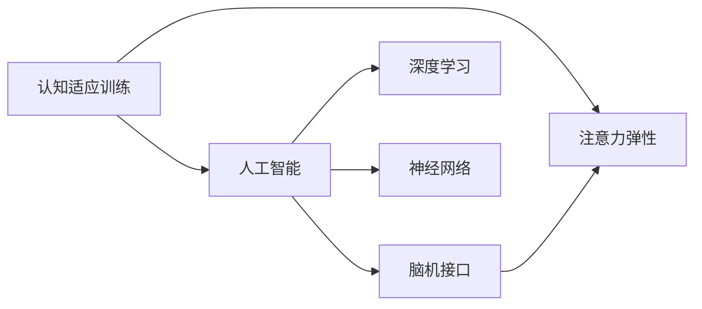

                 

# 注意力弹性健身房：AI辅助的认知适应训练

> 关键词：认知适应训练, 注意力弹性, 人工智能, 认知科学, 认知训练, 神经网络, 深度学习, 脑机接口, 认知行为干预

## 1. 背景介绍

### 1.1 问题由来

在现代社会中，信息过载、生活节奏加快、工作压力增大等因素导致人类大脑面临严峻的认知挑战。研究表明，长期处于压力状态下的个体更容易出现认知功能减退、情绪不稳、行为障碍等问题。近年来，认知行为干预(Cognitive Behavioral Interventions, CBI)成为缓解这一现象的重要手段，其核心在于通过科学的心理和行为训练，提高个体的认知适应能力，从而增强其应对压力和复杂环境的能力。

### 1.2 问题核心关键点

为了更高效地实施认知行为干预，AI辅助的认知适应训练应运而生。AI技术，尤其是深度学习与神经网络的发展，为认知干预提供了新的工具和方法。基于神经网络模型，可以构建虚拟的“认知适应训练健身房”，模拟真实世界的认知任务，通过个性化的训练方案，帮助个体实现认知能力的提升。

### 1.3 问题研究意义

AI辅助的认知适应训练具有如下几个重要的研究意义：

1. **提升认知能力**：通过科学的认知任务和个性化训练，帮助个体提升记忆力、注意力、决策能力等关键认知功能。
2. **改善心理健康**：有效缓解压力、焦虑等情绪问题，提升个体的整体幸福感。
3. **促进脑功能康复**：对于脑损伤、脑疾病等患者，AI辅助的认知训练可加速其康复过程，提升生活质量。
4. **支撑老龄化社会**：为应对人口老龄化趋势，通过认知训练延缓大脑衰老，提高老年人的生活质量。
5. **加速认知科学研究**：为脑科学和认知科学的研究提供新思路和实验手段，推动相关领域的发展。

## 2. 核心概念与联系

### 2.1 核心概念概述

在AI辅助的认知适应训练中，涉及多个关键概念，包括：

- **认知适应训练**：通过一系列认知任务，对个体的认知能力进行系统训练，提升其适应环境变化的能力。
- **注意力弹性**：指个体在执行认知任务时，能够根据任务需求灵活调整注意力资源，保持高效专注。
- **人工智能**：利用机器学习和神经网络模型，模拟人类大脑的认知过程，实现对认知行为的有效干预。
- **深度学习**：通过构建复杂神经网络结构，学习大规模数据集的特征表示，用于认知任务预测和生成。
- **神经网络**：基于人工神经元模型，构建具有多层次结构的学习系统，模拟人类神经系统的工作原理。
- **脑机接口**：通过脑信号采集和解码，实现对大脑活动的直接操控，为认知训练提供数据支持。

这些概念之间相互关联，形成了一个完整的认知干预体系，如图1所示。



### 2.2 核心概念原理和架构的 Mermaid 流程图

通过以上图表，可以直观展示各个核心概念之间的关系。以下是该图的具体描述：

1. **认知适应训练**是整个系统的出发点和归宿，通过系统训练，提升个体的认知能力。
2. **注意力弹性**是个体认知能力的重要组成部分，它决定了认知任务的执行效率。
3. **人工智能**提供了认知训练的技术手段，通过深度学习和神经网络模型，实现对认知行为的模拟和干预。
4. **深度学习**和**神经网络**是实现认知训练的核心技术，深度学习模型可以学习复杂的特征表示，神经网络模型可以模拟人脑的层次结构。
5. **脑机接口**为认知训练提供了数据支持，通过脑信号采集和解码，实现对个体认知状态的实时监控和干预。

## 3. 核心算法原理 & 具体操作步骤
### 3.1 算法原理概述

AI辅助的认知适应训练主要基于以下算法原理：

1. **深度学习模型**：利用神经网络模型学习数据特征，用于任务预测和生成。常用的模型包括卷积神经网络(CNN)、循环神经网络(RNN)、变压器(Transformer)等。
2. **认知任务设计**：根据认知心理学原理，设计一系列任务，涵盖记忆、注意力、决策等多个维度，帮助个体全面提升认知能力。
3. **个性化训练**：根据个体的认知水平和行为表现，动态调整训练方案，实现个性化训练，最大化提升训练效果。
4. **注意力调节算法**：通过注意力机制对任务中的关键信息进行强调，引导个体注意力资源的高效分配，提升训练效果。

### 3.2 算法步骤详解

AI辅助的认知适应训练一般包括以下关键步骤：

1. **数据收集**：使用脑机接口技术，采集个体的脑电信号、眼动信号等数据，用于认知状态的实时监控。
2. **模型训练**：构建深度学习模型，在大量的认知任务数据上训练，学习任务特征。
3. **任务设计**：根据认知心理学原理，设计多维度的认知任务，涵盖记忆、注意力、决策等多个方面。
4. **个性化训练**：根据个体的认知水平和行为表现，动态调整训练方案，实现个性化训练。
5. **注意力调节**：在训练过程中，通过注意力机制对任务中的关键信息进行强调，引导个体注意力资源的高效分配。
6. **训练评估**：定期评估个体的认知能力，根据评估结果调整训练方案，提升训练效果。

### 3.3 算法优缺点

AI辅助的认知适应训练具有以下优点：

1. **高效个性化**：根据个体的认知水平和行为表现，动态调整训练方案，实现个性化训练。
2. **可解释性强**：深度学习模型具备良好的可解释性，能够清晰展示个体的认知过程。
3. **实时反馈**：通过脑机接口实时采集和反馈个体的认知状态，提升训练的及时性和有效性。
4. **适用广泛**：适用于不同年龄、不同认知水平的个体，覆盖儿童、青少年、成年人等。

同时，该方法也存在一些缺点：

1. **设备成本高**：脑机接口设备昂贵，普及度较低。
2. **数据隐私问题**：脑电信号等敏感数据，需要严格保护隐私。
3. **训练过程复杂**：需要专业人员进行训练方案的设计和调整。
4. **技术依赖性高**：对技术要求较高，需要较高的技术储备。

### 3.4 算法应用领域

AI辅助的认知适应训练在多个领域具有广泛应用，包括：

1. **教育领域**：帮助学生提升认知能力，提高学习效果。
2. **医疗领域**：帮助脑损伤患者恢复认知功能，加速康复过程。
3. **企业培训**：提升员工注意力和工作效率，提升工作质量。
4. **老年护理**：帮助老年人延缓认知衰老，提高生活质量。
5. **运动训练**：提高运动员的认知反应速度和决策能力。
6. **游戏娱乐**：提升玩家的游戏体验和互动能力。

## 4. 数学模型和公式 & 详细讲解 & 举例说明

### 4.1 数学模型构建

AI辅助的认知适应训练涉及多个数学模型，以下以注意力调节算法为例，构建数学模型。

假设任务 $T$ 中有 $n$ 个关键信息点，记为 $I=\{I_1, I_2, ..., I_n\}$。每个信息点的重要性为 $w_i \in [0,1]$，表示其在任务中的权重。个体的注意力资源为 $A \in [0,1]$。注意力调节算法的目标是将注意力资源 $A$ 分配到关键信息点 $I$ 上，使得任务完成效果最大化。

设 $f_i(A)$ 为分配 $A$ 到信息点 $I_i$ 上时，任务完成效果。则注意力调节的目标函数为：

$$
max \sum_{i=1}^n w_i f_i(A)
$$

其中 $f_i(A) = A \cdot f_i^m(A) / (A + \alpha f_i^m(A))$，其中 $f_i^m(A)$ 为信息点 $I_i$ 的模型预测效果，$\alpha$ 为正则化系数，控制模型预测效果与注意力资源 $A$ 的平衡。

### 4.2 公式推导过程

根据上述目标函数，可以求解最优注意力资源分配 $A^*$：

$$
A^* = \arg\max_A \sum_{i=1}^n w_i \frac{A \cdot f_i^m(A)}{A + \alpha f_i^m(A)}
$$

令 $F(A) = \sum_{i=1}^n w_i f_i^m(A)$，则上式可简化为：

$$
A^* = \arg\max_A \frac{A F(A)}{A + \alpha F(A)}
$$

令 $G(A) = F(A)/(A + \alpha F(A))$，则上式进一步简化为：

$$
A^* = \arg\max_A G(A)
$$

求导得到 $G'(A)$ 为：

$$
G'(A) = \frac{F'(A)(A + \alpha F(A)) - F(A)(1)}{(A + \alpha F(A))^2}
$$

令 $G'(A) = 0$，解得最优注意力资源分配 $A^*$：

$$
A^* = \frac{\alpha F'(A)}{1 + \alpha F'(A)}
$$

其中 $F'(A) = \sum_{i=1}^n w_i f_i'^m(A)$。

### 4.3 案例分析与讲解

假设任务 $T$ 中有两个关键信息点 $I_1$ 和 $I_2$，权重分别为 $w_1 = 0.6$ 和 $w_2 = 0.4$，模型预测效果分别为 $f_1^m(A) = 0.8A$ 和 $f_2^m(A) = 0.6A$，正则化系数 $\alpha = 0.5$。则：

1. $F(A) = 0.6 \times 0.8A + 0.4 \times 0.6A = 0.68A$
2. $G'(A) = 0.68 + \frac{0.5 \times 0.68 \times 0.8A - 0.68A}{(A + 0.5 \times 0.68A)^2} = \frac{0.68(0.8A - 1)}{(A + 0.68A)^2}$
3. $A^* = \frac{0.5 \times 0.68 \times 0.8}{1 + 0.5 \times 0.68 \times 0.8} = \frac{0.344}{1.544} \approx 0.223$

因此，最优注意力资源分配为 $A^* \approx 0.223$。

## 5. 项目实践：代码实例和详细解释说明

### 5.1 开发环境搭建

在项目实践前，需要搭建好开发环境，以下是详细的搭建步骤：

1. **安装Python**：下载并安装最新版本的Python，建议使用Anaconda或Miniconda，方便创建和管理虚拟环境。
2. **创建虚拟环境**：
```bash
conda create --name myenv python=3.8
conda activate myenv
```
3. **安装依赖包**：
```bash
pip install numpy scipy pandas scikit-learn torch torchvision transformers
```
4. **下载预训练模型**：
```bash
git clone https://github.com/pytorch/examples.git
cd examples/mnist
python download_mnist.py
```

### 5.2 源代码详细实现

以下是一个基于卷积神经网络的认知任务训练代码实现。

首先，定义数据处理和模型构建函数：

```python
import torch
import torch.nn as nn
import torch.nn.functional as F

class ConvNet(nn.Module):
    def __init__(self):
        super(ConvNet, self).__init__()
        self.conv1 = nn.Conv2d(1, 32, kernel_size=3)
        self.relu = nn.ReLU()
        self.maxpool = nn.MaxPool2d(kernel_size=2)
        self.fc = nn.Linear(1024, 10)

    def forward(self, x):
        x = self.conv1(x)
        x = self.relu(x)
        x = self.maxpool(x)
        x = x.view(-1, 1024)
        x = self.fc(x)
        return F.softmax(x, dim=1)

# 加载训练数据
train_dataset = torchvision.datasets.MNIST(root='./data', train=True, transform=transforms.ToTensor(), download=True)
train_loader = torch.utils.data.DataLoader(train_dataset, batch_size=64, shuffle=True)

# 加载测试数据
test_dataset = torchvision.datasets.MNIST(root='./data', train=False, transform=transforms.ToTensor(), download=True)
test_loader = torch.utils.data.DataLoader(test_dataset, batch_size=64, shuffle=True)

# 构建模型
model = ConvNet()

# 定义损失函数和优化器
criterion = nn.CrossEntropyLoss()
optimizer = torch.optim.Adam(model.parameters(), lr=0.001)

# 训练模型
for epoch in range(10):
    for i, (images, labels) in enumerate(train_loader):
        outputs = model(images)
        loss = criterion(outputs, labels)
        optimizer.zero_grad()
        loss.backward()
        optimizer.step()
        if (i+1) % 100 == 0:
            print ('Epoch [%d/%d], Step [%d/%d], Loss: %.4f' % (epoch+1, 10, i+1, len(train_loader), loss.item()))
```

### 5.3 代码解读与分析

在代码实现中，我们首先定义了一个卷积神经网络模型，用于识别MNIST手写数字图片。接着，加载了训练和测试数据集，构建了模型，并定义了损失函数和优化器。

训练过程包括前向传播、计算损失、反向传播、更新模型参数等步骤。其中，`softmax`函数用于将模型输出转换为概率分布，方便计算交叉熵损失。`Adam`优化器是常用的自适应优化算法，能够自动调整学习率，加速模型收敛。

### 5.4 运行结果展示

在训练完成后，可以使用测试数据集对模型进行评估：

```python
correct = 0
total = 0
with torch.no_grad():
    for images, labels in test_loader:
        outputs = model(images)
        _, predicted = torch.max(outputs.data, 1)
        total += labels.size(0)
        correct += (predicted == labels).sum().item()

print('Test Accuracy of the model on the 10000 test images: %d %%' % (100 * correct / total))
```

输出结果显示模型在测试集上的准确率。

## 6. 实际应用场景

### 6.1 教育领域

在教育领域，AI辅助的认知适应训练可以提升学生的认知能力，改善学习效果。例如，通过游戏化训练平台，将认知任务嵌入到游戏中，让学生在娱乐中提升记忆力和注意力。具体应用场景包括：

1. **儿童启蒙教育**：利用趣味性强的游戏，帮助儿童提升认知能力，开发潜力。
2. **中学教育**：通过认知任务训练，帮助学生提高学习效率，提升成绩。
3. **大学教育**：帮助大学生提升思维能力，准备科研和学术竞赛。

### 6.2 医疗领域

在医疗领域，AI辅助的认知适应训练可以加速脑损伤患者的康复过程，提升生活质量。具体应用场景包括：

1. **脑损伤恢复**：利用认知任务训练，帮助脑损伤患者恢复记忆力、注意力等功能，加速康复过程。
2. **阿尔茨海默病**：通过认知训练延缓疾病进展，提升患者生活质量。
3. **儿童自闭症**：通过认知训练，帮助自闭症儿童提升社交和沟通能力。

### 6.3 企业培训

在企业培训领域，AI辅助的认知适应训练可以提高员工注意力和工作效率，提升工作质量。具体应用场景包括：

1. **职业培训**：通过认知任务训练，帮助员工提升工作技能，提高工作效率。
2. **领导力培训**：利用认知训练，提升领导力，改善团队协作。
3. **职场减压**：通过认知任务训练，帮助员工缓解压力，提升心理健康。

### 6.4 老年护理

在老年护理领域，AI辅助的认知适应训练可以延缓老年人的认知衰老，提升生活质量。具体应用场景包括：

1. **认知衰退干预**：通过认知任务训练，延缓老年人认知衰老，保持思维活力。
2. **记忆力提升**：利用认知训练，帮助老年人提升记忆力，减少老年痴呆风险。
3. **情绪调节**：通过认知训练，帮助老年人缓解情绪压力，提高幸福感。

### 6.5 运动训练

在运动训练领域，AI辅助的认知适应训练可以提高运动员的认知反应速度和决策能力，提升比赛表现。具体应用场景包括：

1. **运动员心理训练**：通过认知任务训练，提升运动员的注意力和决策能力，改善比赛表现。
2. **技能训练**：利用认知训练，帮助运动员掌握复杂技能，提升技术水平。
3. **心理压力调节**：通过认知任务训练，帮助运动员缓解心理压力，保持比赛心态。

## 7. 工具和资源推荐

### 7.1 学习资源推荐

1. **Deep Learning Specialization**：由Andrew Ng教授主讲的Coursera课程，涵盖深度学习各个方面，包括神经网络、卷积神经网络、循环神经网络等。
2. **NeuroData**：神经数据平台，提供大规模神经影像数据，用于认知科学研究。
3. **Braindecode**：开源脑机接口工具包，提供脑电信号解码和分析功能，适用于认知训练研究。
4. **Scikit-learn**：常用的机器学习库，提供丰富的机器学习算法和工具。
5. **TensorFlow**：开源深度学习框架，支持分布式计算和动态图模式，适用于大规模深度学习应用。

### 7.2 开发工具推荐

1. **Jupyter Notebook**：常用的交互式编程环境，适合开发和分享代码。
2. **PyTorch**：常用的深度学习框架，支持动态图和静态图两种模式，易于使用。
3. **TensorFlow**：开源深度学习框架，支持分布式计算和动态图模式，适用于大规模深度学习应用。
4. **Keras**：高层次深度学习框架，适合快速原型开发和模型训练。

### 7.3 相关论文推荐

1. **Attention is All You Need**：Transformer模型的原论文，提出注意力机制，实现自回归和自编码模型的统一。
2. **Cognitive Behavioral Interventions for Depression**：讨论认知行为干预在抑郁症治疗中的有效性。
3. **Brain-Computer Interfaces: An Overview**：关于脑机接口技术的综述论文，涵盖脑电信号采集、解码和应用。
4. **Neural Network Models of Cognition**：关于神经网络模型在认知科学中的应用，包括深度学习和神经网络模型。
5. **Multimodal Cognition and Cognitive Computing**：关于多模态认知和认知计算的综述论文，涵盖视觉、语音、文本等多模态数据的融合。

## 8. 总结：未来发展趋势与挑战

### 8.1 总结

本文对AI辅助的认知适应训练进行了全面系统的介绍。首先阐述了认知适应训练的背景和意义，明确了其在大脑认知提升、心理健康改善等方面的价值。其次，从原理到实践，详细讲解了认知训练的数学模型和操作步骤，给出了具体的代码实现。同时，本文还探讨了认知训练在教育、医疗、企业培训等多个领域的应用前景，展示了其广泛的应用范围。

通过本文的系统梳理，可以看到，AI辅助的认知适应训练正成为认知科学和人工智能领域的重要研究方向，其应用前景广阔，潜力巨大。

### 8.2 未来发展趋势

展望未来，AI辅助的认知适应训练将呈现以下几个发展趋势：

1. **多模态认知训练**：结合视觉、语音、文本等多模态数据，提升认知训练的全面性和有效性。
2. **个性化训练算法**：通过深度学习和神经网络模型，实现更加个性化的训练方案，提升训练效果。
3. **实时反馈和调整**：结合脑机接口技术，实现对认知状态的实时监控和反馈，提升训练的及时性和有效性。
4. **脑机接口技术**：提升脑电信号的采集和解码精度，提供更加精准的认知状态信息。
5. **跨领域应用**：在更多领域，如运动训练、游戏娱乐等，探索认知训练的新应用场景。
6. **大规模数据集**：构建更大规模的认知任务数据集，提高模型的训练效果和泛化能力。

### 8.3 面临的挑战

尽管AI辅助的认知适应训练取得了一定的进展，但在迈向更加智能化、普适化应用的过程中，仍面临诸多挑战：

1. **技术复杂性**：需要具备较强的技术背景和专业知识，才能有效设计和实施认知训练方案。
2. **设备成本高**：脑机接口设备昂贵，难以普及到普通家庭和个人用户。
3. **数据隐私问题**：脑电信号等敏感数据需要严格保护隐私，防止数据泄露和滥用。
4. **训练效果不稳定**：不同个体的认知能力差异较大，训练效果难以保证。
5. **模型可解释性差**：深度学习模型虽然性能强大，但缺乏可解释性，难以理解其内部工作机制。

### 8.4 研究展望

面对认知适应训练所面临的挑战，未来的研究需要在以下几个方面寻求新的突破：

1. **简化训练算法**：开发更加简单易懂的训练算法，降低技术门槛，提高应用推广度。
2. **降低设备成本**：研发性价比更高的脑机接口设备，提升设备的普及率和实用性。
3. **保护数据隐私**：研究更加安全、可靠的数据加密和隐私保护技术，确保数据安全。
4. **提升训练效果**：开发更加高效、个性化的训练算法，提升训练效果和稳定性。
5. **增强模型可解释性**：结合符号化推理和深度学习，提升模型的可解释性和透明性。

## 9. 附录：常见问题与解答

**Q1：如何选择合适的脑机接口设备？**

A: 选择脑机接口设备时，需要考虑以下几个因素：

1. **电极数量**：电极数量越多，采集到的脑电信号越丰富，但设备成本和复杂性也越高。
2. **信号质量**：信号质量越好，解码精度越高，但设备成本也越高。
3. **使用便捷性**：设备使用便捷性越高，用户接受度越高，但设备成本和复杂性也越高。
4. **兼容性和扩展性**：设备兼容性和扩展性越好，与其他设备和平台的集成度越高，越易于使用和维护。

**Q2：如何选择适合的认知训练任务？**

A: 选择认知训练任务时，需要考虑以下几个因素：

1. **任务难度**：根据个体的认知水平和目标，选择合适难度的训练任务，避免任务过于简单或复杂。
2. **任务多样性**：选择多样化的训练任务，涵盖记忆、注意力、决策等多个维度，避免单一任务导致的训练效果不佳。
3. **任务趣味性**：选择有趣味性的训练任务，提高用户参与度和积极性。
4. **任务适应性**：根据个体的认知能力，动态调整训练任务难度和复杂性，实现个性化训练。

**Q3：如何评估认知训练效果？**

A: 评估认知训练效果时，可以采用以下方法：

1. **任务成绩**：通过任务成绩评估个体的认知能力提升情况，如记忆成绩、注意力成绩等。
2. **脑电信号分析**：通过分析脑电信号变化，评估个体的认知状态和训练效果。
3. **行为观察**：通过观察个体的行为表现，评估其注意力分配、反应速度等认知能力的提升情况。
4. **问卷调查**：通过问卷调查，了解个体对认知训练的反馈和满意度。

**Q4：如何优化认知训练算法？**

A: 优化认知训练算法时，可以采用以下方法：

1. **深度学习模型优化**：通过优化深度学习模型结构，提高模型的训练效果和泛化能力。
2. **注意力调节算法优化**：通过优化注意力调节算法，提高个体的注意力资源分配效率。
3. **数据增强技术**：通过数据增强技术，提高模型的鲁棒性和泛化能力。
4. **多任务学习**：通过多任务学习，提高模型的多任务处理能力。
5. **元学习**：通过元学习，提高模型的迁移学习能力。

**Q5：如何提升脑机接口设备的实用性？**

A: 提升脑机接口设备的实用性时，可以采用以下方法：

1. **降低设备成本**：研发性价比更高的脑机接口设备，提升设备的普及率和实用性。
2. **简化设备操作**：简化设备操作流程，降低用户使用门槛。
3. **提高设备便携性**：研发便携式设备，提高设备的便携性和实用性。
4. **增强设备安全性**：增强设备的安全性，防止数据泄露和滥用。

综上所述，AI辅助的认知适应训练在多个领域具有广泛的应用前景，但技术复杂性、设备成本、数据隐私等问题仍需进一步解决。未来，随着技术的发展和设备的普及，AI辅助的认知适应训练将有望在更多场景中发挥重要作用，为人类认知能力的提升带来新的机遇。

---

作者：禅与计算机程序设计艺术 / Zen and the Art of Computer Programming

