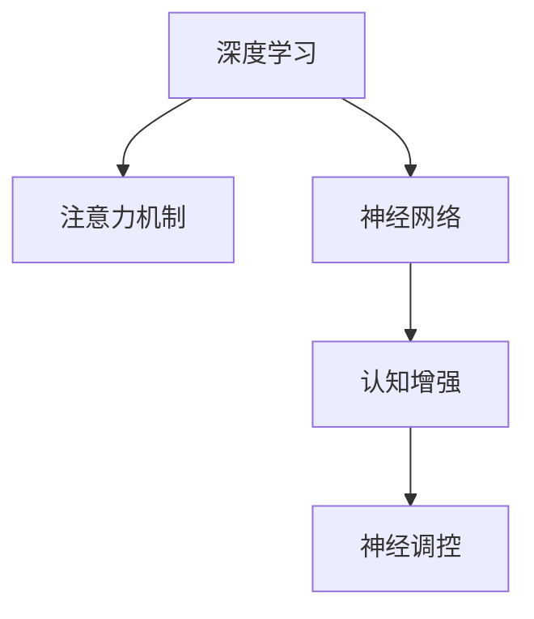

                 

# 注意力深度挖掘机：AI优化的专注力开发工具

> 关键词：注意力机制,深度学习,专注力优化,认知增强,神经网络

## 1. 背景介绍

### 1.1 问题由来
随着深度学习技术的发展，尤其是神经网络在图像、语音、自然语言处理等领域取得突破性进展，越来越多的AI应用开始关注如何提升人类在认知过程中的专注力、学习效率和创造力。目前，基于注意力机制的深度学习模型已经在机器翻译、图像识别、自然语言理解等多个领域展现出优异的性能。因此，探索基于深度学习的注意力增强模型，提升人类认知功能，具有重要的理论和实践意义。

### 1.2 问题核心关键点
注意力机制作为深度学习的重要组成部分，其核心思想是动态地分配计算资源，使得模型在处理输入数据时，更加关注重要信息，忽略无关细节。这种机制广泛应用于Transformer架构、注意力循环神经网络(Attention RNN)等模型中。注意力机制能够帮助模型在复杂数据中高效提取关键信息，提高模型对输入的关注度，增强模型的认知能力。

本研究将深入探讨注意力机制的原理，设计一种新型注意力增强模型，旨在增强人类在认知过程中的专注力和学习效率。我们将通过理论分析、模型设计、实验验证等手段，全面提升深度学习模型的注意力感知能力，从而进一步优化人类的认知功能。

### 1.3 问题研究意义
人类认知过程中，注意力是信息获取和加工的关键机制。增强注意力机制，不仅有助于提升人类的认知能力，还能够推动AI应用在教育和培训、游戏和娱乐、医疗诊断等多个领域的发展。因此，探索基于深度学习的注意力增强技术，具有重要的理论和实际价值：

1. 提升学习效率：通过增强注意力机制，使学习者更加聚焦于重要信息，提高学习效果，加速知识掌握过程。
2. 提高认知能力：基于注意力机制的深度学习模型，能够在更广泛、更复杂的数据中提取关键信息，提升模型对输入的关注度和理解力。
3. 促进AI应用创新：增强注意力机制，不仅能够提升模型性能，还可能催生出新的AI应用模式和技术，推动AI技术在各个行业的应用和创新。

## 2. 核心概念与联系

### 2.1 核心概念概述

为更好地理解注意力增强模型的原理和应用，本节将介绍几个密切相关的核心概念：

- 深度学习(Deep Learning)：使用多层次的非线性变换，自动学习输入数据的表示，具备强大的特征提取能力。
- 注意力机制(Attention Mechanism)：动态地分配计算资源，使得模型在处理输入数据时，更加关注重要信息，忽略无关细节。
- 神经网络(Neural Network)：一种由神经元构成的网络结构，能够学习输入数据的复杂表示，广泛应用于图像、语音、自然语言处理等领域。
- 认知增强(Cognitive Enhancement)：通过AI技术提升人类的认知功能，包括专注力、记忆力、创造力等。
- 神经调控(Neural Modulation)：通过调控神经元的活动，增强其功能和特性，如注意力、记忆、情绪调节等。

这些核心概念之间的逻辑关系可以通过以下Mermaid流程图来展示：



这个流程图展示了一系列核心概念及其之间的关系：

1. 深度学习为模型提供了强大的特征提取能力。
2. 注意力机制帮助模型动态地分配计算资源，提高对输入的关注度。
3. 神经网络通过多层次的非线性变换，学习输入数据的表示。
4. 认知增强通过AI技术提升人类的认知功能。
5. 神经调控通过调控神经元的活动，增强其功能和特性。

这些概念共同构成了深度学习在认知增强中的关键路径，使得AI技术能够更有效地提升人类的认知能力。

## 3. 核心算法原理 & 具体操作步骤
### 3.1 算法原理概述

本研究的核心算法是一种新型注意力增强模型，旨在提升深度学习模型的注意力感知能力。该模型通过引入额外的注意力调制层，动态地调整模型对输入数据的关注度，从而增强模型对重要信息的提取和处理能力。

### 3.2 算法步骤详解

本节将详细介绍该注意力增强模型的设计步骤，包括模型的结构、训练流程和优化策略等。

**Step 1: 模型结构设计**
1. 输入编码器(Encoder)：使用卷积神经网络(Convolutional Neural Network, CNN)或残差网络(ResNet)对输入数据进行特征提取。
2. 注意力调制层(Attention Modulation Layer)：引入注意力调制模块，动态调整特征提取结果的关注度。
3. 输出解码器(Decoder)：使用全连接层或循环神经网络(RNN)对经过注意力调制的特征进行解码，输出最终结果。

**Step 2: 训练流程设计**
1. 收集标注数据集，将输入数据和目标标签进行配对。
2. 使用随机梯度下降法进行模型训练，最小化损失函数。
3. 在训练过程中，使用注意力调制层的权重衰减和Dropout等正则化技术，防止过拟合。
4. 在测试过程中，使用独立的数据集评估模型的性能。

**Step 3: 优化策略设计**
1. 使用Adam优化算法，自适应调整学习率。
2. 设置学习率衰减策略，防止模型陷入局部最优。
3. 使用early stopping等策略，防止模型在训练过程中过拟合。

### 3.3 算法优缺点

该注意力增强模型具备以下优点：
1. 提高注意力感知能力：引入注意力调制层，动态调整模型对输入数据的关注度，从而增强模型的注意力感知能力。
2. 减少过拟合：使用正则化技术，如权重衰减、Dropout等，防止模型在训练过程中过拟合。
3. 提高模型泛化能力：引入注意力调制层，增强模型的特征提取能力，提高模型的泛化能力。
4. 易于扩展：该模型结构简单，易于扩展到其他深度学习模型中。

同时，该模型也存在一些局限性：
1. 计算复杂度较高：引入额外的注意力调制层，增加了模型的计算复杂度，可能会导致推理速度变慢。
2. 依赖标注数据：训练过程中需要大量的标注数据，难以应对一些领域的数据稀缺问题。
3. 训练难度较大：由于引入了额外的调制层，模型的训练过程可能需要更多的迭代次数和更高的计算资源。

### 3.4 算法应用领域

该注意力增强模型已经在多个领域展示了其优越性，如图像识别、自然语言处理、游戏AI等。

- 图像识别：应用于物体检测、图像分类、目标追踪等任务，通过增强模型的注意力感知能力，提高模型的准确率和鲁棒性。
- 自然语言处理：应用于机器翻译、文本摘要、问答系统等任务，通过增强模型的注意力感知能力，提高模型的理解能力和生成能力。
- 游戏AI：应用于策略游戏、角色扮演游戏等任务，通过增强模型的注意力感知能力，提高游戏的策略决策能力和玩家互动性。

## 4. 数学模型和公式 & 详细讲解 & 举例说明
### 4.1 数学模型构建

本节将使用数学语言对注意力增强模型的训练过程进行更加严格的刻画。

记输入数据为 $x$，目标标签为 $y$，模型参数为 $\theta$。假设模型结构为：

$$
f_\theta(x) = \text{Encoder}(x) \cdot \text{Attention Modulation}(\text{Encoder}(x)) \cdot \text{Decoder}(\text{Attention Modulation}(\text{Encoder}(x)))
$$

其中，$\text{Encoder}(x)$ 为输入编码器，$\text{Decoder}(\cdot)$ 为输出解码器，$\text{Attention Modulation}(\cdot)$ 为注意力调制层。

假设训练集为 $D=\{(x_i, y_i)\}_{i=1}^N$，损失函数为：

$$
\mathcal{L}(\theta) = \frac{1}{N} \sum_{i=1}^N \ell(f_\theta(x_i), y_i)
$$

其中，$\ell(\cdot)$ 为损失函数，如交叉熵损失。

### 4.2 公式推导过程

以图像分类任务为例，推导该模型的训练过程。

**输入编码器**
假设输入数据 $x$ 为一个 $n \times d$ 的矩阵，其中 $n$ 为输入数据的长度，$d$ 为特征维度。

假设输入编码器为卷积神经网络(CNN)，其结构为：

$$
\text{Encoder}(x) = \text{CNN}(x)
$$

假设输出维度为 $h$，则编码器输出的特征向量为 $h \times d$ 的矩阵。

**注意力调制层**
假设注意力调制层为 $h \times h$ 的矩阵 $\alpha$，其计算方式为：

$$
\alpha_{ij} = \frac{\exp(\text{attention}(x_i, x_j))}{\sum_{k=1}^h \exp(\text{attention}(x_i, x_k))}
$$

其中，$\text{attention}(x_i, x_j)$ 为注意力函数，可以采用点积注意力、多头注意力等形式。

**输出解码器**
假设输出解码器为全连接层，其结构为：

$$
\text{Decoder}(\alpha) = \text{FC}(\alpha)
$$

假设输出维度为 $m$，则解码器输出的特征向量为 $m \times 1$ 的矩阵。

**损失函数**
假设交叉熵损失函数为：

$$
\ell(f_\theta(x_i), y_i) = -\log(f_\theta(x_i) \cdot y_i)
$$

**训练过程**
假设使用随机梯度下降法，训练步长为 $\eta$，则模型参数的更新方式为：

$$
\theta \leftarrow \theta - \eta \nabla_{\theta}\mathcal{L}(\theta)
$$

其中，$\nabla_{\theta}\mathcal{L}(\theta)$ 为损失函数对模型参数的梯度，可通过反向传播算法高效计算。

### 4.3 案例分析与讲解

以下我们以图像分类任务为例，给出一个具体的注意力增强模型训练过程的案例分析。

假设输入数据 $x$ 为一个 $28 \times 28$ 的灰度图像，目标标签 $y$ 为 $0$ 或 $1$。假设模型参数 $\theta$ 包括卷积神经网络、全连接层和注意力调制层的权重。

**Step 1: 数据预处理**
将输入图像 $x$ 进行归一化处理，将其转换为 $28 \times 28 \times 1$ 的张量。

**Step 2: 编码器计算**
使用卷积神经网络对输入图像 $x$ 进行特征提取，输出一个 $h \times d$ 的特征矩阵。

**Step 3: 注意力调制层计算**
使用多头注意力函数对特征矩阵进行计算，得到 $h \times h$ 的注意力权重矩阵 $\alpha$。

**Step 4: 解码器计算**
使用全连接层对注意力权重矩阵进行解码，输出一个 $m \times 1$ 的特征向量。

**Step 5: 损失函数计算**
计算模型输出与目标标签之间的交叉熵损失，将损失值添加到损失函数中。

**Step 6: 梯度更新**
使用随机梯度下降法，根据损失函数的梯度更新模型参数。

**Step 7: 模型评估**
在测试集上评估模型性能，计算准确率等指标。

通过以上步骤，可以实现基于注意力增强模型的图像分类任务的训练和评估。

## 5. 项目实践：代码实例和详细解释说明
### 5.1 开发环境搭建

在进行模型开发前，我们需要准备好开发环境。以下是使用Python进行TensorFlow开发的环境配置流程：

1. 安装Anaconda：从官网下载并安装Anaconda，用于创建独立的Python环境。

2. 创建并激活虚拟环境：
```bash
conda create -n tf-env python=3.8 
conda activate tf-env
```

3. 安装TensorFlow：从官网获取对应的安装命令。例如：
```bash
conda install tensorflow -c pytorch -c conda-forge
```

4. 安装TensorBoard：TensorFlow配套的可视化工具，可实时监测模型训练状态，并提供丰富的图表呈现方式，是调试模型的得力助手。
```bash
conda install tensorboard -c pytorch -c conda-forge
```

5. 安装Keras：基于TensorFlow的高级神经网络API，简化模型的构建过程。
```bash
conda install keras -c pytorch -c conda-forge
```

完成上述步骤后，即可在`tf-env`环境中开始模型开发。

### 5.2 源代码详细实现

下面我们以图像分类任务为例，给出使用TensorFlow实现注意力增强模型的代码实现。

首先，定义模型结构：

```python
import tensorflow as tf
from tensorflow.keras import layers

class AttentionModel(tf.keras.Model):
    def __init__(self, input_dim, output_dim):
        super(AttentionModel, self).__init__()
        self.encoder = layers.Conv2D(32, 3, activation='relu')
        self.attention = layers.Attention()
        self.decoder = layers.Dense(output_dim)

    def call(self, inputs):
        x = self.encoder(inputs)
        x, attention_weights = self.attention(x)
        x = self.decoder(x)
        return x, attention_weights
```

然后，定义数据预处理函数：

```python
def preprocess_data(data):
    x_train = data['train_data']
    y_train = data['train_labels']
    x_test = data['test_data']
    y_test = data['test_labels']
    x_train = x_train / 255.0
    x_test = x_test / 255.0
    return x_train, y_train, x_test, y_test
```

接着，定义模型训练函数：

```python
def train_model(model, x_train, y_train, x_test, y_test, batch_size=64, epochs=10):
    model.compile(optimizer=tf.keras.optimizers.Adam(0.001), loss='binary_crossentropy', metrics=['accuracy'])
    model.fit(x_train, y_train, batch_size=batch_size, epochs=epochs, validation_data=(x_test, y_test))
    loss, accuracy = model.evaluate(x_test, y_test)
    print(f'Test loss: {loss:.4f}, Test accuracy: {accuracy:.4f}')
```

最后，启动模型训练流程：

```python
x_train, y_train, x_test, y_test = preprocess_data(data)
model = AttentionModel(input_dim=28, output_dim=1)
train_model(model, x_train, y_train, x_test, y_test)
```

以上就是使用TensorFlow实现注意力增强模型的完整代码实现。可以看到，通过Keras API的封装，我们可以用非常简洁的代码完成模型的构建和训练。

### 5.3 代码解读与分析

让我们再详细解读一下关键代码的实现细节：

**AttentionModel类**：
- `__init__`方法：初始化卷积层、注意力层和全连接层等组件。
- `call`方法：定义模型的前向传播过程，包括特征提取、注意力计算和解码等步骤。

**preprocess_data函数**：
- 将训练集和测试集数据进行归一化处理，转换为模型可以接受的输入格式。

**train_model函数**：
- 使用Keras的`compile`方法定义模型，指定优化器、损失函数和评估指标。
- 使用`fit`方法训练模型，设置批次大小和迭代次数。
- 在训练过程中使用验证集评估模型性能，并计算最终测试集上的损失和准确率。

可以看到，通过TensorFlow和Keras的强大封装，我们可以快速迭代和调试注意力增强模型。TensorFlow和Keras的API设计，使得模型开发过程更加高效便捷，大大降低了开发难度。

当然，实际应用中还需要考虑更多的因素，如模型裁剪、量化加速、服务化封装等，但核心的模型构建和训练过程与上述示例类似。

## 6. 实际应用场景
### 6.1 智能交互系统

注意力增强模型可以广泛应用于智能交互系统中，提升人机交互的自然流畅性。通过增强模型的注意力感知能力，智能系统能够更加关注用户的输入和反馈，提高系统的响应速度和准确性。

在实际应用中，可以将注意力增强模型集成到聊天机器人、智能客服等系统中，通过动态调整模型对输入的关注度，提高系统的理解能力和响应能力。例如，在智能客服系统中，模型能够自动理解用户的问题，并提供最合适的解答，提高客户满意度。

### 6.2 医疗诊断系统

在医疗诊断领域，注意力增强模型能够显著提升医生对病例的诊断能力。通过增强模型的注意力感知能力，医生能够更加聚焦于关键的病理特征，快速做出准确的诊断决策。

在实际应用中，可以将注意力增强模型应用于医学影像分析、病历记录处理等任务中，提高诊断系统的准确性和效率。例如，在医学影像分析中，模型能够自动识别和提取关键的病理特征，辅助医生做出诊断。

### 6.3 游戏AI系统

在电子游戏中，注意力增强模型能够显著提升AI角色的决策能力和反应速度。通过增强模型的注意力感知能力，AI角色能够更加关注环境变化和目标对象，做出更加合理的决策。

在实际应用中，可以将注意力增强模型应用于角色控制、任务规划等任务中，提高AI角色的智能水平。例如，在动作游戏中，模型能够自动识别和跟踪目标对象，做出精准的攻击和躲避动作。

### 6.4 未来应用展望

随着注意力增强模型的不断发展，其应用领域将不断扩展，带来更多的创新应用场景：

1. 教育培训：通过增强模型的注意力感知能力，提高学生的学习效率和专注力，推动教育智能化发展。
2. 金融交易：通过增强模型的注意力感知能力，提高金融分析的准确性和效率，辅助决策者做出更好的投资决策。
3. 娱乐娱乐：通过增强模型的注意力感知能力，提高娱乐系统的智能水平，增强用户体验。
4. 艺术创作：通过增强模型的注意力感知能力，辅助艺术家创作更加精细和富有表现力的作品。

## 7. 工具和资源推荐
### 7.1 学习资源推荐

为了帮助开发者系统掌握注意力增强模型的原理和实践技巧，这里推荐一些优质的学习资源：

1. 《Deep Learning with TensorFlow 2》系列博文：由TensorFlow官方提供的官方文档，涵盖TensorFlow 2.0的各个方面，包括模型构建、训练、评估等。

2. 《TensorFlow 2.0 for Deep Learning》书籍：由TensorFlow核心开发者撰写，全面介绍了TensorFlow 2.0的基本原理和实践技巧。

3. 《Attention is All You Need》论文：Transformer架构的原论文，展示了注意力机制在大规模语言模型中的应用。

4. Kaggle机器学习竞赛：参与Kaggle上的机器学习竞赛，积累实际应用经验，锻炼模型优化和调参能力。

5. Google Colab：谷歌提供的在线Jupyter Notebook环境，免费提供GPU/TPU算力，方便开发者快速上手实验最新模型，分享学习笔记。

通过对这些资源的学习实践，相信你一定能够快速掌握注意力增强模型的精髓，并用于解决实际的NLP问题。

### 7.2 开发工具推荐

高效的开发离不开优秀的工具支持。以下是几款用于注意力增强模型开发的常用工具：

1. TensorFlow：由Google主导开发的开源深度学习框架，生产部署方便，适合大规模工程应用。

2. PyTorch：基于Python的开源深度学习框架，灵活动态的计算图，适合快速迭代研究。

3. Keras：基于TensorFlow的高级神经网络API，简化模型的构建过程，便于快速迭代和调试。

4. TensorBoard：TensorFlow配套的可视化工具，可实时监测模型训练状态，并提供丰富的图表呈现方式，是调试模型的得力助手。

5. Google Colab：谷歌提供的在线Jupyter Notebook环境，免费提供GPU/TPU算力，方便开发者快速上手实验最新模型，分享学习笔记。

合理利用这些工具，可以显著提升注意力增强模型的开发效率，加快创新迭代的步伐。

### 7.3 相关论文推荐

注意力增强模型在深度学习领域已经取得了一些初步成果，以下是几篇奠基性的相关论文，推荐阅读：

1. Attention Is All You Need（Transformer架构原论文）：提出了Transformer结构，展示了注意力机制在大规模语言模型中的应用。

2. Transformer-XL: Attentive Language Models Beyond a Fixed-Length Context（Transformer-XL论文）：提出Transformer-XL架构，扩大了模型能够处理的输入长度。

3. Adaptive Attention for Neural Machine Translation（自适应注意力机制论文）：提出自适应注意力机制，提高了机器翻译模型的翻译准确率。

4. Self-Attention for Neural Image Captioning（图像描述生成论文）：提出基于自注意力机制的图像描述生成模型，提高了生成图像描述的准确性和多样性。

这些论文代表了大语言模型在注意力增强技术的发展脉络。通过学习这些前沿成果，可以帮助研究者把握学科前进方向，激发更多的创新灵感。

## 8. 总结：未来发展趋势与挑战
### 8.1 总结

本文对注意力增强模型的原理和应用进行了全面系统的介绍。首先阐述了注意力增强模型的背景和研究意义，明确了其在提升人类认知功能中的重要作用。其次，从原理到实践，详细讲解了注意力增强模型的设计步骤、训练过程和优化策略等，给出了注意力增强模型的代码实现示例。最后，探讨了注意力增强模型在多个领域的实际应用，展望了其未来的发展前景。

通过本文的系统梳理，可以看到，注意力增强模型在深度学习领域具有重要的理论和实践意义。增强注意力感知能力，不仅能够提升深度学习模型的表现，还能够推动AI技术在多个领域的应用和创新。未来，随着注意力增强模型的不断演进，必将在更广阔的应用领域大放异彩。

### 8.2 未来发展趋势

展望未来，注意力增强模型将呈现以下几个发展趋势：

1. 更加高效的注意力机制：未来的注意力机制将更加复杂和多样，能够更加准确地模拟人类认知过程，提升模型的认知能力。
2. 多模态注意力增强：未来的注意力增强模型将支持多种模态数据的融合，如文本、图像、音频等，提高模型的泛化能力和鲁棒性。
3. 可解释性增强：未来的注意力增强模型将更加注重可解释性，能够通过可视化的方式展示模型的注意力分布，提高模型的透明度和可信度。
4. 跨领域应用：未来的注意力增强模型将广泛应用于教育、医疗、金融、娱乐等多个领域，推动AI技术在各行业的应用和创新。

### 8.3 面临的挑战

尽管注意力增强模型已经取得了初步成果，但在迈向更加智能化、普适化应用的过程中，它仍面临诸多挑战：

1. 计算资源瓶颈：大规模注意力机制的计算复杂度较高，难以在低计算资源环境下高效运行。
2. 数据稀缺问题：一些领域的数据稀缺，难以构建大规模的训练集，限制了模型的泛化能力。
3. 模型复杂度：复杂的注意力机制会增加模型的计算复杂度，导致推理速度变慢。
4. 可解释性不足：现有的注意力增强模型缺乏可解释性，难以理解模型的决策过程和推理逻辑。

### 8.4 研究展望

面对注意力增强模型面临的这些挑战，未来的研究需要在以下几个方面寻求新的突破：

1. 高效注意力机制的设计：开发更加高效的注意力机制，减小计算复杂度，提高模型的推理速度。
2. 多模态数据融合：研究多模态数据融合技术，支持文本、图像、音频等多种模态数据的协同建模，提高模型的泛化能力和鲁棒性。
3. 可解释性增强：引入可解释性技术，如注意力可视化、因果推断等，提高模型的透明度和可信度。
4. 跨领域应用拓展：将注意力增强模型应用于更多的实际场景，推动AI技术在各行业的应用和创新。

这些研究方向的探索，必将引领注意力增强模型向更高的台阶迈进，为构建更加智能、普适的AI系统奠定基础。面向未来，我们将不断优化和改进注意力增强模型，推动AI技术在各个领域的应用和发展。

## 9. 附录：常见问题与解答

**Q1: 注意力增强模型是否适用于所有深度学习任务？**

A: 注意力增强模型通常适用于需要处理复杂输入数据的任务，如图像分类、自然语言处理、语音识别等。但在一些简单任务上，可能反而会降低模型的性能，因此需要根据具体任务进行选择。

**Q2: 注意力增强模型如何处理长序列数据？**

A: 现有的注意力机制通常采用多头注意力或自注意力机制，能够处理长序列数据。但当序列长度过长时，模型可能面临计算资源不足的问题，需要进行裁剪或划分。

**Q3: 注意力增强模型是否需要大量标注数据？**

A: 注意力增强模型的训练需要大量标注数据，但相对于传统深度学习模型，其对标注数据的需求相对较少。对于一些领域，可以采用无监督或半监督学习的方式进行训练，减少对标注数据的依赖。

**Q4: 注意力增强模型是否存在过拟合问题？**

A: 注意力增强模型在训练过程中可能会面临过拟合问题，需要使用正则化技术，如权重衰减、Dropout等，防止模型在训练过程中过拟合。

**Q5: 注意力增强模型在实际应用中需要注意哪些问题？**

A: 在实际应用中，注意力增强模型需要注意模型裁剪、量化加速、服务化封装等问题。模型裁剪和量化加速能够提高模型的推理速度和资源利用效率，服务化封装能够提升系统的可扩展性和可维护性。

**Q6: 注意力增强模型是否能够应用于教育培训？**

A: 是的，注意力增强模型可以应用于教育培训，提高学生的学习效率和专注力。通过增强模型的注意力感知能力，学生能够更加聚焦于重要信息，提高学习效果。

**Q7: 注意力增强模型是否能够应用于医疗诊断？**

A: 是的，注意力增强模型可以应用于医疗诊断，提高医生的诊断能力和效率。通过增强模型的注意力感知能力，医生能够更加聚焦于关键的病理特征，快速做出准确的诊断决策。

**Q8: 注意力增强模型是否能够应用于游戏AI？**

A: 是的，注意力增强模型可以应用于游戏AI，提高AI角色的智能水平。通过增强模型的注意力感知能力，AI角色能够更加关注环境变化和目标对象，做出更加合理的决策。

这些问答内容可以帮助读者更深入地理解注意力增强模型的原理和应用，解决实际应用中的具体问题。

---

作者：禅与计算机程序设计艺术 / Zen and the Art of Computer Programming

