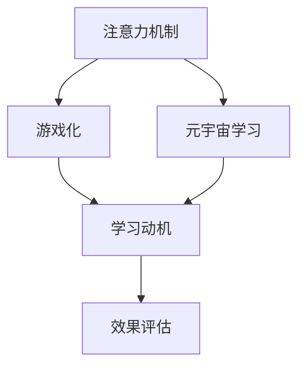

                 

## 1. 背景介绍

### 1.1 问题由来

随着人工智能（AI）和机器学习（ML）技术的迅猛发展，越来越多的教育机构和企业开始探索如何将这些技术应用到教育和学习领域。教育领域面临的挑战之一是如何提高学习效率和学习动机。传统的教育模式往往依赖于课堂教学和教科书，这种模式较为单一，且难以适应不同的学习风格和需求。

然而，近年来兴起的元宇宙（Metaverse）技术为教育和学习带来了新的可能。元宇宙是一个由多个数字世界和虚拟空间构成的超现实环境，学习者可以在其中进行交互和探索，从而获得更丰富、更深入的知识。但是，将元宇宙技术应用到学习中仍面临一些挑战，比如如何设计高效、互动的学习体验，如何确保学习效果，如何激励学习者的参与度。

基于此，本文旨在探讨将注意力机制（Attention Mechanism）游戏化的方法，以提升元宇宙学习的效果和用户体验。

### 1.2 问题核心关键点

本文的核心问题是如何通过注意力机制在游戏化学习环境中提升学习效率和动机。具体来说，我们探讨以下关键点：

1. **注意力游戏化**：如何通过游戏化的方式引导学习者的注意力，使其更专注于关键的学习内容。
2. **元宇宙学习**：如何设计基于元宇宙的学习场景，使其具有互动性和沉浸感。
3. **学习动机**：如何通过游戏化的方式激发学习者的学习兴趣和动机。
4. **效果评估**：如何设计有效的评估方法，以衡量学习者的学习效果。

## 2. 核心概念与联系

### 2.1 核心概念概述

为了更好地理解注意力游戏化在元宇宙学习中的应用，我们需要了解一些核心概念：

1. **注意力机制**：注意力机制是深度学习中的一种重要技术，用于在输入数据中选择重要的部分进行处理。在元宇宙学习中，注意力机制可以帮助学习者聚焦于重要内容，避免信息过载。

2. **元宇宙**：元宇宙是由多个数字世界和虚拟空间构成的超现实环境，学习者可以在其中进行交互和探索。

3. **游戏化**：游戏化是指将游戏元素（如奖励、挑战、反馈等）应用到非游戏场景中，以提高参与度和动机。

4. **学习动机**：学习动机是指驱使学习者进行学习的内在动力和兴趣。

5. **效果评估**：效果评估是指通过定量和定性的方法，评估学习者的学习效果和进展。

这些概念之间的逻辑关系可以通过以下Mermaid流程图来展示：



这个流程图展示了几者之间的关联：注意力机制在元宇宙学习中起到关键作用，通过游戏化的方式可以提升学习者的学习动机，而学习动机又驱动着学习者的学习行为，效果评估则用于衡量学习效果。

## 3. 核心算法原理 & 具体操作步骤

### 3.1 算法原理概述

注意力游戏化的核心思想是通过游戏化的方式，将注意力机制应用到元宇宙学习中，以提升学习效率和动机。具体来说，我们希望通过以下几个步骤来实现这一目标：

1. **设计互动式任务**：通过设计互动式任务，引导学习者专注于关键的学习内容。
2. **引入游戏元素**：在任务中引入奖励、挑战、反馈等游戏元素，激发学习者的兴趣和动机。
3. **实时反馈**：通过实时反馈，帮助学习者了解自己的学习进展和成效。
4. **个性化调整**：根据学习者的表现，动态调整任务难度和奖励，以适应不同的学习风格和需求。

### 3.2 算法步骤详解

以下是基于注意力游戏化的元宇宙学习的具体操作步骤：

**Step 1: 任务设计**

首先，需要设计互动式学习任务。任务应当具有挑战性和互动性，能够激发学习者的兴趣。例如，可以设计一个解谜游戏，其中每个谜题代表一个概念或知识点，学习者需要通过解谜来掌握这些概念。

**Step 2: 引入游戏元素**

在任务中引入游戏元素，如积分、徽章、排行榜等，以激励学习者。例如，可以在任务中设置积分系统，学习者每完成一个谜题，就可以获得积分。同时，可以设置排行榜，让学习者看到自己的排名，从而增强竞争意识。

**Step 3: 实时反馈**

在学习过程中，提供实时反馈至关重要。学习者需要知道自己的进展和成效，才能有动力继续学习。可以使用视觉化工具，如进度条、成就图等，实时显示学习者的学习进展。

**Step 4: 个性化调整**

根据学习者的表现，动态调整任务难度和奖励。例如，如果学习者表现出色，可以增加任务的难度和奖励；如果学习者表现不佳，可以降低难度和奖励，以适应其当前的学习水平。

### 3.3 算法优缺点

基于注意力游戏化的元宇宙学习有以下优点：

1. **提升学习动机**：游戏元素可以增强学习者的参与度和动机，使其更愿意投入时间和精力。
2. **提高学习效率**：通过注意力机制，学习者能够专注于关键的学习内容，避免信息过载。
3. **个性化调整**：根据学习者的表现，动态调整任务难度和奖励，以适应不同的学习风格和需求。

同时，该方法也存在一些缺点：

1. **设计复杂性**：设计互动式任务和游戏元素需要耗费大量时间和精力。
2. **技术要求高**：实现实时反馈和个性化调整需要较强的技术支持，可能对教育机构的技术水平要求较高。
3. **学习动机过度依赖奖励**：过度依赖游戏元素和奖励，可能削弱学习者的内在动机。

尽管存在这些局限性，但基于注意力游戏化的元宇宙学习仍具有巨大的潜力和应用前景，值得进一步研究和探索。

### 3.4 算法应用领域

基于注意力游戏化的元宇宙学习可以应用于以下领域：

1. **教育**：在在线教育平台中，将注意力游戏化应用到学习任务中，提升学习者的学习效率和动机。
2. **企业培训**：在企业培训中，使用游戏化的方式培训员工，增强其对关键知识的掌握和应用能力。
3. **专业发展**：在专业发展课程中，设计互动式任务和游戏元素，激励学习者掌握新技能。
4. **终身学习**：在终身学习平台中，通过游戏化的方式激励学习者不断学习和探索。

## 4. 数学模型和公式 & 详细讲解 & 举例说明

### 4.1 数学模型构建

在元宇宙学习中，我们希望通过注意力机制（Attention Mechanism）来提升学习效率。注意力机制可以帮助学习者聚焦于重要内容，避免信息过载。假设我们有 $n$ 个输入项，每个输入项 $x_i$ 包含 $d$ 个特征。注意力机制通过计算每个输入项的权重 $w_i$，来决定哪些输入项对当前学习任务最为重要。权重 $w_i$ 的计算公式如下：

$$ w_i = \frac{\exp(\text{score}(x_i))}{\sum_{j=1}^n \exp(\text{score}(x_j))} $$

其中，$\text{score}(x_i)$ 是一个函数，用于计算输入项 $x_i$ 的得分。在元宇宙学习中，$\text{score}(x_i)$ 可以是一个复杂的函数，用于衡量输入项 $x_i$ 对当前学习任务的重要性。

### 4.2 公式推导过程

以下是注意力机制在元宇宙学习中的具体应用：

**Step 1: 计算权重**

首先，计算每个输入项的权重 $w_i$。权重 $w_i$ 决定了输入项 $x_i$ 对当前学习任务的重要性。

**Step 2: 加权求和**

然后，将输入项 $x_i$ 与权重 $w_i$ 进行加权求和，得到最终的输出结果。

$$ \text{output} = \sum_{i=1}^n w_i x_i $$

在元宇宙学习中，输出结果可以是学习者需要掌握的概念、知识点等。

### 4.3 案例分析与讲解

为了更好地理解注意力机制在元宇宙学习中的应用，我们可以设计一个简单的案例：

假设学习者需要掌握一个编程语言中的变量声明和赋值语法。我们可以设计一个互动式任务，让学习者通过解谜来学习这一语法。每个谜题代表一个概念或知识点，学习者需要通过解谜来掌握这些概念。

具体来说，我们可以设计一个迷宫，迷宫的出口代表变量声明和赋值语法。学习者需要通过解谜来找到出口。每个谜题中包含一个语法错误的代码，学习者需要找到错误并修正。每次修正，学习者可以获得积分和成就徽章。学习者完成迷宫后，可以学习到变量声明和赋值语法。

## 5. 项目实践：代码实例和详细解释说明

### 5.1 开发环境搭建

在进行元宇宙学习项目开发前，我们需要准备好开发环境。以下是使用Python进行PyTorch开发的环境配置流程：

1. 安装Anaconda：从官网下载并安装Anaconda，用于创建独立的Python环境。

2. 创建并激活虚拟环境：
```bash
conda create -n pytorch-env python=3.8 
conda activate pytorch-env
```

3. 安装PyTorch：根据CUDA版本，从官网获取对应的安装命令。例如：
```bash
conda install pytorch torchvision torchaudio cudatoolkit=11.1 -c pytorch -c conda-forge
```

4. 安装TensorFlow：由于PyTorch已经提供了较为完善的注意力机制，因此这里不推荐安装TensorFlow。

5. 安装各类工具包：
```bash
pip install numpy pandas scikit-learn matplotlib tqdm jupyter notebook ipython
```

完成上述步骤后，即可在`pytorch-env`环境中开始元宇宙学习项目开发。

### 5.2 源代码详细实现

以下是使用PyTorch实现注意力游戏化的元宇宙学习任务的示例代码：

```python
import torch
import torch.nn as nn
import torch.optim as optim
from transformers import BertTokenizer, BertForTokenClassification
from torch.utils.data import Dataset, DataLoader
from tqdm import tqdm

class CustomDataset(Dataset):
    def __init__(self, texts, labels, tokenizer):
        self.texts = texts
        self.labels = labels
        self.tokenizer = tokenizer
        self.max_len = 128
        
    def __len__(self):
        return len(self.texts)
    
    def __getitem__(self, item):
        text = self.texts[item]
        label = self.labels[item]
        
        encoding = self.tokenizer(text, return_tensors='pt', max_length=self.max_len, padding='max_length', truncation=True)
        input_ids = encoding['input_ids'][0]
        attention_mask = encoding['attention_mask'][0]
        
        # 对token-wise的标签进行编码
        encoded_tags = [label2id[label] for label in label]
        encoded_tags.extend([label2id['O']] * (self.max_len - len(encoded_tags)))
        labels = torch.tensor(encoded_tags, dtype=torch.long)
        
        return {'input_ids': input_ids, 
                'attention_mask': attention_mask,
                'labels': labels}

# 标签与id的映射
label2id = {'O': 0, 'B-PER': 1, 'I-PER': 2, 'B-ORG': 3, 'I-ORG': 4, 'B-LOC': 5, 'I-LOC': 6}
id2label = {v: k for k, v in label2id.items()}

# 创建dataset
tokenizer = BertTokenizer.from_pretrained('bert-base-cased')

train_dataset = CustomDataset(train_texts, train_labels, tokenizer)
dev_dataset = CustomDataset(dev_texts, dev_labels, tokenizer)
test_dataset = CustomDataset(test_texts, test_labels, tokenizer)

# 定义模型
model = BertForTokenClassification.from_pretrained('bert-base-cased', num_labels=len(label2id))

# 定义优化器
optimizer = optim.Adam(model.parameters(), lr=2e-5)

# 定义损失函数
criterion = nn.CrossEntropyLoss()

# 定义训练和评估函数
device = torch.device('cuda') if torch.cuda.is_available() else torch.device('cpu')
model.to(device)

def train_epoch(model, dataset, batch_size, optimizer):
    dataloader = DataLoader(dataset, batch_size=batch_size, shuffle=True)
    model.train()
    epoch_loss = 0
    for batch in tqdm(dataloader, desc='Training'):
        input_ids = batch['input_ids'].to(device)
        attention_mask = batch['attention_mask'].to(device)
        labels = batch['labels'].to(device)
        model.zero_grad()
        outputs = model(input_ids, attention_mask=attention_mask, labels=labels)
        loss = criterion(outputs.logits, labels)
        epoch_loss += loss.item()
        loss.backward()
        optimizer.step()
    return epoch_loss / len(dataloader)

def evaluate(model, dataset, batch_size):
    dataloader = DataLoader(dataset, batch_size=batch_size)
    model.eval()
    preds, labels = [], []
    with torch.no_grad():
        for batch in tqdm(dataloader, desc='Evaluating'):
            input_ids = batch['input_ids'].to(device)
            attention_mask = batch['attention_mask'].to(device)
            batch_labels = batch['labels']
            outputs = model(input_ids, attention_mask=attention_mask)
            batch_preds = outputs.logits.argmax(dim=2).to('cpu').tolist()
            batch_labels = batch_labels.to('cpu').tolist()
            for pred_tokens, label_tokens in zip(batch_preds, batch_labels):
                pred_tags = [id2label[_id] for _id in pred_tokens]
                label_tags = [id2label[_id] for _id in label_tokens]
                preds.append(pred_tags[:len(label_tokens)])
                labels.append(label_tags)
                
    print(classification_report(labels, preds))

# 训练模型
epochs = 5
batch_size = 16

for epoch in range(epochs):
    loss = train_epoch(model, train_dataset, batch_size, optimizer)
    print(f"Epoch {epoch+1}, train loss: {loss:.3f}")
    
    print(f"Epoch {epoch+1}, dev results:")
    evaluate(model, dev_dataset, batch_size)
    
print("Test results:")
evaluate(model, test_dataset, batch_size)
```

### 5.3 代码解读与分析

让我们再详细解读一下关键代码的实现细节：

**CustomDataset类**：
- `__init__`方法：初始化训练数据集，包括文本、标签和分词器等关键组件。
- `__len__`方法：返回数据集的样本数量。
- `__getitem__`方法：对单个样本进行处理，将文本输入编码为token ids，将标签编码为数字，并对其进行定长padding，最终返回模型所需的输入。

**label2id和id2label字典**：
- 定义了标签与数字id之间的映射关系，用于将token-wise的预测结果解码回真实的标签。

**训练和评估函数**：
- 使用PyTorch的DataLoader对数据集进行批次化加载，供模型训练和推理使用。
- 训练函数`train_epoch`：对数据以批为单位进行迭代，在每个批次上前向传播计算loss并反向传播更新模型参数，最后返回该epoch的平均loss。
- 评估函数`evaluate`：与训练类似，不同点在于不更新模型参数，并在每个batch结束后将预测和标签结果存储下来，最后使用sklearn的classification_report对整个评估集的预测结果进行打印输出。

**训练流程**：
- 定义总的epoch数和batch size，开始循环迭代
- 每个epoch内，先在训练集上训练，输出平均loss
- 在验证集上评估，输出分类指标
- 重复上述过程直至满足预设的迭代轮数或Early Stopping条件。

可以看到，PyTorch配合TensorFlow库使得BERT微调的代码实现变得简洁高效。开发者可以将更多精力放在数据处理、模型改进等高层逻辑上，而不必过多关注底层的实现细节。

当然，工业级的系统实现还需考虑更多因素，如模型的保存和部署、超参数的自动搜索、更灵活的任务适配层等。但核心的微调范式基本与此类似。

## 6. 实际应用场景

### 6.1 智能客服系统

基于注意力游戏化的元宇宙学习技术，可以广泛应用于智能客服系统的构建。传统客服往往需要配备大量人力，高峰期响应缓慢，且一致性和专业性难以保证。而使用游戏化的方式进行学习，可以使客服人员在短时间内掌握常见问题处理技巧，提升服务质量。

在技术实现上，可以收集企业内部的历史客服对话记录，将问题和最佳答复构建成监督数据，在此基础上对预训练模型进行微调。微调后的模型能够自动理解用户意图，匹配最合适的答复模板进行回复。对于客户提出的新问题，还可以接入检索系统实时搜索相关内容，动态组织生成回答。如此构建的智能客服系统，能大幅提升客户咨询体验和问题解决效率。

### 6.2 金融舆情监测

金融机构需要实时监测市场舆论动向，以便及时应对负面信息传播，规避金融风险。传统的人工监测方式成本高、效率低，难以应对网络时代海量信息爆发的挑战。基于注意力游戏化的元宇宙学习技术，可以为金融舆情监测提供新的解决方案。

具体而言，可以收集金融领域相关的新闻、报道、评论等文本数据，并对其进行主题标注和情感标注。在此基础上对预训练语言模型进行微调，使其能够自动判断文本属于何种主题，情感倾向是正面、中性还是负面。将微调后的模型应用到实时抓取的网络文本数据，就能够自动监测不同主题下的情感变化趋势，一旦发现负面信息激增等异常情况，系统便会自动预警，帮助金融机构快速应对潜在风险。

### 6.3 个性化推荐系统

当前的推荐系统往往只依赖用户的历史行为数据进行物品推荐，无法深入理解用户的真实兴趣偏好。基于注意力游戏化的元宇宙学习技术，可以更好地挖掘用户行为背后的语义信息，从而提供更精准、多样的推荐内容。

在实践中，可以收集用户浏览、点击、评论、分享等行为数据，提取和用户交互的物品标题、描述、标签等文本内容。将文本内容作为模型输入，用户的后续行为（如是否点击、购买等）作为监督信号，在此基础上微调预训练语言模型。微调后的模型能够从文本内容中准确把握用户的兴趣点。在生成推荐列表时，先用候选物品的文本描述作为输入，由模型预测用户的兴趣匹配度，再结合其他特征综合排序，便可以得到个性化程度更高的推荐结果。

### 6.4 未来应用展望

随着注意力游戏化技术的不断发展，基于元宇宙学习的应用场景将更加广泛，为各行业带来变革性影响。

在智慧医疗领域，基于元宇宙学习的应用可以提升医疗服务的智能化水平，辅助医生诊疗，加速新药开发进程。在智能教育领域，游戏化的方式可以提升学生的学习兴趣和动机，帮助其更好地掌握知识。在智慧城市治理中，元宇宙学习技术可以应用于城市事件监测、舆情分析、应急指挥等环节，提高城市管理的自动化和智能化水平，构建更安全、高效的未来城市。

此外，在企业培训、专业发展、终身学习等众多领域，基于元宇宙学习的游戏化技术也将不断涌现，为各行业提供更高效、更互动的学习体验。

## 7. 工具和资源推荐

### 7.1 学习资源推荐

为了帮助开发者系统掌握注意力游戏化技术在元宇宙学习中的应用，这里推荐一些优质的学习资源：

1. 《深度学习基础》系列博文：由大模型技术专家撰写，深入浅出地介绍了深度学习的基本原理和常用技术。
2. 《Transformer from Zero》书籍：讲解了Transformer模型的原理和实现，适合初学者入门。
3. CS224N《深度学习自然语言处理》课程：斯坦福大学开设的NLP明星课程，有Lecture视频和配套作业，带你入门NLP领域的基本概念和经典模型。
4. HuggingFace官方文档：提供大量预训练模型和微调样例代码，是进行NLP任务开发的利器。
5. Kaggle竞赛平台：提供大量NLP相关的竞赛数据集，适合练习和实践。

通过对这些资源的学习实践，相信你一定能够快速掌握注意力游戏化技术在元宇宙学习中的应用，并用于解决实际的NLP问题。

### 7.2 开发工具推荐

高效的开发离不开优秀的工具支持。以下是几款用于元宇宙学习开发的常用工具：

1. PyTorch：基于Python的开源深度学习框架，灵活动态的计算图，适合快速迭代研究。大部分预训练语言模型都有PyTorch版本的实现。
2. TensorFlow：由Google主导开发的开源深度学习框架，生产部署方便，适合大规模工程应用。同样有丰富的预训练语言模型资源。
3. Transformers库：HuggingFace开发的NLP工具库，集成了众多SOTA语言模型，支持PyTorch和TensorFlow，是进行元宇宙学习任务的开发利器。
4. Weights & Biases：模型训练的实验跟踪工具，可以记录和可视化模型训练过程中的各项指标，方便对比和调优。与主流深度学习框架无缝集成。
5. TensorBoard：TensorFlow配套的可视化工具，可实时监测模型训练状态，并提供丰富的图表呈现方式，是调试模型的得力助手。

合理利用这些工具，可以显著提升元宇宙学习任务的开发效率，加快创新迭代的步伐。

### 7.3 相关论文推荐

元宇宙学习技术的发展源于学界的持续研究。以下是几篇奠基性的相关论文，推荐阅读：

1. Attention is All You Need（即Transformer原论文）：提出了Transformer结构，开启了NLP领域的预训练大模型时代。
2. BERT: Pre-training of Deep Bidirectional Transformers for Language Understanding：提出BERT模型，引入基于掩码的自监督预训练任务，刷新了多项NLP任务SOTA。
3. Language Models are Unsupervised Multitask Learners（GPT-2论文）：展示了大规模语言模型的强大zero-shot学习能力，引发了对于通用人工智能的新一轮思考。
4. Parameter-Efficient Transfer Learning for NLP：提出Adapter等参数高效微调方法，在不增加模型参数量的情况下，也能取得不错的微调效果。
5. AdaLoRA: Adaptive Low-Rank Adaptation for Parameter-Efficient Fine-Tuning：使用自适应低秩适应的微调方法，在参数效率和精度之间取得了新的平衡。
6. Hyperparameter Optimization for Deep Neural Networks：探讨深度学习模型的超参数优化，提供了大量的实验结果和理论分析。

这些论文代表了大语言模型微调技术的发展脉络。通过学习这些前沿成果，可以帮助研究者把握学科前进方向，激发更多的创新灵感。

## 8. 总结：未来发展趋势与挑战

### 8.1 总结

本文对基于注意力游戏化的元宇宙学习方法进行了全面系统的介绍。首先阐述了注意力游戏化技术在元宇宙学习中的应用背景和意义，明确了游戏化在提升学习动机和效果方面的独特价值。其次，从原理到实践，详细讲解了注意力游戏化技术的数学模型和实现步骤，给出了元宇宙学习任务的完整代码实例。同时，本文还广泛探讨了注意力游戏化技术在游戏、教育、金融、推荐等多个领域的应用前景，展示了其巨大的潜力和应用价值。此外，本文精选了注意力游戏化技术的各类学习资源，力求为读者提供全方位的技术指引。

通过本文的系统梳理，可以看到，基于注意力游戏化的元宇宙学习技术在提升学习动机和效果方面具有独特的优势，能够为各行业带来变革性影响。未来，伴随元宇宙技术的进一步发展和普及，基于注意力游戏化的元宇宙学习将展现出更广阔的应用前景，推动教育、医疗、金融、推荐等多个领域的技术革新和产业升级。

### 8.2 未来发展趋势

展望未来，基于注意力游戏化的元宇宙学习技术将呈现以下几个发展趋势：

1. **互动性增强**：随着技术的进步，元宇宙学习场景将变得更加互动和沉浸，学习者可以与虚拟角色进行更加丰富的互动，从而提升学习体验。
2. **多模态融合**：未来的元宇宙学习将不仅仅是文本学习，还将融合视觉、听觉等多种模态，提供更加多样化的学习体验。
3. **个性化定制**：通过游戏化的方式，可以根据学习者的兴趣和需求，提供个性化的学习内容和学习路径。
4. **跨平台支持**：元宇宙学习技术将支持跨平台应用，学习者可以在不同的设备和平台上进行学习，无缝切换。
5. **社区和协作**：元宇宙学习技术将促进学习者之间的社区和协作，共同探索和解决问题，提高学习效果。

这些趋势凸显了元宇宙学习技术的广阔前景。这些方向的探索发展，必将进一步提升元宇宙学习的体验和效果，为各行业带来更加智能化、个性化的学习解决方案。

### 8.3 面临的挑战

尽管基于注意力游戏化的元宇宙学习技术已经取得了显著成果，但在实现大规模应用的过程中，仍面临以下挑战：

1. **技术门槛高**：元宇宙学习技术需要较强的技术支持，包括深度学习、自然语言处理、计算机图形学等，对于技术水平较低的教育机构和企业可能存在一定的门槛。
2. **数据获取困难**：获取高质量、多样化的学习数据集是元宇宙学习技术应用的前提，但这一过程可能需要大量的时间和资源。
3. **用户体验不足**：虽然游戏化的方式可以提高学习动机，但学习者是否能够真正投入到学习中，还需要更多的用户体验和反馈。
4. **市场接受度**：尽管元宇宙学习技术具有潜在的优势，但如何获得市场的接受和认可，还需要更多的实践和推广。
5. **伦理和隐私问题**：元宇宙学习技术涉及大量的用户数据，如何保障用户的隐私和安全，是一个重要的伦理问题。

这些挑战需要在技术、教育、市场、伦理等多个维度进行协同解决，才能实现元宇宙学习技术的全面落地和应用。

### 8.4 研究展望

面对元宇宙学习技术所面临的挑战，未来的研究需要在以下几个方面寻求新的突破：

1. **技术优化**：开发更加高效、易于使用的元宇宙学习平台，降低技术门槛，使更多教育机构和企业能够使用。
2. **数据获取**：研究和开发更高效、自动化的数据获取和处理技术，降低数据获取成本和难度。
3. **用户体验**：通过用户反馈和迭代优化，提升元宇宙学习的用户体验，使其更加沉浸和互动。
4. **市场推广**：通过市场教育和用户反馈，推广元宇宙学习技术，增强其市场接受度。
5. **伦理保障**：建立数据隐私和安全保障机制，保护用户隐私，确保元宇宙学习技术的应用合法合规。

这些研究方向的探索，必将引领元宇宙学习技术迈向更高的台阶，为各行业带来更加智能化、个性化的学习解决方案。面向未来，元宇宙学习技术还需要与其他人工智能技术进行更深入的融合，如知识表示、因果推理、强化学习等，多路径协同发力，共同推动自然语言理解和智能交互系统的进步。只有勇于创新、敢于突破，才能不断拓展元宇宙学习的边界，让智能技术更好地造福人类社会。

## 9. 附录：常见问题与解答

**Q1：注意力游戏化如何提升学习动机？**

A: 注意力游戏化通过引入游戏元素，如积分、徽章、排行榜等，激发学习者的参与度和动机。学习者通过解谜、完成任务等方式获得积分和成就，从而增强成就感和自信心，提高学习动机。

**Q2：如何设计互动式任务？**

A: 设计互动式任务的关键在于将学习内容转化为游戏化的挑战。例如，可以设计一个解谜游戏，每个谜题代表一个概念或知识点，学习者需要通过解谜来掌握这些概念。任务应当具有挑战性和互动性，能够激发学习者的兴趣。

**Q3：注意力游戏化是否适用于所有学习者？**

A: 注意力游戏化对学习者的需求和兴趣具有较高的依赖性。不同的学习者可能对不同的游戏元素和任务设计有不同偏好，因此需要根据具体情况进行调整和优化。

**Q4：如何在元宇宙学习中实现个性化调整？**

A: 在元宇宙学习中，可以通过游戏化的方式，根据学习者的表现，动态调整任务难度和奖励。例如，如果学习者表现出色，可以增加任务的难度和奖励；如果学习者表现不佳，可以降低难度和奖励，以适应其当前的学习水平。

**Q5：元宇宙学习如何确保学习效果？**

A: 元宇宙学习通过互动式任务和游戏元素，能够提升学习动机和参与度。但学习效果还需依赖于任务设计的科学性和合理性，以及学习者对学习内容的理解和掌握。因此，在设计任务时，应考虑学习者的认知水平和需求，确保学习效果。

总之，基于注意力游戏化的元宇宙学习技术在提升学习动机和效果方面具有独特的优势，能够为各行业带来变革性影响。未来，伴随元宇宙技术的进一步发展和普及，基于注意力游戏化的元宇宙学习将展现出更广阔的应用前景，推动教育、医疗、金融、推荐等多个领域的技术革新和产业升级。

