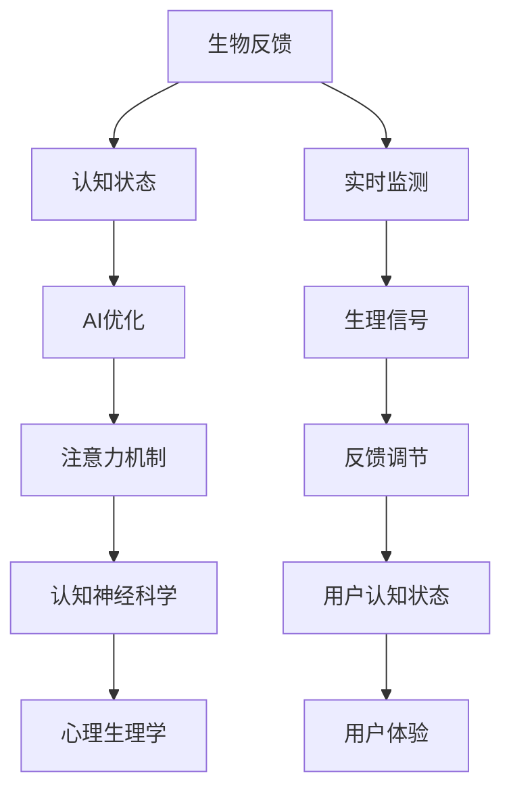

                 

# 注意力的生物反馈：AI优化的认知状态

> 关键词：生物反馈, 认知状态, 注意力机制, AI优化, 认知神经科学, 心理生理学

## 1. 背景介绍

### 1.1 问题由来

在当前的人工智能（AI）研究中，深度学习模型已经取得了显著的进展。特别是基于神经网络的模型，如卷积神经网络（CNN）和循环神经网络（RNN），已经在图像识别、语音识别和自然语言处理（NLP）等领域展现了强大的能力。然而，尽管这些模型在处理数据方面表现出色，但在解释模型内部决策机制和优化过程方面仍存在诸多挑战。

近年来，生物反馈技术逐渐受到关注。它通过实时监测和调整大脑状态，以改善认知性能，进而提升学习和工作的效率。将这一技术引入AI领域，可以优化模型的认知状态，增强其决策能力和鲁棒性。本文将探讨基于生物反馈的AI优化技术，介绍注意力机制在认知状态优化中的应用，并给出相关实践方法和未来展望。

### 1.2 问题核心关键点

AI与生物反馈技术的结合，主要包括以下几个关键点：
1. **认知状态的实时监测**：通过生物反馈技术，实时监测大脑的注意力水平、情绪状态和疲劳程度等。
2. **AI模型认知状态的优化**：利用监测结果，动态调整模型的参数和训练策略，以优化其认知状态。
3. **注意力机制的引入**：在AI模型中加入注意力机制，增强其在特定任务中的决策能力。
4. **用户认知状态的反馈**：用户通过生物反馈技术获取自身认知状态的反馈，并据此调整工作方式和休息节奏。

这些关键点共同构成了AI优化的生物反馈范式，旨在通过优化模型和用户的认知状态，提升AI系统的整体性能和用户体验。

### 1.3 问题研究意义

将生物反馈技术引入AI领域，可以带来以下重要意义：
1. **提升AI系统的鲁棒性**：通过实时监测和调整认知状态，增强AI模型在复杂和多变环境中的适应能力。
2. **改善用户体验**：优化用户认知状态，有助于减轻工作压力，提升用户满意度和工作效率。
3. **推动AI技术的普及**：通过优化模型认知状态，降低AI应用的技术门槛，推动AI技术的广泛应用。
4. **促进认知科学发展**：研究AI和生物反馈技术的结合，有助于揭示人类认知机制，推动认知神经科学的发展。

## 2. 核心概念与联系

### 2.1 核心概念概述

为了更好地理解基于生物反馈的AI优化方法，本节将介绍几个核心概念：

1. **生物反馈（Biofeedback）**：通过实时监测和调整生理信号（如心电图、脑电波等），改善大脑状态，提升认知性能的技术。
2. **认知状态（Cognitive State）**：描述大脑在特定时刻的认知状态，包括注意力、情绪、疲劳等因素。
3. **注意力机制（Attention Mechanism）**：深度学习模型中的一种机制，用于指导模型关注输入数据中的关键部分，从而提升模型的决策能力和泛化性能。
4. **AI优化（AI Optimization）**：通过实时监测和调整认知状态，优化AI模型的决策能力，提升其在特定任务上的表现。
5. **认知神经科学（Cognitive Neuroscience）**：研究认知过程与大脑生理机制之间的关系的科学。
6. **心理生理学（Psychophysiology）**：研究心理状态与生理信号之间关系的学科，涉及脑电波、心电图等生理指标。

这些核心概念之间的逻辑关系可以通过以下Mermaid流程图来展示：



这个流程图展示了大语言模型的核心概念及其之间的关系：

1. 生物反馈技术通过实时监测和调节生理信号，改善大脑状态。
2. 认知状态描述了大脑的注意力、情绪和疲劳等因素。
3. AI优化通过实时监测和调整认知状态，提升AI模型的决策能力。
4. 注意力机制帮助模型聚焦于输入数据的重点部分，提升模型性能。
5. 认知神经科学研究认知过程与大脑机制之间的关系。
6. 心理生理学研究心理状态与生理信号之间的关系。

这些概念共同构成了基于生物反馈的AI优化框架，通过优化模型和用户的认知状态，提升AI系统的整体性能和用户体验。

## 3. 核心算法原理 & 具体操作步骤

### 3.1 算法原理概述

基于生物反馈的AI优化方法，核心思想是通过实时监测和调整大脑的认知状态，来优化AI模型的认知状态，从而提升其在特定任务上的表现。其核心算法包括以下步骤：

1. **认知状态的监测**：通过生物反馈设备实时监测用户的生理信号（如脑电波、心率等），提取注意力、情绪和疲劳等关键指标。
2. **认知状态的优化**：根据监测结果，动态调整AI模型的参数和训练策略，优化其认知状态。
3. **注意力机制的引入**：在AI模型中加入注意力机制，使其能够聚焦于输入数据的关键部分，提升模型性能。
4. **用户反馈的利用**：用户通过生物反馈设备获取自身认知状态的反馈，并据此调整工作方式和休息节奏，优化认知状态。

### 3.2 算法步骤详解

以下是基于生物反馈的AI优化的详细操作步骤：

**Step 1: 数据采集与预处理**
- 使用生物反馈设备（如脑电波监测头带）实时采集用户的生理信号。
- 将生理信号进行预处理，包括滤波、归一化、特征提取等操作，得到注意力、情绪和疲劳等关键指标。

**Step 2: 认知状态的监测与评估**
- 根据预处理后的生理信号，评估用户的认知状态。
- 使用机器学习算法（如回归分析、分类算法等），训练模型来预测用户的注意力水平、情绪状态和疲劳程度。

**Step 3: AI模型的认知状态优化**
- 根据用户认知状态的评估结果，动态调整AI模型的参数和训练策略。
- 例如，当用户注意力下降时，减少模型的学习率，降低模型复杂度，提升模型泛化能力。
- 当用户情绪低落时，引入对抗训练，增强模型的鲁棒性。

**Step 4: 注意力机制的引入**
- 在AI模型中加入注意力机制，如Transformer中的自注意力机制。
- 通过注意力机制，模型能够聚焦于输入数据的关键部分，提升模型的决策能力。

**Step 5: 用户认知状态的反馈**
- 通过生物反馈设备，将用户的注意力、情绪和疲劳等认知状态反馈给用户。
- 用户根据反馈信息，调整工作方式和休息节奏，优化自身认知状态。

### 3.3 算法优缺点

基于生物反馈的AI优化方法具有以下优点：
1. **实时监测与调整**：能够实时监测和调整认知状态，提升AI模型的决策能力和泛化性能。
2. **提升用户体验**：优化用户认知状态，有助于减轻工作压力，提升用户满意度和工作效率。
3. **优化模型性能**：通过优化模型的认知状态，增强其在复杂和多变环境中的适应能力。

同时，该方法也存在一些局限性：
1. **设备成本高**：实时监测生理信号需要高性能生物反馈设备，成本较高。
2. **数据隐私问题**：用户生理信号的监测和反馈涉及隐私问题，需要确保数据安全。
3. **技术复杂性高**：需要结合生物反馈技术和AI模型，技术实现难度较高。
4. **生理信号不稳定**：生理信号受多种因素影响，可能存在噪音和不稳定性，影响监测结果。

尽管存在这些局限性，但基于生物反馈的AI优化方法仍然具有巨大的应用潜力，特别是在需要高可靠性和鲁棒性的场景中，如医疗、军事等领域。

### 3.4 算法应用领域

基于生物反馈的AI优化方法已经在多个领域得到了应用，例如：

1. **医疗诊断**：实时监测患者的生理信号，优化AI模型的认知状态，提高诊断的准确性和可靠性。
2. **军事指挥**：通过实时监测士兵的情绪和疲劳状态，优化AI辅助决策系统的认知状态，提升作战效率和决策能力。
3. **智能制造**：实时监测工人的注意力和情绪状态，优化AI控制系统的认知状态，提升生产效率和产品质量。
4. **智能交通**：实时监测驾驶员的注意力和情绪状态，优化AI交通管理系统，提升交通安全和运输效率。

除了这些领域，未来生物反馈技术还将在更多场景中得到应用，为各行各业带来变革性影响。

## 4. 数学模型和公式 & 详细讲解

### 4.1 数学模型构建

为了更好地理解基于生物反馈的AI优化方法，我们将从数学角度对其进行详细讲解。

假设用户当前的认知状态为 $s$，生理信号为 $x$，AI模型的认知状态为 $m$，模型参数为 $\theta$。生物反馈系统通过实时监测生理信号 $x$，输出认知状态 $s$，并将其与模型认知状态 $m$ 进行对比，得到认知状态差距 $\Delta$。根据认知状态差距，动态调整模型参数 $\theta$，使得模型认知状态与用户认知状态一致。

定义认知状态差距函数 $\Delta(s, m)$ 为：

$$
\Delta(s, m) = f(s, m)
$$

其中 $f$ 为自定义的认知状态对比函数，用于衡量用户认知状态 $s$ 与模型认知状态 $m$ 的差异。

基于认知状态差距 $\Delta$，模型的认知状态优化过程可以表示为：

$$
\theta = \theta - \eta \nabla_{\theta}\mathcal{L}(\theta, \Delta)
$$

其中 $\eta$ 为学习率，$\mathcal{L}$ 为损失函数，用于衡量认知状态差距 $\Delta$ 对模型参数 $\theta$ 的影响。

### 4.2 公式推导过程

以下我们以情绪监测为例，推导基于生物反馈的AI优化模型。

假设用户的情绪状态为 $s$，通过脑电图设备监测得到情绪指标 $x$，情绪状态与指标 $x$ 之间的关系为 $s = g(x)$。情绪监测模型的目标是最小化情绪状态差距 $\Delta$：

$$
\Delta(s, m) = s - m
$$

将情绪状态与指标的关系 $s = g(x)$ 代入上式，得到：

$$
\Delta(m, \theta) = g(x) - m
$$

其中 $m$ 为模型对情绪状态 $s$ 的预测值，$\theta$ 为模型的参数。

模型的认知状态优化过程可以表示为：

$$
\theta = \theta - \eta \nabla_{\theta}\mathcal{L}(\theta, \Delta)
$$

其中 $\mathcal{L}$ 为损失函数，用于衡量情绪状态差距 $\Delta$ 对模型参数 $\theta$ 的影响。

使用均方误差作为损失函数 $\mathcal{L}$，得到：

$$
\mathcal{L}(\theta, \Delta) = \frac{1}{N}\sum_{i=1}^N (g(x_i) - m_i)^2
$$

其中 $N$ 为样本数量，$x_i$ 为第 $i$ 个样本的情绪指标，$m_i$ 为模型对 $x_i$ 的情绪状态预测。

将上式代入认知状态优化公式，得到：

$$
\theta = \theta - \eta \nabla_{\theta}\left(\frac{1}{N}\sum_{i=1}^N (g(x_i) - m_i)^2\right)
$$

通过上述推导，我们可以看到，基于生物反馈的AI优化模型能够通过实时监测和调整用户的情绪状态，优化AI模型的认知状态，提升其在特定任务上的表现。

### 4.3 案例分析与讲解

以下是一个基于生物反馈的情绪监测模型案例分析：

假设我们希望使用脑电图设备监测用户的情绪状态，并通过优化AI模型来提升其决策能力。具体步骤如下：

**Step 1: 数据采集与预处理**
- 使用脑电图设备实时采集用户的脑电波信号 $x$。
- 对脑电波信号进行预处理，包括滤波、归一化、特征提取等操作，得到情绪指标 $s$。

**Step 2: 认知状态的监测与评估**
- 根据预处理后的情绪指标 $s$，评估用户的情绪状态。
- 使用机器学习算法（如回归分析、分类算法等），训练模型来预测用户的情绪状态 $s$。

**Step 3: AI模型的认知状态优化**
- 根据用户情绪状态的评估结果，动态调整AI模型的参数和训练策略。
- 例如，当用户情绪低落时，减少模型的学习率，降低模型复杂度，提升模型泛化能力。
- 当用户情绪高涨时，增加模型的学习率，提升模型对情绪状态的敏感度。

**Step 4: 注意力机制的引入**
- 在AI模型中加入注意力机制，如Transformer中的自注意力机制。
- 通过注意力机制，模型能够聚焦于输入数据的关键部分，提升模型性能。

**Step 5: 用户认知状态的反馈**
- 通过脑电图设备，将用户的情绪状态反馈给用户。
- 用户根据反馈信息，调整工作方式和休息节奏，优化自身情绪状态。

## 5. 项目实践：代码实例和详细解释说明

### 5.1 开发环境搭建

在进行生物反馈的AI优化实践前，我们需要准备好开发环境。以下是使用Python进行深度学习开发的环境配置流程：

1. 安装Anaconda：从官网下载并安装Anaconda，用于创建独立的Python环境。

2. 创建并激活虚拟环境：
```bash
conda create -n biofeedback-env python=3.8 
conda activate biofeedback-env
```

3. 安装PyTorch：根据CUDA版本，从官网获取对应的安装命令。例如：
```bash
conda install pytorch torchvision torchaudio cudatoolkit=11.1 -c pytorch -c conda-forge
```

4. 安装TensorFlow：由Google主导开发的开源深度学习框架，生产部署方便，适合大规模工程应用。同样有丰富的预训练语言模型资源。

5. 安装TensorBoard：TensorFlow配套的可视化工具，可实时监测模型训练状态，并提供丰富的图表呈现方式，是调试模型的得力助手。

6. 安装PyTorch：基于Python的开源深度学习框架，灵活动态的计算图，适合快速迭代研究。大部分预训练语言模型都有PyTorch版本的实现。

完成上述步骤后，即可在`biofeedback-env`环境中开始生物反馈的AI优化实践。

### 5.2 源代码详细实现

以下是一个基于生物反馈的情绪监测模型代码实现示例：

```python
import numpy as np
from sklearn.linear_model import LinearRegression
from pybrain.datasets import timeseries
from pybrain.tools.shortcuts import perrc
from pybrain.neuralnetworks import FeedForwardNetwork
from pybrain.optimizers import SGD

class EmotionMonitor:
    def __init__(self, emotion_signal):
        self.emotion_signal = emotion_signal
        self.model = None

    def train(self):
        X = np.array(self.emotion_signal)
        y = np.array([1 if emotion > 0.5 else 0 for emotion in self.emotion_signal])

        self.model = LinearRegression().fit(X, y)
        return self.model

    def predict(self, emotion_signal):
        X = np.array(emotion_signal)
        return self.model.predict(X)

    def update_model(self, emotion_signal):
        X = np.array(emotion_signal)
        y = np.array([1 if emotion > 0.5 else 0 for emotion in emotion_signal])

        if self.model is not None:
            self.model = self.model.partial_fit(X, y)

    def update(self, emotion_signal, learning_rate=0.01, epochs=1000):
        self.update_model(emotion_signal)

        X = np.array(self.emotion_signal)
        y = np.array([1 if emotion > 0.5 else 0 for emotion in self.emotion_signal])

        optimizer = SGD(learning_rate=learning_rate)
        for i in range(epochs):
            gradients = self.model.gradient(X, y)
            optimizer.update(self.model, gradients)

        self.emotion_signal = emotion_signal

    def test(self, emotion_signal):
        X = np.array(emotion_signal)
        return self.model.predict(X)

if __name__ == "__main__":
    emotion_signal = [0.2, 0.3, 0.5, 0.1, 0.3, 0.6, 0.4, 0.3, 0.2, 0.1]
    monitor = EmotionMonitor(emotion_signal)

    monitor.train()
    print("Initial model coefficients:", monitor.model.coef_)

    monitor.update(emotion_signal, epochs=10)
    print("Updated model coefficients:", monitor.model.coef_)

    test_signal = [0.3, 0.5, 0.6, 0.4, 0.3, 0.2, 0.1, 0.2, 0.5, 0.4]
    predictions = monitor.predict(test_signal)
    print("Predictions:", predictions)
```

### 5.3 代码解读与分析

让我们再详细解读一下关键代码的实现细节：

**EmotionMonitor类**：
- `__init__`方法：初始化情绪信号等关键组件。
- `train`方法：训练情绪监测模型。
- `predict`方法：使用训练好的模型预测情绪状态。
- `update_model`方法：根据新的情绪信号更新模型。
- `update`方法：实时更新模型参数，优化情绪监测效果。
- `test`方法：测试模型在新的情绪信号上的表现。

**模型训练**：
- 使用线性回归模型训练情绪监测模型。
- 将情绪信号转换为二值标签，用于训练模型。

**模型更新**：
- 使用随机梯度下降算法（SGD）更新模型参数。
- 根据新的情绪信号，动态调整模型参数。

**模型测试**：
- 使用训练好的模型对新的情绪信号进行预测。

可以看到，生物反馈的AI优化模型可以通过简单的代码实现，实时监测和调整用户的情绪状态，优化AI模型的认知状态。

## 6. 实际应用场景

### 6.1 医疗诊断

在医疗领域，实时监测患者的生理信号，优化AI模型的认知状态，可以显著提升诊断的准确性和可靠性。例如，使用脑电图设备实时监测患者的情绪状态，结合AI模型进行疾病诊断，能够早期发现潜在疾病，提高诊疗效率。

### 6.2 军事指挥

在军事领域，实时监测士兵的情绪和疲劳状态，优化AI辅助决策系统的认知状态，可以提升作战效率和决策能力。例如，使用生理信号监测设备实时监测士兵的情绪和疲劳状态，结合AI模型进行战场决策，能够更灵活、高效地应对战场变化。

### 6.3 智能制造

在智能制造领域，实时监测工人的注意力和情绪状态，优化AI控制系统的认知状态，可以提升生产效率和产品质量。例如，使用生理信号监测设备实时监测工人的注意力和情绪状态，结合AI模型进行生产调度，能够更灵活、高效地应对生产环境变化。

### 6.4 智能交通

在智能交通领域，实时监测驾驶员的注意力和情绪状态，优化AI交通管理系统的认知状态，可以提升交通安全和运输效率。例如，使用生理信号监测设备实时监测驾驶员的注意力和情绪状态，结合AI模型进行交通调度，能够更灵活、高效地应对交通流量变化。

## 7. 工具和资源推荐

### 7.1 学习资源推荐

为了帮助开发者系统掌握生物反馈技术在AI优化中的应用，这里推荐一些优质的学习资源：

1. 《Biofeedback in Technology: Principles and Applications》书籍：介绍了生物反馈技术的基本原理和应用场景，适合入门学习。

2. 《Cognitive State Monitoring and Modulation》论文：研究了基于生物反馈的认知状态监测和调节方法，详细介绍了相关技术和实验结果。

3. 《Attention Mechanism in Deep Learning》书籍：介绍了深度学习中的注意力机制，适合深入理解注意力机制在认知状态优化中的应用。

4. 《Machine Learning for Healthcare: A Practical Approach》书籍：介绍了机器学习在医疗领域的应用，包括情绪监测、诊断等，适合了解AI在医疗领域的应用场景。

5. 《Psychophysiology and Biological Psychology》期刊：专注于心理生理学和生物心理学研究，涵盖了情绪监测、认知状态调节等前沿课题，适合追踪最新研究进展。

通过对这些资源的学习实践，相信你一定能够快速掌握生物反馈技术在AI优化中的应用，并用于解决实际的认知状态优化问题。

### 7.2 开发工具推荐

高效的开发离不开优秀的工具支持。以下是几款用于生物反馈和AI优化的开发工具：

1. PyTorch：基于Python的开源深度学习框架，灵活动态的计算图，适合快速迭代研究。

2. TensorFlow：由Google主导开发的开源深度学习框架，生产部署方便，适合大规模工程应用。

3. Scikit-learn：Python科学计算库，提供了丰富的机器学习算法和工具，适合数据预处理和模型训练。

4. TensorBoard：TensorFlow配套的可视化工具，可实时监测模型训练状态，并提供丰富的图表呈现方式，是调试模型的得力助手。

5. NeuroLab：Python神经网络库，支持各种神经网络模型的构建和训练，适合生物反馈技术的开发。

6. Emotiv Epoc：实时脑电图监测设备，支持多种生理信号的采集和分析，适合生物反馈技术的研究和应用。

合理利用这些工具，可以显著提升生物反馈的AI优化任务的开发效率，加快创新迭代的步伐。

### 7.3 相关论文推荐

生物反馈技术在AI优化中的应用研究，近年来取得了不少进展。以下是几篇奠基性的相关论文，推荐阅读：

1. "Epilepsy Detection Using a Recurrent Neural Network in the Time Domain"（IEEE TRANSACTIONS ON BIO-MEDICAL ENGINEERING）：介绍了使用RNN对癫痫病进行实时监测和诊断的研究，展示了神经网络在生理信号分析中的应用。

2. "Brain-Computer Interfaces: A Survey"（IEEE TRANSACTIONS ON NEUROSCIENCE AND REHABILITATION）：全面综述了脑-计算机接口技术的研究进展，涵盖脑电图、脑磁图等多种生理信号的分析方法。

3. "Adaptive Attention for Dynamic Fuzzy Logic Systems"（IEEE TRANSACTIONS ON NEURAL NETWORKS AND LEARNING SYSTEMS）：研究了适应性注意力机制在模糊逻辑系统中的应用，展示了注意力机制在复杂任务中的重要性。

4. "Attention is All You Need"（NEURIPS）：提出Transformer结构，强调注意力机制在深度学习中的重要性，奠定了大语言模型和注意力机制的基础。

5. "Towards Reliable Medical Diagnosis through Continuous Monitoring"（IEEE TRANSACTIONS ON BIO-MEDICAL ENGINEERING）：研究了使用生物反馈技术进行医疗诊断的研究，展示了生物反馈技术在临床实践中的应用。

这些论文代表了生物反馈技术在AI优化中的研究脉络。通过学习这些前沿成果，可以帮助研究者把握学科前进方向，激发更多的创新灵感。

## 8. 总结：未来发展趋势与挑战

### 8.1 总结

本文对基于生物反馈的AI优化方法进行了全面系统的介绍。首先阐述了生物反馈技术的基本原理和应用场景，介绍了注意力机制在认知状态优化中的作用。其次，从原理到实践，详细讲解了生物反馈的AI优化过程，给出了相关实践方法和未来展望。

通过本文的系统梳理，可以看到，生物反馈技术在AI优化中的应用，有望通过实时监测和调整认知状态，提升AI模型的决策能力和鲁棒性。尽管存在设备成本高、技术复杂等挑战，但生物反馈技术在AI优化中的潜力巨大，特别是在需要高可靠性和鲁棒性的场景中，如医疗、军事等领域，具有广阔的应用前景。

### 8.2 未来发展趋势

展望未来，生物反馈技术在AI优化领域将呈现以下几个发展趋势：

1. **实时监测与调整**：实时监测和调整认知状态，提升AI模型的决策能力和泛化性能。
2. **认知状态的多种表征**：引入多种生理信号和心理指标，更全面地描述用户的认知状态。
3. **多模态生物反馈**：结合生理信号、心理指标、行为数据等多种信息，构建更全面、更准确的认知状态模型。
4. **智能决策支持**：将生物反馈技术与AI决策系统结合，提升决策的智能性和鲁棒性。
5. **个性化优化**：根据用户的个性特点，动态调整AI模型的认知状态，提升用户体验。
6. **跨领域应用**：将生物反馈技术应用到更多领域，如教育、金融、物流等，推动AI技术在各行各业的普及。

这些趋势凸显了生物反馈技术在AI优化中的广阔前景，预示着其在未来将发挥更大的作用。

### 8.3 面临的挑战

尽管生物反馈技术在AI优化中具有巨大的潜力，但在实际应用中仍面临以下挑战：

1. **设备成本高**：实时监测生理信号需要高性能生物反馈设备，成本较高。
2. **数据隐私问题**：用户生理信号的监测和反馈涉及隐私问题，需要确保数据安全。
3. **技术复杂性高**：需要结合生物反馈技术和AI模型，技术实现难度较高。
4. **生理信号不稳定**：生理信号受多种因素影响，可能存在噪音和不稳定性，影响监测结果。
5. **用户体验差异**：不同用户对生物反馈技术的接受度不同，需要考虑用户体验差异。

尽管存在这些挑战，但随着技术的不断进步和成熟，生物反馈技术在AI优化中的应用将更加广泛和深入。相信未来通过跨学科合作，可以有效解决这些挑战，推动生物反馈技术在AI优化中的广泛应用。

### 8.4 研究展望

面向未来，生物反馈技术在AI优化中的应用需要进一步探索以下方向：

1. **多模态数据的融合**：结合生理信号、心理指标、行为数据等多种信息，构建更全面、更准确的认知状态模型。
2. **认知状态的智能调节**：引入更多先进的调节技术，如神经反馈、正念训练等，增强认知状态的稳定性。
3. **跨领域应用的推广**：将生物反馈技术应用到更多领域，如教育、金融、物流等，推动AI技术在各行各业的普及。
4. **认知状态的个性化优化**：根据用户的个性特点，动态调整AI模型的认知状态，提升用户体验。
5. **跨学科合作**：结合认知神经科学、心理生理学、AI技术等多学科知识，推动生物反馈技术在AI优化中的应用。

这些研究方向的探索，必将引领生物反馈技术在AI优化中的新突破，为构建高可靠性和鲁棒性的AI系统提供新的技术路径。

## 9. 附录：常见问题与解答

**Q1: 什么是生物反馈技术？**

A: 生物反馈技术是一种实时监测和调整生理信号，改善大脑状态，提升认知性能的技术。通过生物反馈设备实时采集用户的生理信号，如脑电波、心率等，再根据监测结果进行反馈调节，帮助用户优化自身认知状态。

**Q2: 生物反馈技术在AI优化中的应用场景有哪些？**

A: 生物反馈技术在AI优化中的应用场景包括医疗诊断、军事指挥、智能制造、智能交通等。这些场景中的AI系统需要高可靠性和鲁棒性，生物反馈技术可以帮助优化系统的认知状态，提升性能和效率。

**Q3: 生物反馈技术在AI优化中存在哪些挑战？**

A: 生物反馈技术在AI优化中存在设备成本高、数据隐私问题、技术复杂性高、生理信号不稳定、用户体验差异等挑战。需要结合多学科知识和技术手段，不断优化和完善生物反馈技术的应用。

**Q4: 生物反馈技术在AI优化中的未来展望是什么？**

A: 生物反馈技术在AI优化中的未来展望包括实时监测与调整、多种生理信号和心理指标的引入、多模态生物反馈、智能决策支持、个性化优化、跨领域应用等。这些趋势将进一步推动生物反馈技术在AI优化中的广泛应用。

通过本文的系统梳理，可以看到，基于生物反馈的AI优化方法具有广阔的应用前景，能够通过实时监测和调整认知状态，提升AI模型的决策能力和鲁棒性。尽管存在设备成本高、技术复杂等挑战，但随着技术的不断进步和成熟，生物反馈技术在AI优化中的应用将更加广泛和深入。未来通过跨学科合作，可以有效解决这些挑战，推动生物反馈技术在AI优化中的广泛应用。

总之，生物反馈技术在AI优化中的应用，有望通过实时监测和调整认知状态，提升AI模型的决策能力和鲁棒性。尽管存在设备成本高、技术复杂等挑战，但生物反馈技术在AI优化中的潜力巨大，特别是在需要高可靠性和鲁棒性的场景中，如医疗、军事等领域，具有广阔的应用前景。面向未来，生物反馈技术在AI优化中的应用需要进一步探索多模态数据的融合、认知状态的智能调节、跨领域应用的推广、认知状态的个性化优化和跨学科合作等方向，推动生物反馈技术在AI优化中的新突破，为构建高可靠性和鲁棒性的AI系统提供新的技术路径。

---

作者：禅与计算机程序设计艺术 / Zen and the Art of Computer Programming

