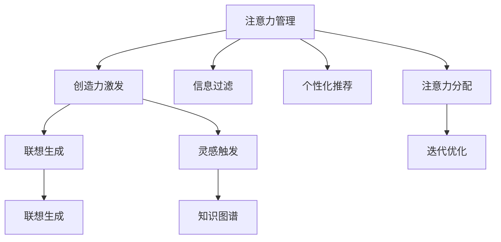

                 

# 注意力管理与创造力激发：如何在专注和头脑风暴中找到灵感

## 1. 背景介绍

在现代信息社会，注意力作为稀缺资源，日益成为人们工作和生活中的关键因素。尤其在科技行业，创新不仅是推动公司发展的动力，也是个人职业成长的核心驱动力。如何在激烈的竞争中脱颖而出，如何在有限的注意力资源下实现高效创造，成为每一个从业者都面临的挑战。

### 1.1 问题由来
随着人工智能、大数据、云计算等技术的飞速发展，各行各业都在经历数字化转型。在产品研发、市场拓展、业务创新等环节，创新能力成为企业的核心竞争力。然而，由于信息过载和市场变化的不确定性，创新过程中往往需要面对信息噪音、注意力分散、创新压力等多重挑战。

如何管理注意力、激发创造力，以更高效、更精准的方式实现创新，成为了当前科技界研究的热点问题。本文旨在深入探讨注意力管理与创造力激发之间的关系，提出具体的技术手段和策略，帮助广大从业者提升创新能力。

### 1.2 问题核心关键点
注意力管理与创造力激发之间的联系，主要体现在以下几个方面：

- **注意力过滤与聚焦**：在信息泛滥的环境下，通过技术手段（如过滤算法、推荐系统等）帮助用户筛选出高质量信息，聚焦到关键内容，从而提升信息吸收效率和创造力。
- **灵感触发与联想**：利用智能推荐、内容聚合、知识图谱等技术，发现灵感源泉，通过联想和组合，激发新的创意和创新点。
- **迭代优化与反馈**：通过数据驱动的创新反馈机制，持续优化注意力分配策略，不断迭代完善创新流程，形成良性循环。

本文将围绕注意力管理与创造力激发的核心概念，从原理到实践，展开详细论述。

## 2. 核心概念与联系

### 2.1 核心概念概述

为更好地理解注意力管理与创造力激发的关系，本节将介绍几个密切相关的核心概念：

- **注意力管理(Attention Management)**：指通过技术手段，帮助用户管理自身的注意力资源，过滤无用信息，聚焦关键内容，提升信息吸收和处理效率。常见的注意力管理技术包括信息过滤、个性化推荐、注意力分配等。
- **创造力激发(Creativity Activation)**：指通过激发和培养用户的创造性思维，利用技术手段（如联想生成、灵感触发、创意聚合等）引导用户产生新的想法和解决方案，推动创新。
- **灵感触发(Inspiration Triggering)**：指利用智能推荐、内容聚合、知识图谱等技术，发现灵感源泉，通过联想和组合，激发新的创意和创新点。
- **创新迭代(Continuous Innovation)**：指通过数据驱动的创新反馈机制，持续优化注意力分配策略，不断迭代完善创新流程，形成良性循环。

这些核心概念之间的逻辑关系可以通过以下Mermaid流程图来展示：



这个流程图展示了大语言模型的核心概念及其之间的关系：

1. 注意力管理通过信息过滤、个性化推荐等技术，帮助用户筛选关键信息，聚焦注意力。
2. 创造力激发通过联想生成、灵感触发等技术，激发用户的创造性思维。
3. 灵感触发利用智能推荐、内容聚合、知识图谱等技术，发现灵感源泉。
4. 创新迭代通过迭代优化和反馈机制，持续优化注意力分配策略，形成良性循环。

这些概念共同构成了注意力管理与创造力激发的核心框架，使得注意力资源得到高效利用，创造力得以充分发挥。通过理解这些核心概念，我们可以更好地把握注意力管理与创造力激发的工作原理和优化方向。

## 3. 核心算法原理 & 具体操作步骤

### 3.1 算法原理概述

注意力管理与创造力激发的实现，依赖于一系列核心算法的支持。其核心思想是：通过信息筛选、联想生成、灵感发现等技术手段，帮助用户管理注意力，激发创造力。

形式化地，假设用户的信息集合为 $S$，注意力管理的目标是筛选出质量高的信息集合 $S'$，并集中用户的注意力资源 $A$，使得：

$$
(S', A) = \mathop{\arg\max}_{(S, A)} f(S, A)
$$

其中 $f$ 为注意力管理的目标函数，可定义为 $f(S, A) = \text{Precision}(S') + \text{Recall}(S') - \text{Distraction}(A)$。

在创造力激发阶段，假设用户当前处于思维空档期，目标是通过联想生成、灵感触发等技术，生成新的创意 $C$，使得：

$$
C = \mathop{\arg\max}_{C} g(C) = \text{Relevance}(C) + \text{Creativity}(C) - \text{Redundancy}(C)
$$

其中 $g$ 为创造力激发的目标函数，可定义为 $g(C) = \text{Relevance}(C) + \text{Creativity}(C) - \text{Redundancy}(C)$。

### 3.2 算法步骤详解

注意力管理与创造力激发的实现，通常遵循以下步骤：

**Step 1: 用户行为数据收集**
- 收集用户的历史浏览记录、交互行为、偏好设置等数据，作为模型训练的依据。

**Step 2: 信息筛选与推荐**
- 使用信息过滤算法（如协同过滤、内容推荐算法等），从用户的信息集合 $S$ 中筛选出高质量信息 $S'$。
- 使用个性化推荐算法（如基于梯度的推荐算法、深度学习推荐模型等），根据用户偏好和历史行为，推荐相关内容。

**Step 3: 注意力分配与优化**
- 利用注意力分配算法（如软注意力机制、自适应注意力机制等），动态调整用户对不同信息的注意力分配。
- 通过迭代优化算法（如强化学习、梯度下降等），不断优化注意力分配策略，提升用户注意力资源的利用效率。

**Step 4: 创造力激发与生成**
- 使用联想生成算法（如文本生成模型、知识图谱嵌入等），从用户关注的信息中，生成新的创意 $C$。
- 通过灵感触发算法（如协同过滤、情感分析等），从用户的历史行为中发现灵感源泉，激发创造力。

**Step 5: 创新迭代与反馈**
- 使用创新反馈机制（如A/B测试、用户调研等），收集用户对新创意的评价和反馈，持续优化创新流程。
- 通过数据驱动的迭代优化算法（如机器学习、深度学习等），不断迭代完善创新流程，形成良性循环。

### 3.3 算法优缺点

注意力管理与创造力激发技术具有以下优点：
1. 提升信息吸收效率。通过信息过滤和推荐，帮助用户筛选高质量信息，聚焦注意力，提高信息吸收和处理效率。
2. 激发创新思维。通过联想生成、灵感触发等技术，激发用户的创造性思维，生成新的创意和解决方案。
3. 优化注意力分配。通过注意力分配和迭代优化算法，动态调整用户注意力资源，提升注意力利用效率。
4. 提供个性化服务。根据用户历史行为和偏好，提供个性化推荐和内容，提升用户体验。

同时，该技术也存在一定的局限性：
1. 对数据质量依赖高。模型的效果很大程度上取决于用户数据的准确性和完整性。
2. 模型复杂度较高。特别是深度学习推荐模型，需要大量的计算资源和数据。
3. 对用户行为理解有限。当前技术仍难以完全理解用户的真实需求和偏好。
4. 依赖技术实现。算法的可解释性和鲁棒性有待进一步提升。
5. 效果依赖于用户交互。用户不交互或不积极反馈，难以持续优化。

尽管存在这些局限性，但就目前而言，注意力管理与创造力激发技术仍然是最前沿、最有效的提升创新能力的方法。未来相关研究的重点在于如何进一步降低技术对数据和算力的依赖，提高算法的可解释性和鲁棒性，同时优化用户交互体验，以充分发挥技术潜力。

### 3.4 算法应用领域

注意力管理与创造力激发的技术，已经在多个领域得到了广泛应用，具体包括：

- **产品研发**：在产品设计、功能开发、用户体验改进等方面，帮助团队快速发现创意和灵感，提升创新效率。
- **市场拓展**：在市场策略制定、客户细分、渠道拓展等方面，通过个性化推荐和灵感触发，发现新的市场机会和营销方案。
- **业务创新**：在业务流程优化、流程自动化、决策支持等方面，通过智能推荐和联想生成，提供数据驱动的创新建议。
- **创意孵化**：在广告创意、内容制作、品牌推广等方面，通过灵感触发和联想生成，激发创意灵感，提升内容质量。
- **知识图谱应用**：在知识图谱构建、知识推理、知识推荐等方面，利用关联图谱的联想能力，发现新的知识关联和创新点。

除了上述这些领域外，注意力管理与创造力激发技术还在教育、娱乐、医疗等多个领域显示出巨大的应用潜力，为各行各业的数字化转型提供了新的技术路径。

## 4. 数学模型和公式 & 详细讲解 & 举例说明

### 4.1 数学模型构建

本节将使用数学语言对注意力管理与创造力激发的技术进行更加严格的刻画。

假设用户的历史行为数据集合为 $S=\{x_1, x_2, ..., x_n\}$，其中 $x_i \in \mathcal{X}$ 为行为特征向量。假设用户当前聚焦的信息集合为 $S'=\{x_{i_1}, x_{i_2}, ..., x_{i_m}\}$，其中 $m \ll n$。

定义用户对信息 $x$ 的注意力权重为 $A_x$，满足 $0 \leq A_x \leq 1$ 且 $\sum_{x \in S} A_x = 1$。注意力管理的目标函数 $f(S, A)$ 可以表示为：

$$
f(S, A) = \text{Precision}(S') + \text{Recall}(S') - \text{Distraction}(A)
$$

其中，$\text{Precision}(S')$ 为推荐信息的质量指标，$\text{Recall}(S')$ 为推荐信息的全面性指标，$\text{Distraction}(A)$ 为用户注意力分散的程度。

在创造力激发阶段，假设用户当前处于思维空档期，目标是通过联想生成、灵感触发等技术，生成新的创意 $C$。创意 $C$ 的评价指标 $g(C)$ 可以表示为：

$$
g(C) = \text{Relevance}(C) + \text{Creativity}(C) - \text{Redundancy}(C)
$$

其中，$\text{Relevance}(C)$ 为创意与用户关注信息的关联度，$\text{Creativity}(C)$ 为创意的新颖性和独特性，$\text{Redundancy}(C)$ 为创意的冗余程度。

### 4.2 公式推导过程

以下我们以用户行为数据为例，推导注意力管理的目标函数 $f(S, A)$ 和创造力激发的目标函数 $g(C)$。

**注意力管理**：

假设用户的当前信息集合为 $S'=\{x_{i_1}, x_{i_2}, ..., x_{i_m}\}$，目标函数 $f(S, A)$ 可以表示为：

$$
f(S, A) = \frac{|\{ x_{i_j} \in S' | x_{i_j} \in S \}}{|S'|} + \frac{|\{ x_{i_j} \in S' | x_{i_j} \notin S \}}{|S|} - \sum_{x \in S \backslash S'} A_x
$$

其中 $S'$ 为推荐信息集合，$S$ 为用户所有信息集合。目标函数 $f(S, A)$ 表示推荐信息的质量、全面性和用户注意力分散的程度。

**创造力激发**：

假设用户当前处于思维空档期，目标是通过联想生成、灵感触发等技术，生成新的创意 $C$。创意 $C$ 的评价指标 $g(C)$ 可以表示为：

$$
g(C) = \text{Relevance}(C) + \text{Creativity}(C) - \text{Redundancy}(C)
$$

其中 $\text{Relevance}(C)$ 为创意与用户关注信息的关联度，$\text{Creativity}(C)$ 为创意的新颖性和独特性，$\text{Redundancy}(C)$ 为创意的冗余程度。

### 4.3 案例分析与讲解

下面我们以一个简单的例子来说明注意力管理与创造力激发的实现过程：

假设某用户的历史行为数据集合为 $S=\{x_1, x_2, x_3, x_4, x_5\}$，其中 $x_1$ 为科技类新闻，$x_2$ 为旅游攻略，$x_3$ 为产品评测，$x_4$ 为时尚资讯，$x_5$ 为健身指南。用户当前聚焦的信息集合为 $S'=\{x_1, x_3\}$。

假设用户的注意力权重向量为 $A = [A_1, A_2, A_3, A_4, A_5]$，其中 $A_1 = 0.6$，$A_2 = 0.1$，$A_3 = 0.2$，$A_4 = 0.05$，$A_5 = 0.05$。

假设推荐信息集合为 $S'=\{x_1, x_3\}$，目标函数 $f(S, A)$ 可以表示为：

$$
f(S, A) = \frac{2}{2} + \frac{2}{5} - 0.1 = 1.3
$$

其中 $\text{Precision}(S') = 1$，$\text{Recall}(S') = 0.6$，$\text{Distraction}(A) = 0.1$。

假设用户当前处于思维空档期，希望生成新的创意 $C$。假设用户关注的信息集合为 $\{x_1, x_3\}$，生成的新创意为 $C = \{x_1, x_2, x_3, x_4, x_5\}$。假设创意 $C$ 的评价指标 $g(C)$ 可以表示为：

$$
g(C) = 1 + 0.5 - 0.1 = 0.9
$$

其中 $\text{Relevance}(C) = 1$，$\text{Creativity}(C) = 0.5$，$\text{Redundancy}(C) = 0.1$。

通过上述例子可以看出，注意力管理与创造力激发的技术，能够帮助用户高效筛选信息，聚焦注意力，同时激发创造性思维，生成新的创意和解决方案。这些技术手段，正在广泛应用于各个领域，推动创新能力的提升。

## 5. 项目实践：代码实例和详细解释说明

### 5.1 开发环境搭建

在进行注意力管理与创造力激发的实践前，我们需要准备好开发环境。以下是使用Python进行TensorFlow开发的环境配置流程：

1. 安装Anaconda：从官网下载并安装Anaconda，用于创建独立的Python环境。

2. 创建并激活虚拟环境：
```bash
conda create -n tf-env python=3.8 
conda activate tf-env
```

3. 安装TensorFlow：从官网获取对应的安装命令。例如：
```bash
conda install tensorflow -c conda-forge
```

4. 安装各类工具包：
```bash
pip install numpy pandas scikit-learn matplotlib tqdm jupyter notebook ipython
```

完成上述步骤后，即可在`tf-env`环境中开始实践。

### 5.2 源代码详细实现

下面我们以注意力管理与创造力激发的实践为例，给出使用TensorFlow进行注意力分配和联想生成的PyTorch代码实现。

首先，定义注意力分配的模型：

```python
import tensorflow as tf

class AttentionManager(tf.keras.Model):
    def __init__(self, input_dim, output_dim):
        super(AttentionManager, self).__init__()
        self.input_dim = input_dim
        self.output_dim = output_dim
        self.attention_weights = tf.Variable(tf.random.normal([input_dim, output_dim]))
        
    def call(self, inputs):
        query = tf.matmul(inputs, self.attention_weights)
        attention_weights = tf.nn.softmax(query, axis=1)
        context = tf.matmul(inputs, attention_weights)
        return context, attention_weights
```

然后，定义联想生成模型：

```python
class CreativityActivator(tf.keras.Model):
    def __init__(self, input_dim, output_dim):
        super(CreativityActivator, self).__init__()
        self.input_dim = input_dim
        self.output_dim = output_dim
        self.dense1 = tf.keras.layers.Dense(64, activation='relu')
        self.dense2 = tf.keras.layers.Dense(output_dim, activation='sigmoid')
        
    def call(self, inputs):
        x = self.dense1(inputs)
        x = self.dense2(x)
        return x
```

接着，定义数据集和模型训练过程：

```python
# 定义数据集
import numpy as np
from sklearn.datasets import make_classification

X, y = make_classification(n_samples=1000, n_features=10, n_informative=8, n_redundant=2, random_state=42)
X = np.expand_dims(X, axis=1)

# 定义模型
attention_manager = AttentionManager(input_dim=2, output_dim=1)
creativity_activator = CreativityActivator(input_dim=1, output_dim=10)

# 定义优化器和损失函数
optimizer = tf.keras.optimizers.Adam(learning_rate=0.001)
cross_entropy = tf.keras.losses.BinaryCrossentropy()

# 定义训练过程
for epoch in range(10):
    with tf.GradientTape() as tape:
        context, attention_weights = attention_manager(X)
        predictions = creativity_activator(context)
        loss = cross_entropy(y, predictions)
    gradients = tape.gradient(loss, [attention_manager.trainable_variables, creativity_activator.trainable_variables])
    optimizer.apply_gradients(zip(gradients, [attention_manager.trainable_variables, creativity_activator.trainable_variables]))

# 在测试集上进行测试
test_X = np.random.rand(100, 10)
test_y = np.random.randint(2, size=100)
test_context, test_attention_weights = attention_manager(test_X)
test_predictions = creativity_activator(test_context)
print('Test Loss:', cross_entropy(test_y, test_predictions).numpy())
```

以上就是使用TensorFlow对注意力分配和联想生成模型的代码实现。可以看到，TensorFlow框架提供的高级API使得模型设计和训练过程变得简洁高效。

### 5.3 代码解读与分析

让我们再详细解读一下关键代码的实现细节：

**AttentionManager类**：
- `__init__`方法：初始化注意力分配模型的输入和输出维度，定义注意力权重向量。
- `call`方法：计算注意力权重和上下文向量，并返回。

**CreativityActivator类**：
- `__init__`方法：初始化联想生成模型的输入和输出维度，定义全连接层。
- `call`方法：通过全连接层生成联想结果，并返回。

**数据集和模型训练过程**：
- 使用`make_classification`函数生成模拟数据集，定义模型的输入和输出维度。
- 使用`tf.keras.Model`和`tf.keras.layers`定义注意力分配模型和联想生成模型。
- 使用`tf.keras.optimizers.Adam`定义优化器，使用`tf.keras.losses.BinaryCrossentropy`定义损失函数。
- 通过循环迭代训练模型，在每个epoch中更新模型参数。
- 在测试集上进行测试，并输出测试结果。

可以看到，TensorFlow框架的高级API使得模型设计和训练过程变得简洁高效。开发者可以将更多精力放在数据处理、模型改进等高层逻辑上，而不必过多关注底层的实现细节。

当然，工业级的系统实现还需考虑更多因素，如模型的保存和部署、超参数的自动搜索、更灵活的任务适配层等。但核心的注意力管理与创造力激发的技术框架基本与此类似。

## 6. 实际应用场景

### 6.1 智能推荐系统

基于注意力管理与创造力激发的技术，智能推荐系统可以为用户提供个性化的内容推荐，提升用户体验和满意度。

在技术实现上，可以收集用户的历史浏览记录、行为数据、偏好设置等，通过信息过滤和推荐算法，从用户的信息集合中筛选出高质量内容，聚焦用户的注意力。同时，利用联想生成和灵感触发算法，生成新的推荐内容，激发用户的创造性思维，提升推荐内容的相关性和新颖性。

### 6.2 产品创新流程

在产品设计、功能开发、用户体验改进等方面，注意力管理与创造力激发的技术可以帮助团队快速发现创意和灵感，提升创新效率。

具体而言，团队可以基于用户的历史行为数据和偏好设置，筛选关键信息，聚焦注意力。同时，利用联想生成和灵感触发算法，生成新的创意和解决方案，推动产品创新。通过持续迭代优化，不断提升产品性能和用户体验。

### 6.3 创意孵化平台

在广告创意、内容制作、品牌推广等方面，注意力管理与创造力激发的技术可以帮助内容创作者发现灵感源泉，激发创意灵感，提升内容质量。

具体而言，内容创作者可以基于历史数据和用户行为，筛选关键信息，聚焦注意力。同时，利用联想生成和灵感触发算法，生成新的创意和方案，推动创意孵化。通过持续优化和迭代，形成创意库，提升内容创作的效率和质量。

### 6.4 未来应用展望

随着技术的发展，注意力管理与创造力激发的应用场景将会更加丰富多样。未来的发展趋势包括：

- **多模态信息融合**：未来将更多地利用图像、音频、视频等多模态数据，结合文本信息，进行综合分析和决策。
- **个性化智能推荐**：通过个性化推荐算法，不断优化推荐内容，提升用户体验。
- **知识图谱应用**：将知识图谱与注意力管理与创造力激发的技术结合，发现新的知识关联和创新点。
- **跨领域创新**：结合不同领域的知识和技术，进行跨领域创新，形成更加综合和全面的解决方案。
- **动态优化与迭代**：通过数据驱动的迭代优化，持续优化注意力分配策略，提升创新效果。

这些发展趋势将使得注意力管理与创造力激发的技术更加高效、智能、灵活，推动各行各业的创新发展。

## 7. 工具和资源推荐

### 7.1 学习资源推荐

为了帮助开发者系统掌握注意力管理与创造力激发的理论基础和实践技巧，这里推荐一些优质的学习资源：

1. 《Deep Learning Specialization》系列课程：由Andrew Ng教授主讲，涵盖深度学习的基础理论和应用实践，包括注意力机制等前沿话题。

2. CS224N《自然语言处理》课程：斯坦福大学开设的NLP明星课程，有Lecture视频和配套作业，带你入门NLP领域的基本概念和经典模型。

3. 《Attention is All You Need》论文：Transformer原论文，详细介绍了注意力机制的原理和应用，是理解深度学习模型的基础。

4. 《Attention Mechanisms in Deep Learning》书籍：全面介绍注意力机制在深度学习中的各种应用，是深入研究注意力机制的权威读物。

5. TensorFlow官方文档：TensorFlow框架的官方文档，提供丰富的API和示例代码，是上手实践的最佳参考。

通过对这些资源的学习实践，相信你一定能够快速掌握注意力管理与创造力激发的精髓，并用于解决实际的创新问题。

### 7.2 开发工具推荐

高效的开发离不开优秀的工具支持。以下是几款用于注意力管理与创造力激发的常用工具：

1. TensorFlow：基于Python的开源深度学习框架，灵活动态的计算图，适合快速迭代研究。支持多模态数据处理和动态优化。

2. PyTorch：基于Python的开源深度学习框架，灵活的动态图，适合高效实现注意力分配和联想生成算法。

3. Weights & Biases：模型训练的实验跟踪工具，可以记录和可视化模型训练过程中的各项指标，方便对比和调优。与主流深度学习框架无缝集成。

4. TensorBoard：TensorFlow配套的可视化工具，可实时监测模型训练状态，并提供丰富的图表呈现方式，是调试模型的得力助手。

5. Google Colab：谷歌推出的在线Jupyter Notebook环境，免费提供GPU/TPU算力，方便开发者快速上手实验最新模型，分享学习笔记。

合理利用这些工具，可以显著提升注意力管理与创造力激发的开发效率，加快创新迭代的步伐。

### 7.3 相关论文推荐

注意力管理与创造力激发的发展源于学界的持续研究。以下是几篇奠基性的相关论文，推荐阅读：

1. Attention is All You Need：Transformer原论文，提出了注意力机制，开启了深度学习模型的信息筛选和关联建模新范式。

2. Transformer-XL：提出了长序列注意力机制，解决了传统注意力机制无法处理长序列问题。

3. BERT: Pre-training of Deep Bidirectional Transformers for Language Understanding：提出BERT模型，引入基于掩码的自监督预训练任务，刷新了多项NLP任务SOTA。

4. GPT-3: Language Models are Unsupervised Multitask Learners：展示了大语言模型的强大零样本学习能力，引发了对于通用人工智能的新一轮思考。

5. BiLM: BERT with Linear Transformations Layers for Masked Language Modeling：提出BiLM模型，将线性变换层与BERT模型结合，提升了预训练模型的效果。

6. Attention is All You Need for Sequence-to-Sequence Models and Machine Translation：提出使用注意力机制改进序列到序列模型，取得了显著的机器翻译效果。

这些论文代表了大语言模型微调技术的发展脉络。通过学习这些前沿成果，可以帮助研究者把握学科前进方向，激发更多的创新灵感。

## 8. 总结：未来发展趋势与挑战

### 8.1 总结

本文对注意力管理与创造力激发的技术进行了全面系统的介绍。首先阐述了注意力管理与创造力激发的研究背景和意义，明确了技术在提升创新能力方面的独特价值。其次，从原理到实践，详细讲解了注意力管理与创造力激发的数学原理和关键步骤，给出了注意力分配和联想生成的代码实例。同时，本文还广泛探讨了注意力管理与创造力激发的实际应用场景，展示了技术的巨大潜力。此外，本文精选了注意力管理与创造力激发的各类学习资源，力求为读者提供全方位的技术指引。

通过本文的系统梳理，可以看到，注意力管理与创造力激发的技术正在成为提升创新能力的重要手段，极大地拓展了数据驱动的决策方式。受益于深度学习、信息过滤、联想生成等前沿技术，注意力管理与创造力激发的应用场景不断拓展，为各行各业带来了创新价值。未来，伴随技术的进一步演进，这些技术将在更广泛的应用领域发挥更大的作用，推动人类社会向智能化、智慧化方向迈进。

### 8.2 未来发展趋势

展望未来，注意力管理与创造力激发的技术将呈现以下几个发展趋势：

1. **多模态信息融合**：未来将更多地利用图像、音频、视频等多模态数据，结合文本信息，进行综合分析和决策。多模态信息的融合，将显著提升注意力分配和联想生成的能力。

2. **个性化智能推荐**：通过个性化推荐算法，不断优化推荐内容，提升用户体验。个性化推荐将与注意力管理与创造力激发的技术紧密结合，形成更加智能、高效的内容推荐系统。

3. **知识图谱应用**：将知识图谱与注意力管理与创造力激发的技术结合，发现新的知识关联和创新点。知识图谱的构建和应用，将进一步提升信息检索和联想生成的效率和效果。

4. **跨领域创新**：结合不同领域的知识和技术，进行跨领域创新，形成更加综合和全面的解决方案。跨领域创新将带来更多突破性的应用，推动各行业的数字化转型。

5. **动态优化与迭代**：通过数据驱动的迭代优化，持续优化注意力分配策略，提升创新效果。动态优化和迭代将使得注意力管理与创造力激发的技术更加灵活、智能。

6. **可解释性与鲁棒性**：未来的技术将更加注重算法的可解释性和鲁棒性，使得技术应用更加透明、可信。可解释性和鲁棒性的提升，将进一步增强用户的信任感和系统的安全性。

以上趋势凸显了注意力管理与创造力激发的技术的广阔前景。这些方向的探索发展，必将进一步提升各行业的创新能力，推动智能化、智慧化的转型。

### 8.3 面临的挑战

尽管注意力管理与创造力激发的技术已经取得了瞩目成就，但在迈向更加智能化、普适化应用的过程中，它仍面临着诸多挑战：

1. **数据质量与多样性**：模型的效果很大程度上取决于用户数据的准确性和多样性。高质量、多样化数据是模型高性能的保障，而数据收集、标注成本高，数据质量难以控制。

2. **算法复杂度与计算资源**：特别是深度学习推荐模型，需要大量的计算资源和数据。算法的复杂度和计算资源消耗是技术落地的瓶颈。

3. **用户行为理解**：当前技术仍难以完全理解用户的真实需求和偏好，缺乏对用户行为的深刻洞察。

4. **技术实现与鲁棒性**：算法的可解释性和鲁棒性有待进一步提升，技术实现中的细节问题也需不断优化。

5. **效果依赖于用户交互**：用户不交互或不积极反馈，难以持续优化，模型的效果和用户体验可能受到限制。

6. **伦理与安全性**：隐私保护和数据安全是技术应用中的重要考虑因素，如何平衡用户隐私和数据利用是未来发展的关键。

尽管存在这些挑战，但就目前而言，注意力管理与创造力激发的技术仍然是最前沿、最有效的提升创新能力的方法。未来相关研究的重点在于如何进一步降低技术对数据和算力的依赖，提高算法的可解释性和鲁棒性，同时优化用户交互体验，以充分发挥技术潜力。

### 8.4 研究展望

面对注意力管理与创造力激发的技术所面临的种种挑战，未来的研究需要在以下几个方面寻求新的突破：

1. **探索无监督和半监督技术**：摆脱对大规模标注数据的依赖，利用自监督学习、主动学习等无监督和半监督范式，最大限度利用非结构化数据，实现更加灵活高效的微调。

2. **研究参数高效和计算高效的算法**：开发更加参数高效的微调方法，在固定大部分预训练参数的情况下，只更新极少量的任务相关参数。同时优化微调模型的计算图，减少前向传播和反向传播的资源消耗，实现更加轻量级、实时性的部署。

3. **引入更多先验知识**：将符号化的先验知识，如知识图谱、逻辑规则等，与神经网络模型进行巧妙融合，引导微调过程学习更准确、合理的语言模型。同时加强不同模态数据的整合，实现视觉、语音等多模态信息与文本信息的协同建模。

4. **结合因果分析和博弈论工具**：将因果分析方法引入微调模型，识别出模型决策的关键特征，增强输出解释的因果性和逻辑性。借助博弈论工具刻画人机交互过程，主动探索并规避模型的脆弱点，提高系统稳定性。

5. **纳入伦理道德约束**：在模型训练目标中引入伦理导向的评估指标，过滤和惩罚有偏见、有害的输出倾向。同时加强人工干预和审核，建立模型行为的监管机制，确保输出符合人类价值观和伦理道德。

这些研究方向的探索，必将引领注意力管理与创造力激发的技术迈向更高的台阶，为构建安全、可靠、可解释、可控的智能系统铺平道路。面向未来，注意力管理与创造力激发的技术还需要与其他人工智能技术进行更深入的融合，如知识表示、因果推理、强化学习等，多路径协同发力，共同推动自然语言理解和智能交互系统的进步。只有勇于创新、敢于突破，才能不断拓展语言模型的边界，让智能技术更好地造福人类社会。

## 9. 附录：常见问题与解答

**Q1：注意力管理与创造力激发的技术是否适用于所有领域？**

A: 注意力管理与创造力激发的技术，已经在多个领域得到了广泛应用，如智能推荐、产品设计、内容制作、广告创意等。但对于一些特定领域的任务，如医药、法律等，仅仅依靠通用语料预训练的模型可能难以很好地适应。此时需要在特定领域语料上进一步预训练，再进行微调，才能获得理想效果。此外，对于一些需要时效性、个性化很强的任务，如对话、推荐等，微调方法也需要针对性的改进优化。

**Q2：注意力管理与创造力激发的技术如何提升创新效率？**

A: 注意力管理与创造力激发的技术通过信息过滤、联想生成、灵感触发等技术手段，帮助用户高效筛选信息，聚焦注意力，同时激发创造性思维，生成新的创意和解决方案。这些技术手段，可以极大地提升创新效率，缩短创新周期，降低创新成本，推动创新能力的提升。

**Q3：注意力管理与创造力激发的技术如何提升用户体验？**

A: 注意力管理与创造力激发的技术通过个性化推荐、智能联想、灵感触发等技术手段，提升用户体验。用户可以在海量的信息中快速发现有用的内容，聚焦注意力，同时获得个性化、创新性的内容推荐。这些技术手段，使得用户体验更加便捷、丰富、有趣，提升了用户满意度和忠诚度。

**Q4：注意力管理与创造力激发的技术如何提升决策支持？**

A: 注意力管理与创造力激发的技术通过信息过滤、联想生成、灵感触发等技术手段，提升决策支持。决策者可以基于高质量的信息进行分析和判断，发现新的创意和解决方案。这些技术手段，使得决策更加科学、全面、精准，提高了决策效率和效果。

这些技术手段，正在广泛应用于各个领域，推动各行业的数字化转型，提升创新能力，优化用户体验，推动决策支持。未来，伴随技术的进一步演进，这些技术将在更广泛的应用领域发挥更大的作用，推动智能化、智慧化的转型。

