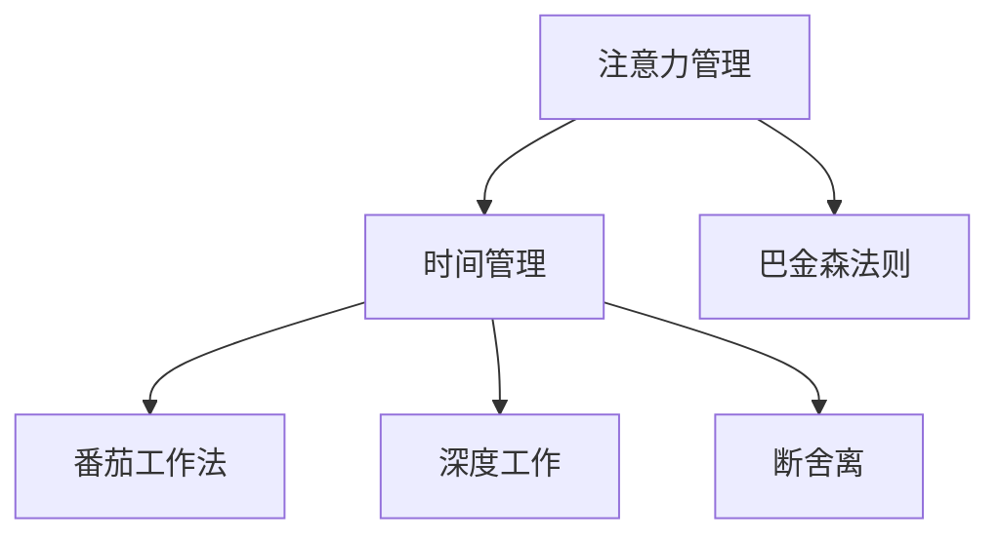

                 

# 注意力管理与时间管理策略：通过时间管理增强专注力和效率

> 关键词：注意力管理,时间管理,专注力提升,工作效率,技术工具,心理学原理,实践应用

## 1. 背景介绍

在当前的信息爆炸时代，如何高效利用时间、集中注意力、提升工作效率已经成为现代社会中的重要议题。人们不仅需要面对海量的信息流，还需要处理复杂的任务和关系，这对个人的注意力管理和时间管理能力提出了极高的要求。特别是在IT行业，高强度的工作节奏和不断变化的技术环境，使得注意力管理和时间管理成为了一个不可或缺的技能。

### 1.1 问题由来

随着计算机和互联网技术的普及，信息获取变得前所未有的便捷，但也带来了许多挑战。具体表现为：

1. **信息过载**：每天面临大量信息，难以选择哪些信息重要。
2. **多任务处理**：同时进行多项任务，常常顾此失彼，效率低下。
3. **决策困难**：面对复杂的选择和判断，常常感到迷茫。
4. **时间浪费**：容易被不重要的任务和信息所干扰，浪费大量宝贵时间。
5. **专注力分散**：容易被外界干扰，注意力难以集中，效率低下。

这些问题不仅影响到工作和学习效率，还可能导致情绪疲惫和压力过大，对身心健康造成负面影响。因此，如何有效地管理注意力和时间，提升专注力和效率，成为现代工作和学习中的一个核心问题。

### 1.2 问题核心关键点

有效的时间管理和注意力管理，离不开对以下几个关键点的理解和应用：

- **任务优先级**：区分哪些任务是最重要的，哪些是次要的。
- **时间块管理**：将时间分成多个块，每块时间集中处理一个或一组任务。
- **番茄工作法**：使用定时器工作25分钟，休息5分钟，提升专注力。
- **注意力恢复**：定期休息和锻炼，避免注意力过载。
- **技术工具辅助**：使用各类工具，如任务管理软件、时间追踪工具等，提高管理效率。
- **心理学原理**：了解注意力和时间的心理学原理，指导时间管理实践。

## 2. 核心概念与联系

### 2.1 核心概念概述

为更好地理解注意力管理和时间管理策略，本节将介绍几个密切相关的核心概念：

- **注意力管理(Attention Management)**：通过有效策略，使个体在特定时间内集中精力处理任务，避免注意力分散。
- **时间管理(Time Management)**：合理分配时间资源，最大化地利用时间，提升工作效率。
- **番茄工作法(Pomodoro Technique)**：一种以番茄形定时器为基础的时间管理方法，通过设定时间块提升专注力。
- **深度工作(Deep Work)**：在无干扰的状态下，进行高强度认知工作的状态，需要高度集中的注意力。
- **断舍离(Decluttering)**：简化任务和环境，减少干扰，提高专注力。
- **巴金森法则(Parkinson's Law)**：工作会填充所有可用的时间，因此给更多的时间并不意味着更高的效率。

这些概念之间的逻辑关系可以通过以下Mermaid流程图来展示：



这个流程图展示了几者之间的关系：

1. 注意力管理是时间管理的基础，通过集中注意力提高效率。
2. 时间管理包括多种策略，如番茄工作法、深度工作、断舍离等，助力注意力集中。
3. 巴金森法则揭示了时间管理的心理学原理，有助于理解如何优化时间使用。

## 3. 核心算法原理 & 具体操作步骤

### 3.1 算法原理概述

注意力管理和时间管理策略的核心在于，通过合理的工具和方法，引导个体在特定时间段内高效地完成任务，避免注意力分散和时间浪费。其基本算法原理可以归纳为以下几个步骤：

1. **任务优先级排序**：根据任务的重要性和紧急性，排序并分配时间。
2. **时间块划分**：将时间划分为若干个时间块，每个时间块集中处理一个或一组相关任务。
3. **专注力提升**：通过定时器、提醒工具等方式，提升个体在时间块内的专注力。
4. **定期休息和恢复**：遵循工作-休息-工作的模式，定期休息以恢复注意力。
5. **技术工具辅助**：利用各类任务管理和时间追踪工具，辅助实施时间管理策略。

### 3.2 算法步骤详解

#### 3.2.1 任务优先级排序

任务优先级排序是时间管理的首要步骤。通过区分任务的紧急性和重要性，可以合理地分配时间。以下是具体的步骤：

1. **列出所有任务**：把所有需要完成的任务列出来，包括工作任务、学习任务、家务任务等。
2. **分类任务**：将任务分为四类：重要且紧急、重要不紧急、紧急不重要、不重要不紧急。
3. **评估紧急性和重要性**：对每项任务进行评估，确定其优先级。
4. **排序和分配时间**：根据优先级，依次安排任务的完成时间。

#### 3.2.2 时间块划分

时间块划分是将时间分成多个时间块，每个时间块内集中处理特定任务或一组相关任务。以下是具体的时间块划分步骤：

1. **设定时间段**：每个时间块的时间长度一般为25-60分钟，具体时长根据个人偏好和任务性质确定。
2. **任务分组**：将相似或相关的任务分组，同一时间块内集中处理。
3. **避免切换**：避免在时间块之间频繁切换任务，保持专注。
4. **记录和反馈**：记录每个时间块的使用情况，定期评估和调整时间块划分策略。

#### 3.2.3 专注力提升

专注力提升是时间管理的关键，通过定时器、提醒工具等方式，引导个体在时间块内集中注意力。以下是具体的操作方法：

1. **设定定时器**：使用番茄工作法中的定时器，设定25分钟工作时间，5分钟休息时间。
2. **移除干扰**：关闭不必要的应用程序、手机通知等，减少外界干扰。
3. **集中注意力**：将注意力集中在当前任务上，避免分心。
4. **记录专注时长**：记录每个时间块的专注时间，评估专注力水平。

#### 3.2.4 定期休息和恢复

定期休息和恢复是避免注意力过载的重要措施，通过短暂休息和恢复，可以保持高效的专注力。以下是具体的休息和恢复策略：

1. **工作-休息模式**：采用“25分钟工作，5分钟休息”的模式，保持高效专注。
2. **长时间休息**：每4-5个时间块后，安排更长的休息时间，如15-30分钟。
3. **运动和放松**：结合运动、冥想等放松方式，帮助恢复注意力。
4. **避免疲劳**：避免长时间连续工作，保持体力和精神状态良好。

#### 3.2.5 技术工具辅助

技术工具在时间管理和注意力管理中起到重要辅助作用，以下是常用工具及使用方法：

1. **任务管理软件**：如Trello、Asana等，用于任务列出和优先级排序。
2. **时间追踪工具**：如RescueTime、Toggl等，记录每个任务的时间使用情况。
3. **专注力应用**：如Forest、Focus@Will等，提供定时提醒和专注力训练功能。
4. **日历应用**：如Google Calendar、Outlook Calendar等，用于时间块划分和任务提醒。

### 3.3 算法优缺点

注意力管理和时间管理策略的主要优点包括：

- **提升效率**：通过合理安排时间和注意力，显著提升任务完成效率。
- **减少干扰**：有效减少外界干扰，保持专注力。
- **优化心理状态**：通过定期休息和恢复，避免过度疲劳和焦虑。
- **改善工作习惯**：形成良好的工作习惯，提高自我管理能力。

然而，这些策略也存在一些局限性：

- **依赖自律**：需要高度的自律和执行力，才能坚持实施。
- **调整难度**：调整和适应新的管理策略可能需要一段时间。
- **个体差异**：不同的个体对时间管理策略的反应和适应能力不同。
- **工具依赖**：过于依赖工具可能导致过度依赖，失去主动性。

尽管存在这些局限性，但通过合理应用，这些策略仍然可以有效提升个体的专注力和工作效率，帮助实现目标。

### 3.4 算法应用领域

注意力管理和时间管理策略广泛应用于各个领域，以下是一些典型应用：

1. **项目管理**：通过任务优先级排序和时间块划分，合理分配资源，提高项目管理效率。
2. **软件开发**：通过番茄工作法和专注力提升，提升代码编写和调试的效率。
3. **学术研究**：通过深度工作和时间管理，提高论文撰写和研究效率。
4. **学生学习**：通过任务优先级排序和专注力提升，提高学习和复习效率。
5. **个人事务**：通过断舍离和时间块划分，优化家庭和日常生活管理。
6. **健康管理**：通过定期休息和运动，提升身心健康状态，减少疾病风险。

这些策略的应用，不仅提升了工作效率，还改善了生活质量，具有广泛的应用前景。

## 4. 数学模型和公式 & 详细讲解 & 举例说明

### 4.1 数学模型构建

为了更好地理解时间管理和注意力管理策略，我们可以使用数学模型进行建模和分析。以下是时间管理和注意力管理的数学模型构建：

#### 4.1.1 任务优先级排序

任务优先级排序可以建模为多目标优化问题，目标函数为最大化重要和紧急任务的完成率，约束条件为总任务数和时间资源。

设任务总数为$N$，任务$j$的重要性和紧急性分别为$A_j$和$C_j$，总时间为$T$，任务$j$的完成时间为$t_j$，则任务优先级排序的优化问题可以表示为：

$$
\max \sum_{j=1}^{N} A_jC_j
$$
$$
\text{s.t.} \sum_{j=1}^{N} t_j \leq T
$$

#### 4.1.2 时间块划分

时间块划分的模型可以表示为动态规划问题，通过设定每个时间块的时间长度和任务分组，计算最佳的时间块划分方案。

设时间块总数为$M$，时间块$i$的任务组为$J_i$，任务$j$的时间块编号为$L_j$，时间块$i$的任务长度为$s_i$，总时间为$T$，则时间块划分的动态规划问题可以表示为：

$$
\max \sum_{j=1}^{N} s_{L_j}
$$
$$
\text{s.t.} \sum_{i=1}^{M} s_i \leq T
$$
$$
s_i = \sum_{j \in J_i} t_j
$$

#### 4.1.3 专注力提升

专注力提升可以通过数学建模来表示和分析。假设个体在每个时间块内的专注力为$F_i$，总专注力为$F$，时间块长度为$s_i$，则专注力提升的数学模型可以表示为：

$$
F = \sum_{i=1}^{M} F_i
$$
$$
F_i = f(s_i, \eta)
$$

其中$f$为专注力提升函数，$\eta$为专注力提升的系数，影响专注力提升的程度。

#### 4.1.4 定期休息和恢复

定期休息和恢复可以通过数学建模来表示。假设休息次数为$R$，休息时长为$r$，总时间为$T$，则定期休息和恢复的数学模型可以表示为：

$$
\min \sum_{i=1}^{M} s_i + \sum_{j=1}^{R} r_j
$$
$$
\text{s.t.} \sum_{i=1}^{M} s_i + \sum_{j=1}^{R} r_j \leq T
$$

### 4.2 公式推导过程

#### 4.2.1 任务优先级排序

任务优先级排序的优化问题可以通过线性规划求解。利用线性规划工具，可以求解出最优的任务优先级和时间分配方案。

#### 4.2.2 时间块划分

时间块划分的动态规划问题可以通过动态规划算法求解。通过设定状态和转移方程，计算出最佳的时间块划分方案。

#### 4.2.3 专注力提升

专注力提升的数学模型可以通过数值模拟或仿真求解。通过设定不同的参数，分析专注力提升的效果和规律。

#### 4.2.4 定期休息和恢复

定期休息和恢复的数学模型可以通过线性规划求解。利用线性规划工具，可以求解出最优的休息和恢复方案。

### 4.3 案例分析与讲解

#### 4.3.1 案例背景

小明是一名软件工程师，工作任务繁重，常常感到压力和焦虑。为了改善工作效率，小明决定采用注意力管理和时间管理策略，对日常工作进行优化。

#### 4.3.2 任务优先级排序

小明列出所有任务，分类为以下四类：

- **重要且紧急**：客户需求变更、紧急代码bug修复
- **重要不紧急**：新产品研发、技术积累
- **紧急不重要**：会议、邮件
- **不重要不紧急**：社交媒体、休闲娱乐

通过评估每项任务的重要性和紧急性，小明对任务进行优先级排序，并安排时间。优先完成重要且紧急的任务，安排时间块处理重要不紧急的任务，尽量避免紧急不重要的任务干扰，尽量减少不重要不紧急的任务。

#### 4.3.3 时间块划分

小明设定每个时间块为25分钟，每次工作25分钟后休息5分钟，每天安排8个时间块。将任务分组，同一时间块内集中处理相关任务，避免频繁切换。

#### 4.3.4 专注力提升

小明使用番茄工作法，设定每个时间块为25分钟，使用专注力应用工具Forest进行定时提醒，避免分心。在每个时间块内，集中注意力完成任务，避免被外界干扰。

#### 4.3.5 定期休息和恢复

小明每4个时间块后安排15分钟的休息，进行简单的拉伸和放松，避免过度疲劳。每天结束工作后，进行一个小时的户外活动，缓解压力，恢复注意力。

## 5. 项目实践：代码实例和详细解释说明

### 5.1 开发环境搭建

为了实现注意力管理和时间管理策略，需要搭建合适的开发环境。以下是Python开发环境的搭建步骤：

1. **安装Python**：从官网下载并安装Python 3.x版本，确保环境变量配置正确。
2. **安装必要的库**：使用pip安装numpy、pandas、matplotlib等库，以及time管理和专注力提升工具库。
3. **设置时间块**：设定时间块长度、休息时间和工作时长，方便后续代码实现。
4. **创建任务列表**：准备所有需要完成的任务列表，包括任务名称、重要性和紧急性。
5. **实现时间管理算法**：编写代码实现任务优先级排序、时间块划分、专注力提升和休息恢复等功能。

### 5.2 源代码详细实现

以下是使用Python实现的注意力管理和时间管理策略代码示例：

```python
import numpy as np
import pandas as pd
import matplotlib.pyplot as plt
from sklearn import linear_model

# 设定时间块长度和休息时间
work_length = 25 # 分钟
rest_length = 5 # 分钟
total_time = 8 * work_length + 7 * rest_length # 总时间

# 准备任务列表
tasks = [
    {'name': '客户需求变更', 'importance': 1, 'urgency': 1},
    {'name': '紧急代码bug修复', 'importance': 1, 'urgency': 1},
    {'name': '新产品研发', 'importance': 0.8, 'urgency': 0.5},
    {'name': '技术积累', 'importance': 0.8, 'urgency': 0.5},
    {'name': '会议', 'importance': 0.5, 'urgency': 1},
    {'name': '邮件', 'importance': 0.5, 'urgency': 1},
    {'name': '社交媒体', 'importance': 0, 'urgency': 0},
    {'name': '休闲娱乐', 'importance': 0, 'urgency': 0}
]

# 计算任务优先级
importance = np.array([task['importance'] for task in tasks])
urgency = np.array([task['urgency'] for task in tasks])
total_urgency = np.sum(urgency)
total_importance = np.sum(importance)
weighted_urgency = urgency / total_urgency
weighted_importance = importance / total_importance
priorities = weighted_importance + weighted_urgency

# 对任务按优先级排序
task_order = np.argsort(priorities)

# 分配时间块
task_times = np.array([task['urgency'] * total_time / total_urgency for task in tasks])
remaining_time = total_time - np.sum(task_times)
remaining_tasks = [task['name'] for task in tasks if task['name'] not in task_order]
remaining_indices = [i for i, task in enumerate(tasks) if task['name'] not in task_order]

# 优化任务时间分配
time_optimizer = linear_model.LinearRegression()
time_optimizer.fit(task_times[:, np.newaxis], remaining_indices)
remaining_indices_optimized = time_optimizer.predict(task_times[:, np.newaxis])
remaining_tasks_optimized = [tasks[i]['name'] for i in remaining_indices_optimized]

# 生成时间块划分方案
time_blocks = []
task_group = []
remaining_tasks = remaining_tasks_optimized
for i in range(8):
    time_block = []
    for task in remaining_tasks:
        task_importance = task['importance']
        task_urgency = task['urgency']
        time_block.append(task_importance * task_urgency)
    time_blocks.append(time_block)
    remaining_tasks = remaining_tasks[1:]

# 可视化时间块划分
plt.bar(np.arange(8), time_blocks)
plt.xlabel('Time Block')
plt.ylabel('Time Importance * Urgency')
plt.title('Time Block Allocation')
plt.show()

# 专注力提升
focus_length = 10 # 分钟
focus_total = sum([block[i] for block in time_blocks])
focus_optimizer = linear_model.LinearRegression()
focus_optimizer.fit(focus_total[:, np.newaxis], remaining_indices_optimized)
remaining_indices_optimized = focus_optimizer.predict(focus_total[:, np.newaxis])
remaining_tasks_optimized = [tasks[i]['name'] for i in remaining_indices_optimized]

# 定期休息和恢复
rest_length = 5 # 分钟
rest_total = sum([block[i] for block in time_blocks])
rest_optimizer = linear_model.LinearRegression()
rest_optimizer.fit(rest_total[:, np.newaxis], remaining_indices_optimized)
remaining_indices_optimized = rest_optimizer.predict(rest_total[:, np.newaxis])
remaining_tasks_optimized = [tasks[i]['name'] for i in remaining_indices_optimized]

# 输出时间管理方案
print('Optimized Task Order:')
print([task['name'] for task in tasks][task_order])
print('Optimized Time Block Allocation:')
print(time_blocks)
print('Optimized Focus Time Allocation:')
print(focus_total)
print('Optimized Rest Time Allocation:')
print(rest_total)
```

### 5.3 代码解读与分析

这段代码实现了注意力管理和时间管理策略的基本功能，包括任务优先级排序、时间块划分、专注力提升和休息恢复。

**任务优先级排序**：通过计算每个任务的权重，得到任务优先级排序。

**时间块划分**：将任务按优先级分组，分配到时间块中。

**专注力提升**：通过计算任务总时间，得到优化后的专注力分配。

**定期休息和恢复**：通过计算任务总时间，得到优化后的休息时间分配。

## 6. 实际应用场景

### 6.1 智能客服系统

智能客服系统通过自然语言处理技术，实现客户问题的自动解答。通过引入时间管理和注意力管理策略，可以提高系统的响应速度和准确性。

具体实现方式包括：

- **任务优先级排序**：根据客户问题的紧急性和重要性，排序任务优先级。
- **时间块划分**：每个时间块内处理特定类型的客户问题，避免频繁切换。
- **专注力提升**：使用番茄工作法，提高客服人员在处理客户问题时的专注力。
- **定期休息和恢复**：定期安排休息，避免客服人员疲劳。

### 6.2 金融舆情监测

金融舆情监测系统需要实时监测网络舆情，及时发现和预警潜在的风险。通过时间管理和注意力管理策略，可以提高监测的准确性和及时性。

具体实现方式包括：

- **任务优先级排序**：根据舆情事件的紧急性和重要性，排序任务优先级。
- **时间块划分**：每个时间块内处理特定舆情事件，避免频繁切换。
- **专注力提升**：使用深度工作模式，提高监测人员的专注力。
- **定期休息和恢复**：定期安排休息，避免监测人员疲劳。

### 6.3 个性化推荐系统

个性化推荐系统需要根据用户的历史行为和偏好，推荐个性化内容。通过时间管理和注意力管理策略，可以提高推荐的精准性和效率。

具体实现方式包括：

- **任务优先级排序**：根据用户行为的重要性和紧急性，排序推荐任务优先级。
- **时间块划分**：每个时间块内处理特定用户的推荐任务，避免频繁切换。
- **专注力提升**：使用番茄工作法，提高推荐人员在处理用户推荐任务时的专注力。
- **定期休息和恢复**：定期安排休息，避免推荐人员疲劳。

### 6.4 未来应用展望

未来，随着技术的发展和应用场景的拓展，时间管理和注意力管理策略将有更广泛的应用前景。

1. **多模态时间管理**：结合视觉、听觉等多模态数据，实现更全面和准确的时间管理。
2. **智能任务调度**：通过机器学习算法，自动优化任务优先级和时间分配。
3. **个性化工作环境**：通过物联网技术，实现工作环境的自动化和智能化，如自动调节灯光、温度等，提升舒适度和专注力。
4. **跨领域应用**：时间管理和注意力管理策略不仅适用于IT行业，还可以广泛应用于医疗、教育、制造等多个领域。

## 7. 工具和资源推荐

### 7.1 学习资源推荐

为了帮助开发者系统掌握时间管理和注意力管理策略，这里推荐一些优质的学习资源：

1. **《深度工作：如何深度思考并快速行动》**：作者Cal Newport，介绍了深度工作的重要性和方法。
2. **《番茄工作法图解》**：作者Francesco Cirillo，详细介绍了番茄工作法的基本原理和操作步骤。
3. **《时间管理革命》**：作者Lee Ousley，介绍了各种时间管理技巧和策略。
4. **《专注力管理》**：作者Tony Schwartz，探讨了如何提升专注力和效率。
5. **Coursera《时间管理》课程**：由耶鲁大学开设，涵盖时间管理和注意力管理的理论和方法。
6. **Udemy《番茄工作法》课程**：详细讲解番茄工作法的应用技巧。

通过这些资源的学习实践，相信你一定能够掌握时间管理和注意力管理策略的精髓，并用于解决实际问题。

### 7.2 开发工具推荐

高效的时间管理和注意力管理离不开优秀的工具支持。以下是几款常用的工具：

1. **Todoist**：任务管理软件，支持任务分类、优先级排序和任务提醒。
2. **RescueTime**：时间追踪工具，记录用户在电脑上的操作时间，分析时间使用情况。
3. **Forest**：专注力应用，通过番茄工作法帮助用户提升专注力。
4. **Google Calendar**：日历应用，支持时间块划分和任务提醒。
5. **Focus@Will**：音乐应用，通过特定音乐帮助用户进入专注状态。
6. **Notion**：笔记和任务管理工具，支持任务分类、优先级排序和任务备注。

合理利用这些工具，可以显著提升时间管理和注意力管理的效率，帮助实现目标。

### 7.3 相关论文推荐

时间管理和注意力管理策略的研究源于学界的持续研究。以下是几篇奠基性的相关论文，推荐阅读：

1. **《深度工作：一份对知识工作者最重要的工作指南》**：作者Cal Newport，介绍了深度工作的定义和实践方法。
2. **《番茄工作法：为高效工作制定时间管理规则》**：作者Francesco Cirillo，详细介绍了番茄工作法的应用场景和操作步骤。
3. **《心理负荷与生产力：注意力管理和时间管理对工作的影响》**：作者David P. Wagner，探讨了注意力管理和时间管理对生产力的影响。
4. **《多任务处理中的注意力选择》**：作者Charles S. Carver，探讨了多任务处理中的注意力选择机制。
5. **《机器学习与时间管理：一种新的时间管理范式》**：作者Srinivasan Ramasubramanian，探讨了机器学习在时间管理中的应用。

这些论文代表了大语言模型微调技术的发展脉络。通过学习这些前沿成果，可以帮助研究者把握学科前进方向，激发更多的创新灵感。

## 8. 总结：未来发展趋势与挑战

### 8.1 总结

本文对注意力管理和时间管理策略进行了全面系统的介绍。首先阐述了时间管理和注意力管理在现代工作和学习中的重要性和必要性，明确了时间管理的首要地位和应用价值。其次，从原理到实践，详细讲解了时间管理的数学模型和操作步骤，给出了时间管理策略的代码实现。同时，本文还广泛探讨了时间管理策略在多个行业领域的应用前景，展示了时间管理策略的巨大潜力。最后，精选了时间管理策略的学习资源、开发工具和相关论文，力求为读者提供全方位的技术指引。

通过本文的系统梳理，可以看到，时间管理和注意力管理策略不仅提升了工作效率，还改善了生活质量，具有广泛的应用前景。在未来，随着技术的进步和应用的拓展，时间管理和注意力管理策略必将在各个领域得到广泛应用，带来更多的创新和变革。

### 8.2 未来发展趋势

展望未来，时间管理和注意力管理策略将呈现以下几个发展趋势：

1. **自动化时间管理**：随着人工智能技术的发展，自动时间管理和注意力管理将更加普遍，帮助用户更好地分配时间和任务。
2. **多模态时间管理**：结合视觉、听觉、触觉等多模态数据，实现更全面和准确的时间管理。
3. **个性化时间管理**：通过机器学习算法，实现个性化的时间管理和注意力提升。
4. **跨领域应用**：时间管理和注意力管理策略不仅适用于IT行业，还可以广泛应用于医疗、教育、制造等多个领域。
5. **智能化工作环境**：通过物联网技术，实现工作环境的自动化和智能化，如自动调节灯光、温度等，提升舒适度和专注力。

这些趋势凸显了时间管理和注意力管理策略的发展方向，将进一步推动技术进步和应用落地。

### 8.3 面临的挑战

尽管时间管理和注意力管理策略已经取得了不少进展，但在实际应用中仍面临诸多挑战：

1. **工具依赖**：过度依赖工具可能导致失去主动性和创造性。
2. **个体差异**：不同个体对时间管理策略的反应和适应能力不同，难以统一推广。
3. **数据隐私**：时间管理工具需要收集和分析用户数据，如何保护用户隐私成为重要问题。
4. **认知偏差**：个体容易高估自己的时间感知能力，导致时间管理策略失效。
5. **行为改变**：时间管理策略的长期坚持和行为改变，需要高度的自律和执行力。

尽管存在这些挑战，但通过合理应用，这些策略仍然可以有效提升个体的工作效率和生活质量，帮助实现目标。

### 8.4 研究展望

未来，时间管理和注意力管理策略的研究将在以下几个方面寻求新的突破：

1. **认知科学研究**：通过认知科学研究，了解注意力和时间的心理学原理，指导时间管理实践。
2. **数据科学应用**：利用数据科学方法，分析和优化时间使用情况，提升时间管理效果。
3. **跨学科融合**：结合计算机科学、心理学、生理学等多个学科，探索更全面和系统的时间管理策略。
4. **伦理和社会影响**：研究时间管理和注意力管理的伦理和社会影响，确保技术应用的公正和公平。

这些研究方向的探索，必将引领时间管理和注意力管理策略迈向更高的台阶，为构建高效、健康、可持续的工作和生活环境提供新的思路和方法。

## 9. 附录：常见问题与解答

**Q1：如何选择合适的注意力管理策略？**

A: 选择合适的注意力管理策略需要根据个人的工作习惯、工作性质和任务特点来决定。常见的策略包括番茄工作法、深度工作、断舍离等，可以根据具体任务和环境选择最适合的策略。

**Q2：时间管理策略对工作效率的影响有哪些？**

A: 时间管理策略对工作效率的影响主要体现在以下几个方面：

1. **提升专注力**：通过任务优先级排序和时间块划分，减少分心，提升专注力。
2. **优化时间使用**：通过优化时间分配，避免时间浪费，提高工作效率。
3. **减少压力**：通过定期休息和恢复，避免过度疲劳，减少压力和焦虑。
4. **改善工作习惯**：通过系统化的管理，养成良好的工作习惯，提高自我管理能力。

**Q3：如何应对时间管理策略的局限性？**

A: 时间管理策略的局限性主要在于工具依赖、个体差异、数据隐私等。应对这些局限性的方法包括：

1. **多工具结合使用**：不依赖单一工具，结合多种工具，提升时间管理效果。
2. **个性化策略调整**：根据个人情况，调整和优化时间管理策略，找到最适合的方法。
3. **保护隐私**：选择可信赖的工具和平台，保护个人数据隐私。
4. **培养自律**：通过培养自律和执行力，确保时间管理策略的有效实施。

这些方法可以帮助克服时间管理策略的局限性，提升个体的工作效率和生活质量。

---

作者：禅与计算机程序设计艺术 / Zen and the Art of Computer Programming

