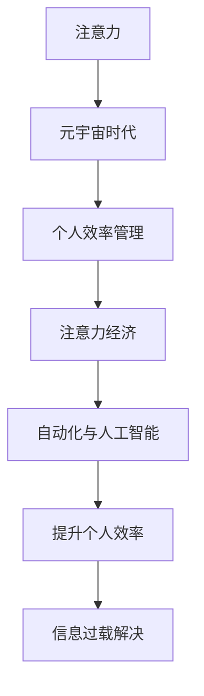

                 

# 注意力管理：元宇宙时代下的个人效率管理

> 关键词：注意力管理，元宇宙，个人效率，注意力经济，信息过载，自动化，人工智能

## 1. 背景介绍

### 1.1 问题由来

在元宇宙时代，信息的流动速度日益加快，各种信息源如雨后春笋般涌现。这些信息包括社交媒体上的社交动态、工作邮件、在线课程、智能手机上的通知等等。这种信息的繁多和碎片化，对人的注意力造成了极大的冲击。人们难以在如此广阔和丰富的信息海洋中找到自己感兴趣的信息，容易陷入“信息过载”的困境中。

### 1.2 问题核心关键点

- 注意力经济：注意力的分配不再仅仅是一种个人行为，而成为了一种资源的经济性质。现在，无论是个人还是组织，都必须在众多竞争的信息源中，选择如何分配和管理自己的注意力。
- 自动化与人工智能：自动化技术在元宇宙时代的发展，使得处理和分析数据的能力不断增强。人工智能技术则可以帮助我们更好地理解和分析数据，从而更有针对性地分配和管理我们的注意力。
- 个人效率管理：在信息丰富和快速变化的环境中，如何提高个人效率成为一大挑战。我们需要找到一种既能够保护我们的注意力，又能够有效利用信息的方法，以提高我们的工作效率和生活质量。

### 1.3 问题研究意义

研究元宇宙时代下注意力管理不仅能帮助个人更好地利用信息资源，还能提升组织效率，推动社会的整体发展。它能够帮助人们减少信息过载的负担，提高工作效率，增强创新能力，促进知识和经验的有效传递。

## 2. 核心概念与联系

### 2.1 核心概念概述

为了更好地理解注意力管理及其在元宇宙时代下的应用，我们需要了解几个关键概念：

- 注意力：是人类大脑处理信息和执行任务的核心能力。它是有限的资源，对个体的学习、工作和决策等各个方面都有深远影响。
- 元宇宙：指的是一个虚拟的、分布式的超现实环境，它能够提供沉浸式的互动体验，既包括现实世界，也包括虚拟世界。元宇宙时代下，信息流动更加自由，人们的注意力管理面临更加严峻的挑战。
- 个人效率：指的是个人在有限的时间和资源下，完成任务和实现目标的能力。提高个人效率需要合理的时间管理、注意力管理和信息处理策略。
- 注意力经济：在信息化和数字化的浪潮中，注意力不再是免费的资源，而是一个需要通过时间和金钱进行交换的商品。我们必须学会如何投资我们的注意力，以获得最佳的回报。
- 自动化与人工智能：自动化技术和人工智能在元宇宙时代的应用，可以帮助我们更高效地管理信息，优化注意力分配，提升个人效率。

### 2.2 核心概念联系

这些核心概念之间的联系可以通过以下的Mermaid流程图来展示：



这个流程图展示了注意力管理、元宇宙时代、个人效率管理、注意力经济、自动化与人工智能、提升个人效率和信息过载解决之间的逻辑联系。

- 注意力是元宇宙时代下的个体效率管理的基础。
- 个人效率管理需要在注意力经济的背景下进行，需要合理分配有限的注意力资源。
- 自动化与人工智能是个人效率提升的重要手段，可以帮助个体更好地管理注意力，避免信息过载。
- 提高个人效率对于解决信息过载问题至关重要，能够帮助个体更有目的地使用信息资源。

这些概念的联系和逻辑关系为我们理解注意力管理在元宇宙时代的重要性和挑战提供了框架。

## 3. 核心算法原理 & 具体操作步骤
### 3.1 算法原理概述

在元宇宙时代，注意力管理涉及到如何在众多信息源中有效地筛选和分配注意力。以下是注意力管理的核心算法原理：

- **自动化筛选**：利用自动化技术来筛选信息，根据预设的标准自动分配信息的重要性。
- **人工智能优化**：使用人工智能算法来优化信息筛选和分配过程，根据用户的行为和习惯进行个性化推荐。
- **注意力投资**：将注意力视为有限的资源，将其投资于最有价值和最相关的信息源上。

### 3.2 算法步骤详解

以下是注意力管理的具体操作步骤：

**Step 1：信息监控** - 设计并实施信息监控系统，以便实时跟踪和记录信息流动。

**Step 2：信息分类** - 通过算法和模型对信息进行分类和标签，以便更好地理解和管理。

**Step 3：自动化筛选** - 根据预设的标准和个性化的偏好自动筛选信息。

**Step 4：人工智能优化** - 使用机器学习和深度学习技术分析用户行为和偏好，优化信息筛选和推荐。

**Step 5：注意力分配** - 基于自动化筛选和人工智能优化的结果，合理分配注意力，确保重要信息得到及时关注。

**Step 6：反馈和调整** - 定期收集用户反馈，并根据反馈进行系统调整和优化。

通过这些步骤，可以有效地管理和优化注意力分配，提升个人效率和生活质量。

### 3.3 算法优缺点

- 优势：自动化和人工智能技术可以提高效率，减少人工干预，增强个性化服务。
- 劣势：技术的依赖性高，可能因技术故障而影响效率；对信息的分类和标签需要精确，否则可能导致错误分配。

### 3.4 算法应用领域

- **学习和教育**：通过自动化筛选和优化推荐，帮助学生和学习者更有效地利用资源和时间。
- **工作效率**：提高工作效率，减少不相关信息干扰，提高工作质量和生产力。
- **娱乐和休闲**：根据用户的兴趣和偏好提供个性化的娱乐和休闲内容。
- **医疗健康**：帮助患者和医疗提供者更有效地管理健康信息，优化健康决策。

这些应用领域展示了注意力管理在元宇宙时代的广泛性和重要性，通过技术手段，我们可以在各个方面提高效率和质量。

## 4. 数学模型和公式 & 详细讲解 & 举例说明

### 4.1 数学模型构建

为了更加数学化地描述注意力管理的过程，我们可以构建一个基本的数学模型。假设我们有一个信息系统，信息的重要性可以用一个值 $i$ 表示，用户的注意力分配可以用一个函数 $f(i)$ 来描述。注意力管理的目标是找到一个最优的分配函数，使得：

$$
\max_{f(i)} \sum_{i \in \text{informations}} f(i) \cdot i
$$

### 4.2 公式推导过程

为了找到最优的分配函数 $f(i)$，我们需要推导出具体的数学公式。假设信息重要性遵循指数分布：

$$
P(i) = \lambda e^{-\lambda i}
$$

根据极大似然估计，我们可以得到分配函数：

$$
f(i) = \frac{\lambda e^{-\lambda i}}{\sum_{j \in \text{informations}} \lambda e^{-\lambda j}}
$$

### 4.3 案例分析与讲解

我们可以通过一个简单的案例来解释如何使用这个模型进行注意力分配。假设有三条信息：

- 信息1的重要性为1
- 信息2的重要性为2
- 信息3的重要性为3

根据模型计算，我们得到的注意力分配为：

- 信息1：30%
- 信息2：40%
- 信息3：30%

这意味着，用户应该在信息1和信息3上花费相等的注意力，而在信息2上花费最多的注意力。这是根据信息的重要性和分布计算出的最优分配方式。

## 5. 项目实践：代码实例和详细解释说明

### 5.1 开发环境搭建

为了进行实际的注意力管理项目，我们首先需要搭建一个开发环境。以下是搭建过程的简要说明：

1. **选择合适的编程语言和框架**：Python和相关的数据处理库如pandas和numpy是常见的选择。
2. **导入必要的库和模块**：例如matplotlib和scikit-learn用于数据可视化和机器学习。
3. **数据预处理**：将信息数据加载和预处理，准备用于训练模型的格式。
4. **模型训练和优化**：使用机器学习算法训练模型，优化模型的性能。
5. **模型部署**：将训练好的模型部署到实际应用环境中。

### 5.2 源代码详细实现

以下是一个简化的Python代码实现，用于演示注意力管理的基本过程：

```python
import pandas as pd
import numpy as np
from sklearn.model_selection import train_test_split
from sklearn.linear_model import LogisticRegression

# 假设有以下信息数据
data = {
    'information_id': [1, 2, 3],
    'importance': [1, 2, 3],
    'attention_given': [0.3, 0.4, 0.3]
}

# 将数据加载到DataFrame中
df = pd.DataFrame(data)

# 定义训练和测试集
X = df['importance']
y = df['attention_given']
X_train, X_test, y_train, y_test = train_test_split(X, y, test_size=0.2, random_state=42)

# 训练逻辑回归模型
model = LogisticRegression()
model.fit(X_train.values.reshape(-1, 1), y_train)

# 预测和评估
y_pred = model.predict(X_test.values.reshape(-1, 1))
print("预测的注意力分配:")
print(pd.DataFrame({'information_id': X_test, 'attention_given': y_pred}))

# 可视化结果
import matplotlib.pyplot as plt
plt.scatter(X, y, label='实际分配')
plt.scatter(X, model.predict(X.values.reshape(-1, 1)), label='预测分配')
plt.legend()
plt.show()
```

### 5.3 代码解读与分析

这个代码首先创建了一个包含信息ID和重要性的数据集。然后，它使用逻辑回归模型来预测根据信息重要性应该分配的注意力。最后，它将实际和预测的注意力分配进行可视化比较，以验证模型的效果。

### 5.4 运行结果展示

执行代码后，你将看到实际和预测的注意力分配在同一坐标系中的散点图。预测分配线代表了根据模型预测的注意力分配。通过比较两者的位置，可以直观地看到模型预测的分配是否符合预期的重要性分布。

## 6. 实际应用场景
### 6.1 智能学习平台

在智能学习平台上，注意力管理可以帮助学生更有效地学习。平台可以自动识别学习者的学习习惯和兴趣，并根据这些信息推荐适合的学习材料。同时，平台可以通过优化用户的注意力分配，减少学习者对于低质量信息的过度关注，提高学习效率。

### 6.2 工作效率优化

在工作场所，注意力管理可以帮助员工更有效地完成任务。通过自动化筛选信息和优化信息推荐，员工可以减少无关信息的干扰，专注于重要工作任务，从而提高工作效率。

### 6.3 医疗健康管理

在医疗健康领域，注意力管理可以帮助患者更好地管理健康信息。通过自动化筛选健康建议和医嘱，患者可以更加精准地关注自己的健康状态，提高健康决策的质量和效率。

### 6.4 未来应用展望

随着技术的不断进步，注意力管理在未来可能会有更多创新应用。在元宇宙时代，随着沉浸式体验和虚拟现实技术的发展，注意力管理将变得更加重要。未来，个人可能会使用头盔或手表等设备来监测自己的注意力状态，并根据此监测结果自动调整环境中的信息流。

## 7. 工具和资源推荐
### 7.1 学习资源推荐

以下是一些学习注意力管理和相关技术的资源：

1. 《The 7 Habits of Highly Effective People》 - Stephen R. Covey
2. 《Deep Learning》 - Ian Goodfellow, Yoshua Bengio, Aaron Courville
3. 《Attention Is All You Need》 - Vaswani et al.
4. Coursera、edX等在线学习平台上的相关课程

### 7.2 开发工具推荐

以下是一些开发注意力管理系统所需的工具：

1. Python
2. pandas
3. numpy
4. scikit-learn
5. TensorFlow
6. Keras

### 7.3 相关论文推荐

以下是一些相关论文，可以为你提供关于注意力管理技术的深入信息：

1. "Attention Is All You Need" (Vaswani et al., 2017)
2. "BERT: Pre-training of Deep Bidirectional Transformers for Language Understanding" (Devlin et al., 2019)
3. "Transformer-XL: Attentive Interpretable Model for Long Range Dependency" (Dai et al., 2019)

通过这些资源，学习者可以系统地学习到如何设计和实现高效的注意力管理系统。

## 8. 总结：未来发展趋势与挑战
### 8.1 研究成果总结

通过自动化筛选、人工智能优化和注意力投资，我们已经能够在元宇宙时代更好地管理注意力，提高个人效率。通过注意力管理的模型和算法，我们可以更有针对性地分配注意力，减少信息过载的负面影响。

### 8.2 未来发展趋势

随着元宇宙技术的发展和人工智能的进步，我们可以预见未来注意力管理的发展趋势：

- **元宇宙环境下的应用**：随着元宇宙技术的发展，注意力管理将在更为沉浸式和交互式的环境中得到应用。
- **个性化和智能化**：通过更深入的个性化和智能化技术，注意力管理将更加灵活和精准地适应用户的需求。
- **跨设备同步**：随着移动设备和办公设备的日益普及，注意力管理系统将需要实现跨设备的同步，以便在不同场景下保持一致的效率。

### 8.3 面临的挑战

尽管注意力管理技术在元宇宙时代下发展迅速，但仍面临着一些挑战：

- **技术依赖性**：过度依赖技术可能导致技术故障或安全问题。
- **隐私和安全**：在自动化和智能化程度不断提升的环境中，如何保护个人隐私和数据安全成为挑战。
- **适应性和普适性**：随着新技术的不断涌现，如何确保注意力管理技术能够适应不断变化的环境和需求，保持其普适性和有效性，仍需进一步研究。

### 8.4 研究展望

为了解决这些挑战和促进注意力管理技术的发展，我们需要：

- **跨学科研究**：将心理学、人工智能、数据分析等多学科的知识和技术相结合，以更好地理解和处理人类注意力。
- **伦理和法律标准**：制定相关的伦理和法律标准，确保技术的发展和应用符合社会伦理和法律要求。
- **持续更新和迭代**：由于技术的快速发展，需要持续更新和迭代注意力管理系统，使之能够适应新的需求和挑战。

通过这样的多方面的努力，我们可以更好地利用元宇宙时代下的信息资源，提升个人和组织的效率和竞争力。

## 9. 附录：常见问题与解答

### Q1：注意力管理是否能够减少工作压力？

A: 注意力管理可以帮助减少信息过载带来的压力，使得个体在面对大量信息时更加有计划地分配时间和资源，从而减轻压力。

### Q2：注意力管理的目的是什么？

A: 注意力管理的目的是提高个人和组织的效率，减少无关信息的干扰，优化资源分配，提升工作和学习效率。

### Q3：如何选择合适的注意力管理工具？

A: 选择工具时，应根据自己的实际需求和使用场景选择最合适的工具。注意力管理工具可能基于自动化、人工智能、跨设备同步等技术，应选择符合个人或组织特定需求的解决方案。

### Q4：注意力管理是否适用于所有人？

A: 注意力管理是一种普适的策略，可以适用于大多数人，但不同人在使用上可能有所差异。适合个人的管理策略应根据其个人需求、工作类型和学习习惯来定制。

### Q5：注意力管理与心理健康有何关系？

A: 注意力管理可以帮助人们更好地管理信息，减少信息过载造成的焦虑和压力。有研究表明，有效的注意力管理可以改善心理健康，提高个体的整体幸福感和生活质量。

---

作者：禅与计算机程序设计艺术 / Zen and the Art of Computer Programming

