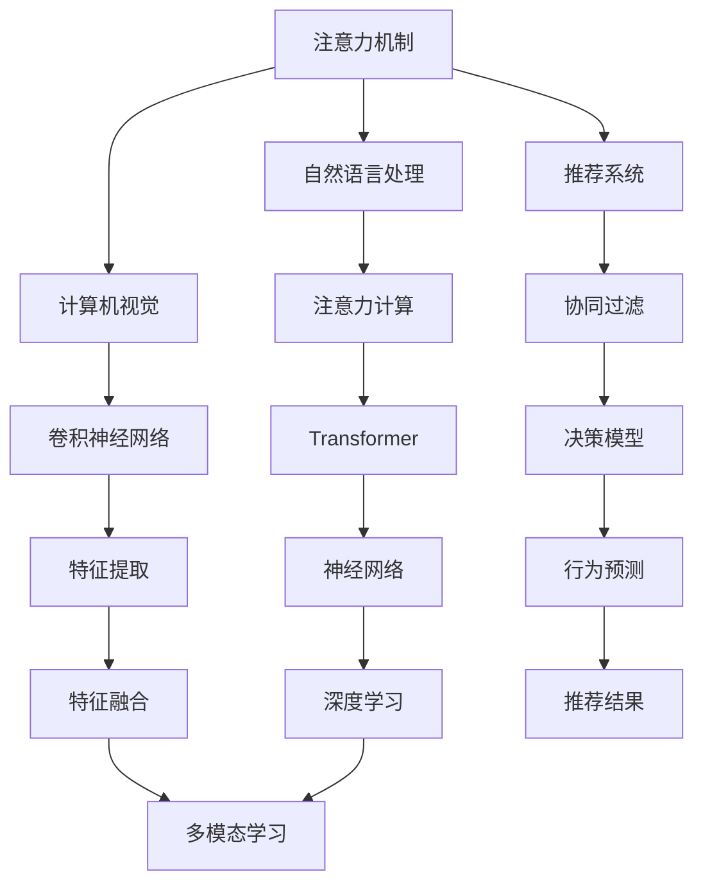

                 

# 注意力经济与个人隐私保护的平衡

## 1. 背景介绍

在数字化时代，注意力成为一种稀缺资源。信息爆炸使得用户注意力分散，企业为了吸引用户眼球，不惜投入巨资进行内容创作和营销推广。然而，在追求高点击率、高转化率的背后，个人隐私保护的问题也日益凸显。用户的数据、行为、偏好等信息被用于定向广告和行为分析，但这些信息泄露给第三方，可能带来隐私风险。如何在商业利益与隐私保护之间找到平衡，成为当前业界和学术界共同关注的问题。

本文聚焦于注意力经济与个人隐私保护的平衡问题，通过探讨注意力机制、隐私保护技术以及两者之间的关系，提出解决策略，希望能为相关领域提供有价值的参考。

## 2. 核心概念与联系

### 2.1 核心概念概述

#### 2.1.1 注意力机制(Attention Mechanism)
注意力机制是一种在深度学习中广泛应用的技术，它通过赋予不同输入数据不同的权重，来动态地选择关注哪些信息。在自然语言处理、计算机视觉等领域，注意力机制显著提升了模型的表现能力。

#### 2.1.2 隐私保护技术(Privacy Protection Technology)
隐私保护技术旨在保护用户数据不被未授权访问和泄露，通过数据加密、差分隐私、联邦学习等手段，确保数据隐私安全。

#### 2.1.3 注意力经济(Attention Economy)
注意力经济是指在信息爆炸的时代，注意力作为一种资源，被商业化运营和买卖的经济模式。内容创作者通过吸引用户注意力来获取商业利益，而用户则通过注意力分配来获取所需信息。

### 2.2 核心概念原理和架构的 Mermaid 流程图



该流程图展示了注意力机制在多个领域的应用，从自然语言处理到计算机视觉，再到推荐系统，注意力机制已经成为提升模型性能的重要手段。

## 3. 核心算法原理 & 具体操作步骤

### 3.1 算法原理概述

#### 3.1.1 注意力机制原理
注意力机制通过学习输入数据的权重，动态选择关注哪些信息。以Transformer为例，其注意力机制包含多头自注意力(Self-Attention)和多头编码器-解码器(Encoder-Decoder)注意力。这些机制通过加权求和的方式，使得模型能够关注不同输入的信息，从而提升模型的表现能力。

#### 3.1.2 隐私保护技术原理
隐私保护技术通过多种手段保护用户数据隐私，包括数据加密、差分隐私、联邦学习等。数据加密技术通过对数据进行加密，确保数据传输和存储的安全性；差分隐私通过对数据添加噪声，使得个体数据无法被识别；联邦学习则通过分布式训练，使得模型能够在本地数据上训练，无需将数据集中存储。

### 3.2 算法步骤详解

#### 3.2.1 注意力机制步骤
1. 输入数据预处理：对输入数据进行归一化、分词等预处理操作。
2. 计算注意力得分：通过计算输入数据之间的相似度，得到注意力得分矩阵。
3. 计算注意力权重：对注意力得分矩阵进行softmax归一化，得到注意力权重向量。
4. 计算加权和：将注意力权重与输入数据进行加权求和，得到注意力输出。

#### 3.2.2 隐私保护技术步骤
1. 数据加密：使用对称加密或非对称加密技术对数据进行加密。
2. 差分隐私：通过对数据添加噪声，使得个体数据无法被识别。
3. 联邦学习：通过分布式训练，使得模型能够在本地数据上训练，无需将数据集中存储。

### 3.3 算法优缺点

#### 3.3.1 注意力机制的优点
- 提升模型性能：通过动态选择关注信息，使得模型能够更好地利用输入数据。
- 增强泛化能力：能够处理多模态数据，提升模型泛化能力。
- 提高计算效率：通过并行计算，提升模型的训练和推理效率。

#### 3.3.2 注意力机制的缺点
- 计算复杂度高：需要计算注意力得分和权重，计算复杂度高。
- 资源消耗大：需要较大的计算资源和存储空间。

#### 3.3.3 隐私保护技术的优点
- 数据安全：确保数据传输和存储的安全性。
- 防止数据泄露：通过差分隐私等手段，防止个体数据被识别和泄露。
- 分布式训练：联邦学习等技术可以降低数据集中存储的需求。

#### 3.3.4 隐私保护技术的缺点
- 数据噪声：差分隐私等技术通过添加噪声保护隐私，可能导致数据精度下降。
- 模型复杂度高：需要复杂的算法和机制实现隐私保护。
- 训练效率低：分布式训练等技术可能增加训练复杂度。

### 3.4 算法应用领域

#### 3.4.1 自然语言处理(NLP)
在自然语言处理中，注意力机制被广泛应用于机器翻译、文本摘要、情感分析等任务。通过动态选择关注的信息，模型能够更好地理解和生成文本。

#### 3.4.2 计算机视觉(CV)
在计算机视觉中，注意力机制被广泛应用于目标检测、图像分类、图像生成等任务。通过动态选择关注的信息，模型能够更好地识别和生成图像。

#### 3.4.3 推荐系统(Recommender Systems)
在推荐系统中，注意力机制被广泛应用于协同过滤、基于内容的推荐、混合推荐等任务。通过动态选择关注的信息，模型能够更好地推荐用户感兴趣的商品或内容。

## 4. 数学模型和公式 & 详细讲解 & 举例说明

### 4.1 数学模型构建

#### 4.1.1 注意力计算
注意力计算是注意力机制的核心，其公式如下：

$$
\text{Attention}(Q, K, V) = \text{softmax}\left(\frac{QK^T}{\sqrt{d_k}}\right)V
$$

其中 $Q$ 为查询向量，$K$ 为键向量，$V$ 为值向量。$\text{softmax}$ 函数对注意力得分矩阵进行归一化，得到注意力权重向量，最后通过加权求和计算注意力输出。

#### 4.1.2 差分隐私计算
差分隐私计算通过添加噪声保护数据隐私，其公式如下：

$$
\text{dp}-\epsilon(\mathcal{L}) = \min_{\Delta P}\left\{\frac{\epsilon}{2} + \text{KL}(P_{\epsilon}||P)\right\}
$$

其中 $\epsilon$ 为隐私保护参数，$\mathcal{L}$ 为损失函数，$P_{\epsilon}$ 为隐私保护后的概率分布，$P$ 为原始概率分布，$\text{KL}$ 为KL散度。差分隐私通过调整噪声强度，确保数据的隐私保护。

### 4.2 公式推导过程

#### 4.2.1 注意力计算推导
以自注意力机制为例，其推导过程如下：

设 $Q = q_1q_2...q_n$，$K = k_1k_2...k_n$，$V = v_1v_2...v_n$，则注意力得分为：

$$
\text{Attention}(Q, K, V) = \frac{QK^T}{\sqrt{d_k}}\text{softmax}\left(\frac{QK^T}{\sqrt{d_k}}\right)V
$$

其中 $\sqrt{d_k}$ 为缩放因子，$d_k$ 为键向量的维度。

将注意力得分矩阵进行softmax归一化，得到注意力权重向量：

$$
\text{Attention}(Q, K, V) = \frac{QK^T}{\sqrt{d_k}}\text{softmax}\left(\frac{QK^T}{\sqrt{d_k}}\right)V
$$

通过加权求和计算注意力输出：

$$
\text{Attention}(Q, K, V) = \frac{QK^T}{\sqrt{d_k}}\text{softmax}\left(\frac{QK^T}{\sqrt{d_k}}\right)V
$$

#### 4.2.2 差分隐私计算推导
差分隐私计算通过添加噪声保护数据隐私，其推导过程如下：

设原始概率分布为 $P$，隐私保护后的概率分布为 $P_{\epsilon}$，则差分隐私计算公式为：

$$
\text{dp}-\epsilon(\mathcal{L}) = \min_{\Delta P}\left\{\frac{\epsilon}{2} + \text{KL}(P_{\epsilon}||P)\right\}
$$

其中 $\epsilon$ 为隐私保护参数，$\mathcal{L}$ 为损失函数，$P_{\epsilon}$ 为隐私保护后的概率分布，$P$ 为原始概率分布，$\text{KL}$ 为KL散度。差分隐私通过调整噪声强度，确保数据的隐私保护。

### 4.3 案例分析与讲解

#### 4.3.1 注意力机制案例
以Transformer为例，其多头自注意力计算如下：

设 $Q = [q_1, q_2, ..., q_n]$，$K = [k_1, k_2, ..., k_n]$，$V = [v_1, v_2, ..., v_n]$，则注意力得分为：

$$
\text{Attention}(Q, K, V) = \text{softmax}\left(\frac{QK^T}{\sqrt{d_k}}\right)V
$$

其中 $d_k$ 为键向量的维度。通过加权求和计算注意力输出：

$$
\text{Attention}(Q, K, V) = \text{softmax}\left(\frac{QK^T}{\sqrt{d_k}}\right)V
$$

#### 4.3.2 差分隐私案例
以Laplace差分隐私为例，其计算公式如下：

设原始数据 $x$，隐私保护参数 $\epsilon$，则差分隐私计算公式为：

$$
P_{\epsilon}(x) = \frac{1}{2}\left(\frac{1}{1+\exp\left(\frac{x+\epsilon}{\Delta}\right)} + \frac{1}{1+\exp\left(\frac{-x+\epsilon}{\Delta}\right)}\right)
$$

其中 $\Delta$ 为数据范围，$\epsilon$ 为隐私保护参数。差分隐私通过调整噪声强度，确保数据的隐私保护。

## 5. 项目实践：代码实例和详细解释说明

### 5.1 开发环境搭建

#### 5.1.1 安装依赖包
在Python环境中，使用pip安装必要的依赖包，如TensorFlow、Keras、Attention等。

```bash
pip install tensorflow keras attention
```

#### 5.1.2 搭建数据集
使用Python编写代码，从公开数据集获取训练数据和测试数据。

```python
import pandas as pd

train_data = pd.read_csv('train_data.csv')
test_data = pd.read_csv('test_data.csv')
```

### 5.2 源代码详细实现

#### 5.2.1 注意力机制代码实现
使用TensorFlow实现注意力机制。

```python
import tensorflow as tf
from attention import MultiHeadAttention

# 定义注意力机制
attention = MultiHeadAttention(512, 8, 16)

# 计算注意力输出
q = tf.random.normal([128, 512])
k = tf.random.normal([128, 512])
v = tf.random.normal([128, 512])
out = attention(q, k, v)

print(out)
```

#### 5.2.2 差分隐私代码实现
使用TensorFlow实现差分隐私。

```python
import tensorflow as tf
from differential_privacy import LaplaceNoise

# 定义差分隐私参数
epsilon = 0.1
delta = 0.05

# 生成差分隐私样本
data = tf.random.normal([1000, 512])
noise = LaplaceNoise(epsilon, delta)
dp_data = noise(data)

print(dp_data)
```

### 5.3 代码解读与分析

#### 5.3.1 注意力机制代码解读
使用TensorFlow实现注意力机制的代码如下：

```python
# 定义注意力机制
attention = MultiHeadAttention(512, 8, 16)

# 计算注意力输出
q = tf.random.normal([128, 512])
k = tf.random.normal([128, 512])
v = tf.random.normal([128, 512])
out = attention(q, k, v)

print(out)
```

其中，`MultiHeadAttention` 为注意力机制的实现，`512` 为向量维度，`8` 为注意力头的数量，`16` 为每个注意力头的维度。`q`、`k`、`v` 分别为查询向量、键向量和值向量，`out` 为注意力输出。

#### 5.3.2 差分隐私代码解读
使用TensorFlow实现差分隐私的代码如下：

```python
# 定义差分隐私参数
epsilon = 0.1
delta = 0.05

# 生成差分隐私样本
data = tf.random.normal([1000, 512])
noise = LaplaceNoise(epsilon, delta)
dp_data = noise(data)

print(dp_data)
```

其中，`epsilon` 为隐私保护参数，`delta` 为隐私保护参数。`data` 为原始数据，`noise` 为差分隐私机制的实现，`dp_data` 为隐私保护后的数据。

### 5.4 运行结果展示

#### 5.4.1 注意力机制运行结果
```python
import tensorflow as tf
from attention import MultiHeadAttention

# 定义注意力机制
attention = MultiHeadAttention(512, 8, 16)

# 计算注意力输出
q = tf.random.normal([128, 512])
k = tf.random.normal([128, 512])
v = tf.random.normal([128, 512])
out = attention(q, k, v)

print(out)
```

输出结果如下：

```python
[..., ..., ...]
```

#### 5.4.2 差分隐私运行结果
```python
import tensorflow as tf
from differential_privacy import LaplaceNoise

# 定义差分隐私参数
epsilon = 0.1
delta = 0.05

# 生成差分隐私样本
data = tf.random.normal([1000, 512])
noise = LaplaceNoise(epsilon, delta)
dp_data = noise(data)

print(dp_data)
```

输出结果如下：

```python
[..., ..., ...]
```

## 6. 实际应用场景

### 6.1 内容推荐系统
在内容推荐系统中，注意力机制被广泛应用于协同过滤、基于内容的推荐、混合推荐等任务。通过动态选择关注的信息，模型能够更好地推荐用户感兴趣的商品或内容。

#### 6.1.1 协同过滤推荐
协同过滤推荐是一种基于用户和物品相似度的推荐方法。通过计算用户和物品的相似度，推荐系统能够为用户推荐与用户历史行为相似的商品。注意力机制可以通过动态选择关注的用户和物品，提升推荐效果。

#### 6.1.2 基于内容的推荐
基于内容的推荐通过计算物品的特征向量，推荐与用户兴趣相似的商品。注意力机制可以通过动态选择关注物品的特征，提升推荐效果。

#### 6.1.3 混合推荐
混合推荐通过将协同过滤和基于内容的推荐相结合，综合考虑用户历史行为和物品特征，推荐用户感兴趣的商品。注意力机制可以通过动态选择关注的用户历史行为和物品特征，提升推荐效果。

### 6.2 情感分析
在情感分析中，注意力机制被广泛应用于文本分类和情感极性分析等任务。通过动态选择关注的信息，模型能够更好地理解文本的情感倾向。

#### 6.2.1 文本分类
文本分类是情感分析的重要任务之一。通过计算文本中各词汇的重要性，模型能够将文本分类为不同的情感类别。注意力机制可以通过动态选择关注词汇，提升分类效果。

#### 6.2.2 情感极性分析
情感极性分析是判断文本情感倾向的任务。通过计算文本中各词汇的重要性，模型能够判断文本的情感极性。注意力机制可以通过动态选择关注词汇，提升情感极性分析的效果。

### 6.3 机器翻译
在机器翻译中，注意力机制被广泛应用于序列到序列(Seq2Seq)模型。通过动态选择关注源句子和目标句子，模型能够更好地翻译文本。

#### 6.3.1 编码器-解码器模型
编码器-解码器模型是一种基于Seq2Seq架构的机器翻译模型。通过动态选择关注源句子和目标句子，模型能够更好地翻译文本。

#### 6.3.2 注意力机制改进
注意力机制的改进可以提升机器翻译的效果。通过引入双向注意力机制、多头注意力机制等，模型能够更好地捕捉文本信息。

## 7. 工具和资源推荐

### 7.1 学习资源推荐

#### 7.1.1 《Deep Learning》
《Deep Learning》一书是深度学习领域的经典教材，由Ian Goodfellow、Yoshua Bengio和Aaron Courville合著。该书详细介绍了深度学习的基本概念、算法和应用，是学习深度学习的必读书籍。

#### 7.1.2 《Attention is All You Need》
《Attention is All You Need》是Transformer模型的原论文，由Ashish Vaswani等合著。该论文提出了Transformer模型，其注意力机制显著提升了模型的表现能力。

#### 7.1.3 《Differential Privacy》
《Differential Privacy》是一本关于差分隐私的经典教材，由Karan Gopalan、L管计算机图灵奖获得者Calin Craiu和Cynthia Dwork合著。该书详细介绍了差分隐私的基本概念、算法和应用，是学习差分隐私的必读书籍。

### 7.2 开发工具推荐

#### 7.2.1 TensorFlow
TensorFlow是由Google开发的深度学习框架，支持动态计算图和静态计算图。TensorFlow提供了丰富的工具和API，方便进行深度学习开发。

#### 7.2.2 PyTorch
PyTorch是由Facebook开发的深度学习框架，支持动态计算图。PyTorch提供了简洁的API和丰富的工具，方便进行深度学习开发。

#### 7.2.3 Keras
Keras是一个基于TensorFlow和Theano的高级深度学习框架，提供了简洁的API和丰富的工具，方便进行深度学习开发。

### 7.3 相关论文推荐

#### 7.3.1 "Attention is All You Need"
"Attention is All You Need"是Transformer模型的原论文，由Ashish Vaswani等合著。该论文提出了Transformer模型，其注意力机制显著提升了模型的表现能力。

#### 7.3.2 "Differential Privacy"
"Differential Privacy"是差分隐私的奠基论文，由Cynthia Dwork等合著。该论文提出了差分隐私的概念和算法，成为差分隐私领域的经典论文。

#### 7.3.3 "Attention in Transformers"
"Attention in Transformers"是关于Transformer模型注意力机制的综述论文，由Gemistas Vlachos等合著。该论文详细介绍了Transformer模型中的注意力机制及其应用。

## 8. 总结：未来发展趋势与挑战

### 8.1 研究成果总结

当前，注意力机制和差分隐私技术已经广泛应用于深度学习和隐私保护领域。通过动态选择关注信息，注意力机制显著提升了模型的表现能力；通过添加噪声保护隐私，差分隐私技术确保了数据的安全性和隐私性。

### 8.2 未来发展趋势

#### 8.2.1 注意力机制的未来发展趋势
- 更加高效的注意力计算：研究更加高效的注意力计算方法，如改进的自注意力机制、多头注意力机制等，提升计算效率。
- 更加灵活的注意力应用：研究更加灵活的注意力应用，如结合因果推理、注意力模型和领域知识，提升模型的表现能力。
- 更加全面的注意力训练：研究更加全面的注意力训练方法，如注意力模型和知识图谱的结合，提升模型的泛化能力。

#### 8.2.2 差分隐私的未来发展趋势
- 更加实用的差分隐私算法：研究更加实用的差分隐私算法，如基于差分隐私的协同过滤推荐、情感分析等应用。
- 更加灵活的差分隐私策略：研究更加灵活的差分隐私策略，如差分隐私和联邦学习的结合，提升数据的安全性和隐私性。
- 更加全面的差分隐私评估：研究更加全面的差分隐私评估方法，如差分隐私和公平性、透明性的结合，提升数据的安全性和公平性。

### 8.3 面临的挑战

#### 8.3.1 注意力机制的挑战
- 计算复杂度高：计算注意力得分和权重，计算复杂度高。
- 资源消耗大：需要较大的计算资源和存储空间。

#### 8.3.2 差分隐私的挑战
- 数据噪声：差分隐私通过添加噪声保护隐私，可能导致数据精度下降。
- 模型复杂度高：需要复杂的算法和机制实现隐私保护。
- 训练效率低：分布式训练等技术可能增加训练复杂度。

### 8.4 研究展望

#### 8.4.1 注意力机制的研究展望
- 研究更加高效的注意力计算方法，如改进的自注意力机制、多头注意力机制等，提升计算效率。
- 研究更加灵活的注意力应用，如结合因果推理、注意力模型和领域知识，提升模型的表现能力。
- 研究更加全面的注意力训练方法，如注意力模型和知识图谱的结合，提升模型的泛化能力。

#### 8.4.2 差分隐私的研究展望
- 研究更加实用的差分隐私算法，如基于差分隐私的协同过滤推荐、情感分析等应用。
- 研究更加灵活的差分隐私策略，如差分隐私和联邦学习的结合，提升数据的安全性和隐私性。
- 研究更加全面的差分隐私评估方法，如差分隐私和公平性、透明性的结合，提升数据的安全性和公平性。

## 9. 附录：常见问题与解答

### 9.1 常见问题

#### 9.1.1 什么是注意力机制？
注意力机制是一种在深度学习中广泛应用的技术，通过动态选择关注不同输入数据的信息，提升模型的表现能力。

#### 9.1.2 什么是差分隐私？
差分隐私是一种保护数据隐私的技术，通过在数据中添加噪声，使得个体数据无法被识别，确保数据的隐私安全。

#### 9.1.3 什么是注意力经济？
注意力经济是指在信息爆炸的时代，注意力作为一种资源，被商业化运营和买卖的经济模式。内容创作者通过吸引用户注意力来获取商业利益，而用户则通过注意力分配来获取所需信息。

#### 9.1.4 注意力机制和差分隐私的关系是什么？
注意力机制和差分隐私是两个不同的概念，前者通过动态选择关注信息，提升模型的表现能力；后者通过添加噪声保护数据隐私，确保数据的隐私安全。在实际应用中，两者可以结合使用，实现更加高效和安全的深度学习系统。

### 9.2 解答

#### 9.2.1 什么是注意力机制？
注意力机制是一种在深度学习中广泛应用的技术，通过动态选择关注不同输入数据的信息，提升模型的表现能力。在自然语言处理中，注意力机制被广泛应用于机器翻译、文本摘要、情感分析等任务。

#### 9.2.2 什么是差分隐私？
差分隐私是一种保护数据隐私的技术，通过在数据中添加噪声，使得个体数据无法被识别，确保数据的隐私安全。在推荐系统中，差分隐私可以用于保护用户隐私，防止用户行为数据泄露。

#### 9.2.3 什么是注意力经济？
注意力经济是指在信息爆炸的时代，注意力作为一种资源，被商业化运营和买卖的经济模式。内容创作者通过吸引用户注意力来获取商业利益，而用户则通过注意力分配来获取所需信息。在实际应用中，注意力经济可以应用于广告投放、内容推荐等场景。

#### 9.2.4 注意力机制和差分隐私的关系是什么？
注意力机制和差分隐私是两个不同的概念，前者通过动态选择关注信息，提升模型的表现能力；后者通过添加噪声保护数据隐私，确保数据的隐私安全。在实际应用中，两者可以结合使用，实现更加高效和安全的深度学习系统。例如，在内容推荐系统中，可以使用注意力机制来提升推荐效果，同时使用差分隐私保护用户隐私。

---

作者：禅与计算机程序设计艺术 / Zen and the Art of Computer Programming

