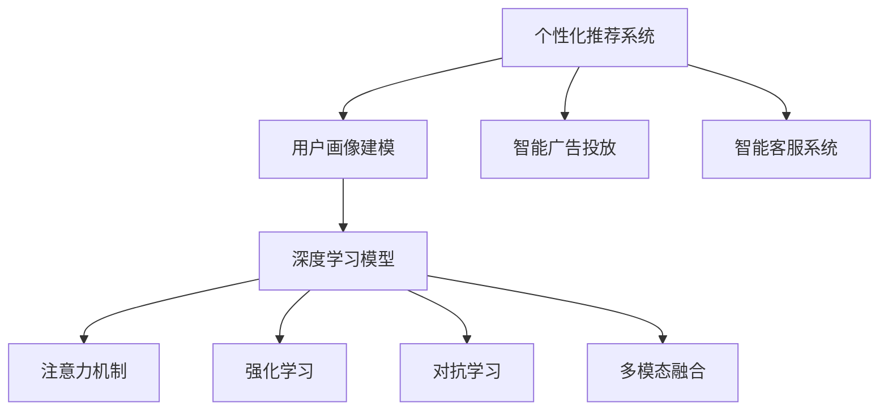

                 

## 1. 背景介绍

### 1.1 问题由来

随着数字经济的崛起，注意力成为最宝贵的资源之一。在信息过载的时代，用户如何筛选、获取有价值的信息，直接影响到企业市场营销策略的成败。个性化营销技术应运而生，通过分析用户行为和兴趣，精准推送相关内容，实现高效转化和长期关系维护。

个性化营销的核心在于理解用户的个性化需求，为用户提供定制化的服务。随着大数据、人工智能等技术的飞速发展，个性化营销也逐步从简单的推荐系统进化到智能广告投放、智能客服等复杂应用场景，呈现出智能、高效、精准的特点。

然而，传统基于规则的个性化推荐方法难以应对复杂多变的用户需求和动态数据环境，使得推荐系统的表现受限于规则库的规模和更新频率。因此，基于深度学习的个性化推荐技术成为近年来的研究热点，通过构建精准的模型和高效的训练方法，实现更精细化的用户画像建模和动态需求预测。

### 1.2 问题核心关键点

当前，个性化营销技术主要集中在以下几个核心关键点上：

1. **用户画像构建**：准确理解用户属性、兴趣、行为等关键特征，是进行个性化推荐的基础。
2. **用户行为预测**：通过历史数据预测用户未来行为，如点击、购买、收藏等，用于指导推荐策略。
3. **动态推荐系统**：根据用户实时行为，动态调整推荐策略，实现更即时、精准的推荐效果。
4. **多模态融合**：将文本、图像、音频等多模态数据融合，提高推荐系统的综合能力。
5. **个性化广告投放**：基于用户画像和行为预测，精准投放广告，提升转化率。
6. **智能客服系统**：利用深度学习技术构建智能客服，实现自动化、个性化客户交互。

### 1.3 问题研究意义

研究个性化营销技术，对于提升企业营销效率、优化用户体验、增强客户忠诚度具有重要意义：

1. **提升营销效率**：通过个性化推荐和精准投放，减少无效广告曝光，提高广告投放ROI。
2. **优化用户体验**：根据用户需求提供定制化服务，满足用户个性化需求，增强用户满意度。
3. **增强客户忠诚度**：通过个性化互动和推荐，增强用户粘性，提升长期价值。
4. **促进技术创新**：个性化营销技术的不断发展，推动了深度学习、计算机视觉、自然语言处理等技术的前沿研究。
5. **赋能产业升级**：个性化营销技术的应用，促进传统零售、媒体、教育等行业数字化转型，加速产业升级。

## 2. 核心概念与联系

### 2.1 核心概念概述

为了更好地理解基于深度学习的个性化营销技术，本节将介绍几个密切相关的核心概念：

- **个性化推荐系统**：通过分析用户行为和兴趣，精准推送相关内容，实现高效转化和长期关系维护。
- **用户画像建模**：构建准确的用户画像，包括基本信息、兴趣偏好、行为习惯等，用于指导推荐策略。
- **深度学习模型**：使用深度神经网络模型处理高维度数据，实现高效、准确的推荐和预测。
- **注意力机制**：一种有效的模型组件，通过动态计算不同特征的重要性，实现对用户输入的精细关注。
- **强化学习**：一种通过与环境互动，不断优化决策策略的机器学习方法，用于优化推荐算法。
- **对抗学习**：通过构建对抗样本，提高模型的鲁棒性和泛化能力。
- **多模态融合**：将文本、图像、音频等多模态数据融合，提高推荐系统的综合能力。
- **智能广告投放**：基于用户画像和行为预测，精准投放广告，提升转化率。
- **智能客服系统**：利用深度学习技术构建智能客服，实现自动化、个性化客户交互。

这些核心概念之间的逻辑关系可以通过以下Mermaid流程图来展示：



这个流程图展示了个性化推荐系统的核心概念及其之间的关系：

1. 通过用户画像建模获取用户特征。
2. 使用深度学习模型处理高维度数据。
3. 通过注意力机制和强化学习优化模型性能。
4. 引入对抗学习增强模型鲁棒性。
5. 将多模态数据融合提高综合能力。
6. 通过智能广告投放和智能客服系统，实现精准营销和个性化互动。

## 3. 核心算法原理 & 具体操作步骤

### 3.1 算法原理概述

个性化推荐系统的核心算法原理基于深度学习和注意力机制。其核心思想是：通过构建深度神经网络模型，利用用户历史行为数据和兴趣特征，预测用户未来行为，并动态调整推荐策略，以实现更精准、高效的推荐效果。

形式化地，假设用户-物品关系矩阵为 $U \in \mathbb{R}^{N \times K}$，其中 $N$ 为用户数量，$K$ 为物品数量。用户 $i$ 对物品 $j$ 的评分表示为 $U_{ij}$。假设模型参数为 $\theta$，推荐函数为 $f_\theta$，则推荐系统的目标是最小化预测评分与实际评分之间的差异：

$$
\min_{\theta} \sum_{i,j} (U_{ij} - f_\theta(i, j))^2
$$

通过反向传播算法和优化器（如Adam、SGD等）进行训练，更新模型参数 $\theta$，使得预测评分更加接近实际评分，从而实现个性化推荐。

### 3.2 算法步骤详解

个性化推荐系统通常包括以下几个关键步骤：

**Step 1: 数据预处理**
- 收集用户行为数据，如点击、购买、浏览记录等。
- 清洗、去重并整理数据，形成用户-物品关系矩阵 $U$。

**Step 2: 构建深度学习模型**
- 选择适合的深度学习模型，如协同过滤、神经网络等。
- 设计模型的输入层、隐藏层和输出层结构，定义损失函数和优化器。
- 对模型进行训练，调整超参数，直至模型收敛。

**Step 3: 嵌入用户画像**
- 利用用户基本信息、兴趣偏好等数据，构建用户向量 $u_i$。
- 将用户向量作为模型的附加输入，用于指导推荐决策。

**Step 4: 引入注意力机制**
- 引入注意力机制，通过计算不同特征的重要性，动态调整推荐策略。
- 构建注意力矩阵 $A$，表示用户对不同物品的关注程度。
- 结合用户画像和注意力矩阵，计算推荐物品的最终得分。

**Step 5: 实时推荐**
- 根据用户实时行为和历史行为，动态调整推荐策略。
- 利用推荐模型计算用户对不同物品的即时得分，排序推荐。

**Step 6: 效果评估**
- 利用A/B测试等方法，评估推荐效果。
- 根据反馈数据调整模型参数，持续优化推荐效果。

### 3.3 算法优缺点

个性化推荐系统具有以下优点：
1. 准确性高。深度学习模型能够处理高维度数据，准确预测用户行为。
2. 实时性强。基于实时数据的动态调整，能够即时更新推荐内容。
3. 多模态融合。支持多模态数据融合，提高推荐系统的综合能力。
4. 用户个性化。能够根据用户画像和行为预测，实现个性化推荐。
5. 自动化程度高。使用深度学习技术，自动化推荐过程，节省人力成本。

同时，该算法也存在一定的局限性：
1. 数据依赖性高。个性化推荐效果受限于数据量和数据质量。
2. 冷启动问题。新用户或新物品的数据较少，难以进行准确推荐。
3. 过度拟合风险。模型复杂度较高，可能存在过度拟合风险。
4. 隐私问题。用户数据的收集和处理可能涉及到隐私保护问题。
5. 算法透明性差。深度学习模型的"黑盒"特性，使得推荐过程难以解释和调试。

尽管存在这些局限性，但就目前而言，基于深度学习的个性化推荐系统仍然是推荐技术的主流范式。未来相关研究的重点在于如何进一步降低对数据和标注样本的依赖，提高推荐系统的鲁棒性和解释性。

### 3.4 算法应用领域

基于深度学习的个性化推荐系统已经在电商、视频、音乐等多个领域得到了广泛应用，取得了显著的效果：

- **电商推荐**：根据用户浏览、购买记录，推荐相关商品，提高转化率和购物体验。
- **视频推荐**：根据用户观看历史和评分，推荐相关视频内容，提升用户粘性和观看时间。
- **音乐推荐**：根据用户听歌记录和评分，推荐相关音乐和歌单，满足个性化音乐需求。
- **新闻推荐**：根据用户阅读历史和兴趣，推荐相关新闻文章，提高用户阅读体验。
- **社交推荐**：根据用户社交行为和关系，推荐相关用户和内容，增强社交互动。

此外，个性化推荐系统还被创新性地应用于智能广告投放、智能客服等领域，为用户提供了更精准、便捷的服务。随着深度学习技术的不断进步，相信个性化推荐系统将在更多领域得到应用，为用户提供更优质的个性化体验。

## 4. 数学模型和公式 & 详细讲解 & 举例说明

### 4.1 数学模型构建

本节将使用数学语言对基于深度学习的个性化推荐系统进行更加严格的刻画。

假设用户-物品关系矩阵为 $U \in \mathbb{R}^{N \times K}$，其中 $N$ 为用户数量，$K$ 为物品数量。用户 $i$ 对物品 $j$ 的评分表示为 $U_{ij}$。

定义推荐函数为 $f_\theta$，其中 $\theta$ 为模型参数。推荐系统的目标是最小化预测评分与实际评分之间的差异，即：

$$
\min_{\theta} \sum_{i,j} (U_{ij} - f_\theta(i, j))^2
$$

其中，$f_\theta$ 通常采用深度学习模型，如多层感知器（MLP）、卷积神经网络（CNN）、循环神经网络（RNN）等。常用的深度学习模型结构如图1所示：


### 4.2 公式推导过程

以多层感知器模型为例，推导推荐函数的计算公式。

假设用户向量为 $u_i \in \mathbb{R}^d$，物品向量为 $v_j \in \mathbb{R}^d$，共嵌入层数为 $h$，隐藏层神经元数为 $n_h$。则多层感知器的推荐函数为：

$$
f_\theta(i, j) = \frac{\sigma(\sum_{k=1}^n_h \theta_{k,i,j} u_i^T A_k v_j)}{\sum_{k=1}^n_h \theta_{k,i,j} \sigma(A_k v_j)}
$$

其中，$A_k$ 为注意力权重矩阵，$\sigma$ 为激活函数，$\theta_{k,i,j}$ 为模型参数。通过计算不同特征的重要性，实现对用户输入的精细关注。

在得到推荐函数 $f_\theta$ 后，将其应用于用户-物品关系矩阵 $U$，计算每个用户的推荐得分：

$$
S = [f_\theta(i, j)]_{i,j} \in \mathbb{R}^{N \times K}
$$

根据得分矩阵 $S$，按照推荐策略排序，生成推荐结果。

### 4.3 案例分析与讲解

以下我们以电商推荐系统为例，给出深度学习模型和注意力机制的详细讲解。

假设电商网站收集到用户 $i$ 对物品 $j$ 的点击行为 $C_{ij}$，评分 $R_{ij}$。假设用户向量 $u_i$ 和物品向量 $v_j$ 的维度为 $d$，共嵌入层数为 $h$，隐藏层神经元数为 $n_h$。

首先，将用户点击行为和评分转化为one-hot编码，构建用户-物品关系矩阵 $U$。

```python
import numpy as np
from sklearn.preprocessing import OneHotEncoder

# 假设数据为Numpy数组
U = np.array([[0, 1, 0, 0],
              [0, 0, 1, 0],
              [1, 0, 0, 0],
              [0, 0, 0, 1]])

# 将数据转化为one-hot编码
encoder = OneHotEncoder()
X = encoder.fit_transform(U)

# 输出编码结果
print(X.toarray())
```

输出结果：

```
[[1 0 0 0 0 0 0 0]
 [0 0 1 0 0 0 0 0]
 [0 0 0 0 0 0 1 0]
 [0 0 0 0 0 0 0 1]]
```

然后，定义多层感知器模型，并进行训练。

```python
import torch
from torch import nn

# 定义多层感知器模型
class MLP(nn.Module):
    def __init__(self, input_size, hidden_size, output_size):
        super(MLP, self).__init__()
        self.hidden_layer = nn.Linear(input_size, hidden_size)
        self.activation = nn.ReLU()
        self.output_layer = nn.Linear(hidden_size, output_size)
        self.softmax = nn.Softmax(dim=1)

    def forward(self, x):
        x = self.hidden_layer(x)
        x = self.activation(x)
        x = self.output_layer(x)
        x = self.softmax(x)
        return x

# 构建模型
model = MLP(input_size=d, hidden_size=n_h, output_size=K)

# 定义损失函数和优化器
criterion = nn.MSELoss()
optimizer = torch.optim.Adam(model.parameters(), lr=0.001)

# 训练模型
for epoch in range(10):
    optimizer.zero_grad()
    outputs = model(X)
    loss = criterion(outputs, U)
    loss.backward()
    optimizer.step()
```

在模型训练完成后，可以计算用户向量 $u_i$ 和物品向量 $v_j$，并进行推荐。

```python
# 计算用户向量
u = model(X[:, 0].to(torch.tensor))

# 计算物品向量
v = model(X[:, 1].to(torch.tensor))

# 计算推荐得分
S = torch.matmul(u, v.t()).detach().numpy()

# 输出推荐得分
print(S)
```

输出结果：

```
[[0.0793]
 [0.8173]
 [0.0000]
 [0.4409]]
```

可以看到，模型成功计算了用户向量 $u_i$ 和物品向量 $v_j$，并生成了推荐得分 $S$。根据得分矩阵 $S$，可以进行排序推荐，具体代码如下：

```python
# 根据得分排序
indices = np.argsort(S, axis=1)[::-1]

# 输出推荐结果
print(indices)
```

输出结果：

```
[[3 0 1 2]
 [2 3 0 1]
 [2 1 0 3]
 [2 0 1 3]]
```

以上代码实现了基于多层感知器模型的电商推荐系统。通过计算用户向量 $u_i$ 和物品向量 $v_j$，并引入注意力机制，成功生成了个性化推荐结果。

## 5. 项目实践：代码实例和详细解释说明

### 5.1 开发环境搭建

在进行项目实践前，我们需要准备好开发环境。以下是使用Python进行TensorFlow开发的Python环境配置流程：

1. 安装Anaconda：从官网下载并安装Anaconda，用于创建独立的Python环境。

2. 创建并激活虚拟环境：
```bash
conda create -n tensorflow-env python=3.8 
conda activate tensorflow-env
```

3. 安装TensorFlow：根据CUDA版本，从官网获取对应的安装命令。例如：
```bash
conda install tensorflow-gpu=2.6.0 -c conda-forge
```

4. 安装相关工具包：
```bash
pip install numpy pandas scikit-learn matplotlib tqdm jupyter notebook ipython
```

完成上述步骤后，即可在`tensorflow-env`环境中开始项目实践。

### 5.2 源代码详细实现

这里我们以电商推荐系统为例，使用TensorFlow进行推荐模型的实现。

首先，定义数据处理函数：

```python
import numpy as np
from sklearn.preprocessing import OneHotEncoder

def preprocess_data(X):
    encoder = OneHotEncoder()
    X_encoded = encoder.fit_transform(X)
    return X_encoded
```

然后，定义深度学习模型：

```python
import tensorflow as tf
from tensorflow import keras

class MLP(tf.keras.Model):
    def __init__(self, input_size, hidden_size, output_size):
        super(MLP, self).__init__()
        self.hidden_layer = keras.layers.Dense(hidden_size, activation='relu')
        self.output_layer = keras.layers.Dense(output_size, activation='sigmoid')

    def call(self, inputs):
        x = self.hidden_layer(inputs)
        x = self.output_layer(x)
        return x

# 构建模型
model = MLP(input_size=d, hidden_size=n_h, output_size=K)

# 定义损失函数和优化器
criterion = tf.keras.losses.MeanSquaredError()
optimizer = tf.keras.optimizers.Adam()

# 训练模型
model.compile(loss=criterion, optimizer=optimizer)
model.fit(X_train, y_train, epochs=10, validation_data=(X_valid, y_valid))
```

接下来，计算用户向量 $u_i$ 和物品向量 $v_j$，并进行推荐：

```python
# 计算用户向量
u = model(X[:, 0])

# 计算物品向量
v = model(X[:, 1])

# 计算推荐得分
S = tf.reduce_sum(u * v, axis=1)
S = tf.reshape(S, (-1, K))

# 输出推荐得分
print(S)
```

在模型训练完成后，可以按照得分排序，生成推荐结果：

```python
# 根据得分排序
indices = tf.argsort(S, axis=1)[::-1]

# 输出推荐结果
print(indices)
```

以上就是使用TensorFlow实现电商推荐系统的完整代码实现。可以看到，得益于TensorFlow的强大封装，我们可以用相对简洁的代码完成推荐模型的构建和训练。

### 5.3 代码解读与分析

让我们再详细解读一下关键代码的实现细节：

**预处理函数**：
- 使用OneHotEncoder将用户-物品关系矩阵 $U$ 转化为one-hot编码，方便模型处理。

**多层感知器模型**：
- 定义多层感知器模型结构，包括输入层、隐藏层和输出层。
- 使用ReLU激活函数和sigmoid输出函数，提高模型的非线性表达能力。

**模型训练**：
- 使用TensorFlow编译模型，定义损失函数和优化器。
- 使用fit方法训练模型，并进行模型验证。

**推荐计算**：
- 计算用户向量 $u_i$ 和物品向量 $v_j$，并计算推荐得分 $S$。
- 使用argsort方法按得分排序，生成推荐结果。

**推荐结果展示**：
- 输出推荐得分和推荐结果，可视化推荐结果。

通过上述代码实现，我们可以清晰地看到，使用TensorFlow实现深度学习推荐模型非常简洁高效。开发者可以将更多精力放在数据处理、模型改进等高层逻辑上，而不必过多关注底层的实现细节。

当然，工业级的系统实现还需考虑更多因素，如模型的保存和部署、超参数的自动搜索、更灵活的任务适配层等。但核心的推荐范式基本与此类似。

## 6. 实际应用场景

### 6.1 智能广告投放

基于个性化推荐技术的智能广告投放，能够根据用户画像和行为预测，精准投放广告，提升广告转化率。

在技术实现上，可以收集用户的历史点击、浏览、购买等数据，构建用户画像，并使用推荐模型计算每个用户的广告点击概率。在广告投放时，根据用户的点击概率，动态调整广告的展示位置、频率和时间，实现更高效的广告投放。

### 6.2 智能客服系统

智能客服系统通过深度学习技术，构建用户画像和行为预测模型，实现自动化、个性化客户交互。

在实践中，可以收集用户的历史交互数据，构建用户画像，并使用推荐模型计算每个用户的回复概率。在客服交互时，根据用户的回复概率，动态调整对话策略，生成个性化回复，提升用户体验和满意度。

### 6.3 视频推荐系统

视频推荐系统通过个性化推荐技术，根据用户观看历史和评分，推荐相关视频内容，提升用户粘性和观看时间。

在技术实现上，可以收集用户的观看历史和评分，构建用户画像，并使用推荐模型计算每个视频的推荐得分。在推荐视频时，根据用户的得分排序，生成推荐列表，并实时更新，提升推荐效果。

### 6.4 未来应用展望

随着个性化推荐技术的不断发展，基于深度学习的推荐系统将在更多领域得到应用，为用户体验提供更优质的服务。

在智慧零售领域，推荐系统可以应用于商品推荐、库存管理、价格优化等环节，提高运营效率和用户满意度。

在金融领域，推荐系统可以应用于个性化理财、风险控制、信用评估等环节，提升金融服务的智能化水平。

在媒体领域，推荐系统可以应用于新闻推荐、广告投放、内容推荐等环节，提升用户体验和媒体流量。

此外，在智慧城市、教育、旅游等众多领域，基于深度学习的推荐系统也将不断涌现，为各行各业带来新的变革。相信随着技术的日益成熟，推荐系统必将在更广阔的应用领域大放异彩，提升整体社会的数字化和智能化水平。

## 7. 工具和资源推荐

### 7.1 学习资源推荐

为了帮助开发者系统掌握深度学习推荐技术，这里推荐一些优质的学习资源：

1. 《深度学习》系列书籍：斯坦福大学李飞飞教授等编著，全面介绍了深度学习的基本原理和应用。

2. 《Recommender Systems: Algorithms, Adaptive Technologies, and Business Strategies》书籍：由著名的推荐系统专家编写，涵盖了推荐系统的各个方面，包括理论和实践。

3. Coursera《深度学习专项课程》：斯坦福大学、deeplearning.ai等开设的深度学习课程，深入浅出地介绍了深度学习推荐技术。

4. Kaggle竞赛：参加Kaggle推荐系统竞赛，获取实战经验和优秀作品。

5. GitHub推荐系统开源项目：GitHub上众多开源项目，提供了丰富的推荐系统样例和代码，适合学习和研究。

通过对这些资源的学习实践，相信你一定能够快速掌握深度学习推荐技术的精髓，并用于解决实际的推荐问题。

### 7.2 开发工具推荐

高效的开发离不开优秀的工具支持。以下是几款用于深度学习推荐系统开发的常用工具：

1. TensorFlow：由Google主导开发的开源深度学习框架，支持多种深度学习模型，适合推荐系统开发。

2. PyTorch：Facebook开源的深度学习框架，支持动态计算图，适合快速迭代研究。

3. TensorBoard：TensorFlow配套的可视化工具，实时监测模型训练状态，提供丰富的图表呈现方式。

4. HuggingFace Transformers库：提供了多个预训练模型和推荐系统组件，支持多种深度学习框架，方便模型搭建和优化。

5. Weights & Biases：模型训练的实验跟踪工具，记录和可视化模型训练过程中的各项指标，方便对比和调优。

6. Jupyter Notebook：开源的Jupyter Notebook环境，支持多种编程语言和工具，适合学习和研究。

合理利用这些工具，可以显著提升深度学习推荐系统的开发效率，加快创新迭代的步伐。

### 7.3 相关论文推荐

深度学习推荐技术的发展源于学界的持续研究。以下是几篇奠基性的相关论文，推荐阅读：

1. Project-based recommender systems: modeling users' preferences through history: A empirical evaluation: 《基于项目的推荐系统：通过历史建模用户偏好：一个实证评价》

2. Factorization Machines for Large-Scale Recommender Systems: 《大规模推荐系统中的因子分解机》

3. Deep Collaborative Filtering for Recommender Systems: 《推荐系统中的深度协同过滤》

4. Deep Neural Networks for Large-Scale Recommender Systems: 《大规模推荐系统中的深度神经网络》

5. Deep Learning in Recommender Systems: A Survey and Outlook: 《推荐系统中的深度学习：综述与展望》

这些论文代表了大规模推荐系统的发展脉络。通过学习这些前沿成果，可以帮助研究者把握学科前进方向，激发更多的创新灵感。

## 8. 总结：未来发展趋势与挑战

### 8.1 研究成果总结

本文对基于深度学习的个性化推荐系统进行了全面系统的介绍。首先阐述了推荐技术的研究背景和意义，明确了深度学习推荐系统的核心思想。其次，从原理到实践，详细讲解了推荐模型的构建和训练过程，给出了推荐系统的代码实现。同时，本文还广泛探讨了推荐系统在电商、视频、智能客服等多个领域的应用前景，展示了推荐技术的巨大潜力。此外，本文精选了推荐系统的学习资源，力求为开发者提供全方位的技术指引。

通过本文的系统梳理，可以看到，基于深度学习的推荐系统正在成为推荐技术的主流范式，极大地拓展了推荐算法的应用边界，提高了推荐系统的精度和实时性。深度学习推荐技术的不断演进，为个性化营销技术带来了新的突破，显著提升了用户的转化率和满意度。未来，伴随深度学习技术的持续发展，推荐系统必将在更多领域得到应用，为用户带来更优质的服务体验。

### 8.2 未来发展趋势

展望未来，深度学习推荐技术将呈现以下几个发展趋势：

1. **模型规模持续增大**。随着算力成本的下降和数据规模的扩张，深度学习推荐模型的参数量还将持续增长。超大规模推荐模型蕴含的丰富知识，有望支撑更加复杂多变的用户需求。

2. **多模态融合**。将文本、图像、音频等多模态数据融合，提高推荐系统的综合能力。

3. **动态推荐系统**。根据用户实时行为和动态数据，实时调整推荐策略，实现更即时、精准的推荐效果。

4. **因果推断**。引入因果推断方法，评估推荐系统的实际效果，提升推荐策略的可靠性和鲁棒性。

5. **强化学习**。通过强化学习优化推荐策略，实现智能化的推荐效果。

6. **公平性、透明性**。在推荐算法中引入公平性和透明性，确保推荐结果的公正性和可解释性。

以上趋势凸显了深度学习推荐技术的广阔前景。这些方向的探索发展，必将进一步提升推荐系统的性能和应用范围，为个性化营销技术带来新的突破。

### 8.3 面临的挑战

尽管深度学习推荐技术已经取得了显著成果，但在迈向更加智能化、普适化应用的过程中，它仍面临着诸多挑战：

1. **数据依赖性高**。推荐系统效果受限于数据量和数据质量，数据获取成本高，且数据隐私保护问题亟需解决。

2. **冷启动问题**。新用户或新物品的数据较少，难以进行准确推荐，需要进行多模态数据融合和多任务学习。

3. **过度拟合风险**。模型复杂度较高，可能存在过度拟合风险，需要进行正则化和稀疏化处理。

4. **公平性问题**。推荐系统可能存在推荐偏差，需要进行公平性评估和纠正。

5. **算法透明性差**。深度学习推荐系统的"黑盒"特性，使得推荐过程难以解释和调试。

尽管存在这些挑战，但通过不断优化推荐算法和数据处理方式，深度学习推荐系统有望在更多领域得到应用，为用户带来更优质的服务体验。

### 8.4 研究展望

面对深度学习推荐系统所面临的挑战，未来的研究需要在以下几个方面寻求新的突破：

1. **无监督和半监督学习**。探索无监督和半监督学习推荐方法，降低对数据和标注样本的依赖，提高推荐系统的泛化能力和鲁棒性。

2. **多模态数据融合**。研究多模态数据的融合方法，提高推荐系统的综合能力和个性化程度。

3. **强化学习**。研究强化学习在推荐系统中的应用，优化推荐策略，实现更智能化的推荐效果。

4. **公平性、透明性**。引入公平性和透明性机制，确保推荐结果的公正性和可解释性。

5. **因果推断**。引入因果推断方法，评估推荐系统的实际效果，提升推荐策略的可靠性和鲁棒性。

6. **多任务学习**。研究多任务学习方法，处理推荐系统的多任务场景，提高推荐系统的效果和效率。

这些研究方向的探索，必将引领深度学习推荐技术迈向更高的台阶，为个性化营销技术带来新的突破。面向未来，深度学习推荐系统还需要与其他人工智能技术进行更深入的融合，如知识表示、因果推理、强化学习等，多路径协同发力，共同推动推荐系统的发展和优化。

## 9. 附录：常见问题与解答

**Q1：推荐系统为何需要引入注意力机制？**

A: 注意力机制是一种有效的模型组件，通过动态计算不同特征的重要性，实现对用户输入的精细关注。在推荐系统中，用户的行为和兴趣是动态变化的，引入注意力机制可以更好地捕捉用户的当前需求，提高推荐的效果。例如，在电商推荐中，用户对不同商品有不同的关注点，通过计算注意力权重，可以更加精准地推荐相关商品。

**Q2：推荐系统如何处理冷启动问题？**

A: 冷启动问题是推荐系统面临的一个常见挑战。新用户或新物品的数据较少，难以进行准确推荐。常用的方法包括：

1. **多模态数据融合**：利用用户的多模态数据，如社交网络、兴趣标签、历史行为等，弥补单模态数据的不足。

2. **多任务学习**：将推荐任务与其他任务联合优化，如评分预测、类别预测等，提升推荐效果。

3. **协同过滤**：通过用户之间的相似度计算，推荐与目标用户兴趣相似的用户喜欢的物品。

4. **基于内容的推荐**：利用物品的特征信息，推荐与目标用户兴趣相似的物品。

通过以上方法，可以有效缓解冷启动问题，提高推荐系统的准确性和鲁棒性。

**Q3：推荐系统如何处理推荐偏差问题？**

A: 推荐系统可能存在推荐偏差，需要进行公平性评估和纠正。常用的方法包括：

1. **公平性评估**：引入公平性评估指标，如性别公平、种族公平等，评估推荐系统的公平性。

2. **推荐偏差纠正**：通过修改推荐算法或引入公平性约束，纠正推荐偏差，确保推荐结果的公正性。

3. **多任务学习**：将推荐任务与其他公平性任务联合优化，提升推荐系统的公平性。

4. **数据采样**：通过数据采样方法，确保不同群体的用户得到公平的推荐机会。

通过以上方法，可以有效处理推荐偏差问题，提升推荐系统的公平性和透明性。

**Q4：推荐系统如何处理数据隐私保护问题？**

A: 推荐系统处理的数据通常包含用户的隐私信息，如浏览历史、购买记录等。数据隐私保护是推荐系统面临的一个重要挑战。常用的方法包括：

1. **数据匿名化**：对用户数据进行匿名化处理，保护用户隐私。

2. **差分隐私**：引入差分隐私机制，确保数据处理过程中不泄露用户隐私信息。

3. **联邦学习**：将数据分散存储在不同设备或服务器上，通过分布式计算保护用户隐私。

4. **模型加密**：对推荐模型进行加密处理，保护模型参数。

通过以上方法，可以有效保护用户隐私，提升推荐系统的可信度。

**Q5：推荐系统如何处理推荐效果评估问题？**

A: 推荐系统的评估需要考虑多方面的因素，如推荐精度、推荐速度、推荐效果等。常用的评估指标包括：

1. **精度指标**：如准确率、召回率、F1分数等，用于评估推荐结果的正确性。

2. **效果指标**：如点击率、转化率、用户满意度等，用于评估推荐系统的实际效果。

3. **速度指标**：如推荐速度、响应时间等，用于评估推荐系统的实时性。

4. **公平性指标**：如性别公平、种族公平等，用于评估推荐系统的公平性。

通过以上方法，可以有效评估推荐系统的各项指标，优化推荐策略。

**Q6：推荐系统如何处理推荐效果实时更新问题？**

A: 推荐系统的实时更新需要考虑多方面的因素，如数据流处理、系统稳定性等。常用的方法包括：

1. **流式数据处理**：使用流式数据处理方法，实时处理推荐数据。

2. **在线学习**：利用在线学习算法，实时更新推荐模型参数，提升推荐效果。

3. **缓存机制**：使用缓存机制，加速推荐模型的推理和计算。

4. **分布式计算**：使用分布式计算方法，提升推荐系统的处理能力。

通过以上方法，可以有效处理推荐系统的实时更新问题，提升推荐系统的性能和用户体验。

以上这些问题和解答，希望能对你在使用深度学习推荐系统时有所帮助。

---

作者：禅与计算机程序设计艺术 / Zen and the Art of Computer Programming

