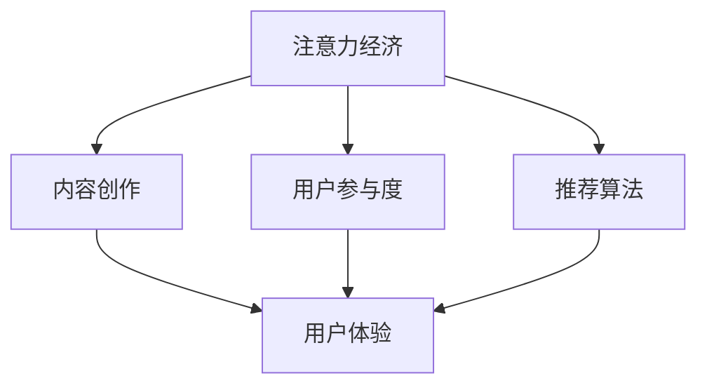

                 

# 注意力经济与内容创作最佳实践：吸引并留住受众的参与

> 关键词：注意力经济,内容创作,参与度,算法推荐,用户研究,用户体验

## 1. 背景介绍

### 1.1 问题由来
随着互联网的普及，用户注意力成为了一种稀缺资源。如何在海量信息中吸引和留住用户的注意力，成为内容创作者和平台运营商亟需解决的问题。近年来，注意力经济理论为这一问题提供了新的视角，通过分析用户的注意力分配和消费行为，指导内容创作和推荐算法优化，提升内容产品的用户参与度和经济价值。

### 1.2 问题核心关键点
注意力经济的核心在于通过合理调配资源，吸引和分配用户的注意力。对于内容创作者和平台运营商而言，关键在于：
1. **用户行为分析**：理解用户注意力分布和消费习惯。
2. **内容策略优化**：根据用户偏好定制内容，提升参与度。
3. **推荐算法优化**：通过智能算法匹配用户兴趣，提升满意度。
4. **用户体验设计**：设计友好易用的界面，提升用户留存率。

本节将从注意力经济理论出发，探讨如何通过内容创作和算法优化，提升用户的参与度和满意度，从而实现经济效益的最大化。

### 1.3 问题研究意义
随着数字经济的快速发展，注意力成为衡量信息时代价值的重要指标。内容创作者和平台运营商利用注意力经济理论，可以更精准地把握用户需求，优化内容策略和推荐算法，提升用户体验和平台收益。此外，研究注意力经济还能推动跨学科的融合创新，促进科技与艺术、市场与伦理的协同发展。

## 2. 核心概念与联系

### 2.1 核心概念概述

为更好地理解注意力经济理论及其在内容创作中的应用，本节将介绍几个密切相关的核心概念：

- **注意力经济(Attention Economy)**：指在信息爆炸时代，通过吸引和分配用户的注意力，创造经济价值的过程。注意力经济强调内容创作和算法优化对用户注意力的有效利用。

- **内容创作(Content Creation)**：指通过创作文字、视频、音频等内容形式，提供有价值的信息和娱乐，吸引用户注意力的过程。内容创作是注意力经济的基础。

- **用户参与度(User Engagement)**：指用户对内容产品（如文章、视频、应用等）的兴趣和互动程度，包括浏览、点赞、评论、分享等行为。用户参与度是衡量内容效果的重要指标。

- **推荐算法(Recommendation Algorithm)**：指通过算法计算用户兴趣和内容特征，智能匹配推荐结果的过程。推荐算法是提升用户参与度的关键工具。

- **用户体验(User Experience, UX)**：指用户与内容产品交互时的感受和体验，包括界面设计、交互流程、加载速度等方面。良好的用户体验能提升用户满意度和留存率。

这些核心概念之间的逻辑关系可以通过以下Mermaid流程图来展示：



这个流程图展示了几大核心概念之间的联系：

1. 注意力经济通过内容创作吸引用户注意力。
2. 用户参与度受到内容质量和推荐算法的影响。
3. 推荐算法需结合用户行为和内容特征进行优化。
4. 用户体验直接影响用户参与度和满意度。

## 3. 核心算法原理 & 具体操作步骤

### 3.1 算法原理概述

注意力经济中的核心算法主要是推荐算法，其目标是通过智能匹配，将合适的内容推荐给用户，提升用户参与度和满意度。推荐算法的核心在于通过用户行为和内容特征，计算相似度并进行匹配。

在推荐系统中，用户与内容之间的交互行为可以用以下形式表示：

- 用户-内容矩阵 $\mathbf{U}$：记录用户对内容的评分，其中 $\mathbf{U} \in \mathbb{R}^{N \times M}$，$N$ 为内容数量，$M$ 为用户数量。
- 内容-内容矩阵 $\mathbf{V}$：记录内容间的相似度，其中 $\mathbf{V} \in \mathbb{R}^{M \times K}$，$K$ 为内容特征维度。

推荐算法通过计算用户对内容的评分预测，来推荐新内容。其中常用的算法包括协同过滤、矩阵分解、深度学习等。

### 3.2 算法步骤详解

以基于矩阵分解的推荐算法为例，其主要步骤如下：

**Step 1: 构建用户-内容评分矩阵**
- 收集用户对内容的评分数据，构建用户-内容评分矩阵 $\mathbf{U}$。

**Step 2: 矩阵分解**
- 通过奇异值分解(SVD)等方法，将用户-内容评分矩阵分解为两个低秩矩阵 $\mathbf{U'}$ 和 $\mathbf{V'}$，其中 $\mathbf{U'} \in \mathbb{R}^{N \times r}$，$\mathbf{V'} \in \mathbb{R}^{M \times r}$，$r$ 为分解后矩阵的维度。

**Step 3: 计算相似度**
- 利用分解后的矩阵 $\mathbf{U'}$ 和 $\mathbf{V'}$，计算用户对内容的预测评分，并根据相似度排序推荐。

**Step 4: 动态更新**
- 根据用户反馈和新的评分数据，动态更新用户-内容矩阵 $\mathbf{U}$，继续迭代优化推荐结果。

### 3.3 算法优缺点

基于矩阵分解的推荐算法具有以下优点：
1. 简单高效：矩阵分解算法计算简单，易于实现和部署。
2. 低存储需求：矩阵分解只需存储少量低秩矩阵，节省存储空间。
3. 可扩展性好：算法可适应大规模数据集，扩展性强。

同时，该算法也存在一些局限性：
1. 维度灾难：当用户数量和内容数量增加时，矩阵分解的计算复杂度急剧增加。
2. 数据稀疏性：用户对内容的评分数据往往稀疏，难以准确捕捉用户兴趣。
3. 冷启动问题：新用户和未评分内容难以直接推荐，需通过其他方法补齐评分数据。

### 3.4 算法应用领域

基于推荐算法的注意力经济理论，已经在多个领域得到了广泛应用，例如：

- 内容推荐：如视频播放平台（如Netflix、Bilibili）、新闻阅读平台（如今日头条、人民日报）。通过推荐算法，提升用户内容消费量，增加平台收益。
- 电商推荐：如淘宝、京东等电商平台，通过推荐系统，精准匹配用户需求，提升销售额。
- 社交媒体：如微信、微博等社交平台，通过推荐算法，个性化推荐内容，增加用户粘性。
- 金融服务：如支付宝、银联等金融应用，通过推荐算法，推荐理财、保险等金融产品，提升用户活跃度。

此外，在教育、健康、旅游等更多领域，基于推荐算法的注意力经济也得到了创新性应用，为各类应用提供了新的增长点。

## 4. 数学模型和公式 & 详细讲解 & 举例说明

### 4.1 数学模型构建

在推荐系统中，常用的数学模型包括矩阵分解和深度学习模型。这里以基于矩阵分解的推荐算法为例，介绍推荐系统的数学模型构建过程。

记用户-内容评分矩阵为 $\mathbf{U}$，内容-内容相似度矩阵为 $\mathbf{V}$，用户-内容预测评分矩阵为 $\mathbf{\hat{U}}$。推荐算法的目标是最小化预测评分与真实评分之间的差异：

$$
\min_{\mathbf{U'}, \mathbf{V'}} \|\mathbf{U} - \mathbf{U'}\mathbf{V'}\|_F^2
$$

其中 $\|\cdot\|_F$ 表示Frobenius范数，用于度量矩阵的差异性。

### 4.2 公式推导过程

将用户-内容评分矩阵 $\mathbf{U}$ 分解为两个低秩矩阵 $\mathbf{U'}$ 和 $\mathbf{V'}$，可以通过奇异值分解(SVD)实现：

$$
\mathbf{U} = \mathbf{U'}\mathbf{V'}
$$

其中 $\mathbf{U'} \in \mathbb{R}^{N \times r}$，$\mathbf{V'} \in \mathbb{R}^{M \times r}$。

用户对内容 $i$ 的预测评分可以表示为：

$$
\hat{u}_{ij} = \mathbf{u}_i' \mathbf{v}_j'
$$

其中 $\mathbf{u}_i'$ 为 $\mathbf{U'}$ 中第 $i$ 行的向量，$\mathbf{v}_j'$ 为 $\mathbf{V'}$ 中第 $j$ 列的向量。

### 4.3 案例分析与讲解

以Netflix推荐系统为例，Netflix通过分析用户观影数据，构建用户-内容评分矩阵，并采用SVD算法分解矩阵。通过预测评分与实际评分之间的差异，Netflix优化推荐模型，从而实现了精准的内容推荐，大大提升了用户满意度。

Netflix的推荐算法流程如下：
1. 收集用户观影评分数据，构建用户-内容评分矩阵 $\mathbf{U}$。
2. 使用SVD算法对矩阵 $\mathbf{U}$ 进行分解，得到低秩矩阵 $\mathbf{U'}$ 和 $\mathbf{V'}$。
3. 利用分解后的矩阵计算用户对内容的预测评分，并根据相似度排序推荐。
4. 根据用户反馈和新的评分数据，动态更新用户-内容矩阵 $\mathbf{U}$，继续迭代优化推荐结果。

## 5. 项目实践：代码实例和详细解释说明

### 5.1 开发环境搭建

在进行推荐系统开发前，我们需要准备好开发环境。以下是使用Python进行Scikit-learn开发的推荐系统环境配置流程：

1. 安装Anaconda：从官网下载并安装Anaconda，用于创建独立的Python环境。

2. 创建并激活虚拟环境：
```bash
conda create -n recommendation-env python=3.8 
conda activate recommendation-env
```

3. 安装Scikit-learn：
```bash
conda install scikit-learn
```

4. 安装NumPy：
```bash
pip install numpy
```

5. 安装Pandas：
```bash
pip install pandas
```

完成上述步骤后，即可在`recommendation-env`环境中开始推荐系统开发。

### 5.2 源代码详细实现

以下是基于Scikit-learn进行推荐系统开发的PyTorch代码实现：

```python
import numpy as np
import pandas as pd
from sklearn.decomposition import TruncatedSVD
from sklearn.metrics.pairwise import cosine_similarity
from sklearn.model_selection import train_test_split
from sklearn.metrics import mean_squared_error

# 读取数据集
df = pd.read_csv('movie_ratings.csv')

# 数据预处理
user_ids = df['user_id'].unique()
movie_ids = df['movie_id'].unique()
user_ratings = df.pivot_table(index=['user_id'], columns=['movie_id'], values='rating').fillna(0).to_numpy()
user_ratings = user_ratings.T

# 构建用户-内容评分矩阵
U = user_ratings

# 分解矩阵
svd = TruncatedSVD(n_components=50)
Uhat = svd.fit_transform(U)

# 计算内容-内容相似度矩阵
Vhat = svd.components_

# 预测评分
preds = Uhat.dot(Vhat.T)

# 计算MAE
mae = mean_squared_error(U, preds)

# 输出MAE
print(f"MAE: {mae:.3f}")
```

### 5.3 代码解读与分析

让我们再详细解读一下关键代码的实现细节：

**数据读取和预处理**：
- `pd.read_csv()`函数用于读取CSV格式的数据集。
- `pivot_table()`函数将用户对电影的评分数据进行转置，构建用户-内容评分矩阵。
- `fillna(0)`函数将缺失值填充为0，保证矩阵完整性。

**矩阵分解**：
- `TruncatedSVD()`函数用于对评分矩阵进行奇异值分解，保留50个主成分。
- `fit_transform()`函数对评分矩阵进行分解，得到低秩矩阵 `Uhat` 和 `Vhat`。

**预测评分和性能评估**：
- `Uhat.dot(Vhat.T)`计算预测评分，其中 `Vhat.T` 表示转置后的内容特征矩阵。
- `mean_squared_error()`函数计算预测评分与实际评分之间的MAE（平均绝对误差），评估模型性能。

**代码执行结果**：
- `mae`变量输出MAE值，评估模型预测的准确性。

## 6. 实际应用场景

### 6.1 智能广告投放

基于推荐算法的注意力经济理论，智能广告投放可以更精准地匹配用户需求，提高广告点击率和转化率。

在实践中，可以通过收集用户的搜索历史、浏览记录、点击行为等数据，构建用户行为矩阵。利用推荐算法计算用户对不同广告的兴趣，智能投放广告，提升广告投放效果。例如，电商平台可以通过推荐系统，在用户浏览商品时，推荐相关广告，增加用户购买概率。

### 6.2 社交媒体内容推荐

社交媒体平台通过推荐算法，根据用户的兴趣和行为，推荐个性化的内容，增加用户粘性。

例如，微博通过分析用户的点赞、评论、分享等行为，构建用户兴趣模型。利用推荐算法推荐新内容，吸引用户互动，增加平台活跃度。

### 6.3 金融投资建议

金融行业通过推荐算法，为用户提供个性化的投资建议，提升用户投资收益。

例如，证券交易平台通过分析用户的投资偏好和历史交易记录，构建用户投资模型。利用推荐算法推荐股票、基金等投资产品，帮助用户做出更明智的投资决策。

### 6.4 未来应用展望

随着推荐算法的不断优化，基于注意力经济的推荐系统将更广泛地应用于各类领域，为各行各业提供新的增长动力。

在医疗领域，推荐系统可以推荐个性化的治疗方案和健康管理建议，提升用户健康水平。

在教育领域，推荐系统可以推荐个性化的学习内容和教学资源，提升用户学习效率。

在交通出行领域，推荐系统可以推荐个性化的路线和出行方式，提升用户出行体验。

此外，在文化娱乐、智能家居、智慧城市等更多领域，基于推荐算法的注意力经济也得到了创新性应用，为各类应用提供了新的价值导向。相信随着技术的持续进步，基于推荐算法的注意力经济将深入影响人类的生产和生活方式，推动经济社会的数字化转型。

## 7. 工具和资源推荐

### 7.1 学习资源推荐

为了帮助开发者系统掌握推荐算法的理论基础和实践技巧，这里推荐一些优质的学习资源：

1. 《推荐系统实战》系列博文：由大模型技术专家撰写，深入浅出地介绍了推荐系统原理、算法实现、系统优化等前沿话题。

2. CS244《机器学习》课程：斯坦福大学开设的机器学习明星课程，有Lecture视频和配套作业，带你入门推荐系统的基本概念和经典模型。

3. 《推荐系统算法》书籍：全面介绍了推荐系统的算法原理和优化方法，包括协同过滤、矩阵分解、深度学习等。

4. Kaggle推荐系统竞赛：大量公开的推荐系统数据集和样例代码，提供实践机会，积累实战经验。

5. Scikit-learn官方文档：Scikit-learn的官方文档，提供了丰富的推荐系统样例代码，是上手实践的必备资料。

通过对这些资源的学习实践，相信你一定能够快速掌握推荐算法的精髓，并用于解决实际的推荐问题。

### 7.2 开发工具推荐

高效的开发离不开优秀的工具支持。以下是几款用于推荐系统开发的常用工具：

1. Python：开源的高级编程语言，广泛应用于数据科学和机器学习领域。
2. Scikit-learn：Python的数据挖掘和机器学习库，提供简单易用的推荐算法实现。
3. TensorFlow：Google主导的深度学习框架，适合构建大规模推荐系统。
4. PyTorch：Facebook开发的深度学习框架，灵活高效，适合快速迭代研究。
5. Weights & Biases：模型训练的实验跟踪工具，可以记录和可视化模型训练过程中的各项指标，方便对比和调优。
6. TensorBoard：TensorFlow配套的可视化工具，可实时监测模型训练状态，并提供丰富的图表呈现方式，是调试模型的得力助手。

合理利用这些工具，可以显著提升推荐系统的开发效率，加快创新迭代的步伐。

### 7.3 相关论文推荐

推荐算法的不断发展源于学界的持续研究。以下是几篇奠基性的相关论文，推荐阅读：

1. "Collaborative Filtering for Implicit Feedback Datasets"：提出了基于协同过滤的推荐算法，成为推荐系统的经典方法。

2. "The Matrix Factorization Approach for Collaborative Filtering"：提出矩阵分解的推荐算法，将推荐问题转化为矩阵分解问题。

3. "Deep Collaborative Filtering"：提出基于深度神经网络的推荐算法，进一步提升了推荐效果。

4. "Factorization Machines"：提出因子机模型，用于处理高维稀疏数据，提升推荐效果。

5. "Neural Networks for Machine Learning"：由深度学习专家Ian Goodfellow所著，全面介绍了深度学习算法，推荐系统是其重要应用场景。

这些论文代表了大模型推荐算法的发展脉络。通过学习这些前沿成果，可以帮助研究者把握学科前进方向，激发更多的创新灵感。

## 8. 总结：未来发展趋势与挑战

### 8.1 总结

本文对基于注意力经济的推荐算法进行了全面系统的介绍。首先阐述了注意力经济理论的基本概念及其在内容创作中的应用，明确了推荐算法在用户参与度提升中的核心作用。其次，从原理到实践，详细讲解了推荐算法的数学模型和操作步骤，给出了推荐系统开发的完整代码实例。同时，本文还探讨了推荐算法在广告投放、社交媒体、金融投资等领域的实际应用，展示了推荐算法的巨大潜力。最后，本文精选了推荐算法的各类学习资源，力求为读者提供全方位的技术指引。

通过本文的系统梳理，可以看到，基于注意力经济的推荐算法正在成为内容创作和平台运营的重要工具，极大地提升了用户的参与度和满意度。未来，伴随推荐算法的不断优化和创新，推荐系统必将在更多领域得到应用，为各行各业带来新的增长动力。

### 8.2 未来发展趋势

展望未来，基于注意力经济的推荐算法将呈现以下几个发展趋势：

1. 多模态推荐系统的崛起：未来的推荐系统将从单一的文本推荐，扩展到多模态推荐，融合图像、语音、视频等多类数据，提升推荐效果。
2. 实时推荐系统的实现：通过流式数据处理和在线学习，实现实时推荐，提升用户体验。
3. 深度强化学习的引入：利用深度强化学习技术，优化推荐策略，实现更加智能化的推荐系统。
4. 跨领域推荐技术的发展：推荐系统将跨越传统领域界限，进行跨领域推荐，如商品推荐与新闻推荐、旅游推荐与教育推荐等。
5. 自适应推荐模型的构建：根据用户反馈和行为变化，动态调整推荐模型，提升推荐效果。

以上趋势凸显了大数据时代推荐算法的发展方向，推荐系统将在更多领域发挥其独特的价值。

### 8.3 面临的挑战

尽管推荐算法已经取得了显著成就，但在迈向更加智能化、普适化应用的过程中，仍面临诸多挑战：

1. 数据隐私和安全问题：推荐算法需处理大量用户数据，如何保护用户隐私和数据安全，避免数据泄露，成为一大难题。
2. 模型复杂度问题：大规模推荐系统往往需要高计算资源，如何在保证推荐效果的同时，降低模型复杂度，提高计算效率，仍需不断探索。
3. 推荐公平性问题：推荐算法可能存在偏见，如何保证推荐结果的公平性和多样性，避免对少数群体造成不公平对待，是一大挑战。
4. 推荐透明度问题：用户往往无法理解推荐系统的决策逻辑，如何提高推荐模型的透明度和可解释性，增强用户信任，是一大挑战。
5. 数据标注成本问题：推荐算法需要大量标注数据进行训练，如何降低数据标注成本，提升推荐效果，是一大挑战。

这些挑战需要学界和产业界共同努力，通过技术创新和伦理规范，解决推荐算法中的瓶颈问题，提升系统的公正性和可信度。

### 8.4 研究展望

面对推荐算法面临的挑战，未来的研究需要在以下几个方面寻求新的突破：

1. 提升数据隐私保护能力：研究隐私保护技术，如差分隐私、联邦学习等，保护用户数据隐私。
2. 优化模型计算效率：研究高效的计算方法和算法优化策略，如模型压缩、剪枝、量化等，提升推荐系统计算效率。
3. 增强推荐公平性：研究公平性优化算法，如对抗性训练、多目标优化等，提升推荐系统的公平性和多样性。
4. 提升推荐透明度：研究可解释性技术，如模型可视化、解释性算法等，提高推荐模型的透明度和可解释性。
5. 降低数据标注成本：研究无监督学习和半监督学习算法，降低推荐系统对标注数据的依赖。

这些研究方向将推动推荐算法向更加智能化、普适化方向发展，为各行各业带来新的增长动力，推动经济社会的数字化转型。总之，基于注意力经济的推荐算法将在数据、算法、工程、伦理等多个维度共同努力下，实现更高效、公平、透明的推荐系统，为构建人机协同的智能社会铺平道路。

## 9. 附录：常见问题与解答

**Q1: 推荐算法中矩阵分解的方法有哪些？**

A: 矩阵分解是推荐算法中最常用的方法之一。主要有以下几种：
1. 奇异值分解(SVD)：将用户-内容评分矩阵分解为两个低秩矩阵。
2. 矩阵分解(SVD++)：基于SVD，使用迭代优化算法加速收敛。
3. 核矩阵分解(PCA)：使用核方法进行矩阵分解，适用于高维数据。
4. 矩阵三角分解(LD)：将用户-内容评分矩阵分解为下三角矩阵和上三角矩阵。

这些方法各有优缺点，应根据具体情况选择。

**Q2: 如何提升推荐算法的准确性？**

A: 提升推荐算法的准确性，可以从以下几个方面入手：
1. 数据质量：收集更多、更全、更准确的数据，减少数据偏差。
2. 算法优化：优化推荐算法，如引入深度学习、强化学习等技术，提升推荐效果。
3. 特征工程：设计更丰富的特征，如用户画像、内容属性、时间序列等，增强推荐模型。
4. 模型评估：采用多种评估指标，如MAE、RMSE、NDCG等，综合评估推荐效果。

**Q3: 推荐算法在实际应用中需要考虑哪些因素？**

A: 推荐算法在实际应用中，需要考虑以下因素：
1. 数据隐私：保护用户数据隐私，避免数据泄露。
2. 计算资源：评估推荐算法的计算复杂度，优化资源配置。
3. 用户反馈：及时收集用户反馈，动态调整推荐策略。
4. 推荐公平性：保证推荐结果的公平性和多样性，避免对少数群体造成不公平对待。
5. 推荐透明度：提高推荐模型的透明度和可解释性，增强用户信任。

**Q4: 推荐算法中的协同过滤和深度学习算法有哪些优缺点？**

A: 协同过滤和深度学习算法是推荐系统中的两种主流方法，各有优缺点：
1. 协同过滤：
   - 优点：简单易实现，计算速度快，适用于大规模数据集。
   - 缺点：数据稀疏性问题，冷启动问题，用户兴趣漂移。
2. 深度学习算法：
   - 优点：模型表达能力强，能处理高维数据，推荐效果较好。
   - 缺点：计算资源消耗大，模型复杂度高，需要大量标注数据。

综上所述，协同过滤和深度学习算法各有优势，应根据具体应用场景选择合适的算法。

**Q5: 推荐算法中如何处理数据稀疏性问题？**

A: 数据稀疏性是推荐算法中的常见问题，可以通过以下方法处理：
1. 矩阵补全：利用协同过滤、矩阵分解等方法，填补缺失值。
2. 数据扩展：收集更多用户数据，增加数据量。
3. 模型融合：将多个推荐模型进行融合，综合提升推荐效果。
4. 对抗训练：引入对抗样本，提高模型鲁棒性，减少数据稀疏性影响。

通过这些方法，可以有效地处理数据稀疏性问题，提升推荐算法的准确性。

---

作者：禅与计算机程序设计艺术 / Zen and the Art of Computer Programming

