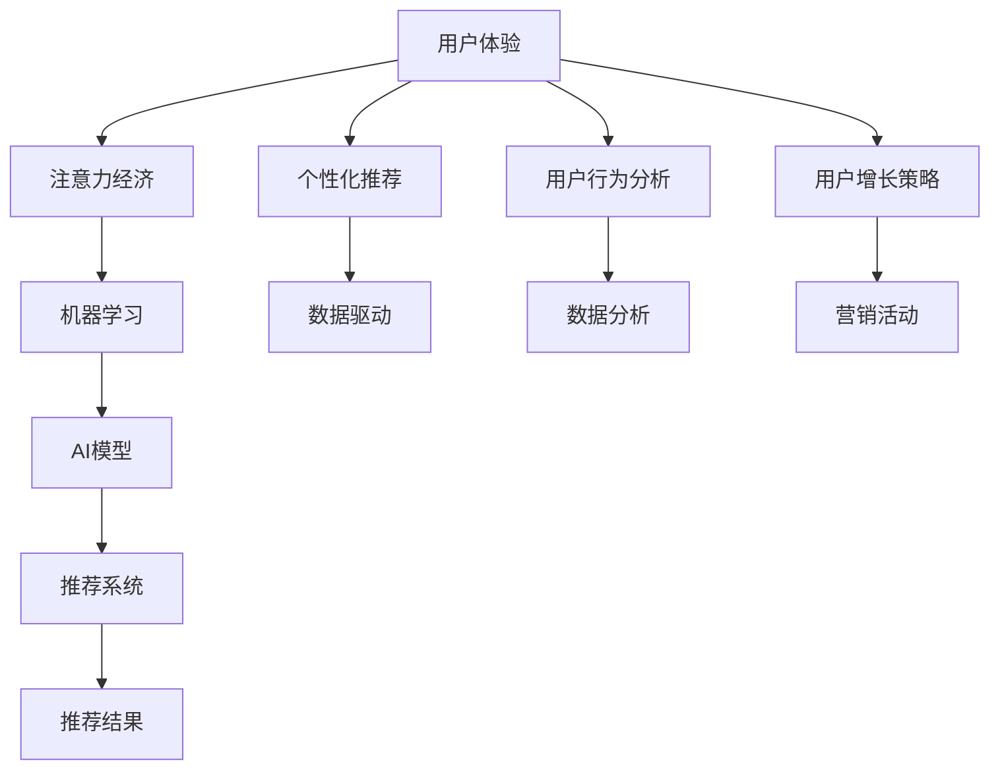

                 

# 注意力经济与用户体验优化技术：创建令人上瘾和引人入胜的产品

> 关键词：注意力经济,用户体验优化,产品设计,人工智能,大数据,个性化推荐,用户行为分析,用户增长策略

## 1. 背景介绍

### 1.1 问题由来
随着互联网和数字技术的飞速发展，全球进入了一个高度竞争的注意力经济时代。大量信息不断涌现，而人类的注意力资源是有限的。如何高效利用这些注意力资源，成为企业和产品设计者面临的重要挑战。在这个背景下，用户体验(UX)优化技术应运而生，通过分析用户行为，优化产品设计，从而吸引用户注意力，提升产品价值。

### 1.2 问题核心关键点
用户体验优化技术的关键在于深入理解用户需求，通过精准的产品设计、数据驱动的决策和不断迭代的产品测试，提升用户满意度和留存率。其主要目标包括：

1. **用户增长**：通过优化产品功能和设计，吸引更多用户，提升用户注册和活跃率。
2. **留存提升**：通过个性化推荐、内容优化等手段，提升现有用户的满意度和忠诚度。
3. **转化率提升**：优化产品转化流程，提高用户从兴趣到行动的转化率。
4. **用户满意度**：通过数据反馈，持续改进产品功能，提升用户的使用体验。

### 1.3 问题研究意义
研究用户体验优化技术，对于提升产品竞争力、优化资源配置、加速用户增长具有重要意义：

1. 帮助企业快速占领市场，提升市场份额。
2. 优化资源配置，提高营销和运营效率。
3. 精准触达用户，提升用户体验和满意度。
4. 提高用户粘性，构建长期稳定的用户群体。
5. 提升企业品牌影响力和用户口碑。

## 2. 核心概念与联系

### 2.1 核心概念概述

为更好地理解用户体验优化技术的原理和架构，本节将介绍几个核心概念：

- **用户体验(UX)**：产品设计中的用户体验，是用户与产品交互过程中产生的所有感受和印象的总和。好的用户体验能够吸引用户，提升用户满意度。
- **注意力经济**：在信息爆炸的时代，注意力成为一种稀缺资源，企业需要通过优化产品设计，吸引用户注意力，从而提升产品的市场价值。
- **个性化推荐**：通过分析用户行为数据，预测用户偏好，向用户推荐符合其兴趣的产品或内容。
- **用户行为分析**：通过数据挖掘技术，分析用户在使用产品过程中的行为模式，识别用户需求，优化产品功能。
- **用户增长策略**：通过一系列的营销、产品优化和运营手段，提高用户注册、活跃和留存，扩大用户规模。
- **机器学习与AI**：利用机器学习和人工智能技术，自动化地分析用户行为数据，提供个性化的推荐和服务，提升用户体验。

这些核心概念之间的逻辑关系可以通过以下Mermaid流程图来展示：



这个流程图展示了用户体验优化技术的主要流程和相关概念：

1. 通过用户行为分析，收集和分析用户在使用产品过程中的数据。
2. 利用机器学习和AI技术，自动化地分析用户数据，提供个性化的推荐。
3. 结合用户增长策略，通过营销和运营手段提升用户数量和活跃度。
4. 最终实现提升用户体验，吸引用户注意力，提升产品价值的目标。

## 3. 核心算法原理 & 具体操作步骤
### 3.1 算法原理概述

用户体验优化技术的核心算法原理包括以下几个方面：

- **用户行为分析**：通过数据分析，理解用户需求和行为模式。
- **个性化推荐**：基于用户行为数据，构建推荐模型，提供个性化推荐。
- **用户增长策略**：通过A/B测试、用户反馈等手段，优化产品功能和运营策略。

用户体验优化技术主要通过以下几个步骤实现：

1. **数据收集**：收集用户行为数据，如点击、浏览、购买等行为数据。
2. **数据处理**：对数据进行清洗和预处理，去除异常值和噪声，确保数据质量。
3. **用户建模**：通过机器学习模型，对用户进行建模，识别用户的兴趣和偏好。
4. **推荐策略制定**：根据用户模型，制定个性化的推荐策略，优化用户体验。
5. **反馈与迭代**：通过用户反馈，不断优化产品设计和运营策略，提升用户满意度。

### 3.2 算法步骤详解

以下是用户体验优化技术的详细步骤：

#### Step 1: 数据收集与预处理

1. **用户行为数据收集**：
   - 通过网络日志、移动应用数据、社交媒体数据等渠道，收集用户行为数据。
   - 将数据存储到数据仓库或数据湖中，为后续分析提供数据基础。

2. **数据清洗与预处理**：
   - 去除缺失值和异常值，处理重复数据和噪声数据。
   - 将数据转化为标准格式，便于后续分析。

#### Step 2: 用户行为建模

1. **用户画像构建**：
   - 通过分析用户行为数据，构建用户画像，识别用户的基本信息、兴趣和行为模式。
   - 使用K-means、层次聚类等算法，将用户分成不同的群体。

2. **用户兴趣建模**：
   - 使用协同过滤、基于内容的推荐算法等，构建用户兴趣模型。
   - 通过矩阵分解、深度学习等方法，从海量的产品数据中提取用户兴趣特征。

#### Step 3: 个性化推荐

1. **推荐算法选择**：
   - 根据用户画像和产品数据，选择适合的推荐算法，如协同过滤、基于内容的推荐、深度学习推荐等。
   - 基于模型的推荐算法需要大量的用户行为数据和产品数据进行训练。

2. **推荐策略制定**：
   - 结合用户画像和产品数据，制定个性化的推荐策略。
   - 使用A/B测试等手段，评估推荐策略的效果，不断优化推荐算法。

#### Step 4: 用户增长策略

1. **用户增长分析**：
   - 通过分析用户行为数据，识别用户增长的瓶颈和机会。
   - 使用用户增长模型，如漏斗模型、用户生命周期模型等，进行分析和预测。

2. **增长策略制定**：
   - 根据用户增长分析结果，制定相应的增长策略，如优化注册流程、增加营销活动、提升产品体验等。
   - 结合个性化推荐，提升用户转化率，实现用户增长。

#### Step 5: 反馈与迭代

1. **用户反馈收集**：
   - 通过用户调查、用户评论、用户行为数据等途径，收集用户反馈。
   - 分析用户反馈，识别用户满意度和痛点，优化产品功能和用户体验。

2. **迭代优化**：
   - 结合用户反馈，不断优化产品设计和运营策略。
   - 持续迭代，提升用户体验，实现用户满意度的不断提升。

### 3.3 算法优缺点

用户体验优化技术的主要优点包括：

1. **提升用户体验**：通过个性化推荐和优化产品设计，提升用户满意度和粘性。
2. **优化资源配置**：通过数据分析，优化营销和运营策略，提升资源利用效率。
3. **加速用户增长**：通过精准的用户增长策略，吸引更多用户，提升用户活跃率。
4. **提高转化率**：通过优化产品转化流程，提升用户从兴趣到行动的转化率。

然而，该技术也存在一些缺点：

1. **数据隐私问题**：用户行为数据的收集和处理可能涉及隐私问题，需要严格的隐私保护措施。
2. **模型复杂度**：个性化推荐和用户建模需要大量的数据和复杂的算法，模型复杂度高。
3. **用户依赖**：过度依赖推荐系统可能导致用户对产品的依赖性增加，降低用户主动性。
4. **用户体验单一**：过度依赖数据分析可能导致用户体验单一，缺乏多样性。

### 3.4 算法应用领域

用户体验优化技术已经广泛应用于以下几个领域：

- **电商零售**：通过个性化推荐和用户行为分析，提升用户购买转化率，优化库存管理。
- **内容平台**：如视频网站、新闻媒体等，通过推荐算法和用户行为分析，提升用户留存率和互动率。
- **社交网络**：如微信、微博等，通过个性化推荐和用户行为分析，提升用户活跃度和互动率。
- **金融科技**：通过用户行为分析和风险控制，提升用户体验和金融服务的安全性。
- **教育培训**：通过个性化推荐和用户行为分析，提升教学效果和学习体验。

## 4. 数学模型和公式 & 详细讲解 & 举例说明

### 4.1 数学模型构建

用户体验优化技术涉及多个数学模型，以下对几个核心模型进行介绍：

#### 用户画像模型

用户画像模型通过聚类算法，将用户分成不同的群体，识别用户的共性和差异性。常用的聚类算法包括K-means、层次聚类等。

用户画像模型的数学表达式为：
$$ U = \{\text{User}_1, \text{User}_2, ..., \text{User}_N\} $$
其中 $N$ 为用户的数量，$U$ 为用户的集合。

#### 协同过滤模型

协同过滤模型通过分析用户和产品之间的协同关系，推荐用户可能感兴趣的产品。常用的协同过滤算法包括基于用户的协同过滤和基于物品的协同过滤。

协同过滤模型的数学表达式为：
$$ P(r_{ui}) = \frac{1}{\sqrt{S_u} + \sqrt{S_i} + \epsilon} \sum_{j=1}^{m} \frac{r_{uj}r_{ji}}{\sqrt{S_u} + \sqrt{S_j}} $$
其中 $r_{ui}$ 为用户 $u$ 对产品 $i$ 的评分，$S_u$ 为用户 $u$ 的评分方差，$S_i$ 为产品 $i$ 的评分方差，$\epsilon$ 为平滑因子。

#### 深度学习推荐模型

深度学习推荐模型通过神经网络模型，从大量的用户行为数据和产品数据中提取特征，进行个性化推荐。常用的深度学习推荐模型包括RNN、CNN、GAN等。

深度学习推荐模型的数学表达式为：
$$ P(r_{ui}) = \sigma(\sum_{k=1}^{d} w_k \cdot (X_u \cdot X_i)_k) $$
其中 $P(r_{ui})$ 为用户 $u$ 对产品 $i$ 的评分预测，$X_u$ 为用户的特征向量，$X_i$ 为产品的特征向量，$w_k$ 为神经网络的权重，$\sigma$ 为激活函数。

### 4.2 公式推导过程

#### 用户画像模型推导

K-means聚类算法的数学推导：
$$ \min_{\mu_k, \Sigma_k, c_k} \sum_{i=1}^{N} \min_{k=1,...,K} \frac{1}{2} || x_i - \mu_k ||^2 $$
其中 $x_i$ 为用户 $i$ 的数据点，$\mu_k$ 为簇中心，$\Sigma_k$ 为簇内协方差矩阵，$c_k$ 为簇的标签。

#### 协同过滤模型推导

基于用户的协同过滤算法推导：
$$ \hat{r}_{ui} = \frac{1}{\sqrt{S_u} + \sqrt{S_i} + \epsilon} \sum_{j=1}^{m} \frac{r_{uj}r_{ji}}{\sqrt{S_u} + \sqrt{S_j}} $$
其中 $r_{uj}$ 为用户 $u$ 对产品 $j$ 的评分，$S_u$ 为用户 $u$ 的评分方差，$S_j$ 为产品 $j$ 的评分方差，$\epsilon$ 为平滑因子。

#### 深度学习推荐模型推导

深度学习推荐模型的推导涉及神经网络的知识，这里不再展开，读者可以参考相关资料进行深入学习。

### 4.3 案例分析与讲解

以电商平台的个性化推荐系统为例，介绍用户体验优化技术的应用：

1. **数据收集与预处理**：
   - 从电商平台收集用户浏览、点击、购买等行为数据。
   - 对数据进行清洗和预处理，去除异常值和噪声，确保数据质量。

2. **用户画像建模**：
   - 通过K-means聚类算法，将用户分成不同的群体，识别用户的共性和差异性。
   - 结合协同过滤算法，为每个用户推荐相似的产品。

3. **个性化推荐**：
   - 使用基于内容的推荐算法，分析用户行为数据，提取用户兴趣特征。
   - 通过深度学习推荐模型，从大量的产品数据中提取用户兴趣特征，进行个性化推荐。

4. **用户增长策略**：
   - 分析用户行为数据，识别用户增长的瓶颈和机会。
   - 制定相应的增长策略，如优化注册流程、增加营销活动、提升产品体验等。

5. **反馈与迭代**：
   - 通过用户调查、用户评论、用户行为数据等途径，收集用户反馈。
   - 分析用户反馈，识别用户满意度和痛点，优化产品功能和用户体验。

## 5. 项目实践：代码实例和详细解释说明

### 5.1 开发环境搭建

在进行用户体验优化技术的实践前，我们需要准备好开发环境。以下是使用Python进行PyTorch开发的环境配置流程：

1. 安装Anaconda：从官网下载并安装Anaconda，用于创建独立的Python环境。

2. 创建并激活虚拟环境：
```bash
conda create -n pytorch-env python=3.8 
conda activate pytorch-env
```

3. 安装PyTorch：根据CUDA版本，从官网获取对应的安装命令。例如：
```bash
conda install pytorch torchvision torchaudio cudatoolkit=11.1 -c pytorch -c conda-forge
```

4. 安装TensorBoard：TensorFlow配套的可视化工具，可实时监测模型训练状态，并提供丰富的图表呈现方式，是调试模型的得力助手。

```bash
pip install tensorboard
```

5. 安装Weights & Biases：模型训练的实验跟踪工具，可以记录和可视化模型训练过程中的各项指标，方便对比和调优。

```bash
pip install weights-and-biases
```

完成上述步骤后，即可在`pytorch-env`环境中开始用户体验优化技术的实践。

### 5.2 源代码详细实现

这里我们以电商平台的个性化推荐系统为例，给出使用PyTorch和TensorFlow实现个性化推荐的具体代码。

#### PyTorch实现

首先，定义协同过滤模型的输入数据：

```python
import torch
from torch import nn, optim

class协同过滤(nn.Module):
    def __init__(self, K, n_users, n_items):
        super().__init__()
        self.K = K
        self.W = nn.Parameter(torch.randn(n_users, K))
        self.V = nn.Parameter(torch.randn(n_items, K))
        self.U = nn.Parameter(torch.randn(n_users, n_items))
    
    def forward(self, u, i):
        u = self.W[u] * self.U
        i = self.V[i]
        return (u @ i).sum(dim=1)
```

然后，定义训练过程：

```python
# 准备数据
train_data = torch.randn(100, 10, 100)  # 100个用户，10个物品，100次互动
train_labels = torch.randn(100, 10)    # 用户的互动评分

# 定义模型
model =协同过滤(K=10, n_users=100, n_items=100)

# 定义损失函数和优化器
criterion = nn.MSELoss()
optimizer = optim.Adam(model.parameters(), lr=0.001)

# 训练模型
for epoch in range(100):
    optimizer.zero_grad()
    outputs = model(train_data[:, 0, :], train_data[:, 1, :])
    loss = criterion(outputs, train_labels)
    loss.backward()
    optimizer.step()
    print('Epoch {}: loss={:.4f}'.format(epoch+1, loss.item()))
```

#### TensorFlow实现

使用TensorFlow实现个性化推荐系统，需要对TensorFlow的基本操作和API有一定的了解。以下是一个简单的TensorFlow实现示例：

```python
import tensorflow as tf

# 准备数据
train_data = tf.random.normal(shape=(100, 10, 100))  # 100个用户，10个物品，100次互动
train_labels = tf.random.normal(shape=(100, 10))    # 用户的互动评分

# 定义模型
model = tf.keras.Sequential([
    tf.keras.layers.Dense(10, activation='relu'),
    tf.keras.layers.Dense(1)
])

# 定义损失函数和优化器
criterion = tf.keras.losses.MSE()
optimizer = tf.keras.optimizers.Adam()

# 训练模型
model.compile(optimizer=optimizer, loss=criterion)
model.fit(train_data, train_labels, epochs=100, batch_size=32)

# 使用模型进行预测
test_data = tf.random.normal(shape=(10, 10, 100))
outputs = model.predict(test_data)
print(outputs)
```

### 5.3 代码解读与分析

让我们再详细解读一下关键代码的实现细节：

**协同过滤模型**：
- `__init__`方法：初始化模型的权重和偏置参数。
- `forward`方法：前向传播计算模型输出。

**训练过程**：
- 定义训练数据和标签，准备训练样本。
- 定义协同过滤模型，选择K-means聚类算法进行用户分组。
- 定义损失函数和优化器，使用均方误差损失函数进行模型训练。
- 循环迭代训练模型，记录每个epoch的损失，不断优化模型参数。

**TensorFlow实现**：
- 定义模型结构，使用Sequential模型构建。
- 定义损失函数和优化器，使用均方误差损失函数进行模型训练。
- 使用fit方法进行模型训练，循环迭代100个epoch。
- 使用predict方法进行模型预测，输出测试数据的推荐结果。

可以看到，无论是PyTorch还是TensorFlow，实现个性化推荐系统的代码结构类似，都需要定义模型结构、损失函数和优化器，并进行模型训练和预测。但不同的深度学习框架在API和实现方式上有一定的差异，需要开发者根据具体情况进行选择。

## 6. 实际应用场景

### 6.1 智能推荐系统

个性化推荐系统已经成为电商、视频、音乐等领域的重要技术手段，通过分析用户行为数据，提供个性化的推荐，提升用户满意度和粘性。

- **电商推荐**：如淘宝、京东等电商平台，通过推荐算法，向用户推荐他们可能感兴趣的商品，提升购买转化率。
- **视频推荐**：如Netflix、Bilibili等视频平台，通过推荐算法，向用户推荐他们可能感兴趣的视频内容，提升用户留存率和互动率。
- **音乐推荐**：如Spotify、QQ音乐等音乐平台，通过推荐算法，向用户推荐他们可能感兴趣的音乐，提升用户的听歌体验。

### 6.2 智能客服系统

智能客服系统通过分析用户对话记录，提供智能化的客服服务，提升用户体验和满意度。

- **语音识别**：通过语音识别技术，将用户的语音转化为文本，进行分析。
- **自然语言处理**：通过NLP技术，理解用户意图，提供准确的解答。
- **个性化推荐**：根据用户的历史记录，推荐可能感兴趣的服务和产品。

### 6.3 智慧城市

智慧城市通过分析市民的行为数据，优化城市管理和公共服务，提升市民的生活质量。

- **交通管理**：通过分析市民的出行数据，优化交通信号灯控制，缓解交通拥堵。
- **公共安全**：通过分析市民的行为数据，识别潜在风险，提升公共安全。
- **能源管理**：通过分析市民的能源使用数据，优化能源分配，提升能源利用效率。

### 6.4 未来应用展望

随着人工智能技术的不断发展，用户体验优化技术将在更多领域得到应用，为人类生活带来更深远的影响：

- **医疗健康**：通过分析病人的行为数据，提供个性化的健康建议和诊疗方案。
- **金融科技**：通过分析用户的投资行为，提供个性化的投资建议和风险控制。
- **教育培训**：通过分析学生的学习行为，提供个性化的学习路径和资源。
- **文化娱乐**：通过分析用户的娱乐偏好，提供个性化的影视、游戏等推荐。

## 7. 工具和资源推荐

### 7.1 学习资源推荐

为了帮助开发者系统掌握用户体验优化技术的理论基础和实践技巧，这里推荐一些优质的学习资源：

1. **《用户体验设计：理论与实践》**：系统介绍用户体验设计的原理、方法和工具，适合对用户体验设计感兴趣的学习者。
2. **《机器学习实战》**：详细介绍机器学习和深度学习的基本概念和实现方法，适合对机器学习感兴趣的开发者。
3. **《深度学习入门：基于PyTorch的实践》**：详细讲解深度学习模型的构建和训练方法，适合对深度学习感兴趣的开发者。
4. **《Python数据科学手册》**：全面介绍Python在数据分析、机器学习、数据可视化等方面的应用，适合对数据科学感兴趣的学习者。
5. **《TensorFlow实战》**：详细介绍TensorFlow的基本操作和API，适合对TensorFlow感兴趣的开发者。

通过对这些资源的学习实践，相信你一定能够快速掌握用户体验优化技术的精髓，并用于解决实际的NLP问题。

### 7.2 开发工具推荐

高效的开发离不开优秀的工具支持。以下是几款用于用户体验优化技术开发的常用工具：

1. **PyTorch**：基于Python的开源深度学习框架，灵活动态的计算图，适合快速迭代研究。
2. **TensorFlow**：由Google主导开发的开源深度学习框架，生产部署方便，适合大规模工程应用。
3. **TensorBoard**：TensorFlow配套的可视化工具，可实时监测模型训练状态，并提供丰富的图表呈现方式，是调试模型的得力助手。
4. **Weights & Biases**：模型训练的实验跟踪工具，可以记录和可视化模型训练过程中的各项指标，方便对比和调优。
5. **Jupyter Notebook**：交互式的编程环境，支持Python、R等多种语言，适合开发和测试。

合理利用这些工具，可以显著提升用户体验优化技术的开发效率，加快创新迭代的步伐。

### 7.3 相关论文推荐

用户体验优化技术的发展源于学界的持续研究。以下是几篇奠基性的相关论文，推荐阅读：

1. **《推荐系统的基础》**：提出了协同过滤、基于内容的推荐算法等基础推荐算法，为推荐系统研究奠定了基础。
2. **《深度学习在推荐系统中的应用》**：介绍了深度学习在推荐系统中的应用，包括神经网络推荐模型、GAN推荐模型等。
3. **《个性化推荐：数据驱动的用户体验优化》**：详细讲解了个性化推荐的技术框架和实现方法，为推荐系统提供了实际应用案例。
4. **《用户行为分析：理论与方法》**：介绍了用户行为分析的基本概念和分析方法，为用户体验优化技术提供了理论支持。
5. **《智能推荐系统的用户体验优化》**：研究了智能推荐系统的用户体验优化方法，包括用户画像建模、个性化推荐策略等。

这些论文代表了大语言模型微调技术的发展脉络。通过学习这些前沿成果，可以帮助研究者把握学科前进方向，激发更多的创新灵感。

## 8. 总结：未来发展趋势与挑战

### 8.1 总结

本文对用户体验优化技术进行了全面系统的介绍。首先阐述了用户体验优化技术的研究背景和意义，明确了技术在提升产品竞争力、优化资源配置、加速用户增长方面的独特价值。其次，从原理到实践，详细讲解了用户体验优化技术的数学模型和实现步骤，给出了用户体验优化技术的代码实例。同时，本文还广泛探讨了用户体验优化技术在电商、智能客服、智慧城市等多个领域的应用前景，展示了用户体验优化技术的巨大潜力。

通过本文的系统梳理，可以看到，用户体验优化技术已经成为现代产品设计的重要手段，帮助企业在激烈的市场竞争中脱颖而出。未来，随着人工智能技术的不断发展，用户体验优化技术也将不断迭代优化，带来更多创新突破，为人类生产和生活带来更多便利。

### 8.2 未来发展趋势

用户体验优化技术的发展趋势包括：

1. **深度学习技术的广泛应用**：随着深度学习技术的不断发展，推荐系统和用户行为分析模型将更加复杂，预测准确度更高，个性化推荐效果更佳。
2. **多模态数据融合**：将视觉、听觉、文字等多种数据源进行融合，提供更加全面的用户体验。
3. **实时分析和动态优化**：通过实时分析和动态优化，提升用户留存率和转化率。
4. **联邦学习**：在保护用户隐私的前提下，通过联邦学习技术，提升模型泛化能力和隐私保护能力。
5. **自动化和智能化**：通过自动化和智能化技术，降低人工干预，提升用户体验优化效率。

以上趋势凸显了用户体验优化技术的广阔前景。这些方向的探索发展，必将进一步提升用户体验优化技术的性能和应用范围，为构建更加智能、高效、个性化的用户体验提供新的技术路径。

### 8.3 面临的挑战

尽管用户体验优化技术已经取得了显著成效，但在迈向更加智能化、普适化应用的过程中，它仍面临着诸多挑战：

1. **数据隐私和安全问题**：用户行为数据的收集和处理可能涉及隐私问题，需要严格的隐私保护措施。
2. **模型复杂度和计算资源消耗**：深度学习模型复杂度高，计算资源消耗大，需要高性能计算资源。
3. **用户体验单一化**：过度依赖推荐系统可能导致用户体验单一化，缺乏多样性。
4. **用户依赖和主动性问题**：过度依赖推荐系统可能降低用户的主动性和探索性。

### 8.4 研究展望

未来，用户体验优化技术需要在以下几个方面寻求新的突破：

1. **无监督和半监督学习**：探索无监督和半监督学习算法，降低对标注数据的依赖，提高模型的泛化能力。
2. **可解释性和透明性**：提高模型的可解释性和透明性，让用户理解模型决策过程，增强用户信任。
3. **跨模态推荐**：将视觉、听觉、文字等多种数据源进行融合，提升推荐系统的多样性和丰富度。
4. **隐私保护技术**：在保护用户隐私的前提下，提升模型的泛化能力和隐私保护能力。
5. **联邦学习和边缘计算**：通过联邦学习和边缘计算技术，提升推荐系统的实时性和隐私保护能力。

这些研究方向的探索，必将引领用户体验优化技术迈向更高的台阶，为构建安全、可靠、可解释、可控的智能系统铺平道路。面向未来，用户体验优化技术还需要与其他人工智能技术进行更深入的融合，如知识表示、因果推理、强化学习等，多路径协同发力，共同推动用户体验优化技术的发展。只有勇于创新、敢于突破，才能不断拓展用户体验优化技术的边界，让用户体验优化技术更好地造福人类社会。

## 9. 附录：常见问题与解答

**Q1：如何平衡个性化推荐和用户隐私保护？**

A: 个性化推荐和用户隐私保护是用户体验优化技术中的重要问题。为平衡个性化推荐和用户隐私保护，可以采用以下方法：

1. **数据匿名化**：对用户数据进行匿名化处理，保护用户隐私。
2. **差分隐私技术**：使用差分隐私技术，在保护隐私的前提下，提供个性化推荐。
3. **联邦学习**：通过联邦学习技术，在保护用户隐私的前提下，优化推荐系统。
4. **用户控制**：让用户自主选择是否共享数据，提升用户信任。

**Q2：如何提高个性化推荐的准确性和多样性？**

A: 提高个性化推荐的准确性和多样性，可以从以下几个方面入手：

1. **多模态融合**：将视觉、听觉、文字等多种数据源进行融合，提升推荐系统的多样性和丰富度。
2. **深度学习模型**：使用深度学习模型，提升推荐系统的预测准确度。
3. **多目标优化**：将个性化推荐的目标多样化，不仅追求用户满意度，还考虑用户探索性和多样性。
4. **主动学习**：通过主动学习技术，提升推荐系统的数据利用效率，提高推荐准确性。

**Q3：如何提升用户体验优化技术的实时性和效率？**

A: 提升用户体验优化技术的实时性和效率，可以从以下几个方面入手：

1. **边缘计算**：将计算任务分配到边缘设备，提升推荐系统的实时性和效率。
2. **优化算法**：使用优化算法，如梯度累积、混合精度训练等，优化模型训练和推理过程。
3. **缓存技术**：使用缓存技术，减少计算资源消耗，提升推荐系统的效率。
4. **自动化和智能化**：通过自动化和智能化技术，降低人工干预，提升用户体验优化效率。

---

作者：禅与计算机程序设计艺术 / Zen and the Art of Computer Programming

