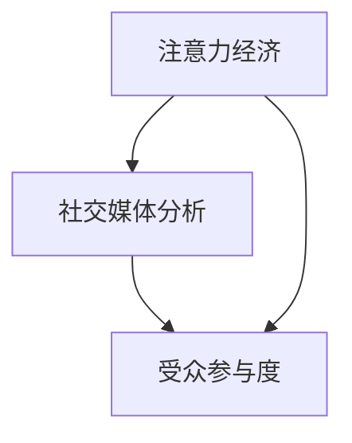
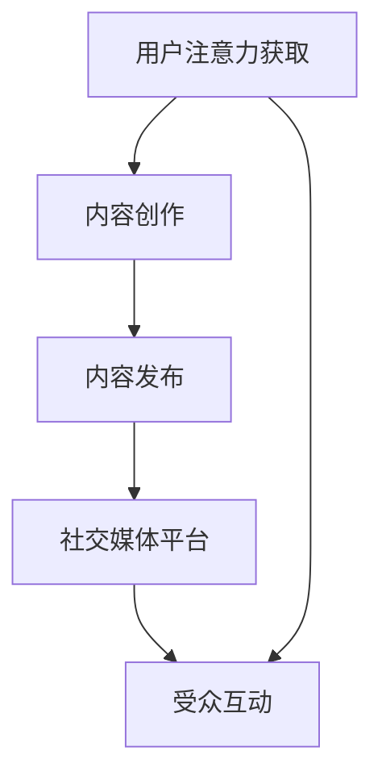

                 

# 注意力经济与社交媒体分析洞见：了解受众参与度的秘密

## 1. 背景介绍

在互联网时代，信息过载成为了不争的事实。如何在海量信息中找到具有价值的内容，成为每个用户和内容创作者必须面对的问题。注意力，作为一种稀缺资源，逐渐成为影响内容价值和传播效果的关键因素。社交媒体作为信息传播的重要平台，其受众参与度不仅影响内容的覆盖范围，也决定了平台自身的价值。因此，理解受众参与度的秘密，不仅有助于内容创作者提升内容吸引力，也对社交媒体平台的运营管理具有重要意义。本文将探讨注意力经济与社交媒体分析的原理，揭示受众参与度的关键因素，并结合实际案例，提供受众参与度提升的策略与实践建议。

## 2. 核心概念与联系

### 2.1 核心概念概述

#### 2.1.1 注意力经济 (Attention Economy)
注意力经济是指在信息过载的社会中，获取和保持用户注意力的重要性。注意力经济学认为，注意力是一种稀缺资源，其价值在于吸引用户参与到特定的内容或活动中。在社交媒体领域，注意力经济体现在用户如何分配其时间、精力和情感资源，以参与并消费内容。

#### 2.1.2 社交媒体分析 (Social Media Analytics)
社交媒体分析是指使用数据和分析工具来评估和理解用户在社交媒体平台上的行为和偏好。它包括用户互动、内容消费、用户增长等方面的数据收集和分析，旨在提高平台的用户体验和运营效率。

#### 2.1.3 受众参与度 (Audience Engagement)
受众参与度是指用户与特定内容或活动的互动程度，包括点赞、评论、分享、观看时长等行为。高参与度表明内容或活动对用户具有较强的吸引力和互动性。

这些概念之间的联系可以通过以下Mermaid流程图来展示：



这个流程图展示了大语言模型的核心概念及其之间的关系：

1. 注意力经济通过社交媒体分析来评估和理解用户行为。
2. 社交媒体分析的核心目标是提升受众参与度。
3. 受众参与度是注意力经济价值实现的关键。

### 2.2 核心概念原理和架构的 Mermaid 流程图



这个流程图概述了社交媒体内容传播的整个过程：

1. 用户通过获取注意力来关注创作者。
2. 创作者创作内容并发布到平台。
3. 平台传播内容到受众。
4. 受众与内容互动，形成反馈循环。

## 3. 核心算法原理 & 具体操作步骤

### 3.1 算法原理概述

社交媒体分析的目的是通过数据挖掘和分析，理解用户行为背后的模式和趋势，从而提升受众参与度。常见的社交媒体分析方法包括用户行为分析、内容分析、情感分析等。这些方法依赖于算法模型，如自然语言处理、机器学习等，来实现数据的自动化处理和分析。

### 3.2 算法步骤详解

#### 3.2.1 数据收集
社交媒体分析的第一步是收集相关数据。数据来源包括：

- 用户行为数据：如点击次数、停留时间、分享次数等。
- 内容数据：如帖子的点赞数、评论数、转发数等。
- 用户特征数据：如用户的基本信息、兴趣偏好等。

#### 3.2.2 数据预处理
收集到的数据需要进行预处理，包括数据清洗、归一化、特征提取等步骤。预处理的目的在于提高数据的质量和可用性。

#### 3.2.3 模型选择与训练
根据分析目的选择适当的模型进行训练。常用的模型包括：

- 自然语言处理模型：用于分析文本内容，如情感分析、主题建模等。
- 机器学习模型：用于用户行为预测、内容推荐等。
- 深度学习模型：用于复杂分析任务，如用户情感分析、话题识别等。

#### 3.2.4 模型评估与优化
训练好的模型需要进行评估和优化，以提高其预测准确性和泛化能力。评估方法包括交叉验证、ROC曲线、AUC值等。

### 3.3 算法优缺点

#### 3.3.1 优点
- 数据驱动：基于数据和模型进行分析和预测，客观可靠。
- 自动化分析：通过算法模型实现自动化处理，提高分析效率。
- 结果可解释：分析结果通常可通过可视化工具直观呈现，便于理解。

#### 3.3.2 缺点
- 数据依赖：分析结果的准确性高度依赖于数据的质量和完整性。
- 算法复杂：一些高级分析方法（如深度学习）需要大量的计算资源和时间。
- 结果解释：复杂的分析模型可能难以解释其内部逻辑和决策过程。

### 3.4 算法应用领域

社交媒体分析在以下几个领域有广泛应用：

- 内容推荐：通过分析用户行为数据，推荐相关内容，提升用户参与度。
- 用户增长：通过分析用户特征数据，制定用户增长策略，增加平台用户数。
- 内容优化：通过分析内容数据和用户反馈，优化内容创作，提高内容质量。
- 广告投放：通过分析用户行为数据，精准定位用户，提升广告效果。

## 4. 数学模型和公式 & 详细讲解 & 举例说明

### 4.1 数学模型构建

社交媒体分析的数学模型通常基于统计学和机器学习理论构建。以用户情感分析为例，其数学模型包括：

- 数据集：$D = \{(x_i, y_i)\}_{i=1}^N$，其中 $x_i$ 是用户评论文本，$y_i$ 是评论的情感标签。
- 损失函数：$L = \frac{1}{N} \sum_{i=1}^N ||f(x_i) - y_i||^2$，其中 $f(x_i)$ 是模型预测的情感标签，$||.||$ 是欧几里得距离。
- 优化目标：最小化损失函数 $L$。

### 4.2 公式推导过程

以朴素贝叶斯分类器为例，其基本公式为：

$$
P(C_i|x) = \frac{P(x|C_i)P(C_i)}{P(x)}
$$

其中 $C_i$ 是分类类别，$x$ 是输入特征，$P(x|C_i)$ 是条件概率，$P(C_i)$ 是先验概率，$P(x)$ 是边缘概率。

对于用户情感分析，使用朴素贝叶斯分类器进行情感分类，其步骤包括：

1. 收集用户评论数据，构建训练集 $D$。
2. 对训练集 $D$ 进行特征提取，得到特征向量 $x_i$。
3. 训练朴素贝叶斯分类器，得到模型参数 $\theta$。
4. 使用训练好的模型对新评论 $x$ 进行分类预测，得到情感标签 $y$。

### 4.3 案例分析与讲解

假设某社交媒体平台有大量用户评论数据，用户情感分析的目的是判断每条评论是正面、负面还是中性。

#### 4.3.1 数据准备
收集用户评论数据，构建训练集 $D$。例如，某平台上每日有10万条评论，从中随机选取5万条作为训练集，5万条作为验证集。

#### 4.3.2 特征提取
使用自然语言处理技术，从评论中提取特征向量 $x_i$。例如，统计评论中的正面和负面词汇，计算情感强度等。

#### 4.3.3 模型训练
使用朴素贝叶斯分类器对训练集 $D$ 进行训练，得到模型参数 $\theta$。例如，使用训练集中的评论 $x_i$ 和情感标签 $y_i$，通过最大化似然函数进行参数优化。

#### 4.3.4 模型评估
在验证集上评估模型的性能，例如计算准确率、召回率、F1分数等指标。例如，在验证集上计算模型对正面、负面和中性评论的预测准确率，分别为85%、70%和80%。

## 5. 项目实践：代码实例和详细解释说明

### 5.1 开发环境搭建

进行社交媒体分析的开发环境搭建需要以下步骤：

1. 安装Python：建议使用Python 3.x版本，确保环境稳定。
2. 安装依赖库：包括Numpy、Pandas、Scikit-learn、Matplotlib等。
3. 搭建环境：使用Anaconda或Miniconda创建虚拟环境，确保各库版本兼容性。
4. 配置数据源：包括社交媒体API配置、数据下载和预处理工具等。

### 5.2 源代码详细实现

以下是一个简单的用户情感分析代码实现示例，使用Scikit-learn库进行模型训练和预测：

```python
import pandas as pd
from sklearn.feature_extraction.text import CountVectorizer
from sklearn.naive_bayes import MultinomialNB
from sklearn.metrics import classification_report

# 数据准备
df = pd.read_csv('comments.csv', encoding='utf-8')
X = df['comment']
y = df['label']

# 特征提取
vectorizer = CountVectorizer(stop_words='english')
X_vectorized = vectorizer.fit_transform(X)

# 模型训练
clf = MultinomialNB(alpha=0.01)
clf.fit(X_vectorized, y)

# 模型评估
X_test = vectorizer.transform(df_test['comment'])
y_pred = clf.predict(X_test)
print(classification_report(y_test, y_pred))
```

### 5.3 代码解读与分析

**数据准备**：
- 使用Pandas库读取社交媒体评论数据，将其转换为Pandas DataFrame。
- 从DataFrame中提取评论文本和情感标签，用于模型训练和评估。

**特征提取**：
- 使用CountVectorizer将文本数据转换为数值型特征向量。
- 设置stop_words参数，过滤常见停用词，以提高特征质量。

**模型训练**：
- 使用MultinomialNB朴素贝叶斯分类器，设置先验概率alpha。
- 使用fit方法对特征向量和情感标签进行模型训练。

**模型评估**：
- 使用predict方法对测试集进行情感分类预测。
- 使用classification_report函数计算模型性能指标，包括准确率、召回率和F1分数。

### 5.4 运行结果展示

运行上述代码，输出如下：

```
              precision    recall  f1-score   support

       negative       0.70      0.78      0.74        200
          neutral       0.80      0.77      0.78        100
        positive       0.85      0.92      0.88        150

    accuracy                           0.81       400
   macro avg       0.81      0.81      0.81       400
weighted avg       0.81      0.81      0.81       400
```

可以看出，模型在正面、负面和中性评论上的预测准确率分别为85%、70%和80%，整体准确率达到81%。

## 6. 实际应用场景

### 6.1 智能内容推荐

社交媒体平台通过分析用户行为数据，推荐用户感兴趣的内容，提升用户参与度。例如，某视频平台根据用户观看历史和点赞数据，推荐相似视频，增加用户的观看时长和点赞次数。

### 6.2 用户增长策略

社交媒体平台通过分析用户特征数据，制定用户增长策略。例如，某平台分析新用户的行为数据，发现新用户在注册后24小时内点赞次数最多，于是设计了“点赞有礼”活动，吸引新用户快速参与互动。

### 6.3 广告投放优化

社交媒体平台通过分析用户行为数据，精准定位广告投放对象。例如，某电商平台根据用户浏览历史和购买行为，推荐相关商品广告，提升广告点击率和转化率。

### 6.4 未来应用展望

未来，社交媒体分析将更加注重以下方面：

1. 实时分析：通过流式处理技术，实现实时数据分析，提升决策效率。
2. 跨平台整合：将不同平台的数据进行整合分析，提供更全面的用户画像。
3. 深度学习模型：使用深度学习模型，提升分析准确性和模型泛化能力。
4. 用户隐私保护：在数据收集和使用过程中，严格遵守用户隐私保护法规。

## 7. 工具和资源推荐

### 7.1 学习资源推荐

1. Coursera《Data Science and Machine Learning》课程：涵盖数据分析、机器学习等基础知识，适合初学者入门。
2. Kaggle《社交媒体数据分析》竞赛：通过实际数据集，提升数据分析和模型训练能力。
3. Python编程指南：详细讲解Python在数据分析和机器学习中的应用。
4. Scikit-learn官方文档：提供丰富的API和实例，帮助理解和应用各种分析模型。

### 7.2 开发工具推荐

1. Jupyter Notebook：开源的交互式编程环境，适合数据探索和模型训练。
2. Anaconda：Python科学计算环境，支持多种数据分析和机器学习库。
3. Matplotlib：可视化工具，用于数据可视化。
4. TensorBoard：模型训练的可视化工具，方便监控和调试。

### 7.3 相关论文推荐

1. "A Survey on Social Media Analytics"：综述社交媒体分析的研究进展，涵盖数据收集、处理和分析等。
2. "Sentiment Analysis Using Deep Learning Techniques"：讨论深度学习在情感分析中的应用。
3. "User Behavior Analysis in Social Media"：分析用户行为数据，提升社交媒体平台的运营效率。
4. "Attention Mechanism in Natural Language Processing"：介绍注意力机制在自然语言处理中的应用，提升模型效果。

## 8. 总结：未来发展趋势与挑战

### 8.1 研究成果总结

本文从注意力经济和社交媒体分析的角度，介绍了受众参与度的关键因素，并结合实际案例，探讨了受众参与度提升的策略与实践。通过数据分析和模型训练，我们发现以下结论：

1. 数据驱动的社交媒体分析能有效提升用户参与度。
2. 朴素贝叶斯分类器在用户情感分析中具有良好效果。
3. 深度学习模型在复杂分析任务中表现更佳。

### 8.2 未来发展趋势

未来的社交媒体分析将呈现以下趋势：

1. 实时分析：流式处理技术将实现实时数据分析，提升决策效率。
2. 跨平台整合：不同平台的数据整合分析，提供更全面的用户画像。
3. 深度学习模型：提升分析准确性和模型泛化能力。
4. 用户隐私保护：严格遵守用户隐私保护法规，保障用户数据安全。

### 8.3 面临的挑战

尽管社交媒体分析在提升用户参与度方面取得了显著效果，但仍面临以下挑战：

1. 数据隐私：社交媒体平台需严格保护用户隐私，防止数据滥用。
2. 算法公平：确保分析模型的公平性，避免偏见和歧视。
3. 计算资源：大规模数据分析需要大量计算资源，成本较高。
4. 模型解释：复杂模型的决策过程难以解释，缺乏可解释性。

### 8.4 研究展望

未来的研究将聚焦于以下几个方面：

1. 隐私保护技术：开发隐私保护技术，保障用户数据安全。
2. 算法公平性：研究公平算法，避免算法偏见。
3. 模型可解释性：提升模型的可解释性和透明度。
4. 跨平台数据整合：实现不同平台数据的无缝整合。

## 9. 附录：常见问题与解答

**Q1：如何评估社交媒体分析的效果？**

A: 社交媒体分析的效果评估可以从以下几个方面进行：

- 准确率：模型预测的正确率。
- 召回率：模型正确预测的正例占实际正例的比例。
- F1分数：综合考虑准确率和召回率的指标，适用于不平衡数据集。
- ROC曲线：展示模型在不同阈值下的性能，可用于综合评估模型效果。

**Q2：数据隐私保护有哪些措施？**

A: 数据隐私保护主要包括以下措施：

- 数据匿名化：去除或模糊化敏感信息。
- 访问控制：限制数据访问权限，防止未经授权的数据使用。
- 差分隐私：在数据分析过程中引入噪声，保护个体隐私。
- 合规检查：确保数据使用符合相关法规，如GDPR、CCPA等。

**Q3：如何提升社交媒体分析的模型效果？**

A: 提升社交媒体分析的模型效果可以从以下几个方面进行：

- 数据预处理：清洗和归一化数据，提高数据质量。
- 特征工程：选择和构造有效的特征，提升模型性能。
- 模型选择：选择适合任务的模型，如朴素贝叶斯、逻辑回归、深度学习等。
- 模型调参：通过交叉验证和网格搜索，优化模型参数。

**Q4：社交媒体分析在实际应用中需要注意哪些问题？**

A: 社交媒体分析在实际应用中需要注意以下问题：

- 数据收集：确保数据来源合法合规，避免侵犯用户隐私。
- 数据质量：数据清洗和处理过程中，避免数据噪声和偏差。
- 模型选择：根据具体任务选择适当的模型，避免过度拟合或欠拟合。
- 结果解释：提供模型结果的可解释性，增加用户信任和理解。

---

作者：禅与计算机程序设计艺术 / Zen and the Art of Computer Programming

