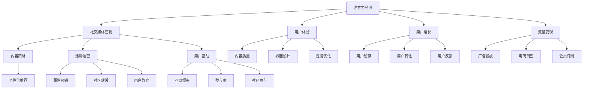

                 

# 注意力经济与社交媒体营销最佳实践：在不牺牲用户体验的情况下吸引受众

> 关键词：社交媒体营销,注意力经济,用户体验,吸引受众,用户增长,流量变现

## 1. 背景介绍

### 1.1 问题由来
随着互联网技术的快速发展和普及，社交媒体已成为人们日常生活中不可或缺的一部分。各大社交平台如Facebook、Twitter、Instagram等，用户规模庞大，使用频率高，提供了丰富的内容生产与消费场景。社交媒体营销已成为品牌推广和用户增长不可或缺的手段。

然而，用户注意力资源稀缺，社交媒体竞争激烈，如何在不牺牲用户体验的情况下，吸引受众并实现用户增长，是所有社交媒体营销者面临的共同挑战。注意力经济理论指出，获取用户注意力的过程类似于争夺稀缺资源，需要在优化用户体验和提高吸引力的同时，进行有效的内容策略和运营活动。

### 1.2 问题核心关键点
在社交媒体营销中，注意力经济的利用和用户吸引策略显得尤为关键。其主要包括以下几个方面：
1. **用户注意力稀缺性**：用户时间被海量信息和娱乐内容分流，内容吸引力和用户体验成为关键。
2. **个性化推荐**：通过个性化推荐算法，提升用户粘性和转化率。
3. **互动与参与**：提高用户互动，如点赞、评论、分享等，增加用户留存和推荐。
4. **社交网络影响力**：利用意见领袖和社交网络效应，扩大品牌曝光和传播。

## 2. 核心概念与联系

### 2.1 核心概念概述

为更好地理解注意力经济与社交媒体营销，本节将介绍几个密切相关的核心概念：

- **注意力经济**：指在信息爆炸时代，人们通过关注特定内容或产品，消耗注意力资源，形成价值交换的经济活动。注意力经济理论认为，注意力是稀缺资源，通过提供有价值的内容，可以吸引用户注意力，实现商业价值。

- **社交媒体营销**：指在社交媒体平台上进行的内容推广和用户互动活动，利用平台影响力进行品牌曝光和用户增长。社交媒体营销需要综合考虑内容策略、用户体验和用户互动等因素。

- **用户体验**：指用户在使用产品或服务过程中产生的感受和体验。良好的用户体验能提升用户满意度，促进口碑传播和忠诚度。

- **用户增长**：指在一定时间内，增加新用户数量或提升现有用户活跃度，提高市场份额和品牌影响力。用户增长策略需要综合考虑内容策略、活动运营和用户反馈等因素。

- **流量变现**：指将获取的用户流量转化为实际收益，如广告收入、会员订阅、电商销售等。流量变现策略需要考虑流量质量、广告投放和销售转化等因素。

这些核心概念之间的逻辑关系可以通过以下Mermaid流程图来展示：



这个流程图展示了几大核心概念及其之间的关系：

1. 注意力经济为社交媒体营销提供了理论基础，指出注意力的稀缺性。
2. 社交媒体营销通过内容策略、活动运营和用户互动，吸引用户注意力。
3. 用户体验是社交媒体营销的核心，通过内容质量、界面设计和性能优化提升用户满意度。
4. 用户增长依赖于用户体验的提升和活动运营的效果，用户留存和转化是关键指标。
5. 流量变现依赖于用户流量和广告投放、电商销售等策略，实现商业价值。

这些概念共同构成了社交媒体营销的基础框架，帮助营销者系统思考和设计运营策略，提升用户吸引力和品牌影响力。

## 3. 核心算法原理 & 具体操作步骤
### 3.1 算法原理概述

社交媒体营销的核心算法原理主要包括以下几个方面：

1. **个性化推荐算法**：根据用户的历史行为和偏好，推荐符合其兴趣的内容，提升用户体验和留存率。
2. **用户互动优化**：通过点赞、评论、分享等互动形式，增强用户参与感，提高用户粘性。
3. **社交网络分析**：分析用户网络结构，识别意见领袖和关键节点，利用社交网络效应提升品牌传播。

### 3.2 算法步骤详解

以下是社交媒体营销的核心算法详细步骤：

**Step 1: 数据收集与分析**
- 收集用户行为数据（如浏览、点赞、评论、分享等）和社交网络数据（如好友关系、关注者、互动频率等）。
- 对数据进行预处理和分析，提取用户特征和社交网络结构。

**Step 2: 个性化推荐系统设计**
- 选择合适的推荐算法，如协同过滤、基于内容的推荐、混合推荐等。
- 设计推荐模型输入特征，如用户历史行为、兴趣标签、社交网络关系等。
- 使用机器学习框架（如TensorFlow、PyTorch等）搭建推荐模型，训练模型参数。

**Step 3: 用户互动优化**
- 设计互动功能，如点赞、评论、分享按钮等，提高用户参与度。
- 定期推送活动和推广内容，引导用户参与互动。
- 分析互动数据，优化互动策略，提升用户留存和转化率。

**Step 4: 社交网络分析与运营**
- 利用社交网络分析工具（如Gephi、Networkx等）分析用户网络结构。
- 识别意见领袖和关键节点，制定影响力营销策略。
- 利用社交网络效应，进行话题传播和品牌推广。

**Step 5: 模型评估与优化**
- 使用A/B测试等方法评估推荐模型和互动策略的效果。
- 收集用户反馈，调整模型参数和互动内容。
- 定期更新模型，提升推荐精度和用户满意度。

### 3.3 算法优缺点

社交媒体营销的个性化推荐和互动优化算法具有以下优点：
1. 提升用户体验：个性化推荐和互动优化能显著提升用户满意度和粘性。
2. 增加用户留存：通过优化互动和推荐策略，提高用户留存率，增加用户生命周期价值。
3. 促进用户转化：推荐和互动策略能引导用户完成购买、注册等行为，提升转化率。

同时，这些算法也存在一些缺点：
1. 依赖数据质量：算法效果依赖于高质量的数据，数据偏差可能导致模型预测不准确。
2. 资源消耗大：算法需要大量的计算资源进行模型训练和优化，可能对系统性能造成影响。
3. 可能引发隐私问题：算法需要收集用户行为数据，处理不当可能导致隐私泄露。
4. 模型复杂度高：推荐和互动优化算法复杂度高，开发和维护成本较高。

### 3.4 算法应用领域

个性化推荐和互动优化算法在社交媒体营销中具有广泛的应用，例如：

1. 内容推荐：根据用户兴趣推荐相关内容，提高内容曝光率和用户粘性。
2. 社区建设：通过用户互动和话题传播，建设活跃的社交网络社区。
3. 活动营销：设计有吸引力的活动和互动形式，促进用户参与和传播。
4. 意见领袖营销：识别和利用意见领袖的影响力，提升品牌曝光和传播效果。
5. 用户教育：通过用户互动和内容推荐，引导用户了解和接受品牌信息。
6. 用户增长：通过个性化推荐和活动运营，提升用户增长率和留存率。
7. 流量变现：通过优化互动和推荐策略，提高广告点击率和销售转化率。

除了上述这些经典应用外，社交媒体营销算法还在直播互动、社群营销、广告投放等领域不断拓展，为品牌推广提供了更多的工具和手段。

## 4. 数学模型和公式 & 详细讲解 & 举例说明
### 4.1 数学模型构建

社交媒体营销的个性化推荐算法通常基于协同过滤或基于内容的推荐方法，以下以协同过滤算法为例进行详细讲解。

假设社交媒体平台上有 $U$ 个用户和 $I$ 个内容，用户对内容的评分矩阵为 $R \in \mathbb{R}^{U \times I}$，其中 $R_{ui}$ 表示用户 $u$ 对内容 $i$ 的评分。协同过滤算法的目标是预测用户对未评分的内容的评分，推荐高评分的相关内容。

协同过滤算法有两种形式：基于用户的协同过滤和基于内容的协同过滤。以基于用户的协同过滤为例，其目标函数为：

$$
\min_{\theta} \frac{1}{2} \sum_{u=1}^U \sum_{i=1}^I (R_{ui} - \sum_{j=1}^I \theta_{ij} \cdot \text{similarity}(u,j))^2
$$

其中 $\theta_{ij}$ 为相似度矩阵，$\text{similarity}(u,j)$ 表示用户 $u$ 和用户 $j$ 的相似度，$\frac{1}{2}$ 为正则化项系数。

### 4.2 公式推导过程

基于协同过滤的用户推荐模型的求解过程如下：

1. **相似度计算**：计算用户之间的相似度。常见的相似度计算方法包括余弦相似度、皮尔逊相关系数等。
2. **用户评分预测**：预测用户对未评分内容的评分，利用相似度矩阵进行加权平均。
3. **推荐结果排序**：根据预测评分进行内容排序，推荐评分最高的内容。

以余弦相似度为例，相似度计算公式为：

$$
\text{similarity}(u,j) = \frac{R_{uj} \cdot R_{uj}^T}{\sqrt{\sum_{i=1}^I R_{uj}^2} \cdot \sqrt{\sum_{i=1}^I R_{uj}^2}}
$$

用户 $u$ 对内容 $i$ 的预测评分为：

$$
\hat{R}_{ui} = \sum_{j=1}^I R_{uj} \cdot \text{similarity}(j,i)
$$

### 4.3 案例分析与讲解

假设有一个社交媒体平台，共有 1000 个用户，每个用户对 100 个内容进行了评分。利用协同过滤算法，为用户 $u$ 推荐未评分内容 $i$。

**Step 1: 数据预处理**
- 将用户评分矩阵 $R$ 标准化处理，避免数据偏置。
- 计算用户 $u$ 与其他用户 $j$ 的余弦相似度。

**Step 2: 相似度矩阵构建**
- 根据余弦相似度公式，计算用户 $u$ 和用户 $j$ 的相似度矩阵 $\Theta$。

**Step 3: 评分预测与排序**
- 利用相似度矩阵 $\Theta$，预测用户 $u$ 对未评分内容 $i$ 的评分。
- 对预测评分进行排序，推荐评分最高的内容。

通过上述步骤，社交媒体平台可以根据用户历史评分，推荐用户可能感兴趣的内容，提升用户粘性和转化率。

## 5. 项目实践：代码实例和详细解释说明
### 5.1 开发环境搭建

在进行社交媒体营销的实践前，我们需要准备好开发环境。以下是使用Python进行TensorFlow开发的环境配置流程：

1. 安装Anaconda：从官网下载并安装Anaconda，用于创建独立的Python环境。

2. 创建并激活虚拟环境：
```bash
conda create -n tf-env python=3.8 
conda activate tf-env
```

3. 安装TensorFlow：根据CUDA版本，从官网获取对应的安装命令。例如：
```bash
conda install tensorflow
```

4. 安装各类工具包：
```bash
pip install numpy pandas scikit-learn matplotlib tqdm jupyter notebook ipython
```

完成上述步骤后，即可在`tf-env`环境中开始实践。

### 5.2 源代码详细实现

这里我们以协同过滤推荐系统为例，给出使用TensorFlow实现个性化推荐的PyTorch代码实现。

首先，定义用户评分矩阵和用户特征：

```python
import numpy as np
import tensorflow as tf

# 用户评分矩阵
R = np.random.rand(1000, 100)
R[R < 0.3] = 0

# 用户特征
user_feats = np.random.rand(1000, 5)
```

然后，定义相似度计算函数和协同过滤模型：

```python
def similarity(u, j):
    # 计算余弦相似度
    return np.dot(R[u], R[j]) / (np.linalg.norm(R[u]) * np.linalg.norm(R[j]))

def collaborative_filtering(u):
    # 获取用户 $u$ 的相似度矩阵
    Theta = np.zeros((100, 100))
    for j in range(1000):
        if j != u:
            Theta += similarity(u, j)
    
    # 预测用户 $u$ 对未评分内容的评分
    scores = np.dot(R, Theta)
    
    # 对评分进行排序
    indices = scores.argsort()[::-1]
    
    # 推荐评分最高的内容
    return indices
```

最后，启动推荐系统并进行评估：

```python
# 获取用户 $u$ 的推荐内容
u = 0
indices = collaborative_filtering(u)

# 评估推荐效果
print("推荐内容：")
for i in indices[:10]:
    print(f"内容 {i}：{R[u][i]}")
```

以上代码实现了基于协同过滤的用户推荐系统，利用用户评分矩阵和余弦相似度计算推荐结果。需要注意的是，实际应用中，评分矩阵和相似度矩阵可能需要更加复杂的计算和处理。

### 5.3 代码解读与分析

让我们再详细解读一下关键代码的实现细节：

**协同过滤函数**：
- `similarity`函数：计算用户 $u$ 和用户 $j$ 的余弦相似度，利用评分矩阵计算。
- `collaborative_filtering`函数：根据余弦相似度计算用户 $u$ 的相似度矩阵 $\Theta$，利用相似度矩阵预测评分，对评分进行排序，推荐评分最高的内容。

**推荐结果**：
- 推荐内容为用户 $u$ 对未评分内容的评分进行排序，输出评分最高的前10个内容。

**评估推荐效果**：
- 通过输出推荐内容及其评分，评估推荐系统的性能。

## 6. 实际应用场景
### 6.1 社交媒体平台内容推荐

在社交媒体平台上，个性化推荐算法被广泛应用于内容推荐。平台根据用户的历史行为和兴趣，推荐符合其期望的内容，提升用户粘性和满意度。例如，Instagram根据用户的浏览记录和互动行为，推荐可能感兴趣的照片和视频。

在技术实现上，可以收集用户行为数据（如浏览、点赞、评论等），构建用户评分矩阵，设计协同过滤算法进行内容推荐。推荐结果将实时推送给用户，提升用户互动和留存率。

### 6.2 社交网络社区建设

社交网络社区的建设需要综合考虑用户互动和内容推荐。通过个性化推荐和互动优化，吸引更多用户加入和参与，提升社区活跃度。

在实践上，可以设计多种互动形式（如点赞、评论、分享等），定期推送活动和话题，引导用户参与。同时，利用社交网络分析工具，识别社区中的意见领袖，进行有针对性的内容推广和互动活动。

### 6.3 活动营销

活动营销是社交媒体营销的重要组成部分，通过设计有吸引力的活动和互动形式，吸引用户参与，提升品牌曝光和用户增长。

在实际应用中，可以设计有奖问答、线上直播、主题挑战等活动，利用社交媒体平台进行推广。通过设置互动规则，引导用户参与并分享，增加活动传播范围。

### 6.4 未来应用展望

随着社交媒体平台的发展，个性化推荐和互动优化算法将面临更多挑战和机遇：

1. **算法复杂度提升**：未来的推荐系统将更加复杂，需要处理海量数据和多维特征，对计算资源和算法优化提出更高要求。
2. **用户隐私保护**：随着用户隐私意识的增强，如何在保证用户体验的同时，保护用户数据隐私，成为重要的研究课题。
3. **跨平台协同**：社交媒体平台间的协同推荐和互动，将提升整体用户粘性和品牌影响力。
4. **多模态融合**：结合文本、图像、音频等多种数据形式，提升推荐和互动效果。
5. **实时推荐**：通过实时数据处理和算法优化，实现动态推荐，提升用户满意度。
6. **人工智能结合**：引入更多AI技术，如自然语言处理、计算机视觉等，提升推荐和互动策略的智能化水平。

这些趋势和挑战，将推动社交媒体营销算法不断进步，为用户带来更好的体验和价值。

## 7. 工具和资源推荐
### 7.1 学习资源推荐

为了帮助开发者系统掌握社交媒体营销的理论基础和实践技巧，这里推荐一些优质的学习资源：

1. 《社交媒体营销实战》系列博文：由社交媒体营销专家撰写，详细介绍内容推荐、用户互动、活动运营等核心概念和实践方法。

2. 《数据科学与社交网络》课程：斯坦福大学开设的NLP明星课程，系统讲解社交媒体数据处理和推荐算法。

3. 《社交媒体营销：理论与实践》书籍：综合介绍社交媒体营销的理论基础和案例实践，适合入门和进阶读者。

4. TensorFlow官方文档：TensorFlow的详细文档，提供丰富的推荐系统和活动运营样例代码，是上手实践的必备资料。

5. Kaggle竞赛平台：提供海量社交媒体数据集和推荐系统竞赛，帮助开发者实战训练和优化推荐模型。

通过对这些资源的学习实践，相信你一定能够快速掌握社交媒体营销的精髓，并用于解决实际的运营问题。

### 7.2 开发工具推荐

高效的开发离不开优秀的工具支持。以下是几款用于社交媒体营销开发的常用工具：

1. Jupyter Notebook：免费的交互式开发环境，支持Python代码的实时运行和展示。
2. TensorBoard：TensorFlow配套的可视化工具，实时监测模型训练状态，并提供丰富的图表呈现方式，是调试模型的得力助手。
3. Gephi：社交网络分析工具，帮助分析用户网络结构和社区建设。
4. Hadoop/Spark：大数据处理工具，处理大规模用户数据，支持分布式计算。
5. Kibana：数据可视化工具，实时监测平台流量和用户行为，帮助制定运营策略。

合理利用这些工具，可以显著提升社交媒体营销的开发效率，加快创新迭代的步伐。

### 7.3 相关论文推荐

社交媒体营销算法的研究源于学界的持续研究。以下是几篇奠基性的相关论文，推荐阅读：

1. "Collaborative Filtering for Implicit Feedback Datasets"：提出协同过滤算法的基本思想，解决隐式反馈数据下的推荐问题。
2. "A Systematic Literature Review on Multi-faceted Recommendation"：综述多维推荐系统的研究现状，提供综合性的解决方案。
3. "Social Recommendation Algorithms"：介绍社交网络推荐算法，利用社交网络效应提升推荐效果。
4. "Event-based Recommendation System: A Survey"：综述事件驱动推荐系统的研究，提供实时推荐解决方案。
5. "Real-time Recommendation System with Deep Learning"：引入深度学习技术，提升推荐系统的实时性和智能化水平。

这些论文代表了大语言模型微调技术的发展脉络。通过学习这些前沿成果，可以帮助研究者把握学科前进方向，激发更多的创新灵感。

## 8. 总结：未来发展趋势与挑战
### 8.1 总结

本文对社交媒体营销的个性化推荐和互动优化算法进行了全面系统的介绍。首先阐述了社交媒体营销的背景和重要意义，明确了注意力经济和用户增长的关键点。其次，从原理到实践，详细讲解了推荐算法的数学原理和关键步骤，给出了推荐任务开发的完整代码实例。同时，本文还广泛探讨了推荐算法在内容推荐、社区建设、活动营销等诸多领域的应用前景，展示了推荐范式的巨大潜力。此外，本文精选了推荐技术的各类学习资源，力求为读者提供全方位的技术指引。

通过本文的系统梳理，可以看到，基于社交媒体平台的内容推荐和互动优化算法，已经广泛应用于各大社交媒体平台，为用户提供了高质量的体验和丰富的互动内容。未来，伴随算法和技术的不断进步，社交媒体营销将面临更多挑战和机遇，如跨平台协同、用户隐私保护等。

### 8.2 未来发展趋势

展望未来，社交媒体营销推荐算法将呈现以下几个发展趋势：

1. **多模态推荐**：结合文本、图像、音频等多种数据形式，提升推荐和互动效果。
2. **实时推荐**：通过实时数据处理和算法优化，实现动态推荐，提升用户满意度。
3. **跨平台协同**：社交媒体平台间的协同推荐和互动，将提升整体用户粘性和品牌影响力。
4. **深度学习结合**：引入深度学习技术，提升推荐系统的智能化水平。
5. **用户隐私保护**：在保证用户体验的同时，保护用户数据隐私，满足合规要求。
6. **低延迟推荐**：通过分布式计算和算法优化，提升推荐速度，提升用户互动体验。
7. **融合AI技术**：引入更多AI技术，如自然语言处理、计算机视觉等，提升推荐和互动策略的智能化水平。

这些趋势凸显了社交媒体营销推荐算法的广阔前景。这些方向的探索发展，必将进一步提升社交媒体平台的推荐和互动效果，为用户带来更好的体验和价值。

### 8.3 面临的挑战

尽管社交媒体营销推荐算法已经取得了瞩目成就，但在迈向更加智能化、普适化应用的过程中，它仍面临着诸多挑战：

1. **数据质量问题**：推荐算法依赖于高质量的数据，数据偏差可能导致模型预测不准确。
2. **计算资源消耗**：算法需要大量的计算资源进行模型训练和优化，可能对系统性能造成影响。
3. **用户隐私保护**：算法需要收集用户行为数据，处理不当可能导致隐私泄露。
4. **推荐多样性**：模型容易陷入推荐同质化，缺乏个性化推荐。
5. **冷启动问题**：新用户的推荐效果较差，缺乏足够数据支持。

### 8.4 研究展望

面对社交媒体营销推荐算法所面临的种种挑战，未来的研究需要在以下几个方面寻求新的突破：

1. **数据质量优化**：采用更加有效的数据清洗和预处理方法，提升数据质量。
2. **低延迟推荐**：通过分布式计算和算法优化，实现低延迟推荐，提升用户互动体验。
3. **跨平台协同**：利用社交网络效应，进行跨平台协同推荐和互动。
4. **深度学习结合**：引入深度学习技术，提升推荐系统的智能化水平。
5. **用户隐私保护**：设计隐私保护算法，满足用户隐私需求。
6. **推荐多样性**：引入多样性控制算法，提升推荐策略的多样性。
7. **冷启动问题**：采用推荐策略和初始化技术，解决冷启动问题，提升新用户推荐效果。

这些研究方向的探索，必将引领社交媒体营销推荐算法迈向更高的台阶，为社交媒体平台带来更好的用户体验和商业价值。总之，社交媒体营销推荐算法需要在数据质量、计算资源、用户隐私和推荐策略等多方面进行全面优化，才能更好地满足用户需求，提升品牌影响力。

## 9. 附录：常见问题与解答

**Q1：如何提升推荐系统的多样性？**

A: 推荐系统的多样性可以通过以下几种方式提升：
1. **多维特征融合**：除了用户历史行为，还可以加入更多特征，如时间、地点、设备等，增加推荐维度。
2. **多样性控制算法**：设计多样性控制算法，限制推荐内容类型和数量。
3. **多臂老虎机算法**：引入多臂老虎机算法，随机选择不同内容，增加多样性。

**Q2：如何选择合适的事件驱动推荐系统？**

A: 选择合适的事件驱动推荐系统，需要考虑以下因素：
1. **实时性要求**：选择实时性高的推荐系统，如TensorFlow推荐引擎，支持流数据处理。
2. **数据处理能力**：选择数据处理能力强的推荐系统，如Hadoop/Spark，支持大规模数据处理。
3. **算法效果**：选择算法效果好的推荐系统，如协同过滤、基于内容的推荐等。

**Q3：如何在保证用户体验的同时，保护用户隐私？**

A: 在保护用户隐私的同时，保证用户体验，可以采用以下几种策略：
1. **差分隐私**：使用差分隐私技术，添加噪声，保护用户隐私。
2. **数据匿名化**：对用户数据进行匿名化处理，防止数据泄露。
3. **最小化数据收集**：仅收集必要的数据，避免过度收集。
4. **用户授权**：让用户授权，明确数据使用范围和目的。

**Q4：如何优化推荐系统的计算资源消耗？**

A: 优化推荐系统的计算资源消耗，可以采用以下几种策略：
1. **模型压缩**：使用模型压缩技术，减小模型大小，降低计算资源消耗。
2. **分布式计算**：利用分布式计算框架，如Hadoop/Spark，加速推荐过程。
3. **硬件加速**：利用GPU、TPU等硬件加速设备，提升计算速度。
4. **算法优化**：优化推荐算法，降低计算复杂度，减少计算资源消耗。

**Q5：如何在社交媒体平台中实现跨平台协同？**

A: 在社交媒体平台中实现跨平台协同，可以采用以下几种策略：
1. **用户网络分析**：利用社交网络分析工具，识别用户网络结构和关键节点。
2. **协同推荐算法**：设计协同推荐算法，利用用户网络效应提升推荐效果。
3. **数据共享机制**：建立数据共享机制，实现平台间数据互通。
4. **用户迁移策略**：设计用户迁移策略，引导用户跨平台互动和推荐。

这些策略可以帮助社交媒体平台实现跨平台协同，提升整体用户粘性和品牌影响力。

---

作者：禅与计算机程序设计艺术 / Zen and the Art of Computer Programming

