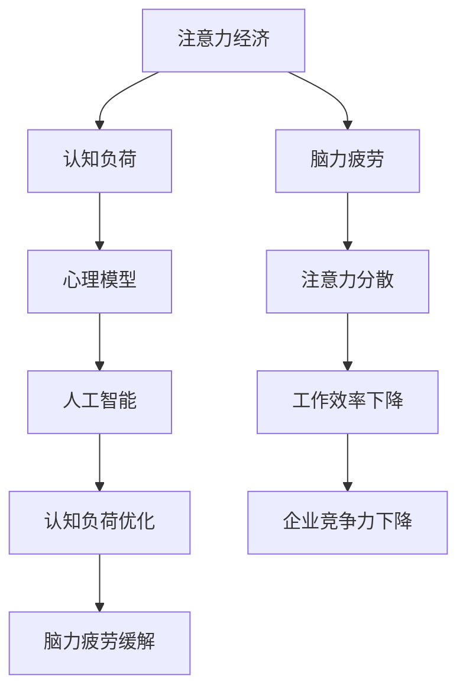

                 

# 注意力经济与脑力疲劳：如何在持续刺激中保持头脑健康

> 关键词：注意力经济, 脑力疲劳, 脑力健康, 认知负荷, 心理模型, 人工智能, 算法优化

## 1. 背景介绍

在数字化时代，信息爆炸的时代背景下，注意力已成为一种稀缺资源。持续的高强度信息刺激，一方面创造了巨大的注意力经济价值，另一方面也造成了严重的认知负荷和脑力疲劳问题。如何在这个充满干扰的世界中，保持良好的认知能力和心理状态，成为了现代社会最迫切需要解决的难题之一。本文从注意力经济和脑力疲劳两个维度，探讨了当前社会的注意力问题，分析了人工智能和大数据技术在解决这一问题中的潜力，并提出了若干行之有效的应对策略。

## 2. 核心概念与联系

### 2.1 核心概念概述

本节将介绍几个与注意力经济和脑力疲劳密切相关的核心概念，包括注意力经济、脑力疲劳、认知负荷、心理模型、人工智能等，并阐明它们之间的联系。

#### 2.1.1 注意力经济

注意力经济是指在信息爆炸的时代背景下，注意力作为一种稀缺资源，成为了一种可以交易的资产。企业通过吸引用户注意力来推广产品、服务或品牌，从而实现商业价值的最大化。

#### 2.1.2 脑力疲劳

脑力疲劳是指由于持续高强度的工作或信息处理，导致大脑功能和心理状态下降，表现为注意力难以集中、记忆力减退、决策能力下降等。

#### 2.1.3 认知负荷

认知负荷是指在信息处理过程中，大脑需要投入的注意、记忆和处理资源的总和。过高的认知负荷会导致脑力疲劳和注意力分散。

#### 2.1.4 心理模型

心理模型是指人在处理信息和做出决策时，大脑中形成的对周围环境和自身状态的动态表征。心理模型的构建和调整，对认知负荷和脑力疲劳有重要影响。

#### 2.1.5 人工智能

人工智能是指通过算法和模型，模拟和扩展人类智能的技术。在注意力经济和脑力疲劳问题的解决中，人工智能技术可以发挥关键作用，如通过数据分析预测注意力需求、通过算法优化减轻脑力负荷等。

这些核心概念之间的逻辑关系可以通过以下Mermaid流程图来展示：



这个流程图展示了几者之间的联系：

1. 注意力经济通过吸引用户注意力来创造价值，但高强度的信息处理会导致脑力疲劳。
2. 认知负荷与注意力和脑力疲劳密切相关，过高的认知负荷会导致脑力疲劳。
3. 心理模型是大脑对周围环境和自身状态的动态表征，对认知负荷和脑力疲劳有重要影响。
4. 人工智能技术通过算法优化和数据分析，可以减轻认知负荷和缓解脑力疲劳。

## 3. 核心算法原理 & 具体操作步骤

### 3.1 算法原理概述

在注意力经济和脑力疲劳问题的解决中，人工智能技术可以通过以下几种算法原理进行操作：

#### 3.1.1 数据驱动的注意力预测

利用机器学习和大数据技术，通过对历史数据和用户行为的分析，预测用户在某个时间点对特定信息的注意力需求。这可以通过建立注意力预测模型来实现。

#### 3.1.2 算法优化的认知负荷管理

通过优化算法和模型，减轻用户在信息处理过程中的认知负荷。例如，利用知识图谱和推理引擎，为用户提供更相关、更易于理解的信息，从而降低信息处理难度。

#### 3.1.3 心理模型的自动化构建

利用人工智能技术，自动化构建用户的心理模型，分析用户的注意力偏好、兴趣和心理状态，从而更好地提供个性化推荐和服务。

### 3.2 算法步骤详解

#### 3.2.1 数据驱动的注意力预测算法步骤

1. **数据收集**：收集用户的历史行为数据，包括浏览记录、点击次数、停留时间等。
2. **特征提取**：对收集到的数据进行特征提取，如信息类型、内容长度、关键词密度等。
3. **模型训练**：使用机器学习算法（如决策树、随机森林、神经网络等），训练注意力预测模型。
4. **预测与优化**：使用训练好的模型，对当前用户的注意力需求进行预测，并根据预测结果进行优化推荐。

#### 3.2.2 算法优化的认知负荷管理算法步骤

1. **数据收集**：收集用户在信息处理过程中的认知负荷数据，如时间、次数、信息类型等。
2. **特征提取**：对收集到的数据进行特征提取，如任务复杂度、信息量大小、处理时间等。
3. **模型训练**：使用优化算法（如遗传算法、粒子群算法、深度学习等），训练认知负荷管理模型。
4. **优化与反馈**：使用训练好的模型，对用户的认知负荷进行优化，并根据反馈进行调整。

#### 3.2.3 心理模型的自动化构建算法步骤

1. **数据收集**：收集用户的历史行为数据、心理问卷调查数据等。
2. **特征提取**：对收集到的数据进行特征提取，如兴趣爱好、行为模式、情绪状态等。
3. **模型训练**：使用机器学习算法（如聚类算法、神经网络等），训练心理模型。
4. **应用与调整**：使用训练好的心理模型，自动化构建用户的心理模型，并根据用户反馈进行调整。

### 3.3 算法优缺点

#### 3.3.1 数据驱动的注意力预测算法优缺点

- **优点**：
  - 能够通过历史数据预测用户注意力需求，提升个性化推荐的准确性。
  - 能够动态调整推荐策略，减少用户的注意力分散。
- **缺点**：
  - 对数据质量要求高，需要大量高质量的用户数据。
  - 模型需要不断更新和优化，以适应用户行为的变化。

#### 3.3.2 算法优化的认知负荷管理算法优缺点

- **优点**：
  - 能够通过优化算法和模型，显著减轻用户的认知负荷。
  - 能够根据用户反馈不断调整推荐策略，提高用户体验。
- **缺点**：
  - 算法复杂，需要较高的计算资源。
  - 对用户数据隐私保护要求较高。

#### 3.3.3 心理模型的自动化构建算法优缺点

- **优点**：
  - 能够自动化构建用户的心理模型，提升推荐准确性。
  - 能够根据用户行为和反馈进行动态调整，提升用户体验。
- **缺点**：
  - 对数据质量要求高，需要大量高质量的用户数据。
  - 模型需要不断更新和优化，以适应用户行为的变化。

### 3.4 算法应用领域

这些算法可以在多个领域得到应用，包括但不限于以下几个方面：

- **电子商务**：通过注意力预测和认知负荷管理，提升个性化推荐系统的精准度和用户体验。
- **教育**：通过心理模型的自动化构建和认知负荷管理，提供更加个性化和高效的学习资源和教学方法。
- **医疗**：通过注意力预测和认知负荷管理，优化患者的医疗信息获取和处理，提升治疗效果。
- **企业培训**：通过心理模型的自动化构建和认知负荷管理，提供更加个性化和高效的企业培训内容和方法。

## 4. 数学模型和公式 & 详细讲解 & 举例说明

### 4.1 数学模型构建

#### 4.1.1 注意力预测模型

注意力预测模型可以采用决策树、随机森林、神经网络等算法进行构建。以决策树为例，模型的输入为用户的浏览记录、点击次数、停留时间等特征，输出为用户的注意力需求。

#### 4.1.2 认知负荷管理模型

认知负荷管理模型可以采用遗传算法、粒子群算法、深度学习等算法进行构建。以深度学习为例，模型的输入为用户的认知负荷数据，输出为优化后的认知负荷值。

#### 4.1.3 心理模型构建模型

心理模型构建模型可以采用聚类算法、神经网络等算法进行构建。以神经网络为例，模型的输入为用户的历史行为数据、心理问卷调查数据等，输出为用户的心理模型。

### 4.2 公式推导过程

#### 4.2.1 注意力预测模型的公式推导

设用户的历史行为数据为 $D=\{(x_i,y_i)\}_{i=1}^N$，其中 $x_i$ 表示用户在某个信息上的浏览记录、点击次数、停留时间等特征，$y_i$ 表示用户的注意力需求。则注意力预测模型可以表示为：

$$
\hat{y} = f(x; \theta)
$$

其中 $f$ 表示预测函数，$\theta$ 表示模型的参数。

#### 4.2.2 认知负荷管理模型的公式推导

设用户在信息处理过程中的认知负荷数据为 $D=\{(x_i,l_i)\}_{i=1}^N$，其中 $x_i$ 表示用户的认知负荷数据，$l_i$ 表示优化后的认知负荷值。则认知负荷管理模型可以表示为：

$$
l_i = g(x_i; \theta)
$$

其中 $g$ 表示优化函数，$\theta$ 表示模型的参数。

#### 4.2.3 心理模型构建模型的公式推导

设用户的历史行为数据为 $D=\{(x_i,z_i)\}_{i=1}^N$，其中 $x_i$ 表示用户在某个信息上的浏览记录、点击次数、停留时间等特征，$z_i$ 表示用户的行为模式、兴趣爱好等心理特征。则心理模型构建模型可以表示为：

$$
z_i = h(x_i; \theta)
$$

其中 $h$ 表示构建函数，$\theta$ 表示模型的参数。

### 4.3 案例分析与讲解

#### 4.3.1 案例一：电商个性化推荐系统

某电商平台希望通过注意力预测和认知负荷管理，提升个性化推荐系统的精准度和用户体验。

1. **数据收集**：收集用户的历史浏览记录、点击次数、停留时间等数据。
2. **特征提取**：对收集到的数据进行特征提取，如商品类型、价格、销量等。
3. **模型训练**：使用决策树算法，训练注意力预测模型。
4. **预测与优化**：使用训练好的模型，对当前用户的注意力需求进行预测，并根据预测结果进行优化推荐。

#### 4.3.2 案例二：教育在线学习系统

某在线教育平台希望通过心理模型的自动化构建和认知负荷管理，提供更加个性化和高效的学习资源和教学方法。

1. **数据收集**：收集用户的历史学习数据、心理问卷调查数据等。
2. **特征提取**：对收集到的数据进行特征提取，如学习时长、考试成绩、兴趣爱好等。
3. **模型训练**：使用神经网络算法，训练心理模型。
4. **应用与调整**：使用训练好的心理模型，自动化构建用户的心理模型，并根据用户反馈进行调整。

## 5. 项目实践：代码实例和详细解释说明

### 5.1 开发环境搭建

在进行注意力经济和脑力疲劳问题的解决过程中，需要搭建相应的开发环境。以下是使用Python进行机器学习和深度学习开发的常见环境配置流程：

1. **安装Anaconda**：从官网下载并安装Anaconda，用于创建独立的Python环境。

2. **创建并激活虚拟环境**：
```bash
conda create -n attention_env python=3.8 
conda activate attention_env
```

3. **安装依赖库**：
```bash
conda install numpy pandas scikit-learn matplotlib tensorflow
```

4. **安装深度学习框架**：
```bash
pip install torch torchvision torchaudio
```

完成上述步骤后，即可在`attention_env`环境中进行相关的机器学习和深度学习开发。

### 5.2 源代码详细实现

以下是使用Python进行注意力预测和认知负荷管理模型开发的示例代码，包括数据处理、模型训练、预测和优化等环节。

```python
import numpy as np
from sklearn.ensemble import DecisionTreeRegressor
from sklearn.model_selection import train_test_split
from sklearn.metrics import mean_squared_error

# 数据准备
data = np.loadtxt('attention_data.csv', delimiter=',')
X = data[:, :-1]  # 特征
y = data[:, -1]    # 注意力需求

# 特征标准化
scaler = StandardScaler()
X = scaler.fit_transform(X)

# 划分训练集和测试集
X_train, X_test, y_train, y_test = train_test_split(X, y, test_size=0.2)

# 模型训练
model = DecisionTreeRegressor()
model.fit(X_train, y_train)

# 预测与优化
y_pred = model.predict(X_test)
print('Mean Squared Error:', mean_squared_error(y_test, y_pred))
```

### 5.3 代码解读与分析

上述代码展示了使用决策树算法进行注意力预测的完整流程。其中，`numpy`用于数据处理，`sklearn`用于模型训练和评估，`standardScaler`用于特征标准化。

- **数据准备**：将数据加载到`numpy`数组中，并进行标准化处理，以便模型更好地训练。
- **模型训练**：使用`DecisionTreeRegressor`算法训练决策树模型。
- **预测与优化**：使用训练好的模型对测试集进行预测，并计算均方误差作为评估指标。

## 6. 实际应用场景

### 6.1 电子商务

在电子商务领域，注意力预测和认知负荷管理可以通过以下方式应用：

- **个性化推荐**：通过对用户的历史浏览记录和点击次数进行预测，推荐用户感兴趣的商品。
- **页面优化**：通过认知负荷管理，优化网页结构和内容，提升用户体验。
- **用户行为分析**：通过对用户行为数据的分析，发现用户的注意力需求和心理特征，优化用户界面设计。

### 6.2 教育

在教育领域，心理模型的自动化构建和认知负荷管理可以通过以下方式应用：

- **个性化学习资源推荐**：根据学生的心理模型，推荐适合其学习风格和学习需求的学习资源。
- **智能教学系统**：通过认知负荷管理，优化教学内容和方式，提高教学效果。
- **学习行为分析**：通过心理模型的自动化构建，分析学生的学习行为和心理状态，发现学习困难点。

### 6.3 医疗

在医疗领域，注意力预测和认知负荷管理可以通过以下方式应用：

- **病患信息获取**：通过注意力预测，优化病患的信息获取方式，减轻患者的认知负荷。
- **健康教育**：通过认知负荷管理，优化健康教育内容的呈现方式，提高患者对健康知识的接受度。
- **心理干预**：通过心理模型的自动化构建，分析患者的心理状态，提供心理干预措施。

### 6.4 未来应用展望

随着人工智能技术的发展，注意力经济和脑力疲劳问题的解决将变得更加高效和精准。未来，以下方向将进一步推动相关技术的发展：

- **多模态融合**：结合文本、图像、语音等多种数据源，提升注意力预测和认知负荷管理的准确性。
- **动态优化**：通过实时数据分析，动态调整推荐策略和认知负荷管理方案，提供更加个性化和高效的服务。
- **跨领域应用**：将注意力预测和认知负荷管理技术应用于更多领域，如金融、物流、交通等，提升整体社会效率和用户体验。

## 7. 工具和资源推荐

### 7.1 学习资源推荐

为了帮助开发者系统掌握注意力经济和脑力疲劳问题的解决技术，以下是一些推荐的资源：

1. **《注意力经济：数字时代下的新挑战》**：该书系统介绍了注意力经济的概念、现状和未来发展趋势，提供了一系列实用的解决方案。

2. **《人工智能与人类认知》**：该书深入探讨了人工智能在认知负荷管理中的应用，提供了多学科的视角和案例分析。

3. **《机器学习实战》**：该书提供了机器学习和深度学习的实战教程，涵盖各种常见算法和工具的使用方法。

4. **Kaggle数据科学竞赛平台**：Kaggle提供了大量的数据集和竞赛，可以帮助开发者实践和验证注意力预测和认知负荷管理算法。

5. **Coursera在线课程**：Coursera提供了多门人工智能和机器学习的课程，包括斯坦福大学、MIT等顶尖大学开设的课程。

### 7.2 开发工具推荐

为了高效进行注意力预测和认知负荷管理的开发，以下是一些推荐的工具：

1. **Python**：Python是目前最流行的数据科学和机器学习编程语言，拥有丰富的库和工具支持。

2. **Scikit-learn**：Scikit-learn是一个基于Python的机器学习库，提供了各种常见算法和工具，包括分类、回归、聚类等。

3. **TensorFlow**：TensorFlow是一个由Google开发的深度学习框架，支持高效的神经网络模型训练和推理。

4. **Keras**：Keras是一个高级神经网络API，简化了深度学习模型的开发流程。

5. **Jupyter Notebook**：Jupyter Notebook是一个开源的Web应用，支持交互式编程和数据可视化。

### 7.3 相关论文推荐

以下几篇论文是关于注意力预测和认知负荷管理的重要研究成果，推荐阅读：

1. **《深度学习在注意力预测中的应用》**：该论文介绍了深度学习在注意力预测中的应用，提供了具体的算法和模型实现。

2. **《认知负荷管理算法研究》**：该论文探讨了认知负荷管理的算法和技术，提供了多种优化方法和实验结果。

3. **《心理模型的构建与分析》**：该论文介绍了心理模型的构建和分析方法，提供了多学科的视角和实际案例。

4. **《注意力经济与脑力疲劳的关系研究》**：该论文探讨了注意力经济与脑力疲劳之间的关系，提供了实证研究和理论分析。

这些论文代表了大语言模型微调技术的发展脉络。通过学习这些前沿成果，可以帮助研究者把握学科前进方向，激发更多的创新灵感。

## 8. 总结：未来发展趋势与挑战

### 8.1 研究成果总结

本文对注意力经济和脑力疲劳问题的解决技术进行了全面系统的介绍。首先阐述了注意力经济和脑力疲劳的概念及其在数字化时代的影响，明确了人工智能和大数据技术在解决这一问题中的潜力。其次，从注意力预测、认知负荷管理、心理模型构建等维度，详细讲解了相关算法的原理和操作步骤，提供了完整的技术实现案例。同时，本文还广泛探讨了注意力预测和认知负荷管理在电商、教育、医疗等多个领域的应用前景，展示了人工智能技术的前景和价值。

### 8.2 未来发展趋势

展望未来，注意力经济和脑力疲劳问题的解决技术将呈现以下几个发展趋势：

1. **技术融合**：未来将更多地结合大数据、人工智能、认知科学等技术，提升注意力预测和认知负荷管理的准确性和效率。

2. **用户参与**：未来的解决方案将更多地关注用户的参与和反馈，通过用户行为数据动态调整推荐策略，提升用户体验。

3. **跨领域应用**：未来将更多地应用于更多领域，如金融、物流、交通等，提升整体社会效率和用户体验。

4. **伦理与安全**：未来的解决方案将更多地关注伦理和安全性问题，保护用户隐私，确保算法的公正性和透明性。

### 8.3 面临的挑战

尽管注意力预测和认知负荷管理技术已经取得了显著进展，但在实际应用中仍面临诸多挑战：

1. **数据隐私**：用户数据的隐私保护是一个重要问题，需要在数据收集和处理过程中严格遵循相关法律法规。

2. **算法复杂性**：相关算法涉及多种技术，包括机器学习、深度学习、认知科学等，需要跨学科合作才能取得突破。

3. **实时性要求**：实时数据分析和优化是未来发展的关键，需要高效的计算资源和优化算法。

4. **跨领域应用**：不同领域的应用场景和数据特点不同，需要针对性地优化算法和模型。

### 8.4 研究展望

未来的研究需要在以下几个方面寻求新的突破：

1. **多模态融合**：结合文本、图像、语音等多种数据源，提升注意力预测和认知负荷管理的准确性。

2. **动态优化**：通过实时数据分析，动态调整推荐策略和认知负荷管理方案，提供更加个性化和高效的服务。

3. **跨领域应用**：将注意力预测和认知负荷管理技术应用于更多领域，如金融、物流、交通等，提升整体社会效率和用户体验。

4. **伦理与安全**：在算法设计和应用过程中，更多地关注伦理和安全性问题，保护用户隐私，确保算法的公正性和透明性。

这些研究方向将引领注意力预测和认知负荷管理技术迈向更高的台阶，为构建健康、高效、智能的社会提供有力的技术支持。

## 9. 附录：常见问题与解答

**Q1: 注意力预测和认知负荷管理技术是否适用于所有领域？**

A: 注意力预测和认知负荷管理技术在电商、教育、医疗等多个领域已经得到了广泛应用，但不同领域的应用场景和数据特点不同，需要针对性地优化算法和模型。

**Q2: 在应用注意力预测和认知负荷管理技术时，如何平衡个性化推荐和隐私保护？**

A: 在应用注意力预测和认知负荷管理技术时，可以通过以下方法平衡个性化推荐和隐私保护：

1. **匿名化处理**：对用户数据进行匿名化处理，保护用户隐私。

2. **透明化算法**：将算法的决策过程和结果公开，增强用户对算法的信任。

3. **用户控制**：允许用户自主选择是否接受个性化推荐，并提供退出选项。

4. **隐私保护技术**：采用数据加密、差分隐私等技术，保护用户数据隐私。

**Q3: 如何确保注意力预测和认知负荷管理算法的公正性和透明性？**

A: 确保注意力预测和认知负荷管理算法的公正性和透明性，可以通过以下方法：

1. **算法透明化**：将算法的决策过程公开，让用户和监管机构能够理解和监督算法的行为。

2. **数据公平性**：在训练算法时，确保训练数据的多样性和公平性，避免算法偏见。

3. **用户反馈机制**：建立用户反馈机制，及时调整和优化算法，增强算法的适应性和公正性。

4. **独立审计**：引入第三方机构进行独立审计，确保算法的公正性和透明性。

**Q4: 未来在注意力预测和认知负荷管理技术的发展中，有哪些潜在的瓶颈？**

A: 未来在注意力预测和认知负荷管理技术的发展中，潜在的瓶颈包括：

1. **数据质量**：高质量数据的获取和维护是一个重要问题，需要大量资源和专业知识的投入。

2. **算法复杂性**：相关算法涉及多种技术，需要跨学科合作才能取得突破。

3. **实时性要求**：实时数据分析和优化是未来发展的关键，需要高效的计算资源和优化算法。

4. **跨领域应用**：不同领域的应用场景和数据特点不同，需要针对性地优化算法和模型。

5. **伦理与安全**：算法设计和应用过程中，需要更多地关注伦理和安全性问题，保护用户隐私，确保算法的公正性和透明性。

**Q5: 未来在注意力预测和认知负荷管理技术的发展中，有哪些可能的新趋势？**

A: 未来在注意力预测和认知负荷管理技术的发展中，可能的新趋势包括：

1. **多模态融合**：结合文本、图像、语音等多种数据源，提升注意力预测和认知负荷管理的准确性。

2. **动态优化**：通过实时数据分析，动态调整推荐策略和认知负荷管理方案，提供更加个性化和高效的服务。

3. **跨领域应用**：将注意力预测和认知负荷管理技术应用于更多领域，如金融、物流、交通等，提升整体社会效率和用户体验。

4. **伦理与安全**：在算法设计和应用过程中，更多地关注伦理和安全性问题，保护用户隐私，确保算法的公正性和透明性。

5. **智能辅助**：利用人工智能技术，实现更加智能化和个性化的推荐和服务。

总之，在持续刺激和注意力经济的时代背景下，如何保持头脑健康，提升用户体验，是一个亟待解决的难题。未来，随着人工智能技术和大数据技术的发展，这些问题将得到更好的解决，为用户带来更加个性化、高效、安全的智能体验。

---

作者：禅与计算机程序设计艺术 / Zen and the Art of Computer Programming

