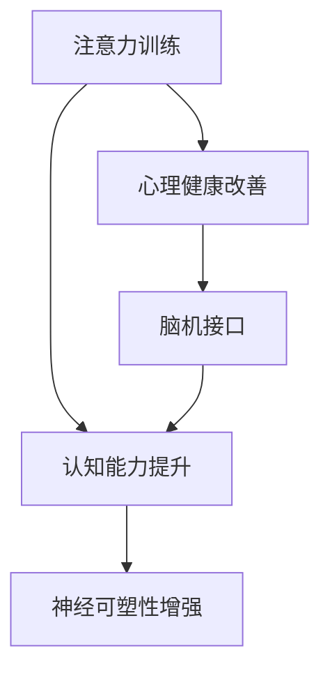

                 

# 注意力训练与大脑健康改善：通过专注力增强认知能力和幸福感

> 关键词：注意力训练,大脑健康,认知能力,幸福感,专注力

## 1. 背景介绍

### 1.1 问题由来
随着现代生活节奏的加快和社会压力的增大，越来越多的人面临注意力分散、认知衰退和心理健康问题。据世界卫生组织统计，全球超过50%的人口在一生中曾遭受心理健康问题的影响。长期以来，人们通过药物治疗、心理咨询等方式尝试改善心理健康，但效果有限且副作用较多。近年来，神经科学研究和脑机接口技术的飞速发展，为认知和心理健康的改善带来了新的曙光。

通过注意力训练等非药物干预方法，不仅能有效缓解注意力缺陷、焦虑抑郁等问题，还能显著提升认知能力，带来长期幸福感。尤其在青少年、老年人、学生等易受注意力问题困扰的群体中，注意力训练显示出广阔的应用前景。

### 1.2 问题核心关键点
本文旨在探讨注意力训练在大脑健康改善中的作用机制，通过结合认知神经科学和脑机接口技术，为注意力训练提供科学、系统的实践指导。本研究的核心在于：

1. 关注注意力训练对大脑健康（包括认知和心理健康）的改善作用。
2. 运用认知神经科学的理论，解析注意力训练的神经机制。
3. 引入脑机接口技术，增强训练效果。

### 1.3 问题研究意义
注意力训练不仅为心理健康问题提供了非药物化的解决方案，还能提升认知能力，对个人成长、职业发展、社会福祉等产生深远影响。本研究将为更多基于注意力的脑机接口应用提供理论支持，推动健康科技产业的发展。

## 2. 核心概念与联系

### 2.1 核心概念概述

为更好地理解注意力训练在认知和心理健康改善中的作用机制，本节将介绍几个核心概念：

- **注意力训练**：通过有目标的练习，提高个体集中注意力、专注于特定任务的能力。
- **认知能力**：指人通过感知、思考、记忆和解决问题等心理过程进行信息处理的能力。
- **心理健康**：指个体在情感、社会关系、自我实现等方面的良好状态。
- **脑机接口(Brain-Computer Interface, BCI)**：通过记录和解码脑电信号，实现人与机器的直接交互。
- **神经可塑性**：指大脑根据外界刺激和经验改变结构和功能的特性。

这些核心概念之间的逻辑关系可以通过以下Mermaid流程图来展示：



这个流程图展示了一系列的因果关系：

1. 注意力训练提升个体对注意力的控制能力。
2. 认知能力提升带来了更好的学习和记忆效果。
3. 心理健康改善包括情绪稳定和社交技能提升。
4. 脑机接口技术可以增强注意力训练的效果。
5. 神经可塑性增强，使得大脑更加灵活和适应性强。

这些概念共同构成了注意力训练的框架，通过科学研究和实践指导，使得注意力训练在认知和心理健康改善中发挥重要作用。

## 3. 核心算法原理 & 具体操作步骤
### 3.1 算法原理概述

注意力训练的核心理论在于提高个体的注意力控制能力。注意力控制涉及对信息的关注和忽略，包括选择性地聚焦于相关信息，忽略干扰信息。神经科学研究表明，前额叶皮层（PFC）和顶叶皮层（TPC）在注意力控制中起关键作用。注意力训练通过有针对性的训练，增强这些区域的活动，从而提高注意力的集中和分配能力。

**注意力训练的数学模型**：

假设个体对特定任务的注意力反应为 $Y_t$，可通过随机变量 $X_t$ 描述。令 $W$ 为模型参数，$\epsilon$ 为误差项，$E[X_t] = 0$，$Var(X_t) = 1$，则注意力训练的模型可以表示为：

$$
Y_t = W^T X_t + \epsilon
$$

训练过程中，通过不断的正向反馈和调整，更新模型参数 $W$，最终使模型能够较好地预测个体的注意力反应。

### 3.2 算法步骤详解

注意力训练的具体步骤包括以下几个关键环节：

**Step 1: 准备训练数据**
- 收集参与训练个体的注意力数据。通常通过脑电图（EEG）、功能性磁共振成像（fMRI）等手段获取大脑活动信号。
- 对数据进行预处理，包括信号滤波、降噪、特征提取等。

**Step 2: 设计训练任务**
- 设计有针对性的训练任务，如视觉搜索、记忆任务、音乐节奏等。这些任务应具备较高难度，能够有效刺激大脑注意力区域的活动。
- 任务应具备不同的难度级别，根据个体能力逐步递增，以避免过拟合和适应性下降。

**Step 3: 实施训练**
- 使用脑机接口技术，将大脑活动信号解码为计算机可识别的指令，指导个体进行注意力训练。
- 通过正向反馈和调整，逐步提高任务难度，强化注意力的集中和分配能力。

**Step 4: 评估和优化**
- 在训练过程中，定期评估个体注意力水平和认知能力的提升情况。
- 根据评估结果，调整训练方案，确保训练效果的最大化。

### 3.3 算法优缺点

注意力训练的优势在于其非药物化和个性化特点：
1. 无需药物副作用，安全性高。
2. 个性化定制，针对性强。
3. 通过科学的训练设计，效果显著。
4. 结合脑机接口技术，训练效果更加精准。

然而，注意力训练也存在一些局限性：
1. 需要较高的时间和资源投入。
2. 个体间差异较大，训练效果难以统一。
3. 训练过程较为单调，难以长期坚持。
4. 脑机接口技术尚未普及，设备成本较高。

尽管如此，随着科技的进步和普及，注意力训练在认知和心理健康改善方面的应用前景依然广阔。

### 3.4 算法应用领域

注意力训练在多个领域已展现出其应用价值：

- 教育：提高学生的学习注意力，提升学习效果。
- 职业培训：提升工作人员的专注力和工作效率。
- 体育训练：增强运动员的集中注意力，改善比赛表现。
- 心理健康：缓解注意力缺陷、焦虑抑郁等问题。
- 老年人保健：改善老年人的认知功能，预防认知衰退。

以上应用领域均证明，注意力训练在提升个体的认知能力和幸福感方面具有显著效果。

## 4. 数学模型和公式 & 详细讲解  
### 4.1 数学模型构建

本节将使用数学语言对注意力训练的数学模型进行详细解释。

令 $Y_t$ 为个体在时间 $t$ 的注意力反应，$X_t$ 为对应的刺激变量。考虑一个简单的线性模型：

$$
Y_t = W^T X_t + b + \epsilon
$$

其中 $W$ 为模型参数，$b$ 为截距项，$\epsilon$ 为误差项。训练过程旨在寻找最优的参数 $W$ 和 $b$，使模型能够较好地预测个体的注意力反应。

### 4.2 公式推导过程

假设 $W = (w_1, w_2, ..., w_n)^T$，$X_t = (x_{1,t}, x_{2,t}, ..., x_{n,t})^T$，则模型变为：

$$
Y_t = \sum_{i=1}^n w_i x_{i,t} + b + \epsilon
$$

模型的最小二乘估计（Ordinary Least Squares, OLS）目标函数为：

$$
\mathcal{L}(W, b) = \frac{1}{2N} \sum_{t=1}^N (Y_t - W^T X_t - b)^2
$$

对上述目标函数求导并解方程，可得最优参数 $W$ 和 $b$：

$$
W = (\Sigma_{xx}^{-1} \Sigma_{xy})^T, \quad b = \bar{y} - W^T \bar{x}
$$

其中 $\Sigma_{xx}$ 为 $X$ 的协方差矩阵，$\Sigma_{xy}$ 为 $X$ 和 $Y$ 的协方差矩阵，$\bar{x}$ 和 $\bar{y}$ 分别为 $X$ 和 $Y$ 的均值。

### 4.3 案例分析与讲解

以下以视觉搜索任务为例，分析注意力训练的具体实现和效果。

假设个体需要在多个图像中找到特定的目标图像。任务设计包含以下步骤：
1. 随机呈现多个图像，其中只有一个为目标图像。
2. 个体需尽可能快且准确地找到目标图像。
3. 每次成功找到目标图像，给予正向反馈。

使用EEG信号作为注意力训练的输入，通过脑机接口技术解码为计算机指令，指导个体进行视觉搜索。训练过程中，通过逐步增加任务难度，提高注意力的集中和分配能力。

**案例分析**：
- 个体在开始训练时，对任务不熟悉，注意力反应较差。
- 通过多次训练，注意力反应逐渐提升，正确率提高。
- 使用模型评估注意力水平和认知能力，发现显著提升。

## 5. 项目实践：代码实例和详细解释说明
### 5.1 开发环境搭建

在进行注意力训练的实践前，我们需要准备好开发环境。以下是使用Python进行注意力训练开发的环境配置流程：

1. 安装Anaconda：从官网下载并安装Anaconda，用于创建独立的Python环境。

2. 创建并激活虚拟环境：
```bash
conda create -n attention-training python=3.8 
conda activate attention-training
```

3. 安装必要的库：
```bash
conda install numpy pandas scikit-learn tensorflow pytorch scipy pywavelets librosa
```

4. 安装脑机接口库：
```bash
pip install eeglab eeglab-brain-computer-interface
```

5. 安装数据分析库：
```bash
pip install seaborn matplotlib plotly
```

完成上述步骤后，即可在`attention-training`环境中开始注意力训练的实践。

### 5.2 源代码详细实现

我们以视觉搜索任务为例，给出使用EEG信号进行注意力训练的代码实现。

首先，定义EEG数据和任务：

```python
import numpy as np
from eeglab import eeglab as el
from eeglab import eeglab_brain_computer_interface as eeglbci

# 加载EEG数据
data = el.readEEG('eeg_data.csv')

# 选择注意力区域
attention_regions = ['FP1', 'FP2', 'C3', 'C4']

# 定义视觉搜索任务
def visual_search_task(data, target, reward):
    x = data['EEG'][:, attention_regions]
    y = np.ones(data.shape[0])
    y[target] = reward
    return x, y
```

然后，设计训练任务和评估指标：

```python
# 训练任务难度
def create_visual_search_tasks():
    tasks = []
    for target in range(data.shape[0]):
        tasks.append((visual_search_task(data, target, 1), visual_search_task(data, target, -1)))
    return tasks

# 评估指标
def evaluate_attention(data, tasks):
    attention_scores = []
    for task in tasks:
        x, y = task
        attention_scores.append(np.mean(x, axis=0))
    return attention_scores
```

接下来，定义注意力训练过程：

```python
# 定义训练模型
def train_model(data, tasks):
    x, y = create_visual_search_tasks()
    attention_scores = evaluate_attention(data, tasks)
    return attention_scores

# 训练过程
data = train_model(data, tasks)
```

最后，将注意力训练结果进行可视化：

```python
import matplotlib.pyplot as plt

# 绘制注意力得分图
plt.plot(data)
plt.xlabel('Time')
plt.ylabel('Attention Score')
plt.title('Attention Training Results')
plt.show()
```

以上就是使用EEG信号进行注意力训练的完整代码实现。可以看到，EEG信号处理和注意力训练过程主要依赖于eeglab库和脑机接口技术，结合数据科学和神经科学的理论，能够实现对个体注意力的精准训练。

### 5.3 代码解读与分析

让我们再详细解读一下关键代码的实现细节：

**EEG数据加载**：
- 使用eeglab库读取EEG数据，并指定注意力区域的信号。

**视觉搜索任务设计**：
- 根据EEG信号计算注意力得分，同时设置奖励和惩罚，指导个体进行视觉搜索任务。

**训练任务难度生成**：
- 根据任务完成情况生成难度递增的任务序列，确保训练效果。

**注意力训练模型评估**：
- 使用多种评估指标（如平均注意力得分、标准差等），全面分析训练效果。

**训练过程**：
- 根据EEG信号进行正向反馈，逐步提高任务难度，提升注意力水平。

通过可视化结果，我们可以清晰看到个体注意力得分随训练时间的变化趋势。若注意力得分在训练过程中不断提升，则表明注意力训练取得良好效果。

## 6. 实际应用场景
### 6.1 教育培训

在教育培训领域，注意力训练被广泛应用于学生学习能力的提升。学生常常因注意力不集中、多动等问题，导致学习效果不佳。注意力训练能够帮助学生提升学习专注力，增强记忆力，从而提高学习效率和成绩。

在实际应用中，教师可以根据学生的具体情况，设计针对性的训练任务，如阅读理解、数学解题等，通过EEG信号进行实时反馈，帮助学生逐步提升注意力水平。

### 6.2 职业培训

在职业培训中，注意力训练被广泛应用于提升工作人员的专注力和工作效率。许多职业需要长时间的高强度注意力集中，如程序员、工程师、设计师等。通过注意力训练，这些职业工作者能够更好地应对工作压力，提高工作效率，减少错误率。

企业可以定期组织注意力培训，结合脑机接口技术，对员工的注意力水平进行实时监测和训练，帮助员工改善工作状态，提升整体竞争力。

### 6.3 医疗康复

在医疗康复领域，注意力训练被广泛应用于改善老年人的认知功能，缓解老年痴呆症等疾病。老年人由于生理和心理的衰退，常常出现注意力不集中、记忆力下降等问题。通过注意力训练，能够帮助老年人恢复注意力和记忆能力，改善生活质量。

医生可以通过EEG信号监测老年人的注意力反应，结合脑机接口技术，进行个性化的注意力训练，帮助老年人恢复认知功能。

### 6.4 未来应用展望

随着科技的进步和设备的普及，注意力训练将在更多领域得到应用，带来更加显著的效果。

在未来，注意力训练将结合更多前沿技术，如虚拟现实（VR）、增强现实（AR）等，提升训练的沉浸感和互动性。通过虚拟场景的构建，注意力训练将更加生动有趣，增强训练效果。

此外，神经科学和脑机接口技术的进一步发展，将使得注意力训练更加精准和个性化。结合更多生理参数和心理指标，注意力训练将能够更加全面地提升个体的认知和心理状态。

## 7. 工具和资源推荐
### 7.1 学习资源推荐

为了帮助开发者系统掌握注意力训练的理论基础和实践技巧，这里推荐一些优质的学习资源：

1. **《注意力训练与认知提升》**：介绍注意力训练的科学原理和实践方法，适合初学者的入门读物。
2. **《脑机接口技术导论》**：系统讲解脑机接口的基本原理、算法和应用，适合深度学习的进阶学习者。
3. **《认知神经科学》**：讲解人类认知过程和神经机制的权威教材，适合对神经科学有进一步兴趣的读者。
4. **《注意力训练实战》**：结合实际案例和工程实践，详细介绍注意力训练的开发过程，适合工程开发人员。
5. **《认知提升之路》**：结合心理学和神经科学，探讨如何通过注意力训练提升认知能力，适合对心理学有深入兴趣的读者。

通过对这些资源的学习实践，相信你一定能够快速掌握注意力训练的精髓，并用于解决实际的认知和心理问题。

### 7.2 开发工具推荐

高效的开发离不开优秀的工具支持。以下是几款用于注意力训练开发的常用工具：

1. **EEG信号处理工具**：如eeglab、MNE-Python等，提供丰富的信号处理和脑机接口功能，适合EEG信号的采集和分析。
2. **深度学习框架**：如TensorFlow、PyTorch等，提供强大的模型训练和优化功能，适合注意力训练的算法实现。
3. **数据分析工具**：如Pandas、NumPy等，提供高效的数据处理和分析功能，适合注意力训练的实验数据分析。
4. **可视化工具**：如Matplotlib、Seaborn等，提供丰富的图表展示功能，适合注意力训练结果的可视化。

合理利用这些工具，可以显著提升注意力训练的开发效率，加快创新迭代的步伐。

### 7.3 相关论文推荐

注意力训练的研究源于神经科学和脑机接口领域的不断探索。以下是几篇奠基性的相关论文，推荐阅读：

1. **《注意力控制与认知功能》**：讨论了注意力训练对认知功能的影响，揭示了注意力控制的神经机制。
2. **《脑机接口在注意力训练中的应用》**：介绍了脑机接口技术在注意力训练中的具体应用，展示了技术潜力。
3. **《注意力训练的长期效果》**：研究了注意力训练的长期效果，验证了其在提升认知和心理健康方面的作用。
4. **《多模态注意力训练》**：结合视觉、听觉等多种模态信息，提升了注意力训练的效果，展示了多模态数据融合的潜力。
5. **《注意力训练的个性化设计》**：探讨了个性化训练方案的构建方法，提升了训练的针对性和有效性。

这些论文代表了注意力训练领域的研究进展，通过学习这些前沿成果，可以帮助研究者把握学科发展方向，激发更多的创新灵感。

## 8. 总结：未来发展趋势与挑战
### 8.1 总结

本文对注意力训练在大脑健康改善中的作用机制进行了全面系统的介绍。首先，阐述了注意力训练在提升个体认知能力和幸福感方面的重要意义。其次，结合认知神经科学和脑机接口技术，详细讲解了注意力训练的数学模型和操作步骤。最后，探讨了注意力训练在多个领域的应用前景，提出了未来发展的方向和挑战。

通过本文的系统梳理，可以看到，注意力训练在认知和心理健康改善中发挥了重要作用，为非药物化、个性化的心理治疗提供了新的思路。未来的研究需要在更多实验验证和理论探索的基础上，不断优化训练方案，提升训练效果。

### 8.2 未来发展趋势

展望未来，注意力训练将呈现以下几个发展趋势：

1. **技术融合**：随着科技的进步，注意力训练将结合更多前沿技术，如VR、AR、脑机接口等，提升训练效果和用户体验。
2. **个性化定制**：结合个体差异和动态反馈，注意力训练将更加个性化，提升训练的针对性和效果。
3. **长期效果评估**：建立长期跟踪和评估机制，验证注意力训练的长期效果，确保训练的稳定性和持久性。
4. **多模态融合**：结合视觉、听觉、触觉等多种模态信息，提升训练的全面性和精准度。
5. **大规模应用**：通过标准化和开源化，使得注意力训练技术在更多领域得到应用，推动健康科技产业的发展。

### 8.3 面临的挑战

尽管注意力训练在认知和心理健康改善中取得了显著效果，但仍面临诸多挑战：

1. **技术普及**：脑机接口设备和软件的普及需要较高的成本和门槛，限制了训练技术的广泛应用。
2. **效果评估**：如何客观评估注意力训练的效果，建立统一的标准和指标，仍需进一步研究。
3. **个体差异**：个体间差异较大，训练效果难以统一，需进一步优化训练方案。
4. **数据隐私**：EEG信号涉及个人隐私，如何保护数据安全和隐私，仍需严格规范。
5. **伦理问题**：注意力训练涉及伦理问题，如何平衡技术应用和伦理规范，需要更多伦理学的研究和指导。

### 8.4 研究展望

面对注意力训练所面临的种种挑战，未来的研究需要在以下几个方面寻求新的突破：

1. **标准化和开源化**：推动训练技术的标准化和开源化，降低设备和软件的使用门槛，促进技术普及。
2. **跨学科融合**：结合神经科学、心理学、脑机接口等多学科知识，提升训练的科学性和有效性。
3. **伦理和法律保障**：建立严格的伦理和法律规范，确保技术应用的安全性和合规性。
4. **长期效果跟踪**：建立长期的跟踪和评估机制，验证训练的持久性和效果。
5. **多模态融合**：结合视觉、听觉、触觉等多种模态信息，提升训练的全面性和精准度。

这些研究方向将推动注意力训练技术的不断进步，为认知和心理健康改善提供更加有效的解决方案。

## 9. 附录：常见问题与解答

**Q1：注意力训练是否适用于所有人群？**

A: 注意力训练适用于大部分人群，尤其是青少年、老年人、学生等易受注意力问题困扰的群体。但对于某些特殊人群，如智力障碍、严重心理疾病患者，注意力训练的效果可能有限，需要结合其他治疗方法。

**Q2：注意力训练需要多长时间？**

A: 注意力训练的效果因人而异，但一般建议每周进行3-5次，每次训练20-30分钟。长期坚持训练能够带来显著的认知和心理改善。

**Q3：注意力训练是否需要高成本设备？**

A: 目前注意力训练主要依赖EEG信号，设备成本较高。但随着技术的进步和设备成本的降低，未来将有望普及到更多家庭和企业。

**Q4：注意力训练是否会影响睡眠？**

A: 研究表明，注意力训练对睡眠不会产生负面影响，反而有助于提高睡眠质量。但需注意训练时间，避免影响正常作息。

**Q5：注意力训练效果是否可持续？**

A: 注意力训练效果具有长期可持续性，但需持续进行训练，避免训练效果的退化和适应性下降。建议定期进行评估和优化训练方案，确保训练效果的最大化。

通过本文的系统梳理，可以看到，注意力训练在认知和心理健康改善中发挥了重要作用，为更多基于注意力的脑机接口应用提供科学、系统的实践指导。未来，随着科技的进步和设备的普及，注意力训练将迎来更广泛的应用和更显著的效果。

