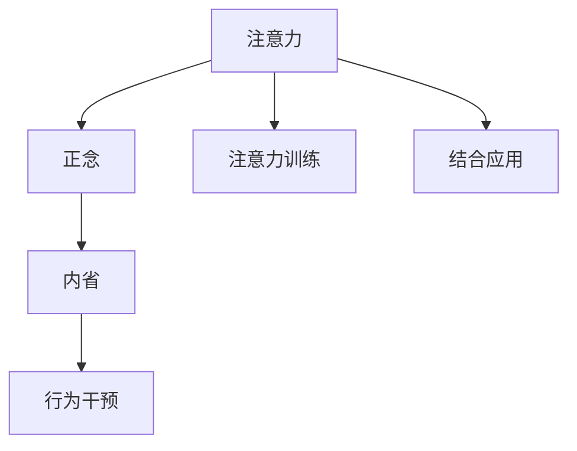

                 

## 1. 背景介绍

### 1.1 问题由来

在快速发展的数字时代，注意力已成为我们应对信息过载和压力的重要资源。无论是工作还是生活，专注力和注意力的提升，都能显著提高效率和生产力。然而，现代人的注意力往往被各种干扰因素（如社交媒体、电子邮件、多任务处理）所分散，导致任务完成时间延长，质量下降。

为此，心理学、神经科学和人工智能领域的专家们开始探索利用技术手段增强注意力的可能性。注意力训练技术通过模拟人类认知过程，帮助个体在复杂任务中更好地集中注意力，提高工作效率和决策能力。正念冥想作为一种古老的心理疗法，通过内省觉察和放松训练，提升个体对当下的感知和专注，减少焦虑和压力。

### 1.2 问题核心关键点

注意力训练与正念实践的结合，为提升专注力提供了全新的视角和方法。这一方法的核心理念是通过持续的内省练习和行为干预，逐步改变大脑对注意力的分配方式，从而增强注意力的持续时间和控制能力。具体而言，包括以下几个关键点：

- 注意力训练：通过专注力提升练习，帮助个体掌握注意力的调节技巧，提高在复杂任务中的集中和持久能力。
- 正念冥想：通过内省和觉察的练习，使个体学会观察和接纳当前的感知，减少心理压力和情绪波动，提升对注意力的控制。
- 结合应用：将注意力训练和正念冥想有机结合，通过持续的练习和反馈，使个体能够随时随地应用这些技术，提升日常生活中的专注力和效率。

### 1.3 问题研究意义

提高个体注意力的技术手段，不仅有助于提升工作和生活质量，还能促进个人心理健康和情绪稳定。特别是在高压力、高信息量的工作环境中，注意力训练与正念实践能够帮助个体更好地应对挑战，提高决策能力和创新思维。

同时，这种技术手段的普及和应用，将有助于推动人工智能在教育、医疗、心理治疗等领域的创新和应用，为技术发展带来新的方向和机遇。

## 2. 核心概念与联系

### 2.1 核心概念概述

为更好地理解注意力训练与正念实践的结合，本节将介绍几个密切相关的核心概念：

- **注意力(Attention)**：指个体对当前环境的感知和集中，是认知过程的重要组成部分。注意力训练旨在提升个体在复杂任务中的集中和持久能力。
- **正念(Mindfulness)**：源自佛教冥想，指通过内省和觉察，培养对当前感知和情绪的接纳，减少焦虑和压力，提升心理健康。
- **内省(Reflective Practice)**：通过持续的自我反思和评价，帮助个体认识和改进自身行为，提升自我认知和情绪调节能力。
- **行为干预(Behavioral Intervention)**：通过设定目标和反馈机制，引导个体在实际生活中应用注意力训练和正念冥想的原则，实现长期效果。

这些概念之间的逻辑关系可以通过以下Mermaid流程图来展示：



这个流程图展示了他几个核心概念及其之间的关系：

1. 注意力和正念共同构成了个体认知和情绪的基础。
2. 内省是认识和改进自身行为的重要工具。
3. 行为干预通过设定目标和反馈机制，使注意力训练和正念冥想的技巧在实际生活中得以应用。
4. 注意力训练与正念冥想的结合，通过持续的练习和反馈，使个体能够随时随地应用这些技术，提升专注力和效率。

## 3. 核心算法原理 & 具体操作步骤

### 3.1 算法原理概述

注意力训练与正念实践的结合，其核心思想是通过持续的内省和行为干预，逐步提升个体在复杂任务中的集中和持久能力，同时通过正念冥想减少心理压力和情绪波动，提升心理健康。这一过程可以通过以下步骤实现：

1. **内省觉察**：通过持续的内省练习，帮助个体认识和理解自身的注意力模式和情感状态，识别出影响注意力的主要因素。
2. **行为干预**：设定明确的行为目标和反馈机制，引导个体在日常生活中应用注意力训练和正念冥想的技巧，逐步改变注意力模式。
3. **结合应用**：将注意力训练和正念冥想有机结合，通过持续的练习和反馈，使个体能够随时随地应用这些技术，提升专注力和效率。

### 3.2 算法步骤详解

#### 3.2.1 内省觉察

内省觉察是注意力训练与正念实践结合的第一步。具体步骤如下：

1. **设定内省目标**：明确内省的焦点，如注意力模式、情绪状态、心理压力等。
2. **进行内省练习**：使用日记、反思表等工具，记录每天的内省和觉察体验，识别出影响注意力的主要因素。
3. **分析内省结果**：通过回顾和分析内省日记，识别出注意力和情绪变化的模式和规律，找出改进的切入点。

#### 3.2.2 行为干预

行为干预是内省觉察结果的具体应用，旨在通过设定目标和反馈机制，逐步改变个体的注意力模式和行为习惯。具体步骤如下：

1. **设定行为目标**：根据内省结果，设定具体的行为目标，如减少多任务处理时间、增加专注力任务时间等。
2. **制定行为计划**：将行为目标转化为具体的行动计划，如每天专注工作2小时，中间不做任何分心的事情。
3. **实施行为计划**：严格按照行为计划执行，并记录每天的行为和效果。
4. **反馈和调整**：根据每日记录和效果评估，调整行为计划和内省目标，确保持续改进。

#### 3.2.3 结合应用

结合应用是将注意力训练和正念冥想有机结合，提升个体在日常生活中的专注力和效率。具体步骤如下：

1. **结合技术**：将注意力训练和正念冥想的技巧融入日常工作和生活中，如在会议前进行正念冥想，在任务前进行注意力提升练习。
2. **持续练习**：通过设定固定的练习时间和频率，保持对注意力训练和正念冥想的持续关注和应用。
3. **综合反馈**：结合内省和行为干预的结果，持续调整和优化注意力训练和正念冥想的应用策略，提升效果。

### 3.3 算法优缺点

注意力训练与正念实践的结合，具有以下优点：

1. **提升专注力**：通过持续的内省练习和行为干预，逐步提升个体在复杂任务中的集中和持久能力，减少分心和干扰。
2. **降低心理压力**：通过正念冥想减少心理压力和情绪波动，提升心理健康和情绪稳定性。
3. **提高工作效率**：通过优化注意力模式和行为习惯，提高工作和生活中的效率和生产力。

同时，这一方法也存在一些局限性：

1. **依赖自驱力**：内省和行为干预的效果依赖个体的自我驱动，对部分人而言，可能需要较长时间才能看到明显效果。
2. **效果难以量化**：注意力和情绪的变化难以通过具体的数值衡量，需要长期观察和积累才能评估效果。
3. **个性化难度高**：不同个体的注意力模式和情绪状态差异较大，需要个性化定制内省和行为干预方案。

### 3.4 算法应用领域

注意力训练与正念实践的结合，在多个领域都有广泛的应用：

1. **职场效率**：在职场环境中，通过提升注意力和减少分心，帮助员工提高工作效率，减少错误和遗漏。
2. **学习效果**：在学校教育中，通过注意力训练和正念冥想，提升学生的专注力和学习效果，减少压力和焦虑。
3. **心理健康**：在心理健康治疗中，通过正念冥想和注意力训练，帮助患者缓解焦虑和抑郁，提升情绪稳定性。
4. **生活品质**：在日常生活中，通过提升注意力和情绪管理能力，帮助个体提高生活品质和幸福感。
5. **自我提升**：通过持续的内省和行为干预，提升个体的自我认知和情绪调节能力，实现全面提升。

## 4. 数学模型和公式 & 详细讲解 & 举例说明

### 4.1 数学模型构建

在注意力训练与正念实践的结合中，数学模型主要用于描述内省和行为干预过程中的数据收集和分析。假设内省数据为 $X=\{x_i\}_{i=1}^N$，其中 $x_i$ 表示第 $i$ 天的内省记录，包含注意力模式、情绪状态等信息。行为干预数据为 $Y=\{y_i\}_{i=1}^N$，其中 $y_i$ 表示第 $i$ 天的行为记录，包含行为目标、实际执行情况等信息。

定义内省和行为干预的效果评价函数为 $E$，则内省和行为干预的优化目标为：

$$
\max E(X, Y)
$$

其中 $E$ 可以根据具体的应用场景和目标设定。例如，可以使用以下函数：

$$
E(X, Y) = \sum_{i=1}^N \left[\text{AttentionScore}(x_i) + \text{MoodStability}(y_i)\right]
$$

其中 $\text{AttentionScore}$ 和 $\text{MoodStability}$ 分别表示注意力评分和情绪稳定性评分，通过具体的数据分析模型计算得到。

### 4.2 公式推导过程

为了更直观地理解内省和行为干预的效果，我们可以进一步简化内省和行为干预的优化目标，通过引入权重 $\alpha$ 和 $\beta$ 进行加权：

$$
E(X, Y) = \alpha \sum_{i=1}^N \text{AttentionScore}(x_i) + \beta \sum_{i=1}^N \text{MoodStability}(y_i)
$$

其中 $\alpha$ 和 $\beta$ 分别表示注意力评分和情绪稳定性的权重，可以根据具体应用场景进行调整。

假设 $\text{AttentionScore}(x_i)$ 和 $\text{MoodStability}(y_i)$ 可以表示为线性模型，则有：

$$
\text{AttentionScore}(x_i) = \mathbf{w}^T \mathbf{x}_i + b
$$
$$
\text{MoodStability}(y_i) = \mathbf{w}'^T \mathbf{y}_i + b'
$$

其中 $\mathbf{x}_i$ 和 $\mathbf{y}_i$ 为特征向量，$\mathbf{w}$ 和 $\mathbf{w}'$ 为模型参数，$b$ 和 $b'$ 为截距。

将这些表达式代入 $E(X, Y)$ 中，得：

$$
E(X, Y) = \alpha \left[\sum_{i=1}^N \mathbf{w}^T \mathbf{x}_i + \sum_{i=1}^N b\right] + \beta \left[\sum_{i=1}^N \mathbf{w}'^T \mathbf{y}_i + \sum_{i=1}^N b'\right]
$$

简化后得：

$$
E(X, Y) = \alpha \mathbf{w}^T \mathbf{X} + \beta \mathbf{w}'^T \mathbf{Y} + N(b + b')
$$

其中 $\mathbf{X} = \begin{bmatrix} \mathbf{x}_1 & \mathbf{x}_2 & \cdots & \mathbf{x}_N \end{bmatrix}$，$\mathbf{Y} = \begin{bmatrix} \mathbf{y}_1 & \mathbf{y}_2 & \cdots & \mathbf{y}_N \end{bmatrix}$。

### 4.3 案例分析与讲解

假设某公司员工在使用注意力训练和正念冥想技术后，记录了30天的内省和行为干预数据。使用上述公式，可以计算出注意力评分和情绪稳定性评分的变化趋势，从而评估技术应用的效果。

通过比较前后评分的变化，可以发现：

- 注意力评分的变化趋势：内省觉察技术帮助员工识别出注意力模式，并通过行为干预逐步提升注意力集中能力。
- 情绪稳定性的变化趋势：正念冥想技术帮助员工缓解心理压力，提升情绪稳定性。

这些变化趋势可以通过具体的数据分析模型进行可视化，如使用散点图、折线图等，帮助管理层和员工理解技术应用的效果和改进空间。

## 5. 项目实践：代码实例和详细解释说明

### 5.1 开发环境搭建

在进行注意力训练与正念实践的结合开发时，我们需要准备好开发环境。以下是使用Python进行开发的流程：

1. 安装Anaconda：从官网下载并安装Anaconda，用于创建独立的Python环境。

2. 创建并激活虚拟环境：
```bash
conda create -n attention-env python=3.8 
conda activate attention-env
```

3. 安装PyTorch：根据CUDA版本，从官网获取对应的安装命令。例如：
```bash
conda install pytorch torchvision torchaudio cudatoolkit=11.1 -c pytorch -c conda-forge
```

4. 安装NumPy、pandas等工具包：
```bash
pip install numpy pandas
```

5. 安装相关第三方库：
```bash
pip install openpyxl jupyter notebook
```

完成上述步骤后，即可在`attention-env`环境中开始项目开发。

### 5.2 源代码详细实现

以下是使用Python进行注意力训练与正念实践结合开发的完整代码实现：

```python
import pandas as pd
import numpy as np
import matplotlib.pyplot as plt

# 内省数据
inner_data = pd.read_excel('inner_data.xlsx', sheet_name='Sheet1')
attention_scores = inner_data['attention_score'].tolist()
mood_stabilities = inner_data['mood_stability'].tolist()

# 行为干预数据
behavior_data = pd.read_excel('behavior_data.xlsx', sheet_name='Sheet1')
action_counts = behavior_data['action_count'].tolist()

# 计算评分
def calculate_score(attention_scores, mood_stabilities, action_counts):
    total_attention_score = sum(attention_scores)
    total_mood_stability = sum(mood_stabilities)
    total_action_count = sum(action_counts)
    return total_attention_score, total_mood_stability, total_action_count

attention_score, mood_stability, action_count = calculate_score(attention_scores, mood_stabilities, action_counts)

# 可视化评分变化
plt.plot(np.arange(30), attention_score, label='Attention Score')
plt.plot(np.arange(30), mood_stability, label='Mood Stability')
plt.plot(np.arange(30), action_count, label='Action Count')
plt.xlabel('Days')
plt.ylabel('Score')
plt.legend()
plt.show()
```

以上代码实现了内省和行为干预数据的加载和评分计算，并通过可视化展示了评分变化趋势。

### 5.3 代码解读与分析

让我们再详细解读一下关键代码的实现细节：

**内省数据和行为干预数据**：
- 通过Excel文件加载内省数据和行为干预数据，包含注意力评分、情绪稳定性评分和行为计数等关键指标。

**评分计算**：
- 使用自定义函数 `calculate_score` 计算注意力评分、情绪稳定性评分和行为计数的总和，得到每天的总评分。

**可视化评分变化**：
- 使用Matplotlib库绘制内省和行为干预评分的变化趋势图，帮助用户直观理解技术应用的效果。

可以看到，通过Python和第三方库的结合，我们能够快速实现内省和行为干预数据的处理和可视化分析。开发者可以根据具体需求，进一步扩展和优化这一代码实现，以实现更加丰富和高效的内省和行为干预技术。

## 6. 实际应用场景

### 6.1 企业员工管理

企业员工管理是注意力训练与正念实践结合的重要应用场景。通过应用这一技术，企业能够帮助员工提升专注力和效率，减少分心和压力，提高工作质量和满意度。

具体而言，企业可以：

- 通过内省训练帮助员工识别出影响注意力的主要因素，如工作环境、心理压力等。
- 通过行为干预指导员工设定合理的行为目标，如减少多任务处理时间，增加专注力任务时间等。
- 通过持续的注意力训练和正念冥想练习，提升员工的工作效率和生产力。

### 6.2 学校教育

在学校教育中，注意力训练与正念实践结合同样具有广泛的应用前景。通过这一技术，教师和学生能够更好地应对学习压力，提高学习效果和心理素质。

具体而言，教师和学生可以：

- 通过内省训练识别出学习中的注意力问题，如分心、拖延等。
- 通过行为干预设定明确的学习目标和计划，逐步改变学习习惯。
- 通过持续的注意力训练和正念冥想，提升学习专注力和情绪稳定性。

### 6.3 个人心理调节

在个人心理健康中，注意力训练与正念实践结合可以帮助个体缓解压力，提升情绪稳定性，改善生活质量。

具体而言，个体可以通过：

- 内省训练识别出影响心理健康的因素，如焦虑、抑郁等。
- 行为干预设定具体的心理调节目标，如定期进行正念冥想，减少心理压力。
- 持续的内省和行为干预练习，提升心理健康和情绪稳定性。

### 6.4 未来应用展望

随着技术的发展，注意力训练与正念实践结合将有更广阔的应用前景：

1. **智能化心理治疗**：结合人工智能技术，对内省和行为干预数据进行自动分析和反馈，提升心理治疗的效果和效率。
2. **智慧教育系统**：通过内省和行为干预技术，智能推荐个性化学习计划，提升学生的学习效果和心理健康。
3. **职场生产力提升**：在职场环境中，通过注意力训练和正念冥想，提升员工的工作效率和生产力，减少错误和遗漏。
4. **家庭健康管理**：在家庭生活中，通过注意力训练和正念冥想，提升家庭成员的心理健康和幸福感。
5. **智慧城市应用**：在智慧城市建设中，通过内省和行为干预技术，提升公共服务质量和用户体验。

## 7. 工具和资源推荐

### 7.1 学习资源推荐

为了帮助开发者系统掌握注意力训练与正念实践的理论基础和实践技巧，这里推荐一些优质的学习资源：

1. 《注意力训练与正念实践》系列博文：由心理学和人工智能领域的专家撰写，深入浅出地介绍了注意力训练和正念冥想的原理、方法和应用。

2. 《正念冥想指南》书籍：全面介绍正念冥想的理论、实践和技术，帮助读者掌握内省和觉察的练习方法。

3. 《注意力训练技术》书籍：深入剖析注意力训练的原理和应用，提供详细的训练方法和效果评估工具。

4. 《Python数据分析与可视化》书籍：结合Python语言，介绍数据收集、处理和可视化的技术，为内省和行为干预数据的分析提供支持。

5. 《TensorFlow和PyTorch深度学习》在线课程：通过深度学习框架，实现内省和行为干预数据的自动化分析和反馈。

通过对这些资源的学习实践，相信你一定能够快速掌握注意力训练与正念实践的精髓，并用于解决实际的注意力和心理问题。

### 7.2 开发工具推荐

高效的开发离不开优秀的工具支持。以下是几款用于注意力训练与正念实践开发的常用工具：

1. Python：作为数据科学和人工智能的主流语言，Python提供了丰富的数据处理和分析工具，如NumPy、pandas、Matplotlib等。

2. Jupyter Notebook：基于Python的交互式开发环境，支持代码执行和数据可视化，便于开发者快速迭代和调试。

3. TensorFlow和PyTorch：深度学习框架，支持内省和行为干预数据的自动分析和反馈，提供丰富的模型训练和优化工具。

4. OpenpyXL：Python的Excel数据处理库，支持从Excel文件中加载和保存内省和行为干预数据。

5. Visual Studio Code：轻量级的IDE，支持代码高亮、自动补全和调试功能，适合快速开发注意力训练与正念实践的应用。

合理利用这些工具，可以显著提升开发效率和数据处理能力，加快注意力训练与正念实践的应用实践。

### 7.3 相关论文推荐

注意力训练与正念实践的发展源于学界的持续研究。以下是几篇奠基性的相关论文，推荐阅读：

1. "Mindfulness-Based Stress Reduction and Health Benefits: A Systematic Review of Meta-Analyses"（正念减压和健康益处的系统综述）：系统分析正念冥想对心理健康和身体健康的影响。

2. "The Attention Model as a Framework for Learning"（注意力模型作为学习框架）：探讨注意力训练在教育中的应用和效果。

3. "Attention and Cognitive Control"（注意力与认知控制）：深入研究注意力在认知过程中的作用和机制。

4. "Behavioral Interventions for Attention Training"（注意力训练的行为干预）：研究行为干预在注意力训练中的作用和效果。

5. "Neural Basis of Mindfulness and Its Clinical Potentials"（正念的神经基础及其临床潜力）：探讨正念冥想对大脑功能的影响和临床应用。

这些论文代表了大语言模型微调技术的发展脉络。通过学习这些前沿成果，可以帮助研究者把握学科前进方向，激发更多的创新灵感。

## 8. 总结：未来发展趋势与挑战

### 8.1 总结

本文对注意力训练与正念实践的结合进行了全面系统的介绍。首先阐述了注意力训练和正念实践的研究背景和意义，明确了技术手段在提升专注力和心理健康方面的独特价值。其次，从原理到实践，详细讲解了注意力训练与正念实践的数学模型和操作步骤，给出了注意力训练与正念实践结合的完整代码实例。同时，本文还广泛探讨了这一技术手段在多个领域的应用前景，展示了其广泛的应用潜力。

通过本文的系统梳理，可以看到，注意力训练与正念实践结合的技术手段为提升个体的专注力和心理健康提供了全新的视角和方法。这些技术的有机结合，不仅能够帮助个体应对复杂任务，提升工作效率和生产力，还能够缓解心理压力，提高生活质量。

### 8.2 未来发展趋势

展望未来，注意力训练与正念实践结合的技术手段将呈现以下几个发展趋势：

1. **智能化技术融合**：结合人工智能技术，对内省和行为干预数据进行自动分析和反馈，提升技术效果和效率。
2. **个性化定制**：根据不同个体的注意力模式和情绪状态，制定个性化的内省和行为干预方案，提高技术的针对性和有效性。
3. **跨领域应用**：在企业员工管理、学校教育、心理治疗等多个领域推广应用，提升各类应用场景的效果和用户满意度。
4. **多模态数据融合**：结合视觉、听觉等多模态数据，提升注意力训练和正念冥想的效果，实现更全面、准确的信息整合。
5. **实时反馈与调整**：通过持续的内省和行为干预，实时调整注意力训练和正念冥想的应用策略，提升效果和应用灵活性。

以上趋势凸显了注意力训练与正念实践结合技术的发展前景。这些方向的探索发展，必将进一步提升个体在复杂任务中的专注力和心理健康，为技术应用带来新的突破。

### 8.3 面临的挑战

尽管注意力训练与正念实践结合技术已经取得了一定的进展，但在实际应用过程中，仍然面临诸多挑战：

1. **个性化难度高**：不同个体的注意力模式和情绪状态差异较大，需要个性化定制内省和行为干预方案。
2. **效果难以量化**：注意力和情绪的变化难以通过具体的数值衡量，需要长期观察和积累才能评估效果。
3. **技术依赖性**：技术的有效应用依赖个体的自我驱动和持续练习，对部分人而言，可能需要较长时间才能看到明显效果。
4. **应用场景限制**：技术手段在不同应用场景中的效果和应用灵活性存在差异，需要结合具体场景进行优化和改进。

### 8.4 研究展望

面对注意力训练与正念实践结合所面临的挑战，未来的研究需要在以下几个方面寻求新的突破：

1. **智能化评估和反馈**：结合人工智能技术，开发智能化的评估和反馈系统，实时监测注意力和情绪状态，提供个性化建议。
2. **多模态数据融合**：结合视觉、听觉等多模态数据，提升注意力训练和正念冥想的效果，实现更全面、准确的信息整合。
3. **多场景应用推广**：在企业、学校、家庭等多个场景推广应用，提升技术效果和用户满意度。
4. **长期效果评估**：通过长期跟踪和评估，研究技术应用对个体注意力和情绪的长远影响，提升技术应用的效果和可靠性。

这些研究方向的探索，必将引领注意力训练与正念实践结合技术迈向更高的台阶，为个体注意力和心理健康的提升带来新的突破。

## 9. 附录：常见问题与解答

**Q1：注意力训练与正念实践结合是否适用于所有个体？**

A: 注意力训练与正念实践结合的效果因人而异。对于大部分个体，通过持续的内省和行为干预，可以显著提升注意力和情绪稳定性。但对于部分心理障碍严重的个体，可能需要结合专业心理治疗，才能获得理想效果。

**Q2：如何选择合适的注意力训练和正念冥想的练习方法？**

A: 选择合适的练习方法应考虑个体的工作和生活习惯。对于需要长时间专注工作的个体，建议选择时间较长的练习方法，如正念冥想和专注力训练；对于需要快速提升注意力和情绪稳定的个体，可以选择时间较短、易操作的练习方法，如正念呼吸和注意力转移练习。

**Q3：注意力训练与正念实践结合对日常生活有何影响？**

A: 通过持续的内省和行为干预，个体的注意力和情绪稳定性显著提升，可以更好地应对工作和生活压力，提升生活质量和幸福感。具体表现包括：

- 减少分心和干扰，提高工作效率和生产力。
- 缓解焦虑和抑郁，提升情绪稳定性。
- 增强自我认知和情绪调节能力，提升心理素质。

**Q4：注意力训练与正念实践结合的实际应用中需要注意哪些问题？**

A: 在实际应用中，需要注意以下几点：

- 设定合理的目标和计划，避免过于激进，以免引起心理压力和焦虑。
- 结合具体应用场景，选择合适的内省和行为干预方法。
- 定期进行效果评估和反馈，及时调整和优化练习策略。

这些注意事项能够帮助个体更好地应用注意力训练和正念冥想技术，提升效果和应用灵活性。

**Q5：如何判断注意力训练和正念冥想的效果？**

A: 可以通过以下指标判断注意力训练和正念冥想的效果：

- 注意力评分：通过内省日记和行为记录，评估个体的注意力集中度和持久性。
- 情绪稳定性评分：通过内省日记和情绪记录，评估个体的情绪稳定性和压力水平。
- 行为计数：记录个体的行为执行情况，评估行为干预的效果。

通过长期跟踪和评估，可以判断技术应用的效果和改进空间，帮助个体持续改进和提升。

---

作者：禅与计算机程序设计艺术 / Zen and the Art of Computer Programming

