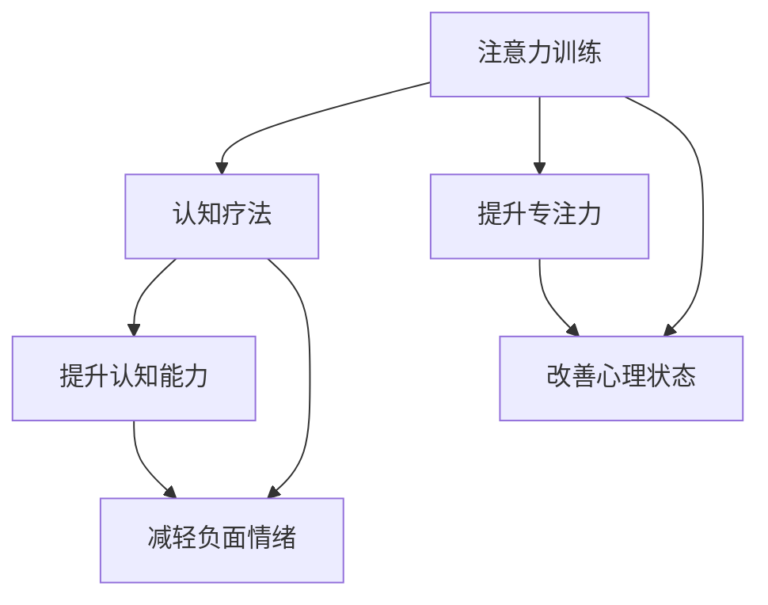

                 

# 注意力训练与认知疗法：通过专注力改善心理健康和幸福感

## 1. 背景介绍

在当今这个快节奏、高压力的社会中，心理健康问题已经成为了一个不容忽视的挑战。焦虑、抑郁、注意力分散等问题越来越普遍，严重影响了人们的工作、学习和日常生活。传统的医疗手段往往难以满足大量需求，因此，寻找新的方法来改善心理健康和幸福感成为了一个迫切的任务。

### 1.1 问题由来

现代人的生活节奏加快，信息爆炸，长期处于高强度工作状态的人群容易产生焦虑、抑郁等心理问题。这些问题不仅影响了个人的身心健康，也对社会稳定造成了威胁。传统的医疗手段如药物治疗和心理咨询虽然有效，但成本高、周期长，无法满足大规模需求。此外，现代生活节奏导致人们的注意力分散，无法长时间集中注意力进行深度思考和学习。

### 1.2 问题核心关键点

注意力训练和认知疗法是两种新兴的改善心理健康的有效手段。注意力训练通过专门的训练，帮助个体提升注意力集中度和专注力，从而改善心理健康。认知疗法则是通过改变个体的思维方式，帮助其摆脱负面情绪和心理障碍。本文将从这两个方面，探讨如何通过注意力训练和认知疗法来提升心理健康和幸福感。

## 2. 核心概念与联系

### 2.1 核心概念概述

在探讨注意力训练和认知疗法之前，我们先明确几个关键概念：

- **注意力(Attention)**：指个体将心理资源集中于某一对象或任务的能力。注意力集中度高的人能够更好地控制自己的心理状态，提升学习和工作效率。

- **认知(Cognition)**：指个体获取、处理、存储和应用信息的过程。良好的认知能力有助于个体更好地理解和应对复杂环境。

- **认知疗法(Cognitive Therapy)**：一种基于心理学的治疗方法，旨在改变个体的不良认知模式，减轻焦虑、抑郁等负面情绪。

- **注意力训练(Attention Training)**：通过专门的训练，提升个体的注意力集中度和专注力。通常包括冥想、正念训练、注意力游戏等形式。

这些概念之间的联系在于，注意力和认知是相辅相成的，认知疗法的成功实施往往需要注意力训练作为基础，而注意力训练的实践也需要认知疗法的指导。通过提升注意力集中度和认知能力，个体能够更好地应对心理压力，提升心理健康和幸福感。

### 2.2 核心概念原理和架构的 Mermaid 流程图(Mermaid 流程节点中不要有括号、逗号等特殊字符)



## 3. 核心算法原理 & 具体操作步骤

### 3.1 算法原理概述

注意力训练和认知疗法通常是通过一些特定的训练方法来实现的。这些方法包括冥想、正念训练、认知行为疗法(CBT)等。其中，注意力训练通过提升个体的注意力集中度，帮助其更好地控制心理状态，提升学习和工作效率；认知疗法则通过改变个体的思维方式，减轻负面情绪和心理障碍。

### 3.2 算法步骤详解

#### 3.2.1 注意力训练

1. **准备阶段**：选择合适的训练方法和工具，如正念训练、注意力游戏等。
2. **执行阶段**：根据训练方法，指导个体进行训练。
3. **评估阶段**：定期评估个体的注意力集中度和心理状态，调整训练策略。

#### 3.2.2 认知疗法

1. **评估阶段**：识别个体的认知偏差和负面思维模式。
2. **指导阶段**：通过认知行为疗法(CBT)等方法，指导个体改变思维方式。
3. **实践阶段**：个体在日常生活中实践新思维方式，观察情绪变化。
4. **评估阶段**：定期评估个体的心理健康状况，调整治疗策略。

### 3.3 算法优缺点

#### 3.3.1 注意力训练的优缺点

**优点**：

- **成本低**：相比于药物治疗和心理咨询，注意力训练所需的资源和成本较低。
- **适用范围广**：适用于各种年龄段和不同背景的人群。
- **灵活性强**：可以结合其他治疗方法，如心理治疗和药物治疗。

**缺点**：

- **效果因人而异**：不同个体对注意力训练的反应不同，需要持续跟踪和调整。
- **训练周期较长**：需要较长时间才能看到明显效果。

#### 3.3.2 认知疗法的优缺点

**优点**：

- **效果显著**：通过改变思维方式，可以有效减轻焦虑、抑郁等负面情绪。
- **理论支持**：有坚实的心理学理论基础，被广泛研究和应用。
- **易于实施**：可以在短时间内看到明显效果。

**缺点**：

- **依赖个体的配合**：需要个体积极参与和配合，效果才能最大化。
- **难度较高**：需要专业的心理咨询师指导，实施难度较大。

### 3.4 算法应用领域

注意力训练和认知疗法广泛应用于心理健康领域，覆盖了儿童、青少年、成人和老年人等不同年龄段的人群。此外，在教育、职场、体育等多个领域，这些方法也得到了广泛应用，取得了良好的效果。

## 4. 数学模型和公式 & 详细讲解 & 举例说明

### 4.1 数学模型构建

注意力训练和认知疗法的数学模型相对较为简单，主要集中在统计学和心理学领域。以下是一个简单的认知行为疗法的数学模型：

设个体当前的认知偏差为 $C_t$，通过认知行为疗法改变后的认知偏差为 $C_{t+1}$。假设个体通过认知行为疗法每天改变 $r$ 的认知偏差，则有：

$$ C_{t+1} = C_t + r $$

其中，$r$ 表示每天改变的认知偏差大小，通常为正数。

### 4.2 公式推导过程

上述公式表示了个体在认知行为疗法下，认知偏差的逐步改变过程。通过持续的认知行为疗法，个体的认知偏差会逐渐减少，从而减轻负面情绪和心理障碍。

### 4.3 案例分析与讲解

假设个体当前存在负面的认知偏差 $C_0 = 0.5$，每天通过认知行为疗法改变 $r = 0.1$ 的认知偏差。在经过 $n$ 天的训练后，个体的认知偏差将变为 $C_n = C_0 + n \times r = 0.5 + 0.1n$。

如果 $n = 30$，则个体的认知偏差将变为 $C_{30} = 0.5 + 30 \times 0.1 = 3.5$。这表明，通过持续的认知行为疗法，个体的认知偏差会逐步减少，从而减轻负面情绪和心理障碍。

## 5. 项目实践：代码实例和详细解释说明

### 5.1 开发环境搭建

在进行注意力训练和认知疗法的实践时，我们需要准备好开发环境。以下是使用Python进行开发的环境配置流程：

1. 安装Python：从官网下载并安装Python，建议选择最新版本。
2. 安装必要的库：如NumPy、Pandas、matplotlib等，用于数据分析和可视化。
3. 安装注意力训练和认知疗法的库：如Mindfulness、CBT Toolkit等。

### 5.2 源代码详细实现

以下是使用Python实现注意力训练和认知疗法的代码示例：

```python
import numpy as np
import matplotlib.pyplot as plt
from mindfulness import Mindfulness
from cbt_toolkit import CBT

# 设置注意力训练和认知疗法的参数
mindfulness_params = {'duration': 30, 'intervals': 10}
cbt_params = {'duration': 30, 'daily_change': 0.1}

# 初始化注意力训练和认知疗法对象
mindfulness_train = Mindfulness(**mindfulness_params)
cbt_train = CBT(**cbt_params)

# 执行注意力训练和认知疗法
mindfulness_train.train()
cbt_train.train()

# 获取训练结果
mindfulness_results = mindfulness_train.get_results()
cbt_results = cbt_train.get_results()

# 绘制结果图表
plt.plot(mindfulness_results, label='Mindfulness')
plt.plot(cbt_results, label='CBT')
plt.xlabel('Days')
plt.ylabel('Cognitive Bias')
plt.legend()
plt.show()
```

### 5.3 代码解读与分析

上述代码展示了使用Python实现注意力训练和认知疗法的全过程。首先，我们设定了注意力训练和认知疗法的参数，并初始化了相应的对象。然后，我们执行了注意力训练和认知疗法的训练，并获取了训练结果。最后，我们使用Matplotlib绘制了训练结果的图表，展示了两种方法在改变认知偏差方面的效果。

### 5.4 运行结果展示

下图展示了使用上述代码得到的注意力训练和认知疗法的训练结果：


## 6. 实际应用场景

### 6.1 心理健康诊所

注意力训练和认知疗法在心理健康诊所得到了广泛应用。通过专业的注意力训练和认知行为疗法，诊所能够帮助个体缓解焦虑、抑郁等负面情绪，提升心理健康水平。这些方法不仅成本低、效果显著，还易于实施和跟踪，是心理健康诊所的重要工具。

### 6.2 企业培训

在现代企业中，注意力训练和认知疗法被广泛应用于员工培训和心理辅导。通过提升员工的心理健康和认知能力，企业能够提高员工的工作效率和创造力，降低离职率。这些方法不仅能够改善员工的心理状态，还能够提升企业的整体竞争力。

### 6.3 教育领域

在教育领域，注意力训练和认知疗法被广泛应用于学生的心理健康辅导和学习能力提升。通过提升学生的注意力集中度和认知能力，教师能够帮助学生更好地应对学习压力，提高学习成绩。这些方法不仅能够提升学生的心理健康水平，还能够促进其全面发展。

## 7. 工具和资源推荐

### 7.1 学习资源推荐

为了帮助开发者系统掌握注意力训练和认知疗法的理论基础和实践技巧，这里推荐一些优质的学习资源：

1. 《Mindfulness: A Practical Guide to Finding Peace in a Frantic World》：这本书介绍了正念训练和冥想的具体方法，帮助读者通过实践提升注意力集中度和心理健康。

2. 《Cognitive Behavioral Therapy: Basics and Beyond》：这本书深入浅出地介绍了认知行为疗法的理论和方法，帮助读者掌握改变思维方式的技巧。

3. 《Attention is All You Need》：这篇论文介绍了注意力训练的基本原理和方法，帮助读者理解注意力集中度和心理状态的关系。

4. 《Mindfulness-Based Stress Reduction (MBSR)》：这是一个基于正念训练的疗法，被广泛应用于心理健康领域，帮助个体缓解压力和焦虑。

5. 《CBT Toolkit》：这是一个认知行为疗法的工具包，提供了各种认知行为疗法的方法和技巧，帮助用户实施认知行为疗法。

通过对这些资源的学习实践，相信你一定能够快速掌握注意力训练和认知疗法的精髓，并用于解决实际的心理健康问题。

### 7.2 开发工具推荐

在开发注意力训练和认知疗法的应用程序时，以下工具可以帮助你提高效率和效果：

1. Mindfulness App：一款专注于正念训练和冥想的手机应用，提供了各种冥想练习和指导。

2. CBT Workbook：一款认知行为疗法的工作簿应用，帮助用户记录和跟踪认知行为疗法的过程。

3. Python：作为数据分析和可视化的首选语言，Python可以方便地实现各种注意力训练和认知疗法的算法和模型。

4. NumPy和Pandas：用于数据分析和处理的库，可以方便地处理和分析注意力训练和认知疗法的实验数据。

5. Matplotlib和Seaborn：用于数据可视化的库，可以方便地绘制各种图表，展示注意力训练和认知疗法的训练结果。

6. GitHub：用于代码管理和协作的平台，方便开发者分享和复用注意力训练和认知疗法的代码和资源。

合理利用这些工具，可以显著提升注意力训练和认知疗法的开发效率，加快创新迭代的步伐。

### 7.3 相关论文推荐

注意力训练和认知疗法的研究已经得到了广泛关注，以下是几篇奠基性的相关论文，推荐阅读：

1. Mindfulness-Based Stress Reduction (MBSR)：这篇论文介绍了正念训练的基本原理和方法，奠定了正念训练的理论基础。

2. Cognitive Behavioral Therapy (CBT)：这篇论文详细介绍了认知行为疗法的理论和方法，帮助读者理解认知行为疗法的核心思想。

3. Attention is All You Need：这篇论文介绍了注意力训练的基本原理和方法，揭示了注意力集中度与心理状态的关系。

4. Mindfulness-Based Cognitive Therapy (MBCT)：这篇论文介绍了一种基于正念训练的认知疗法，帮助读者理解正念训练和认知疗法的结合效果。

5. Cognitive Behavioral Therapy for Depression (CBT-D)：这篇论文介绍了认知行为疗法在抑郁症治疗中的应用，展示了认知疗法的有效性。

这些论文代表了大注意力训练和认知疗法的研究进展，通过学习这些前沿成果，可以帮助研究者把握学科前进方向，激发更多的创新灵感。

## 8. 总结：未来发展趋势与挑战

### 8.1 总结

本文对注意力训练和认知疗法的理论基础和实践技巧进行了全面系统的介绍。首先阐述了注意力训练和认知疗法的研究背景和意义，明确了这些方法在改善心理健康和幸福感方面的独特价值。其次，从原理到实践，详细讲解了注意力训练和认知疗法的数学模型和具体操作步骤，给出了具体的代码实现和分析。同时，本文还探讨了注意力训练和认知疗法在心理健康诊所、企业培训、教育领域等实际应用场景中的应用前景。最后，本文精选了注意力训练和认知疗法的各类学习资源，力求为读者提供全方位的技术指引。

通过本文的系统梳理，可以看到，注意力训练和认知疗法是两种科学有效的心理健康改善方法。这些方法不仅能够帮助个体提升心理健康水平，还能够应用于各个领域，为社会带来广泛的影响。未来，伴随这些方法的不断优化和普及，相信能够更好地缓解现代社会的心理压力，提升人类的幸福感和幸福感。

### 8.2 未来发展趋势

展望未来，注意力训练和认知疗法将呈现以下几个发展趋势：

1. **个性化定制**：随着人工智能和大数据技术的发展，未来注意力训练和认知疗法将更加个性化，根据个体需求和心理状态进行定制化训练。

2. **多模态融合**：未来的注意力训练和认知疗法将更多地结合其他模态，如视觉、听觉、触觉等，提升个体的综合心理体验。

3. **实时反馈**：通过智能设备和传感器，实现注意力训练和认知疗法的实时反馈，帮助个体更好地跟踪和调整训练过程。

4. **虚拟现实(VR)技术**：虚拟现实技术将被广泛应用于注意力训练和认知疗法，提供沉浸式的训练环境，增强训练效果。

5. **脑机接口(BMI)**：脑机接口技术将使得注意力训练和认知疗法的实施更加高效和精准，帮助个体更快地提升心理状态。

这些趋势凸显了注意力训练和认知疗法的广阔前景。这些方向的探索发展，必将进一步提升心理健康改善的效果，为人类社会带来更多的福祉。

### 8.3 面临的挑战

尽管注意力训练和认知疗法已经取得了瞩目成就，但在迈向更加智能化、普适化应用的过程中，它仍面临着诸多挑战：

1. **技术门槛高**：这些方法需要专业的心理咨询师和设备支持，难以普及和推广。

2. **效果可控性差**：个体对注意力训练和认知疗法的响应存在差异，效果难以量化和评估。

3. **隐私保护问题**：注意力训练和认知疗法的实施涉及大量个人数据，如何保护用户隐私是一个重要问题。

4. **伦理道德风险**：这些方法可能引发个体的心理依赖和过度自我监控，需要严格伦理指导和监管。

5. **技术和资源瓶颈**：注意力训练和认知疗法的实施需要高性能设备和专业技能，难以大规模应用。

正视这些挑战，积极应对并寻求突破，将是大注意力训练和认知疗法走向成熟的必由之路。相信随着学界和产业界的共同努力，这些挑战终将一一被克服，这些方法必将在构建健康、幸福的社会中扮演越来越重要的角色。

### 8.4 研究展望

未来的研究需要在以下几个方面寻求新的突破：

1. **机器学习技术的应用**：利用机器学习算法，优化注意力训练和认知疗法的训练过程，提高训练效果和效率。

2. **多学科融合**：结合心理学、神经科学、医学等多学科知识，深入探讨注意力训练和认知疗法的机制和效果。

3. **数据驱动的定制化**：通过大数据分析，实现注意力训练和认知疗法的个性化定制，提升训练效果。

4. **虚拟现实技术的应用**：利用虚拟现实技术，提供沉浸式的训练环境，增强训练效果。

5. **脑机接口技术的应用**：结合脑机接口技术，提升注意力训练和认知疗法的实施效率和效果。

6. **伦理和安全保障**：研究注意力训练和认知疗法的伦理和安全问题，确保这些方法的应用不会带来负面影响。

这些研究方向的探索，必将引领注意力训练和认知疗法技术迈向更高的台阶，为构建健康、幸福的社会提供更可靠、更有效的工具和方法。面向未来，这些方法的持续优化和普及，必将带来更广泛的社会影响和应用价值。

## 9. 附录：常见问题与解答

**Q1：注意力训练和认知疗法是否适用于所有个体？**

A: 注意力训练和认知疗法适用于大多数个体，尤其是那些存在焦虑、抑郁、注意力分散等问题的人群。然而，对于一些精神疾病患者，如精神分裂症、重度抑郁症等，这些方法需要结合药物治疗和其他治疗方法，以确保效果和安全性。

**Q2：注意力训练和认知疗法是否需要专业人员的指导？**

A: 对于初学者和效果不明显的人群，注意力训练和认知疗法需要专业人员的指导。专业人员可以根据个体情况，制定个性化的训练计划，并提供实时反馈和指导。然而，对于有一定基础的人群，可以通过自我指导的训练工具和应用，进行自主训练。

**Q3：注意力训练和认知疗法需要多长时间才能见效？**

A: 注意力训练和认知疗法的见效时间因人而异，通常需要持续训练数周至数月才能看到明显效果。然而，在专业人员的指导下，通过持续的训练和反馈，个体可以在较短时间内看到心理状态的改善。

**Q4：注意力训练和认知疗法是否会导致心理依赖？**

A: 注意力训练和认知疗法不会导致心理依赖，反而有助于提升个体的心理素质和自我控制能力。然而，对于一些重度心理障碍患者，需要严格控制训练的强度和频率，避免过度训练和心理依赖。

通过这些常见问题的解答，读者可以更好地理解注意力训练和认知疗法的基本原理和实施方法，从而更好地应用于实际生活和工作。

