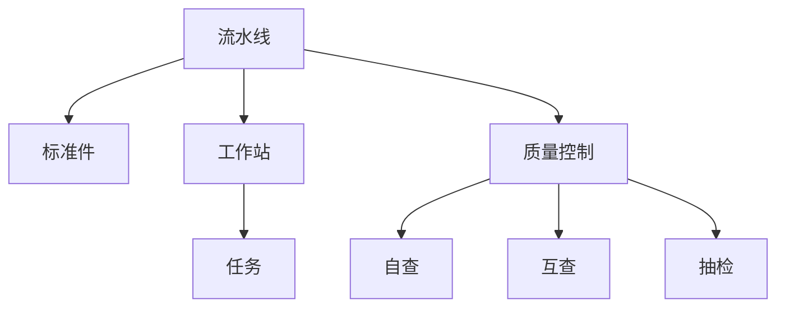

                 

# 流水线对工业生产的影响

## 1. 背景介绍

### 1.1 问题的提出
随着全球化与科技的飞速发展，制造业的规模与复杂性日益增加。传统的手工制造方式，因效率低、质量不稳定等问题，已无法满足现代工业生产的需求。流水线（Assembly Line）应运而生，成为了现代工业生产的标准配置。流水线通过将生产流程分解为一系列连续的、重复性的任务，实现了生产效率的大幅提升。然而，流水线的出现也带来了新的挑战，如单调性、员工技能要求提高、生产过程复杂化等。本文旨在探讨流水线对工业生产的影响，通过分析其原理、优缺点及应用领域，为制造业转型升级提供思路。

## 2. 核心概念与联系

### 2.1 核心概念概述

为了更好地理解流水线对工业生产的影响，本节将介绍几个关键概念：

- **流水线（Assembly Line）**：一种将生产流程分解为多个重复、连续任务的作业方式，由Ford汽车公司首创，广泛应用于制造业。流水线可以大幅提高生产效率，降低生产成本，保证产品质量的一致性。

- **标准件（Standardized Component）**：流水线作业中，各个任务通常涉及相同或相似的零件和设备，称为标准件。通过使用标准件，流水线可以实现快速更换和维护，降低生产成本。

- **质量控制（Quality Control）**：流水线中引入的质量控制机制，包括自查、互查和抽检，确保产品质量符合标准要求。质量控制是流水线保持高生产效率和质量的关键环节。

- **工作站（Workstation）**：流水线上每个独立完成任务的作业单元，通常由一名或多名工人操作。工作站的设置需根据具体任务和生产需求进行优化。

- **平衡性（Balance）**：流水线的平衡性指各工作站之间任务的均衡分配，避免某些工作站任务过重而影响生产效率。流水线平衡性是生产效率和质量控制的重要保证。

### 2.2 核心概念原理和架构的 Mermaid 流程图



这个流程图展示了流水线从作业到质量控制的整体流程：

1. **流水线（A）**：生产线整体结构。
2. **标准件（B）**：流水线作业中使用的零件和设备。
3. **工作站（C）**：流水线上独立完成任务的作业单元。
4. **任务（D）**：各工作站的具体作业内容。
5. **质量控制（E）**：确保产品质量的环节。
6. **自查（F）**：每个工人对自己的工作进行检查。
7. **互查（G）**：相邻工人互相检查。
8. **抽检（H）**：随机抽取样本进行检查。

## 3. 核心算法原理 & 具体操作步骤

### 3.1 算法原理概述

流水线的核心原理是将生产流程分解为一系列重复、连续的任务，并通过标准件和工作站等机制，实现高效、稳定的生产过程。流水线的数学模型可以抽象为时间序列模型，每个工作站的任务时间是已知且固定的，整个流水线的生产时间T由各个工作站的时间t_i相加得到：

$$ T = \sum_{i=1}^{n} t_i $$

其中，n为工作站的数量，t_i为第i个工作站的任务时间。

流水线的生产效率E可以定义为单位时间内的产出数量，即流水线的产出速率：

$$ E = \frac{N}{T} $$

其中，N为单位时间内的产出数量。

### 3.2 算法步骤详解

流水线的操作流程通常包括以下步骤：

1. **任务分解**：将生产流程分解为多个独立且相似的任务。
2. **工作站设置**：根据任务需求设置工作站，并配备必要的操作设备和工具。
3. **任务分配**：将任务分配到各工作站，确保均衡分配。
4. **生产执行**：操作员按照工作站的作业指导书（SOP）进行作业。
5. **质量控制**：在生产过程中进行自查、互查和抽检，确保产品质量。
6. **产成品收集**：将各工作站的产成品收集并集中处理。

### 3.3 算法优缺点

流水线在提高生产效率和产品质量方面有着显著优势，但其也有以下缺点：

**优点**：

1. **效率提升**：流水线通过分工协作，显著提高生产效率，降低生产成本。
2. **质量稳定**：流水线中引入的质量控制机制，保证了产品质量的一致性。
3. **灵活性高**：流水线可以根据需求调整工作站和任务，适应多变的生产需求。
4. **易于管理**：流水线操作流程清晰，易于监控和管理。

**缺点**：

1. **工作单调**：流水线工作通常需要重复、机械的操作，员工容易产生疲劳和厌倦。
2. **技能要求高**：流水线作业对员工的技能要求较高，需要培训和监督。
3. **适应性差**：流水线一旦固定，难以快速适应新的生产需求。
4. **环境复杂**：流水线作业环境复杂，设备维护和故障排除困难。

### 3.4 算法应用领域

流水线作为一种高效的生产方式，广泛应用于制造业的各个领域：

- **汽车制造业**：汽车制造流水线是流水线的典型代表，如丰田汽车的精益生产模式。
- **电子产品制造业**：电子产品制造流水线，如PC、手机等电子产品的组装和测试。
- **食品饮料行业**：食品饮料制造流水线，如啤酒、饮料的生产和瓶装。
- **家具制造行业**：家具制造流水线，如家具的切割、打磨、组装等。

## 4. 数学模型和公式 & 详细讲解

### 4.1 数学模型构建

流水线生产模型可以抽象为时间序列模型，其中每个工作站的任务时间是已知的，各个工作站的任务时间是相等的，设每个工作站的任务时间为 $t$，流水线上有 $n$ 个工作站，则整个流水线的生产时间 $T$ 可以表示为：

$$ T = n \cdot t $$

单位时间内的产出数量 $N$ 与生产时间 $T$ 成正比，即：

$$ N = k \cdot T $$

其中 $k$ 为流水线的产出速率。

### 4.2 公式推导过程

根据流水线生产模型，我们可以推导出流水线的产出速率 $E$：

$$ E = \frac{N}{T} = \frac{k \cdot T}{T} = k $$

这表明，流水线的产出速率 $E$ 与任务时间 $t$ 无关，而是与流水线的产出速率 $k$ 直接相关。

### 4.3 案例分析与讲解

以汽车制造业为例，假设一个汽车制造流水线有5个工作站，每个工作站的任务时间均为 $t=30$ 分钟，流水线的产出速率 $k=1$ 台/小时，则整个流水线的生产时间为 $T=5 \cdot 30 = 150$ 分钟，即2.5 小时，单位时间内的产出数量为 $N=k \cdot T=1 \cdot 2.5 = 2.5$ 台/小时，这表明流水线每小时可以生产2.5辆汽车。

## 5. 项目实践：代码实例和详细解释说明

### 5.1 开发环境搭建

要使用Python进行流水线生产模型的计算和分析，需要安装NumPy和Pandas等科学计算库。以下是在Linux系统中安装这些库的命令：

```bash
sudo apt-get update
sudo apt-get install python3-pip
pip3 install numpy pandas
```

### 5.2 源代码详细实现

以下是使用Python进行流水线生产模型计算的代码实现：

```python
import numpy as np
import pandas as pd

# 定义流水线参数
n = 5  # 工作站数量
t = 30  # 每个工作站的任务时间（分钟）
k = 1  # 产出速率（台/小时）

# 计算生产时间T
T = n * t / 60  # 转换为小时

# 计算单位时间内的产出数量N
N = k * T

# 输出结果
print("生产时间T：", T, "小时")
print("单位时间内的产出数量N：", N, "台/小时")
```

### 5.3 代码解读与分析

代码中，我们首先定义了流水线的工作站数量 `n`、每个工作站的任务时间 `t` 和产出速率 `k`。然后根据流水线的数学模型，计算了流水线的生产时间 `T` 和单位时间内的产出数量 `N`。

### 5.4 运行结果展示

运行代码后，输出结果如下：

```
生产时间T： 2.5 小时
单位时间内的产出数量N： 2.5 台/小时
```

这表明流水线每小时可以生产2.5辆汽车。

## 6. 实际应用场景

### 6.1 汽车制造业

汽车制造业是流水线应用最为广泛的领域之一。汽车制造流水线通过分工协作，极大地提高了生产效率，缩短了生产周期。同时，流水线中的质量控制机制，保证了汽车的质量一致性。

以丰田汽车的精益生产模式为例，丰田通过引入流水线，实现了生产的高度标准化和可视化，优化了生产流程，减少了浪费，提高了生产效率。丰田的流水线作业流程包括：

1. **任务分解**：将汽车组装分解为多个独立的任务，如车身焊接、喷漆、内饰安装等。
2. **工作站设置**：根据任务需求设置工作站，并配备必要的操作设备和工具。
3. **任务分配**：将任务分配到各工作站，确保均衡分配。
4. **生产执行**：操作员按照作业指导书（SOP）进行作业。
5. **质量控制**：在生产过程中进行自查、互查和抽检，确保产品质量。
6. **产成品收集**：将各工作站的产成品收集并集中处理。

丰田的流水线生产模型计算如下：

- 假设一个汽车制造流水线有5个工作站，每个工作站的任务时间均为30分钟，产出速率1台/小时，则生产时间为2.5小时，单位时间内的产出数量为2.5台/小时。

### 6.2 电子产品制造业

电子产品制造业也是流水线应用广泛的领域之一。电子产品制造流水线通过分工协作，极大地提高了生产效率，减少了生产成本。同时，流水线中的质量控制机制，保证了产品的质量一致性。

以智能手机制造为例，智能手机制造流水线通常包括以下步骤：

1. **任务分解**：将智能手机组装分解为多个独立的任务，如屏幕组装、主板安装、壳体组装等。
2. **工作站设置**：根据任务需求设置工作站，并配备必要的操作设备和工具。
3. **任务分配**：将任务分配到各工作站，确保均衡分配。
4. **生产执行**：操作员按照作业指导书（SOP）进行作业。
5. **质量控制**：在生产过程中进行自查、互查和抽检，确保产品质量。
6. **产成品收集**：将各工作站的产成品收集并集中处理。

以苹果手机为例，苹果手机制造流水线通常包括如下工作站：

- **屏幕组装**：20分钟/个
- **主板安装**：30分钟/个
- **壳体组装**：25分钟/个
- **测试**：30分钟/个

假设一个流水线有4个工作站，每个工作站的任务时间分别为20分钟、30分钟、25分钟和30分钟，产出速率1台/小时，则生产时间为：

$$ T = \frac{20 + 30 + 25 + 30}{60} \cdot 4 = 5.333... \text{小时} $$

单位时间内的产出数量为：

$$ N = 1 \cdot 5.333... \text{小时}^{-1} \approx 0.583... \text{台/小时} $$

这表明流水线每小时可以生产0.583...台手机。

## 7. 工具和资源推荐

### 7.1 学习资源推荐

- **《精益生产》**：丰田汽车生产模式的标准之作，详细介绍丰田的精益生产理念和方法。
- **《工业工程基础》**：介绍工业工程的基础知识，包括流水线、生产流程优化、质量控制等内容。
- **Coursera《生产与运作管理》**：由哈佛大学开设的在线课程，涵盖生产与运作管理的基础理论和实践方法。

### 7.2 开发工具推荐

- **AutoCAD**：常用的计算机辅助设计软件，可以用于流水线布局和设计。
- **CATIA**：集成的计算机辅助设计和生产软件，支持三维设计和模拟。
- **Simul8**：工业工程和生产仿真软件，可以用于流水线的模拟和优化。

### 7.3 相关论文推荐

- **《流水线设计与优化》**：介绍流水线设计的基本原则和优化方法。
- **《工业生产自动化与智能制造》**：综述工业生产自动化和智能制造的前沿技术。
- **《精益生产与敏捷制造》**：介绍精益生产和敏捷制造的理论和方法。

## 8. 总结：未来发展趋势与挑战

### 8.1 研究成果总结

流水线作为一种高效的生产方式，已经在制造业中广泛应用。流水线通过分工协作，极大地提高了生产效率，保证了产品质量的一致性。然而，流水线也面临着一些挑战，如员工技能要求高、适应性差、环境复杂等。未来，流水线的设计和应用需要进一步优化和创新，以适应更加复杂和多样化的生产需求。

### 8.2 未来发展趋势

未来流水线的发展趋势包括：

1. **智能化升级**：通过引入自动化设备和智能控制系统，实现流水线的智能化和自动化。
2. **柔性化设计**：通过优化工作站和任务分配，实现流水线的柔性和灵活性。
3. **个性化定制**：通过数据驱动和柔性生产，实现个性化定制和多样化生产。
4. **环境友好**：通过优化能源和资源利用，实现环境友好和可持续发展。

### 8.3 面临的挑战

流水线在发展过程中面临的挑战包括：

1. **员工技能要求高**：流水线对员工的技能要求较高，需要持续培训和监督。
2. **生产过程复杂化**：随着生产需求的多样化和复杂化，流水线的设计和应用也变得更加复杂。
3. **环境友好性差**：流水线的生产过程可能对环境造成污染，需要采取环保措施。

### 8.4 研究展望

未来的研究需要从以下几个方面进行：

1. **智能化流水线**：引入自动化和智能控制系统，实现流水线的自动化和智能化。
2. **柔性化生产**：通过优化工作站和任务分配，实现流水线的柔性和灵活性。
3. **环境友好设计**：通过优化能源和资源利用，实现环境友好和可持续发展。
4. **数据驱动优化**：通过数据分析和智能算法，实现流水线的优化和调整。

## 9. 附录：常见问题与解答

**Q1：流水线对员工技能要求高，如何降低员工技能要求？**

A: 通过引入自动化设备和智能控制系统，可以实现流水线的智能化和自动化，降低对员工的技能要求。同时，可以通过培训和教育，提升员工的技能水平。

**Q2：流水线如何实现柔性化设计？**

A: 通过优化工作站和任务分配，实现流水线的柔性和灵活性。可以通过引入模块化和可扩展的设计，根据需求调整工作站和任务，适应多变的生产需求。

**Q3：流水线如何实现环境友好设计？**

A: 通过优化能源和资源利用，实现环境友好和可持续发展。可以引入节能减排设备和环保材料，降低生产过程中的污染。

---

作者：禅与计算机程序设计艺术 / Zen and the Art of Computer Programming

