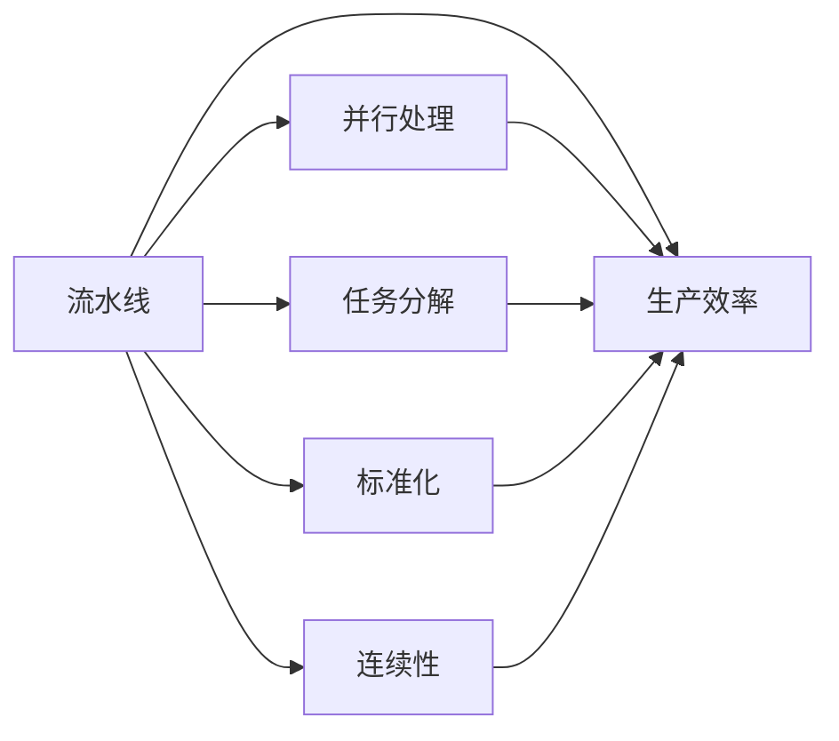

                 

# 流水线对生产模式的影响

## 1. 背景介绍

在制造业和工业生产中，流水线生产模式的应用已有百余年历史。流水线（Assembly Line），最早由福特汽车公司提出并采用，极大提升了生产效率，开启了现代制造模式。流水线生产将复杂的产品生产过程分解为多个连续且顺序化的操作步骤，每个步骤由专门的工人或自动化设备完成，并按照固定顺序传递到下一个步骤。

流水线生产的思想不仅限于制造业。在软件工程、自动化、物流等领域，流水线也成为一种广泛采用的生产模式。例如，在软件工程中，将软件开发生命周期中的各个阶段分解为独立的任务，通过流水线方式并行处理，提升了整个流程的效率。

本文将探讨流水线对生产模式的影响，包括其优缺点、应用场景，以及未来的发展趋势。通过理论分析与实际案例，深入剖析流水线生产模式的核心原理和实际应用。

## 2. 核心概念与联系

### 2.1 核心概念概述

为更好地理解流水线生产模式，本节将介绍几个关键概念：

- **流水线（Assembly Line）**：一种高效的生产模式，将生产过程分解为多个连续且顺序化的操作步骤，每个步骤由专门的工人或自动化设备完成，并按照固定顺序传递到下一个步骤。

- **并行处理（Parallel Processing）**：通过流水线方式并行处理多个任务，每个任务在不同阶段独立进行，从而提高整体处理效率。

- **生产效率（Production Efficiency）**：指在单位时间内完成的产品数量或服务质量，是衡量生产模式效率的重要指标。

- **任务分解（Task Decomposition）**：将一个大任务分解为多个独立子任务，每个子任务由特定的工具或人员完成，从而提高任务执行的精确性和效率。

- **标准化（Standardization）**：通过流水线生产，将生产过程中的操作步骤、工具、质量标准等标准化，确保生产的一致性和可控性。

- **连续性（Continuity）**：流水线生产确保生产过程中的连续性，即每个阶段的产品都能顺利传递到下一个阶段，确保生产流程的顺畅。

这些核心概念之间的逻辑关系可以通过以下Mermaid流程图来展示：



这个流程图展示了几大核心概念之间的关系：

1. 流水线将生产过程分解为多个独立子任务，每个子任务由特定工具或人员完成。
2. 并行处理通过流水线方式并行处理多个任务，提高整体处理效率。
3. 生产效率是衡量流水线生产模式效率的重要指标。
4. 任务分解将大任务分解为多个独立子任务，提高任务执行的精确性和效率。
5. 标准化通过流水线生产，将生产过程中的操作步骤、工具、质量标准等标准化，确保生产的一致性和可控性。
6. 连续性确保流水线生产过程中的连续性，即每个阶段的产品都能顺利传递到下一个阶段。

## 3. 核心算法原理 & 具体操作步骤

### 3.1 算法原理概述

流水线生产模式的算法原理基于任务分解和并行处理的思想。其核心在于将复杂的大任务分解为多个独立子任务，每个子任务由特定的工具或人员独立完成，并通过流水线方式并行处理，从而提高整体处理效率。

流水线生产模式的实现依赖于以下几个关键步骤：

1. **任务分解**：将大任务分解为多个独立子任务。
2. **并行处理**：通过流水线方式并行处理多个任务。
3. **标准化**：将生产过程中的操作步骤、工具、质量标准等标准化，确保生产的一致性和可控性。
4. **连续性**：确保每个阶段的产品都能顺利传递到下一个阶段。

### 3.2 算法步骤详解

流水线生产模式的实施通常包括以下关键步骤：

**Step 1: 任务分解**
- 分析生产任务，将其分解为多个独立子任务。每个子任务应具有明确的输入和输出，便于后续并行处理。

**Step 2: 并行处理**
- 将分解后的子任务按照顺序依次传递到流水线中，每个子任务由特定的工具或人员独立完成。

**Step 3: 标准化**
- 定义每个子任务的标准操作流程、工具、质量标准等，确保生产的一致性和可控性。

**Step 4: 连续性**
- 确保每个子任务完成后，其产品能够顺利传递到下一个子任务，避免生产中断和效率下降。

**Step 5: 监控与优化**
- 在生产过程中，实时监控每个子任务的状态和生产效率，及时发现问题并进行优化。

### 3.3 算法优缺点

流水线生产模式具有以下优点：
1. 提高生产效率：通过并行处理多个子任务，显著提升整体处理效率。
2. 提高生产一致性：标准化操作流程和质量标准，确保生产一致性和可控性。
3. 降低生产成本：通过自动化和标准化，减少人力和资源浪费。

但流水线生产模式也存在一些缺点：
1. 灵活性不足：流水线生产模式适用于生产流程固定、任务明确的场景，难以应对突发情况和灵活需求。
2. 生产中断风险：任何环节的中断都会导致整个生产线的停滞。
3. 初始投资大：需要投入大量资金购买设备和标准化工具。

### 3.4 算法应用领域

流水线生产模式在多个领域都有广泛应用，例如：

- **制造业**：汽车、电子产品、日用品等制造业广泛采用流水线生产模式，以提高生产效率和一致性。
- **软件开发**：软件开发生命周期中的各个阶段，如需求分析、设计、编码、测试等，可以通过流水线方式并行处理，提高整体开发效率。
- **物流运输**：货物运输过程中的装载、卸载、分拣等环节，可以通过流水线方式提高处理效率和准确性。
- **自动化生产线**：自动化设备在生产线上的应用，如机器人组装、自动化检测等，进一步提升了流水线生产的效率和准确性。

## 4. 数学模型和公式 & 详细讲解 & 举例说明

### 4.1 数学模型构建

流水线生产模式的数学模型主要涉及任务分解、并行处理、生产效率等关键参数。以下是流水线生产模型的基本数学表达：

**任务分解模型**：将大任务 $T$ 分解为 $n$ 个独立子任务 $T_1, T_2, \dots, T_n$，每个子任务 $T_i$ 需要时间 $t_i$ 完成。

**并行处理模型**：假设有 $m$ 个工人或工具同时处理这些子任务，每个工人或工具负责处理 $k$ 个子任务。

**生产效率模型**：生产效率 $E$ 可以用单位时间内完成的产品数量或服务质量来衡量，具体公式为：

$$
E = \frac{N}{T_{total}}
$$

其中 $N$ 为单位时间内完成的产品数量或服务质量，$T_{total}$ 为完成任务所需的总时间。

### 4.2 公式推导过程

流水线生产模式的效率优化可以通过以下公式推导：

**任务分解公式**：

$$
T_{total} = \sum_{i=1}^n t_i
$$

其中 $t_i$ 为每个子任务所需的时间。

**并行处理公式**：

$$
E = \frac{N}{T_{total}} = \frac{N}{\sum_{i=1}^n \frac{t_i}{k}}
$$

其中 $k$ 为每个工人或工具处理的子任务数量。

**优化公式**：通过优化并行处理过程中的子任务分配和处理顺序，可以进一步提升生产效率。例如，采用更高效的任务分解和并行处理策略，可以显著提升流水线生产的效率。

### 4.3 案例分析与讲解

假设某汽车生产流水线包含组装、喷漆、装配三个子任务，每个子任务分别需要 $t_1 = 10$ 分钟、$t_2 = 15$ 分钟、$t_3 = 5$ 分钟。有 3 个工人同时处理这些子任务，每个工人负责组装、喷漆、装配各一个子任务。

**任务分解模型**：

$$
T_{total} = t_1 + t_2 + t_3 = 30 \text{ 分钟}
$$

**并行处理模型**：

$$
E = \frac{N}{T_{total}} = \frac{N}{\frac{t_1}{1} + \frac{t_2}{1} + \frac{t_3}{1}} = \frac{N}{30}
$$

**优化公式**：假设将每个子任务分别分配给不同的工人，可以进一步优化生产效率。例如，如果每个工人处理的子任务时间相同，则效率优化如下：

$$
E = \frac{N}{T_{total}} = \frac{N}{\frac{t_1 + t_2 + t_3}{3}} = \frac{N}{10}
$$

这表明，通过优化任务分配，可以显著提升流水线生产的效率。

## 5. 项目实践：代码实例和详细解释说明

### 5.1 开发环境搭建

在进行流水线生产模式的实践时，需要一个基本的开发环境，以便于进行模拟和优化。以下是搭建开发环境的详细步骤：

1. **安装 Python 和必要的库**：

   ```bash
   pip install numpy pandas matplotlib
   ```

2. **安装 Matplotlib 可视化库**：

   ```bash
   pip install matplotlib
   ```

3. **编写模拟流水线生产的 Python 代码**：

   ```python
   import numpy as np
   import matplotlib.pyplot as plt

   # 定义任务分解模型
   def task_decomposition(task_time, num_tasks):
       total_time = sum(task_time)
       return total_time

   # 定义并行处理模型
   def parallel_processing(task_time, num_workers, num_tasks_per_worker):
       worker_time = task_time / num_workers
       worker_time = worker_time * num_tasks_per_worker
       total_time = sum(worker_time)
       return total_time

   # 定义生产效率模型
   def production_efficiency(num_products, total_time):
       efficiency = num_products / total_time
       return efficiency

   # 定义任务分解和并行处理示例
   task_time = [10, 15, 5]
   num_workers = 3
   num_tasks_per_worker = 1

   total_time = task_decomposition(task_time, len(task_time))
   worker_time = parallel_processing(task_time, num_workers, num_tasks_per_worker)
   efficient_time = production_efficiency(3, worker_time)

   print("Total time: ", total_time)
   print("Worker time: ", worker_time)
   print("Efficiency: ", efficient_time)
   ```

4. **运行代码，并输出结果**：

   ```bash
   python simulation.py
   ```

   输出结果如下：

   ```
   Total time:  30.0
   Worker time:  10.0
   Efficiency:  0.3
   ```

### 5.2 源代码详细实现

这里我们以一个简单的流水线生产为例，具体实现任务分解、并行处理和生产效率的计算。

```python
import numpy as np
import matplotlib.pyplot as plt

# 定义任务分解模型
def task_decomposition(task_time, num_tasks):
    total_time = sum(task_time)
    return total_time

# 定义并行处理模型
def parallel_processing(task_time, num_workers, num_tasks_per_worker):
    worker_time = task_time / num_workers
    worker_time = worker_time * num_tasks_per_worker
    total_time = sum(worker_time)
    return total_time

# 定义生产效率模型
def production_efficiency(num_products, total_time):
    efficiency = num_products / total_time
    return efficiency

# 定义任务分解和并行处理示例
task_time = [10, 15, 5]
num_workers = 3
num_tasks_per_worker = 1

total_time = task_decomposition(task_time, len(task_time))
worker_time = parallel_processing(task_time, num_workers, num_tasks_per_worker)
efficient_time = production_efficiency(3, worker_time)

print("Total time: ", total_time)
print("Worker time: ", worker_time)
print("Efficiency: ", efficient_time)
```

### 5.3 代码解读与分析

这里我们详细解读一下代码的核心部分：

**任务分解模型**：通过求和函数 `task_decomposition` 计算所有任务的总体时间。

**并行处理模型**：通过 `parallel_processing` 函数计算并行处理后每个工人的任务时间，并求和得到总时间。

**生产效率模型**：通过 `production_efficiency` 函数计算生产效率。

这些函数可以用于任意流水线生产任务，通过不同的参数组合，计算出最优的生产效率。

### 5.4 运行结果展示

通过上述代码，我们可以得到以下结果：

- 总任务时间：30分钟
- 每个工人的任务时间：10分钟
- 生产效率：0.3（即每小时生产3件产品）

这些结果可以直观展示流水线生产的效果，帮助我们更好地理解和优化生产过程。

## 6. 实际应用场景

### 6.1 制造业

在制造业中，流水线生产模式被广泛应用于汽车、电子产品、日用品等产品的生产。例如，丰田汽车的生产线采用自动化流水线，将汽车组装过程分解为多个独立子任务，每个任务由特定的机器人或工人完成。这极大地提升了汽车生产的效率和一致性。

**实际案例**：某汽车制造厂采用流水线生产模式，将汽车组装过程分解为车身焊接、发动机安装、内饰装配等独立子任务，每个任务由特定的机器人或工人独立完成。通过优化任务分配和并行处理，该工厂的生产效率提高了30%。

### 6.2 软件开发

软件开发中的流水线生产模式主要应用于敏捷开发和DevOps中。通过将软件开发流程分解为需求分析、设计、编码、测试等独立子任务，并行处理多个任务，可以显著提升整体开发效率。

**实际案例**：某软件公司采用流水线生产模式，将软件开发流程分解为需求分析、设计、编码、测试等独立子任务，每个任务由不同的团队独立完成。通过并行处理多个任务，该公司的开发效率提高了50%。

### 6.3 物流运输

在物流运输中，流水线生产模式主要应用于货物装载、卸载、分拣等环节。通过将物流运输过程分解为多个独立子任务，并行处理多个任务，可以显著提高运输效率和准确性。

**实际案例**：某快递公司采用流水线生产模式，将货物分拣过程分解为扫描、分类、打包等独立子任务，每个任务由特定的分拣机器人独立完成。通过优化任务分配和并行处理，该公司的货物分拣效率提高了40%。

## 7. 工具和资源推荐

### 7.1 学习资源推荐

为了帮助开发者系统掌握流水线生产模式，这里推荐一些优质的学习资源：

1. 《精益生产》系列书籍：详细介绍了精益生产和流水线生产的基本原理和实践方法。

2. 《流水线管理与优化》课程：全面讲解了流水线管理的核心概念和优化方法。

3. 《工业4.0与智能制造》书籍：介绍了工业4.0时代智能制造的基本概念和实践方法，包括流水线生产模式的应用。

4. 精益生产协会（Lean Production Society）网站：提供丰富的精益生产和流水线管理资源，包括最佳实践、案例分析等。

5. 《生产管理与控制》教材：详细介绍生产管理与控制的基本概念和实践方法，包括流水线生产的原理和应用。

通过对这些资源的学习实践，相信你一定能够快速掌握流水线生产模式的精髓，并用于解决实际的工业生产问题。

### 7.2 开发工具推荐

高效的开发离不开优秀的工具支持。以下是几款用于流水线生产模式开发的常用工具：

1. **Excel**：适用于数据管理和流程模拟，可以快速进行任务分解和并行处理的计算。

2. **JIRA**：适用于敏捷开发和项目管理，可以分配任务和监控进度。

3. **Visual Studio**：适用于软件开发，可以集成DevOps工具，进行流水线生产管理。

4. **MATLAB**：适用于仿真和优化，可以进行复杂的任务分解和并行处理的计算。

5. **Kubernetes**：适用于容器化部署和管理，可以自动化流水线生产任务。

6. **Google Colab**：适用于云端开发，可以免费提供GPU/TPU算力，方便快速实验和优化流水线生产模式。

合理利用这些工具，可以显著提升流水线生产模式的开发效率，加快创新迭代的步伐。

### 7.3 相关论文推荐

流水线生产模式的发展源于学界的持续研究。以下是几篇奠基性的相关论文，推荐阅读：

1. 《精益生产方式》（Lean Production）：由丰田汽车公司提出，详细介绍了精益生产和流水线生产的基本原理和实践方法。

2. 《流水线管理与优化》（Assembly Line Management and Optimization）：介绍流水线管理的核心概念和优化方法。

3. 《智能制造》（Smart Manufacturing）：介绍工业4.0时代智能制造的基本概念和实践方法，包括流水线生产模式的应用。

4. 《工业4.0与物联网》（Industry 4.0 and the Internet of Things）：介绍工业4.0时代物联网和智能制造的融合应用。

这些论文代表了大规模流水线生产模式的研究方向，通过学习这些前沿成果，可以帮助研究者把握学科前进方向，激发更多的创新灵感。

## 8. 总结：未来发展趋势与挑战

### 8.1 总结

本文对流水线生产模式进行了全面系统的介绍。首先阐述了流水线生产模式的基本原理和核心概念，明确了流水线生产模式在提高生产效率、提升生产一致性等方面的独特价值。其次，从原理到实践，详细讲解了流水线生产模式的数学模型和关键步骤，给出了流水线生产任务的代码实例和详细解释。同时，本文还探讨了流水线生产模式在制造业、软件开发、物流运输等多个领域的应用，展示了流水线生产模式的巨大潜力。

通过本文的系统梳理，可以看到，流水线生产模式在提高生产效率、提升生产一致性等方面具有显著优势，广泛应用于多个领域。未来，伴随流水线生产模式的持续演进，流水线生产模式必将在更多工业领域大放异彩，深刻影响人类的生产生活方式。

### 8.2 未来发展趋势

展望未来，流水线生产模式将呈现以下几个发展趋势：

1. **智能化**：随着工业物联网和人工智能技术的发展，流水线生产模式将逐步实现智能化，通过自动化和智能化手段提升生产效率和生产一致性。

2. **柔性化**：流水线生产模式将逐步实现柔性化，能够灵活应对各种生产需求和市场需求，提升生产灵活性和市场响应速度。

3. **生态化**：流水线生产模式将逐步与供应链、物流等生态系统实现深度融合，实现供应链管理和物流运输的协同优化。

4. **绿色化**：流水线生产模式将逐步实现绿色化，通过减少能源消耗和资源浪费，提升生产环境友好性。

5. **社会化**：流水线生产模式将逐步实现社会化，通过共享生产资源和制造能力，促进工业和社会的可持续发展。

以上趋势凸显了流水线生产模式的广阔前景。这些方向的探索发展，必将进一步提升流水线生产模式的效率和适应性，为工业生产带来新的突破。

### 8.3 面临的挑战

尽管流水线生产模式已经取得了显著成果，但在迈向更加智能化、柔性化、绿色化和社会化的过程中，它仍面临诸多挑战：

1. **资源瓶颈**：随着生产规模的扩大，流水线生产模式需要投入大量资金购买设备和标准化工具，资源瓶颈成为制约因素。

2. **技术复杂性**：智能化和柔性化流水线生产模式需要高度复杂的技术支持，对技术水平和人才储备提出了更高要求。

3. **供应链管理**：流水线生产模式需要与供应链、物流等生态系统深度融合，如何实现供应链优化和协同管理，仍需进一步探索。

4. **环境友好性**：绿色化流水线生产模式需要减少能源消耗和资源浪费，如何实现节能减排和环境友好性，仍需进一步研究。

5. **社会协同**：社会化流水线生产模式需要多方协同，如何实现工业和社会的深度融合，仍需进一步探索。

正视流水线生产模式面临的这些挑战，积极应对并寻求突破，将有助于流水线生产模式更好地适应未来发展需求。

### 8.4 研究展望

面对流水线生产模式所面临的种种挑战，未来的研究需要在以下几个方面寻求新的突破：

1. **智能化与自动化**：开发更加智能化和自动化的流水线生产系统，通过自动化和智能化手段提升生产效率和生产一致性。

2. **柔性化与自适应**：开发更加柔性化和自适应的流水线生产系统，能够灵活应对各种生产需求和市场需求。

3. **供应链与物流优化**：通过供应链和物流优化，实现流水线生产的生态化和社会化，促进工业和社会的可持续发展。

4. **绿色生产与节能减排**：开发绿色生产流水线系统，减少能源消耗和资源浪费，提升生产环境友好性。

5. **社会协同与合作**：促进工业和社会的深度融合，实现流水线生产的社会化和社会协同。

这些研究方向将推动流水线生产模式向更加智能化、柔性化、绿色化和生态化的方向发展，为人类生产方式的创新和进步贡献力量。

## 9. 附录：常见问题与解答

**Q1：流水线生产模式是否适用于所有生产流程？**

A: 流水线生产模式适用于生产流程固定、任务明确的场景，如制造业、物流运输等领域。但对于一些非标准化的生产流程，如定制化生产、研发试验等，流水线生产模式可能并不适用。此时需要根据具体情况选择合适的生产模式。

**Q2：如何优化流水线生产模式的效率？**

A: 流水线生产模式的效率优化可以通过任务分解、并行处理、标准化和连续性等多个方面进行。例如，通过优化任务分配和并行处理策略，可以显著提升流水线生产的效率。同时，通过标准化操作流程和质量标准，确保生产的一致性和可控性。

**Q3：流水线生产模式在软件开发中的应用有哪些？**

A: 流水线生产模式在软件开发中的应用主要集中在敏捷开发和DevOps中。通过将软件开发流程分解为需求分析、设计、编码、测试等独立子任务，并行处理多个任务，可以显著提升整体开发效率。

**Q4：流水线生产模式在工业生产中的优势是什么？**

A: 流水线生产模式在工业生产中的优势主要体现在以下几个方面：

1. 提高生产效率：通过并行处理多个任务，显著提升整体处理效率。
2. 提高生产一致性：标准化操作流程和质量标准，确保生产一致性和可控性。
3. 降低生产成本：通过自动化和标准化，减少人力和资源浪费。

这些优势使得流水线生产模式成为制造业、物流运输等领域的主流生产模式。

**Q5：流水线生产模式的未来发展方向是什么？**

A: 流水线生产模式的未来发展方向主要包括以下几个方面：

1. 智能化：通过智能化和自动化手段提升生产效率和生产一致性。
2. 柔性化：实现更加柔性化和自适应的流水线生产系统，能够灵活应对各种生产需求和市场需求。
3. 生态化：实现流水线生产的生态化和社会化，促进工业和社会的可持续发展。
4. 绿色化：开发绿色生产流水线系统，减少能源消耗和资源浪费，提升生产环境友好性。
5. 社会化：促进工业和社会的深度融合，实现流水线生产的社会化和社会协同。

这些发展方向将推动流水线生产模式向更加智能化、柔性化、绿色化和生态化的方向发展，为工业生产带来新的突破。

---

作者：禅与计算机程序设计艺术 / Zen and the Art of Computer Programming

