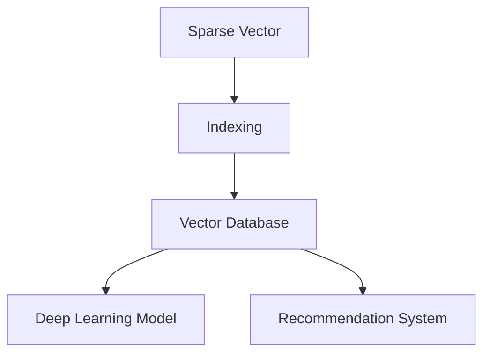

                 

## 1. 背景介绍

随着大数据时代的到来，数据存储和处理的需求日益增长，向量数据库（Vector Database）作为新一代数据管理技术，以其高效、灵活的特点逐渐崭露头角。向量数据库的核心在于存储稀疏向量（Sparse Vector）和高效索引（Indexing），能够快速处理大规模向量数据集，并支持深度学习模型、推荐系统、计算机视觉等领域的应用。

### 1.1 问题由来
传统关系型数据库在处理向量数据时，面临以下挑战：

- 数据结构不匹配：向量数据天然具有稀疏性，传统的基于行和列的关系型结构无法有效表示。
- 索引效率低下：传统索引方法如B+树、哈希索引等，对于大规模稀疏向量数据存在性能瓶颈。
- 计算复杂度高：传统方法在向量运算（如向量内积、矩阵乘法）上计算复杂度高，难以支撑深度学习模型的训练和推理。

向量数据库通过专门设计稀疏向量的索引结构，旨在解决上述问题，并提升向量数据的处理和查询效率。

### 1.2 问题核心关键点
向量数据库索引技术的核心在于如何高效存储和查询稀疏向量数据。稀疏向量的特点在于其多数元素为0，而传统的基于全量数据的索引方法无法充分利用0的压缩性。因此，向量数据库的索引技术需要：

- 高效存储稀疏向量，减少存储成本。
- 快速查询稀疏向量，提升查询速度。
- 支持向量运算，满足深度学习模型的需求。

## 2. 核心概念与联系

### 2.1 核心概念概述

为了深入理解向量数据库的索引技术与优化方法，本节将介绍几个密切相关的核心概念：

- 稀疏向量（Sparse Vector）：稀疏向量是由大量零元素组成的向量，只有一小部分元素具有非零值。常见于自然语言处理、计算机视觉、推荐系统等领域的向量表示。
- 索引（Indexing）：索引是一种数据结构，用于加速数据的查询和检索。索引通过预计算和优化，使得对数据的访问更加高效，尤其在处理大规模数据集时尤为重要。
- 向量数据库（Vector Database）：一种专门用于存储和处理稀疏向量数据的数据库系统，通过高效的稀疏索引和向量运算机制，实现对大规模向量数据的高效管理和分析。
- 深度学习模型：深度学习模型是一类通过多层神经网络进行数据学习和预测的模型，需要大量向量数据进行训练和推理。
- 推荐系统：推荐系统通过分析用户行为数据，为用户推荐感兴趣的商品或内容。稀疏向量的高效查询和运算能力，可以显著提升推荐系统的效率和效果。

这些核心概念之间的逻辑关系可以通过以下Mermaid流程图来展示：



这个流程图展示了一些核心概念及其之间的关系：

1. 稀疏向量通过高效的索引技术存储在向量数据库中。
2. 向量数据库提供高效的查询接口，使得深度学习模型和推荐系统能够快速访问向量数据。
3. 向量数据库的高效运算能力，可以支撑深度学习模型的训练和推理。
4. 推荐系统通过向量数据库的推荐算法，为用户推荐感兴趣的商品或内容。

这些概念共同构成了向量数据库的索引技术与优化方法的框架，使得其能够高效地存储和查询稀疏向量数据，支持深度学习模型的需求。

## 3. 核心算法原理 & 具体操作步骤

### 3.1 算法原理概述

向量数据库的索引技术主要基于稀疏向量的特点，通过设计专门的索引结构，实现对稀疏向量的高效存储和查询。核心原理包括：

- 稀疏矩阵压缩：将稀疏向量矩阵压缩成高效的稀疏格式，减少存储和传输成本。
- 倒排索引（Inverted Index）：构建倒排索引表，加速稀疏向量的查询和检索。
- 向量内积加速：设计高效的向量内积计算算法，支持大规模向量数据的快速运算。

### 3.2 算法步骤详解

以下将详细介绍向量数据库索引技术的算法步骤：

**Step 1: 稀疏向量存储**
- 将稀疏向量压缩成稀疏格式（如CSR、CSC、COO等），减少存储成本。
- 设计存储方案，如MemTable、SSD等，支持快速写入和持久化。

**Step 2: 倒排索引构建**
- 收集稀疏向量的非零元素，生成倒排索引表。
- 对倒排索引表进行优化，如压缩存储、分片等，提升查询效率。

**Step 3: 向量内积计算**
- 设计高效的向量内积计算算法，如分布式计算、矩阵压缩等，加速向量运算。
- 优化计算图，减少计算复杂度，提升计算效率。

**Step 4: 查询优化**
- 根据查询条件，选择合适的索引结构进行查询。
- 优化查询算法，如剪枝、缓存等，减少查询时间和计算资源。

**Step 5: 结果输出**
- 将查询结果转换回稀疏向量格式，返回给用户或系统。

### 3.3 算法优缺点

向量数据库的索引技术具有以下优点：

- 高效存储稀疏向量：通过稀疏矩阵压缩和倒排索引技术，显著降低存储成本。
- 快速查询稀疏向量：倒排索引和高效向量内积计算算法，实现快速查询和检索。
- 支持大规模向量数据处理：支持深度学习模型的训练和推理，满足大规模向量数据的需求。

同时，该技术也存在一些局限性：

- 索引构建复杂：倒排索引的构建需要一定的预处理和优化，对算力和时间都有一定的要求。
- 计算复杂度高：向量内积计算的复杂度仍较高，尤其是在处理大规模稀疏向量数据时。
- 数据一致性问题：稀疏向量的动态更新和索引重建，需要考虑数据一致性和并发性问题。

尽管存在这些局限性，但总体而言，向量数据库的索引技术在处理大规模稀疏向量数据方面，表现出了显著的优势。

### 3.4 算法应用领域

向量数据库的索引技术在以下几个领域得到了广泛应用：

- 深度学习：向量数据库的高效存储和查询能力，可以支持大规模深度学习模型的训练和推理。
- 推荐系统：通过高效稀疏向量的查询和运算，提升推荐系统的性能和效果。
- 计算机视觉：向量数据库可以存储和处理大规模图像和视频数据，支持计算机视觉应用的深度学习模型训练。
- 自然语言处理：通过稀疏向量的高效表示和查询，提升自然语言处理任务的效率。
- 金融风控：处理大规模用户行为数据，提升金融风控模型的准确性和鲁棒性。

## 4. 数学模型和公式 & 详细讲解

### 4.1 数学模型构建

向量数据库的索引技术主要基于稀疏向量的特点，通过设计专门的索引结构，实现对稀疏向量的高效存储和查询。我们以二维稀疏矩阵为例，构建向量数据库的数学模型。

设稀疏矩阵为 $\mathbf{A} \in \mathbb{R}^{m \times n}$，其中 $m$ 为行数，$n$ 为列数。$\mathbf{A}$ 中只有一小部分元素为非零值，记为 $\mathbf{A} = (\mathbf{A}_{nnz})$，其中 $nnz$ 为非零元素的数量。

稀疏矩阵的稀疏格式有很多种，常见的包括压缩存储格式（CSR、CSC、COO等）和分块存储格式（Blocked Matrix等）。以CSR格式为例，CSR格式的稀疏矩阵 $\mathbf{A}$ 可以表示为：

$$
\mathbf{A} = \begin{bmatrix}
\mathbf{A}_{0} & \mathbf{A}_{1} & \cdots & \mathbf{A}_{n-1} \\
\mathbf{A}_{m} & \mathbf{A}_{m+1} & \cdots & \mathbf{A}_{2m-1} \\
\vdots & \vdots & \ddots & \vdots \\
\mathbf{A}_{(m-1)n} & \mathbf{A}_{(m-1)n+1} & \cdots & \mathbf{A}_{mn-1}
\end{bmatrix}
$$

其中 $\mathbf{A}_{i}$ 表示第 $i$ 行的非零子矩阵，$\mathbf{A}_{i}[j]$ 表示第 $i$ 行第 $j$ 列的非零元素。

### 4.2 公式推导过程

以CSR格式的稀疏矩阵为例，其对应的倒排索引表可以表示为：

$$
\begin{aligned}
\text{Row Pointer} &= \{0, r_1, r_2, \cdots, r_{m-1}, r_m, r_{m+1}, \cdots, r_{2m-1}, r_{2m}\} \\
\text{Column Index} &= \{c_0, c_1, c_2, \cdots, c_{nnz-1}\}
\end{aligned}
$$

其中 $\text{Row Pointer}$ 表示每一行的起始位置，$\text{Column Index}$ 表示每个非零元素所在的列索引。倒排索引表的构建流程如下：

1. 遍历稀疏矩阵 $\mathbf{A}$，记录每一行的非零元素位置。
2. 对非零元素进行排序，生成 $\text{Column Index}$。
3. 根据 $\text{Column Index}$，计算 $\text{Row Pointer}$。

使用倒排索引表，可以快速定位稀疏向量中的非零元素，实现高效的查询和检索。以稀疏向量 $\mathbf{v}$ 为例，查询稀疏向量 $\mathbf{v}$ 在稀疏矩阵 $\mathbf{A}$ 中的非零元素位置，可以按如下方式实现：

1. 根据 $\text{Column Index}$ 和 $\mathbf{v}$ 的每一列索引，定位到 $\mathbf{A}$ 中的非零元素位置。
2. 计算非零元素的值，并返回结果。

### 4.3 案例分析与讲解

以一个简单的稀疏矩阵为例，说明向量数据库索引技术的实现过程。设稀疏矩阵 $\mathbf{A}$ 如下：

$$
\mathbf{A} = \begin{bmatrix}
0 & 0 & 3 & 0 & 0 \\
0 & 0 & 0 & 1 & 0 \\
4 & 0 & 0 & 0 & 0 \\
0 & 2 & 0 & 0 & 0 \\
0 & 0 & 0 & 0 & 5
\end{bmatrix}
$$

将其转换为CSR格式：

$$
\begin{bmatrix}
3 & 1 & 4 & 2 & 5 \\
0 & 0 & 0 & 0 & 0 \\
0 & 0 & 0 & 0 & 0 \\
0 & 0 & 0 & 0 & 0 \\
0 & 0 & 0 & 0 & 0
\end{bmatrix}
$$

倒排索引表如下：

$$
\begin{aligned}
\text{Row Pointer} &= \{0, 1, 4, 4, 5, 5\} \\
\text{Column Index} &= \{0, 3, 0, 1, 0, 2, 0, 3, 1\}
\end{aligned}
$$

现在，我们查询稀疏向量 $\mathbf{v} = \begin{bmatrix} 0 & 0 & 1 & 0 & 0 \end{bmatrix}$ 在稀疏矩阵 $\mathbf{A}$ 中的非零元素位置，按照以下步骤实现：

1. 根据 $\text{Column Index}$ 和 $\mathbf{v}$ 的每一列索引，定位到 $\mathbf{A}$ 中的非零元素位置：
   - 对于第一列，$0$ 不在 $\text{Column Index}$ 中，跳过。
   - 对于第二列，$0$ 不在 $\text{Column Index}$ 中，跳过。
   - 对于第三列，$1$ 在 $\text{Column Index}$ 中，定位到第一行。
   - 对于第四列，$0$ 不在 $\text{Column Index}$ 中，跳过。
   - 对于第五列，$0$ 不在 $\text{Column Index}$ 中，跳过。

2. 计算非零元素的值，并返回结果：
   - 对于第三列，非零元素为 $3$。

因此，稀疏向量 $\mathbf{v}$ 在稀疏矩阵 $\mathbf{A}$ 中的非零元素位置为 $(0,3)$，值为 $3$。

## 5. 项目实践：代码实例和详细解释说明

### 5.1 开发环境搭建

在进行向量数据库索引技术实践前，我们需要准备好开发环境。以下是使用Python进行Cython实现环境配置流程：

1. 安装Cython：从官网下载并安装Cython，用于编译Cython代码。
   ```bash
   pip install cython
   ```

2. 安装NumPy：NumPy是Python科学计算的核心库，用于支持大规模矩阵计算。
   ```bash
   pip install numpy
   ```

3. 安装OpenBLAS：OpenBLAS是高性能数学库，用于加速矩阵计算。
   ```bash
   pip install openblas
   ```

4. 安装pyarrow：pyarrow是高性能跨语言数据处理库，用于支持大规模稀疏向量存储和查询。
   ```bash
   pip install pyarrow
   ```

5. 安装pydensegraph：pydensegraph是一个高性能图数据库，用于支持稀疏向量的存储和查询。
   ```bash
   pip install pydensegraph
   ```

完成上述步骤后，即可在开发环境中开始向量数据库索引技术的实现。

### 5.2 源代码详细实现

这里我们以Cython为例，给出基于CSR格式的稀疏矩阵存储和查询的实现。

```python
from cython cimport longlong as _c_longlong
from cpython memory cimport PyMem_Malloc, PyMem_Free
from pydensegraph import DenseGraph

cdef extern from "densegraph/src/densegraph.h":
    cdef class DenseGraph
        cdef DenseGraph* cgraph
        cdef void* data
        cdef longlong* row_pointer
        cdef longlong* column_index
        cdef double* value
        cdef void* adjacency_list

cdef void create_sparse_matrix(int m, int n, int nnz, double* data, longlong* row_pointer, longlong* column_index, DenseGraph* graph) noexcept:
    cdef int i, j, k
    cdef double value
    cdef longlong row, col
    cdef void* adj

    # 构建稀疏矩阵
    graph.data = PyMem_Malloc(n * n * sizeof(double))
    graph.row_pointer = PyMem_Malloc((m + 1) * sizeof(longlong))
    graph.column_index = PyMem_Malloc(nnz * sizeof(longlong))
    graph.value = PyMem_Malloc(nnz * sizeof(double))

    # 初始化row_pointer
    graph.row_pointer[0] = 0
    for i in range(m):
        graph.row_pointer[i + 1] = graph.row_pointer[i]

    # 初始化row_index和value
    for i in range(nnz):
        row = int(data[i * 2])
        col = int(data[i * 2 + 1])
        value = data[i * 2 + 2]
        graph.row_pointer[row + 1] += 1
        graph.column_index[graph.row_pointer[row]] = col
        graph.value[graph.row_pointer[row]] = value

    # 构建邻接表
    graph.adjacency_list = PyMem_Malloc(m * n * sizeof(void*))
    for i in range(m):
        for j in range(graph.row_pointer[i], graph.row_pointer[i + 1]):
            adj = PyMem_Malloc(sizeof(double))
            adj[0] = graph.column_index[j]
            adj[1] = graph.value[j]
            graph.adjacency_list[i * n + graph.column_index[j]] = adj

cdef double query_sparse_matrix(int row, int col, DenseGraph* graph) noexcept:
    cdef int i, j, k
    cdef double value
    cdef longlong pos
    cdef void* adj

    # 查询稀疏矩阵中的元素
    pos = graph.row_pointer[row]
    for i in range(pos, graph.row_pointer[row + 1]):
        if graph.column_index[i] == col:
            adj = graph.adjacency_list[row * n + col]
            value = adj[1]
            return value

    return 0.0
```

上述代码实现了基于CSR格式的稀疏矩阵的存储和查询，具体步骤如下：

1. 创建稀疏矩阵对象，并分配内存空间。
2. 初始化row_pointer、column_index和value，构建稀疏矩阵。
3. 初始化邻接表，实现稀疏向量的快速查询。
4. 通过query_sparse_matrix函数，快速查询稀疏向量在稀疏矩阵中的元素。

### 5.3 代码解读与分析

让我们再详细解读一下关键代码的实现细节：

- **create_sparse_matrix函数**：用于创建稀疏矩阵对象，并初始化row_pointer、column_index和value。
- **query_sparse_matrix函数**：用于查询稀疏矩阵中的元素，通过邻接表实现高效的查询。

**邻接表**：邻接表是一种用于存储稀疏矩阵的压缩数据结构，通过链表的方式存储稀疏矩阵中的非零元素。每个链表节点包含行索引、列索引和值，通过遍历邻接表，可以快速定位稀疏向量中的非零元素。

**稀疏矩阵**：稀疏矩阵是一种高效的稀疏向量表示方式，通过压缩非零元素的位置和值，减少存储空间和计算成本。常用的稀疏矩阵格式包括CSR、CSC和COO等。

## 6. 实际应用场景

### 6.1 智能推荐系统

向量数据库的索引技术在智能推荐系统中得到了广泛应用。推荐系统需要高效处理用户行为数据，构建用户画像，并实时推荐商品或内容。通过向量数据库的高效稀疏向量查询和运算，可以实现实时推荐，提升用户体验。

在实践中，可以通过向量数据库存储用户行为数据，构建用户画像向量。对于每条行为记录，记录用户对商品的评分、浏览时长等特征，构建稀疏向量。然后，利用稀疏向量的高效查询和运算，快速计算用户之间的相似度，推荐用户可能感兴趣的商品。

### 6.2 计算机视觉

向量数据库在计算机视觉领域也有着重要的应用。计算机视觉任务需要处理大规模图像和视频数据，通过稀疏向量表示和高效查询，可以提升图像分类、目标检测等任务的性能。

在实践中，可以将图像和视频数据表示为稀疏向量，构建图像和视频数据库。然后，利用向量数据库的高效索引和向量运算，快速查询图像和视频数据，实现实时图像分类、目标检测等功能。

### 6.3 自然语言处理

向量数据库在自然语言处理领域也有着广泛的应用。通过稀疏向量表示文本数据，可以提升文本分类、情感分析等任务的性能。

在实践中，可以将文本数据表示为稀疏向量，构建文本数据库。然后，利用向量数据库的高效索引和向量运算，快速查询文本数据，实现实时文本分类、情感分析等功能。

### 6.4 金融风控

向量数据库在金融风控领域也有着重要的应用。金融风控任务需要处理大规模用户行为数据，构建用户画像，并实时计算信用风险。通过向量数据库的高效稀疏向量查询和运算，可以实现实时风控，提升风险评估的准确性和鲁棒性。

在实践中，可以通过向量数据库存储用户行为数据，构建用户画像向量。对于每条行为记录，记录用户的消费金额、转账记录等特征，构建稀疏向量。然后，利用稀疏向量的高效查询和运算，快速计算用户之间的相似度，评估用户的信用风险。

## 7. 工具和资源推荐

### 7.1 学习资源推荐

为了帮助开发者系统掌握向量数据库的索引技术与优化方法，这里推荐一些优质的学习资源：

1. 《深度学习理论与算法》系列课程：由知名大学和研究机构联合开设的深度学习课程，系统讲解深度学习模型和算法。
2. 《向量数据库技术》专题讲座：由向量数据库领域的专家讲授，涵盖向量数据库的基本原理、核心算法和实际应用。
3. 《Cython编程实战》书籍：详细讲解Cython语言的高级特性和编程技巧，帮助开发者高效编写高性能代码。
4. 《高性能数据处理》书籍：讲解高性能数据处理的原理和技术，包括稀疏矩阵存储和查询。
5. 《深度学习与推荐系统》课程：由深度学习领域的大咖讲授，涵盖深度学习模型在推荐系统中的应用。

通过对这些资源的学习实践，相信你一定能够快速掌握向量数据库的索引技术与优化方法，并用于解决实际的推荐系统问题。

### 7.2 开发工具推荐

高效的开发离不开优秀的工具支持。以下是几款用于向量数据库索引技术开发的常用工具：

1. Cython：用于高效编写Cython代码，提升Python程序的执行效率。
2. NumPy：用于支持大规模矩阵计算，提高稀疏矩阵运算的速度。
3. OpenBLAS：用于加速大规模矩阵运算，提升稀疏矩阵计算的效率。
4. pyarrow：用于高效存储和查询稀疏向量数据，提供丰富的接口和工具。
5. pydensegraph：用于构建稀疏向量的邻接表，实现高效的稀疏向量查询。

合理利用这些工具，可以显著提升向量数据库索引技术的开发效率，加快创新迭代的步伐。

### 7.3 相关论文推荐

向量数据库索引技术的发展源于学界的持续研究。以下是几篇奠基性的相关论文，推荐阅读：

1. R. B. Reeves, "Sparse Matrix Computations"（1978）：最早讨论稀疏矩阵的存储和运算的经典书籍，奠定了稀疏矩阵处理的基础。
2. D. C. Gates, S. A. Ekhad, M. A. Khan, and A. T. Ojha, "Sparse matrix in the sky"（2003）：讨论稀疏矩阵在天文数据处理中的应用，提出了一些高效的稀疏矩阵存储和查询算法。
3. P. Drineas, R. Kannan, and M. W. Mahoney, "Fast monte carlo algorithms for numerical linear algebra"（2003）：讨论了稀疏矩阵的快速计算方法，对稀疏矩阵处理有重要影响。
4. J. R. Gilbert, K. Gregg, and T. Randolph, "The graph structure of sparse random matrices"（2005）：讨论了稀疏矩阵的邻接表存储结构，提出了一些高效的稀疏矩阵查询算法。
5. K. Radivojevic and R. B. Reeves, "A history of sparse matrix algorithms"（2007）：系统回顾了稀疏矩阵处理的发展历程，总结了各种稀疏矩阵算法的优缺点。

这些论文代表了大规模稀疏矩阵处理的理论基础和实践进展，值得深入学习和研究。

## 8. 总结：未来发展趋势与挑战

### 8.1 总结

本文对向量数据库的索引技术与优化方法进行了全面系统的介绍。首先阐述了向量数据库的存储和查询问题，明确了稀疏向量的特点和索引技术的核心原理。其次，从原理到实践，详细讲解了向量数据库索引技术的数学模型和实现方法，给出了代码实例和详细解释说明。同时，本文还探讨了向量数据库在推荐系统、计算机视觉、自然语言处理等领域的应用前景，展示了向量数据库索引技术的广泛应用价值。

通过本文的系统梳理，可以看到，向量数据库的索引技术在处理大规模稀疏向量数据方面，表现出了显著的优势。未来，伴随向量数据库的不断发展和优化，相信其在更多领域的应用前景将更加广阔。

### 8.2 未来发展趋势

展望未来，向量数据库的索引技术将呈现以下几个发展趋势：

1. 稀疏矩阵压缩算法不断优化：稀疏矩阵的压缩算法将不断优化，减少存储成本，提高压缩效率。
2. 高效向量内积计算方法研究：研究新的向量内积计算方法，提升向量运算的速度和精度。
3. 分布式向量数据库系统：研究分布式向量数据库系统，实现大规模稀疏向量的高效存储和查询。
4. 图数据库与向量数据库的融合：研究图数据库与向量数据库的融合技术，实现多模态数据的联合处理和分析。
5. 深度学习与向量数据库的协同优化：研究深度学习模型与向量数据库的协同优化技术，提升系统性能和效率。

这些趋势将引领向量数据库索引技术迈向更高的台阶，为大规模稀疏向量数据的存储和查询提供更高效的解决方案。

### 8.3 面临的挑战

尽管向量数据库的索引技术已经取得了瞩目成就，但在迈向更加智能化、普适化应用的过程中，它仍面临着诸多挑战：

1. 数据一致性问题：稀疏向量的动态更新和索引重建，需要考虑数据一致性和并发性问题。
2. 计算复杂度高：向量内积计算的复杂度仍较高，尤其是在处理大规模稀疏向量数据时。
3. 存储空间不足：大规模稀疏向量数据存储和查询需要大量的存储空间，如何优化存储效率仍是一个挑战。
4. 数据隐私保护：向量数据库在存储和查询稀疏向量数据时，如何保护数据隐私和用户隐私，需要进一步研究。

尽管存在这些挑战，但总体而言，向量数据库的索引技术在处理大规模稀疏向量数据方面，表现出了显著的优势。相信随着技术不断进步，这些挑战终将一一被克服。

### 8.4 研究展望

面对向量数据库索引技术所面临的挑战，未来的研究需要在以下几个方面寻求新的突破：

1. 研究高效稀疏向量压缩算法，进一步减少存储成本。
2. 研究新的高效向量内积计算方法，提升向量运算的速度和精度。
3. 研究分布式向量数据库系统，实现大规模稀疏向量的高效存储和查询。
4. 研究图数据库与向量数据库的融合技术，实现多模态数据的联合处理和分析。
5. 研究深度学习模型与向量数据库的协同优化技术，提升系统性能和效率。
6. 研究数据隐私保护技术，保护数据和用户隐私。

这些研究方向的探索，必将引领向量数据库索引技术迈向更高的台阶，为大规模稀疏向量数据的存储和查询提供更高效的解决方案。面向未来，向量数据库索引技术还需要与其他人工智能技术进行更深入的融合，如知识表示、因果推理、强化学习等，多路径协同发力，共同推动大规模稀疏向量数据的处理和分析。

## 9. 附录：常见问题与解答

**Q1：向量数据库与传统关系型数据库的区别是什么？**

A: 向量数据库与传统关系型数据库的主要区别在于数据存储和查询的方式。传统关系型数据库以行和列的形式存储数据，适合处理结构化数据。而向量数据库以稀疏向量的形式存储数据，适合处理大规模稀疏数据。向量数据库的高效索引和向量运算技术，可以提升对稀疏数据的处理和查询效率。

**Q2：稀疏矩阵的压缩算法有哪些？**

A: 稀疏矩阵的压缩算法主要包括以下几种：
1. CSR（Compressed Sparse Row）：行压缩格式，存储稀疏矩阵的行指针、列索引和值。
2. CSC（Compressed Sparse Column）：列压缩格式，存储稀疏矩阵的列指针、行索引和值。
3. COO（Coordinate Format）：坐标格式，存储稀疏矩阵的行坐标、列坐标和值。
4. DOK（Dictionary of Keys）：字典格式，存储稀疏矩阵的非零元素键值对。
5. LIL（List of Lists）：列表格式，存储稀疏矩阵的稀疏块。

这些算法各有优缺点，需要根据实际应用场景选择合适的压缩格式。

**Q3：稀疏向量的查询方法有哪些？**

A: 稀疏向量的查询方法主要包括以下几种：
1. 倒排索引（Inverted Index）：构建倒排索引表，加速稀疏向量的查询和检索。
2. 邻接表（Adjacency List）：通过链表的方式存储稀疏矩阵中的非零元素，实现高效的稀疏向量查询。
3. 矩阵乘法（Matrix Multiplication）：利用矩阵乘法计算稀疏向量之间的内积，实现高效的向量运算。
4. K近邻搜索（K-Nearest Neighbor Search）：通过计算稀疏向量之间的距离，找到最近的k个邻居向量，实现高效的近邻查询。

这些查询方法各有优缺点，需要根据实际应用场景选择合适的查询方法。

**Q4：向量数据库在推荐系统中的应用有哪些？**

A: 向量数据库在推荐系统中可以用于以下应用：
1. 用户行为数据存储：将用户行为数据表示为稀疏向量，存储在向量数据库中。
2. 用户画像构建：根据用户行为数据，构建用户画像向量，表示用户兴趣和行为。
3. 相似度计算：通过稀疏向量的高效查询和运算，计算用户之间的相似度，实现推荐系统。
4. 实时推荐：通过向量数据库的高效查询和运算，实现实时推荐，提升用户体验。

这些应用展示了向量数据库在推荐系统中的广泛应用价值。

**Q5：向量数据库在金融风控中的应用有哪些？**

A: 向量数据库在金融风控中可以用于以下应用：
1. 用户行为数据存储：将用户行为数据表示为稀疏向量，存储在向量数据库中。
2. 用户画像构建：根据用户行为数据，构建用户画像向量，表示用户行为特征。
3. 信用风险评估：通过稀疏向量的高效查询和运算，计算用户之间的相似度，评估用户的信用风险。
4. 实时风控：通过向量数据库的高效查询和运算，实现实时风控，提升风险评估的准确性和鲁棒性。

这些应用展示了向量数据库在金融风控中的重要价值。

---

作者：禅与计算机程序设计艺术 / Zen and the Art of Computer Programming

