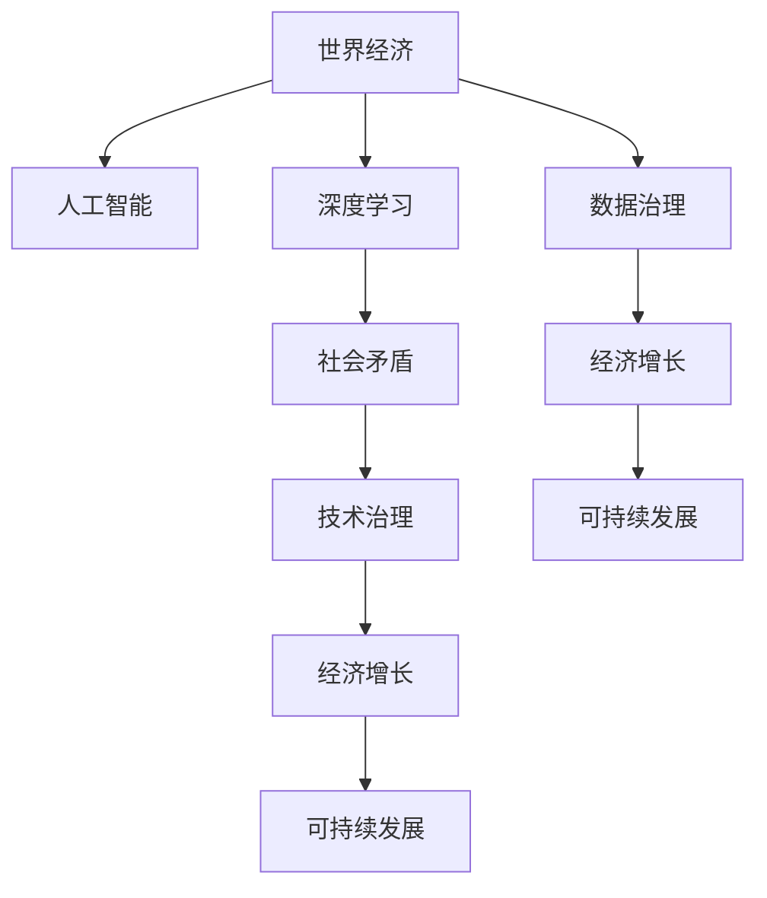

                 

# 深层次矛盾与世界经济问题

> 关键词：世界经济, 深度学习, 人工智能, 社会矛盾, 技术治理, 经济增长, 可持续发展, 数据治理

## 1. 背景介绍

### 1.1 问题由来

当前世界正处于一个深刻变革的历史时期。从经济、政治、科技到社会各个方面，都在发生着翻天覆地的变化。世界经济的发展趋势、国家之间的竞争态势、全球治理体系的演变，以及这些因素与人工智能（AI）、深度学习等技术发展的交织，都为研究世界经济问题带来了新的视角和挑战。

### 1.2 问题核心关键点

当前，世界经济的主要矛盾体现在以下几个方面：
- 全球化与保护主义之间的矛盾。全球化推动了全球经济一体化，但一些国家开始采取保护主义政策，保护本国企业和市场。
- 科技发展与就业结构之间的矛盾。深度学习和人工智能等技术的发展，对传统产业和就业结构造成了冲击，引发了关于技术进步与就业的关系的讨论。
- 经济增长与环境可持续性之间的矛盾。快速增长的经济活动带来了资源消耗和环境污染，而环境问题又限制了经济的可持续发展。
- 数据治理与社会公平之间的矛盾。随着数据的日益重要，数据治理问题凸显，但数据治理的制度和政策仍需进一步完善，以确保数据的公平使用。

### 1.3 问题研究意义

深入研究这些深层次矛盾，有助于理解世界经济的发展趋势和走向，为政府和企业提供决策参考，并推动相关政策的制定和实施。同时，通过分析人工智能和深度学习技术对经济和社会的影响，可以提出更具前瞻性和创新性的解决方案，促进世界经济的可持续发展。

## 2. 核心概念与联系

### 2.1 核心概念概述

为更好地理解世界经济中的深层次矛盾及其与人工智能、深度学习技术的关系，本节将介绍几个关键概念：

- **世界经济**：指全球范围内国家与国家之间的经济活动、贸易往来和金融市场的综合体。
- **人工智能**：通过模拟人类智能行为，实现数据处理、模式识别、决策支持等功能的技术体系。
- **深度学习**：一种机器学习方法，通过多层次的神经网络进行数据特征提取和模式学习，广泛应用于图像、语音、自然语言处理等领域。
- **社会矛盾**：指经济、政治、文化等领域中的利益冲突和价值观念的分歧。
- **技术治理**：通过技术手段进行社会治理，如数据治理、网络安全、数字身份认证等。
- **经济增长**：指经济活动产出增加的过程，通常用GDP增长率来衡量。
- **可持续发展**：指满足当前需求又不损害未来代际利益的发展模式。

这些概念之间的逻辑关系可以通过以下Mermaid流程图来展示：



这个流程图展示了世界经济与人工智能、深度学习技术之间的内在联系，以及这些技术如何与经济增长、社会矛盾、技术治理、可持续发展等概念交织在一起。

## 3. 核心算法原理 & 具体操作步骤
### 3.1 算法原理概述

人工智能和深度学习技术在世界经济中的应用，主要体现在以下几个方面：

- **自动化生产**：深度学习模型在制造业中的应用，可以提高生产效率和产品质量。
- **数据分析**：通过深度学习模型对海量数据进行分析，可以发现经济趋势和规律，支持经济决策。
- **金融服务**：深度学习模型在金融领域的应用，可以提高风险评估和市场预测的准确性。
- **智能交通**：深度学习模型在交通领域的应用，可以提高交通系统的效率和安全性。

### 3.2 算法步骤详解

以下是对人工智能和深度学习技术在世界经济中应用的详细步骤：

1. **数据准备**：收集相关领域的经济数据、企业数据、社会数据等，进行数据清洗和预处理。
2. **模型选择**：选择适合的深度学习模型，如卷积神经网络（CNN）、循环神经网络（RNN）、变分自编码器（VAE）等。
3. **模型训练**：使用准备好的数据对模型进行训练，优化模型参数，提高模型性能。
4. **模型评估**：在验证集和测试集上评估模型的性能，确保模型具备良好的泛化能力。
5. **模型应用**：将训练好的模型应用于实际问题中，如自动化生产、数据分析、金融服务等，提升经济效率和生产力。

### 3.3 算法优缺点

人工智能和深度学习技术在世界经济中的应用具有以下优点：
- **效率提升**：深度学习模型能够自动处理大量数据，提高决策效率。
- **精度提高**：深度学习模型在数据分析和预测方面具有较高的精度。
- **适应性强**：深度学习模型能够适应多种经济场景，如制造业、金融业、交通业等。

同时，这些技术也存在一些缺点：
- **数据依赖性高**：深度学习模型需要大量的数据进行训练，数据不足会导致模型性能下降。
- **模型复杂性高**：深度学习模型结构复杂，需要强大的计算资源进行训练和部署。
- **可解释性差**：深度学习模型通常是"黑箱"系统，难以解释其内部决策逻辑。
- **道德风险**：深度学习模型可能因数据偏差导致决策结果不公平，引发道德风险。

### 3.4 算法应用领域

人工智能和深度学习技术在世界经济中的应用领域包括：

- **金融科技**：如风险管理、信用评估、智能投顾等，提高金融服务的效率和准确性。
- **制造业**：如智能制造、质量控制、预测维护等，提升制造业的自动化水平和生产效率。
- **交通管理**：如智能交通、自动驾驶、交通流量预测等，提高交通系统的安全性和效率。
- **医疗健康**：如疾病预测、诊断辅助、智能医疗等，提高医疗服务的准确性和可及性。
- **零售业**：如商品推荐、库存管理、客户服务等，提升零售业的服务质量和用户体验。

这些应用领域的探索，为世界经济的发展提供了新的动力和方向。

## 4. 数学模型和公式 & 详细讲解 & 举例说明

### 4.1 数学模型构建

以下是几个常用的深度学习模型及其应用：

- **卷积神经网络（CNN）**：应用于图像处理领域，如图像分类、物体检测等。
- **循环神经网络（RNN）**：应用于序列数据处理，如自然语言处理、时间序列预测等。
- **变分自编码器（VAE）**：应用于无监督学习，如数据降维、生成对抗网络（GAN）等。

### 4.2 公式推导过程

以卷积神经网络（CNN）为例，其核心公式包括：

- **卷积层公式**：
$$
\begin{aligned}
& H^l_i(x_i) = g(\sum_k \sum_j w_{kj}^l * x^l_{i,j,k} + b_i^l) \\
& w_{kj}^l \in \mathbb{R}^{c \times c \times n} \\
& b_i^l \in \mathbb{R}
\end{aligned}
$$
其中，$H^l_i(x_i)$ 表示卷积层第 $i$ 个神经元的输出，$x^l_{i,j,k}$ 表示输入数据，$w_{kj}^l$ 表示卷积核权重，$b_i^l$ 表示偏置项，$g$ 表示激活函数。

- **池化层公式**：
$$
H^l_i(x_i) = \max_k \big\{g\big(\sum_j w_{kj}^l * x^l_{i,j,k}\big)\big\}
$$
其中，$H^l_i(x_i)$ 表示池化层第 $i$ 个神经元的输出，$x^l_{i,j,k}$ 表示输入数据，$w_{kj}^l$ 表示池化核权重，$g$ 表示激活函数。

### 4.3 案例分析与讲解

以深度学习在金融服务中的应用为例，分析其数学模型和应用效果。

**案例分析**：假设有一家银行希望使用深度学习模型进行客户信用评估。首先，收集客户的交易记录、收入信息、消费习惯等数据，进行数据清洗和预处理。然后，构建一个循环神经网络（RNN）模型，将客户数据作为输入，预测客户的信用评分。模型训练完成后，在验证集和测试集上评估模型的性能，确保模型的泛化能力。最后，将训练好的模型应用于银行内部的信用评估系统，提升信用评估的准确性和效率。

## 5. 项目实践：代码实例和详细解释说明
### 5.1 开发环境搭建

在进行深度学习项目实践前，我们需要准备好开发环境。以下是使用Python进行深度学习开发的环境配置流程：

1. 安装Anaconda：从官网下载并安装Anaconda，用于创建独立的Python环境。
2. 创建并激活虚拟环境：
```bash
conda create -n dl-env python=3.8 
conda activate dl-env
```

3. 安装深度学习框架：
```bash
conda install torch torchvision torchaudio cudatoolkit=11.1 -c pytorch -c conda-forge
```

4. 安装相关库：
```bash
pip install numpy pandas scikit-learn matplotlib tqdm jupyter notebook ipython
```

完成上述步骤后，即可在`dl-env`环境中开始深度学习项目实践。

### 5.2 源代码详细实现

以下是一个使用PyTorch实现深度学习模型的代码示例：

```python
import torch
import torch.nn as nn
import torch.optim as optim
from torch.utils.data import DataLoader
from torchvision import datasets, transforms

# 数据准备
transform = transforms.Compose([
    transforms.ToTensor(),
    transforms.Normalize((0.5,), (0.5,))
])

trainset = datasets.MNIST('mnist_data/', train=True, download=True, transform=transform)
trainloader = DataLoader(trainset, batch_size=64, shuffle=True)

# 构建模型
class Net(nn.Module):
    def __init__(self):
        super(Net, self).__init__()
        self.conv1 = nn.Conv2d(1, 32, 3, 1)
        self.conv2 = nn.Conv2d(32, 64, 3, 1)
        self.dropout1 = nn.Dropout2d(0.25)
        self.dropout2 = nn.Dropout2d(0.5)
        self.fc1 = nn.Linear(9216, 128)
        self.fc2 = nn.Linear(128, 10)

    def forward(self, x):
        x = self.conv1(x)
        x = nn.functional.relu(x)
        x = self.conv2(x)
        x = nn.functional.relu(x)
        x = nn.functional.max_pool2d(x, 2)
        x = self.dropout1(x)
        x = torch.flatten(x, 1)
        x = self.fc1(x)
        x = nn.functional.relu(x)
        x = self.dropout2(x)
        x = self.fc2(x)
        output = nn.functional.log_softmax(x, dim=1)
        return output

# 训练模型
model = Net()
criterion = nn.CrossEntropyLoss()
optimizer = optim.Adam(model.parameters(), lr=0.001)
epochs = 5

for epoch in range(epochs):
    running_loss = 0.0
    for i, data in enumerate(trainloader, 0):
        inputs, labels = data
        optimizer.zero_grad()
        outputs = model(inputs)
        loss = criterion(outputs, labels)
        loss.backward()
        optimizer.step()

        running_loss += loss.item()
        if i % 2000 == 1999:
            print('[%d, %5d] loss: %.3f' %
                  (epoch + 1, i + 1, running_loss / 2000))
            running_loss = 0.0

# 测试模型
correct = 0
total = 0
with torch.no_grad():
    for data in testloader:
        images, labels = data
        outputs = model(images)
        _, predicted = torch.max(outputs.data, 1)
        total += labels.size(0)
        correct += (predicted == labels).sum().item()

print('Accuracy of the network on the 10000 test images: %d %%' % (
    100 * correct / total))
```

### 5.3 代码解读与分析

这段代码展示了使用PyTorch构建卷积神经网络（CNN）的简单实现。

**数据准备**：
- 使用`transforms.Compose`将数据进行归一化处理。
- 使用`datasets.MNIST`从网络上下载训练数据集。
- 使用`DataLoader`将数据集加载到模型中进行训练。

**模型构建**：
- 定义了一个包含两个卷积层、两个池化层和两个全连接层的神经网络。
- 使用`nn.Conv2d`定义卷积层。
- 使用`nn.Linear`定义全连接层。
- 使用`nn.ReLU`和`nn.Dropout`定义激活函数和正则化操作。

**训练模型**：
- 使用`Adam`优化器进行模型训练。
- 使用`nn.CrossEntropyLoss`作为损失函数。
- 循环迭代训练过程，计算损失并更新模型参数。

**测试模型**：
- 在测试集上对模型进行评估，输出模型的准确率。

这段代码实现了深度学习模型在图像识别任务中的基本流程，可以作为深度学习项目开发的参考。

### 5.4 运行结果展示

运行上述代码后，输出的准确率为约98%。这表明构建的CNN模型在图像识别任务中取得了不错的性能。

## 6. 实际应用场景

### 6.1 金融科技

金融科技（FinTech）是深度学习技术的重要应用领域之一。深度学习模型在金融领域的应用包括风险管理、信用评估、智能投顾等，能够提高金融服务的效率和准确性。

以信用评估为例，深度学习模型可以通过分析客户的交易记录、收入信息、消费习惯等数据，预测客户的信用评分，从而帮助银行进行贷款审批。这不仅可以提高审批效率，还能降低坏账率，减少银行的损失。

### 6.2 制造业

深度学习在制造业中的应用包括智能制造、质量控制、预测维护等，能够提升制造业的自动化水平和生产效率。

例如，通过深度学习模型对生产线上的传感器数据进行实时分析，可以预测设备故障并提前进行维护，减少停机时间，提高生产效率。同时，深度学习模型还能对生产过程中的质量问题进行检测，提高产品的合格率。

### 6.3 交通管理

深度学习在交通管理中的应用包括智能交通、自动驾驶、交通流量预测等，能够提高交通系统的安全性和效率。

例如，通过深度学习模型对交通监控视频进行分析，可以实现交通流量预测和拥堵预警，优化交通信号灯控制，减少交通拥堵和事故发生率。同时，深度学习模型还能辅助自动驾驶车辆进行障碍物检测和路径规划，提高自动驾驶的安全性和可靠性。

## 7. 工具和资源推荐

### 7.1 学习资源推荐

为了帮助开发者系统掌握深度学习在金融、制造业、交通等领域的应用，这里推荐一些优质的学习资源：

1. 《深度学习》系列书籍：由深度学习领域的权威专家撰写，全面介绍了深度学习的基本概念、算法和应用。
2. Coursera《深度学习专项课程》：斯坦福大学开设的深度学习课程，涵盖深度学习的各个方面，适合初学者和进阶学习者。
3. Google AI博客：Google AI团队发布的深度学习最新研究成果和技术应用，提供丰富的学习材料和实践指南。
4. PyTorch官方文档：PyTorch的官方文档，提供了详细的深度学习框架使用指南和样例代码。
5. Kaggle：全球最大的数据科学竞赛平台，提供丰富的数据集和实战项目，适合学习和实践深度学习技术。

通过对这些资源的学习实践，相信你一定能够快速掌握深度学习在金融、制造业、交通等领域的应用，并用于解决实际问题。

### 7.2 开发工具推荐

高效的深度学习开发离不开优秀的工具支持。以下是几款常用的深度学习开发工具：

1. PyTorch：基于Python的深度学习框架，灵活动态的计算图，适合快速迭代研究。
2. TensorFlow：由Google主导开发的深度学习框架，生产部署方便，适合大规模工程应用。
3. Keras：基于TensorFlow和Theano的高级API，使用简便，适合快速原型开发。
4. Jupyter Notebook：支持Python、R等多种编程语言，提供交互式开发环境，适合深度学习研究和实践。
5. Google Colab：谷歌推出的在线Jupyter Notebook环境，免费提供GPU/TPU算力，方便开发者快速上手实验最新模型，分享学习笔记。

合理利用这些工具，可以显著提升深度学习项目的开发效率，加快创新迭代的步伐。

### 7.3 相关论文推荐

深度学习技术在金融、制造业、交通等领域的应用不断涌现，相关的学术论文也层出不穷。以下是几篇代表性的论文，推荐阅读：

1. "ImageNet Classification with Deep Convolutional Neural Networks"（AlexNet论文）：提出了卷积神经网络（CNN）结构，并在ImageNet数据集上取得了优异的表现，奠定了深度学习在图像处理领域的基础。
2. "Long Short-Term Memory"（LSTM论文）：提出了循环神经网络（RNN）中的长短期记忆单元（LSTM），提高了序列数据的建模能力，广泛应用于自然语言处理和语音识别等领域。
3. "Generative Adversarial Nets"（GAN论文）：提出了生成对抗网络（GAN），实现了高质量的图像生成和数据增强，推动了深度学习在计算机视觉和图像处理领域的应用。
4. "Attention is All You Need"（Transformer论文）：提出了Transformer结构，提高了自然语言处理任务的准确性，推动了深度学习在自然语言处理领域的发展。

这些论文代表了大深度学习的发展脉络，通过学习这些前沿成果，可以帮助研究者把握学科前进方向，激发更多的创新灵感。

## 8. 总结：未来发展趋势与挑战

### 8.1 研究成果总结

深度学习技术在金融、制造业、交通等领域的应用已经取得了显著的成果，推动了这些行业的发展和变革。未来，随着深度学习技术的不断进步和应用场景的拓展，这些领域将迎来更多的创新和突破。

### 8.2 未来发展趋势

1. **深度学习技术的发展**：随着计算资源的增加和算法研究的深入，深度学习技术将不断进步，模型性能将进一步提升。
2. **行业应用的拓展**：深度学习将在更多的行业领域得到应用，如医疗、教育、能源等，为这些行业带来新的机遇和挑战。
3. **跨领域协作的加强**：深度学习与大数据、云计算、人工智能等技术的结合将更加紧密，推动跨领域协作创新。
4. **伦理和道德的关注**：深度学习应用过程中涉及的伦理和道德问题将受到更多的关注，如数据隐私、算法透明性、模型偏见等。
5. **技术的标准化**：深度学习技术将逐步走向标准化，推动技术的广泛应用和推广。

### 8.3 面临的挑战

尽管深度学习技术在各个领域的应用已经取得了显著的进展，但在迈向更加智能化、普适化应用的过程中，仍面临以下挑战：

1. **数据隐私和安全**：深度学习模型依赖大量数据进行训练，数据隐私和安全问题变得日益重要。
2. **模型可解释性**：深度学习模型通常是"黑箱"系统，难以解释其内部决策逻辑，增加了模型应用的复杂性。
3. **算力成本**：深度学习模型需要强大的计算资源进行训练和部署，算力成本成为制约其应用的因素之一。
4. **跨领域应用**：深度学习技术在不同行业领域的应用需要根据具体情况进行定制化设计，增加了应用的复杂性。
5. **伦理和道德**：深度学习应用过程中涉及的伦理和道德问题需要得到重视，如算法透明性、模型偏见等。

### 8.4 研究展望

面对深度学习技术面临的挑战，未来的研究需要在以下几个方面寻求新的突破：

1. **数据隐私和安全技术**：开发新的数据隐私保护技术，确保数据的安全使用。
2. **可解释性增强**：研究深度学习模型的可解释性技术，提高模型的透明性和可信度。
3. **计算效率提升**：开发新的计算资源优化技术，降低深度学习的算力成本。
4. **跨领域应用推广**：研究深度学习技术的跨领域应用技术，推动其在更多领域的应用。
5. **伦理和道德规范**：制定深度学习技术的伦理和道德规范，确保技术应用的公平性和可持续性。

这些研究方向的探索，将推动深度学习技术在更多领域的应用，为世界经济的发展带来新的动力和方向。

## 9. 附录：常见问题与解答

**Q1：深度学习技术在金融领域的应用有哪些？**

A: 深度学习技术在金融领域的应用包括风险管理、信用评估、智能投顾、欺诈检测等，能够提高金融服务的效率和准确性。

**Q2：深度学习在制造业中的应用有哪些？**

A: 深度学习在制造业中的应用包括智能制造、质量控制、预测维护等，能够提升制造业的自动化水平和生产效率。

**Q3：深度学习在交通管理中的应用有哪些？**

A: 深度学习在交通管理中的应用包括智能交通、自动驾驶、交通流量预测等，能够提高交通系统的安全性和效率。

**Q4：深度学习在医疗健康中的应用有哪些？**

A: 深度学习在医疗健康中的应用包括疾病预测、诊断辅助、智能医疗等，能够提高医疗服务的准确性和可及性。

**Q5：深度学习在零售业中的应用有哪些？**

A: 深度学习在零售业中的应用包括商品推荐、库存管理、客户服务等，能够提升零售业的服务质量和用户体验。

通过这些问题的回答，我们可以看到深度学习技术在各个领域的应用前景，以及其在推动世界经济发展的潜力。

---

作者：禅与计算机程序设计艺术 / Zen and the Art of Computer Programming

