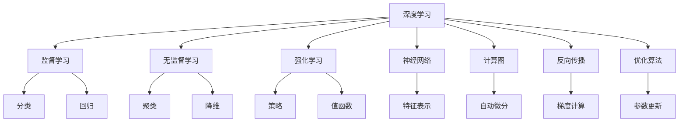

                 

# 深度学习在机器学习中的作用

> 关键词：深度学习,机器学习,监督学习,无监督学习,强化学习,神经网络,计算图,反向传播,优化算法

## 1. 背景介绍

### 1.1 问题由来

随着人工智能技术的快速发展，机器学习（Machine Learning, ML）在诸多领域中得到了广泛应用。从自然语言处理、计算机视觉到语音识别、推荐系统，机器学习算法不断刷新各类任务的性能上限，推动了各行各业的智能化进程。然而，传统的机器学习算法如逻辑回归、决策树、支持向量机等，其训练和优化过程往往依赖于手工设计的特征工程，需要大量经验和方法论的积累。这一过程耗时耗力，难以应对海量数据带来的挑战。

在21世纪初，深度学习（Deep Learning, DL）技术的提出，极大地改变了机器学习领域的格局。深度学习通过构建多层次的非线性模型，自动从数据中学习特征表示，显著提升了算法的表达能力和泛化性能。特别是近年来，深度学习在大规模数据集上的训练，如ImageNet、COCO等，使得模型性能迅速提升，让机器学习算法在诸多领域实现了突破性进展。

本论文将围绕深度学习在机器学习中的作用展开讨论，全面剖析深度学习技术的基本原理、核心算法及其在实际应用中的关键步骤。通过从背景介绍入手，读者可以更好地理解深度学习的优势、挑战以及未来发展方向。

### 1.2 问题核心关键点

深度学习在机器学习中的作用主要体现在以下几个方面：

1. **强大的特征表示能力**：深度学习模型通过多层次的神经网络结构，可以自动提取和表示数据中的复杂特征，避免了手工特征工程的繁琐工作。
2. **高效的非线性建模**：深度学习模型可以通过反向传播算法自动优化参数，实现对非线性关系的建模，提升了模型的表达能力和泛化性能。
3. **广泛的应用范围**：深度学习技术已经成功应用于计算机视觉、自然语言处理、语音识别、推荐系统等多个领域，成为机器学习的主要范式之一。
4. **持续的创新与发展**：深度学习算法不断演进，从早期的浅层网络到当前的卷积神经网络（CNN）、循环神经网络（RNN）、变分自编码器（VAE）等，模型结构和训练方法不断创新，推动了机器学习技术的进步。

深度学习在机器学习中的作用已经逐渐成为学术界和工业界的研究热点，其技术优势和广泛应用，使得深度学习在机器学习领域的重要性日益凸显。

## 2. 核心概念与联系

### 2.1 核心概念概述

在探讨深度学习在机器学习中的作用前，首先需要了解一些核心概念，包括深度学习、机器学习、监督学习、无监督学习、强化学习、神经网络、计算图、反向传播、优化算法等。

- **深度学习（Deep Learning）**：一种基于神经网络的机器学习方法，通过多层次的神经网络结构，实现对复杂数据的建模和表示。
- **机器学习（Machine Learning）**：一种通过数据驱动算法，让计算机从数据中学习和改进的技术，包括监督学习、无监督学习和强化学习等多种形式。
- **监督学习（Supervised Learning）**：一种有标签训练的方式，模型通过学习标注数据，预测新的未标注数据。
- **无监督学习（Unsupervised Learning）**：一种无标签训练的方式，模型通过发现数据的内在结构，进行聚类、降维等任务。
- **强化学习（Reinforcement Learning）**：一种通过奖励和惩罚，使模型在环境中进行交互学习的方式。
- **神经网络（Neural Network）**：一种模拟人脑神经元结构的网络模型，通过多层非线性变换实现对数据的表示和分类。
- **计算图（Computation Graph）**：一种用于描述神经网络模型计算过程的数据结构，通过自动微分技术实现高效计算。
- **反向传播（Backpropagation）**：一种通过链式法则计算神经网络梯度的方法，用于优化模型参数。
- **优化算法（Optimization Algorithm）**：一种用于优化模型参数的算法，包括梯度下降、Adam、Adagrad等。

这些概念之间的逻辑关系可以通过以下Mermaid流程图进行展示：



通过这张流程图，我们可以看到深度学习在机器学习中的核心地位和作用：

1. 深度学习模型可以通过监督学习、无监督学习和强化学习等多种方式进行训练，实现各种类型的任务。
2. 深度学习模型主要由神经网络构成，通过计算图和反向传播算法实现高效计算。
3. 优化算法是深度学习模型训练的基础，用于优化模型参数。
4. 深度学习模型在特征表示、非线性建模等方面具有天然优势，推动了机器学习技术的进步。

## 3. 核心算法原理 & 具体操作步骤

### 3.1 算法原理概述

深度学习在机器学习中的作用，核心在于其强大的特征表示能力和高效的非线性建模能力。深度学习模型通常由多个层次的神经网络构成，每个层次通过非线性变换对输入数据进行处理，最终得到高层次的特征表示。这些特征表示不仅能够捕捉数据中的复杂关系，还能提高模型的泛化能力，使其在新的未见数据上表现良好。

具体而言，深度学习模型通常通过反向传播算法进行训练。反向传播算法通过链式法则，计算模型输出与真实标签之间的误差，并沿着计算图反向传播误差，更新模型参数。这一过程使得深度学习模型能够自适应地调整模型结构，自动提取和表示数据中的复杂特征，从而实现高效的数据建模。

### 3.2 算法步骤详解

深度学习模型的训练过程通常包括以下关键步骤：

**Step 1: 准备数据集**

1. 收集和预处理数据：收集有标签和无标签数据集，进行数据清洗、归一化等预处理操作。
2. 划分训练集、验证集和测试集：将数据集划分为训练集、验证集和测试集，用于模型训练、调参和评估。

**Step 2: 构建模型架构**

1. 选择合适的神经网络架构：根据任务类型选择合适的神经网络架构，如卷积神经网络（CNN）、循环神经网络（RNN）、变分自编码器（VAE）等。
2. 定义模型层次：将神经网络划分为多个层次，每个层次通过非线性变换对输入数据进行处理。
3. 设置超参数：设置学习率、批大小、迭代轮数等超参数，用于控制模型的训练过程。

**Step 3: 训练模型**

1. 数据加载：使用DataLoader等工具加载训练集数据，将数据分批次输入模型。
2. 前向传播：将数据输入模型，通过多层非线性变换计算模型输出。
3. 计算损失：计算模型输出与真实标签之间的误差，得到损失函数。
4. 反向传播：使用反向传播算法计算梯度，更新模型参数。
5. 评估模型：在验证集上评估模型性能，根据性能指标调整超参数。
6. 重复迭代：重复上述步骤，直至模型收敛。

**Step 4: 测试和部署**

1. 测试模型：在测试集上评估模型性能，计算精度、召回率等指标。
2. 部署模型：将模型部署到实际应用场景中，进行推理预测。

### 3.3 算法优缺点

深度学习在机器学习中的作用显著，但也存在一些局限性：

**优点**：
1. 强大的特征表示能力：深度学习模型通过多层次的非线性变换，自动提取数据中的复杂特征，避免了手工特征工程的繁琐工作。
2. 高效的非线性建模：深度学习模型可以通过反向传播算法优化参数，实现对非线性关系的建模，提升了模型的表达能力和泛化性能。
3. 广泛的应用范围：深度学习技术已经成功应用于计算机视觉、自然语言处理、语音识别、推荐系统等多个领域，成为机器学习的主要范式之一。
4. 持续的创新与发展：深度学习算法不断演进，从早期的浅层网络到当前的卷积神经网络（CNN）、循环神经网络（RNN）、变分自编码器（VAE）等，模型结构和训练方法不断创新，推动了机器学习技术的进步。

**缺点**：
1. 计算资源需求高：深度学习模型通常需要大量的计算资源进行训练和推理，特别是大规模模型和高精度模型，训练成本较高。
2. 过拟合风险高：深度学习模型面临过拟合风险，特别是在标注数据不足的情况下，模型容易在训练集上过拟合，泛化性能下降。
3. 模型解释性差：深度学习模型通常被视为“黑盒”系统，难以解释其内部工作机制和决策逻辑，不利于模型调试和应用。
4. 数据质量要求高：深度学习模型对数据质量的要求较高，数据清洗和预处理需要耗费大量时间和精力，数据分布的偏差也会影响模型性能。

尽管存在这些局限性，但深度学习在机器学习中的作用已经不可忽视，其强大的性能和广泛的应用前景，使得深度学习在机器学习领域的重要性日益凸显。

### 3.4 算法应用领域

深度学习在机器学习中的作用，体现在多个应用领域：

**计算机视觉**：深度学习在图像分类、目标检测、语义分割等方面取得了显著的进展，如ImageNet、COCO等大规模数据集上的模型性能提升，使得计算机视觉技术广泛应用于自动驾驶、医学影像分析等领域。

**自然语言处理**：深度学习在文本分类、情感分析、机器翻译等方面取得了突破性进展，如BERT、GPT等预训练模型，显著提升了自然语言处理的性能，推动了智能客服、智能问答、智能写作等领域的发展。

**语音识别**：深度学习在语音识别领域取得了重大突破，通过端到端的语音识别模型，实现了高精度的语音转文本，广泛应用于智能音箱、语音助手等场景。

**推荐系统**：深度学习在推荐系统领域取得了显著的性能提升，通过协同过滤和深度学习模型的结合，推荐系统能够更好地理解用户兴趣，提供个性化的推荐结果。

此外，深度学习还在游戏AI、金融预测、医疗诊断等多个领域得到了广泛应用，推动了各行各业的智能化进程。

## 4. 数学模型和公式 & 详细讲解 & 举例说明

### 4.1 数学模型构建

深度学习模型通常由神经网络构成，每个神经元通过加权和、非线性激活函数和偏置项实现对输入数据的处理。以一个简单的全连接神经网络为例，其数学模型可以表示为：

$$
\mathbf{y} = \sigma(\mathbf{Wx} + \mathbf{b})
$$

其中，$\mathbf{y}$为输出向量，$\mathbf{x}$为输入向量，$\mathbf{W}$为权重矩阵，$\mathbf{b}$为偏置向量，$\sigma$为激活函数（如ReLU、Sigmoid、Tanh等）。

对于更复杂的模型如卷积神经网络（CNN）和循环神经网络（RNN），其数学模型也类似，通过多层非线性变换实现对输入数据的处理。

### 4.2 公式推导过程

以一个简单的全连接神经网络为例，其反向传播算法可以表示为：

1. 计算模型输出
$$
\mathbf{y} = \sigma(\mathbf{Wx} + \mathbf{b})
$$

2. 计算损失函数
$$
\mathcal{L} = \frac{1}{N}\sum_{i=1}^N \ell(y_i, \hat{y}_i)
$$

其中，$\ell$为损失函数，如均方误差（MSE）、交叉熵（CE）等。

3. 计算梯度
$$
\frac{\partial \mathcal{L}}{\partial \mathbf{W}} = \frac{\partial \mathcal{L}}{\partial \mathbf{y}} \frac{\partial \mathbf{y}}{\partial \mathbf{W}} = \frac{\partial \mathcal{L}}{\partial \mathbf{y}} (\mathbf{x} + \mathbf{b} \frac{\partial \sigma}{\partial \mathbf{y}})
$$

4. 更新模型参数
$$
\mathbf{W} \leftarrow \mathbf{W} - \eta \frac{\partial \mathcal{L}}{\partial \mathbf{W}}, \quad \mathbf{b} \leftarrow \mathbf{b} - \eta \frac{\partial \mathcal{L}}{\partial \mathbf{b}}
$$

其中，$\eta$为学习率，$\sigma$为激活函数。

### 4.3 案例分析与讲解

以一个简单的全连接神经网络为例，我们对反向传播算法进行详细讲解。假设输入向量为$\mathbf{x}$，权重矩阵为$\mathbf{W}$，偏置向量为$\mathbf{b}$，激活函数为$\sigma$，损失函数为$\mathcal{L}$。

1. 前向传播：将输入向量$\mathbf{x}$通过权重矩阵$\mathbf{W}$和偏置向量$\mathbf{b}$，计算模型输出$\mathbf{y} = \sigma(\mathbf{Wx} + \mathbf{b})$。

2. 计算损失函数：假设模型输出与真实标签之间存在误差，计算损失函数$\mathcal{L} = \frac{1}{N}\sum_{i=1}^N \ell(y_i, \hat{y}_i)$，其中$\ell$为损失函数，如均方误差（MSE）、交叉熵（CE）等。

3. 计算梯度：根据链式法则，计算损失函数对权重矩阵$\mathbf{W}$和偏置向量$\mathbf{b}$的梯度，得到$\frac{\partial \mathcal{L}}{\partial \mathbf{W}}$和$\frac{\partial \mathcal{L}}{\partial \mathbf{b}}$。

4. 更新模型参数：根据梯度下降等优化算法，更新权重矩阵$\mathbf{W}$和偏置向量$\mathbf{b}$，使得模型在后续的训练过程中能够更好地拟合数据。

通过以上步骤，深度学习模型能够自动从数据中学习特征表示，实现高效的非线性建模和数据处理。

## 5. 项目实践：代码实例和详细解释说明

### 5.1 开发环境搭建

在进行深度学习模型训练前，需要准备好开发环境。以下是使用Python进行TensorFlow开发的环境配置流程：

1. 安装Anaconda：从官网下载并安装Anaconda，用于创建独立的Python环境。

2. 创建并激活虚拟环境：
```bash
conda create -n tf-env python=3.8 
conda activate tf-env
```

3. 安装TensorFlow：根据CUDA版本，从官网获取对应的安装命令。例如：
```bash
conda install tensorflow -c tensorflow -c conda-forge
```

4. 安装必要的库：
```bash
pip install numpy pandas matplotlib scikit-learn tqdm jupyter notebook
```

完成上述步骤后，即可在`tf-env`环境中开始深度学习模型训练。

### 5.2 源代码详细实现

下面以一个简单的全连接神经网络为例，展示深度学习模型训练的Python代码实现。

```python
import tensorflow as tf
import numpy as np
import matplotlib.pyplot as plt

# 定义模型
class NeuralNetwork(tf.keras.Model):
    def __init__(self):
        super(NeuralNetwork, self).__init__()
        self.dense1 = tf.keras.layers.Dense(64, activation='relu')
        self.dense2 = tf.keras.layers.Dense(10, activation='softmax')
    
    def call(self, x):
        x = self.dense1(x)
        return self.dense2(x)

# 加载数据
x_train = np.random.rand(1000, 784)
y_train = np.random.randint(0, 10, (1000, 1))

# 构建模型
model = NeuralNetwork()

# 定义损失函数和优化器
loss_fn = tf.keras.losses.SparseCategoricalCrossentropy(from_logits=True)
optimizer = tf.keras.optimizers.Adam(learning_rate=0.001)

# 训练模型
for epoch in range(50):
    with tf.GradientTape() as tape:
        logits = model(x_train)
        loss_value = loss_fn(y_train, logits)
    
    gradients = tape.gradient(loss_value, model.trainable_variables)
    optimizer.apply_gradients(zip(gradients, model.trainable_variables))
    
    if (epoch + 1) % 10 == 0:
        print(f'Epoch {epoch+1}, Loss: {loss_value:.4f}')
        
# 测试模型
x_test = np.random.rand(100, 784)
y_test = np.random.randint(0, 10, (100, 1))

with tf.GradientTape() as tape:
    logits = model(x_test)
    predictions = tf.argmax(logits, axis=1)

accuracy = tf.reduce_mean(tf.cast(tf.equal(predictions, y_test), dtype=tf.float32))
print(f'Test Accuracy: {accuracy:.4f}')
```

### 5.3 代码解读与分析

让我们再详细解读一下关键代码的实现细节：

**NeuralNetwork类**：
- `__init__`方法：定义模型的层次结构，包括输入层、隐藏层和输出层。
- `call`方法：定义模型前向传播的计算过程，通过多个Dense层实现多层非线性变换。

**加载数据**：
- 生成随机的训练集和测试集，用于模型训练和评估。

**模型定义**：
- 定义一个简单的全连接神经网络模型，包含两个Dense层，中间使用ReLU激活函数。

**损失函数和优化器**：
- 使用SparseCategoricalCrossentropy作为损失函数，用于计算模型输出与真实标签之间的交叉熵。
- 使用Adam优化器，设置学习率为0.001。

**模型训练**：
- 在每个epoch中，将训练集数据输入模型，计算损失值并反向传播更新模型参数。
- 每10个epoch输出一次损失值，用于监控模型训练过程。

**模型测试**：
- 生成随机的测试集，用于模型评估。
- 计算模型在测试集上的准确率，并输出结果。

通过以上代码，可以看出深度学习模型的训练过程相对简单，只需要定义模型架构、选择损失函数和优化器，然后通过前向传播和反向传播实现模型训练。

## 6. 实际应用场景

### 6.1 计算机视觉

深度学习在计算机视觉领域的应用广泛，推动了自动驾驶、医学影像分析、安防监控等多个领域的发展。

**自动驾驶**：深度学习模型可以用于图像分类、目标检测、语义分割等任务，帮助自动驾驶系统识别道路、车辆、行人等目标，实现安全、高效的自动驾驶。

**医学影像分析**：深度学习模型可以用于图像分割、病灶识别等任务，帮助医生对医学影像进行快速、准确的分析诊断，提高医疗水平。

**安防监控**：深度学习模型可以用于人脸识别、行为分析等任务，帮助安防系统识别可疑行为，提升安全性。

### 6.2 自然语言处理

深度学习在自然语言处理领域的应用也非常广泛，推动了智能客服、智能问答、智能写作等多个领域的发展。

**智能客服**：深度学习模型可以用于文本分类、对话生成等任务，帮助智能客服系统理解用户意图，生成自然流畅的回复，提高用户体验。

**智能问答**：深度学习模型可以用于问题回答、知识检索等任务，帮助智能问答系统快速、准确地回答用户问题，提供知识服务。

**智能写作**：深度学习模型可以用于文本生成、摘要生成等任务，帮助智能写作系统自动生成文章、新闻等文本内容，提升内容创作效率。

### 6.3 语音识别

深度学习在语音识别领域的应用也取得了重大突破，推动了智能音箱、语音助手等场景的发展。

**智能音箱**：深度学习模型可以用于语音识别、自然语言处理等任务，帮助智能音箱系统理解用户语音指令，提供语音控制、智能助手等功能。

**语音助手**：深度学习模型可以用于语音识别、对话生成等任务，帮助语音助手系统理解用户语音指令，生成自然流畅的回复，提供智能助手功能。

### 6.4 未来应用展望

未来，深度学习在机器学习中的作用将进一步凸显，其技术优势和应用范围也将不断拓展。

**计算机视觉**：随着计算资源的增加和深度学习模型的演进，计算机视觉技术的性能将进一步提升，推动自动驾驶、医学影像分析等领域的创新发展。

**自然语言处理**：深度学习在自然语言处理领域的应用将更加深入，推动智能客服、智能问答、智能写作等场景的发展，提升人机交互的智能化水平。

**语音识别**：深度学习在语音识别领域的应用也将更加广泛，推动智能音箱、语音助手等场景的发展，提升语音交互的便捷性和智能化水平。

**其他领域**：深度学习技术也将拓展到更多领域，如金融预测、游戏AI、医疗诊断等，推动各行各业的智能化进程。

## 7. 工具和资源推荐

### 7.1 学习资源推荐

为了帮助开发者系统掌握深度学习在机器学习中的作用，这里推荐一些优质的学习资源：

1. 《深度学习》（Ian Goodfellow, Yoshua Bengio, Aaron Courville）：深度学习领域的经典教材，全面介绍了深度学习的基本原理、核心算法和应用案例。
2. CS231n《深度学习视觉与模式识别》课程：斯坦福大学开设的深度学习视觉课程，涵盖图像分类、目标检测、语义分割等多个主题。
3. Deep Learning Specialization课程：由Andrew Ng等人开设的深度学习专项课程，涵盖深度学习的基础和应用，适合初学者和进阶者。
4. TensorFlow官方文档：TensorFlow的官方文档，提供丰富的学习资源和样例代码，适合深度学习模型的开发和优化。
5. PyTorch官方文档：PyTorch的官方文档，提供详细的学习资源和样例代码，适合深度学习模型的开发和优化。

通过对这些资源的学习实践，相信你一定能够全面掌握深度学习在机器学习中的作用，并用于解决实际的深度学习问题。

### 7.2 开发工具推荐

高效的开发离不开优秀的工具支持。以下是几款用于深度学习模型开发的常用工具：

1. TensorFlow：由Google主导开发的深度学习框架，支持分布式计算，适合大规模模型训练和部署。
2. PyTorch：由Facebook主导开发的深度学习框架，支持动态图和静态图，适合研究和原型开发。
3. Keras：基于TensorFlow和Theano的高级深度学习框架，提供了简单易用的API，适合快速原型开发和模型训练。
4. MXNet：由Amazon主导开发的深度学习框架，支持分布式计算和多种编程语言，适合工业级应用。
5. JAX：基于JIT编译的深度学习框架，支持自动微分和向量化的计算图，适合高效计算和模型优化。

合理利用这些工具，可以显著提升深度学习模型的开发效率，加快创新迭代的步伐。

### 7.3 相关论文推荐

深度学习在机器学习中的作用研究源于学界的持续研究。以下是几篇奠基性的相关论文，推荐阅读：

1. Deep Blue: A New Generation of Chess Playing Machine（1997）：Deep Blue的开发，标志着深度学习在复杂决策问题上的成功应用。
2. ImageNet Classification with Deep Convolutional Neural Networks（2012）：ImageNet数据集上的深度学习模型，展示了深度学习在图像分类任务上的突破性进展。
3. Sequence to Sequence Learning with Neural Networks（2014）：深度学习在机器翻译任务上的突破，展示了序列到序列学习的强大能力。
4. Google's Neural Machine Translation System: Bridging the Gap Between Human and Machine Translation（2016）：Google的神经机器翻译系统，展示了深度学习在自然语言处理任务上的重大进展。
5. Attention is All You Need（2017）：Transformer模型的提出，展示了深度学习在序列建模任务上的新范式。

这些论文代表了大深度学习在机器学习中的作用研究的发展脉络。通过学习这些前沿成果，可以帮助研究者把握学科前进方向，激发更多的创新灵感。

## 8. 总结：未来发展趋势与挑战

### 8.1 研究成果总结

深度学习在机器学习中的作用已经得到了广泛的认可和应用，其强大的特征表示能力和高效的非线性建模能力，推动了机器学习技术在计算机视觉、自然语言处理、语音识别等多个领域的突破性进展。深度学习模型在图像分类、目标检测、机器翻译、对话生成等任务上取得了优异的性能，推动了智能应用的发展。

### 8.2 未来发展趋势

未来，深度学习在机器学习中的作用将持续深化，其技术优势和应用范围也将进一步拓展。以下是深度学习在机器学习中的未来发展趋势：

**更高效的学习算法**：深度学习算法将不断演进，引入更多的学习范式和优化方法，如自适应学习率、元学习、强化学习等，提高模型训练效率和效果。

**更智能的模型设计**：深度学习模型将更加智能和灵活，引入更多的结构化和无结构化数据，提高模型泛化能力和自适应能力。

**更广泛的应用领域**：深度学习技术将拓展到更多领域，如金融预测、游戏AI、医疗诊断等，推动各行各业的智能化进程。

**更强的解释能力**：深度学习模型将更加注重可解释性，通过引入因果推断、博弈论等工具，提高模型决策的透明性和可信度。

**更高的安全性和可靠性**：深度学习模型将更加注重安全性和可靠性，通过引入对抗样本、隐私保护等技术，提高模型鲁棒性和安全性。

### 8.3 面临的挑战

尽管深度学习在机器学习中的作用已经取得显著进展，但仍面临一些挑战：

**计算资源需求高**：深度学习模型通常需要大量的计算资源进行训练和推理，特别是在大规模模型和高精度模型的情况下，训练成本较高。

**过拟合风险高**：深度学习模型面临过拟合风险，特别是在标注数据不足的情况下，模型容易在训练集上过拟合，泛化性能下降。

**模型解释性差**：深度学习模型通常被视为“黑盒”系统，难以解释其内部工作机制和决策逻辑，不利于模型调试和应用。

**数据质量要求高**：深度学习模型对数据质量的要求较高，数据清洗和预处理需要耗费大量时间和精力，数据分布的偏差也会影响模型性能。

**伦理和安全问题**：深度学习模型可能学习到有偏见、有害的信息，通过微调传递到下游任务，产生误导性、歧视性的输出，给实际应用带来安全隐患。

### 8.4 研究展望

未来，深度学习在机器学习中的作用还需要在多个方面进行深入研究：

**更高效的模型压缩和优化**：通过模型裁剪、量化、稀疏化等技术，提高深度学习模型的计算效率和存储效率，降低计算成本。

**更智能的特征表示学习**：通过引入更多的先验知识和结构化数据，提高深度学习模型的泛化能力和自适应能力。

**更强的可解释性和鲁棒性**：通过引入因果推断、博弈论等工具，提高深度学习模型的解释性和鲁棒性，增强系统的可信度。

**更全面的伦理和安全保障**：通过引入隐私保护、数据脱敏等技术，保障深度学习模型的伦理和安全，避免模型偏见和滥用。

这些研究方向将推动深度学习技术在机器学习中的作用进一步深化，为构建更加智能、可靠、安全的人工智能系统提供有力支撑。面向未来，深度学习技术将在更多领域发挥重要作用，为人类认知智能的进化带来深远影响。

## 9. 附录：常见问题与解答

**Q1：深度学习模型是如何进行特征表示学习的？**

A: 深度学习模型通过多层非线性变换对输入数据进行处理，自动提取和表示数据中的复杂特征。在模型训练过程中，通过反向传播算法优化模型参数，使得模型能够自适应地调整特征表示，学习到数据的高层次抽象特征。这些特征不仅能够捕捉数据中的复杂关系，还能提高模型的泛化性能，使其在新的未见数据上表现良好。

**Q2：深度学习模型训练过程中如何避免过拟合？**

A: 深度学习模型训练过程中，过拟合是常见的问题。为避免过拟合，可以采用以下策略：
1. 数据增强：通过对训练数据进行旋转、平移、裁剪等操作，扩充训练数据集，减少过拟合风险。
2. 正则化：使用L2正则、Dropout等方法，限制模型复杂度，减少过拟合风险。
3. 早停法：在模型训练过程中，监测验证集的性能，当性能不再提升时停止训练，避免过拟合。
4. 批量归一化：通过批量归一化技术，使模型参数的分布更加稳定，减少过拟合风险。

**Q3：深度学习模型的计算效率如何提高？**

A: 提高深度学习模型的计算效率，可以从以下几个方面入手：
1. 模型压缩：通过模型裁剪、量化、稀疏化等技术，减小模型参数量，提高计算效率。
2. 分布式计算：通过分布式训练和推理，利用多台计算机的计算资源，提高模型训练和推理速度。
3. 硬件优化：通过GPU、TPU等高性能计算设备，提高模型计算效率。
4. 算法优化：通过改进优化算法，提高模型训练速度，如使用Adam、Adagrad等优化器。

**Q4：深度学习模型在实际应用中需要注意哪些问题？**

A: 深度学习模型在实际应用中，需要注意以下问题：
1. 模型裁剪：去除不必要的层和参数，减小模型尺寸，提高推理速度。
2. 量化加速：将浮点模型转为定点模型，压缩存储空间，提高计算效率。
3. 服务化封装：将模型封装为标准化服务接口，便于集成调用。
4. 弹性伸缩：根据请求流量动态调整资源配置，平衡服务质量和成本。
5. 监控告警：实时采集系统指标，设置异常告警阈值，确保服务稳定性。

**Q5：如何评估深度学习模型的性能？**

A: 评估深度学习模型的性能，通常从以下几个方面入手：
1. 准确率：计算模型在测试集上的分类准确率，衡量模型对新数据的预测能力。
2. 召回率：计算模型在测试集上的召回率，衡量模型对正例的识别能力。
3. F1分数：计算准确率和召回率的调和平均值，综合衡量模型的分类性能。
4. 均方误差（MSE）：计算模型在回归任务上的均方误差，衡量模型对连续值预测的精度。
5. 交叉熵（CE）：计算模型在分类任务上的交叉熵，衡量模型对离散值预测的精度。

通过以上评估指标，可以全面了解深度学习模型的性能表现，并进行优化和改进。

---

作者：禅与计算机程序设计艺术 / Zen and the Art of Computer Programming

